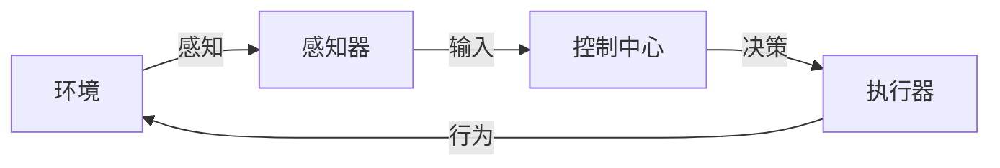

# AI Agent构建的技术要点

## 1. 背景介绍

### 1.1 问题的由来

在当今快速发展的数字时代，人工智能(AI)已经成为推动科技创新和社会进步的核心动力之一。AI系统的构建和部署已经渗透到了我们生活的方方面面,从智能助理和聊天机器人,到自动驾驶汽车和智能制造等领域。然而,构建一个高效、可靠和安全的AI Agent系统并非一蹴而就,需要综合考虑多个技术层面的挑战。

### 1.2 研究现状

近年来,AI Agent的研究和应用取得了长足的进步,尤其是在机器学习、自然语言处理、计算机视觉等领域的突破性发展。但同时,也面临着诸多技术难题,例如:

- 如何设计高效的算法架构,实现AI Agent的实时响应和决策?
- 如何确保AI Agent的行为符合预期,避免出现不确定性和安全隐患?
- 如何使AI Agent具备自主学习和持续优化的能力,适应复杂多变的环境?
- 如何解决AI Agent在部署过程中的可扩展性、鲁棒性和隐私保护等问题?

### 1.3 研究意义

构建高质量的AI Agent系统对于推动人工智能技术的发展和应用具有重要意义。一方面,它可以为各行业提供智能化解决方案,提高效率、降低成本、优化资源利用;另一方面,也为人工智能算法和模型的创新提供了实践验证的平台。此外,研究AI Agent构建的技术要点,有助于规范AI系统的开发流程,提高系统的可靠性和安全性,促进人工智能技术的健康发展。

### 1.4 本文结构

本文将全面介绍AI Agent构建的核心技术要点,包括:

1. 核心概念与联系
2. 核心算法原理与具体操作步骤
3. 数学模型和公式详细讲解与案例分析
4. 项目实践:代码实例和详细解释说明
5. 实际应用场景和未来展望
6. 工具和资源推荐
7. 总结:未来发展趋势与挑战
8. 附录:常见问题与解答

## 2. 核心概念与联系

在深入探讨AI Agent构建的技术细节之前,我们需要先了解一些核心概念及其相互联系。

### 2.1 智能体(Agent)

智能体是指在某个环境中感知和行动的任何实体,旨在实现特定目标。在AI领域,智能体通常是指具有一定智能的软件程序或机器人系统。

智能体的核心组成部分包括:

- **感知器(Sensor)**: 用于获取环境信息的模块
- **执行器(Actuator)**: 用于对环境进行操作的模块
- **控制中心**: 根据感知信息做出决策,并发出指令控制执行器的模块

智能体与环境之间是一个持续的交互过程,如下图所示:

### 2.2 Agent架构

Agent架构描述了智能体的总体设计和组件之间的关系,是构建AI Agent系统的蓝图和框架。常见的Agent架构有:

- **简单反射Agent**: 基于条件-行为规则的最简单Agent架构
- **基于模型的Agent**: 利用内部状态模型对环境进行推理和规划
- **基于目标的Agent**: 根据预设目标制定行为序列
- **基于效用的Agent**: 基于效用理论,选择能够最大化预期效用的行为
- **学习Agent**: 具备自主学习和优化的能力,可以从经验中获取知识

不同的Agent架构适用于不同的应用场景和任务需求。选择合适的架构对于构建高效、可靠的AI Agent系统至关重要。

### 2.3 Agent环境

Agent环境是指智能体所处的外部世界,包括可观测的状态和智能体可执行的动作空间。根据环境的特征,可以将其分为以下几类:

- **完全可观测 vs 部分可观测**
- **确定性 vs 随机性**
- **静态 vs 动态**
- **离散 vs 连续**
- **单智能体 vs 多智能体**

环境的特征决定了Agent所面临的挑战和需要采用的算法策略。例如,在部分可观测且动态随机的环境中,Agent需要具备学习和推理的能力,以有效地处理不确定性。

### 2.4 Agent交互

Agent与环境之间的交互过程可以用一个序列来描述:

$$\text{Sequence} = \mathcal{O}, \mathcal{A}, \mathcal{O}', \mathcal{A}', \mathcal{O}'', ...$$

其中,$\mathcal{O}$表示Agent的观测,$\mathcal{A}$表示Agent的行为。Agent根据当前观测$\mathcal{O}$选择一个行为$\mathcal{A}$,环境则根据这个行为转移到新的状态,并产生新的观测$\mathcal{O}'$,如此循环往复。

这种交互模式被广泛应用于强化学习、规划和决策过程等AI算法中,是构建智能Agent系统的基础。

## 3. 核心算法原理与具体操作步骤

构建AI Agent系统需要综合运用多种算法和技术,本节将重点介绍其中的核心算法原理和具体操作步骤。

### 3.1 算法原理概述

#### 3.1.1 搜索算法

搜索算法是AI Agent中最基本和最常用的一类算法,用于在给定的状态空间中寻找到达目标状态的路径。常见的搜索算法包括:

- **无信息搜索**: 广度优先搜索、深度优先搜索等
- **启发式搜索**: 贪心搜索、A*搜索等
- **局部搜索**: 爬山算法、模拟退火等

搜索算法可以应用于规划、推理、决策等多个领域,是AI Agent系统的重要组成部分。

#### 3.1.2 机器学习算法

机器学习算法赋予了AI Agent自主学习和优化的能力,使其能够从数据中获取知识,并不断提高自身的性能。常见的机器学习算法有:

- **监督学习**: 线性回归、逻辑回归、支持向量机、决策树、神经网络等
- **无监督学习**: 聚类算法、降维算法、关联规则挖掘等
- **强化学习**: Q-Learning、Sarsa、策略梯度等
- **迁移学习**: 通过迁移已学习的知识来加速新任务的学习

机器学习算法可以赋予AI Agent在特定任务上的智能,是构建智能系统的关键技术。

#### 3.1.3 规划算法

规划算法用于生成一系列行为,以实现特定目标。在AI Agent系统中,规划算法常常与搜索算法和机器学习算法相结合,用于制定行为决策。常见的规划算法包括:

- **经典规划**: 状态空间规划、层次任务网络规划等
- **时序规划**: 时间约束满足问题、简单时序规划问题等
- **概率规划**: 马尔可夫决策过程、部分可观测马尔可夫决策过程等

规划算法为AI Agent提供了目标导向的行为控制能力,是实现智能决策的核心。

#### 3.1.4 多智能体系统算法

在许多实际应用场景中,AI Agent需要与其他智能体协作或竞争,这就需要多智能体系统算法来协调和控制多个智能体之间的交互。常见的多智能体系统算法包括:

- **分布式约束优化算法**
- **博弈论算法**
- **拍卖算法**
- **共识算法**

多智能体系统算法为AI Agent提供了在复杂环境中高效协作的能力,是实现智能集体行为的关键。

### 3.2 算法步骤详解

接下来,我们将详细介绍几种核心算法的具体操作步骤。

#### 3.2.1 A*搜索算法

A*搜索算法是一种广泛应用的启发式搜索算法,可以有效地在状态空间中寻找最优解。它的基本思想是:在每一步中,选择估计总代价最小的节点进行扩展。

A*搜索算法的步骤如下:

1. 初始化open列表和close列表为空,将起始节点加入open列表
2. 如果open列表为空,则搜索失败,返回
3. 从open列表中选取估计总代价最小的节点n
4. 如果n是目标节点,则搜索成功,返回结果路径
5. 将n从open列表中移除,加入close列表
6. 扩展n的所有后继节点,对于每个后继节点n':
    - 如果n'在close列表中,则忽略
    - 如果n'不在open列表中,则计算n'的代价,并加入open列表
    - 如果n'在open列表中,但通过n的路径代价更小,则更新n'的代价和父节点
7. 回到步骤2,继续搜索

其中,估计总代价 $f(n) = g(n) + h(n)$,其中 $g(n)$ 是从起点到n的实际代价, $h(n)$ 是从n到目标的启发式估计代价。

A*算法的关键在于选择合适的启发式函数 $h(n)$,使其不会过大从而导致算法低效,也不会过小从而无法找到最优解。

#### 3.2.2 Q-Learning算法

Q-Learning是一种常用的基于价值的强化学习算法,可以让AI Agent通过与环境的交互,自主学习如何获取最大的累积奖励。

Q-Learning算法的步骤如下:

1. 初始化Q表格,所有状态-行为对的Q值设为任意值
2. 对于每个episode:
    1. 初始化起始状态s
    2. 对于每个时间步:
        1. 根据当前策略(如$\epsilon$-贪心策略)从Q表格中选择行为a
        2. 执行行为a,获得奖励r和新状态s'
        3. 更新Q表格中(s,a)的Q值:
            $$Q(s,a) \leftarrow Q(s,a) + \alpha[r + \gamma\max_{a'}Q(s',a') - Q(s,a)]$$
        4. 将s更新为s'
    3. 直到episode结束
3. 直到收敛或达到最大episode数

其中,$\alpha$是学习率,$\gamma$是折现因子。Q-Learning通过不断尝试和更新Q表格,最终可以学习到一个近似最优的策略。

#### 3.2.3 价值迭代算法

价值迭代是一种常用的求解马尔可夫决策过程(MDP)的算法,可以计算出每个状态的最优价值函数,从而得到最优策略。

价值迭代算法的步骤如下:

1. 初始化价值函数V(s)为任意值
2. 重复以下步骤直到收敛:
    1. 对于每个状态s,计算:
        $$V(s) \leftarrow \max_{a} \sum_{s'} P(s'|s,a)[R(s,a,s') + \gamma V(s')]$$
    2. 其中,P(s'|s,a)是从状态s执行行为a转移到s'的概率,R(s,a,s')是相应的奖励
3. 从V(s)得到最优策略$\pi^*(s) = \arg\max_a \sum_{s'} P(s'|s,a)[R(s,a,s') + \gamma V(s')]$

价值迭代算法通过不断更新价值函数,最终可以收敛到最优价值函数,从而得到最优策略。

### 3.3 算法优缺点

上述算法都有自身的优缺点,需要根据具体的应用场景和任务需求进行选择和权衡。

- **A*搜索算法**:
    - 优点:能够有效地找到最优解,具有较好的时间和空间复杂度
    - 缺点:需要一个好的启发式函数,否则可能无法找到最优解或效率低下
- **Q-Learning算法**:
    - 优点:无需事先了解环境的转移概率和奖励函数,可以通过试错自主学习
    - 缺点:收敛速度较慢,需要大量的样本数据,并且容易陷入局部最优
- **价值迭代算法**:
    - 优点:可以精确求解MDP问题,得到最优策略
    - 缺点: