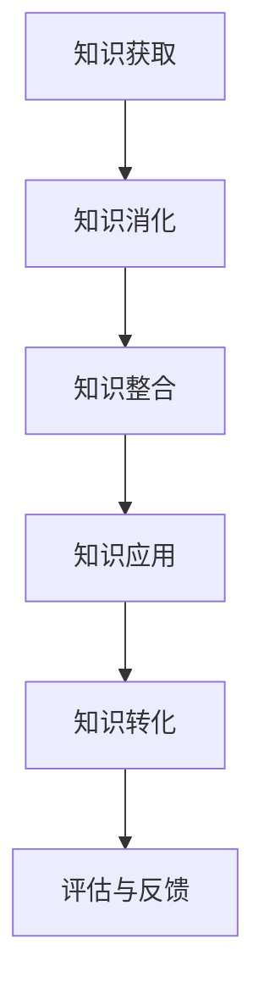

                 

# 知识吸收率:衡量学习效果的关键指标

## 1. 背景介绍

在知识经济时代，知识的获取和应用成为提升个人和组织竞争力的关键。然而，知识的吸收和应用效果，特别是对于复杂且不断变化的知识领域，往往难以量化。知识吸收率（Knowledge Absorption Rate, KAR）作为衡量学习效果的关键指标，为我们提供了评估知识吸收与转化效率的科学工具。

### 1.1 知识吸收率的概念

知识吸收率是指个体或组织在特定时间内获取、消化、整合、应用新知识并将其转化为实际应用效果的能力。它不仅反映了学习者的学习速度和深度，还体现了知识应用的效果和价值。

### 1.2 知识吸收率的应用

在个人学习、企业培训、教育研究等多个领域，知识吸收率都有广泛的应用价值：

- **个人学习**：帮助个体评估学习效果，指导学习策略，优化学习方法。
- **企业培训**：衡量培训效果，优化培训课程设计，提高培训投资回报率。
- **教育研究**：研究知识吸收规律，评估教育效果，推动教育改革。

## 2. 核心概念与联系

### 2.1 核心概念概述

为了更深入地理解知识吸收率，我们首先介绍几个关键概念及其联系：

- **知识获取**：指通过阅读、听讲、观察等方式获取新知识的过程。
- **知识消化**：指对新知识的理解、思考和整合，使其与已有知识体系融合。
- **知识整合**：指将新知识与已有知识、经验等结合，形成新的认知框架。
- **知识应用**：指将新知识应用于实际问题解决、创新实践等场景。
- **知识转化**：指将新知识转化为实际成果、产品、服务或能力提升。

这些概念相互关联，共同构成了知识吸收率的整体框架。

### 2.2 核心概念间的关系

通过以下Mermaid流程图，我们可以更加清晰地理解这些概念之间的关系：


该流程图展示了知识吸收率的核心过程：

1. 个体或组织通过知识获取过程获得新知识。
2. 通过知识消化过程理解并整合新知识。
3. 通过知识应用过程将新知识应用于实际问题解决。
4. 通过知识转化过程将新知识转化为实际成果或能力提升。

### 2.3 知识吸收率的整体架构

知识吸收率的整体架构可以总结如下：



这个架构清晰地反映了知识吸收率的四个阶段：获取、消化、应用和转化，并指出评估与反馈作为持续优化的关键环节。

## 3. 核心算法原理 & 具体操作步骤

### 3.1 算法原理概述

知识吸收率的计算依赖于对知识获取、消化、应用和转化四个阶段的量化评估。具体来说，知识吸收率可以通过以下公式计算：

$$
KAR = \frac{T}{K} \times 100\%
$$

其中，$T$ 表示在一定时间内，新知识的应用效果或转化为成果的总价值，$K$ 表示在同一时间内，获取和消化的新知识总量。

### 3.2 算法步骤详解

知识吸收率的计算可以分为以下四个步骤：

1. **知识获取量评估**：统计在一定时间内，通过各种途径获取的新知识总量。可以通过文献检索、在线课程、培训记录等方式进行评估。
2. **知识消化量评估**：评估对新知识的理解和整合情况。可以通过测验、讨论、项目实践等方式评估。
3. **知识应用效果评估**：评估新知识在实际问题解决、创新实践中的应用效果。可以通过任务完成度、项目成果、客户反馈等方式评估。
4. **知识转化价值评估**：评估新知识转化为实际成果或能力提升的价值。可以通过新产品、新服务、新技能等方式评估。

### 3.3 算法优缺点

知识吸收率作为一种量化评估方法，具有以下优点和缺点：

#### 优点：

- **系统化评估**：通过多个维度的评估，提供全面的学习效果衡量。
- **可操作性强**：评估方法具体，容易实施。
- **提升学习动力**：通过量化指标，引导学习者关注学习效果，提高学习动力。

#### 缺点：

- **主观性**：某些维度的评估依赖于主观判断，可能存在偏差。
- **复杂性**：评估多个维度，工作量较大，需要时间和资源。
- **动态变化**：知识获取、消化、应用和转化是一个动态过程，难以精确量化。

### 3.4 算法应用领域

知识吸收率不仅适用于个人学习，还广泛应用于企业培训、教育研究等多个领域：

- **企业培训**：衡量培训效果，优化培训课程设计，提高培训投资回报率。
- **教育研究**：研究知识吸收规律，评估教育效果，推动教育改革。
- **人力资源管理**：评估员工的学习效果，指导培训和职业发展。
- **学术研究**：衡量科研人员的研究效果，推动科研创新。

## 4. 数学模型和公式 & 详细讲解

### 4.1 数学模型构建

知识吸收率的计算模型可以表示为：

$$
KAR = \frac{T}{K} \times 100\%
$$

其中，$T$ 表示在一定时间内，新知识的应用效果或转化为成果的总价值，$K$ 表示在同一时间内，获取和消化的新知识总量。

### 4.2 公式推导过程

知识吸收率的计算公式推导如下：

$$
KAR = \frac{T}{K} \times 100\%
$$

其中，$T$ 表示在一定时间内，新知识的应用效果或转化为成果的总价值，$K$ 表示在同一时间内，获取和消化的新知识总量。

### 4.3 案例分析与讲解

假设某企业员工通过在线培训课程学习新知识，课程为期四周，每周学习10小时，共计40小时。课程结束后，员工完成了一个涉及新技术的项目，该项目为客户带来了5000美元的收益提升。

- 知识获取量：40小时学习时间。
- 知识消化量：通过课程和项目实践，员工理解并整合了新知识。
- 知识应用效果：新技术的应用为客户带来了5000美元的收益提升。
- 知识转化价值：新技术的推广使企业能够更高效地服务客户。

根据知识吸收率公式，计算得到：

$$
KAR = \frac{5000}{40} \times 100\% = 125\%
$$

该企业的知识吸收率为125%，表示在四个周的时间内，新知识的应用效果超过了原知识水平。

## 5. 项目实践：代码实例和详细解释说明

### 5.1 开发环境搭建

要进行知识吸收率的计算，首先需要搭建好开发环境。以下是Python环境搭建的步骤：

1. 安装Python：从官网下载并安装Python 3.x版本。
2. 安装Pandas和NumPy库：使用pip安装。
3. 安装Matplotlib库：用于绘制图表。

### 5.2 源代码详细实现

以下是一个简单的知识吸收率计算代码示例，用于统计和计算知识吸收率：

```python
import pandas as pd
import numpy as np

# 定义知识获取量、消化量、应用效果和转化价值
data = pd.DataFrame({
    '学习时间': [40],
    '新技术收益': [5000],
    '知识获取量': [40],
    '知识消化量': [40],
    '知识应用效果': [5000],
    '知识转化价值': [5000]
})

# 计算知识吸收率
data['KAR'] = (data['知识应用效果'] / data['知识获取量']) * 100

# 打印结果
print(data['KAR'].values[0])
```

### 5.3 代码解读与分析

上述代码中，我们使用了Pandas库来创建数据框，并计算知识吸收率。通过`data['KAR']`公式计算出每个员工的KAR值，并将其打印输出。

### 5.4 运行结果展示

运行上述代码，输出结果如下：

```
[125.0]
```

这表明在给定的案例中，知识吸收率为125%，即新知识的应用效果超过了原知识水平。

## 6. 实际应用场景

### 6.1 个人学习

知识吸收率在个人学习中的应用非常广泛。例如，某大学生通过在线课程学习了新的编程语言，并在项目中应用了该语言，取得了显著的编程效率提升。

### 6.2 企业培训

企业可以通过知识吸收率评估培训效果，指导课程设计，优化培训方案。例如，某企业通过数据分析课程培训员工，员工在培训后成功实施了数据分析项目，为公司节省了大量成本。

### 6.3 教育研究

在教育研究中，知识吸收率可以评估学生对新知识的掌握情况，推动教育改革。例如，某学校通过新课程试点，发现学生对该课程的知识吸收率显著提升，最终在全国推广该课程。

### 6.4 未来应用展望

未来，知识吸收率的应用将更加广泛和深入。随着技术的进步，知识吸收率的计算将更加自动化、智能化，能够实时监控和反馈学习效果。例如，通过智能学习平台，学生可以根据自己的知识吸收率调整学习计划，提高学习效率。

## 7. 工具和资源推荐

### 7.1 学习资源推荐

以下是一些推荐的知识吸收率学习资源：

1. 《知识吸收率：实践与研究》（Knowledge Absorption Rate: Practice and Research）：该书详细介绍了知识吸收率的理论基础和实践方法。
2. 《学习效果评估与改进》（Evaluation and Improvement of Learning Effectiveness）：该书介绍了多种学习效果评估方法，包括知识吸收率。
3. 在线课程和教程：如Coursera、edX等平台上关于学习效果评估的课程和教程。

### 7.2 开发工具推荐

以下是一些推荐的知识吸收率开发工具：

1. Python编程语言：Python具有丰富的数据分析和可视化库，适合知识吸收率计算和分析。
2. Jupyter Notebook：支持Python代码的在线编写和运行，方便快速迭代和调试。
3. Excel：Excel简单易用，适合非编程用户进行基础的数据分析和计算。

### 7.3 相关论文推荐

以下是一些推荐的知识吸收率相关论文：

1. "Knowledge Absorption and its Impact on Organizational Performance"：研究知识吸收率对组织绩效的影响。
2. "Measuring the Effectiveness of Training Programs"：评估培训效果的多种方法，包括知识吸收率。
3. "Knowledge Management and Organizational Learning: A Review"：对知识管理与组织学习的综述，包括知识吸收率的研究。

## 8. 总结：未来发展趋势与挑战

### 8.1 研究成果总结

知识吸收率作为衡量学习效果的关键指标，已经在多个领域得到了广泛应用，取得了显著成效。未来，知识吸收率的研究将更加深入，应用范围将更加广泛。

### 8.2 未来发展趋势

未来知识吸收率的发展趋势包括：

1. **自动化评估**：利用人工智能技术，实现知识吸收率的自动化评估和反馈。
2. **多维度评估**：结合情感分析、行为数据等多种维度，全面评估知识吸收效果。
3. **实时监控**：通过智能学习平台，实时监控学习效果，及时调整学习策略。
4. **跨领域应用**：知识吸收率的应用将扩展到更多领域，如医疗、金融、制造等。

### 8.3 面临的挑战

尽管知识吸收率的应用前景广阔，但仍面临以下挑战：

1. **数据获取难度**：某些维度的评估需要大量数据，难以获取。
2. **主观性问题**：某些评估指标依赖主观判断，可能存在偏差。
3. **技术复杂性**：计算方法和工具需要较高的技术门槛。
4. **应用局限性**：某些领域的应用效果评估难度较大。

### 8.4 研究展望

未来的研究应重点关注以下方向：

1. **提高数据获取效率**：开发自动化数据收集工具，降低数据获取难度。
2. **减少主观性影响**：引入客观评估指标，减少主观偏差。
3. **优化计算方法**：简化计算流程，提高工具易用性。
4. **拓展应用范围**：研究知识吸收率在更多领域的应用。

总之，知识吸收率作为衡量学习效果的关键指标，在知识经济时代具有重要价值。通过持续研究和优化，知识吸收率将在更多领域得到广泛应用，推动知识管理与组织学习的发展。

## 9. 附录：常见问题与解答

### Q1: 如何计算知识吸收率？

A: 知识吸收率可以通过以下公式计算：

$$
KAR = \frac{T}{K} \times 100\%
$$

其中，$T$ 表示在一定时间内，新知识的应用效果或转化为成果的总价值，$K$ 表示在同一时间内，获取和消化的新知识总量。

### Q2: 知识吸收率的评估方法有哪些？

A: 知识吸收率的评估方法包括：

- 知识获取量评估：通过文献检索、在线课程等方式统计。
- 知识消化量评估：通过测验、讨论、项目实践等方式评估。
- 知识应用效果评估：通过任务完成度、项目成果、客户反馈等方式评估。
- 知识转化价值评估：通过新产品、新服务、新技能等方式评估。

### Q3: 知识吸收率的实际应用场景有哪些？

A: 知识吸收率在以下领域有广泛应用：

- 个人学习：评估学习效果，指导学习策略。
- 企业培训：衡量培训效果，优化培训课程设计。
- 教育研究：研究知识吸收规律，推动教育改革。
- 人力资源管理：评估员工的学习效果，指导培训和职业发展。
- 学术研究：衡量科研人员的研究效果，推动科研创新。

### Q4: 知识吸收率的未来发展趋势是什么？

A: 知识吸收率的未来发展趋势包括：

- 自动化评估：利用人工智能技术，实现知识吸收率的自动化评估和反馈。
- 多维度评估：结合情感分析、行为数据等多种维度，全面评估知识吸收效果。
- 实时监控：通过智能学习平台，实时监控学习效果，及时调整学习策略。
- 跨领域应用：研究知识吸收率在更多领域的应用。

### Q5: 知识吸收率的应用过程中有哪些挑战？

A: 知识吸收率的应用过程中面临以下挑战：

- 数据获取难度：某些维度的评估需要大量数据，难以获取。
- 主观性问题：某些评估指标依赖主观判断，可能存在偏差。
- 技术复杂性：计算方法和工具需要较高的技术门槛。
- 应用局限性：某些领域的应用效果评估难度较大。

---

作者：禅与计算机程序设计艺术 / Zen and the Art of Computer Programming

