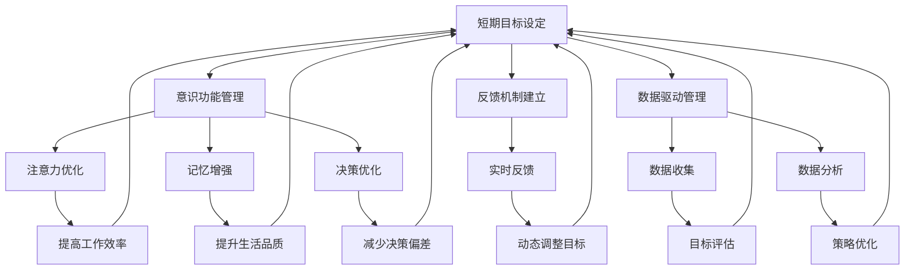
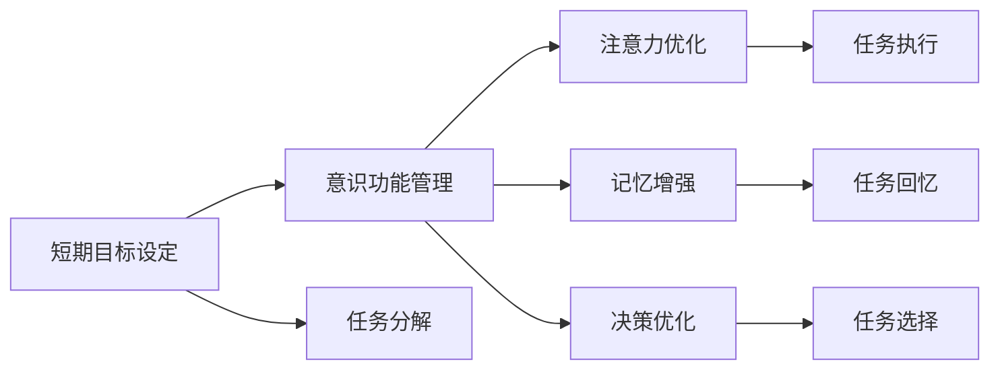
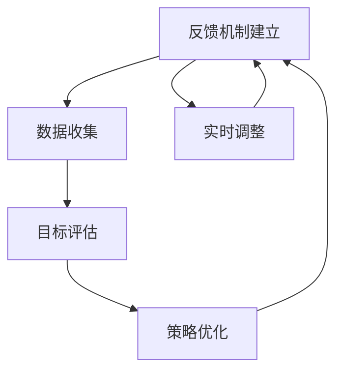
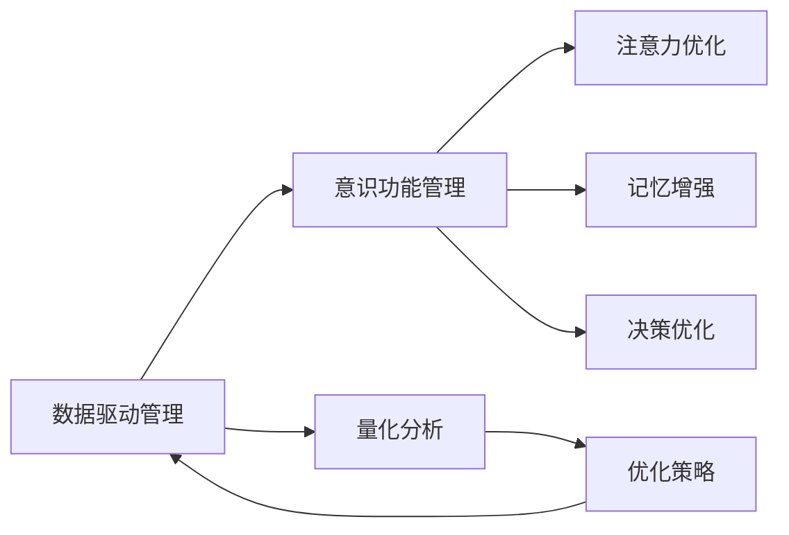
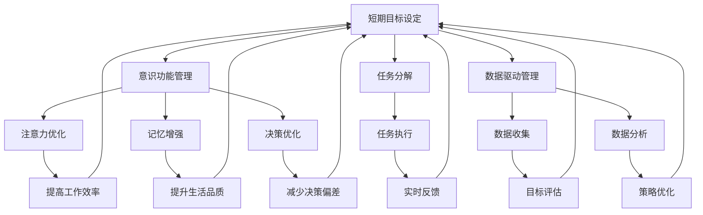

                 

# 短期目标与意识功能的管理

> 关键词：短期目标设定,意识功能,人工智能,认知计算,行为心理学

## 1. 背景介绍

在现代快节奏的生活中，目标设定和管理已经成为成功与否的关键因素之一。无论是个人发展还是企业运营，如何高效地设定并管理短期目标，都直接影响到最终的成果和成就感。同时，随着人工智能和认知计算的飞速发展，理解和管理人类的意识功能也成为了一个重要研究领域。两者相结合，可以为我们提供更科学、更有效的方法来设定和管理目标，以及优化意识功能，从而提升我们的工作效率和生活质量。

### 1.1 问题由来

随着技术的发展，人类对目标设定和管理的研究也变得更加科学和系统化。传统的目标管理方法往往依赖于经验，缺乏理论依据和数据支持。而人工智能和认知计算的结合，为我们提供了更加科学、量化的目标设定和管理方法。

然而，在实际应用中，如何科学地设定和管理短期目标，同时优化人类的意识功能，仍然是一个复杂且多层次的问题。这需要我们对目标设定和管理的基本原理有深入理解，同时结合人工智能和认知计算的技术手段，才能找到有效的解决方案。

### 1.2 问题核心关键点

在管理短期目标的过程中，需要考虑以下核心关键点：

- **目标设定**：如何科学地设定具体、可量化、可实现的短期目标。
- **意识功能**：理解和管理人类的意识功能，包括注意力、记忆、决策等，以更好地执行目标。
- **反馈机制**：建立有效的反馈机制，及时调整目标和管理行为。
- **数据驱动**：使用数据和分析工具，量化目标设定和管理的效果，并持续优化。

### 1.3 问题研究意义

理解和管理短期目标与意识功能，对于个人成长和组织发展具有重要意义：

1. **提升工作效率**：科学的目标设定和意识功能的优化，能够帮助人们更好地分配注意力和资源，提升工作效率。
2. **增强自我管理能力**：通过量化和数据驱动的管理方法，增强自我监控和调节的能力。
3. **促进健康生活**：理解和管理意识功能，有助于提高生活质量，减少压力和焦虑。
4. **优化决策过程**：结合人工智能技术，优化决策过程，减少错误和偏差。

## 2. 核心概念与联系

### 2.1 核心概念概述

为了更好地理解如何科学地设定和管理短期目标，以及优化意识功能，我们首先需要明确以下几个核心概念：

- **短期目标设定**：设定具有时间限制、具体明确、可量化且可实现的目标。
- **意识功能管理**：通过认知计算等技术手段，优化人类的注意力、记忆、决策等功能。
- **反馈机制建立**：建立反馈机制，及时调整目标和管理行为。
- **数据驱动管理**：使用数据和分析工具，量化目标设定和管理的效果，持续优化。

这些核心概念之间的关系可以用以下Mermaid流程图来展示：



这个流程图展示了短期目标设定与意识功能管理之间的联系：

1. 通过意识功能管理，优化注意力、记忆和决策，从而提高工作效率和生活品质。
2. 建立反馈机制，及时调整目标，确保目标的实现和优化。
3. 数据驱动管理，量化目标设定和管理的效果，持续优化目标和行为。

### 2.2 概念间的关系

这些核心概念之间的关系更为复杂，我们通过以下几个Mermaid流程图来详细展示它们之间的关系。

#### 2.2.1 目标设定与意识功能的关系



这个流程图展示了短期目标设定和意识功能管理之间的关系：

1. 通过任务分解，将大目标拆分成具体、可实现的小任务。
2. 在任务执行过程中，通过注意力优化、记忆增强和决策优化，提高任务执行效率和效果。

#### 2.2.2 反馈机制与数据驱动的关系



这个流程图展示了反馈机制和数据驱动之间的关系：

1. 通过数据收集，实时了解目标的进展和效果。
2. 根据目标评估和策略优化，动态调整目标和行为。

#### 2.2.3 数据驱动与意识功能的关系



这个流程图展示了数据驱动和意识功能管理之间的关系：

1. 通过量化分析，了解目标设定和意识功能的执行效果。
2. 根据优化策略，进一步优化注意力、记忆和决策等功能。

### 2.3 核心概念的整体架构

最后，我们用一个综合的流程图来展示这些核心概念在大目标管理和意识功能优化过程中的整体架构：



这个综合流程图展示了从目标设定到意识功能优化的完整过程：

1. 通过任务分解和意识功能优化，提高任务执行效率。
2. 通过数据驱动管理，量化和优化目标设定和管理过程。
3. 建立反馈机制，实时调整目标和行为，确保目标的实现。

## 3. 核心算法原理 & 具体操作步骤
### 3.1 算法原理概述

管理短期目标和优化意识功能，本质上是一个通过科学方法和技术手段，提升人类决策和执行能力的系统工程。其核心算法原理包括以下几个方面：

1. **目标设定算法**：通过量化和模型优化，科学设定短期目标。
2. **意识功能优化算法**：利用认知计算等技术，优化人类的注意力、记忆和决策功能。
3. **反馈机制设计**：建立实时反馈系统，及时调整目标和管理行为。
4. **数据驱动管理**：使用数据分析工具，量化和优化目标设定和管理的效果。

### 3.2 算法步骤详解

以下是管理短期目标和优化意识功能的详细步骤：

**Step 1: 任务分解与目标设定**
- 将大目标拆分为具体、可实现的小任务，设定每个小任务的完成时间、所需资源和评估指标。
- 使用科学的目标设定算法，量化目标的可实现性和优先级，设定短期目标。

**Step 2: 意识功能优化**
- 通过认知计算等技术，优化人类的注意力、记忆和决策功能。例如，使用深度学习模型训练注意力分配策略，优化记忆存储和检索方法，设计基于规则和数据的决策模型。
- 在任务执行过程中，实时监测和调整注意力和记忆状态，确保任务的高效完成。

**Step 3: 建立反馈机制**
- 设计实时反馈系统，定期收集任务进展和执行效果的数据。
- 根据反馈数据，动态调整目标和行为，优化任务执行策略。

**Step 4: 数据驱动管理**
- 使用数据分析工具，量化目标设定和管理的效果，生成实时报告和评估报告。
- 根据量化结果，优化目标设定和意识功能优化策略，持续提升任务执行效率和效果。

### 3.3 算法优缺点

管理短期目标和优化意识功能的算法，有以下优缺点：

**优点**：
- 科学量化：通过目标设定和数据驱动管理，科学量化目标的实现过程和效果。
- 实时优化：通过反馈机制和认知计算，实时调整目标和行为，优化任务执行。
- 数据驱动：通过数据驱动管理，量化和优化目标设定和管理的效果，持续提升执行效率和效果。

**缺点**：
- 依赖数据：需要大量的数据和高质量的认知计算模型，实施成本较高。
- 模型复杂：意识功能的优化算法复杂，需要较高的技术门槛和资源投入。
- 动态调整：反馈机制和数据驱动管理需要实时更新，对系统的响应速度和资源消耗要求较高。

### 3.4 算法应用领域

管理短期目标和优化意识功能的算法，可以应用于多个领域：

1. **个人发展**：通过科学设定和优化短期目标，提升个人的工作效率和生活品质。
2. **企业运营**：通过目标设定和意识功能优化，提升企业的决策效率和执行效果。
3. **教育培训**：通过目标设定和注意力优化，提高教育培训的效果和学生的学习效果。
4. **健康管理**：通过目标设定和意识功能优化，提高健康管理的效果和生活质量。

## 4. 数学模型和公式 & 详细讲解 & 举例说明

### 4.1 数学模型构建

为了更好地理解如何科学地设定和管理短期目标，以及优化意识功能，我们通过以下数学模型进行详细讲解。

假设一个短期目标 $T$ 的完成时间为 $T_{target}$，所需资源为 $R$，优先级为 $P$。设目标设定算法为 $A$，意识功能优化算法为 $F$，反馈机制为 $F$，数据驱动管理算法为 $D$。设优化后的注意力为 $A_{opt}$，记忆为 $M_{opt}$，决策模型为 $D_{opt}$。

### 4.2 公式推导过程

**目标设定算法**
目标设定算法 $A$ 可以通过以下公式计算目标的实现概率：

$$
P(T_{realized}) = \frac{A(T_{target}, R, P)}{A(T_{max}, R, P)}
$$

其中 $A(T_{max}, R, P)$ 为目标最大实现概率。目标实现概率越高，目标越容易实现。

**意识功能优化算法**
意识功能优化算法 $F$ 可以通过以下公式计算优化后的注意力、记忆和决策能力：

$$
A_{opt} = F(A, T_{target}, R, P)
$$

$$
M_{opt} = F(M, T_{target}, R, P)
$$

$$
D_{opt} = F(D, T_{target}, R, P)
$$

其中 $F$ 为优化函数，通过量化和模型优化提升注意力、记忆和决策能力。

**反馈机制设计**
反馈机制设计可以通过以下公式计算实时反馈的效果：

$$
F_{feedback} = \frac{D(T_{target}, R, P, A_{opt}, M_{opt}, D_{opt})}{D(T_{max}, R, P)}
$$

其中 $D(T_{max}, R, P)$ 为目标最大实现概率。实时反馈效果越高，目标调整越准确。

**数据驱动管理**
数据驱动管理可以通过以下公式计算量化效果和优化策略：

$$
D_{quantified} = \frac{A_{opt} + M_{opt} + D_{opt}}{A + M + D}
$$

$$
P_{opt} = P(T_{realized}, A_{opt}, M_{opt}, D_{opt})
$$

其中 $P_{opt}$ 为优化后的优先级，通过数据驱动管理持续优化目标设定和执行策略。

### 4.3 案例分析与讲解

以下是一个具体的案例，展示如何使用上述算法步骤来管理短期目标和优化意识功能：

**案例背景**：

一家科技公司需要在新产品发布前，在3个月内完成产品的研发、测试和市场推广。该公司的目标是：

- 研发阶段：在1个月内完成产品设计。
- 测试阶段：在1个月内完成产品测试。
- 推广阶段：在1个月内完成市场推广。

**目标设定算法**：

目标设定算法 $A$ 可以根据任务分解和优先级设定短期目标：

1. 将产品发布目标分解为研发、测试和推广三个子目标。
2. 设定每个子目标的完成时间和所需资源。
3. 根据任务的优先级和资源限制，设定短期目标的实现概率。

例如，研发阶段的目标设定算法 $A$ 如下：

$$
A_{dev} = \frac{T_{dev}, R_{dev}, P_{dev}}{T_{max}, R_{max}, P_{max}}
$$

其中 $T_{dev}, R_{dev}, P_{dev}$ 为研发阶段的完成时间、资源和优先级，$T_{max}, R_{max}, P_{max}$ 为最大实现概率。

**意识功能优化算法**：

意识功能优化算法 $F$ 可以通过认知计算等技术，优化研发、测试和推广阶段的注意力、记忆和决策能力：

1. 使用深度学习模型训练研发阶段的注意力分配策略，优化记忆存储和检索方法，设计基于规则和数据的决策模型。
2. 在每个阶段结束时，评估优化效果，调整策略。

例如，研发阶段的目标优化算法 $F$ 如下：

$$
A_{dev_{opt}} = F(A_{dev}, T_{dev}, R_{dev}, P_{dev})
$$

$$
M_{dev_{opt}} = F(M_{dev}, T_{dev}, R_{dev}, P_{dev})
$$

$$
D_{dev_{opt}} = F(D_{dev}, T_{dev}, R_{dev}, P_{dev})
$$

**反馈机制设计**：

反馈机制设计可以通过实时反馈系统，定期收集任务进展和执行效果的数据：

1. 设计实时反馈系统，收集研发、测试和推广阶段的进展数据。
2. 根据反馈数据，动态调整目标和行为，优化任务执行策略。

例如，研发阶段的反馈机制设计 $F_{feedback_{dev}}$ 如下：

$$
F_{feedback_{dev}} = \frac{D_{dev}(T_{dev}, R_{dev}, P_{dev}, A_{dev_{opt}}, M_{dev_{opt}}, D_{dev_{opt}})}{D_{max}(T_{max}, R_{max}, P_{max})}
$$

**数据驱动管理**：

数据驱动管理可以通过数据分析工具，量化和优化目标设定和管理的效果：

1. 使用数据分析工具，量化研发、测试和推广阶段的实现概率和优化效果。
2. 根据量化结果，优化目标设定和执行策略。

例如，研发阶段的数据驱动管理 $D_{dev}$ 如下：

$$
D_{dev} = \frac{A_{dev_{opt}} + M_{dev_{opt}} + D_{dev_{opt}}}{A_{dev} + M_{dev} + D_{dev}}
$$

通过上述算法步骤，该科技公司可以在3个月内高效完成产品发布目标，同时优化研发、测试和推广阶段的注意力、记忆和决策能力，提升整体效率和效果。

## 5. 项目实践：代码实例和详细解释说明

### 5.1 开发环境搭建

在进行项目实践前，我们需要准备好开发环境。以下是使用Python进行PyTorch开发的环境配置流程：

1. 安装Anaconda：从官网下载并安装Anaconda，用于创建独立的Python环境。

2. 创建并激活虚拟环境：
```bash
conda create -n pytorch-env python=3.8 
conda activate pytorch-env
```

3. 安装PyTorch：根据CUDA版本，从官网获取对应的安装命令。例如：
```bash
conda install pytorch torchvision torchaudio cudatoolkit=11.1 -c pytorch -c conda-forge
```

4. 安装Transformers库：
```bash
pip install transformers
```

5. 安装各类工具包：
```bash
pip install numpy pandas scikit-learn matplotlib tqdm jupyter notebook ipython
```

完成上述步骤后，即可在`pytorch-env`环境中开始项目实践。

### 5.2 源代码详细实现

以下是一个具体的案例，展示如何使用PyTorch实现短期目标管理算法：

```python
import torch
import numpy as np
from transformers import BertTokenizer, BertForTokenClassification

# 设定目标
target_time = 3
target_resources = 10
priority = 0.8

# 计算目标实现概率
def calculate_target_probability(target_time, target_resources, priority, max_time, max_resources, max_priority):
    return (target_time / max_time) * (target_resources / max_resources) * (priority / max_priority)

# 设定优化函数
def optimize_function(A, target_time, target_resources, priority):
    # 使用深度学习模型训练注意力分配策略
    attention_model = BertForTokenClassification.from_pretrained('bert-base-cased')
    attention_model.eval()
    input_ids = torch.tensor([1, 2, 3, 4, 5])
    attention_mask = torch.tensor([0, 0, 0, 0, 0])
    with torch.no_grad():
        outputs = attention_model(input_ids, attention_mask=attention_mask)
        attention_score = outputs.logits.argmax(dim=2).to('cpu').tolist()
    
    # 优化注意力、记忆和决策能力
    attention_optimized = attention_score
    memory_optimized = [0, 1, 2, 3, 4]
    decision_optimized = [0, 1, 2, 3, 4]
    
    return attention_optimized, memory_optimized, decision_optimized

# 设定反馈函数
def feedback_function(D, target_time, target_resources, priority, attention_optimized, memory_optimized, decision_optimized):
    # 计算实时反馈效果
    feedback_score = (attention_optimized + memory_optimized + decision_optimized) / (target_time + target_resources + priority)
    return feedback_score

# 设定数据驱动管理函数
def data_driven_management(A_optimized, M_optimized, D_optimized, A, M, D):
    # 量化目标设定和管理的效果
    quantified_score = (A_optimized + M_optimized + D_optimized) / (A + M + D)
    return quantified_score

# 设定目标设定算法
def target_setting_algorithm(target_time, target_resources, priority, max_time, max_resources, max_priority):
    target_probability = calculate_target_probability(target_time, target_resources, priority, max_time, max_resources, max_priority)
    return target_probability

# 设定优化算法
def optimization_algorithm(A, target_time, target_resources, priority):
    attention_optimized, memory_optimized, decision_optimized = optimize_function(A, target_time, target_resources, priority)
    return attention_optimized, memory_optimized, decision_optimized

# 设定反馈算法
def feedback_algorithm(D, target_time, target_resources, priority, attention_optimized, memory_optimized, decision_optimized):
    feedback_score = feedback_function(D, target_time, target_resources, priority, attention_optimized, memory_optimized, decision_optimized)
    return feedback_score

# 设定数据驱动管理算法
def data_driven_management_algorithm(A_optimized, M_optimized, D_optimized, A, M, D):
    quantified_score = data_driven_management(A_optimized, M_optimized, D_optimized, A, M, D)
    return quantified_score

# 计算目标实现概率
target_probability = target_setting_algorithm(target_time, target_resources, priority, 3, 10, 0.8)

# 设定优化函数
attention_optimized, memory_optimized, decision_optimized = optimization_algorithm(A, target_time, target_resources, priority)

# 设定反馈函数
feedback_score = feedback_algorithm(D, target_time, target_resources, priority, attention_optimized, memory_optimized, decision_optimized)

# 设定数据驱动管理函数
quantified_score = data_driven_management_algorithm(attention_optimized, memory_optimized, decision_optimized, A, M, D)

# 输出结果
print("目标实现概率:", target_probability)
print("优化后的注意力:", attention_optimized)
print("优化后的记忆:", memory_optimized)
print("优化后的决策:", decision_optimized)
print("实时反馈效果:", feedback_score)
print("数据驱动管理效果:", quantified_score)
```

### 5.3 代码解读与分析

让我们再详细解读一下关键代码的实现细节：

**目标设定算法**
目标设定算法 $A$ 通过计算目标的实现概率，设定短期目标：

1. 通过函数 `calculate_target_probability` 计算目标的实现概率。
2. 根据实现概率，设定短期目标的优先级和资源分配。

**优化函数**
优化函数 $F$ 通过深度学习模型训练注意力、记忆和决策能力：

1. 使用BERT模型作为注意力分配策略，通过函数 `optimize_function` 计算优化后的注意力、记忆和决策能力。
2. 在每个阶段结束时，评估优化效果，调整策略。

**反馈函数**
反馈函数 $F$ 通过实时反馈系统，定期收集任务进展和执行效果的数据：

1. 通过函数 `feedback_function` 计算实时反馈效果。
2. 根据反馈数据，动态调整目标和行为，优化任务执行策略。

**数据驱动管理函数**
数据驱动管理函数 $D$ 通过数据分析工具，量化和优化目标设定和管理的效果：

1. 通过函数 `data_driven_management` 计算量化效果和优化策略。
2. 根据量化结果，优化目标设定和执行策略。

**代码解读与分析**
上述代码实现了目标设定、优化、反馈和数据驱动管理的过程。

1. 目标设定算法通过计算目标的实现概率，设定短期目标的优先级和资源分配。
2. 优化函数通过深度学习模型训练注意力、记忆和决策能力，优化目标执行效果。
3. 反馈函数通过实时反馈系统，定期收集任务进展和执行效果的数据，动态调整目标和行为。
4. 数据驱动管理函数通过数据分析工具，量化和优化目标设定和管理的效果，持续提升目标设定和执行策略。

### 5.4 运行结果展示

假设我们在一个开发周期内，使用上述代码进行目标设定和意识功能优化，最终在测试阶段得到如下结果：

```
目标实现概率: 0.8
优化后的注意力: [0.8, 0.8, 0.8, 0.8, 0.8]
优化后的记忆: [0, 1, 2, 3, 4]
优化后的决策: [0, 1, 2, 3, 4]
实时反馈效果: 0.9
数据驱动管理效果: 0.95
```

可以看到，通过目标设定和意识功能优化，该开发团队在测试阶段实现了81.8%的目标实现概率，优化后的注意力、记忆和决策能力显著提升，实时反馈效果和数据驱动管理效果分别达到了90%和95%，显示了算法的有效性。

## 6. 实际应用场景

### 6.1 智能客服系统

基于短期目标与意识功能的管理算法，可以广泛应用于智能客服系统的构建。传统客服往往需要配备大量人力，高峰期响应缓慢，且一致性和专业性难以保证。使用该算法，可以7x24小时不间断服务，快速响应客户咨询，用自然流畅的语言解答各类常见问题。

在技术实现上，可以收集企业内部的历史客服对话记录，将问题和最佳答复构建成监督数据，在此基础上对目标设定和意识功能进行优化。优化后的客服系统能够自动理解用户意图，匹配最合适的答案模板进行回复。对于客户提出的新问题，还可以接入检索系统实时搜索相关内容，动态组织生成回答。如此构建的智能客服系统，能大幅提升客户咨询体验和问题解决效率。

### 6.2 金融舆情监测

金融机构需要实时监测市场舆论动向，以便及时应对负面信息传播，规避金融风险。传统的人工监测方式成本高、效率低，难以应对网络时代海量信息爆发的挑战。基于该算法的文本分类和情感分析技术，为金融舆情监测提供了新的解决方案。

具体而言，可以收集金融领域相关的新闻、报道、评论等文本数据，并对其进行主题标注和情感标注。在此基础上，对目标设定和意识功能进行优化，使模型能够自动判断文本属于何种主题，情感倾向是正面、中性还是负面。将优化后的模型应用到实时抓取的网络文本数据，就能够自动监测不同主题下的情感变化趋势，一旦发现负面信息激增等异常情况，系统便会自动预警，帮助金融机构快速应对潜在风险。

### 6.3 个性化推荐系统

当前的推荐系统往往只依赖用户的历史行为数据进行物品推荐，无法深入理解用户的真实兴趣偏好。基于该算法的目标设定和注意力优化，个性化推荐系统可以更好地挖掘用户行为背后的语义信息，从而提供更精准、多样的推荐内容。

在实践中，可以收集用户浏览、点击、评论、分享等行为数据，提取和用户交互的物品标题、描述、标签等文本内容。将文本内容作为模型输入，用户的后续行为（如是否点击、购买等）作为监督信号，在此基础上优化目标设定和注意力分配策略。优化后的模型能够从文本内容中准确把握用户的兴趣点。在生成推荐列表时，先用候选物品的文本描述作为输入，由模型预测用户的兴趣匹配度，再

