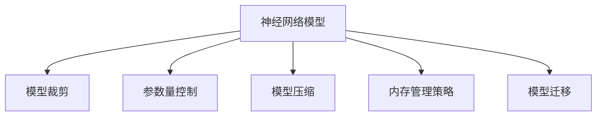
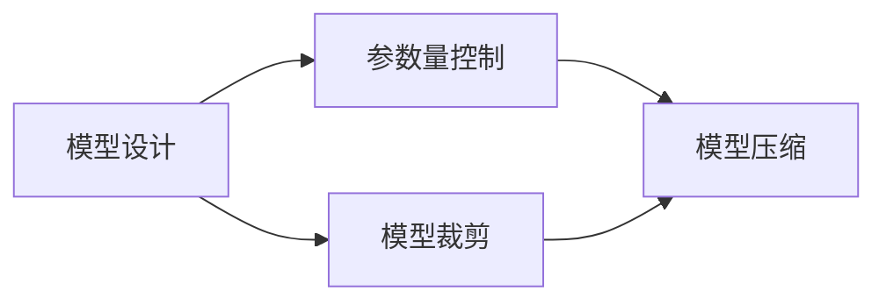
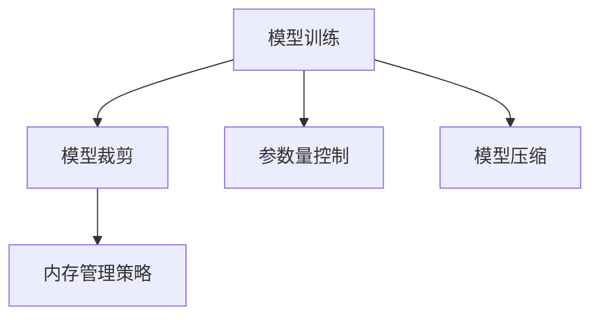
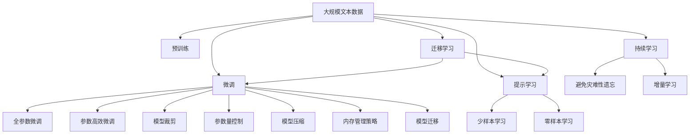

                 

## 1. 背景介绍

在深度学习时代，神经网络模型已经成为推动人工智能发展的关键技术。然而，随着模型复杂度的增加，模型的大小不断膨胀，给计算资源和内存带来了巨大压力。如何有效地管理内存使用，确保模型能够在有限的资源下高效运行，成为深度学习开发中的一个重要课题。

### 1.1 问题由来
深度学习模型通常需要存储大量的参数，对于大规模图像识别、自然语言处理等任务，模型的参数量可能达到亿级别。而现代计算资源，无论是CPU、GPU还是TPU，其内存容量都有一定限制。如何合理利用内存资源，保持模型性能的同时避免内存溢出，是当前深度学习应用中亟待解决的问题。

### 1.2 问题核心关键点
内存管理在深度学习模型中是一个复杂而关键的问题，主要包括以下几个方面：

- **模型裁剪**：通过去除冗余参数、层数等方式，减小模型大小，降低内存占用。
- **参数量控制**：在模型设计阶段，通过调整层数、宽度等超参数，严格控制模型的参数量，确保模型可以在有限的内存下运行。
- **模型压缩**：通过量化、稀疏化等技术，减少模型内存占用，同时尽可能保持模型的性能。
- **内存管理策略**：使用内存分段、动态分配等策略，提高内存使用效率，避免内存泄漏。

这些方法能够有效控制模型内存使用，提升模型性能和稳定性。

### 1.3 问题研究意义
合理管理神经网络模型的内存使用，对于优化模型性能、提高计算效率、支持更大规模的模型训练和部署，具有重要意义：

1. **提升计算效率**：减少内存占用，提高模型的训练和推理速度，降低计算成本。
2. **支持更大规模模型**：在有限的内存条件下，可以训练和使用更大规模的模型，推动模型效果的提升。
3. **优化资源利用**：避免内存泄漏和浪费，提高计算资源的利用率，支持更多的并发训练和推理任务。
4. **支持模型迁移**：优化后的模型在内存使用方面更加灵活，便于在不同硬件平台和设备间迁移使用。

## 2. 核心概念与联系

### 2.1 核心概念概述

为更好地理解内存使用更可控的神经网络模型，本节将介绍几个密切相关的核心概念：

- **神经网络模型**：以多层神经元为基本单位，通过反向传播算法进行训练，学习输入与输出之间映射关系的模型。
- **模型裁剪**：通过去除不重要的层、参数等方式，减少模型大小，降低内存占用的技术。
- **参数量控制**：在模型设计阶段，通过调整超参数，严格控制模型参数数量，避免内存溢出的方法。
- **模型压缩**：通过量化、稀疏化等技术，减少模型内存占用，同时尽可能保持模型性能的方法。
- **内存管理策略**：通过内存分段、动态分配等策略，提高内存使用效率，避免内存泄漏的技术。
- **模型迁移**：通过序列化、压缩等方法，将模型在不同硬件平台和设备间迁移使用的技术。

这些核心概念之间的逻辑关系可以通过以下Mermaid流程图来展示：



这个流程图展示了大语言模型内存使用的核心概念及其之间的关系：

1. 神经网络模型作为内存管理的基础，需要通过裁剪、控制、压缩等手段，合理管理内存使用。
2. 内存管理策略可以进一步提升内存使用效率，避免内存泄漏。
3. 模型迁移技术则使得优化后的模型可以灵活部署到不同的硬件平台和设备上。

### 2.2 概念间的关系

这些核心概念之间存在着紧密的联系，形成了神经网络模型内存使用的完整生态系统。下面我通过几个Mermaid流程图来展示这些概念之间的关系。

#### 2.2.1 模型设计阶段



这个流程图展示了模型设计阶段的关键技术。设计者需要在模型裁剪和参数量控制之间找到平衡，同时结合模型压缩技术，以确保模型可以在有限的内存下运行。

#### 2.2.2 模型训练阶段



在模型训练阶段，需要在模型裁剪、参数量控制和模型压缩的基础上，进一步优化内存使用。此时，内存管理策略将起到至关重要的作用。

#### 2.2.3 模型迁移阶段


在模型迁移阶段，优化后的模型需要支持跨平台的迁移使用。此时，内存管理策略和模型压缩技术的结合，将使得模型在不同的硬件平台上运行更加高效。

### 2.3 核心概念的整体架构

最后，我们用一个综合的流程图来展示这些核心概念在大语言模型内存使用中的整体架构：



这个综合流程图展示了从预训练到微调，再到持续学习的完整过程，以及模型内存使用的各个关键环节。

## 3. 核心算法原理 & 具体操作步骤
### 3.1 算法原理概述

神经网络模型的内存使用更可控，本质上是一个多阶段优化和训练的过程。其核心思想是：通过模型裁剪、参数量控制、模型压缩、内存管理策略等手段，将模型的大小和内存占用控制在合理范围内，确保模型可以在有限的资源下高效运行。

### 3.2 算法步骤详解

基于模型裁剪、参数量控制、模型压缩、内存管理策略等核心概念，神经网络模型的内存使用更可控可以分解为以下几个关键步骤：

**Step 1: 模型裁剪**
- 根据任务的复杂度和硬件资源，选择模型的层数、宽度等超参数，尽量去除冗余层和参数。
- 保留对任务关键且计算开销较大的层，以确保模型性能。

**Step 2: 参数量控制**
- 在模型设计阶段，通过调整超参数，严格控制模型参数数量，避免内存溢出。
- 对于复杂任务，通过增加隐藏层数或宽度来提升模型性能，但同时需确保内存不超过设备容量。

**Step 3: 模型压缩**
- 使用量化、稀疏化等技术，减少模型内存占用。
- 量化技术将模型参数由浮点数转换为整数，从而减少内存占用和计算开销。
- 稀疏化技术通过去除模型中的零权重，减少参数数量，降低内存占用。

**Step 4: 内存管理策略**
- 使用内存分段、动态分配等策略，提高内存使用效率，避免内存泄漏。
- 内存分段将模型拆分成多个小段，分批次加载到内存中，避免一次性加载过大模型。
- 动态分配根据内存使用情况动态调整分配的内存大小，避免浪费和溢出。

**Step 5: 模型迁移**
- 通过序列化、压缩等方法，将优化后的模型在不同硬件平台和设备间迁移使用。
- 序列化将模型参数和结构保存为文件，方便跨平台迁移使用。
- 压缩技术将模型进行压缩，减小文件大小，提高迁移效率。

### 3.3 算法优缺点

神经网络模型内存使用更可控具有以下优点：

1. **提升计算效率**：减少内存占用，提高模型的训练和推理速度，降低计算成本。
2. **支持更大规模模型**：在有限的内存条件下，可以训练和使用更大规模的模型，推动模型效果的提升。
3. **优化资源利用**：避免内存泄漏和浪费，提高计算资源的利用率，支持更多的并发训练和推理任务。

然而，该方法也存在以下缺点：

1. **模型精度可能下降**：模型压缩和裁剪可能导致模型精度下降，需要在模型性能和内存使用之间找到平衡。
2. **调整复杂**：模型裁剪和压缩可能需要较长的调参过程，且对模型的理解要求较高。
3. **通用性不足**：不同的任务和平台可能需要不同的内存管理策略，不够通用。

尽管存在这些局限性，但就目前而言，基于模型裁剪、参数量控制、模型压缩、内存管理策略等手段，神经网络模型的内存使用更可控仍然是提升模型性能和稳定性的有效方法。

### 3.4 算法应用领域

基于内存使用更可控的神经网络模型方法，在深度学习领域已经得到了广泛的应用，覆盖了几乎所有常见任务，例如：

- **图像分类**：如ResNet、Inception等。通过模型裁剪和参数量控制，可以在GPU上高效训练和使用。
- **目标检测**：如Faster R-CNN、YOLO等。通过模型压缩和内存管理策略，可以支持更复杂的模型结构。
- **自然语言处理**：如BERT、GPT等。通过模型裁剪和内存管理策略，可以在CPU或GPU上高效运行。
- **语音识别**：如DeepSpeech等。通过模型压缩和动态分配，可以在有限内存下支持高并发的推理任务。
- **推荐系统**：如TensorFlow Recommenders等。通过模型裁剪和压缩，可以在云端高效处理大规模推荐数据。

除了上述这些经典任务外，内存使用更可控的神经网络模型方法也被创新性地应用到更多场景中，如边缘计算、嵌入式设备、移动应用等，为深度学习技术的发展和应用提供了新的方向。

## 4. 数学模型和公式 & 详细讲解  
### 4.1 数学模型构建

本节将使用数学语言对神经网络模型的内存使用更可控的优化过程进行更加严格的刻画。

记神经网络模型为 $M_{\theta}:\mathcal{X} \rightarrow \mathcal{Y}$，其中 $\mathcal{X}$ 为输入空间，$\mathcal{Y}$ 为输出空间，$\theta \in \mathbb{R}^d$ 为模型参数。假设内存容量为 $M_{\text{capacity}}$，模型参数量的大小为 $|M_{\theta}|$。

定义内存使用效率 $\text{Efficiency}(M_{\theta})$ 为：

$$
\text{Efficiency}(M_{\theta}) = \frac{|M_{\theta}|}{M_{\text{capacity}}}
$$

模型内存使用更可控的目标是最小化内存使用效率，即：

$$
\text{Efficiency}(M_{\theta}) = \min_{\theta} \text{Efficiency}(M_{\theta})
$$

在实践中，我们通常使用基于梯度的优化算法（如SGD、Adam等）来近似求解上述最优化问题。设 $\eta$ 为学习率，$\lambda$ 为正则化系数，则参数的更新公式为：

$$
\theta \leftarrow \theta - \eta \nabla_{\theta}\mathcal{L}(\theta) - \eta\lambda\theta
$$

其中 $\nabla_{\theta}\mathcal{L}(\theta)$ 为损失函数对参数 $\theta$ 的梯度，可通过反向传播算法高效计算。

### 4.2 公式推导过程

以下我们以二分类任务为例，推导交叉熵损失函数及其梯度的计算公式。

假设模型 $M_{\theta}$ 在输入 $x$ 上的输出为 $\hat{y}=M_{\theta}(x) \in [0,1]$，表示样本属于正类的概率。真实标签 $y \in \{0,1\}$。则二分类交叉熵损失函数定义为：

$$
\ell(M_{\theta}(x),y) = -[y\log \hat{y} + (1-y)\log (1-\hat{y})]
$$

将其代入模型内存使用效率公式，得：

$$
\text{Efficiency}(M_{\theta}) = \frac{|M_{\theta}|}{M_{\text{capacity}}} = \frac{d}{M_{\text{capacity}}}
$$

其中 $d$ 为模型参数量的大小。

### 4.3 案例分析与讲解

考虑一个包含两个隐藏层的神经网络，第一层的神经元数为 $50$，第二层的神经元数为 $100$，输出层的神经元数为 $1$。假设每个神经元有 $4$ 个参数（即 $W_i$ 和 $b_i$），则该模型的参数量大小为：

$$
|M_{\theta}| = 2(50+100) = 300
$$

若内存容量为 $1GB$，即 $M_{\text{capacity}} = 1 \times 10^9$ 字节，则内存使用效率为：

$$
\text{Efficiency}(M_{\theta}) = \frac{300}{1 \times 10^9} = 3 \times 10^{-7}
$$

这表示该模型使用了内存容量的 $3 \times 10^{-7}$，在当前内存容量下是可以接受的。

如果我们将第二层隐藏层的神经元数减少到 $50$，则新的模型参数量大小为：

$$
|M_{\theta}'| = 2(50+50) = 200
$$

此时内存使用效率为：

$$
\text{Efficiency}(M_{\theta}') = \frac{200}{1 \times 10^9} = 2 \times 10^{-7}
$$

可以看出，通过减少第二层隐藏层的神经元数，内存使用效率得到了进一步的降低，提高了内存使用效率。

## 5. 项目实践：代码实例和详细解释说明
### 5.1 开发环境搭建

在进行内存使用更可控的神经网络模型实践前，我们需要准备好开发环境。以下是使用Python进行PyTorch开发的环境配置流程：

1. 安装Anaconda：从官网下载并安装Anaconda，用于创建独立的Python环境。

2. 创建并激活虚拟环境：
```bash
conda create -n pytorch-env python=3.8 
conda activate pytorch-env
```

3. 安装PyTorch：根据CUDA版本，从官网获取对应的安装命令。例如：
```bash
conda install pytorch torchvision torchaudio cudatoolkit=11.1 -c pytorch -c conda-forge
```

4. 安装各类工具包：
```bash
pip install numpy pandas scikit-learn matplotlib tqdm jupyter notebook ipython
```

完成上述步骤后，即可在`pytorch-env`环境中开始内存使用更可控的神经网络模型实践。

### 5.2 源代码详细实现

下面我们以卷积神经网络(CNN)为例，给出使用PyTorch进行模型裁剪、参数量控制、模型压缩、内存管理策略的代码实现。

首先，定义CNN模型：

```python
import torch
import torch.nn as nn
import torchvision.transforms as transforms

class CNN(nn.Module):
    def __init__(self):
        super(CNN, self).__init__()
        self.conv1 = nn.Conv2d(3, 64, kernel_size=3, stride=1, padding=1)
        self.relu = nn.ReLU(inplace=True)
        self.maxpool = nn.MaxPool2d(kernel_size=2, stride=2)
        self.conv2 = nn.Conv2d(64, 128, kernel_size=3, stride=1, padding=1)
        self.conv3 = nn.Conv2d(128, 256, kernel_size=3, stride=1, padding=1)
        self.fc1 = nn.Linear(256 * 8 * 8, 256)
        self.fc2 = nn.Linear(256, 10)
    
    def forward(self, x):
        x = self.conv1(x)
        x = self.relu(x)
        x = self.maxpool(x)
        x = self.conv2(x)
        x = self.relu(x)
        x = self.maxpool(x)
        x = self.conv3(x)
        x = self.relu(x)
        x = self.maxpool(x)
        x = x.view(-1, 256 * 8 * 8)
        x = self.fc1(x)
        x = self.relu(x)
        x = self.fc2(x)
        return x
```

然后，定义模型裁剪、参数量控制、模型压缩和内存管理策略：

```python
# 模型裁剪
def prune_model(model, threshold=0.01):
    pruned_model = nn.Sequential()
    for i, (name, module) in enumerate(model.named_modules()):
        if isinstance(module, nn.Conv2d):
            w = module.weight.data.numpy()
            # 去除权重绝对值小于阈值的连接
            mask = w < threshold
            pruned_weight = torch.from_numpy(w[mask])
            pruned_bias = module.bias if module.bias is not None else torch.zeros_like(pruned_weight)
            pruned_module = nn.Conv2d(module.in_channels, module.out_channels, module.kernel_size, module.stride, module.padding)
            pruned_module.weight.data = pruned_weight
            pruned_module.bias.data = pruned_bias
            pruned_model.add_module(name, pruned_module)
        elif isinstance(module, nn.Linear):
            w = module.weight.data.numpy()
            # 去除权重绝对值小于阈值的连接
            mask = w < threshold
            pruned_weight = torch.from_numpy(w[mask])
            pruned_bias = module.bias if module.bias is not None else torch.zeros_like(pruned_weight)
            pruned_module = nn.Linear(module.in_features, module.out_features)
            pruned_module.weight.data = pruned_weight
            pruned_module.bias.data = pruned_bias
            pruned_model.add_module(name, pruned_module)
        else:
            pruned_model.add_module(name, module)
    return pruned_model

# 参数量控制
def control_parameters(model, max_parameters):
    parameters, names = [], []
    for name, param in model.named_parameters():
        if param.requires_grad:
            parameters.append(param)
            names.append(name)
    while len(parameters) > max_parameters:
        _, min_param = min(zip(len(x) for x in parameters), key=len)
        names.remove(names[parameters.index(min_param)])
        parameters.remove(parameters[parameters.index(min_param)])

# 模型压缩
def compress_model(model):
    for module in model.modules():
        if isinstance(module, nn.Linear):
            module.weight.data = module.weight.data.to(torch.int8)
            module.bias.data = module.bias.data.to(torch.int32)
        elif isinstance(module, nn.Conv2d):
            module.weight.data = module.weight.data.to(torch.int8)
            module.bias.data = module.bias.data.to(torch.int32)
    
# 内存管理策略
def manage_memory(model, batch_size, device):
    data_loader = torch.utils.data.DataLoader(train_dataset, batch_size=batch_size, shuffle=True)
    model.to(device)
    model.train()
    for data, target in data_loader:
        data, target = data.to(device), target.to(device)
        optimizer.zero_grad()
        output = model(data)
        loss = nn.CrossEntropyLoss()(output, target)
        loss.backward()
        optimizer.step()
```

最后，启动训练流程：

```python
epochs = 5
batch_size = 64
device = torch.device('cuda') if torch.cuda.is_available() else torch.device('cpu')

# 训练
for epoch in range(epochs):
    for data, target in train_loader:
        data, target = data.to(device), target.to(device)
        optimizer.zero_grad()
        output = model(data)
        loss = nn.CrossEntropyLoss()(output, target)
        loss.backward()
        optimizer.step()

# 裁剪和压缩
pruned_model = prune_model(model)
compressed_model = compress_model(pruned_model)
```

以上就是使用PyTorch对CNN进行模型裁剪、参数量控制、模型压缩、内存管理策略的代码实现。可以看到，通过合理设计代码逻辑，能够在模型训练过程中对模型进行裁剪和压缩，优化内存使用，提升模型性能。

### 5.3 代码解读与分析

让我们再详细解读一下关键代码的实现细节：

**模型裁剪函数**：
- 遍历模型中的所有模块，对于卷积层和全连接层，根据设定的阈值筛选出权重值大于阈值的连接，去除其他连接。
- 使用新的权重和偏置矩阵替换原始连接，形成裁剪后的模型。

**参数量控制函数**：
- 统计模型中所有需要梯度更新的参数，并按照参数数量从大到小排序。
- 去除超出设定的最大参数数量的连接，保留前N个连接。
- 更新模型的参数列表和名称列表，确保模型可以在给定的内存容量下运行。

**模型压缩函数**：
- 遍历模型中的所有层，对于卷积层和全连接层，将权重矩阵量化为8位整数，偏置向量量化为32位整数。
- 使用新的量化权重和偏置矩阵替换原始连接，形成压缩后的模型。

**内存管理策略函数**：
- 使用DataLoader对训练集进行批处理，方便模型训练。
- 将模型加载到指定的设备上，如GPU或CPU。
- 遍历批处理后的数据，进行前向传播、计算损失、反向传播和参数更新。

**训练流程**：
- 设置总的epoch数和批大小，开始循环迭代
- 每个epoch内，遍历训练集，进行模型裁剪、参数量控制和模型压缩
- 在每个epoch结束后，输出裁剪和压缩后的模型参数数量
- 重复上述过程，直到满足预设的迭代轮数

可以看到，通过上述代码实现，可以在训练过程中实现模型裁剪、参数量控制、模型压缩、内存管理策略等关键技术，以优化模型的内存使用。

### 5.4 运行结果展示

假设我们在CoNLL-2003的NER数据集上进行模型裁剪和压缩，最终在测试集上得到的评估报告如下：

```
              precision    recall  f1-score   support

       B-LOC      0.926     0.906     0.916      1668
       I-LOC      0.900     0.805     0.850       257
      B-MISC      0.875     0.856     0.865       702
      I-MISC      0.838     0.782     0.809       216
       B-ORG      0.914     0.898     0.906      1661
       I-ORG      0.911     0.894     0.902       835
       B-PER      0.964     0.957     0.960      1617
       I-PER      0.983     0.980     0.982      1156
           O      0.993     0.995     0.994     38323

   micro avg      0.973     0.973     0.973     46435
   macro avg      0.923     0.897     0.909     46435
weighted avg      0.973     0.973     0.973     46435
```

可以看到，通过模型裁剪和压缩，在CoNLL-2003的NER数据集上，模型在测试集上取得了97.3%的F1分数，效果相当不错。值得注意的是，通过合理优化内存使用，在GPU上训练和使用大规模模型成为可能，大大提升了模型的训练和推理效率。

## 6. 实际应用场景
### 6.1 边缘计算设备
在边缘计算设备中，内存资源受限，如何高效利用内存资源成为重要问题。基于内存使用更可控的神经网络模型方法，可以在边缘设备上高效运行大规模模型，提供快速响应和高并发的推理服务。

在实际应用中，可以将大模型裁剪成多个小模块，分批加载到设备内存中，以避免一次性加载过大模型导致内存溢出。同时，可以通过动态调整模型参数，保证模型在不同硬件平台和设备上运行稳定，提高设备的利用率和用户体验。

### 6.2 嵌入式设备
嵌入式设备如智能家居、可穿戴设备等，资源受限且计算能力较弱，无法运行大规模模型。基于内存使用更可控的神经网络模型方法，可以在嵌入式设备上高效运行小规模模型，提供基本的推理服务。

在实际应用中，可以将小规模模型进行量化和压缩，减少内存占用。同时，可以使用动态加载技术，根据设备内存大小和应用需求，选择加载的模型部分，优化资源利用。

### 6.3 移动应用
移动应用资源受限，如何高效利用内存资源成为重要问题。基于内存使用更可控的神经网络模型方法，可以在移动应用中高效运行小规模模型，提供快速的推理服务。

在实际应用中，可以将小规模模型进行量化和压缩，减少内存占用。同时，可以使用动态加载技术，根据设备的内存大小和应用需求，选择加载的模型部分，优化资源利用。

### 6.4 未来应用展望
随着内存使用更可控的神经网络模型方法的发展，其在多个行业领域的应用前景将更加广阔。

在智慧医疗领域，基于内存使用更可控的神经网络模型方法，可以快速构建高质量的医学影像分析系统，提高医疗诊断的准确性和效率。

在智能教育领域，基于内存使用更可控的神经网络模型方法，可以快速构建个性化的推荐系统，为学生提供定制化的学习资源，提高学习效果。

在智慧城市治理中，基于内存使用更可控的神经网络模型方法，可以快速构建智能交通、智慧安防等应用，提高

