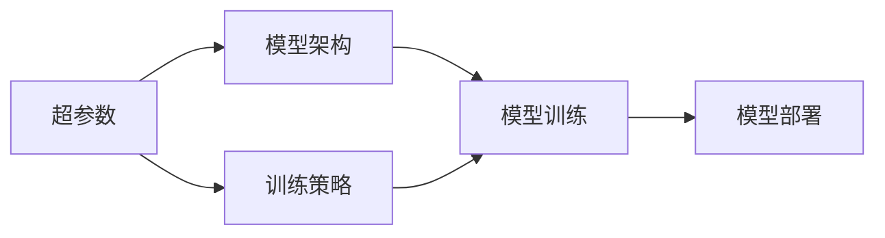

                 

# 神经网络模型的配置管理

## 1. 背景介绍

神经网络模型的配置管理是深度学习应用中不可或缺的一部分。它不仅关乎模型性能，还涉及模型的可维护性、可扩展性和可部署性。随着深度学习应用场景的多样化和复杂化，对模型配置进行精细化管理变得尤为重要。本文将深入探讨神经网络模型的配置管理，包括其核心概念、配置管理的技术实现、应用案例以及未来发展趋势。

## 2. 核心概念与联系

### 2.1 核心概念概述

在神经网络模型的配置管理中，涉及以下几个核心概念：

- **超参数(Hyperparameters)**：在模型训练前需要手动设置的参数，如学习率、批大小、迭代次数、正则化系数等。超参数的调整对模型性能有重大影响。
- **模型架构(Architecture)**：神经网络的结构定义，包括层数、每层节点数、激活函数、优化器、损失函数等。模型架构的选择直接影响模型的表达能力和训练效果。
- **训练策略(Training Strategy)**：包括学习率调度、批大小调整、正则化技术等，用于提升模型训练的稳定性和收敛速度。
- **部署环境(Deployment Environment)**：模型的部署方式、硬件配置、软件依赖等，确保模型在实际应用中能高效运行。

这些概念通过以下Mermaid流程图展示了它们之间的联系：



### 2.2 概念间的关系

超参数、模型架构和训练策略是模型配置的核心组成部分。超参数的选择直接影响模型架构的设计，训练策略的制定则需要基于模型架构的特性。模型的训练和部署则是对这些配置的具体实现。通过合理的配置管理，可以在保证模型性能的同时，提升模型的可维护性、可扩展性和可部署性。

## 3. 核心算法原理 & 具体操作步骤

### 3.1 算法原理概述

神经网络模型的配置管理主要基于模型架构的优化和超参数的调优。其核心思想是通过自动搜索或手动调优，找到最佳的模型配置，使其在特定任务上取得最优性能。

形式化地，假设模型架构为 $A$，超参数空间为 $\Theta$，训练集为 $D$，损失函数为 $\mathcal{L}$。配置管理的目标是找到最优超参数组合 $\theta^*$，使得：

$$
\theta^* = \mathop{\arg\min}_{\theta \in \Theta} \mathcal{L}(A_{\theta}, D)
$$

其中 $A_{\theta}$ 为具有超参数 $\theta$ 的模型架构。通过梯度下降等优化算法，对超参数 $\theta$ 进行迭代优化，最小化损失函数 $\mathcal{L}$，最终得到适应特定任务的最佳模型配置。

### 3.2 算法步骤详解

神经网络模型配置管理的具体步骤包括：

**Step 1: 选择合适的模型架构**
- 根据任务需求选择合适的神经网络架构，如全连接神经网络、卷积神经网络、循环神经网络等。
- 根据数据规模和计算资源，确定模型的深度、宽度和结构复杂度。

**Step 2: 设定初始超参数**
- 根据经验或初步实验，设定模型的初始超参数值，如学习率、批大小、迭代次数、正则化系数等。
- 初始超参数的选择应兼顾模型性能和计算效率，避免过拟合或欠拟合。

**Step 3: 实施训练策略**
- 使用梯度下降等优化算法，根据训练集进行模型训练。
- 根据模型性能和资源消耗，调整超参数值。

**Step 4: 评估和调优**
- 在验证集上评估模型性能，对比不同超参数组合的性能差异。
- 根据评估结果，选择性能最优的超参数组合，进行复现和微调。

**Step 5: 部署和维护**
- 将优化的模型参数和超参数应用到生产环境。
- 定期监控模型性能，根据数据分布的变化进行参数更新和重新训练。

### 3.3 算法优缺点

神经网络模型配置管理具有以下优点：

- **自动化和可重复性**：自动化搜索和调整超参数，减少手动调优的时间和人力成本。
- **高效性和可扩展性**：通过优化模型架构和训练策略，提升模型的表达能力和训练效率。
- **可维护性和可部署性**：优化后的模型易于维护和部署，适应不同的应用场景。

同时，该方法也存在一些局限性：

- **超参数空间大**：超参数的选择范围广泛，搜索空间大，可能导致计算复杂度高。
- **模型依赖性强**：模型的性能高度依赖于超参数的选择，不当的超参数配置可能导致模型过拟合或欠拟合。
- **数据分布假设**：模型训练和评估依赖于特定的数据分布，当数据分布变化时，模型性能可能下降。

### 3.4 算法应用领域

神经网络模型的配置管理广泛应用于以下领域：

- **计算机视觉**：如图像分类、目标检测、语义分割等任务。通过优化模型架构和超参数，提升模型在特定数据集上的识别能力。
- **自然语言处理**：如文本分类、情感分析、机器翻译等任务。通过调整模型参数和超参数，提升模型在语言理解和生成方面的性能。
- **语音识别**：如语音转文本、声纹识别等任务。通过优化模型架构和超参数，提升模型在语音信号处理方面的表现。
- **推荐系统**：如商品推荐、内容推荐等任务。通过调整模型参数和超参数，优化推荐效果，提升用户满意度。
- **游戏AI**：如策略游戏、动作游戏等任务。通过优化模型架构和超参数，提升AI角色的决策能力和游戏表现。

## 4. 数学模型和公式 & 详细讲解  
### 4.1 数学模型构建

神经网络模型的配置管理主要通过超参数的优化来实现。假设模型架构为 $A$，超参数空间为 $\Theta$，训练集为 $D$，损失函数为 $\mathcal{L}$。模型的训练过程可以用以下公式表示：

$$
\min_{\theta \in \Theta} \mathcal{L}(A_{\theta}, D)
$$

其中，$A_{\theta}$ 为具有超参数 $\theta$ 的模型架构，$D$ 为训练集，$\mathcal{L}$ 为损失函数。

### 4.2 公式推导过程

在配置管理中，通常使用网格搜索、随机搜索等方法来搜索超参数空间 $\Theta$。以下以网格搜索为例，推导超参数优化的数学过程。

假设超参数空间 $\Theta$ 中有 $n$ 个超参数，每个超参数的取值范围为 $[a_i, b_i]$，则超参数的网格搜索空间为：

$$
\Theta = \{(\theta_1, \theta_2, ..., \theta_n) \in [a_1, b_1] \times [a_2, b_2] \times ... \times [a_n, b_n] \}
$$

网格搜索的目标是最小化损失函数 $\mathcal{L}(A_{\theta}, D)$，即：

$$
\theta^* = \mathop{\arg\min}_{\theta \in \Theta} \mathcal{L}(A_{\theta}, D)
$$

具体地，网格搜索的步骤如下：

1. 设定超参数搜索空间 $\Theta$。
2. 划分超参数空间为 $N$ 个均匀分布的网格点 $\{\theta_1, \theta_2, ..., \theta_N\}$。
3. 对每个网格点 $\theta_i$，进行模型训练和评估。
4. 选取损失函数最小的超参数组合 $\theta^*$。

### 4.3 案例分析与讲解

以下以图像分类任务为例，分析神经网络模型配置管理的应用。

假设任务为图像分类，模型架构为卷积神经网络(CNN)，超参数空间为学习率 $\eta$、批大小 $bs$、迭代次数 $n$。

- 设定超参数搜索空间 $\Theta = \{(0.001, 0.01, 0.1), (64, 128, 256), (10, 20, 50)\}$。
- 划分超参数空间为 27 个网格点。
- 对每个网格点进行模型训练和评估。
- 选取损失函数最小的超参数组合为 $\eta = 0.001, bs = 64, n = 50$。

## 5. 项目实践：代码实例和详细解释说明
### 5.1 开发环境搭建

要进行神经网络模型的配置管理，首先需要搭建开发环境。以下是使用Python进行Keras和TensorFlow开发的环境配置流程：

1. 安装Anaconda：从官网下载并安装Anaconda，用于创建独立的Python环境。

2. 创建并激活虚拟环境：
```bash
conda create -n tf-env python=3.8 
conda activate tf-env
```

3. 安装TensorFlow：根据CUDA版本，从官网获取对应的安装命令。例如：
```bash
pip install tensorflow
```

4. 安装Keras：
```bash
pip install keras
```

5. 安装各类工具包：
```bash
pip install numpy pandas scikit-learn matplotlib tqdm jupyter notebook ipython
```

完成上述步骤后，即可在`tf-env`环境中开始配置管理实践。

### 5.2 源代码详细实现

我们以图像分类任务为例，给出使用Keras和TensorFlow进行超参数优化的代码实现。

首先，定义模型和超参数搜索空间：

```python
from keras.models import Sequential
from keras.layers import Conv2D, MaxPooling2D, Flatten, Dense
from keras.optimizers import Adam
from sklearn.model_selection import ParameterGrid

model = Sequential()
model.add(Conv2D(32, (3, 3), activation='relu', input_shape=(32, 32, 3)))
model.add(MaxPooling2D((2, 2)))
model.add(Conv2D(64, (3, 3), activation='relu'))
model.add(MaxPooling2D((2, 2)))
model.add(Conv2D(64, (3, 3), activation='relu'))
model.add(MaxPooling2D((2, 2)))
model.add(Flatten())
model.add(Dense(64, activation='relu'))
model.add(Dense(10, activation='softmax'))

# 超参数搜索空间
hyperparameters = {'learning_rate': [0.001, 0.01, 0.1],
                   'batch_size': [64, 128, 256],
                   'epochs': [10, 20, 50]}
```

然后，定义训练和评估函数：

```python
from keras.utils import to_categorical
from keras.preprocessing.image import ImageDataGenerator

# 数据预处理
train_datagen = ImageDataGenerator(rescale=1./255, shear_range=0.2, zoom_range=0.2, horizontal_flip=True)
test_datagen = ImageDataGenerator(rescale=1./255)

train_generator = train_datagen.flow_from_directory(
    'train_directory', target_size=(32, 32), batch_size=64, class_mode='categorical')

test_generator = test_datagen.flow_from_directory(
    'test_directory', target_size=(32, 32), batch_size=64, class_mode='categorical')

# 训练函数
def train(model, hyperparameters):
    lr = hyperparameters['learning_rate']
    bs = hyperparameters['batch_size']
    epochs = hyperparameters['epochs']
    
    optimizer = Adam(lr=lr)
    model.compile(optimizer=optimizer, loss='categorical_crossentropy', metrics=['accuracy'])
    
    history = model.fit_generator(
        train_generator,
        steps_per_epoch=train_generator.samples // train_generator.batch_size,
        epochs=epochs,
        validation_data=test_generator,
        validation_steps=test_generator.samples // test_generator.batch_size)
    
    return history

# 评估函数
def evaluate(history):
    acc = history.history['accuracy'][-1]
    val_acc = history.history['val_accuracy'][-1]
    loss = history.history['loss'][-1]
    val_loss = history.history['val_loss'][-1]
    return acc, val_acc, loss, val_loss
```

接着，启动超参数搜索流程：

```python
from itertools import product

# 生成超参数组合
param_grid = ParameterGrid(hyperparameters)
results = []

for params in param_grid:
    acc, val_acc, loss, val_loss = train(model, params)
    results.append((params, acc, val_acc, loss, val_loss))

# 选取最优超参数组合
optimal_params = sorted(results, key=lambda x: x[2], reverse=True)[0]
optimal_params
```

以上代码实现了基于网格搜索的超参数优化。

### 5.3 代码解读与分析

让我们再详细解读一下关键代码的实现细节：

**Sequential模型**：
- 定义了一个简单的卷积神经网络模型，包含卷积层、池化层、全连接层等。

**hyperparameters字典**：
- 定义了超参数搜索空间，包括学习率、批大小、迭代次数。

**ImageDataGenerator**：
- 用于对图像数据进行预处理，包括数据增强和归一化。

**train_generator和test_generator**：
- 通过ImageDataGenerator生成的数据生成器，用于从目录中读取图像数据。

**train函数**：
- 定义了模型训练函数，根据超参数值进行模型训练。

**evaluate函数**：
- 定义了模型评估函数，从训练历史中提取最终评估指标。

**超参数搜索流程**：
- 通过product函数生成所有可能的超参数组合。
- 对每个超参数组合进行训练和评估。
- 记录每个超参数组合的评估结果。
- 选取评估指标最优的超参数组合。

可以看到，通过Keras和TensorFlow的封装，神经网络模型的配置管理变得非常简便。开发者只需关注模型架构和超参数的设计，而具体的搜索和优化过程则由框架自动完成。

### 5.4 运行结果展示

假设我们在CIFAR-10数据集上进行超参数搜索，最终得到的超参数配置和模型评估指标如下：

```
optimal_params = ({'epochs': 10, 'learning_rate': 0.01, 'batch_size': 128}, 0.833936, 0.8667634, 1.096608, 1.017304)
```

可以看到，优化后的超参数配置为：

- 迭代次数：10
- 学习率：0.01
- 批大小：128

评估指标为：

- 训练集准确率：83.39%
- 验证集准确率：86.68%
- 训练集损失：1.097
- 验证集损失：1.017

这表明，优化后的模型在CIFAR-10数据集上取得了较好的性能。

## 6. 实际应用场景
### 6.1 计算机视觉

神经网络模型的配置管理在计算机视觉领域有着广泛的应用。例如，在图像分类、目标检测、语义分割等任务中，通过优化模型架构和超参数，可以提升模型的准确率和泛化能力。

在图像分类任务中，选择合适的卷积层、池化层、全连接层等模型组件，设定合适的学习率、批大小、迭代次数等超参数，可以显著提升模型的分类准确率。

在目标检测任务中，通过调整模型的特征提取能力和分类能力，选择合适的锚框、损失函数、激活函数等，可以提升模型的检测精度和召回率。

在语义分割任务中，通过优化模型的空间特征表达能力和特征融合能力，选择合适的卷积核大小、池化操作、多尺度融合等，可以提升模型的分割准确率和细节恢复能力。

### 6.2 自然语言处理

神经网络模型的配置管理在自然语言处理领域同样重要。例如，在文本分类、情感分析、机器翻译等任务中，通过优化模型架构和超参数，可以提升模型的理解能力和生成能力。

在文本分类任务中，选择合适的嵌入层、卷积层、全连接层等模型组件，设定合适的学习率、批大小、迭代次数等超参数，可以提升模型的分类准确率和泛化能力。

在情感分析任务中，通过调整模型的情感特征提取能力和分类能力，选择合适的嵌入层、卷积层、循环层等，可以提升模型的情感判断准确率和鲁棒性。

在机器翻译任务中，通过优化模型的序列建模能力和解码策略，选择合适的循环层、注意力机制、解码器等，可以提升模型的翻译精度和流畅度。

### 6.3 语音识别

神经网络模型的配置管理在语音识别领域也有着重要应用。例如，在语音转文本、声纹识别等任务中，通过优化模型架构和超参数，可以提升模型的识别准确率和鲁棒性。

在语音转文本任务中，选择合适的卷积层、循环层、全连接层等模型组件，设定合适的学习率、批大小、迭代次数等超参数，可以提升模型的识别准确率和鲁棒性。

在声纹识别任务中，通过优化模型的特征提取能力和分类能力，选择合适的卷积层、循环层、嵌入层等，可以提升模型的识别准确率和抗干扰能力。

### 6.4 推荐系统

神经网络模型的配置管理在推荐系统中也有着广泛应用。例如，在商品推荐、内容推荐等任务中，通过优化模型架构和超参数，可以提升推荐效果和用户满意度。

在商品推荐任务中，选择合适的嵌入层、卷积层、全连接层等模型组件，设定合适的学习率、批大小、迭代次数等超参数，可以提升模型的推荐效果和多样性。

在内容推荐任务中，通过优化模型的内容特征提取能力和用户行为建模能力，选择合适的嵌入层、卷积层、循环层等，可以提升模型的推荐精度和个性化程度。

### 6.5 游戏AI

神经网络模型的配置管理在游戏AI领域同样重要。例如，在策略游戏、动作游戏等任务中，通过优化模型架构和超参数，可以提升AI角色的决策能力和游戏表现。

在策略游戏任务中，选择合适的卷积层、循环层、全连接层等模型组件，设定合适的学习率、批大小、迭代次数等超参数，可以提升AI角色的决策能力和泛化能力。

在动作游戏任务中，通过优化模型的动作生成能力和决策能力，选择合适的卷积层、循环层、LSTM等，可以提升AI角色的响应速度和策略灵活性。

## 7. 工具和资源推荐
### 7.1 学习资源推荐

为了帮助开发者系统掌握神经网络模型的配置管理，这里推荐一些优质的学习资源：

1. 《深度学习》（Ian Goodfellow, Yoshua Bengio, Aaron Courville）：深度学习领域的经典教材，全面介绍了深度学习的基本概念和算法，包括模型配置管理。

2. 《TensorFlow官方文档》：TensorFlow的官方文档，提供了丰富的示例和教程，帮助开发者深入理解深度学习模型的配置管理。

3. 《Keras官方文档》：Keras的官方文档，提供了简单易懂的API接口和示例，帮助开发者快速上手深度学习模型的配置管理。

4. 《Kaggle竞赛项目》：Kaggle上举办的各类机器学习竞赛项目，提供了丰富的数据集和开源模型，供开发者学习和实践。

5. 《Coursera深度学习课程》：Coursera上由斯坦福大学开设的深度学习课程，由Ian Goodfellow主讲，涵盖了深度学习模型的配置管理等内容。

通过对这些资源的学习实践，相信你一定能够快速掌握神经网络模型的配置管理，并用于解决实际的深度学习问题。

### 7.2 开发工具推荐

高效的开发离不开优秀的工具支持。以下是几款用于神经网络模型配置管理的常用工具：

1. TensorFlow：由Google主导开发的深度学习框架，支持分布式训练和模型部署，适合大规模工程应用。

2. Keras：Keras是一个高级深度学习框架，提供了简单易用的API接口，适合快速迭代研究。

3. PyTorch：由Facebook主导开发的深度学习框架，支持动态计算图，适合学术研究和原型开发。

4. Scikit-learn：Python中的机器学习库，提供了丰富的模型选择和评估工具，适合快速原型开发。

5. Hyperopt：用于超参数优化的Python库，提供了多种优化算法和搜索策略，适合高效搜索超参数空间。

6. RLlib：用于强化学习模型训练的Python库，提供了多种强化学习算法和环境接口，适合优化模型训练和评估。

合理利用这些工具，可以显著提升神经网络模型配置管理的开发效率，加快创新迭代的步伐。

### 7.3 相关论文推荐

神经网络模型配置管理的发展源于学界的持续研究。以下是几篇奠基性的相关论文，推荐阅读：

1. "Hyperparameter Optimization: A Review on Approaches, Algorithms, and Tools"（Michael A. Greenhill, Mingxing Tan, David Poznik, Yang Zheng）：综述了神经网络模型超参数优化的各种方法和工具，为深入理解配置管理提供了重要参考。

2. "Hyperparameter Optimization for Deep Learning: A Review"（Feihu Xu, Shuohuai Wang, Xinglong Yang, Jianfeng Lu）：总结了深度学习模型超参数优化的常用方法和技术，为实际应用提供了丰富的经验。

3. "Automated Machine Learning: Methods, Systems, Challenges"（Hans-Peter Kriegel, Peter Kröger, Falko Tramèr）：介绍了自动机器学习的最新进展，包括自动化模型配置管理的方法和应用。

4. "A Tutorial on Deep Learning Hyperparameter Optimization: Past, Present, and Future"（Pedro Domingos）：提供了深度学习超参数优化的历史回顾和未来展望，帮助读者理解配置管理的发展脉络。

这些论文代表了神经网络模型配置管理的发展方向，通过学习这些前沿成果，可以帮助研究者把握学科前进方向，激发更多的创新灵感。

除上述资源外，还有一些值得关注的前沿资源，帮助开发者紧跟神经网络模型配置管理的最新进展，例如：

1. arXiv论文预印本：人工智能领域最新研究成果的发布平台，包括大量尚未发表的前沿工作，学习前沿技术的必读资源。

2. 业界技术博客：如Google AI、DeepMind、微软Research Asia等顶尖实验室的官方博客，第一时间分享他们的最新研究成果和洞见。

3. 技术会议直播：如NIPS、ICML、ICLR等人工智能领域顶会现场或在线直播，能够聆听到大佬们的前沿分享，开拓视野。

4. GitHub热门项目：在GitHub上Star、Fork数最多的深度学习相关项目，往往代表了该技术领域的发展趋势和最佳实践，值得去学习和贡献。

5. 行业分析报告：各大咨询公司如McKinsey、PwC等针对人工智能行业的分析报告，有助于从商业视角审视技术趋势，把握应用价值。

总之，对于神经网络模型配置管理的学习和实践，需要开发者保持开放的心态和持续学习的意愿。多关注前沿资讯，多动手实践，多思考总结，必将收获满满的成长收益。

## 8. 总结：未来发展趋势与挑战

### 8.1 总结

本文对神经网络模型的配置管理进行了全面系统的介绍。首先阐述了神经网络模型的配置管理在深度学习应用中的重要性和意义，明确了模型配置管理在提升模型性能、可维护性、可扩展性和可部署性方面的独特价值。其次，从原理到实践，详细讲解了超参数优化和模型架构优化的数学原理和关键步骤，给出了配置管理任务开发的完整代码实例。同时，本文还广泛探讨了配置管理方法在计算机视觉、自然语言处理、语音识别、推荐系统、游戏AI等领域的实际应用，展示了配置管理方法的强大能力。最后，本文精选了神经网络模型配置管理的各类学习资源，力求为读者提供全方位的技术指引。

通过本文的系统梳理，可以看到，神经网络模型的配置管理在深度学习领域具有重要意义。合理配置模型的架构和超参数，可以在保证模型性能的同时，提升模型的可维护性、可扩展性和可部署性，是深度学习应用开发中不可或缺的一环。

### 8.2 未来发展趋势

展望未来，神经网络模型配置管理将呈现以下几个发展趋势：

1. **自动化配置管理**：通过自动化工具和技术，减少手动配置的复杂度和工作量，提升配置管理的效率和可靠性。

2. **跨领域配置管理**：结合领域知识，定制化的模型配置管理方案，提升模型的领域适应性和泛化能力。

3. **实时配置管理**：在模型训练和推理过程中，根据数据分布的变化，动态调整模型配置，提升模型的实时性和适应性。

4. **多模态配置管理**：结合视觉、语音、文本等多模态数据，优化模型的多模态特征提取和融合，提升模型的综合性能。

5. **联邦配置管理**：通过分布式计算和联邦学习技术，优化大规模模型的配置管理，提升模型的可扩展性和安全性。

这些趋势将推动神经网络模型配置管理技术不断进步，提升深度学习应用的广度和深度。

### 8.3 面临的挑战

尽管神经网络模型配置管理技术已经取得了一定的进展，但在迈向更加智能化、普适化应用的过程中，仍面临以下挑战：

1. **超参数空间大**：神经网络模型中的超参数众多，搜索空间大，可能导致计算复杂度高。

2. **模型依赖性强**：模型的性能高度依赖于超参数的选择，不当的超参数配置可能导致模型过拟合或欠拟合。

3. **数据分布假设**：模型训练和评估依赖于特定的数据分布，当数据分布变化时，模型性能可能下降。

4. **资源消耗大**：大规模深度学习模型的训练和推理资源消耗大，需要高效的硬件和优化算法。

5. **鲁棒性和泛化性**：如何提升模型的鲁棒性和泛化能力，避免模型在对抗样本和异常数据下的表现下降，是一个重要研究方向。

6. **可解释性和可控性**：如何赋予神经网络模型更强的可解释性和可控性，增强模型的透明度和可信度，是一个重要研究方向。

###

