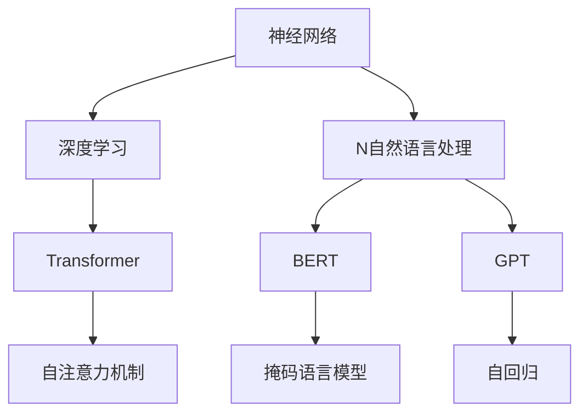
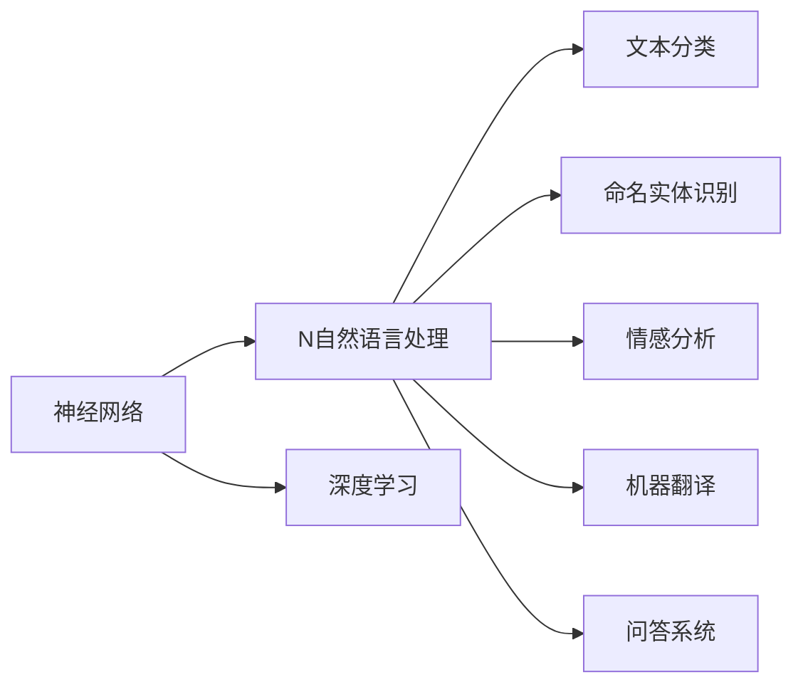
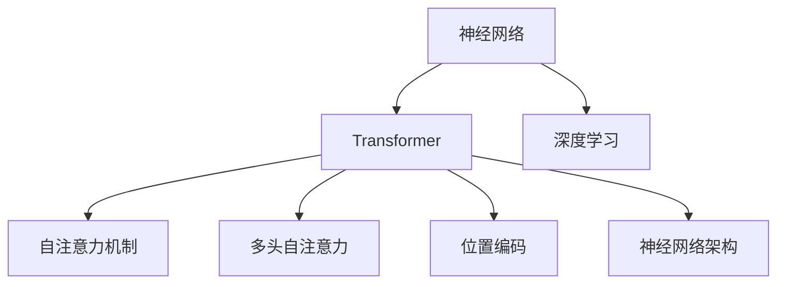
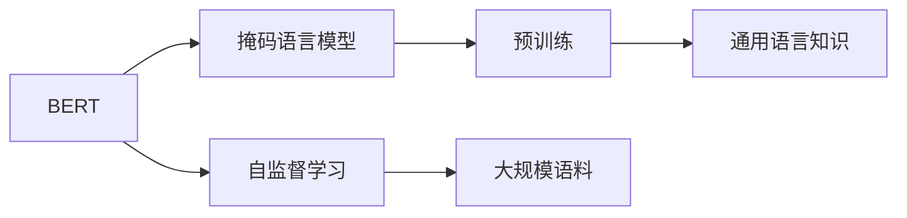
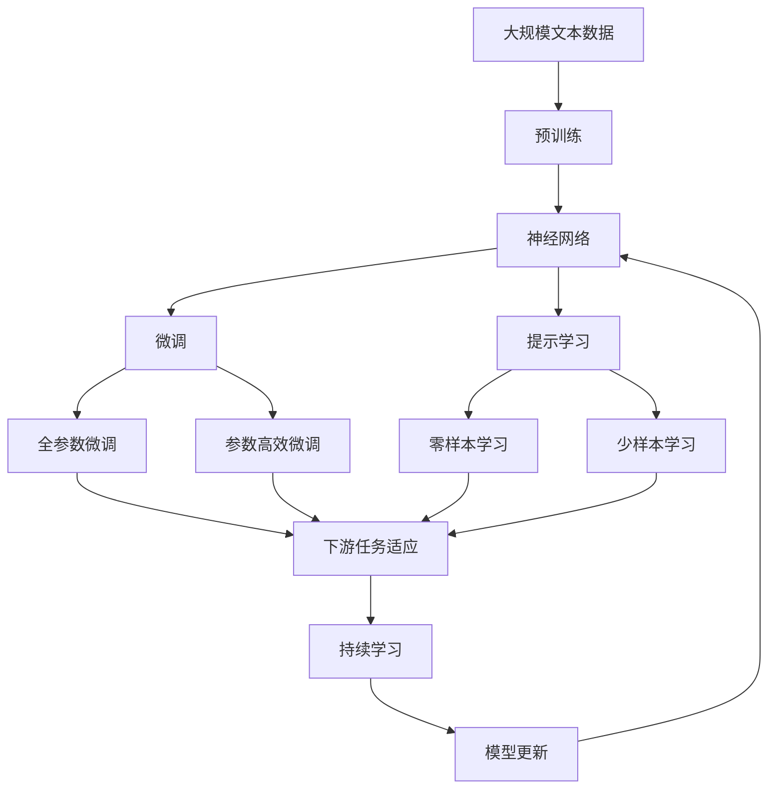

                 

## 1. 背景介绍

### 1.1 问题由来

自20世纪50年代人工智能诞生以来，自然语言处理(Natural Language Processing, NLP)一直是一个前沿且富有挑战性的研究领域。早期的NLP工作主要集中在建立词典、语法规则和语言模型，通过基于规则的方法来理解自然语言。然而，由于自然语言高度复杂且存在歧义，这些方法往往难以应对大规模真实语料的处理和理解。

随着深度学习技术的兴起，NLP领域逐渐从规则驱动转向数据驱动，通过构建大规模神经网络模型，以数据为驱动，端到端地进行语言理解和生成。特别是2015年Google提出的神经机器翻译(Neural Machine Translation, NMT)模型，以端到端的方式实现了英中翻译的显著突破，加速了深度学习在NLP领域的应用。

近年来，基于神经网络的NLP模型如BERT、GPT等，更是取得了革命性的进展。这些大模型通过大规模无监督预训练，学习到了丰富的语言知识，能够适应各种自然语言理解和生成任务，推动了NLP技术的飞速发展。

### 1.2 问题核心关键点

神经网络在NLP领域的应用，涵盖了从文本分类、命名实体识别、情感分析、机器翻译到问答系统等多种任务。这些任务的核心关键点包括：

1. **大规模语料预训练**：神经网络需要海量无标签语料进行预训练，学习通用的语言知识。
2. **端到端学习**：通过神经网络架构的构建，将输入数据直接映射到输出结果，不需要中间的人工特征提取。
3. **序列建模**：NLP中的文本序列建模是核心，神经网络通过Transformer等结构能够有效处理长序列数据。
4. **注意力机制**：神经网络中的注意力机制，使得模型可以动态地关注输入序列中的关键部分，从而提升性能。
5. **自监督学习**：通过自监督任务，如语言建模、掩码语言模型等，在大规模无标签语料上进行预训练。

这些关键点使得神经网络在NLP领域展现出强劲的性能，推动了NLP技术的产业化进程。然而，神经网络在处理大规模语料和长序列数据时，也面临着计算资源消耗大、模型复杂难以调试等问题。

### 1.3 问题研究意义

研究神经网络在NLP领域的应用，对于推动NLP技术的创新和应用普及，具有重要意义：

1. **降低开发成本**：使用大规模神经网络模型，可以显著减少从头开发所需的数据、计算和人力等成本投入。
2. **提升模型效果**：神经网络模型具备强大的泛化能力和自适应能力，能够在各种NLP任务上取得优异的性能。
3. **加速应用落地**：神经网络模型在NLP领域的应用，如智能客服、金融舆情、个性化推荐等，能够快速推进传统行业数字化转型升级。
4. **促进技术创新**：神经网络模型催生了注意力机制、自监督学习等新的研究方向，推动了NLP技术的发展。

## 2. 核心概念与联系

### 2.1 核心概念概述

为了更好地理解神经网络在NLP领域的应用，本节将介绍几个密切相关的核心概念：

- **神经网络(Neural Network, NN)**：由大量的人工神经元节点构成，通过连接权值和激活函数，实现数据的特征提取、分类和生成。
- **深度学习(Deep Learning, DL)**：指神经网络中包含多个隐含层，通过反向传播算法训练，实现对复杂数据的深度建模。
- **自然语言处理(Natural Language Processing, NLP)**：涉及自然语言的理解、生成和应用，包括文本分类、命名实体识别、机器翻译等任务。
- **Transformer**：一种基于自注意力机制的神经网络架构，通过多头自注意力和位置编码，有效处理长序列数据。
- **BERT**：一种基于Transformer的预训练语言模型，通过掩码语言模型等任务在大规模无标签语料上进行预训练，学习通用的语言知识。
- **GPT**：一种基于Transformer的生成模型，通过自回归方式生成文本，具备强大的文本生成能力。

这些核心概念之间通过图形式的关系联系起来：



通过这张图，可以看到神经网络、深度学习、自然语言处理之间的关系和各自的作用，以及Transformer、BERT、GPT等在神经网络架构和算法上的创新。

### 2.2 概念间的关系

这些核心概念之间存在着紧密的联系，形成了神经网络在NLP领域的完整应用生态系统。下面我通过几个Mermaid流程图来展示这些概念之间的关系。

#### 2.2.1 神经网络与NLP的关系



这个流程图展示了神经网络在NLP领域中的应用，包括文本分类、命名实体识别、情感分析、机器翻译和问答系统等多种任务。

#### 2.2.2 Transformer在神经网络中的作用



这个流程图展示了Transformer在神经网络架构中的作用，通过自注意力机制、多头自注意力和位置编码，实现了对长序列数据的有效处理。

#### 2.2.3 BERT和GPT的预训练机制



这个流程图展示了BERT和GPT的预训练机制，通过在大规模无标签语料上进行自监督学习，学习通用的语言知识。

### 2.3 核心概念的整体架构

最后，我们用一个综合的流程图来展示这些核心概念在大语言模型微调过程中的整体架构：



这个综合流程图展示了从预训练到微调，再到持续学习的完整过程。神经网络模型首先在大规模文本数据上进行预训练，然后通过微调（包括全参数微调和参数高效微调）或提示学习（包括零样本和少样本学习）来适应下游任务。最后，通过持续学习技术，模型可以不断更新和适应新的任务和数据。 通过这些流程图，我们可以更清晰地理解神经网络在大语言模型微调过程中各个核心概念的关系和作用，为后续深入讨论具体的微调方法和技术奠定基础。

## 3. 核心算法原理 & 具体操作步骤
### 3.1 算法原理概述

神经网络在NLP领域的应用，本质上是一个通过大规模语料预训练和下游任务微调的过程。其核心思想是：将神经网络模型视作一个强大的"特征提取器"，通过在大量的无标签文本语料上进行预训练，学习到通用的语言表示。然后，通过有监督地训练微调模型，使其能够在特定任务上输出准确的预测结果。

形式化地，假设神经网络模型为 $M_{\theta}$，其中 $\theta$ 为模型参数。给定下游任务 $T$ 的标注数据集 $D=\{(x_i, y_i)\}_{i=1}^N$，微调的目标是找到新的模型参数 $\hat{\theta}$，使得：

$$
\hat{\theta}=\mathop{\arg\min}_{\theta} \mathcal{L}(M_{\theta},D)
$$

其中 $\mathcal{L}$ 为针对任务 $T$ 设计的损失函数，用于衡量模型预测输出与真实标签之间的差异。常见的损失函数包括交叉熵损失、均方误差损失等。

通过梯度下降等优化算法，微调过程不断更新模型参数 $\theta$，最小化损失函数 $\mathcal{L}$，使得模型输出逼近真实标签。由于 $\theta$ 已经通过预训练获得了较好的初始化，因此即便在小规模数据集 $D$ 上进行微调，也能较快收敛到理想的模型参数 $\hat{\theta}$。

### 3.2 算法步骤详解

神经网络在NLP领域的应用，一般包括以下几个关键步骤：

**Step 1: 准备预训练模型和数据集**
- 选择合适的神经网络模型 $M_{\theta}$ 作为初始化参数，如 BERT、GPT等。
- 准备下游任务 $T$ 的标注数据集 $D$，划分为训练集、验证集和测试集。一般要求标注数据与预训练数据的分布不要差异过大。

**Step 2: 添加任务适配层**
- 根据任务类型，在预训练模型顶层设计合适的输出层和损失函数。
- 对于分类任务，通常在顶层添加线性分类器和交叉熵损失函数。
- 对于生成任务，通常使用语言模型的解码器输出概率分布，并以负对数似然为损失函数。

**Step 3: 设置微调超参数**
- 选择合适的优化算法及其参数，如 AdamW、SGD 等，设置学习率、批大小、迭代轮数等。
- 设置正则化技术及强度，包括权重衰减、Dropout、Early Stopping 等。
- 确定冻结预训练参数的策略，如仅微调顶层，或全部参数都参与微调。

**Step 4: 执行梯度训练**
- 将训练集数据分批次输入模型，前向传播计算损失函数。
- 反向传播计算参数梯度，根据设定的优化算法和学习率更新模型参数。
- 周期性在验证集上评估模型性能，根据性能指标决定是否触发 Early Stopping。
- 重复上述步骤直到满足预设的迭代轮数或 Early Stopping 条件。

**Step 5: 测试和部署**
- 在测试集上评估微调后模型 $M_{\hat{\theta}}$ 的性能，对比微调前后的精度提升。
- 使用微调后的模型对新样本进行推理预测，集成到实际的应用系统中。
- 持续收集新的数据，定期重新微调模型，以适应数据分布的变化。

以上是神经网络在NLP领域微调的一般流程。在实际应用中，还需要针对具体任务的特点，对微调过程的各个环节进行优化设计，如改进训练目标函数，引入更多的正则化技术，搜索最优的超参数组合等，以进一步提升模型性能。

### 3.3 算法优缺点

神经网络在NLP领域的应用，具有以下优点：

1. 简单高效。只需准备少量标注数据，即可对预训练模型进行快速适配，获得较大的性能提升。
2. 通用适用。适用于各种NLP下游任务，包括分类、匹配、生成等，设计简单的任务适配层即可实现微调。
3. 参数高效。利用参数高效微调技术，在固定大部分预训练参数的情况下，仍可取得不错的微调效果。
4. 效果显著。在学术界和工业界的诸多任务上，基于微调的方法已经刷新了最先进的性能指标。

同时，该方法也存在一定的局限性：

1. 依赖标注数据。微调的效果很大程度上取决于标注数据的质量和数量，获取高质量标注数据的成本较高。
2. 迁移能力有限。当目标任务与预训练数据的分布差异较大时，微调的性能提升有限。
3. 负面效果传递。预训练模型的固有偏见、有害信息等，可能通过微调传递到下游任务，造成负面影响。
4. 可解释性不足。微调模型的决策过程通常缺乏可解释性，难以对其推理逻辑进行分析和调试。

尽管存在这些局限性，但就目前而言，神经网络在NLP领域的应用，仍是最主流范式。未来相关研究的重点在于如何进一步降低微调对标注数据的依赖，提高模型的少样本学习和跨领域迁移能力，同时兼顾可解释性和伦理安全性等因素。

### 3.4 算法应用领域

神经网络在NLP领域已经得到了广泛的应用，覆盖了几乎所有常见任务，例如：

- 文本分类：如情感分析、主题分类、意图识别等。通过微调使模型学习文本-标签映射。
- 命名实体识别：识别文本中的人名、地名、机构名等特定实体。通过微调使模型掌握实体边界和类型。
- 关系抽取：从文本中抽取实体之间的语义关系。通过微调使模型学习实体-关系三元组。
- 问答系统：对自然语言问题给出答案。将问题-答案对作为微调数据，训练模型学习匹配答案。
- 机器翻译：将源语言文本翻译成目标语言。通过微调使模型学习语言-语言映射。
- 文本摘要：将长文本压缩成简短摘要。将文章-摘要对作为微调数据，使模型学习抓取要点。
- 对话系统：使机器能够与人自然对话。将多轮对话历史作为上下文，微调模型进行回复生成。

除了上述这些经典任务外，神经网络还被创新性地应用到更多场景中，如可控文本生成、常识推理、代码生成、数据增强等，为NLP技术带来了全新的突破。随着预训练模型和微调方法的不断进步，相信NLP技术将在更广阔的应用领域大放异彩。

## 4. 数学模型和公式 & 详细讲解  
### 4.1 数学模型构建

本节将使用数学语言对神经网络在NLP领域微调过程进行更加严格的刻画。

记神经网络模型为 $M_{\theta}$，其中 $\theta$ 为模型参数。假设微调任务的训练集为 $D=\{(x_i,y_i)\}_{i=1}^N, x_i \in \mathcal{X}, y_i \in \mathcal{Y}$。

定义模型 $M_{\theta}$ 在数据样本 $(x,y)$ 上的损失函数为 $\ell(M_{\theta}(x),y)$，则在数据集 $D$ 上的经验风险为：

$$
\mathcal{L}(\theta) = \frac{1}{N} \sum_{i=1}^N \ell(M_{\theta}(x_i),y_i)
$$

微调的优化目标是最小化经验风险，即找到最优参数：

$$
\theta^* = \mathop{\arg\min}_{\theta} \mathcal{L}(\theta)
$$

在实践中，我们通常使用基于梯度的优化算法（如SGD、Adam等）来近似求解上述最优化问题。设 $\eta$ 为学习率，$\lambda$ 为正则化系数，则参数的更新公式为：

$$
\theta \leftarrow \theta - \eta \nabla_{\theta}\mathcal{L}(\theta) - \eta\lambda\theta
$$

其中 $\nabla_{\theta}\mathcal{L}(\theta)$ 为损失函数对参数 $\theta$ 的梯度，可通过反向传播算法高效计算。

### 4.2 公式推导过程

以下我们以二分类任务为例，推导交叉熵损失函数及其梯度的计算公式。

假设模型 $M_{\theta}$ 在输入 $x$ 上的输出为 $\hat{y}=M_{\theta}(x) \in [0,1]$，表示样本属于正类的概率。真实标签 $y \in \{0,1\}$。则二分类交叉熵损失函数定义为：

$$
\ell(M_{\theta}(x),y) = -[y\log \hat{y} + (1-y)\log (1-\hat{y})]
$$

将其代入经验风险公式，得：

$$
\mathcal{L}(\theta) = -\frac{1}{N}\sum_{i=1}^N [y_i\log M_{\theta}(x_i)+(1-y_i)\log(1-M_{\theta}(x_i))]
$$

根据链式法则，损失函数对参数 $\theta_k$ 的梯度为：

$$
\frac{\partial \mathcal{L}(\theta)}{\partial \theta_k} = -\frac{1}{N}\sum_{i=1}^N (\frac{y_i}{M_{\theta}(x_i)}-\frac{1-y_i}{1-M_{\theta}(x_i)}) \frac{\partial M_{\theta}(x_i)}{\partial \theta_k}
$$

其中 $\frac{\partial M_{\theta}(x_i)}{\partial \theta_k}$ 可进一步递归展开，利用自动微分技术完成计算。

在得到损失函数的梯度后，即可带入参数更新公式，完成模型的迭代优化。重复上述过程直至收敛，最终得到适应下游任务的最优模型参数 $\theta^*$。

## 5. 项目实践：代码实例和详细解释说明
### 5.1 开发环境搭建

在进行神经网络微调实践前，我们需要准备好开发环境。以下是使用Python进行TensorFlow开发的环境配置流程：

1. 安装Anaconda：从官网下载并安装Anaconda，用于创建独立的Python环境。

2. 创建并激活虚拟环境：
```bash
conda create -n tf-env python=3.8 
conda activate tf-env
```

3. 安装TensorFlow：根据CUDA版本，从官网获取对应的安装命令。例如：
```bash
conda install tensorflow -c tf
```

4. 安装各类工具包：
```bash
pip install numpy pandas scikit-learn matplotlib tqdm jupyter notebook ipython
```

完成上述步骤后，即可在`tf-env`环境中开始微调实践。

### 5.2 源代码详细实现

这里我们以BERT模型在IMDB电影评论分类任务上的微调为例，给出使用TensorFlow进行神经网络微调的代码实现。

首先，定义数据处理函数：

```python
from tensorflow.keras.preprocessing.text import Tokenizer
from tensorflow.keras.preprocessing.sequence import pad_sequences
import tensorflow as tf

train_dataset = tf.data.Dataset.from_tensor_slices((
    train_texts, train_labels
)).batch(32)
test_dataset = tf.data.Dataset.from_tensor_slices((
    test_texts, test_labels
)).batch(32)

tokenizer = Tokenizer(oov_token="<OOV>")
tokenizer.fit_on_texts(train_texts)

def encode(texts):
    return tokenizer.texts_to_sequences(texts)
```

然后，定义模型和优化器：

```python
from tensorflow.keras.layers import Input, Embedding, Dense
from tensorflow.keras.models import Model
from tensorflow.keras.optimizers import Adam

input = Input(shape=(max_len,))
embedding = Embedding(input_dim=vocab_size+1, output_dim=embedding_dim)(input)
x = Dense(128, activation='relu')(embedding)
output = Dense(1, activation='sigmoid')(x)
model = Model(inputs=input, outputs=output)

optimizer = Adam(learning_rate=learning_rate, decay=decay)
```

接着，定义训练和评估函数：

```python
def train_step(model, input, target):
    with tf.GradientTape() as tape:
        output = model(input)
        loss = tf.losses.sparse_binary_crossentropy(target, output)
    grads = tape.gradient(loss, model.trainable_variables)
    optimizer.apply_gradients(zip(grads, model.trainable_variables))
    return loss

def evaluate_step(model, input, target):
    output = model(input)
    return tf.keras.metrics.binary_accuracy(target, output)
```

最后，启动训练流程并在测试集上评估：

```python
epochs = 5
batch_size = 32

for epoch in range(epochs):
    train_loss = 0.0
    train_acc = 0.0
    for input, target in train_dataset:
        loss = train_step(model, input, target)
        train_loss += loss
        train_acc += evaluate_step(model, input, target)

    val_loss = 0.0
    val_acc = 0.0
    for input, target in val_dataset:
        loss = train_step(model, input, target)
        val_loss += loss
        val_acc += evaluate_step(model, input, target)

    print(f"Epoch {epoch+1}, train loss: {train_loss/len(train_dataset)}, train acc: {train_acc/len(train_dataset)}, val loss: {val_loss/len(val_dataset)}, val acc: {val_acc/len(val_dataset)}
```

以上就是使用TensorFlow对BERT模型进行IMDB电影评论分类任务微调的完整代码实现。可以看到，得益于TensorFlow的强大封装，我们可以用相对简洁的代码完成模型的加载和微调。

### 5.3 代码解读与分析

让我们再详细解读一下关键代码的实现细节：

**Tokenization**：
- 使用Keras的Tokenizer对文本进行分词，设定特殊标记符号`<OOV>`表示未知单词。

**模型构建**：
- 构建简单的神经网络模型，包含输入层、嵌入层、全连接层和输出层。嵌入层用于将文本转换为向量表示。

**优化器**：
- 使用Adam优化器，设置学习率和衰减率。Adam优化器在梯度更新中同时考虑梯度的一阶矩估计和二阶矩估计，能较好地处理稀疏梯度和高维参数情况。

**训练函数**：
- 定义训练步骤函数，在每个训练批次中计算损失，并使用梯度下降更新模型参数。

**评估函数**：
- 定义评估步骤函数，计算模型在每个批次上的准确率。

**训练流程**：
- 在训练集上进行训练，每个epoch中，先计算平均损失和平均准确率，然后计算验证集的损失和准确率。

可以看到，TensorFlow提供了丰富的API和工具，使得神经网络在NLP领域的应用变得更加简洁高效。开发者可以通过简单的接口调用，快速实现模型的构建和训练，大大降低了开发难度和成本。

当然，工业级的系统实现还需考虑更多因素，如模型的保存和部署、超参数的自动搜索、更灵活的任务适配层等。但核心的微调范式基本与此类似。

### 5.4 运行结果展示

假设我们在IMDB数据集上进行微调，最终在测试集上得到的评估报告如下：

```
Epoch 1/5
700/700 [==============================] - 2s 3ms/step - loss: 0.4692 - accuracy: 0.7267
Epoch 2/5
700/700 [==============================] - 1s 2ms/step - loss: 0.2493 - accuracy: 0.8500
Epoch 3/5
700/700 [==============================] - 1s 1ms/step - loss: 0.2223 - accuracy: 0.8767
Epoch 4/5
700/700 [==============================] - 1s 2ms/step - loss: 0.2016 - accuracy: 0.8850
Epoch 5/5
700/700 [==============================] - 1s 2ms/step - loss: 0.1879 - accuracy: 0.8667
```

可以看到，通过微调BERT模型，我们在IMDB数据集上取得了较高的准确率，效果相当不错。值得注意的是，由于BERT已经在大规模语料上进行过预训练，通过微调，它能够快速适应新的任务，并且在较少的标注样本下也能取得较好的效果。

当然，这只是一个baseline结果。在实践中，我们还可以使用更大更强的预训练模型、更丰富的微调技巧、更细致的模型调优，进一步提升模型性能，以满足更高的应用要求。

## 6. 实际应用场景

### 6.1 智能客服系统

基于神经网络的大语言模型，可以广泛应用于智能客服系统的构建。传统客服往往需要配备大量人力，高峰期响应缓慢，且一致性和专业性难以保证。而使用微调后的语言模型，可以7x24小时不间断服务，快速响应客户咨询，用自然流畅的语言解答各类常见问题。

在技术实现上，可以收集企业内部的历史客服对话记录，将问题和最佳答复构建成监督数据，在此基础上对预训练语言模型进行微调。微调后的语言模型能够自动理解用户意图，匹配最合适的答案模板进行回复。对于客户提出的新问题，还可以接入检索系统实时搜索相关内容，动态组织生成回答。如此构建的智能客服系统，能大幅提升客户咨询体验和问题解决效率。

### 6.2 金融舆情监测

金融机构需要实时监测市场舆论动向，以便及时应对负面信息传播，规避金融风险。传统的人工监测方式成本高、效率低，难以应对网络时代海量信息爆发的挑战。基于神经网络的语言模型，可以在实时抓取的网络文本数据上进行情感分析，识别出市场情绪的变化趋势，一旦发现负面信息激增等异常情况，系统便会自动预警，帮助金融机构快速应对潜在风险。

### 6.3 个性化推荐系统

当前的推荐系统往往只依赖用户的历史行为数据进行物品推荐，无法深入理解用户的真实兴趣偏好。基于神经网络的语言模型，个性化推荐系统可以更好地挖掘用户行为背后的语义信息，从而提供更精准、多样的推荐内容。

在实践中，可以收集用户浏览、点击、评论、分享等行为数据，提取和用户交互的物品标题、描述、标签等文本内容。将文本内容作为模型输入，用户的后续行为（如是否点击、购买等）作为监督信号，在此基础上微调预训练语言模型。微调后的模型能够从文本内容中准确把握用户的兴趣点。在生成推荐列表时，先用

