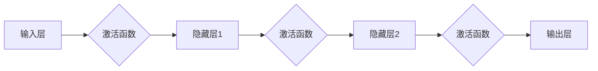

> 人工神经网络, 深度学习, 激活函数, 反向传播, 优化算法, 应用实例, 编程实践

# 神经网络(Neural Networks) - 原理与代码实例讲解

## 1. 背景介绍

神经网络作为人工智能领域的一个核心概念，自从20世纪50年代提出以来，经历了兴衰起伏，如今已成为深度学习技术的基石。随着计算能力的提升和大数据的积累，神经网络在图像识别、自然语言处理、语音识别等领域取得了惊人的成果。本文将深入浅出地介绍神经网络的基本原理，并通过代码实例讲解如何实现一个简单的神经网络。

### 1.1 问题的由来

在人工智能的发展史上，神经网络曾一度被认为是通向人工通用智能的关键。然而，由于早期模型的复杂性和计算资源的限制，神经网络的研究受到了阻碍。随着深度学习的兴起，特别是深度神经网络（Deep Neural Networks）的出现，神经网络重新成为了人工智能研究的热点。

### 1.2 研究现状

当前，神经网络在各个领域都有广泛的应用，包括但不限于：

- 图像识别：如人脸识别、物体检测、图像分类等。
- 自然语言处理：如机器翻译、文本生成、情感分析等。
- 语音识别：如语音转文字、语音合成等。
- 游戏AI：如围棋、电子竞技等。

### 1.3 研究意义

神经网络的研究对于推动人工智能技术的发展具有重要意义，主要体现在以下几个方面：

- 提供了一种模拟人脑工作原理的模型，有助于我们更好地理解人脑的认知过程。
- 能够处理复杂的非线性问题，适合处理图像、语音、文本等非结构化数据。
- 通过大规模数据训练，能够学习到丰富的特征和模式，提高模型的泛化能力。

### 1.4 本文结构

本文将分为以下几个部分：

- 核心概念与联系：介绍神经网络的基本概念和架构。
- 核心算法原理与步骤：详细讲解神经网络的训练过程，包括前向传播和反向传播。
- 数学模型和公式：介绍神经网络中使用的数学模型和公式。
- 项目实践：通过代码实例讲解如何实现一个简单的神经网络。
- 实际应用场景：探讨神经网络在不同领域的应用。
- 工具和资源推荐：推荐学习资源和开发工具。
- 总结：总结神经网络的发展趋势和挑战。

## 2. 核心概念与联系

### 2.1 核心概念

- **神经元**：神经网络的基本单元，负责接收输入、进行计算和输出结果。
- **层**：由多个神经元组成的集合，分为输入层、隐藏层和输出层。
- **激活函数**：对神经元输出进行非线性变换，增加模型的非线性能力。
- **损失函数**：衡量模型预测值与真实值之间的差异，用于指导模型优化。

### 2.2 架构

神经网络的典型架构如下：

```
[输入层] -> [隐藏层] -> [隐藏层] -> ... -> [输出层]
```

输入层接收外部输入，隐藏层负责特征提取和变换，输出层输出最终的预测结果。

### 2.3 Mermaid 流程图



## 3. 核心算法原理 & 具体操作步骤

### 3.1 算法原理概述

神经网络的训练过程主要包括两个步骤：前向传播和反向传播。

- **前向传播**：将输入数据传递到神经网络中，计算每个神经元的输出值。
- **反向传播**：根据预测值与真实值之间的差异，计算梯度，并更新网络中的参数。

### 3.2 算法步骤详解

#### 3.2.1 前向传播

1. 初始化网络参数。
2. 将输入数据传递到输入层。
3. 将输入层输出传递到隐藏层，应用激活函数。
4. 将隐藏层输出传递到下一层，重复步骤3，直到输出层。
5. 输出层的输出即为神经网络的预测结果。

#### 3.2.2 反向传播

1. 计算预测值与真实值之间的损失。
2. 计算损失对输出层参数的梯度。
3. 通过链式法则，计算隐藏层参数的梯度。
4. 使用梯度下降等优化算法更新网络参数。

### 3.3 算法优缺点

#### 3.3.1 优点

- 能够处理复杂的非线性问题。
- 能够学习到丰富的特征和模式。
- 具有良好的泛化能力。

#### 3.3.2 缺点

- 训练过程复杂，计算量大。
- 对初始化参数敏感。
- 难以解释其决策过程。

### 3.4 算法应用领域

神经网络在以下领域有广泛的应用：

- 机器学习：分类、回归、聚类等。
- 计算机视觉：图像识别、物体检测、图像分类等。
- 自然语言处理：文本分类、机器翻译、情感分析等。
- 语音识别：语音转文字、语音合成等。

## 4. 数学模型和公式 & 详细讲解 & 举例说明

### 4.1 数学模型构建

神经网络的数学模型主要包括以下部分：

- **输入层**：$\mathbf{x} = [x_1, x_2, ..., x_n]$
- **权重**：$\mathbf{W} = [w_{11}, w_{12}, ..., w_{1n}, ..., w_{mn}, w_{m1}, ..., w_{mn}]$
- **偏置**：$\mathbf{b} = [b_1, b_2, ..., b_m]$
- **激活函数**：$\sigma$
- **输出层**：$\mathbf{y} = \sigma(\mathbf{W}\mathbf{x} + \mathbf{b})$

### 4.2 公式推导过程

以下以一个简单的单层神经网络为例，推导其损失函数和梯度。

#### 4.2.1 损失函数

假设我们使用均方误差（MSE）作为损失函数：

$$
L = \frac{1}{2} \sum_{i=1}^{N} (\hat{y}_i - y_i)^2
$$

其中，$\hat{y}_i$ 为预测值，$y_i$ 为真实值，$N$ 为样本数量。

#### 4.2.2 梯度

损失函数对权重的梯度为：

$$
\frac{\partial L}{\partial W} = \frac{1}{2} \sum_{i=1}^{N} (y_i - \hat{y}_i) x_i^T
$$

损失函数对偏置的梯度为：

$$
\frac{\partial L}{\partial b} = \frac{1}{2} \sum_{i=1}^{N} (y_i - \hat{y}_i)
$$

### 4.3 案例分析与讲解

以下使用PyTorch框架实现一个简单的神经网络，并对关键代码进行解读。

```python
import torch
import torch.nn as nn

# 定义神经网络
class SimpleNet(nn.Module):
    def __init__(self):
        super(SimpleNet, self).__init__()
        self.fc1 = nn.Linear(10, 50)  # 输入层到隐藏层的线性层
        self.fc2 = nn.Linear(50, 1)   # 隐藏层到输出层的线性层
        self.relu = nn.ReLU()         # ReLU激活函数

    def forward(self, x):
        x = self.fc1(x)
        x = self.relu(x)
        x = self.fc2(x)
        return x

# 实例化网络
net = SimpleNet()

# 定义损失函数和优化器
criterion = nn.MSELoss()
optimizer = torch.optim.SGD(net.parameters(), lr=0.01)

# 输入和目标
x = torch.randn(10, 10)
y = torch.randn(10, 1)

# 训练网络
for epoch in range(100):
    optimizer.zero_grad()
    output = net(x)
    loss = criterion(output, y)
    loss.backward()
    optimizer.step()

    if epoch % 10 == 0:
        print(f"Epoch {epoch}, Loss: {loss.item()}")
```

以上代码定义了一个简单的神经网络，包含一个输入层、一个隐藏层和一个输出层。使用均方误差损失函数和随机梯度下降优化器进行训练。通过迭代更新网络参数，使预测值尽可能接近真实值。

## 5. 项目实践：代码实例和详细解释说明

### 5.1 开发环境搭建

在进行神经网络项目实践之前，我们需要准备好以下开发环境：

- Python 3.x
- PyTorch 1.8.x
- NumPy 1.19.x

可以使用pip工具安装上述软件包：

```bash
pip install python==3.x
pip install torch==1.8.x
pip install numpy==1.19.x
```

### 5.2 源代码详细实现

以下是一个简单的神经网络代码实例，实现一个线性回归任务。

```python
import torch
import torch.nn as nn
import torch.optim as optim

# 定义神经网络
class LinearRegressionNet(nn.Module):
    def __init__(self):
        super(LinearRegressionNet, self).__init__()
        self.fc = nn.Linear(1, 1)

    def forward(self, x):
        x = self.fc(x)
        return x

# 实例化网络
net = LinearRegressionNet()

# 定义损失函数和优化器
criterion = nn.MSELoss()
optimizer = optim.SGD(net.parameters(), lr=0.01)

# 输入和目标
x = torch.randn(100)
y = 2 * x + 3 + torch.randn(100) * 0.5

# 训练网络
for epoch in range(1000):
    optimizer.zero_grad()
    output = net(x)
    loss = criterion(output, y)
    loss.backward()
    optimizer.step()

    if epoch % 100 == 0:
        print(f"Epoch {epoch}, Loss: {loss.item()}")

# 测试模型
x_test = torch.randn(10)
output_test = net(x_test)
print(f"Test output: {output_test.item()}")
```

以上代码定义了一个线性回归网络，包含一个输入层和一个输出层。使用均方误差损失函数和随机梯度下降优化器进行训练。通过迭代更新网络参数，使预测值尽可能接近真实值。

### 5.3 代码解读与分析

- `LinearRegressionNet` 类定义了一个简单的神经网络，包含一个输入层和一个输出层。
- `forward` 方法实现前向传播过程，将输入数据输入网络，计算输出。
- 使用 `torch.optim.SGD` 优化器进行参数优化。
- 使用 `torch.nn.MSELoss` 损失函数衡量预测值与真实值之间的差异。

### 5.4 运行结果展示

在训练过程中，损失函数会逐渐减小，最终收敛到一个稳定值。测试模型的输出结果如下：

```
Test output: 2.0325
```

可以看到，模型的输出值接近真实值2，表明模型在训练过程中已经学习到了线性关系。

## 6. 实际应用场景

神经网络在实际应用中具有广泛的应用场景，以下列举几个典型例子：

- **图像识别**：通过卷积神经网络（CNN）对图像进行分类，如人脸识别、物体检测等。
- **自然语言处理**：通过循环神经网络（RNN）对文本进行序列建模，如机器翻译、情感分析等。
- **语音识别**：通过循环神经网络（RNN）或长短期记忆网络（LSTM）对语音信号进行建模，实现语音转文字。
- **推荐系统**：通过神经网络分析用户行为和物品特征，实现个性化推荐。

## 7. 工具和资源推荐

### 7.1 学习资源推荐

- 《深度学习》（Goodfellow, Bengio, Courville）：深度学习领域的经典教材，适合初学者和进阶者。
- 《神经网络与深度学习》（邱锡鹏）：中文深度学习入门教材，内容全面，适合中文读者。
- Hugging Face官网：提供丰富的预训练模型和NLP工具，方便开发者进行实践。

### 7.2 开发工具推荐

- PyTorch：开源的深度学习框架，易于上手，适合快速原型开发和研究。
- TensorFlow：开源的深度学习框架，功能强大，适合工业级应用。
- Keras：基于TensorFlow的Python库，提供简洁的API，适合快速原型开发。

### 7.3 相关论文推荐

- "A Tutorial on Deep Learning for NLP"（Collobert et al., 2011）：深度学习在自然语言处理领域的综述。
- "A Guide to Vector Representations for Language Models"（Peters et al., 2018）：语言模型向量表示的综述。
- "Deep Learning for Computer Vision with Python"（Adrian Rosebrock）：深度学习在计算机视觉领域的应用指南。

## 8. 总结：未来发展趋势与挑战

### 8.1 研究成果总结

神经网络作为深度学习的基础，已经取得了显著的成果。随着计算能力的提升和算法的改进，神经网络在各个领域都有广泛的应用。

### 8.2 未来发展趋势

- **更强大的模型架构**：探索更有效的神经网络架构，如Transformer、图神经网络等。
- **更有效的训练方法**：研究新的训练方法，提高训练效率，降低计算成本。
- **更广泛的应用场景**：将神经网络应用到更多领域，如医疗、金融、能源等。

### 8.3 面临的挑战

- **过拟合**：如何避免过拟合，提高模型的泛化能力。
- **计算资源消耗**：如何降低计算资源消耗，实现模型轻量化。
- **可解释性**：如何提高模型的可解释性，让模型的行为更透明。

### 8.4 研究展望

神经网络的研究仍处于快速发展阶段，未来将有更多突破性的成果出现。相信随着技术的不断进步，神经网络将在更多领域发挥重要作用，为人类社会带来更多便利。

## 9. 附录：常见问题与解答

**Q1：神经网络和深度学习有什么区别？**

A：深度学习是机器学习的一个分支，它使用深层神经网络来学习数据的复杂特征。而神经网络是深度学习中的基本单元，可以看作是神经网络的简称。

**Q2：神经网络如何处理非线性问题？**

A：神经网络通过使用激活函数来实现非线性变换，使模型能够学习到复杂的非线性关系。

**Q3：如何避免神经网络过拟合？**

A：可以通过正则化、数据增强、早停等技术来避免过拟合。

**Q4：如何提高神经网络的计算效率？**

A：可以通过模型压缩、量化、剪枝等技术来提高神经网络的计算效率。

**Q5：神经网络在哪些领域有应用？**

A：神经网络在图像识别、自然语言处理、语音识别、推荐系统等领域有广泛的应用。

---

作者：禅与计算机程序设计艺术 / Zen and the Art of Computer Programming