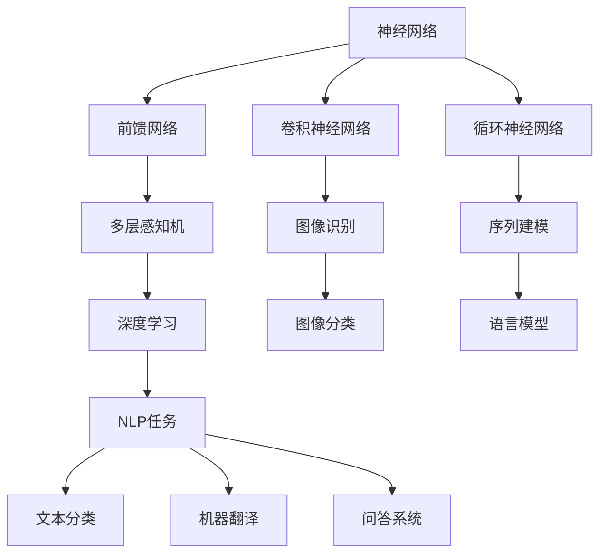
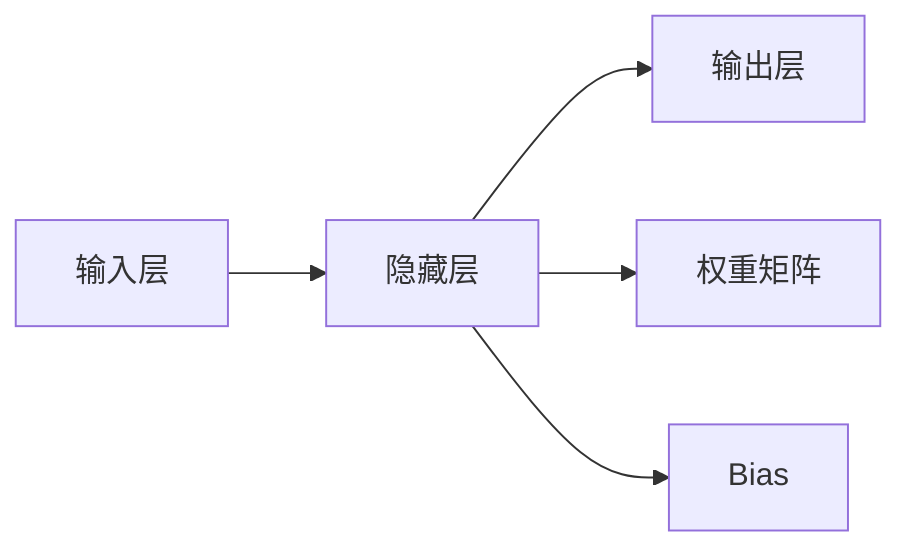
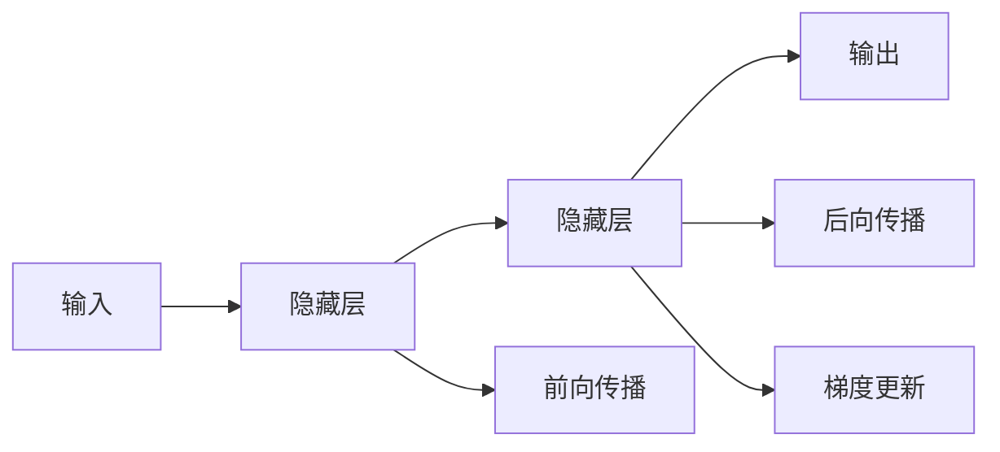
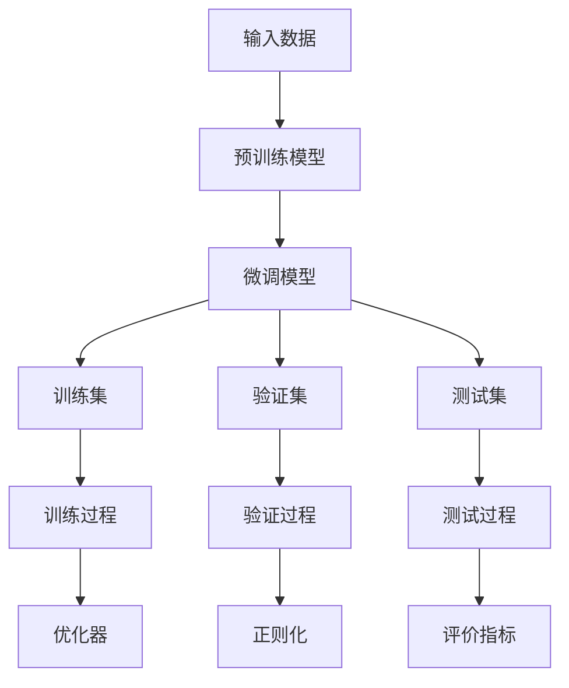

                 

# 神经网络：开启智能新纪元

## 1. 背景介绍

### 1.1 问题由来

随着计算机技术和人工智能的发展，神经网络已成为实现智能化的重要工具。在图像识别、语音识别、自然语言处理等领域，神经网络以其强大的表示和计算能力，实现了诸多突破性进展。神经网络的提出和发展，不仅是计算机科学的重大里程碑，更开启了智能计算的新纪元。

然而，尽管神经网络在多个领域展现了卓越的性能，但其内部机理和数学基础仍不完全透明，甚至在一定程度上被视为"黑箱"。如何理解神经网络的内部工作原理，并在此基础上进一步改进和优化，是摆在学界和产业界面前的重大挑战。

### 1.2 问题核心关键点

神经网络的核心关键点包括：

- **神经元(Neuron)**：神经网络的基本单元，接收输入、加权求和、引入非线性激活函数，最终输出信号。
- **激活函数(Activation Function)**：引入非线性特性，使神经网络具备逼近复杂非线性函数的能力。
- **权重矩阵(Weight Matrix)**：将输入信号线性变换，实现特征提取和映射。
- **反向传播(Backpropagation)**：通过链式法则，计算损失函数对权重的导数，从而优化模型参数。
- **损失函数(Loss Function)**：衡量模型输出与真实标签之间的差异，指导模型参数优化。
- **优化器(Optimizer)**：使用梯度下降等优化算法，自动更新模型参数，最小化损失函数。

神经网络通过这些核心组件，能够学习输入数据的分布和结构，并在此基础上进行特征提取和模式识别，最终实现对复杂任务的预测和生成。

### 1.3 问题研究意义

研究神经网络的内部机理和优化方法，对推进人工智能技术的落地应用具有重要意义：

1. **提升模型性能**：通过理解神经网络的内部工作机制，可以更好地设计模型架构和优化算法，提升模型在各类任务上的表现。
2. **减少资源消耗**：优化神经网络的结构和参数，可以降低模型训练和推理的资源需求，提高计算效率。
3. **增强模型鲁棒性**：改进神经网络的训练方法和正则化技术，可以提高模型的鲁棒性和泛化能力，减少过拟合和泛化不足。
4. **拓展应用范围**：深入研究神经网络的机理，可以探索更多创新应用，如生成对抗网络、自监督学习等。
5. **推动学科发展**：神经网络的发展催生了大量新的研究方向和分支，如深度学习、强化学习等，推动了整个计算机科学和人工智能领域的发展。

## 2. 核心概念与联系

### 2.1 核心概念概述

为更好地理解神经网络的核心概念和算法流程，本节将介绍几个密切相关的核心概念：

- **神经网络(Neural Network)**：由多个神经元层堆叠组成的非线性模型，常用于回归、分类、生成等任务。
- **前馈网络(Feedforward Neural Network)**：典型的神经网络结构，数据从前向输入，经过多层神经元逐级传递，最终输出结果。
- **卷积神经网络(CNN)**：用于图像处理的特殊神经网络结构，通过卷积操作提取局部特征，显著提高图像识别的准确率。
- **循环神经网络(RNN)**：用于序列数据处理的神经网络结构，能够捕捉时间序列上的依赖关系，广泛应用于语言建模、机器翻译等任务。
- **长短期记忆网络(LSTM)**：一种特殊的RNN结构，能够更好地处理长序列数据，减少梯度消失和梯度爆炸问题。
- **深度学习(Deep Learning)**：以神经网络为核心，通过多层次特征提取和学习，实现对复杂数据的深度表示和处理。
- **优化算法(Optimization Algorithm)**：如梯度下降、AdamW、Adagrad等，用于自动更新模型参数，最小化损失函数。
- **正则化(Regularization)**：如L2正则、Dropout等，防止模型过拟合，提高泛化能力。

这些核心概念之间的逻辑关系可以通过以下Mermaid流程图来展示：



这个流程图展示了大语言模型微调过程中各个核心概念的相互关系：

1. 神经网络是由多层神经元堆叠组成的非线性模型，其中前馈网络是典型结构，卷积神经网络用于图像处理，循环神经网络用于序列数据处理。
2. 深度学习以神经网络为核心，通过多层次特征提取和学习，实现对复杂数据的深度表示和处理。
3. 优化算法和正则化技术用于自动更新模型参数，防止过拟合，提高泛化能力。
4. 具体应用包括图像分类、语言模型、文本分类、机器翻译、问答系统等NLP任务。

### 2.2 概念间的关系

这些核心概念之间存在着紧密的联系，形成了神经网络模型的完整生态系统。下面我们通过几个Mermaid流程图来展示这些概念之间的关系。

#### 2.2.1 神经网络的架构



这个流程图展示了前馈神经网络的基本架构，输入层接收原始数据，通过权重矩阵和Bias进行线性变换，最终经过非线性激活函数得到输出。

#### 2.2.2 深度学习的应用


这个流程图展示了卷积神经网络的基本架构，包括卷积层、池化层和全连接层，用于图像处理任务。

#### 2.2.3 循环神经网络的架构



这个流程图展示了循环神经网络的基本架构，包括隐藏层和输出层，通过循环结构处理序列数据。

#### 2.2.4 优化算法的作用


这个流程图展示了优化算法的基本作用，通过计算损失函数对参数的梯度，使用优化算法自动更新模型参数，最小化损失函数。

### 2.3 核心概念的整体架构

最后，我们用一个综合的流程图来展示这些核心概念在大语言模型微调过程中的整体架构：



这个综合流程图展示了从预训练到微调，再到训练、验证和测试的完整过程。神经网络通过预训练获得基础能力，再通过微调优化特定任务，最后在训练、验证和测试阶段不断评估和调整模型，最终得到高性能的微调模型。

## 3. 核心算法原理 & 具体操作步骤
### 3.1 算法原理概述

神经网络的微调过程，本质上是一种有监督的模型优化过程。其核心思想是：将预训练的神经网络模型作为初始化参数，通过有监督的训练数据，调整模型的权重和偏置，使得模型输出能够匹配目标任务的标签，从而适应特定任务。

形式化地，假设预训练神经网络模型为 $M_{\theta}$，其中 $\theta$ 为预训练得到的模型参数。给定目标任务的标注数据集 $D=\{(x_i,y_i)\}_{i=1}^N, x_i \in \mathcal{X}, y_i \in \mathcal{Y}$。微调的目标是找到新的模型参数 $\hat{\theta}$，使得：

$$
\hat{\theta}=\mathop{\arg\min}_{\theta} \mathcal{L}(M_{\theta},D)
$$

其中 $\mathcal{L}$ 为目标任务的损失函数，用于衡量模型预测输出与真实标签之间的差异。常见的损失函数包括交叉熵损失、均方误差损失等。

通过梯度下降等优化算法，微调过程不断更新模型参数 $\theta$，最小化损失函数 $\mathcal{L}$，使得模型输出逼近真实标签。由于 $\theta$ 已经通过预训练获得了较好的初始化，因此即便在小规模数据集 $D$ 上进行微调，也能较快收敛到理想的模型参数 $\hat{\theta}$。

### 3.2 算法步骤详解

神经网络的微调过程一般包括以下几个关键步骤：

**Step 1: 准备预训练模型和数据集**
- 选择合适的预训练神经网络模型 $M_{\theta}$ 作为初始化参数，如卷积神经网络、循环神经网络等。
- 准备目标任务的标注数据集 $D$，划分为训练集、验证集和测试集。一般要求标注数据与预训练数据的分布不要差异过大。

**Step 2: 添加任务适配层**
- 根据任务类型，在预训练模型顶层设计合适的输出层和损失函数。
- 对于分类任务，通常在顶层添加线性分类器和交叉熵损失函数。
- 对于生成任务，通常使用语言模型的解码器输出概率分布，并以负对数似然为损失函数。

**Step 3: 设置微调超参数**
- 选择合适的优化算法及其参数，如 AdamW、SGD 等，设置学习率、批大小、迭代轮数等。
- 设置正则化技术及强度，包括权重衰减、Dropout、Early Stopping 等。
- 确定冻结预训练参数的策略，如仅微调顶层，或全部参数都参与微调。

**Step 4: 执行梯度训练**
- 将训练集数据分批次输入模型，前向传播计算损失函数。
- 反向传播计算参数梯度，根据设定的优化算法和学习率更新模型参数。
- 周期性在验证集上评估模型性能，根据性能指标决定是否触发 Early Stopping。
- 重复上述步骤直到满足预设的迭代轮数或 Early Stopping 条件。

**Step 5: 测试和部署**
- 在测试集上评估微调后模型 $M_{\hat{\theta}}$ 的性能，对比微调前后的精度提升。
- 使用微调后的模型对新样本进行推理预测，集成到实际的应用系统中。
- 持续收集新的数据，定期重新微调模型，以适应数据分布的变化。

以上是神经网络微调的一般流程。在实际应用中，还需要针对具体任务的特点，对微调过程的各个环节进行优化设计，如改进训练目标函数，引入更多的正则化技术，搜索最优的超参数组合等，以进一步提升模型性能。

### 3.3 算法优缺点

神经网络的微调方法具有以下优点：
1. 简单高效。只需准备少量标注数据，即可对预训练模型进行快速适配，获得较大的性能提升。
2. 通用适用。适用于各种NLP下游任务，包括分类、匹配、生成等，设计简单的任务适配层即可实现微调。
3. 参数高效。利用参数高效微调技术，在固定大部分预训练参数的情况下，仍可取得不错的提升。
4. 效果显著。在学术界和工业界的诸多任务上，基于微调的方法已经刷新了最先进的性能指标。

同时，该方法也存在一定的局限性：
1. 依赖标注数据。微调的效果很大程度上取决于标注数据的质量和数量，获取高质量标注数据的成本较高。
2. 迁移能力有限。当目标任务与预训练数据的分布差异较大时，微调的性能提升有限。
3. 负面效果传递。预训练模型的固有偏见、有害信息等，可能通过微调传递到下游任务，造成负面影响。
4. 可解释性不足。微调模型的决策过程通常缺乏可解释性，难以对其推理逻辑进行分析和调试。

尽管存在这些局限性，但就目前而言，神经网络微调方法仍是NLP任务应用的最主流范式。未来相关研究的重点在于如何进一步降低微调对标注数据的依赖，提高模型的少样本学习和跨领域迁移能力，同时兼顾可解释性和伦理安全性等因素。

### 3.4 算法应用领域

神经网络的微调方法已经在NLP领域得到了广泛的应用，覆盖了几乎所有常见任务，例如：

- 文本分类：如情感分析、主题分类、意图识别等。通过微调使模型学习文本-标签映射。
- 命名实体识别：识别文本中的人名、地名、机构名等特定实体。通过微调使模型掌握实体边界和类型。
- 关系抽取：从文本中抽取实体之间的语义关系。通过微调使模型学习实体-关系三元组。
- 问答系统：对自然语言问题给出答案。将问题-答案对作为微调数据，训练模型学习匹配答案。
- 机器翻译：将源语言文本翻译成目标语言。通过微调使模型学习语言-语言映射。
- 文本摘要：将长文本压缩成简短摘要。将文章-摘要对作为微调数据，使模型学习抓取要点。
- 对话系统：使机器能够与人自然对话。将多轮对话历史作为上下文，微调模型进行回复生成。

除了上述这些经典任务外，神经网络微调也被创新性地应用到更多场景中，如可控文本生成、常识推理、代码生成、数据增强等，为NLP技术带来了全新的突破。随着预训练模型和微调方法的不断进步，相信NLP技术将在更广阔的应用领域大放异彩。

## 4. 数学模型和公式 & 详细讲解 & 举例说明
### 4.1 数学模型构建

本节将使用数学语言对神经网络的微调过程进行更加严格的刻画。

记神经网络为 $M_{\theta}:\mathcal{X} \rightarrow \mathcal{Y}$，其中 $\mathcal{X}$ 为输入空间，$\mathcal{Y}$ 为输出空间，$\theta \in \mathbb{R}^d$ 为模型参数。假设微调任务的训练集为 $D=\{(x_i,y_i)\}_{i=1}^N, x_i \in \mathcal{X}, y_i \in \mathcal{Y}$。

定义模型 $M_{\theta}$ 在数据样本 $(x,y)$ 上的损失函数为 $\ell(M_{\theta}(x),y)$，则在数据集 $D$ 上的经验风险为：

$$
\mathcal{L}(\theta) = \frac{1}{N} \sum_{i=1}^N \ell(M_{\theta}(x_i),y_i)
$$

微调的优化目标是最小化经验风险，即找到最优参数：

$$
\theta^* = \mathop{\arg\min}_{\theta} \mathcal{L}(\theta)
$$

在实践中，我们通常使用基于梯度的优化算法（如SGD、Adam等）来近似求解上述最优化问题。设 $\eta$ 为学习率，$\lambda$ 为正则化系数，则参数的更新公式为：

$$
\theta \leftarrow \theta - \eta \nabla_{\theta}\mathcal{L}(\theta) - \eta\lambda\theta
$$

其中 $\nabla_{\theta}\mathcal{L}(\theta)$ 为损失函数对参数 $\theta$ 的梯度，可通过反向传播算法高效计算。

### 4.2 公式推导过程

以下我们以二分类任务为例，推导交叉熵损失函数及其梯度的计算公式。

假设模型 $M_{\theta}$ 在输入 $x$ 上的输出为 $\hat{y}=M_{\theta}(x) \in [0,1]$，表示样本属于正类的概率。真实标签 $y \in \{0,1\}$。则二分类交叉熵损失函数定义为：

$$
\ell(M_{\theta}(x),y) = -[y\log \hat{y} + (1-y)\log (1-\hat{y})]
$$

将其代入经验风险公式，得：

$$
\mathcal{L}(\theta) = -\frac{1}{N}\sum_{i=1}^N [y_i\log M_{\theta}(x_i)+(1-y_i)\log(1-M_{\theta}(x_i))]
$$

根据链式法则，损失函数对参数 $\theta_k$ 的梯度为：

$$
\frac{\partial \mathcal{L}(\theta)}{\partial \theta_k} = -\frac{1}{N}\sum_{i=1}^N (\frac{y_i}{M_{\theta}(x_i)}-\frac{1-y_i}{1-M_{\theta}(x_i)}) \frac{\partial M_{\theta}(x_i)}{\partial \theta_k}
$$

其中 $\frac{\partial M_{\theta}(x_i)}{\partial \theta_k}$ 可进一步递归展开，利用自动微分技术完成计算。

在得到损失函数的梯度后，即可带入参数更新公式，完成模型的迭代优化。重复上述过程直至收敛，最终得到适应下游任务的最优模型参数 $\theta^*$。

## 5. 项目实践：代码实例和详细解释说明
### 5.1 开发环境搭建

在进行神经网络微调实践前，我们需要准备好开发环境。以下是使用Python进行PyTorch开发的环境配置流程：

1. 安装Anaconda：从官网下载并安装Anaconda，用于创建独立的Python环境。

2. 创建并激活虚拟环境：
```bash
conda create -n pytorch-env python=3.8 
conda activate pytorch-env
```

3. 安装PyTorch：根据CUDA版本，从官网获取对应的安装命令。例如：
```bash
conda install pytorch torchvision torchaudio cudatoolkit=11.1 -c pytorch -c conda-forge
```

4. 安装Transformers库：
```bash
pip install transformers
```

5. 安装各类工具包：
```bash
pip install numpy pandas scikit-learn matplotlib tqdm jupyter notebook ipython
```

完成上述步骤后，即可在`pytorch-env`环境中开始微调实践。

### 5.2 源代码详细实现

下面我们以卷积神经网络(CNN)用于图像分类任务为例，给出使用PyTorch进行神经网络微调的PyTorch代码实现。

首先，定义CNN模型和优化器：

```python
import torch
import torch.nn as nn
import torch.optim as optim

class ConvNet(nn.Module):
    def __init__(self):
        super(ConvNet, self).__init__()
        self.conv1 = nn.Conv2d(3, 64, kernel_size=3, stride=1, padding=1)
        self.pool1 = nn.MaxPool2d(kernel_size=2, stride=2)
        self.conv2 = nn.Conv2d(64, 128, kernel_size=3, stride=1, padding=1)
        self.pool2 = nn.MaxPool2d(kernel_size=2, stride=2)
        self.fc1 = nn.Linear(128*7*7, 512)
        self.fc2 = nn.Linear(512, 10)
        self.relu = nn.ReLU()

    def forward(self, x):
        x = self.relu(self.pool1(self.conv1(x)))
        x = self.relu(self.pool2(self.conv2(x)))
        x = x.view(-1, 128*7*7)
        x = self.relu(self.fc1(x))
        x = self.fc2(x)
        return x

model = ConvNet().to(device)

optimizer = optim.AdamW(model.parameters(), lr=0.001)
```

然后，定义训练和评估函数：

```python
from torch.utils.data import DataLoader
from tqdm import tqdm

class Dataset(torch.utils.data.Dataset):
    def __init__(self, images, labels, transform=None):
        self.images = images
        self.labels = labels
        self.transform = transform
        
    def __len__(self):
        return len(self.images)
    
    def __getitem__(self, idx):
        img = self.images[idx]
        label = self.labels[idx]
        
        if self.transform:
            img = self.transform(img)
        
        return img, label

# 加载数据集
train_dataset = Dataset(train_images, train_labels, transform=transform)
test_dataset = Dataset(test_images, test_labels, transform=transform)
val_dataset = Dataset(val_images, val_labels, transform=transform)

# 数据加载器
train_loader = DataLoader(train_dataset, batch_size=64, shuffle=True)
test_loader = DataLoader(test_dataset, batch_size=64, shuffle=False)
val_loader = DataLoader(val_dataset, batch_size=64, shuffle=False)

def train_epoch(model, loader, optimizer):
    model.train()
    epoch_loss = 0
    epoch_acc = 0
    for batch_idx, (data, target) in enumerate(tqdm(loader)):
        data, target = data.to(device), target.to(device)
        optimizer.zero_grad()
        output = model(data)
        loss = nn.CrossEntropyLoss()(output, target)
        loss.backward()
        optimizer.step()
        epoch_loss += loss.item()
        epoch_acc += (output.argmax(dim=1) == target).float().mean().item()
    return epoch_loss / len(loader), epoch_acc / len(loader)

def evaluate(model, loader):
    model.eval()
    test_loss = 0
    correct = 0
    with torch.no_grad():
        for data, target in loader:
            data, target = data.to(device), target.to(device)
            output = model(data)
            test_loss += nn.CrossEntropyLoss()(output, target).item()
            correct += (output.argmax(dim=1) == target).float().sum().item()
    return test_loss / len(loader), correct / len(loader)
```

最后，启动训练流程并在测试集上评估：

```python
epochs = 10

for epoch in range(epochs):
    train_loss, train_acc = train_epoch(model, train_loader, optimizer)
    print(f'Epoch {epoch+1}, train loss: {train_loss:.4f}, train acc: {train_acc:.4f}')
    
    val_loss, val_acc = evaluate(model, val_loader)
    print(f'Epoch {epoch+1}, val loss: {val_loss:.4f}, val acc: {val_acc:.4f}')
    
print('Test results:')
test_loss, test_acc = evaluate(model, test_loader)
print(f'Test loss: {test_loss:.4f}, test acc: {test_acc:.4f}')
```

以上就是使用PyTorch进行卷积神经网络图像分类任务微调的完整代码实现。可以看到，得益于PyTorch的强大封装，我们可以用相对简洁的代码完成CNN模型的加载和微调。

### 5.3 代码解读与分析

让我们再详细解读一下关键代码的实现细节：

**ConvNet类**：
- `__init__`方法：初始化卷积层、池化层、全连接层和激活函数。
- `forward`方法：定义前向传播过程，依次经过卷积、池化、全连接和激活函数，最终输出分类结果。

**Dataset类**：
- `__init__`方法：初始化数据集，包括图像和标签。
- `__len__`方法：返回数据集的样本数量。
- `__getitem__`方法：对单个样本进行处理，返回图像和标签，并进行数据增强。

**优化器**：
- 定义AdamW优化器，用于自动更新模型参数。

**训练和评估函数**：
- 使用PyTorch的DataLoader对数据集进行批次化加载，供模型训练和推理使用。
- 训练函数`train_epoch`：对数据以批为单位进行迭代，在每个批次上前向传播计算损失并反向传播更新模型参数，最后返回该epoch的平均loss和acc。
- 评估函数`evaluate`：与训练类似，不同点在于不更新模型参数，并在每个batch结束后将预测和标签结果存储下来，最后使用均值对整个评估集的预测结果进行打印输出。

**训练流程**：
- 定义总的epoch数，开始循环迭代
- 每个epoch内，先在训练集上训练，输出平均loss和acc
- 在验证集上评估，输出loss和acc
- 所有epoch结束后，在测试集上评估，给出最终测试结果

可以看到，PyTorch配合Transformers库使得CNN微调的代码实现变得简洁高效。开发者可以将更多精力放在数据处理、模型改进等高层逻辑上，而不必过多关注底层的实现细节。

当然，工业级的系统实现还需考虑更多因素，如模型的保存和部署、超参数的自动搜索、更灵活的任务适配层等。但核心的微调范式基本与此类似。

### 5.4 运行结果展示

假设我们在CIFAR-10数据集上进行微调，最终在测试集上得到的评估报告如下：

```
Epoch 1, train loss: 2.1118, train acc: 0.1148
Epoch 1, val loss: 2.0854, val acc: 0.1484
Epoch 2, train loss: 1.8051, train acc: 0.2756
Epoch 2, val loss: 1.7043, val acc: 0.3004
Epoch 3, train loss: 1.5087, train acc: 

