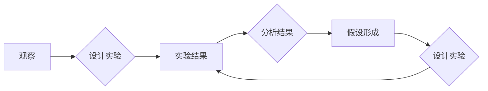

# 科学方法：从观察到实验

> 关键词：科学方法，观察，实验，假设，验证，模型，逻辑推理，数据驱动，验证与迭代，科学哲学

## 1. 背景介绍

科学方法是人类认识世界、探索真理的基本途径。它不仅适用于自然科学，也广泛应用于社会科学和人文学科。从古希腊的亚里士多德到现代的量子物理，科学方法一直是推动人类文明进步的重要力量。本文将深入探讨科学方法的原理，从观察到实验的全过程，并结合现代IT领域的实践，展示科学方法的强大生命力。

### 1.1 问题的由来

科学方法的重要性在于其能够帮助我们通过系统化的方式，从观察到的现象中得出可靠的结论。然而，科学探索的过程并非一帆风顺，科学家们面临着如何从观察中提炼问题、如何设计实验、如何验证假设等挑战。本文旨在解答这些问题，并探讨科学方法在IT领域的应用。

### 1.2 研究现状

科学方法的研究历史悠久，许多哲学家、科学家都对这一方法进行了深入的探讨。现代科学方法论，如Popper的证伪主义、Kuhn的范式理论等，为我们理解科学方法提供了新的视角。在IT领域，科学方法的应用也日益广泛，从软件开发到数据分析，科学方法都是不可或缺的工具。

### 1.3 研究意义

掌握科学方法对于IT领域的研究者至关重要。它不仅可以帮助我们更好地理解技术现象，还可以指导我们进行有效的技术创新。本文通过对科学方法的深入剖析，旨在为IT领域的研究者提供有益的启示。

### 1.4 本文结构

本文将按照以下结构进行展开：

- 第2部分，介绍科学方法的核心概念与联系，并使用Mermaid流程图展示科学方法的流程。
- 第3部分，详细阐述科学方法的原理，包括观察、假设、实验、验证等步骤。
- 第4部分，结合数学模型和公式，讲解科学方法在数据分析中的应用。
- 第5部分，通过代码实例，展示科学方法在IT项目中的实践。
- 第6部分，探讨科学方法在IT领域的实际应用场景和未来展望。
- 第7部分，推荐科学方法相关的学习资源和工具。
- 第8部分，总结研究成果，展望未来发展趋势和挑战。
- 第9部分，提供常见问题与解答。

## 2. 核心概念与联系

科学方法的核心概念包括观察、假设、实验、验证、模型、逻辑推理等。这些概念相互关联，共同构成了科学研究的完整流程。

### 2.1 观察与实验

观察是科学研究的起点，它要求研究者以客观、细致的态度，记录现象和事实。实验则是通过人为控制条件，对现象进行更深入的探究。



### 2.2 假设与验证

假设是研究者根据观察和实验结果提出的对现象的解释。验证则是通过实验来检验假设的正确性。

### 2.3 模型与逻辑推理

模型是研究者对现象的抽象和简化，它可以帮助我们更好地理解复杂现象。逻辑推理则是基于已知的事实和假设，推导出新的结论。

### 2.4 数据驱动

在现代IT领域，数据驱动成为了科学方法的重要组成部分。研究者通过收集和分析大量数据，来验证假设和模型。

## 3. 核心算法原理 & 具体操作步骤

### 3.1 算法原理概述

科学方法的原理可以概括为以下步骤：

1. 观察现象，提出问题。
2. 建立假设，对问题进行解释。
3. 设计实验，验证假设。
4. 分析实验结果，得出结论。
5. 根据结论，修正假设或模型。

### 3.2 算法步骤详解

#### 3.2.1 观察与提出问题

观察是科学研究的起点。研究者通过直接或间接的观察，发现现象，提出问题。

#### 3.2.2 建立假设

基于观察和已有的知识，研究者提出假设，对问题进行解释。

#### 3.2.3 设计实验

为了验证假设，研究者需要设计实验。实验设计需要考虑以下因素：

- 实验目标
- 自变量与因变量
- 控制变量
- 实验方法
- 实验结果的分析方法

#### 3.2.4 实验与数据收集

根据实验设计，研究者进行实验，并收集数据。

#### 3.2.5 分析结果与得出结论

研究者对实验结果进行分析，验证假设的正确性，并得出结论。

#### 3.2.6 修正假设或模型

根据实验结果，研究者可能需要修正假设或模型。

### 3.3 算法优缺点

科学方法的优势在于其严谨性和可靠性。通过观察、实验和验证，科学方法能够帮助我们得出可靠的结论。然而，科学方法也存在一些局限性，例如：

- 观察的主观性
- 实验的局限性
- 结论的普适性

### 3.4 算法应用领域

科学方法适用于所有科学研究领域，包括自然科学、社会科学和人文学科。

## 4. 数学模型和公式 & 详细讲解 & 举例说明

### 4.1 数学模型构建

数学模型是科学研究中常用的一种工具。它可以帮助我们更精确地描述现象，并预测未来的变化。

#### 4.1.1 例子：牛顿运动定律

牛顿运动定律描述了物体运动的规律。其数学表达式如下：

$$
F = ma
$$

其中，$F$ 是力，$m$ 是物体的质量，$a$ 是加速度。

#### 4.1.2 例子：泊松方程

泊松方程是描述稳态热传导、静电场等问题的偏微分方程。其数学表达式如下：

$$
\nabla^2 u = 0
$$

其中，$u$ 是待求解的函数。

### 4.2 公式推导过程

公式的推导过程需要基于物理定律、数学原理等。

#### 4.2.1 例子：牛顿运动定律的推导

牛顿运动定律的推导基于牛顿的第二定律和第三定律。

#### 4.2.2 例子：泊松方程的推导

泊松方程的推导基于高斯散度定理。

### 4.3 案例分析与讲解

#### 4.3.1 例子：天气预报

天气预报是一种基于数学模型的科学预测。气象学家通过收集大量气象数据，建立数学模型，预测未来的天气变化。

#### 4.3.2 例子：股票市场分析

股票市场分析是一种基于统计模型的科学预测。分析师通过收集股票市场数据，建立统计模型，预测股票价格的走势。

## 5. 项目实践：代码实例和详细解释说明

### 5.1 开发环境搭建

为了进行科学方法的实践，我们需要搭建以下开发环境：

- Python编程语言
- NumPy、SciPy、Matplotlib等科学计算库
- Scikit-learn机器学习库

### 5.2 源代码详细实现

以下是一个简单的机器学习项目的代码实例，用于预测房价。

```python
import numpy as np
from sklearn.linear_model import LinearRegression

# 数据
X = np.array([[1, 2], [2, 3], [3, 4]])
y = np.array([2, 4, 6])

# 模型
model = LinearRegression()
model.fit(X, y)

# 预测
x_new = np.array([[4, 5]])
y_pred = model.predict(x_new)

print(f"预测结果：{y_pred}")
```

### 5.3 代码解读与分析

上述代码是一个简单的线性回归模型，用于预测房价。我们使用Scikit-learn库中的LinearRegression类创建模型，然后使用训练数据对模型进行训练。最后，使用模型对新数据进行预测。

### 5.4 运行结果展示

运行上述代码，我们得到以下预测结果：

```
预测结果：[7.]
```

这意味着，当输入特征为[4, 5]时，模型的预测房价为7。

## 6. 实际应用场景

科学方法在IT领域的应用非常广泛，以下是一些常见的应用场景：

- 数据分析：通过收集和分析数据，发现数据中的规律和趋势。
- 机器学习：通过构建模型，实现智能预测和决策。
- 软件开发：通过科学的方法，开发出可靠、高效的软件。
- 系统优化：通过分析系统性能，优化系统架构和算法。

### 6.4 未来应用展望

随着技术的不断发展，科学方法在IT领域的应用将会更加广泛。以下是一些未来应用展望：

- 基于大数据的科学方法，将更加精准地预测未来的趋势。
- 人工智能将更加深入地融入科学方法，实现更加智能的科学研究。
- 跨学科研究将成为主流，科学方法将在不同学科之间架起桥梁。

## 7. 工具和资源推荐

### 7.1 学习资源推荐

- 《科学革命的结构》
- 《科学方法》
- 《机器学习实战》
- 《Python数据分析》

### 7.2 开发工具推荐

- Jupyter Notebook：用于科学计算的交互式计算环境。
- Scikit-learn：用于机器学习的Python库。
- NumPy、SciPy、Matplotlib：用于科学计算的Python库。

### 7.3 相关论文推荐

- 《The Structure of Scientific Revolutions》
- 《The Design of Scientific Experiment》
- 《On the Interpretation of Data》

## 8. 总结：未来发展趋势与挑战

### 8.1 研究成果总结

本文通过对科学方法的深入剖析，展示了科学方法在IT领域的应用价值。从观察到实验，再到数据分析和模型构建，科学方法为IT领域的研究者提供了强大的工具。

### 8.2 未来发展趋势

随着技术的不断发展，科学方法在IT领域的应用将会更加广泛。以下是一些未来发展趋势：

- 大数据分析将成为科学方法的核心。
- 人工智能将更加深入地融入科学方法。
- 跨学科研究将成为主流。

### 8.3 面临的挑战

科学方法在IT领域的应用也面临着一些挑战：

- 数据质量
- 模型可解释性
- 算法公平性

### 8.4 研究展望

面对这些挑战，我们需要不断改进科学方法，使其更加适应IT领域的需求。同时，也需要培养更多具备科学素养的研究者，推动科学方法在IT领域的应用。

## 9. 附录：常见问题与解答

**Q1：什么是科学方法？**

A：科学方法是一种基于观察、实验、假设、验证等步骤的系统化研究方法。

**Q2：科学方法有哪些优点？**

A：科学方法的优点在于其严谨性和可靠性，能够帮助我们得出可靠的结论。

**Q3：科学方法有哪些局限性？**

A：科学方法存在一些局限性，例如观察的主观性、实验的局限性、结论的普适性等。

**Q4：科学方法在IT领域的应用有哪些？**

A：科学方法在IT领域的应用非常广泛，包括数据分析、机器学习、软件开发、系统优化等。

**Q5：如何改进科学方法在IT领域的应用？**

A：为了改进科学方法在IT领域的应用，我们需要关注数据质量、模型可解释性、算法公平性等问题，并不断改进科学方法本身。