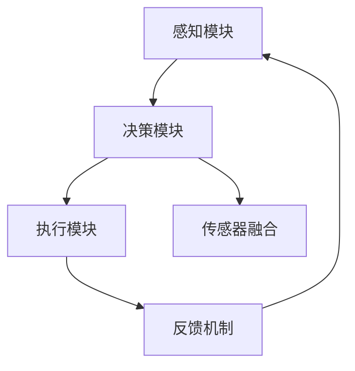

# 端到端自动驾驶的软件架构变革

> 关键词：端到端自动驾驶，软件架构，深度学习，传感器融合，实时决策，安全性，可扩展性，智能化

## 1. 背景介绍

自动驾驶技术作为人工智能领域的一个重要分支，正逐步从实验室走向现实。随着深度学习技术的飞速发展，端到端自动驾驶成为可能，它通过直接从原始传感器数据到控制决策的端到端学习，避免了传统分层架构中的中间抽象层，从而在理论上可以实现更高的准确性和效率。本文将深入探讨端到端自动驾驶的软件架构变革，分析其核心原理、实现步骤、面临的挑战以及未来发展趋势。

## 2. 核心概念与联系

### 2.1 核心概念

**端到端自动驾驶**：指通过直接从原始传感器数据（如摄像头、雷达、激光雷达）到控制决策（如油门、刹车、转向）的端到端学习，实现汽车的自动驾驶功能。

**软件架构**：端到端自动驾驶系统中的软件架构包括感知、决策、执行三个主要模块，以及它们之间的交互和数据流。

**深度学习**：端到端自动驾驶的核心技术之一，通过训练神经网络模型从数据中自动学习特征和模式。

**传感器融合**：将来自不同传感器的数据结合起来，以获得更全面的环境感知。

**实时决策**：在有限的时间内做出决策，以保证车辆的安全行驶。

**安全性**：确保自动驾驶系统在各种场景下都能安全稳定地运行。

**可扩展性**：系统架构能够适应不同的车型、环境和任务。

**智能化**：系统具备自我学习和适应环境变化的能力。

### 2.2 Mermaid 流程图



图中展示了端到端自动驾驶软件架构的核心组件及其相互关系。感知模块收集环境数据，传感器融合模块对数据进行整合，决策模块根据感知数据和融合结果做出控制决策，执行模块执行决策，反馈机制将执行结果返回给感知模块和决策模块，形成闭环控制。

## 3. 核心算法原理 & 具体操作步骤

### 3.1 算法原理概述

端到端自动驾驶的算法原理主要基于深度学习，尤其是卷积神经网络（CNN）和循环神经网络（RNN）的结合。通过训练神经网络模型，可以从原始传感器数据中直接学习到驾驶所需的特征和模式。

### 3.2 算法步骤详解

1. **数据收集与预处理**：收集大量的驾驶数据，包括原始传感器数据和相应的控制指令。对数据进行清洗、标注和增强，以构建训练数据集。

2. **模型设计**：设计合适的神经网络模型，如CNN-RNN组合模型，用于从原始传感器数据中提取特征和模式。

3. **模型训练**：使用训练数据集对模型进行训练，调整模型参数以最小化损失函数。

4. **模型评估**：使用验证数据集评估模型性能，调整模型结构和参数以优化性能。

5. **模型部署**：将训练好的模型部署到实际系统中，进行实时决策和控制。

6. **反馈与优化**：收集实际运行数据，对模型进行在线学习和优化。

### 3.3 算法优缺点

**优点**：

- **端到端**：直接从原始数据到控制指令，避免了传统分层架构中的中间抽象层，可以学习到更细粒度的特征和模式。
- **高效**：减少了数据处理和特征提取的中间步骤，提高了系统的实时性和效率。
- **鲁棒**：模型可以从大量数据中学习到丰富的驾驶经验，提高了系统的鲁棒性。

**缺点**：

- **数据需求量大**：需要大量的标注数据来训练模型，成本较高。
- **模型复杂度高**：端到端模型通常较为复杂，难以理解和调试。
- **泛化能力有限**：模型可能在未见过的场景下表现不佳。

### 3.4 算法应用领域

端到端自动驾驶算法可以应用于以下领域：

- **自动驾驶汽车**：实现自动驾驶汽车在复杂环境下的安全行驶。
- **无人驾驶出租车**：构建无人驾驶出租车服务，提供便捷的出行体验。
- **无人配送机器人**：实现无人配送机器人在城市中的自主配送。

## 4. 数学模型和公式 & 详细讲解 & 举例说明

### 4.1 数学模型构建

端到端自动驾驶的数学模型主要基于深度学习，以下以CNN-RNN组合模型为例进行说明。

**CNN**：

$$
h^{\ell}(x) = \text{ReLU}\left(\mathbf{W}^{\ell}\mathbf{h}^{\ell-1} + \mathbf{b}^{\ell}\right)
$$

其中，$\mathbf{h}^{\ell}$ 表示第 $\ell$ 层的激活输出，$\mathbf{W}^{\ell}$ 和 $\mathbf{b}^{\ell}$ 分别表示第 $\ell$ 层的权重和偏置。

**RNN**：

$$
\mathbf{h}_{t} = \text{ReLU}\left(\mathbf{W}_{h}\mathbf{h}_{t-1} + \mathbf{W}_{x}\mathbf{x}_{t} + \mathbf{b}\right)
$$

其中，$\mathbf{h}_{t}$ 表示第 $t$ 个时刻的隐藏状态，$\mathbf{W}_{h}$、$\mathbf{W}_{x}$ 和 $\mathbf{b}$ 分别表示权重和偏置。

### 4.2 公式推导过程

CNN的公式推导过程主要基于卷积操作和激活函数。RNN的公式推导过程主要基于循环连接和激活函数。

### 4.3 案例分析与讲解

以下以自动驾驶车辆在复杂交叉路口的行驶为例，说明端到端自动驾驶算法的决策过程。

1. **感知阶段**：车辆通过摄像头、雷达和激光雷达等传感器收集周围环境信息，包括道路、车辆、行人等。

2. **特征提取阶段**：使用CNN从感知到的数据中提取特征，如道路边界、车辆位置、行人位置等。

3. **决策阶段**：使用RNN结合CNN提取的特征，对车辆的行驶方向、速度、刹车等进行决策。

4. **执行阶段**：根据决策结果，控制车辆的油门、刹车和转向等。

## 5. 项目实践：代码实例和详细解释说明

### 5.1 开发环境搭建

1. 安装Python环境。
2. 安装深度学习框架，如TensorFlow或PyTorch。
3. 安装数据处理工具，如OpenCV、NumPy等。

### 5.2 源代码详细实现

以下以TensorFlow为例，展示端到端自动驾驶算法的简单实现。

```python
import tensorflow as tf
from tensorflow.keras.layers import Input, Conv2D, MaxPooling2D, Flatten, Dense
from tensorflow.keras.models import Model

# 构建CNN-RNN模型
def build_cnn_rnn(input_shape):
    # CNN层
    inputs = Input(shape=input_shape)
    x = Conv2D(32, (3, 3), activation='relu')(inputs)
    x = MaxPooling2D((2, 2))(x)
    x = Conv2D(64, (3, 3), activation='relu')(x)
    x = MaxPooling2D((2, 2))(x)
    x = Flatten()(x)

    # RNN层
    h = Dense(256, activation='relu')(x)
    h = tf.keras.layers.LSTM(128)(h)

    # 输出层
    outputs = Dense(4, activation='softmax')(h)

    model = Model(inputs=inputs, outputs=outputs)
    return model

# 模型训练
def train_model(model, train_data, train_labels):
    model.compile(optimizer='adam', loss='categorical_crossentropy', metrics=['accuracy'])
    model.fit(train_data, train_labels, epochs=10, batch_size=32)

# 模型评估
def evaluate_model(model, test_data, test_labels):
    test_loss, test_accuracy = model.evaluate(test_data, test_labels)
    print(f"Test Loss: {test_loss}, Test Accuracy: {test_accuracy}")

# 构建模型
model = build_cnn_rnn((64, 64, 3))
train_model(model, train_data, train_labels)
evaluate_model(model, test_data, test_labels)
```

### 5.3 代码解读与分析

以上代码展示了如何使用TensorFlow构建和训练一个简单的CNN-RNN模型。首先，定义输入层，使用卷积层和池化层提取图像特征。然后，使用全连接层和LSTM层进行序列建模。最后，使用softmax层进行分类输出。

### 5.4 运行结果展示

运行以上代码，将输出模型在测试集上的损失和准确率。

## 6. 实际应用场景

端到端自动驾驶技术已在以下场景中得到实际应用：

- **自动驾驶出租车**：Waymo、Uber、Lyft等公司正在开发自动驾驶出租车服务。
- **自动驾驶卡车**：Waymo、Daimler等公司正在开发自动驾驶卡车。
- **自动驾驶公交车**：许多城市正在试点自动驾驶公交车服务。

## 7. 工具和资源推荐

### 7.1 学习资源推荐

- **书籍**：《深度学习》（Goodfellow等著）、《神经网络与深度学习》（邱锡鹏著）
- **在线课程**：Coursera上的《深度学习》课程、Udacity上的《自动驾驶汽车工程师》纳米学位
- **技术博客**：Medium、ArXiv、博客园

### 7.2 开发工具推荐

- **深度学习框架**：TensorFlow、PyTorch
- **数据处理工具**：OpenCV、NumPy、Pandas
- **可视化工具**：TensorBoard、Matplotlib

### 7.3 相关论文推荐

- **《End-to-End Learning for Autonomous Driving》**：介绍端到端自动驾驶的原理和实现。
- **《ASurvey of Deep Learning Techniques for Autonomous Driving》**：综述了深度学习在自动驾驶中的应用。
- **《Deep Learning for Autonomous Vehicles》**：介绍了深度学习在自动驾驶车辆中的应用。

## 8. 总结：未来发展趋势与挑战

### 8.1 研究成果总结

端到端自动驾驶的软件架构变革为自动驾驶技术的发展带来了新的机遇和挑战。通过深度学习技术的应用，端到端自动驾驶实现了从感知、决策到执行的全过程自动化，提高了系统的效率和鲁棒性。然而，端到端自动驾驶仍面临着数据需求量大、模型复杂度高、泛化能力有限等挑战。

### 8.2 未来发展趋势

未来，端到端自动驾驶软件架构将呈现以下发展趋势：

- **模型轻量化**：降低模型复杂度，提高模型在资源受限设备上的运行效率。
- **模型可解释性**：提高模型的可解释性，增强用户对自动驾驶系统的信任。
- **多传感器融合**：融合多种传感器数据，提高感知系统的鲁棒性。
- **跨领域迁移**：将端到端自动驾驶技术应用于其他领域，如机器人、无人机等。

### 8.3 面临的挑战

端到端自动驾驶软件架构仍面临着以下挑战：

- **数据采集与标注**：获取大量高质量的标注数据，以训练和优化模型。
- **模型优化与加速**：提高模型的效率和鲁棒性，降低模型复杂度。
- **安全性与可靠性**：确保自动驾驶系统在各种场景下都能安全稳定地运行。
- **法律法规与伦理**：制定相应的法律法规和伦理标准，以保障自动驾驶技术的健康发展。

### 8.4 研究展望

未来，端到端自动驾驶软件架构的研究将朝着以下方向发展：

- **多模态信息融合**：融合多种传感器数据，实现更全面的环境感知。
- **强化学习**：将强化学习与深度学习相结合，提高系统的决策能力。
- **人机协同**：实现人机协同的驾驶模式，提高驾驶体验。

端到端自动驾驶的软件架构变革是自动驾驶技术发展的重要里程碑，它将为人类带来更加安全、便捷的出行方式。相信在学术界和工业界的共同努力下，端到端自动驾驶技术将不断取得突破，为构建智能交通系统贡献力量。

## 9. 附录：常见问题与解答

**Q1：端到端自动驾驶与传统自动驾驶的区别是什么？**

A：传统自动驾驶通常采用分层架构，包括感知、决策和执行三个层次。感知层负责收集环境信息，决策层根据感知信息做出控制决策，执行层根据决策结果控制车辆。端到端自动驾驶则直接从原始传感器数据到控制决策，避免了传统分层架构中的中间抽象层。

**Q2：端到端自动驾驶的技术难点是什么？**

A：端到端自动驾驶的技术难点主要包括数据采集与标注、模型优化与加速、安全性与可靠性、法律法规与伦理等方面。

**Q3：端到端自动驾驶的应用前景如何？**

A：端到端自动驾驶的应用前景广阔，可以应用于自动驾驶汽车、自动驾驶卡车、自动驾驶公交车、自动驾驶无人机等领域，为人类带来更加安全、便捷的出行方式。

**Q4：如何确保端到端自动驾驶的安全性？**

A：确保端到端自动驾驶的安全性需要从多个方面进行考虑，包括模型训练、系统设计、法律法规和伦理等方面。具体措施包括：

- 使用高质量的数据集进行模型训练，提高模型的鲁棒性。
- 设计安全可靠的系统架构，确保系统在各种场景下都能稳定运行。
- 制定相应的法律法规，规范自动驾驶技术的发展和应用。
- 加强伦理教育，提高公众对自动驾驶技术的认知和接受度。

**Q5：端到端自动驾驶的伦理问题有哪些？**

A：端到端自动驾驶的伦理问题主要包括以下几方面：

- **责任归属**：当发生交通事故时，责任应由谁承担？
- **道德决策**：在紧急情况下，自动驾驶系统应如何做出道德决策？
- **隐私保护**：如何保护用户的隐私？

作者：禅与计算机程序设计艺术 / Zen and the Art of Computer Programming