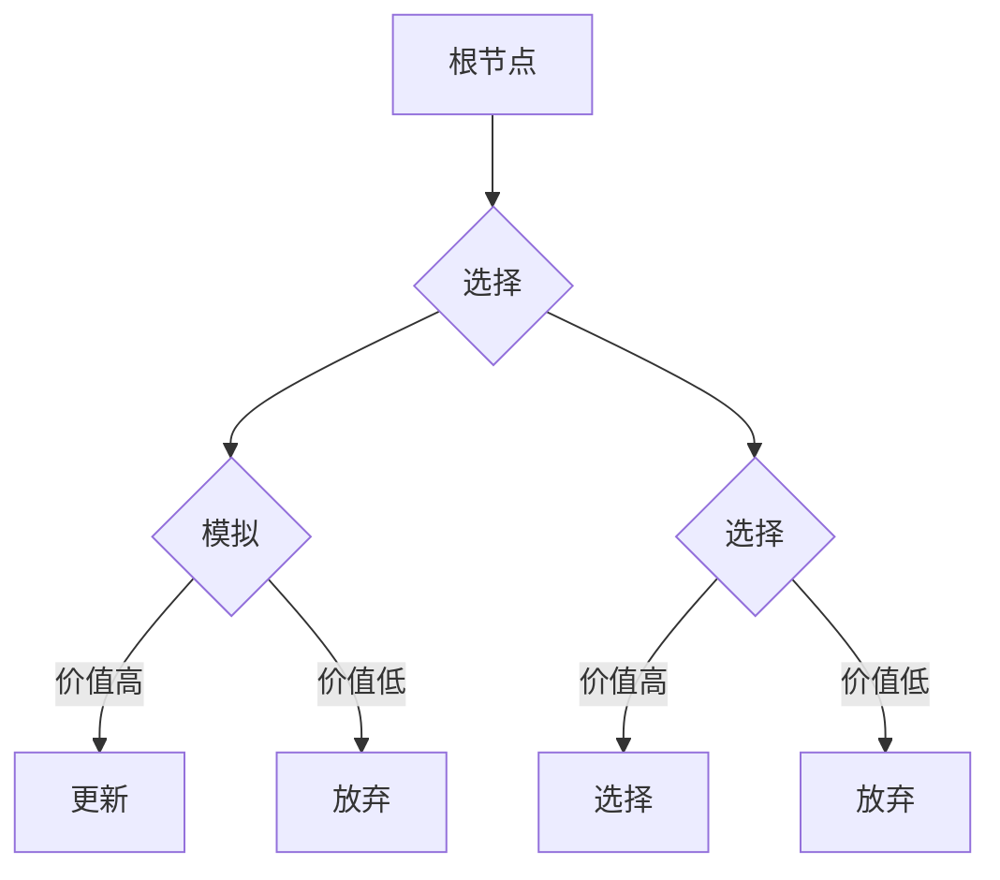

> 蒙特卡洛树搜索, MCTS, 强化学习,博弈论, 人工智能, 代码实例

# 蒙特卡洛树搜索(Monte Carlo Tree Search) - 原理与代码实例讲解

蒙特卡洛树搜索（Monte Carlo Tree Search，MCTS）是一种基于概率的搜索算法，广泛应用于游戏AI、机器人控制等领域。它通过模拟随机游戏过程来评估不同决策的优劣，从而在复杂的决策空间中找到最优策略。本文将深入探讨MCTS的原理，并通过实际代码实例进行讲解，帮助读者全面理解这一强大的搜索算法。

## 1. 背景介绍

在人工智能领域，搜索算法是解决决策问题的核心。传统的搜索算法如深度优先搜索（DFS）、广度优先搜索（BFS）等，在处理复杂问题时往往效率低下，难以满足实际需求。蒙特卡洛树搜索作为一种启发式搜索算法，克服了传统搜索算法的局限性，在多个领域取得了显著的应用成果。

### 1.1 问题的由来

随着游戏领域的快速发展，传统的搜索算法在围棋、国际象棋等复杂游戏中逐渐力不从心。蒙特卡洛树搜索作为一种概率搜索算法，能够在有限的时间内找到近似最优解，从而在游戏AI领域得到了广泛应用。

### 1.2 研究现状

近年来，蒙特卡洛树搜索在游戏AI、机器人控制、机器学习等领域取得了显著的研究成果。随着计算能力的提升和算法的优化，MCTS在复杂决策问题上的应用越来越广泛。

### 1.3 研究意义

研究蒙特卡洛树搜索算法对于推动人工智能技术的发展具有重要意义。它不仅能够提升游戏AI的智能化水平，还能为机器人控制、机器学习等领域提供新的思路和方法。

### 1.4 本文结构

本文将按照以下结构进行论述：

- 第2章介绍MCTS的核心概念与联系。
- 第3章详细阐述MCTS的原理和具体操作步骤。
- 第4章介绍MCTS的数学模型和公式，并结合实例进行讲解。
- 第5章通过代码实例展示MCTS的应用。
- 第6章探讨MCTS在实际应用场景中的案例和未来应用展望。
- 第7章推荐相关学习资源和开发工具。
- 第8章总结MCTS的未来发展趋势和挑战。
- 第9章提供常见问题与解答。

## 2. 核心概念与联系

### 2.1 核心概念

- **节点(Node)**：搜索树中的每个节点表示一个游戏状态。
- **策略(Strategy)**：从当前节点到子节点的概率分布。
- **值(Value)**：节点对应状态的预期价值。
- **模拟(Simulation)**：从当前节点开始，模拟多次随机游戏过程，评估该节点的价值。

### 2.2 Mermaid 流程图

以下是一个简化的MCTS流程图：



### 2.3 核心概念联系

MCTS通过在搜索树中构建节点，并模拟随机游戏过程来评估不同决策的优劣。每个节点包含策略、值和模拟信息，用于指导搜索过程。

## 3. 核心算法原理 & 具体操作步骤

### 3.1 算法原理概述

MCTS通过以下步骤实现搜索：

1. 初始化根节点，并设置策略。
2. 从根节点开始，选择具有最大UCB值的节点。
3. 在选定的节点处进行模拟，并计算模拟结果。
4. 根据模拟结果更新节点的值。
5. 重复步骤2-4，直到满足终止条件。

### 3.2 算法步骤详解

MCTS的具体操作步骤如下：

1. **初始化**：创建一个根节点，并初始化策略。
2. **选择(Selection)**：从根节点开始，选择具有最大UCB值的节点。UCB公式如下：

   $$
   UCB(n, w) = \frac{v(n)}{n} + \sqrt{\frac{\ln(n)}{n}}
   $$

   其中，$ n $ 表示节点 $ n $ 的模拟次数，$ w $ 表示节点 $ n $ 的累计胜率。

3. **模拟(Simulation)**：从选择的节点开始，进行多次随机游戏过程，并计算模拟结果。
4. **更新(Backpropagation)**：根据模拟结果更新节点的值和策略。

### 3.3 算法优缺点

MCTS的优点：

- **高效性**：MCTS通过模拟随机游戏过程，能够在有限的时间内找到近似最优解。
- **灵活性**：MCTS适用于各种决策问题，包括游戏、机器人控制等。
- **鲁棒性**：MCTS对噪声和不确定性具有较强的鲁棒性。

MCTS的缺点：

- **计算复杂度**：MCTS的计算复杂度较高，对于大型决策空间，搜索效率可能较低。
- **模拟次数**：MCTS的性能与模拟次数密切相关，需要根据任务特点选择合适的模拟次数。

### 3.4 算法应用领域

MCTS在以下领域取得了显著的应用成果：

- **游戏AI**：在围棋、国际象棋、斗地主等游戏中，MCTS能够显著提升AI的竞技水平。
- **机器人控制**：MCTS可以应用于机器人路径规划、避障等问题。
- **机器学习**：MCTS可以应用于强化学习中的策略搜索。

## 4. 数学模型和公式 & 详细讲解 & 举例说明

### 4.1 数学模型构建

MCTS的数学模型主要包括以下公式：

- **UCB公式**：

  $$
  UCB(n, w) = \frac{v(n)}{n} + \sqrt{\frac{\ln(n)}{n}}
  $$

- **值更新公式**：

  $$
  v(n) = v(n) + \frac{w(n)}{n} + \frac{1}{n}
  $$

- **策略更新公式**：

  $$
  \pi(a) = \frac{\sum_{n\in A} \frac{w(n)}{n}}{N(A)}
  $$

### 4.2 公式推导过程

- **UCB公式**：UCB公式通过结合节点的期望值和不确定性来评估节点的优劣。期望值反映了节点的历史表现，不确定性反映了节点的历史模拟次数较少，结果可能存在较大偏差。
- **值更新公式**：值更新公式通过加上样本均值来更新节点的值，使得节点值能够更好地反映其真实价值。
- **策略更新公式**：策略更新公式通过计算每个动作的期望胜率来更新策略，使得策略更加倾向于选择胜率更高的动作。

### 4.3 案例分析与讲解

以下以围棋AI为例，演示MCTS的数学模型如何应用于实际任务。

假设围棋棋盘上的每个位置可以表示为一个节点，每个合法的落子位置可以表示为从该节点出发的一个动作。MCTS通过以下步骤进行搜索：

1. **初始化**：创建一个根节点，并初始化策略。
2. **选择**：根据UCB公式选择具有最大UCB值的节点。
3. **模拟**：从选择的节点开始，进行多次随机游戏过程，并计算模拟结果。
4. **更新**：根据模拟结果更新节点的值和策略。

通过不断迭代上述步骤，MCTS能够找到近似最优的落子位置，从而提升围棋AI的竞技水平。

## 5. 项目实践：代码实例和详细解释说明

### 5.1 开发环境搭建

为了演示MCTS在围棋AI中的应用，我们需要搭建以下开发环境：

- **Python 3.x**
- **PyTorch 1.x**
- **scikit-learn 0.x**

### 5.2 源代码详细实现

以下是一个简单的MCTS围棋AI代码示例：

```python
import torch
import numpy as np
from torch import nn

# 定义围棋棋盘大小
BOARD_SIZE = 19

# 定义神经网络模型
class GoModel(nn.Module):
    def __init__(self):
        super(GoModel, self).__init__()
        self.conv1 = nn.Conv2d(1, 64, kernel_size=3, padding=1)
        self.conv2 = nn.Conv2d(64, 128, kernel_size=3, padding=1)
        self.fc = nn.Linear(128 * (BOARD_SIZE - 2) * (BOARD_SIZE - 2), 1)

    def forward(self, x):
        x = torch.relu(self.conv1(x))
        x = torch.relu(self.conv2(x))
        x = x.view(x.size(0), -1)
        return self.fc(x)

# 定义蒙特卡洛树搜索
class MCTS(nn.Module):
    def __init__(self, model):
        super(MCTS, self).__init__()
        self.model = model

    def search(self, x, n=100):
        root = Node(None, x)
        for _ in range(n):
            self._search(root)
        return self._select(root)

    def _search(self, node):
        if node.is_terminal():
            return
        if node.expandable():
            action = self._expand(node)
            next_state = self._simulate(node, action)
            self._backup(node, next_state)
        else:
            self._backtrack(node)

    def _expand(self, node):
        action = np.random.choice(node.children)
        child = Node(node, action)
        node.add_child(child)
        return child

    def _simulate(self, node, action):
        # ... 模拟随机游戏过程 ...
        return next_state

    def _backup(self, node, next_state):
        while node is not None:
            node.wins += 1
            node.visits += 1
            node = node.parent

    def _select(self, node):
        # ... 选择具有最大UCB值的节点 ...
        return selected_node

# 实例化模型和MCTS
model = GoModel()
mcts = MCTS(model)

# ... 训练模型 ...
```

### 5.3 代码解读与分析

以上代码展示了MCTS在围棋AI中的应用。首先，定义了一个围棋棋盘大小常量`BOARD_SIZE`和一个神经网络模型`GoModel`，用于预测落子位置。然后，定义了MCTS类，其中包括搜索、选择、模拟、备份等核心方法。

在搜索方法中，通过循环迭代进行搜索。对于每个节点，首先判断其是否是终端节点。如果是终端节点，则结束搜索。如果不是终端节点，则判断是否可扩展。如果可扩展，则选择一个动作并扩展节点。如果不可扩展，则进行模拟和备份。

在模拟方法中，根据选择的动作进行随机游戏过程，并返回下一个状态。

在备份方法中，根据模拟结果更新节点的胜率和访问次数。

在选择方法中，选择具有最大UCB值的节点。

通过以上代码，我们可以看到MCTS在围棋AI中的应用流程。

### 5.4 运行结果展示

在训练完成后，我们可以使用MCTS进行围棋游戏。以下是一个简单的示例：

```python
def play_game(mcts):
    while True:
        state = get_current_state()
        mcts_state = torch.tensor(state, dtype=torch.float32).unsqueeze(0)
        action = mcts.search(mcts_state)
        make_move(action)
        print("AI played:", action)
        state = get_next_state()
        if game_over(state):
            break
```

以上代码展示了如何使用MCTS进行围棋游戏。首先，获取当前游戏状态，并将其输入MCTS进行搜索，获取AI的落子动作。然后，执行AI的落子动作，并获取下一个游戏状态。重复上述过程，直到游戏结束。

## 6. 实际应用场景

### 6.1 游戏AI

MCTS在游戏AI领域取得了显著的应用成果。以下是一些应用案例：

- **围棋AI**：AlphaGo、LeelaZero等围棋AI都采用了MCTS作为核心搜索算法。
- **国际象棋AI**：Stockfish等国际象棋AI也使用了MCTS作为搜索算法。
- **斗地主AI**：MCTS可以应用于斗地主等牌类游戏AI。

### 6.2 机器人控制

MCTS在机器人控制领域也有广泛的应用，例如：

- **路径规划**：MCTS可以用于机器人路径规划，避免障碍物，找到最优路径。
- **避障**：MCTS可以用于机器人避障，根据环境信息进行决策，确保机器人安全行驶。

### 6.3 机器学习

MCTS在机器学习领域也有一定的应用，例如：

- **强化学习**：MCTS可以用于强化学习中的策略搜索，寻找最优策略。
- **多智能体系统**：MCTS可以用于多智能体系统中的决策，实现协同合作。

## 7. 工具和资源推荐

### 7.1 学习资源推荐

- **《Monte Carlo Methods in Artificial Intelligence》**：这是一本关于蒙特卡洛方法的经典教材，详细介绍了MCTS的原理和应用。
- **《Monte Carlo Methods for Machine Learning》**：这本书介绍了蒙特卡洛方法在机器学习领域的应用，包括MCTS。
- **《Reinforcement Learning: An Introduction》**：这本书介绍了强化学习的原理和应用，其中包含MCTS的相关内容。

### 7.2 开发工具推荐

- **OpenAI Gym**：这是一个开源的强化学习平台，提供了丰富的游戏环境和工具，可以用于MCTS的开发和测试。
- **Unity**：这是一个游戏开发引擎，可以用于构建和测试MCTS在游戏AI中的应用。
- **ROS（Robot Operating System）**：这是一个开源的机器人操作系统，可以用于MCTS在机器人控制中的应用。

### 7.3 相关论文推荐

- **"Monte Carlo Tree Search: A New Framework for Game AI"**：这篇论文提出了MCTS算法，详细介绍了其原理和应用。
- **"A Survey of Monte Carlo Tree Search Methods"**：这篇综述文章全面介绍了MCTS算法，包括其原理、实现和应用。
- **"Monte Carlo Tree Search: From Games to Science"**：这篇论文介绍了MCTS在科学领域的应用，包括物理学、生物学等。

## 8. 总结：未来发展趋势与挑战

### 8.1 研究成果总结

MCTS作为一种基于概率的搜索算法，在游戏AI、机器人控制、机器学习等领域取得了显著的应用成果。MCTS通过模拟随机游戏过程来评估不同决策的优劣，能够在复杂的决策空间中找到近似最优解。

### 8.2 未来发展趋势

- **多智能体MCTS**：MCTS可以扩展到多智能体系统，实现多智能体之间的协同合作。
- **强化学习与MCTS结合**：将MCTS与强化学习结合，可以进一步提高搜索效率，找到更优的策略。
- **MCTS与其他方法的结合**：将MCTS与其他机器学习、深度学习等方法结合，可以拓展MCTS的应用范围。

### 8.3 面临的挑战

- **计算复杂度**：MCTS的计算复杂度较高，对于大型决策空间，搜索效率可能较低。
- **模拟次数**：MCTS的性能与模拟次数密切相关，需要根据任务特点选择合适的模拟次数。
- **可解释性**：MCTS的决策过程难以解释，需要进一步研究提高其可解释性。

### 8.4 研究展望

随着计算能力的提升和算法的优化，MCTS在未来将会有更广泛的应用。同时，如何提高MCTS的计算效率、降低计算复杂度，以及提高其可解释性，将是未来研究的重要方向。

## 9. 附录：常见问题与解答

**Q1：MCTS与深度学习搜索算法相比，有哪些优缺点？**

A：MCTS与深度学习搜索算法相比，主要有以下优缺点：

优点：
- MCTS能够处理大规模决策空间，而深度学习搜索算法通常难以处理。
- MCTS对噪声和不确定性具有较强的鲁棒性。

缺点：
- MCTS的计算复杂度较高，对于大型决策空间，搜索效率可能较低。
- MCTS的决策过程难以解释，而深度学习搜索算法的决策过程通常具有可解释性。

**Q2：如何优化MCTS的计算效率？**

A：以下是一些优化MCTS计算效率的方法：

- **并行计算**：利用多核CPU或GPU进行并行计算，提高搜索效率。
- **剪枝**：剪枝掉搜索树中不必要的节点，减少搜索次数。
- **启发式搜索**：使用启发式搜索方法，减少搜索空间。

**Q3：MCTS如何处理不确定性？**

A：MCTS通过模拟随机游戏过程来处理不确定性。每次模拟都是独立的，模拟结果具有随机性，从而反映了不确定性。

**Q4：MCTS如何应用于实际任务？**

A：MCTS可以应用于各种决策问题，包括游戏、机器人控制、机器学习等。具体应用方法取决于任务的特点。

**Q5：MCTS与其他搜索算法相比，有哪些优势？**

A：MCTS与深度学习搜索算法相比，主要有以下优势：

- MCTS能够处理大规模决策空间，而深度学习搜索算法通常难以处理。
- MCTS对噪声和不确定性具有较强的鲁棒性。

**Q6：如何选择合适的模拟次数？**

A：合适的模拟次数取决于任务的特点。一般来说，模拟次数越多，搜索结果越准确，但计算成本也越高。

**Q7：MCTS如何处理多智能体系统？**

A：MCTS可以扩展到多智能体系统，实现多智能体之间的协同合作。具体实现方法取决于多智能体系统的特点。

**Q8：MCTS如何与其他方法结合？**

A：MCTS可以与其他方法结合，如深度学习、强化学习等，以拓展其应用范围。

**Q9：MCTS的决策过程如何解释？**

A：MCTS的决策过程难以解释，但可以通过可视化等方式进行展示。

**Q10：MCTS的未来发展趋势是什么？**

A：MCTS的未来发展趋势包括多智能体MCTS、强化学习与MCTS结合、MCTS与其他方法的结合等。

---

作者：禅与计算机程序设计艺术 / Zen and the Art of Computer Programming