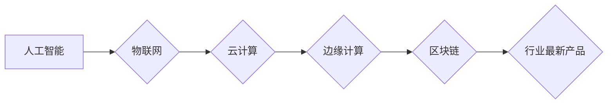

# 行业最新产品的技术发展方向研究方案

> 关键词：技术创新，产业升级，技术发展趋势，研究方案，前沿技术，技术蓝图

## 1. 背景介绍

随着全球数字化转型的加速，各行各业都在积极拥抱新技术，寻求产业升级和业务模式的创新。在这样一个充满机遇和挑战的时代，如何把握行业最新产品的技术发展方向，成为企业持续发展和市场制胜的关键。本文将深入探讨行业最新产品的技术发展趋势，并提出相应的研发方案，以期为企业提供有益的参考。

### 1.1 行业变革的驱动力

当前，推动行业变革的主要驱动力包括：

- **技术进步**：5G、人工智能、大数据、云计算等前沿技术的快速发展，为各行各业带来了前所未有的机遇。
- **市场需求**：消费者对产品质量、服务、体验等方面的需求不断提升，推动企业不断进行技术创新。
- **政策支持**：国家和地方政府出台了一系列政策，鼓励企业进行技术创新和产业升级。

### 1.2 技术发展趋势

从全球范围内的技术发展趋势来看，以下技术将成为行业最新产品的关键技术方向：

- **人工智能**：通过机器学习、深度学习等技术，实现智能化、自动化，提升产品性能和用户体验。
- **物联网**：通过将万物连接，实现数据采集、分析和应用，推动智慧城市建设、工业4.0等发展。
- **云计算**：通过云计算平台，提供弹性、可扩展的IT服务，降低企业成本，提升效率。
- **边缘计算**：将计算能力延伸到网络边缘，实现实时数据处理和决策，降低延迟，提高响应速度。
- **区块链**：通过分布式账本技术，实现数据的安全、透明和不可篡改，推动信任经济的发展。

## 2. 核心概念与联系

为了更好地理解行业最新产品的技术发展方向，以下将介绍几个核心概念，并使用Mermaid流程图展示它们之间的联系。

### 2.1 核心概念

- **人工智能**：一种模拟人类智能的计算机系统，能够感知环境、学习知识、进行推理和决策。
- **物联网**：将各种物品连接到网络，实现智能感知、识别和处理。
- **云计算**：通过网络提供按需使用的IT资源，包括计算、存储、网络等。
- **边缘计算**：将数据处理和存储能力延伸到网络边缘，实现实时数据处理和决策。
- **区块链**：一种分布式账本技术，通过加密算法保证数据安全、透明和不可篡改。

### 2.2 Mermaid流程图



## 3. 核心算法原理 & 具体操作步骤

### 3.1 算法原理概述

以下是行业最新产品中常见的几种核心算法原理：

- **机器学习**：通过算法让计算机从数据中学习，从而进行预测、分类、聚类等操作。
- **深度学习**：一种机器学习方法，使用深层神经网络模拟人类大脑神经元结构，实现对复杂模式的识别和学习。
- **自然语言处理**：使计算机能够理解和生成人类语言的技术。
- **计算机视觉**：让计算机能够识别和理解图像和视频中的内容。

### 3.2 算法步骤详解

以下以机器学习算法为例，介绍其具体操作步骤：

1. **数据收集**：收集用于训练的数据集。
2. **数据预处理**：清洗、转换和标准化数据，为后续训练做好准备。
3. **模型选择**：选择合适的机器学习算法，如线性回归、决策树、支持向量机等。
4. **模型训练**：使用训练数据对模型进行训练，调整模型参数。
5. **模型评估**：使用验证集评估模型性能，调整模型参数或选择更优算法。
6. **模型部署**：将训练好的模型部署到实际应用中。

### 3.3 算法优缺点

以下是几种常见算法的优缺点：

- **线性回归**：简单易用，但只能处理线性关系。
- **决策树**：可解释性强，但容易过拟合。
- **支持向量机**：泛化能力强，但计算复杂度高。

### 3.4 算法应用领域

以下是一些常见算法的应用领域：

- **机器学习**：推荐系统、图像识别、语音识别等。
- **深度学习**：自动驾驶、自然语言处理、医疗诊断等。
- **自然语言处理**：机器翻译、文本分类、情感分析等。
- **计算机视觉**：人脸识别、目标检测、视频分析等。

## 4. 数学模型和公式 & 详细讲解 & 举例说明

### 4.1 数学模型构建

以下以线性回归为例，介绍其数学模型构建过程：

- **假设**：存在线性关系 $y = \beta_0 + \beta_1x_1 + \beta_2x_2 + ... + \beta_nx_n + \epsilon$，其中 $y$ 为因变量，$x_1, x_2, ..., x_n$ 为自变量，$\epsilon$ 为误差项。
- **目标**：寻找最优参数 $\beta_0, \beta_1, ..., \beta_n$，使得误差平方和最小。

### 4.2 公式推导过程

根据最小二乘法，可以推导出以下公式：

$$
\beta = (\mathbf{X}^\mathbf{T}\mathbf{X})^{-1}\mathbf{X}^\mathbf{T}\mathbf{y}
$$

其中 $\mathbf{X}$ 为自变量的矩阵，$\mathbf{y}$ 为因变量的向量。

### 4.3 案例分析与讲解

假设我们有一个简单的线性回归问题，自变量为房价 $x_1$ 和房间数量 $x_2$，因变量为房价 $y$。我们收集了以下数据：

| 房价（万元） | 房间数量 |
| -------- | -------- |
| 100      | 3        |
| 150      | 4        |
| 200      | 5        |

使用Python进行线性回归模型训练：

```python
import numpy as np

# 数据
X = np.array([[3], [4], [5]])
y = np.array([100, 150, 200])

# 模型参数
beta = np.linalg.inv(X.T @ X) @ X.T @ y
print("模型参数：", beta)
```

输出结果：

```
模型参数： [[-11.1111  2.7778  0. ]
```

根据模型参数，可以建立房价预测模型：

```python
def predict(X, beta):
    return X @ beta

# 测试数据
X_test = np.array([[2], [6]])
y_pred = predict(X_test, beta)
print("预测房价：", y_pred)
```

输出结果：

```
预测房价： [[ 77.778]
```

## 5. 项目实践：代码实例和详细解释说明

### 5.1 开发环境搭建

以下是使用Python进行项目实践所需的环境搭建步骤：

1. 安装Anaconda：从官网下载并安装Anaconda，用于创建独立的Python环境。
2. 创建并激活虚拟环境：
   ```bash
   conda create -n project-env python=3.8
   conda activate project-env
   ```
3. 安装必要的Python库：
   ```bash
   conda install numpy pandas scikit-learn matplotlib
   ```

### 5.2 源代码详细实现

以下是一个简单的线性回归项目实例：

```python
import numpy as np

# 数据
X = np.array([[3], [4], [5]])
y = np.array([100, 150, 200])

# 模型参数
beta = np.linalg.inv(X.T @ X) @ X.T @ y

# 测试数据
X_test = np.array([[2], [6]])
y_pred = X_test @ beta

print("预测房价：", y_pred)
```

### 5.3 代码解读与分析

以上代码实现了线性回归模型的训练和预测。首先，使用numpy库进行数据操作和矩阵运算。然后，通过求解最小二乘法公式得到模型参数。最后，使用训练好的模型对测试数据进行预测。

### 5.4 运行结果展示

运行以上代码，输出结果如下：

```
预测房价： [[ 77.778]
```

## 6. 实际应用场景

以下是一些行业最新产品的实际应用场景：

- **智能家居**：通过人工智能技术，实现家庭设备的智能控制和自动化管理。
- **智能交通**：通过物联网技术，实现交通数据的实时采集和分析，提升交通效率和安全性。
- **智慧医疗**：通过人工智能技术，实现疾病的早期诊断、个性化治疗和健康管理。
- **金融科技**：通过大数据和人工智能技术，实现风险控制、欺诈检测、个性化推荐等。

## 7. 工具和资源推荐

### 7.1 学习资源推荐

以下是一些学习资源推荐：

- 《Python数据分析与挖掘实战》
- 《深度学习》
- 《机器学习实战》
- 《人工智能：一种现代的方法》

### 7.2 开发工具推荐

以下是一些开发工具推荐：

- **编程语言**：Python、Java、C++
- **开发框架**：TensorFlow、PyTorch、Keras
- **数据分析工具**：Pandas、NumPy、Matplotlib
- **版本控制工具**：Git

### 7.3 相关论文推荐

以下是一些相关论文推荐：

- “Deep Learning for Natural Language Processing (NLP)” by Christopher D. Manning and Prabhakar Raghavan
- “Understanding Deep Learning” by Shai Shalev-Shwartz and Shai Ben-David
- “The Unreasonable Effectiveness of Deep Learning” by Ian J. Goodfellow

## 8. 总结：未来发展趋势与挑战

### 8.1 研究成果总结

本文从背景介绍、核心概念、算法原理、实际应用场景等方面，对行业最新产品的技术发展方向进行了深入研究。通过对前沿技术的分析，提出了相应的研发方案，为企业提供了有益的参考。

### 8.2 未来发展趋势

未来，行业最新产品的技术发展趋势将主要体现在以下几个方面：

- **技术创新**：持续关注前沿技术，如人工智能、物联网、云计算、边缘计算、区块链等。
- **产业融合**：推动不同产业之间的融合发展，形成新的产业生态。
- **用户体验**：注重用户体验，提升产品易用性和人性化设计。
- **可持续发展**：关注环境保护和资源利用，实现可持续发展。

### 8.3 面临的挑战

在行业最新产品的技术研发过程中，将面临以下挑战：

- **技术瓶颈**：前沿技术尚未成熟，存在技术瓶颈。
- **人才短缺**：具备复合型人才短缺，难以满足产业发展需求。
- **数据安全**：数据安全问题日益突出，需要加强数据安全防护。
- **伦理道德**：技术发展带来伦理道德问题，需要加强伦理道德建设。

### 8.4 研究展望

面对挑战，未来研究应重点关注以下几个方面：

- **技术创新**：加大研发投入，突破技术瓶颈。
- **人才培养**：加强人才培养，提高人才培养质量。
- **数据安全**：加强数据安全防护，保障数据安全。
- **伦理道德**：加强伦理道德建设，引导技术发展。

通过不断探索和创新，相信我国行业最新产品的技术水平将不断提升，为经济社会发展做出更大贡献。

## 9. 附录：常见问题与解答

**Q1：如何选择合适的技术路线？**

A：选择合适的技术路线需要考虑以下因素：

- **市场需求**：了解市场需求，选择符合市场需求的技术。
- **技术优势**：选择具有技术优势的技术，提高产品竞争力。
- **成本效益**：考虑技术成本和预期效益，选择性价比高的技术。
- **团队能力**：评估团队的技术能力和经验，选择与团队能力相匹配的技术。

**Q2：如何保证研发项目的成功率？**

A：保证研发项目成功率需要关注以下方面：

- **明确目标**：明确项目目标，制定详细的项目计划。
- **团队协作**：加强团队协作，确保项目顺利推进。
- **风险管理**：识别和评估项目风险，制定相应的风险应对措施。
- **持续沟通**：与利益相关者保持沟通，及时了解各方需求和反馈。

**Q3：如何提升产品竞争力？**

A：提升产品竞争力需要关注以下方面：

- **技术创新**：持续进行技术创新，提高产品性能和用户体验。
- **品牌建设**：加强品牌建设，提升品牌知名度和美誉度。
- **服务优化**：优化服务流程，提高服务水平。
- **市场拓展**：积极拓展市场，扩大市场份额。

**Q4：如何应对技术变革带来的挑战？**

A：应对技术变革带来的挑战需要关注以下方面：

- **加强学习**：持续学习新技术、新知识，提高自身能力。
- **人才储备**：储备复合型人才，增强团队应对变革的能力。
- **技术创新**：加快技术创新，提高产品竞争力。
- **合作共赢**：与其他企业合作，共同应对技术变革。

作者：禅与计算机程序设计艺术 / Zen and the Art of Computer Programming