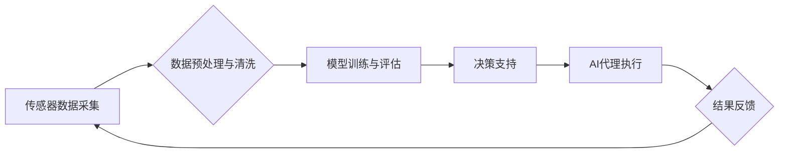

## AI代理在智慧农业中的工作流与决策支持

> 关键词：AI代理、智慧农业、决策支持、机器学习、传感器数据、工作流自动化、农业优化

## 1. 背景介绍

农业作为人类文明的基石，一直面临着产量提升、资源利用效率和环境可持续性等挑战。随着科技的进步，智慧农业应运而生，旨在通过数据化、智能化手段提高农业生产效率和效益。其中，AI代理作为一种新型的智能技术，在智慧农业领域展现出巨大的潜力。

AI代理是指能够自主学习、决策和执行任务的智能软件实体。它可以模拟人类的智能行为，通过感知环境、分析数据、制定计划并执行行动来完成特定的任务。在智慧农业中，AI代理可以扮演多种角色，例如：

* **田间作业代理：** 自动化田间作业，如播种、施肥、除草、收获等，提高作业效率和降低人工成本。
* **作物管理代理：** 根据作物生长情况和环境变化，智能调节灌溉、施肥、病虫害防治等，提高作物产量和品质。
* **资源管理代理：** 优化水资源、肥料、农药等资源的利用，降低农业生产成本和环境污染。
* **市场预测代理：** 分析市场需求和价格趋势，帮助农民制定合理的种植计划和销售策略。

## 2. 核心概念与联系

**2.1 核心概念**

* **AI代理:**  智能软件实体，能够自主学习、决策和执行任务。
* **智慧农业:**  利用信息技术、传感器技术、数据分析技术等手段，实现农业生产的智能化、自动化和精准化。
* **决策支持系统:**  基于数据分析和模型预测，为决策者提供决策依据和建议的系统。

**2.2 架构图**



**2.3 工作流程**

1. **传感器数据采集:**  部署在田间、温室等地的传感器收集作物生长、环境变化等数据。
2. **数据预处理与清洗:** 对采集到的原始数据进行清洗、格式化、转换等处理，去除噪声和异常值，使其符合模型训练要求。
3. **模型训练与评估:** 利用机器学习算法，对预处理后的数据进行训练，建立预测模型，并对模型性能进行评估。
4. **决策支持:**  根据模型预测结果，为农业生产决策者提供决策建议，例如最佳播种时间、施肥方案、病虫害防治策略等。
5. **AI代理执行:**  AI代理根据决策建议，自动执行相应的农业生产任务，例如自动灌溉、施肥、除草等。
6. **结果反馈:**  AI代理执行任务后的结果反馈到系统，用于模型更新和优化，形成闭环反馈机制。

## 3. 核心算法原理 & 具体操作步骤

**3.1 算法原理概述**

在智慧农业中，常用的AI代理算法包括：

* **强化学习:**  通过奖励机制，训练AI代理在特定环境中学习最优策略。
* **深度学习:**  利用多层神经网络，学习复杂的数据模式，实现图像识别、自然语言处理等任务。
* **贝叶斯网络:**  描述变量之间的概率关系，用于预测和决策。

**3.2 算法步骤详解**

以强化学习为例，其核心步骤包括：

1. **环境建模:**  建立农业生产环境的数学模型，包括作物生长模型、土壤水分模型、天气预报模型等。
2. **状态空间定义:**  定义农业生产环境的状态空间，例如作物生长阶段、土壤湿度、气温等。
3. **动作空间定义:**  定义AI代理可以执行的动作空间，例如灌溉、施肥、除草等。
4. **奖励函数设计:**  设计奖励函数，根据作物产量、资源利用效率、环境影响等因素，对AI代理的动作进行评价。
5. **策略学习:**  利用强化学习算法，例如Q学习、SARSA等，训练AI代理学习最优策略，即在不同状态下执行最优动作以获得最大奖励。

**3.3 算法优缺点**

* **优点:**  能够学习复杂的环境动态，并制定最优策略，适应不断变化的农业生产环境。
* **缺点:**  需要大量的训练数据和计算资源，训练过程复杂，模型解释性较差。

**3.4 算法应用领域**

* **精准农业:**  根据作物生长情况和环境变化，精准施肥、精准灌溉、精准病虫害防治。
* **无人化农业:**  实现无人驾驶的农业机械，自动完成田间作业。
* **农业资源管理:**  优化水资源、肥料、农药等资源的利用，降低农业生产成本和环境污染。

## 4. 数学模型和公式 & 详细讲解 & 举例说明

**4.1 数学模型构建**

在智慧农业中，常用的数学模型包括：

* **作物生长模型:**  描述作物生长过程的数学模型，例如Logistic模型、Gompertz模型等。
* **土壤水分模型:**  描述土壤水分变化的数学模型，例如Richards模型、Water Balance模型等。
* **天气预报模型:**  预测未来天气状况的数学模型，例如数值天气预报模型、统计天气预报模型等。

**4.2 公式推导过程**

以Logistic模型为例，其公式如下：

$$
Y(t) = \frac{K}{1 + e^{-r(t-t_0)}}
$$

其中：

* $Y(t)$:  作物产量在时间 $t$ 时刻
* $K$:  作物产量上限
* $r$:  作物生长速率
* $t_0$:  作物生长开始时间

该模型假设作物生长遵循S型曲线，初始阶段生长缓慢，中期生长迅速，后期生长趋于稳定。

**4.3 案例分析与讲解**

假设我们想要预测小麦的产量，已知小麦生长开始时间为 $t_0 = 10$ 天，产量上限为 $K = 1000$ kg/ha，生长速率为 $r = 0.2$ /天。

我们可以使用Logistic模型预测小麦产量，例如在 $t = 30$ 天时，小麦产量为：

$$
Y(30) = \frac{1000}{1 + e^{-0.2(30-10)}} \approx 865.0 kg/ha
$$

## 5. 项目实践：代码实例和详细解释说明

**5.1 开发环境搭建**

* 操作系统: Ubuntu 20.04
* Python 版本: 3.8
* 必要的库: TensorFlow, PyTorch, NumPy, Pandas, Matplotlib等

**5.2 源代码详细实现**

```python
import tensorflow as tf

# 定义模型结构
model = tf.keras.models.Sequential([
    tf.keras.layers.Dense(64, activation='relu', input_shape=(10,)),
    tf.keras.layers.Dense(32, activation='relu'),
    tf.keras.layers.Dense(1)
])

# 编译模型
model.compile(optimizer='adam', loss='mse')

# 训练模型
model.fit(X_train, y_train, epochs=100)

# 预测
predictions = model.predict(X_test)
```

**5.3 代码解读与分析**

* 该代码示例展示了使用TensorFlow框架训练一个简单的深度学习模型。
* 模型输入为10维特征向量，输出为一个实数，用于预测小麦产量。
* 模型结构包含三个全连接层，激活函数为ReLU。
* 使用Adam优化器和均方误差损失函数进行模型训练。
* 训练完成后，可以使用模型预测新的数据。

**5.4 运行结果展示**

* 训练结果可以以图表形式展示，例如训练损失随迭代次数的变化曲线。
* 预测结果可以与实际产量进行比较，评估模型的预测精度。

## 6. 实际应用场景

**6.1 智能灌溉系统**

AI代理可以根据土壤湿度、气温、作物生长情况等数据，智能调节灌溉时间和水量，提高水资源利用效率，降低灌溉成本。

**6.2 智能施肥系统**

AI代理可以根据土壤肥力、作物需求、天气预报等数据，智能制定施肥方案，优化肥料利用率，减少环境污染。

**6.3 智能病虫害防治系统**

AI代理可以识别作物病虫害，并根据病虫害类型和严重程度，智能推荐防治措施，提高防治效率，减少农药使用。

**6.4 未来应用展望**

* **无人化农业:**  AI代理可以控制无人驾驶的农业机械，实现田间作业的自动化。
* **精准农业:**  AI代理可以根据作物生长情况和环境变化，精准施肥、精准灌溉、精准病虫害防治。
* **农业资源管理:**  AI代理可以优化水资源、肥料、农药等资源的利用，降低农业生产成本和环境污染。

## 7. 工具和资源推荐

**7.1 学习资源推荐**

* **书籍:**
    * 《深度学习》
    * 《强化学习：原理、算法和应用》
* **在线课程:**
    * Coursera: 深度学习
    * Udacity: 强化学习
* **开源项目:**
    * TensorFlow
    * PyTorch

**7.2 开发工具推荐**

* **编程语言:** Python
* **机器学习框架:** TensorFlow, PyTorch
* **数据处理工具:** Pandas, NumPy
* **可视化工具:** Matplotlib, Seaborn

**7.3 相关论文推荐**

* **农业智能化:**
    * "Deep Learning for Precision Agriculture: A Survey"
    * "A Review of Artificial Intelligence Applications in Agriculture"
* **AI代理:**
    * "Reinforcement Learning: An Introduction"
    * "Multi-Agent Reinforcement Learning: A Survey"

## 8. 总结：未来发展趋势与挑战

**8.1 研究成果总结**

AI代理在智慧农业领域取得了显著进展，例如智能灌溉、智能施肥、智能病虫害防治等应用取得了成功。

**8.2 未来发展趋势**

* **模型复杂度提升:**  利用更复杂的深度学习模型，例如Transformer、Graph Neural Network等，提高模型预测精度和泛化能力。
* **多模态数据融合:**  融合图像、传感器数据、文本数据等多模态数据，构建更全面的农业生产模型。
* **边缘计算与云计算协同:**  将AI代理部署在边缘设备上，实现实时决策，并与云端平台协同工作，进行数据分析和模型更新。

**8.3 面临的挑战**

* **数据获取与质量:**  农业生产数据往往分散、不完整、质量参差不齐，需要开发有效的收集、清洗和预处理方法。
* **模型解释性:**  深度学习模型的决策过程往往难以解释，需要开发可解释的AI模型，提高模型信任度。
* **安全与隐私:**  AI代理在农业生产中需要处理大量敏感数据，需要保障数据安全和隐私。

**8.4 研究展望**

未来，AI代理在智慧农业领域将发挥越来越重要的作用，推动农业生产的智能化、自动化和精准化发展。


## 9. 附录：常见问题与解答

**9.1 如何选择合适的AI代理算法？**

选择合适的AI代理算法需要根据具体的应用场景和数据特点进行综合考虑。例如，对于需要学习复杂环境动态的任务，强化学习算法更适用；对于需要识别图像或文本的任务，深度学习算法更适用。

**9.2 如何解决农业生产数据质量问题？**

农业生产数据往往存在不完整、噪声、格式不统一等问题。可以采用以下方法解决数据质量问题：