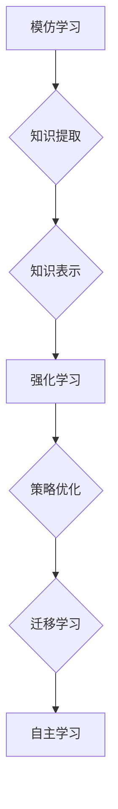

## AI的自主学习:模仿人类学习过程

> 关键词：自主学习、机器学习、深度学习、强化学习、模仿学习、神经网络、知识图谱、迁移学习

## 1. 背景介绍

人工智能（AI）的发展日新月异，从简单的规则型系统到如今的深度学习模型，AI已经展现出强大的学习和推理能力。然而，与人类相比，AI的学习方式仍然存在着许多局限性。人类的学习过程是复杂的，涉及感知、理解、记忆、推理和决策等多方面的能力。传统的机器学习方法主要依赖于人工特征工程和标注数据，这在一定程度上限制了AI的学习能力和泛化能力。

自主学习（Self-Learning）作为一种新的AI学习 paradigm，旨在让AI能够像人类一样，通过自身经验和环境交互，不断学习和提升。自主学习的核心思想是，AI应该能够从数据中自动提取特征，构建知识模型，并根据模型不断调整自己的行为策略，最终达到自主学习的目标。

## 2. 核心概念与联系

自主学习的核心概念包括：

* **模仿学习（Imitation Learning）：** 通过观察人类或其他智能体的行为，学习他们的策略和知识。
* **强化学习（Reinforcement Learning）：** 通过与环境交互，根据奖励和惩罚信号，学习最优的行为策略。
* **迁移学习（Transfer Learning）：** 利用已有的知识和经验，迁移到新的任务或领域中。
* **知识图谱（Knowledge Graph）：** 用于表示和组织知识的结构化数据模型。

这些概念相互关联，共同构成了自主学习的框架。

**Mermaid 流程图:**



## 3. 核心算法原理 & 具体操作步骤

### 3.1  算法原理概述

自主学习算法通常结合了多种机器学习技术，例如深度学习、强化学习和迁移学习。

* **深度学习:** 用于从数据中自动提取特征，构建复杂的知识模型。
* **强化学习:** 用于优化行为策略，使AI能够在环境中取得最佳结果。
* **迁移学习:** 用于利用已有的知识和经验，加速新任务的学习。

### 3.2  算法步骤详解

1. **数据收集和预处理:** 收集相关数据，并进行清洗、格式化和特征工程等预处理操作。
2. **知识提取:** 利用深度学习模型，从数据中提取关键特征和知识。
3. **知识表示:** 将提取的知识表示为结构化的知识图谱，方便后续的推理和决策。
4. **强化学习训练:** 利用强化学习算法，训练AI模型，使其能够根据环境反馈，优化行为策略。
5. **迁移学习应用:** 将训练好的模型迁移到新的任务或领域中，加速学习过程。
6. **评估和优化:** 对AI模型的性能进行评估，并根据评估结果进行模型优化和调整。

### 3.3  算法优缺点

**优点:**

* **自主学习能力:** AI能够通过自身经验和环境交互，不断学习和提升。
* **泛化能力:** 通过迁移学习，AI能够将已有的知识应用到新的任务或领域中。
* **适应性强:** AI能够根据环境变化，动态调整自己的行为策略。

**缺点:**

* **数据依赖:**  自主学习算法需要大量的训练数据。
* **训练复杂:**  训练自主学习模型需要复杂的算法和计算资源。
* **解释性差:**  深度学习模型的决策过程难以解释。

### 3.4  算法应用领域

自主学习算法在各个领域都有广泛的应用，例如：

* **机器人学:**  使机器人能够自主学习和导航。
* **自然语言处理:**  使AI能够理解和生成自然语言。
* **图像识别:**  使AI能够识别和分类图像。
* **医疗诊断:**  帮助医生进行疾病诊断和治疗方案制定。

## 4. 数学模型和公式 & 详细讲解 & 举例说明

### 4.1  数学模型构建

自主学习算法通常基于强化学习框架，其核心数学模型是**状态-动作-奖励（SARSA）模型**。

* **状态（State）：** AI模型当前的环境状态。
* **动作（Action）：** AI模型在当前状态下可以采取的行动。
* **奖励（Reward）：** 环境对AI模型动作的反馈信号。

### 4.2  公式推导过程

SARSA算法的目标是学习一个**价值函数（Value Function）**，该函数估计在特定状态下采取特定动作的长期回报。价值函数的更新公式如下：

$$
V(s, a) = V(s, a) + \alpha [r + \gamma \max_{a'} V(s', a') - V(s, a)]
$$

其中：

* $V(s, a)$ 是状态 $s$ 下采取动作 $a$ 的价值函数。
* $\alpha$ 是学习率，控制着价值函数更新的步长。
* $r$ 是环境对当前动作的奖励。
* $\gamma$ 是折扣因子，控制着未来奖励的权重。
* $s'$ 是采取动作 $a$ 后进入的下一个状态。
* $a'$ 是在下一个状态 $s'$ 下采取的动作。

### 4.3  案例分析与讲解

假设一个AI机器人需要学习如何通过迷宫到达终点。

* **状态:** 机器人的当前位置。
* **动作:** 机器人可以向左、右、上、下移动。
* **奖励:** 当机器人到达终点时，获得最大奖励；否则，获得较小的奖励。

通过SARSA算法，机器人可以不断地探索迷宫，并根据环境反馈更新价值函数。最终，机器人能够学习出最优的路径，从而到达终点。

## 5. 项目实践：代码实例和详细解释说明

### 5.1  开发环境搭建

* Python 3.x
* TensorFlow 或 PyTorch 深度学习框架
* OpenAI Gym 或其他强化学习环境

### 5.2  源代码详细实现

```python
import gym
import tensorflow as tf

# 定义价值函数模型
model = tf.keras.Sequential([
    tf.keras.layers.Dense(128, activation='relu'),
    tf.keras.layers.Dense(64, activation='relu'),
    tf.keras.layers.Dense(4, activation='linear')
])

# 定义学习率和折扣因子
alpha = 0.1
gamma = 0.9

# 训练循环
for episode in range(1000):
    state = env.reset()
    done = False
    total_reward = 0

    while not done:
        # 选择动作
        action = model.predict(state)[0]
        action = tf.argmax(action).numpy()

        # 执行动作
        next_state, reward, done, _ = env.step(action)

        # 更新价值函数
        target = reward + gamma * tf.reduce_max(model.predict(next_state), axis=0)
        target = tf.expand_dims(target, axis=0)
        loss = tf.keras.losses.mean_squared_error(model.predict(state), target)
        optimizer.minimize(loss, var_list=model.trainable_variables)

        # 更新状态
        state = next_state
        total_reward += reward

    print(f"Episode {episode+1}, Total Reward: {total_reward}")

```

### 5.3  代码解读与分析

* 代码首先定义了价值函数模型，该模型是一个简单的多层感知机。
* 然后定义了学习率和折扣因子，控制着价值函数更新的步长和未来奖励的权重。
* 训练循环中，AI模型会不断地探索环境，并根据环境反馈更新价值函数。
* 选择动作时，AI模型会根据当前状态预测价值函数，选择价值最高的动作。
* 执行动作后，AI模型会获得奖励，并根据SARSA算法更新价值函数。

### 5.4  运行结果展示

通过训练，AI模型能够学习出最优的策略，从而在环境中取得更高的奖励。

## 6. 实际应用场景

自主学习算法在各个领域都有广泛的应用，例如：

* **机器人学:**  使机器人能够自主学习和导航。
* **自然语言处理:**  使AI能够理解和生成自然语言。
* **图像识别:**  使AI能够识别和分类图像。
* **医疗诊断:**  帮助医生进行疾病诊断和治疗方案制定。

### 6.4  未来应用展望

随着人工智能技术的不断发展，自主学习算法将有更广泛的应用前景，例如：

* **个性化教育:**  根据学生的学习情况，提供个性化的学习方案。
* **智能客服:**  提供更加智能和人性化的客服服务。
* **自动驾驶:**  使自动驾驶汽车能够更加安全和可靠。

## 7. 工具和资源推荐

### 7.1  学习资源推荐

* **书籍:**
    * 《Reinforcement Learning: An Introduction》 by Richard S. Sutton and Andrew G. Barto
    * 《Deep Learning》 by Ian Goodfellow, Yoshua Bengio, and Aaron Courville
* **在线课程:**
    * Coursera: Reinforcement Learning Specialization
    * Udacity: Deep Learning Nanodegree

### 7.2  开发工具推荐

* **TensorFlow:**  开源深度学习框架
* **PyTorch:**  开源深度学习框架
* **OpenAI Gym:**  强化学习环境

### 7.3  相关论文推荐

* **Deep Reinforcement Learning with Double Q-learning**
* **Proximal Policy Optimization Algorithms**
* **Asynchronous Methods for Deep Reinforcement Learning**

## 8. 总结：未来发展趋势与挑战

### 8.1  研究成果总结

自主学习算法取得了显著的进展，在机器人学、自然语言处理、图像识别等领域取得了突破性成果。

### 8.2  未来发展趋势

* **更强大的模型:**  开发更强大的深度学习模型，提高自主学习的效率和精度。
* **更有效的算法:**  设计更有效的强化学习算法，解决现有算法的局限性。
* **更丰富的知识表示:**  构建更丰富的知识图谱，为自主学习提供更全面的知识支持。

### 8.3  面临的挑战

* **数据依赖:**  自主学习算法仍然依赖于大量的训练数据，数据获取和标注成本较高。
* **解释性差:**  深度学习模型的决策过程难以解释，这限制了自主学习的应用场景。
* **安全性和可靠性:**  自主学习系统需要具备高安全性、可靠性和鲁棒性，才能在实际应用中发挥作用。

### 8.4  研究展望

未来，自主学习研究将继续朝着更智能、更安全、更可靠的方向发展。

## 9. 附录：常见问题与解答

* **什么是自主学习？**

自主学习是一种人工智能学习 paradigm，旨在让AI能够像人类一样，通过自身经验和环境交互，不断学习和提升。

* **自主学习算法有哪些？**

常见的自主学习算法包括模仿学习、强化学习和迁移学习。

* **自主学习算法的应用场景有哪些？**

自主学习算法在各个领域都有广泛的应用，例如机器人学、自然语言处理、图像识别和医疗诊断。


作者：禅与计算机程序设计艺术 / Zen and the Art of Computer Programming 
