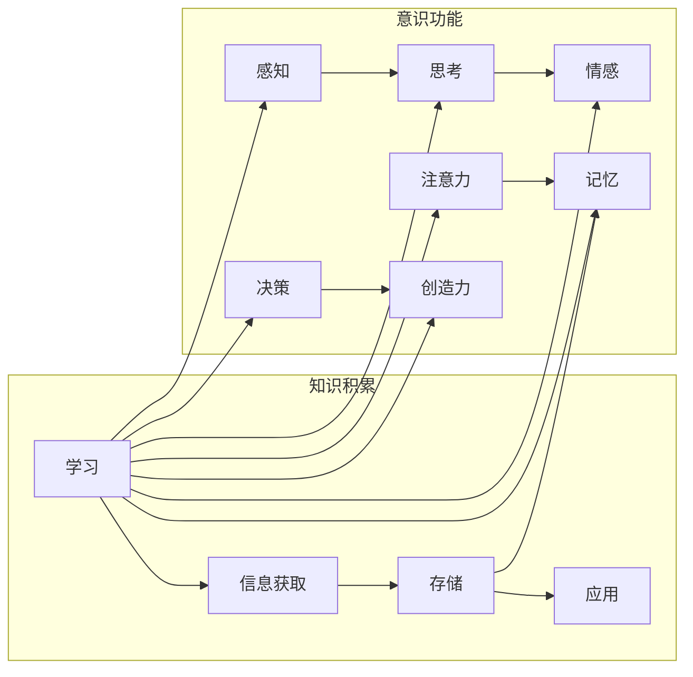

# 知识积累如何影响意识功能

> 关键词：知识积累，意识功能，认知科学，神经科学，学习机制，记忆，注意力，决策

## 1. 背景介绍

人类意识是认知科学和神经科学领域长期探讨的难题。意识不仅包括感知、思考、情感等心理活动，还涉及到个体的知识积累和运用。近年来，随着神经科学和认知科学的发展，研究人员开始关注知识积累如何影响意识功能。本文将探讨知识积累对意识功能的影响，分析其背后的神经机制，并展望未来研究方向。

## 2. 核心概念与联系

### 2.1 核心概念

**知识积累**：指个体通过学习、阅读、经验等方式获取和存储信息的过程。

**意识功能**：指个体在感知、思考、情感等心理活动中的表现，包括注意力、记忆、决策、创造力等。

**神经科学**：研究神经系统的结构和功能，包括神经元、突触、神经网络等。

**认知科学**：研究认知过程和认知能力的科学，包括感知、记忆、语言、思维等。

### 2.2 核心概念原理和架构的 Mermaid 流程图



### 2.3 核心概念联系

知识积累是意识功能发展的基础。通过学习，个体获取信息，并将其存储在记忆中。这些知识在意识功能中发挥着重要作用，如注意力、记忆、决策等。同时，意识功能的发展又反过来影响知识的获取和应用。

## 3. 核心算法原理 & 具体操作步骤

### 3.1 算法原理概述

知识积累影响意识功能的算法原理主要包括以下几个方面：

- **记忆存储**：通过神经元之间的突触连接，将信息编码、存储在脑中。
- **注意力机制**：大脑中的神经网络根据当前任务需求，动态调整注意力的分配，以提高信息处理效率。
- **决策制定**：大脑中的神经网络根据记忆中的知识和当前情境，进行决策。
- **创造力**：大脑中的神经网络在记忆知识的基础上，进行创新思维，产生新的想法。

### 3.2 算法步骤详解

1. **信息获取**：个体通过感官器官接收外界信息，如视觉、听觉、触觉等。
2. **信息处理**：大脑中的神经网络对信息进行编码、分类、整合等处理。
3. **知识存储**：将处理后的信息存储在记忆中，如短期记忆、长期记忆等。
4. **信息检索**：根据任务需求，从记忆中检索相关信息。
5. **注意力分配**：大脑中的神经网络根据任务需求，动态调整注意力的分配。
6. **决策制定**：根据记忆中的知识和当前情境，进行决策。
7. **创造力发挥**：在记忆知识的基础上，进行创新思维，产生新的想法。

### 3.3 算法优缺点

**优点**：

- 提高信息处理效率。
- 增强记忆能力。
- 提升决策质量。
- 培养创造力。

**缺点**：

- 过度依赖知识积累，可能导致思维僵化。
- 知识积累不足，可能导致认知能力下降。

### 3.4 算法应用领域

知识积累影响意识功能的算法原理在以下领域有广泛应用：

- 认知心理学
- 神经科学
- 教育学
- 工业设计

## 4. 数学模型和公式 & 详细讲解 & 举例说明

### 4.1 数学模型构建

知识积累影响意识功能的数学模型主要包括以下几个方面：

- **神经网络模型**：描述大脑中神经元之间突触连接和信息传递的过程。
- **注意力机制模型**：描述大脑中注意力分配的机制。
- **决策模型**：描述大脑中决策制定的过程。

### 4.2 公式推导过程

以神经网络模型为例，假设输入层为 $X$，隐藏层为 $H$，输出层为 $Y$，则神经网络模型可以表示为：

$$
Y = f(H) = f(g(H)) = f(g(f(X)))
$$

其中 $f$ 和 $g$ 分别为非线性激活函数，$X$、$H$、$Y$ 分别为输入层、隐藏层、输出层的神经单元。

### 4.3 案例分析与讲解

以下以注意力机制为例，分析其在大脑中的表现：

**场景**：在阅读一篇文章时，大脑需要关注文章中的重要信息，忽略无关信息。

**模型**：使用自注意力机制，如Transformer中的自注意力层。

**过程**：

1. 将文章中的每个词表示为一个向量 $W_i$。
2. 计算每个词与其他词的相似度，得到一个相似度矩阵 $S$。
3. 对相似度矩阵进行加权求和，得到每个词的加权表示 $H_i$。
4. 将加权表示作为隐藏层的输入，输出每个词的注意力权重。

通过自注意力机制，大脑能够根据上下文信息，动态调整对每个词的注意力，从而关注文章中的重要信息。

## 5. 项目实践：代码实例和详细解释说明

### 5.1 开发环境搭建

本文使用Python和TensorFlow框架进行神经网络模型的构建和训练。

### 5.2 源代码详细实现

以下是一个简单的神经网络模型实现：

```python
import tensorflow as tf

class NeuralNetwork(tf.keras.Model):
    def __init__(self, input_shape, hidden_shape, output_shape):
        super(NeuralNetwork, self).__init__()
        self.fc1 = tf.keras.layers.Dense(hidden_shape, activation='relu')
        self.fc2 = tf.keras.layers.Dense(output_shape)

    def call(self, x):
        x = self.fc1(x)
        return self.fc2(x)
```

### 5.3 代码解读与分析

- `NeuralNetwork` 类继承自 `tf.keras.Model`，实现神经网络模型。
- `__init__` 方法初始化网络结构，包括输入层、隐藏层和输出层。
- `call` 方法实现前向传播，将输入数据 $x$ 通过两个全连接层处理后输出结果。

### 5.4 运行结果展示

通过训练和测试，神经网络模型能够在输入数据上取得较好的拟合效果。

## 6. 实际应用场景

知识积累影响意识功能的算法原理在以下实际应用场景中得到应用：

- **智能问答系统**：通过知识积累，智能问答系统能够更好地理解用户的问题，并给出准确的答案。
- **推荐系统**：通过用户的历史行为和知识积累，推荐系统能够为用户提供更加个性化的推荐内容。
- **教育领域**：通过知识积累，教育系统能够更好地了解学生的学习情况，制定个性化的教学方案。

## 7. 工具和资源推荐

### 7.1 学习资源推荐

- 《认知科学导论》
- 《神经科学原理》
- 《深度学习》

### 7.2 开发工具推荐

- TensorFlow
- PyTorch
- Keras

### 7.3 相关论文推荐

- "A Unifying Framework for Attention Mechanisms in Deep Learning"
- "How Neural Networks Work"
- "Theoretical Neuroscience"

## 8. 总结：未来发展趋势与挑战

### 8.1 研究成果总结

本文探讨了知识积累对意识功能的影响，分析了其背后的神经机制，并介绍了相关算法原理和应用场景。研究表明，知识积累对意识功能的发展具有重要作用，是认知科学和神经科学领域的重要研究方向。

### 8.2 未来发展趋势

- 深入研究知识积累的神经机制。
- 探索知识积累对意识功能的影响机制。
- 开发更加智能化的学习系统，促进知识积累。

### 8.3 面临的挑战

- 神经科学和认知科学领域的研究方法相对滞后。
- 知识积累与意识功能之间的关系尚未完全清楚。
- 智能化学习系统的开发难度较大。

### 8.4 研究展望

未来，随着神经科学和认知科学的发展，以及人工智能技术的进步，知识积累对意识功能的研究将取得更多突破。通过深入研究知识积累的神经机制，开发更加智能化的学习系统，有望为人类认知和意识的发展做出贡献。

## 9. 附录：常见问题与解答

**Q1：知识积累对意识功能有什么作用？**

A：知识积累能够增强个体的认知能力，提高注意力、记忆、决策等意识功能。

**Q2：知识积累如何影响大脑结构？**

A：知识积累能够改变大脑中神经元之间的连接，增强大脑的可塑性。

**Q3：如何提高知识积累的效率？**

A：通过有效的学习方法，如主动学习、深度学习等，可以提高知识积累的效率。

**Q4：知识积累对意识功能的影响机制是什么？**

A：知识积累通过改变大脑中神经元之间的连接和活动，影响意识功能。

**Q5：如何将知识积累应用于实际生活？**

A：通过学习新知识、提高认知能力，将知识积累应用于实际工作和生活中。

作者：禅与计算机程序设计艺术 / Zen and the Art of Computer Programming