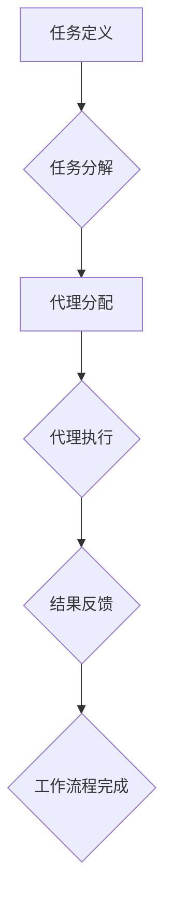

## AI 大模型代理型工作流程 (Agentic workflow) 

> 关键词：AI大模型、代理型工作流程、智能自动化、工作流程管理、模型代理、任务分解、智能决策

## 1. 背景介绍

随着人工智能技术的飞速发展，大模型的涌现为智能自动化带来了新的机遇。传统的自动化工作流程通常依赖于预先定义的规则和流程，难以应对复杂、动态的环境变化。而代理型工作流程 (Agentic workflow) 则通过引入智能代理，赋予工作流程自主决策和执行的能力，从而实现更灵活、更智能的自动化。

代理型工作流程的核心思想是将工作流程分解成一系列任务，每个任务由一个智能代理负责执行。这些代理可以根据任务需求，自主地获取信息、分析数据、做出决策并执行操作。这种代理化的设计模式，使得工作流程能够更好地适应复杂环境的变化，并实现更精细化的自动化控制。

## 2. 核心概念与联系

### 2.1  核心概念

* **代理 (Agent):**  代理是一个能够感知环境、做出决策并执行行动的智能实体。在代理型工作流程中，代理负责执行单个或多个任务。
* **工作流程 (Workflow):** 工作流程是一个由一系列任务组成的有序序列，用于完成特定目标。代理型工作流程将工作流程分解成多个任务，由不同的代理负责执行。
* **智能决策 (Intelligent Decision Making):** 代理需要能够根据任务需求和环境信息，做出最优的决策。这通常需要结合机器学习、知识图谱等技术。

### 2.2  架构



**流程图说明:**

1. **任务定义:**  首先明确需要完成的工作目标，并将其分解成一系列具体的任务。
2. **任务分解:** 将任务进一步细化，以便每个代理能够独立执行。
3. **代理分配:** 根据任务特性，将任务分配给合适的代理。
4. **代理执行:** 代理根据任务指令和环境信息，自主执行任务。
5. **结果反馈:** 代理执行完成后，将结果反馈给工作流程系统。
6. **工作流程完成:** 工作流程系统根据代理反馈的结果，判断工作流程是否完成。

## 3. 核心算法原理 & 具体操作步骤

### 3.1  算法原理概述

代理型工作流程的核心算法通常包括以下几个方面:

* **任务分解算法:** 将复杂任务分解成更小的、可执行的任务。常见的任务分解算法包括层次分解、规则分解等。
* **代理选择算法:** 根据任务特性和代理能力，选择合适的代理执行任务。常见的代理选择算法包括贪婪算法、启发式算法等。
* **智能决策算法:** 代理根据任务指令和环境信息，做出最优的决策。常见的智能决策算法包括强化学习、决策树等。

### 3.2  算法步骤详解

1. **任务描述:**  首先需要对需要完成的工作进行描述，包括任务目标、输入数据、输出结果等。
2. **任务分解:** 使用任务分解算法将任务分解成一系列子任务。
3. **代理库构建:**  建立一个代理库，包含不同类型的代理和他们的能力信息。
4. **代理选择:** 使用代理选择算法，根据子任务特性选择合适的代理执行。
5. **代理执行:** 代理根据任务指令和环境信息，执行子任务并返回结果。
6. **结果整合:** 工作流程系统整合所有子任务的结果，并判断工作流程是否完成。

### 3.3  算法优缺点

**优点:**

* **灵活性:** 代理型工作流程能够适应复杂、动态的环境变化。
* **智能化:** 代理能够自主决策和执行，提高工作流程的智能化水平。
* **可扩展性:** 可以通过添加新的代理，扩展工作流程的功能。

**缺点:**

* **复杂性:** 设计和实现代理型工作流程相对复杂。
* **安全风险:** 代理的自主决策可能带来安全风险，需要加强安全控制。
* **可解释性:** 代理的决策过程可能难以解释，影响工作流程的可信度。

### 3.4  算法应用领域

代理型工作流程在以下领域具有广泛的应用前景:

* **自动化办公:** 自动化文档处理、数据录入、会议安排等工作流程。
* **智能制造:** 自动化生产线控制、设备维护、质量检测等工作流程。
* **金融服务:** 自动化理财规划、风险评估、欺诈检测等工作流程。
* **医疗保健:** 自动化病历分析、诊断辅助、药物推荐等工作流程。

## 4. 数学模型和公式 & 详细讲解 & 举例说明

### 4.1  数学模型构建

代理型工作流程可以抽象为一个状态机模型，其中每个状态代表一个工作流程阶段，每个状态转换代表一个任务完成或代理决策的结果。

**状态机模型:**

```
状态集合 S = {s0, s1, s2,..., sn}
转换函数 T: S x A -> S
初始状态 s0
终止状态 sn
```

其中:

* S: 状态集合
* A: 动作集合
* T: 状态转换函数
* s0: 初始状态
* sn: 终止状态

### 4.2  公式推导过程

代理的决策过程可以采用强化学习算法进行建模。强化学习算法的目标是训练代理，使其在执行任务的过程中获得最大奖励。

**Bellman方程:**

$$
V(s) = \max_a \sum_{s'} P(s' | s, a) [R(s, a, s') + \gamma V(s')]
$$

其中:

* V(s): 状态 s 的价值函数
* a: 代理可以执行的动作
* s': 状态 s 执行动作 a 后可能到达的状态
* P(s' | s, a): 从状态 s 执行动作 a 到达状态 s' 的概率
* R(s, a, s'): 状态 s 执行动作 a 到达状态 s' 的奖励
* γ: 折扣因子

### 4.3  案例分析与讲解

假设一个代理需要完成一个任务，该任务包含多个子任务。代理可以根据子任务的优先级和完成时间，选择执行子任务的顺序。

使用 Bellman方程，可以训练代理，使其选择最优的子任务执行顺序，从而最大化完成任务的奖励。

## 5. 项目实践：代码实例和详细解释说明

### 5.1  开发环境搭建

* Python 3.x
* TensorFlow 或 PyTorch
* ROS (Robot Operating System) (可选)

### 5.2  源代码详细实现

```python
# 代理类
class Agent:
    def __init__(self, task_list):
        self.task_list = task_list
        self.current_task = None

    def select_task(self):
        # 根据任务优先级和完成时间选择任务
        pass

    def execute_task(self):
        # 执行任务并返回结果
        pass

# 工作流程类
class Workflow:
    def __init__(self, task_list):
        self.task_list = task_list
        self.agent = Agent(task_list)

    def run(self):
        # 初始化工作流程
        self.agent.current_task = self.agent.select_task()
        while self.agent.current_task:
            result = self.agent.execute_task()
            # 处理结果并更新工作流程状态
            pass
```

### 5.3  代码解读与分析

* **代理类:**  代理类负责执行单个任务。
* **工作流程类:** 工作流程类负责管理代理和工作流程状态。
* **run() 方法:** 工作流程类中的 run() 方法负责启动工作流程，并根据代理的执行结果更新工作流程状态。

### 5.4  运行结果展示

运行代码后，代理将根据任务优先级和完成时间，选择执行任务并返回结果。工作流程类将处理结果并更新工作流程状态，最终完成工作流程的目标。

## 6. 实际应用场景

### 6.1  智能客服

代理型工作流程可以用于构建智能客服系统，代理可以根据用户问题，自主地查找相关信息并提供解决方案。

### 6.2  自动驾驶

代理型工作流程可以用于构建自动驾驶系统，代理可以负责感知环境、规划路径、控制车辆等任务。

### 6.3  个性化推荐

代理型工作流程可以用于构建个性化推荐系统，代理可以根据用户的兴趣爱好，推荐相关的商品或服务。

### 6.4  未来应用展望

随着人工智能技术的不断发展，代理型工作流程将在更多领域得到应用，例如医疗诊断、金融风险管理、教育个性化等。

## 7. 工具和资源推荐

### 7.1  学习资源推荐

* **书籍:**
    * "Reinforcement Learning: An Introduction" by Sutton and Barto
    * "Artificial Intelligence: A Modern Approach" by Russell and Norvig
* **在线课程:**
    * Coursera: "Reinforcement Learning Specialization"
    * Udacity: "Intro to Artificial Intelligence"

### 7.2  开发工具推荐

* **TensorFlow:**  开源机器学习框架
* **PyTorch:**  开源机器学习框架
* **ROS:**  机器人操作系统

### 7.3  相关论文推荐

* "Agentic Workflow: A Framework for Intelligent Automation"
* "Deep Reinforcement Learning for Robotics"
* "Transfer Learning for Natural Language Processing"

## 8. 总结：未来发展趋势与挑战

### 8.1  研究成果总结

代理型工作流程为智能自动化提供了新的思路和方法，能够有效地解决传统工作流程难以应对的复杂、动态问题。

### 8.2  未来发展趋势

* **更智能的代理:**  利用更先进的机器学习算法，训练更智能的代理，使其能够更好地理解环境信息和做出更优的决策。
* **更灵活的工作流程:**  开发更灵活的工作流程模型，能够适应更复杂、更动态的环境变化。
* **更安全的代理:**  加强代理的安全控制，防止代理被恶意攻击或滥用。

### 8.3  面临的挑战

* **代理的解释性:**  代理的决策过程可能难以解释，这会影响工作流程的可信度。
* **代理的可靠性:**  代理的执行结果可能存在误差，需要提高代理的可靠性。
* **代理的协作性:**  多个代理需要能够有效地协作，完成复杂的任务。

### 8.4  研究展望

未来，我们将继续研究代理型工作流程，探索更智能、更灵活、更安全的代理模型，并将其应用于更多领域，推动智能自动化的发展。

## 9. 附录：常见问题与解答

* **什么是代理型工作流程？**

代理型工作流程是一种将工作流程分解成一系列任务，由智能代理负责执行的工作流程模式。

* **代理型工作流程的优势是什么？**

代理型工作流程能够适应复杂、动态的环境变化，提高工作流程的智能化水平。

* **代理型工作流程的应用场景有哪些？**

代理型工作流程在智能客服、自动驾驶、个性化推荐等领域具有广泛的应用前景。


作者：禅与计算机程序设计艺术 / Zen and the Art of Computer Programming 
