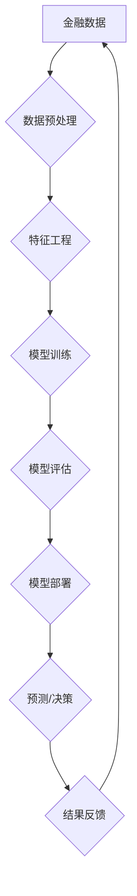

## AI与金融学交叉原理与代码实战案例讲解

> 关键词：人工智能、金融学、机器学习、深度学习、风险管理、预测分析、自然语言处理

## 1. 背景介绍

金融行业一直以来都是数据密集型行业，蕴藏着巨大的数据价值。随着人工智能（AI）技术的快速发展，AI在金融领域的应用越来越广泛，为金融机构带来了前所未有的机遇。AI技术能够帮助金融机构提高效率、降低成本、提升客户体验，并挖掘新的商业模式。

从传统的信用评分模型到最新的量化投资策略，AI已经渗透到金融行业的各个环节。例如，在风险管理领域，AI可以用于识别欺诈行为、评估信用风险和预测市场波动；在投资领域，AI可以用于量化投资、个性化理财和自动交易；在客户服务领域，AI可以用于智能客服、个性化推荐和客户关系管理。

## 2. 核心概念与联系

金融学和人工智能的交叉融合，形成了一个全新的领域——金融AI。金融AI的核心概念包括：

* **机器学习（Machine Learning）：** 是一种人工智能技术，通过算法学习数据中的模式，并根据这些模式进行预测或决策。
* **深度学习（Deep Learning）：** 是一种更高级的机器学习技术，利用多层神经网络模拟人类大脑的学习过程，能够处理更复杂的数据和任务。
* **自然语言处理（Natural Language Processing）：** 是一种人工智能技术，能够使计算机理解和处理人类语言。

**金融AI的架构**



## 3. 核心算法原理 & 具体操作步骤

### 3.1  算法原理概述

在金融AI领域，常用的机器学习算法包括：

* **线性回归（Linear Regression）：** 用于预测连续变量，例如股票价格或房价。
* **逻辑回归（Logistic Regression）：** 用于预测分类变量，例如客户是否会违约。
* **决策树（Decision Tree）：** 用于构建决策规则，例如判断贷款是否通过。
* **支持向量机（Support Vector Machine）：** 用于分类和回归，能够处理高维数据。
* **随机森林（Random Forest）：** 结合多个决策树，提高预测精度。
* **梯度提升机（Gradient Boosting Machine）：** 迭代训练多个弱学习器，构建强学习器。

### 3.2  算法步骤详解

以线性回归为例，其具体操作步骤如下：

1. **数据收集和预处理：** 收集相关金融数据，并进行清洗、转换和特征工程。
2. **模型训练：** 使用训练数据训练线性回归模型，找到最佳的模型参数。
3. **模型评估：** 使用测试数据评估模型的预测精度，例如使用均方误差（MSE）或R-squared。
4. **模型部署：** 将训练好的模型部署到生产环境中，用于预测新的数据。

### 3.3  算法优缺点

每个算法都有其自身的优缺点，需要根据具体应用场景选择合适的算法。例如，线性回归简单易懂，但对非线性关系的拟合能力较弱；决策树易于解释，但容易过拟合；随机森林鲁棒性强，但训练时间较长。

### 3.4  算法应用领域

不同的机器学习算法在金融领域的应用场景也不尽相同。例如，线性回归常用于股票价格预测；逻辑回归常用于信用风险评估；决策树常用于贷款审批；支持向量机常用于欺诈检测。

## 4. 数学模型和公式 & 详细讲解 & 举例说明

### 4.1  数学模型构建

在金融AI中，常用的数学模型包括线性回归模型、逻辑回归模型、决策树模型等。

**线性回归模型**

假设我们想要预测股票价格，可以建立一个线性回归模型：

$$
y = \beta_0 + \beta_1 x_1 + \beta_2 x_2 +... + \beta_n x_n + \epsilon
$$

其中：

* $y$ 是股票价格
* $x_1, x_2,..., x_n$ 是股票价格影响因素，例如公司盈利、市场指数等
* $\beta_0, \beta_1,..., \beta_n$ 是模型参数
* $\epsilon$ 是随机误差

### 4.2  公式推导过程

线性回归模型的目标是找到最佳的模型参数，使得模型预测的股票价格与实际股票价格之间的误差最小。可以使用最小二乘法来推导模型参数。

### 4.3  案例分析与讲解

假设我们想要预测某公司的股票价格，收集了以下数据：

* 公司盈利：1000万
* 市场指数：1200点
* 历史股价：100元

我们可以建立一个线性回归模型，并使用最小二乘法来推导模型参数。

## 5. 项目实践：代码实例和详细解释说明

### 5.1  开发环境搭建

本项目使用Python语言进行开发，需要安装以下软件包：

* NumPy
* Pandas
* Scikit-learn

### 5.2  源代码详细实现

```python
import numpy as np
from sklearn.linear_model import LinearRegression

# 数据集
X = np.array([[1000000, 1200]])  # 公司盈利，市场指数
y = np.array([100])  # 历史股价

# 创建线性回归模型
model = LinearRegression()

# 训练模型
model.fit(X, y)

# 预测新股价
new_data = np.array([[1500000, 1300]])
predicted_price = model.predict(new_data)

# 打印预测结果
print(f"预测股价: {predicted_price}")
```

### 5.3  代码解读与分析

* 首先，我们导入必要的库函数。
* 然后，我们定义数据集，其中X包含公司盈利和市场指数，y包含历史股价。
* 接下来，我们创建线性回归模型，并使用训练数据训练模型。
* 训练完成后，我们可以使用模型预测新股价。
* 最后，我们打印预测结果。

### 5.4  运行结果展示

运行以上代码，可以得到预测的股价。

## 6. 实际应用场景

金融AI在实际应用场景中具有广泛的应用前景，例如：

* **风险管理：** 使用机器学习算法识别欺诈行为、评估信用风险和预测市场波动。
* **投资管理：** 使用量化投资策略和AI算法进行股票、债券和基金的投资决策。
* **客户服务：** 使用智能客服和自然语言处理技术提供更便捷、高效的客户服务。
* **个性化金融服务：** 使用AI算法分析客户需求，提供个性化的理财建议和金融产品。

### 6.4  未来应用展望

随着人工智能技术的不断发展，金融AI的应用场景将会更加广泛，例如：

* **自动交易：** 使用AI算法进行自动交易，提高交易效率和盈利能力。
* **智能风控：** 使用AI算法进行智能风控，降低金融机构的风险。
* **金融科技创新：** 使用AI算法推动金融科技创新，开发新的金融产品和服务。

## 7. 工具和资源推荐

### 7.1  学习资源推荐

* **书籍：**
    * 《人工智能与金融》
    * 《机器学习实战》
    * 《深度学习》
* **在线课程：**
    * Coursera
    * edX
    * Udacity

### 7.2  开发工具推荐

* **Python：** 
* **NumPy：** 数值计算库
* **Pandas：** 数据分析库
* **Scikit-learn：** 机器学习库
* **TensorFlow：** 深度学习库
* **PyTorch：** 深度学习库

### 7.3  相关论文推荐

* **金融AI论文数据库：**
    * arXiv
    * IEEE Xplore
    * ACM Digital Library

## 8. 总结：未来发展趋势与挑战

### 8.1  研究成果总结

金融AI已经取得了显著的成果，在风险管理、投资管理、客户服务等领域发挥着越来越重要的作用。

### 8.2  未来发展趋势

未来，金融AI的发展趋势包括：

* **模型更加复杂：** 使用更复杂的深度学习模型，提高预测精度。
* **数据更加丰富：** 利用更多类型的数据，例如文本数据和图像数据，进行更全面的分析。
* **应用更加广泛：** 将金融AI应用到更多领域，例如自动交易和智能风控。

### 8.3  面临的挑战

金融AI的发展也面临着一些挑战，例如：

* **数据安全和隐私保护：** 金融数据敏感性高，需要加强数据安全和隐私保护。
* **算法解释性和可信度：** 深度学习模型的决策过程难以解释，需要提高算法的解释性和可信度。
* **监管和伦理问题：** 金融AI的应用需要符合相关法律法规和伦理规范。

### 8.4  研究展望

未来，我们需要继续加强金融AI的研究，解决上述挑战，推动金融AI的健康发展。

## 9. 附录：常见问题与解答

* **金融AI与传统金融的区别是什么？**

金融AI利用人工智能技术进行金融分析和决策，而传统金融主要依靠人工经验和传统算法。

* **金融AI有哪些应用场景？**

金融AI在风险管理、投资管理、客户服务等领域都有广泛的应用场景。

* **金融AI有哪些发展趋势？**

未来，金融AI的发展趋势包括模型更加复杂、数据更加丰富、应用更加广泛。


作者：禅与计算机程序设计艺术 / Zen and the Art of Computer Programming 
