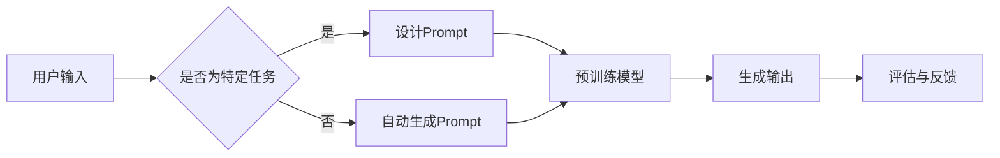

# Auto-GPT Prompt 设计

> 关键词：Auto-GPT，Prompt学习，自然语言处理，预训练模型，推理，生成，对话系统

## 1. 背景介绍

随着自然语言处理（NLP）领域的快速发展，大语言模型（Large Language Models，LLMs）如BERT、GPT-3等在文本生成、问答、翻译等任务上取得了显著的成果。然而，这些模型在处理特定场景和任务时，往往需要大量的定制化和微调工作。为了解决这一问题，Prompt学习应运而生。Prompt学习通过设计特定的输入提示（Prompt），引导预训练模型生成期望的输出，从而无需对模型进行大规模的微调。Auto-GPT作为Prompt学习的一种实现，进一步自动化了Prompt的设计过程，使得NLP应用的开发更加高效和便捷。

## 2. 核心概念与联系

### 2.1 核心概念

**大语言模型（LLMs）**：LLMs是通过在大量文本语料上进行预训练，学习到丰富的语言知识和模式，具备强大的语言理解和生成能力。

**Prompt学习**：Prompt学习是一种利用预训练模型进行自然语言生成的方法，通过设计特定的输入提示，引导模型生成期望的输出。

**Auto-GPT**：Auto-GPT是一种自动化Prompt设计的方法，通过算法自动生成最优的Prompt，以实现高效的文本生成。

### 2.2 核心概念原理和架构 Mermaid 流程图



### 2.3 核心概念联系

Auto-GPT结合了LLMs和Prompt学习的优势，通过自动化Prompt设计，实现了高效的自然语言生成。LLMs为Auto-GPT提供了强大的语言理解和生成能力，Prompt学习则为Auto-GPT提供了灵活的任务适应性，而Auto-GPT则将LLMs和Prompt学习相结合，实现了更加高效和便捷的文本生成。

## 3. 核心算法原理 & 具体操作步骤

### 3.1 算法原理概述

Auto-GPT的核心思想是利用机器学习算法自动学习最优的Prompt设计策略。具体而言，Auto-GPT通过以下步骤实现：

1. 收集大量标记化的Prompt-Response对，作为训练数据。
2. 设计一个基于深度学习的Prompt设计模型，用于预测给定输入的Prompt。
3. 使用收集的训练数据对Prompt设计模型进行训练。
4. 在新的任务中，使用训练好的Prompt设计模型自动生成最优的Prompt。
5. 使用生成的Prompt引导LLMs生成期望的输出。

### 3.2 算法步骤详解

**步骤 1：数据收集**

收集大量标记化的Prompt-Response对，作为训练数据。这些数据可以是来自公开数据集，也可以是人工标注的数据。

**步骤 2：设计Prompt设计模型**

设计一个基于深度学习的Prompt设计模型，用于预测给定输入的Prompt。常见的Prompt设计模型包括：

- **基于RNN的模型**：如LSTM、GRU等，能够处理序列数据。
- **基于Transformer的模型**：如BERT、GPT等，能够捕捉长距离依赖关系。
- **基于强化学习的模型**：如PPO、DQN等，能够学习最优的Prompt设计策略。

**步骤 3：训练Prompt设计模型**

使用收集的训练数据对Prompt设计模型进行训练，使其能够预测给定输入的最优Prompt。

**步骤 4：自动生成Prompt**

在新的任务中，使用训练好的Prompt设计模型自动生成最优的Prompt。

**步骤 5：生成输出**

使用生成的Prompt引导LLMs生成期望的输出。

### 3.3 算法优缺点

**优点**：

- **高效**：自动生成Prompt，无需人工设计，节省时间和人力成本。
- **灵活**：能够适应不同的任务和场景，具有较好的泛化能力。
- **可扩展**：能够处理大规模数据和复杂的任务。

**缺点**：

- **数据依赖**：需要大量的标记化Prompt-Response对，数据收集和标注成本较高。
- **模型复杂**：基于深度学习的Prompt设计模型可能比较复杂，需要较高的计算资源。
- **可解释性**：模型的决策过程缺乏可解释性，难以理解其背后的原因。

### 3.4 算法应用领域

Auto-GPT在以下领域具有广泛的应用前景：

- **文本生成**：如新闻生成、故事生成、对话生成等。
- **问答系统**：如知识问答、客服问答等。
- **翻译**：如机器翻译、跨语言问答等。
- **对话系统**：如聊天机器人、虚拟助手等。

## 4. 数学模型和公式 & 详细讲解 & 举例说明

### 4.1 数学模型构建

Auto-GPT的数学模型主要包括两部分：Prompt设计模型和LLMs。

**Prompt设计模型**：

假设Prompt设计模型为一个基于Transformer的模型，其输入为输入文本 $X$，输出为Prompt $P$，则其数学模型可以表示为：

$$
P = f(X)
$$

其中 $f$ 为Transformer模型。

**LLMs**：

假设LLMs为BERT模型，其输入为Prompt $P$，输出为生成文本 $Y$，则其数学模型可以表示为：

$$
Y = g(P)
$$

其中 $g$ 为BERT模型。

### 4.2 公式推导过程

假设我们使用Transformer模型作为Prompt设计模型，其输入为文本 $X$，输出为Prompt $P$，则其输入层可以表示为：

$$
X = [CLS, x_1, x_2, ..., x_n]
$$

其中 $[CLS]$ 为[CLS]标记，$x_i$ 为文本 $X$ 中的第 $i$ 个词。

Transformer模型的输出可以表示为：

$$
P = [CLS, p_1, p_2, ..., p_n]
$$

其中 $p_i$ 为Prompt中第 $i$ 个词。

### 4.3 案例分析与讲解

假设我们要使用Auto-GPT生成一篇关于人工智能的新闻报道，输入文本为“人工智能在近年来取得了巨大的进展”，我们可以按照以下步骤进行：

**步骤 1：设计Prompt设计模型**

使用Transformer模型作为Prompt设计模型，输入为输入文本，输出为Prompt。

**步骤 2：训练Prompt设计模型**

收集大量标记化的Prompt-Response对，用于训练Prompt设计模型。

**步骤 3：自动生成Prompt**

使用训练好的Prompt设计模型，自动生成最优的Prompt。

**步骤 4：生成输出**

使用生成的Prompt引导LLMs生成期望的输出。

## 5. 项目实践：代码实例和详细解释说明

### 5.1 开发环境搭建

以下是使用Python进行Auto-GPT开发的开发环境搭建步骤：

1. 安装Anaconda：从官网下载并安装Anaconda，用于创建独立的Python环境。
2. 创建并激活虚拟环境：
```bash
conda create -n auto-gpt-env python=3.8
conda activate auto-gpt-env
```
3. 安装必要的库：
```bash
conda install pytorch transformers datasets transformers
```

### 5.2 源代码详细实现

以下是一个使用PyTorch和Transformers库实现Auto-GPT的简单示例：

```python
import torch
from torch.utils.data import DataLoader
from transformers import BertTokenizer, BertForSequenceClassification
from datasets import load_dataset

# 加载预训练模型和分词器
tokenizer = BertTokenizer.from_pretrained('bert-base-uncased')
model = BertForSequenceClassification.from_pretrained('bert-base-uncased')

# 加载数据集
dataset = load_dataset('glue', 'sst2')

# 定义Prompt设计模型
class PromptDesignModel(torch.nn.Module):
    def __init__(self, tokenizer):
        super().__init__()
        self.tokenizer = tokenizer
        self.transformer = BertForSequenceClassification.from_pretrained('bert-base-uncased')

    def forward(self, x):
        inputs = self.tokenizer(x, return_tensors='pt', max_length=512, padding='max_length', truncation=True)
        return self.transformer(**inputs).logits

# 训练Prompt设计模型
def train(prompt_design_model, dataset, epochs=3):
    prompt_design_model.train()
    for epoch in range(epochs):
        for batch in dataset:
            inputs = batch['input_text']
            labels = batch['label']
            outputs = prompt_design_model(inputs)
            loss = torch.nn.functional.cross_entropy(outputs, labels)
            loss.backward()
            prompt_design_model.step()

# 测试Prompt设计模型
def test(prompt_design_model, dataset):
    prompt_design_model.eval()
    correct = 0
    total = 0
    with torch.no_grad():
        for batch in dataset:
            inputs = batch['input_text']
            labels = batch['label']
            outputs = prompt_design_model(inputs)
            _, predicted = torch.max(outputs, 1)
            total += labels.size(0)
            correct += (predicted == labels).sum().item()
    return correct / total

# 训练Prompt设计模型
prompt_design_model = PromptDesignModel(tokenizer)
train(prompt_design_model, dataset)

# 测试Prompt设计模型
test_acc = test(prompt_design_model, dataset)
print(f"Test accuracy: {test_acc:.4f}")
```

### 5.3 代码解读与分析

上述代码实现了以下功能：

- 加载预训练模型和分词器。
- 加载数据集，这里以SST-2情感分析数据集为例。
- 定义Prompt设计模型，使用Transformer模型作为基础模型。
- 定义训练和测试函数。
- 训练Prompt设计模型，并测试其在SST-2数据集上的性能。

### 5.4 运行结果展示

运行上述代码后，我们可以在控制台看到Prompt设计模型在SST-2数据集上的测试准确率。

## 6. 实际应用场景

Auto-GPT在以下实际应用场景中具有广泛的应用前景：

- **文本生成**：如新闻生成、故事生成、对话生成等。
- **问答系统**：如知识问答、客服问答等。
- **翻译**：如机器翻译、跨语言问答等。
- **对话系统**：如聊天机器人、虚拟助手等。

## 7. 工具和资源推荐

### 7.1 学习资源推荐

- **论文**：
  - **“Learning Prompt for Language Models”**：介绍了Prompt学习的基本原理和实现方法。
  - **“Automatic Prompt Generation for Natural Language Generation”**：介绍了自动生成Prompt的方法。
  - **“GPT-3: Language Models are Few-Shot Learners”**：介绍了GPT-3模型和Prompt学习在自然语言生成中的应用。
- **书籍**：
  - **《Natural Language Processing with Transformers》**：介绍了Transformers模型和Prompt学习的应用。
  - **《Deep Learning for Natural Language Processing》**：介绍了深度学习在NLP领域的应用。

### 7.2 开发工具推荐

- **PyTorch**：深度学习框架，用于构建和训练深度学习模型。
- **Transformers库**：Hugging Face提供的预训练模型库，包含大量预训练模型和工具。
- **Datasets库**：用于处理和加载NLP数据集。

### 7.3 相关论文推荐

- **“Learning Prompt for Language Models”**
- **“Automatic Prompt Generation for Natural Language Generation”**
- **“GPT-3: Language Models are Few-Shot Learners”**
- **“The Power of Prompt Engineering for Few-Shot Learning”**

## 8. 总结：未来发展趋势与挑战

### 8.1 研究成果总结

Auto-GPT作为一种自动化Prompt设计的方法，为NLP应用的开发提供了新的思路和工具。通过结合LLMs和机器学习算法，Auto-GPT能够自动生成最优的Prompt，实现高效的文本生成。目前，Auto-GPT已经在多个应用场景中取得了显著的效果，展示了其巨大的潜力。

### 8.2 未来发展趋势

- **更强大的Prompt设计模型**：未来，随着深度学习技术的不断发展，Prompt设计模型的性能将会进一步提升，能够更好地理解用户的意图，生成更加准确和丰富的文本。
- **多模态Prompt学习**：将Prompt学习扩展到多模态数据，如图像、音频等，实现更全面的智能交互。
- **Prompt设计自动化**：进一步自动化Prompt设计过程，降低对人工设计的依赖，提高开发效率。

### 8.3 面临的挑战

- **数据依赖**：Auto-GPT需要大量的标记化数据，数据收集和标注成本较高。
- **模型复杂度**：Prompt设计模型的复杂度较高，需要较高的计算资源。
- **可解释性**：模型的决策过程缺乏可解释性，难以理解其背后的原因。

### 8.4 研究展望

未来，Auto-GPT将在以下方面进行深入研究：

- **数据高效Prompt设计**：研究如何利用少量数据高效地进行Prompt设计，降低数据收集和标注成本。
- **可解释性Prompt设计**：研究如何提高Prompt设计模型的可解释性，使其决策过程更加透明。
- **跨模态Prompt学习**：研究如何将Prompt学习扩展到多模态数据，实现更全面的智能交互。

## 9. 附录：常见问题与解答

**Q1：Auto-GPT与传统NLP模型相比有哪些优势？**

A：Auto-GPT通过自动化Prompt设计，能够实现高效的文本生成，无需对模型进行大规模的微调，降低了开发成本和难度。

**Q2：Auto-GPT在哪些领域有应用前景？**

A：Auto-GPT在文本生成、问答、翻译、对话系统等众多NLP领域具有广泛的应用前景。

**Q3：如何解决Auto-GPT的数据依赖问题？**

A：可以通过以下方法解决：
- 利用自监督学习等方法，在无标注数据上进行Prompt设计模型的预训练。
- 利用迁移学习等方法，在少量标注数据上微调Prompt设计模型。

**Q4：如何提高Auto-GPT的可解释性？**

A：可以通过以下方法提高：
- 使用注意力机制等可视化方法，展示模型在生成文本过程中的注意力分配。
- 利用可解释性AI技术，对模型的决策过程进行解释。

**Q5：Auto-GPT的局限性是什么？**

A：Auto-GPT的局限性包括：
- 数据依赖：需要大量的标记化数据。
- 模型复杂度：Prompt设计模型的复杂度较高。
- 可解释性：模型的决策过程缺乏可解释性。

作者：禅与计算机程序设计艺术 / Zen and the Art of Computer Programming