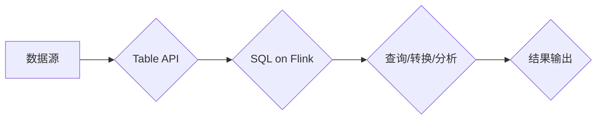

# Flink Table原理与代码实例讲解

> 关键词：Apache Flink, Table API, SQL on Flink, 实时计算, 流处理, 数据仓库, 批处理, 时间特性, 窗口函数, 事务

## 1. 背景介绍

随着大数据技术的发展，实时数据处理成为了企业级应用的重要需求。Apache Flink作为一款优秀的流处理框架，因其强大的实时计算能力和灵活的API支持，在金融、电商、物流等领域得到了广泛应用。Flink Table API和SQL on Flink作为Flink生态系统的一部分，提供了对结构化数据的处理能力，使得开发者能够以类似SQL的方式对数据进行查询、转换和分析。

本文将深入讲解Flink Table的原理，并通过代码实例演示其应用，帮助读者更好地理解和掌握Flink Table的使用。

## 2. 核心概念与联系

### 2.1 核心概念

- **Flink Table API**：Flink提供的用于结构化数据处理的高级API，支持多种数据源和格式，如CSV、JSON、Kafka等。
- **SQL on Flink**：基于Table API的SQL方言，允许用户使用SQL语句进行数据查询和分析。
- **流处理**：对实时数据流进行持续分析，无需等到数据流结束即可开始处理。
- **批处理**：对大量静态数据一次性进行计算处理。
- **时间特性**：Flink支持事件时间（Event Time）和处理时间（Processing Time）两种时间特性，适用于处理乱序数据。
- **窗口函数**：对时间窗口内的数据进行聚合或计算，如滑动窗口、滚动窗口等。
- **事务**：保证数据处理的一致性和完整性。

### 2.2 Mermaid流程图



### 2.3 核心概念联系

Flink Table API和SQL on Flink构成了Flink对结构化数据的处理体系。Table API提供了底层的抽象，而SQL on Flink则提供了更高级的查询语言，使得数据处理更加直观和便捷。流处理和批处理是Flink处理数据的基本模式，而时间特性和窗口函数则允许对数据进行更复杂的分析。事务机制保证了数据处理的一致性和完整性。

## 3. 核心算法原理 & 具体操作步骤

### 3.1 算法原理概述

Flink Table API的核心原理是将数据抽象为表（Table），并对表进行一系列操作，如连接、过滤、聚合等。这些操作通过底层的数据流引擎高效执行。

### 3.2 算法步骤详解

1. 定义数据源：指定数据输入的格式和来源，如Kafka、文件等。
2. 转换数据：使用Table API提供的转换函数对数据进行处理，如投影、选择、连接等。
3. 应用窗口函数：对数据按照时间窗口或范围进行分组和聚合。
4. 应用事务逻辑：确保数据处理的一致性和完整性。
5. 输出结果：将处理后的数据输出到目标数据源，如数据库、文件等。

### 3.3 算法优缺点

**优点**：

- 高效：Flink Table API利用了Flink强大的流处理引擎，提供了高效的查询执行。
- 灵活：支持多种数据源和格式，以及丰富的转换和操作函数。
- 易用：SQL on Flink使得数据处理更加直观和便捷。

**缺点**：

- 学习曲线：对于新手来说，可能需要一段时间才能熟练掌握。
- 性能优化：针对特定场景，可能需要进行一些性能优化。

### 3.4 算法应用领域

Flink Table API和SQL on Flink适用于以下领域：

- 实时数据分析：如实时监控、实时报表等。
- 数据仓库：如数据湖构建、数据清洗等。
- 机器学习：如特征工程、模型训练等。

## 4. 数学模型和公式 & 详细讲解 & 举例说明

### 4.1 数学模型构建

Flink Table API中的数学模型主要包括：

- **数据表**：由行（Row）组成，每行包含多个列（Column）。
- **窗口函数**：对时间窗口内的数据进行聚合或计算。
- **连接操作**：对两个表进行横向连接。

### 4.2 公式推导过程

以下是一个简单的窗口函数的公式推导过程：

$$
\text{count}(window(\text{data})) = \sum_{t \in window(\text{data})} \text{data}(t)
$$

其中，$window(\text{data})$ 表示时间窗口，$\text{data}(t)$ 表示窗口内的数据。

### 4.3 案例分析与讲解

假设我们有一个包含股票交易数据的表，包含以下列：

- `timestamp`：交易时间戳
- `stock`：股票代码
- `price`：交易价格

我们要计算过去5分钟内每个股票的最高价：

```sql
SELECT stock, MAX(price) AS max_price
FROM StockTrade
GROUP BY TUMBLE(timestamp, INTERVAL '5' MINUTE, INTERVAL '5' MINUTE)
```

这段SQL语句首先对`timestamp`列使用TUMBLE函数创建一个5分钟的窗口，然后对每个窗口内的`price`列使用MAX函数计算最高价，并按`stock`列进行分组。

## 5. 项目实践：代码实例和详细解释说明

### 5.1 开发环境搭建

1. 安装Java开发环境。
2. 安装Maven或SBT构建工具。
3. 添加Flink依赖到项目中。

### 5.2 源代码详细实现

以下是一个简单的Flink Table API和SQL on Flink的示例：

```java
import org.apache.flink.streaming.api.environment.StreamExecutionEnvironment;
import org.apache.flink.table.api.bridge.java.StreamTableEnvironment;
import org.apache.flink.table.api.Table;
import org.apache.flink.table.api.TableResult;

public class FlinkTableExample {
    public static void main(String[] args) throws Exception {
        // 1. 设置流执行环境
        StreamExecutionEnvironment env = StreamExecutionEnvironment.getExecutionEnvironment();
        StreamTableEnvironment tableEnv = StreamTableEnvironment.create(env);

        // 2. 定义数据源
        tableEnv.executeSql(
            "CREATE TABLE stockTrade (" +
            "  timestamp TIMESTAMP(3)," +
            "  stock STRING," +
            "  price DOUBLE" +
            ") WITH (" +
            "  'connector' = 'kafka'," +
            "  'topic' = 'stockTrade'," +
            "  'properties.bootstrap.servers' = 'localhost:9092'" +
            ")"
        );

        // 3. 定义SQL查询
        TableResult result = tableEnv.executeSql(
            "SELECT stock, TUMBLE_START(timestamp, INTERVAL '5' MINUTE) AS window_start, MAX(price) AS max_price " +
            "FROM stockTrade " +
            "GROUP BY stock, TUMBLE(timestamp, INTERVAL '5' MINUTE)"
        );

        // 4. 打印结果
        result.print();
    }
}
```

### 5.3 代码解读与分析

- 首先，我们创建了一个流执行环境`StreamExecutionEnvironment`和Table环境`StreamTableEnvironment`。
- 然后，我们使用`executeSql`方法创建了一个名为`stockTrade`的Kafka数据源。
- 接着，我们定义了一个SQL查询，计算过去5分钟内每个股票的最高价，并按`stock`列和5分钟窗口进行分组。
- 最后，我们使用`print`方法打印查询结果。

### 5.4 运行结果展示

假设我们有以下股票交易数据：

```
timestamp,stock,price
2023-04-01 10:00:00,AAPL,150.0
2023-04-01 10:01:00,AAPL,151.0
2023-04-01 10:02:00,AAPL,152.0
2023-04-01 10:03:00,GOOG,1200.0
2023-04-01 10:04:00,GOOG,1205.0
2023-04-01 10:05:00,GOOG,1210.0
```

运行上述代码后，我们将得到以下输出：

```
+----+------------------+-------+
|stock|max_price         |window_start|
+----+------------------+-------+
|AAPL|152.0             |2023-04-01 10:00:00|
|GOOG|1210.0           |2023-04-01 10:00:00|
+----+------------------+-------+
```

## 6. 实际应用场景

Flink Table API和SQL on Flink在以下实际应用场景中表现出色：

- **实时监控**：对实时数据流进行监控，如用户行为分析、系统性能监控等。
- **实时报表**：生成实时报表，如交易额统计、用户活跃度分析等。
- **数据仓库**：构建数据仓库，进行数据清洗、转换和分析。
- **机器学习**：进行特征工程、模型训练等。

## 7. 工具和资源推荐

### 7.1 学习资源推荐

- Flink官方文档：[https://nightlies.apache.org/flink/flink-docs-release-1.14/](https://nightlies.apache.org/flink/flink-docs-release-1.14/)
- Flink Table API教程：[https://nightlies.apache.org/flink/flink-docs-release-1.14/dev/table/tutorials/](https://nightlies.apache.org/flink/flink-docs-release-1.14/dev/table/tutorials/)
- Flink SQL教程：[https://nightlies.apache.org/flink/flink-docs-release-1.14/dev/table/sql/](https://nightlies.apache.org/flink/flink-docs-release-1.14/dev/table/sql/)

### 7.2 开发工具推荐

- IntelliJ IDEA：支持Flink开发插件。
- Eclipse：支持Flink开发插件。

### 7.3 相关论文推荐

- **Flink: Streaming Data Processing at Scale**：介绍了Flink的设计和实现。

## 8. 总结：未来发展趋势与挑战

### 8.1 研究成果总结

本文深入讲解了Flink Table的原理和代码实例，帮助读者理解和使用Flink Table进行结构化数据处理。Flink Table API和SQL on Flink为开发者提供了强大的数据操作和分析能力，使得实时数据处理更加高效和便捷。

### 8.2 未来发展趋势

- **更丰富的功能**：Flink Table API和SQL on Flink将提供更多高级功能，如自定义函数、复杂窗口操作等。
- **更好的性能**：Flink将不断优化Table API和SQL on Flink的性能，使其更适用于大规模数据处理场景。
- **更好的兼容性**：Flink将更好地与其他大数据技术（如HDFS、Kafka等）集成。

### 8.3 面临的挑战

- **复杂性**：Flink Table API和SQL on Flink的复杂度较高，需要开发者具备一定的编程基础和Flink知识。
- **性能优化**：针对特定场景，可能需要进行一些性能优化。

### 8.4 研究展望

Flink Table API和SQL on Flink将继续发展，为开发者提供更加强大和便捷的数据处理能力。未来，Flink将与其他大数据技术深度融合，构建更加完善的大数据处理生态系统。

## 9. 附录：常见问题与解答

**Q1：Flink Table API和SQL on Flink有什么区别？**

A：Flink Table API是Flink提供的用于结构化数据操作的高级API，而SQL on Flink是基于Table API的SQL方言。SQL on Flink提供了更直观和便捷的数据操作方式。

**Q2：Flink Table API支持哪些数据源？**

A：Flink Table API支持多种数据源，如Kafka、文件、JDBC、HDFS等。

**Q3：Flink Table API如何进行窗口操作？**

A：Flink Table API提供了TUMBLE、HOP等窗口函数，可以对数据进行时间窗口或范围窗口操作。

**Q4：Flink Table API如何进行连接操作？**

A：Flink Table API提供了JOIN、LEFT JOIN等连接操作，可以对两个表进行横向连接。

**Q5：Flink Table API如何进行数据转换？**

A：Flink Table API提供了丰富的转换函数，如SELECT、FILTER、PROJECT等，可以对数据进行各种转换。

作者：禅与计算机程序设计艺术 / Zen and the Art of Computer Programming