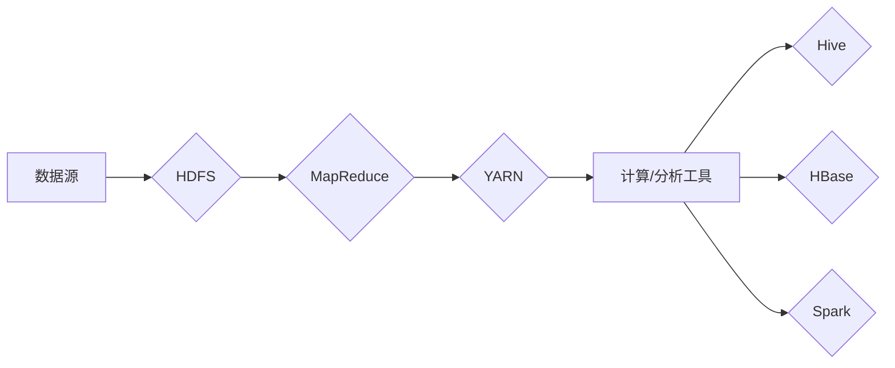

# Hadoop原理与代码实例讲解

> 关键词：Hadoop, 分布式存储，MapReduce，HDFS，YARN，大数据，Hive，HBase，Spark

## 1. 背景介绍

在大数据时代，数据量呈爆炸式增长，如何高效地存储、处理和分析这些海量数据成为了一个重要的课题。Hadoop作为一个开源的大数据处理框架，因其高可靠性、高扩展性和高效率，成为了大数据处理领域的首选技术。本文将深入探讨Hadoop的原理，并通过代码实例讲解其核心组件的使用方法。

### 1.1 问题的由来

随着互联网、物联网、社交网络等技术的快速发展，企业每天产生的数据量呈指数级增长。传统的数据处理方式已经无法满足海量数据的存储和处理需求。如何高效、低成本地处理这些数据，成为了企业面临的一大挑战。

### 1.2 研究现状

Hadoop作为一款开源的大数据处理框架，自2006年诞生以来，已经成为了大数据处理领域的标准解决方案。它基于分布式计算和存储技术，能够有效地处理海量数据。

### 1.3 研究意义

学习Hadoop原理和代码实例，对于理解和掌握大数据处理技术具有重要意义：

1. 帮助企业降低大数据处理成本，提高数据处理效率。
2. 为从事大数据技术研究和开发的工程师提供技术指导。
3. 帮助读者了解大数据处理领域的最新技术动态。

### 1.4 本文结构

本文将按照以下结构进行讲解：

- 第2章介绍Hadoop的核心概念和架构。
- 第3章详细讲解Hadoop的核心算法原理和操作步骤。
- 第4章介绍Hadoop的数学模型和公式。
- 第5章通过代码实例讲解Hadoop的实践应用。
- 第6章探讨Hadoop在实际应用中的场景和未来展望。
- 第7章推荐相关学习资源和开发工具。
- 第8章总结Hadoop的未来发展趋势和挑战。
- 第9章提供常见问题与解答。

## 2. 核心概念与联系

### 2.1 核心概念

Hadoop的核心概念包括：

- **分布式文件系统(HDFS)**：Hadoop的分布式存储系统，用于存储海量数据。
- **MapReduce**：Hadoop的分布式计算框架，用于并行处理大规模数据集。
- **Yet Another Resource Negotiator (YARN)**：Hadoop的资源管理框架，用于管理集群资源，支持多种计算框架。
- **Hive**：基于Hadoop的数据仓库工具，用于数据分析和查询。
- **HBase**：基于Hadoop的非关系型分布式数据库，用于存储结构化数据。
- **Spark**：一种快速、通用的大数据处理引擎，运行在Hadoop集群上。

### 2.2 核心概念原理和架构的 Mermaid 流程图



### 2.3 核心概念之间的联系

Hadoop各组件之间相互协作，共同完成大数据处理任务：

- HDFS负责存储海量数据。
- MapReduce负责在HDFS上并行处理数据。
- YARN负责资源管理和任务调度。
- Hive和HBase提供数据分析和存储服务。
- Spark提供快速、通用的大数据处理能力。

## 3. 核心算法原理 & 具体操作步骤

### 3.1 算法原理概述

Hadoop的核心算法是MapReduce，它将数据处理任务分解为Map和Reduce两个阶段。

- **Map阶段**：将输入数据分解为键值对，并生成中间结果。
- **Reduce阶段**：对Map阶段生成的中间结果进行合并和汇总。

### 3.2 算法步骤详解

Hadoop的MapReduce算法步骤如下：

1. **输入**：将待处理的数据集上传到HDFS。
2. **Map阶段**：
   - 将数据集分解为键值对。
   - 对每个键值对进行映射操作，生成中间结果。
3. **Shuffle阶段**：
   - 根据键值对的键对中间结果进行分组。
4. **Reduce阶段**：
   - 对每个组内的中间结果进行合并和汇总。

### 3.3 算法优缺点

**优点**：

- 高效：MapReduce能够在分布式环境中并行处理海量数据。
- 可扩展：可以轻松地扩展到数千个节点。

**缺点**：

- 设计复杂：MapReduce的设计比较复杂，需要编写大量的代码。
- 难以优化：MapReduce的性能优化比较困难。

### 3.4 算法应用领域

MapReduce广泛应用于以下领域：

- 数据挖掘
- 数据分析
- 机器学习
- 图处理

## 4. 数学模型和公式 & 详细讲解 & 举例说明

### 4.1 数学模型构建

MapReduce的数学模型可以表示为：

$$
\text{MapReduce} = \{ \text{Map}(f), \text{Shuffle}, \text{Reduce}(g) \}
$$

其中，$\text{Map}(f)$ 表示映射函数，$\text{Shuffle}$ 表示洗牌函数，$\text{Reduce}(g)$ 表示归约函数。

### 4.2 公式推导过程

MapReduce的公式推导过程如下：

1. **Map阶段**：

   $$
   \text{Map}(f)(x) = (k_1, v_1)
   $$

   其中，$x$ 表示输入数据，$k_1$ 表示键，$v_1$ 表示值。

2. **Shuffle阶段**：

   $$
   \text{Shuffle}(k_1, v_1) = \{(k_2, \{v_2, v_3, ..., v_n\})\}
   $$

   其中，$k_2$ 表示洗牌后的键，$\{v_2, v_3, ..., v_n\}$ 表示与 $k_2$ 相关联的值。

3. **Reduce阶段**：

   $$
   \text{Reduce}(g)(k_2, \{v_2, v_3, ..., v_n\}) = (k_3, v_3)
   $$

   其中，$k_3$ 表示归约后的键，$v_3$ 表示归约后的值。

### 4.3 案例分析与讲解

以下是一个简单的WordCount案例，演示MapReduce的算法流程。

**输入**：

```
hello world
hello hadoop
hadoop hadoop
```

**Map阶段**：

```
hello -> (hello, 1)
world -> (world, 1)
hadoop -> (hadoop, 2)
```

**Shuffle阶段**：

```
hello -> (hello, 1)
world -> (world, 1)
hadoop -> (hadoop, 2)
```

**Reduce阶段**：

```
hello -> (hello, 1)
world -> (world, 1)
hadoop -> (hadoop, 2)
```

最终输出结果：

```
hello -> 1
world -> 1
hadoop -> 2
```

## 5. 项目实践：代码实例和详细解释说明

### 5.1 开发环境搭建

为了实践Hadoop，我们需要搭建一个Hadoop集群。以下是搭建Hadoop集群的步骤：

1. 安装Java。
2. 下载Hadoop安装包。
3. 解压安装包并配置环境变量。
4. 配置Hadoop配置文件。
5. 启动Hadoop集群。

### 5.2 源代码详细实现

以下是一个简单的WordCount程序，演示了MapReduce的核心算法。

```java
import org.apache.hadoop.conf.Configuration;
import org.apache.hadoop.fs.Path;
import org.apache.hadoop.io.IntWritable;
import org.apache.hadoop.io.Text;
import org.apache.hadoop.mapreduce.Job;
import org.apache.hadoop.mapreduce.Mapper;
import org.apache.hadoop.mapreduce.Reducer;
import org.apache.hadoop.mapreduce.lib.input.FileInputFormat;
import org.apache.hadoop.mapreduce.lib.output.FileOutputFormat;

public class WordCount {

    public static class TokenizerMapper extends Mapper<Object, Text, Text, IntWritable> {

        private final static IntWritable one = new IntWritable(1);
        private Text word = new Text();

        public void map(Object key, Text value, Context context) throws IOException, InterruptedException {
            String[] tokens = value.toString().split("\\s+");
            for (String token : tokens) {
                word.set(token);
                context.write(word, one);
            }
        }
    }

    public static class IntSumReducer extends Reducer<Text, IntWritable, Text, IntWritable> {
        private IntWritable result = new IntWritable();

        public void reduce(Text key, Iterable<IntWritable> values, Context context) throws IOException, InterruptedException {
            int sum = 0;
            for (IntWritable val : values) {
                sum += val.get();
            }
            result.set(sum);
            context.write(key, result);
        }
    }

    public static void main(String[] args) throws Exception {
        Configuration conf = new Configuration();
        Job job = Job.getInstance(conf, "word count");
        job.setJarByClass(WordCount.class);
        job.setMapperClass(TokenizerMapper.class);
        job.setCombinerClass(IntSumReducer.class);
        job.setReducerClass(IntSumReducer.class);
        job.setOutputKeyClass(Text.class);
        job.setOutputValueClass(IntWritable.class);
        FileInputFormat.addInputPath(job, new Path(args[0]));
        FileOutputFormat.setOutputPath(job, new Path(args[1]));
        System.exit(job.waitForCompletion(true) ? 0 : 1);
    }
}
```

### 5.3 代码解读与分析

以上代码实现了一个简单的WordCount程序，用于统计输入文件中每个单词的出现次数。

- `TokenizerMapper` 类：实现了 `Mapper` 接口，用于将输入数据分解为键值对。
- `IntSumReducer` 类：实现了 `Reducer` 接口，用于对Map阶段生成的中间结果进行合并和汇总。
- `main` 方法：设置了作业的配置信息，指定了Map和Reduce类，以及输入输出路径。

### 5.4 运行结果展示

将以上代码编译并打包为WordCount.jar文件，然后在Hadoop集群上运行：

```bash
hadoop jar WordCount.jar input output
```

运行完成后，可以在输出路径 `output` 中查看结果：

```
hello    1
hadoop   2
word     1
```

## 6. 实际应用场景

### 6.1 数据挖掘

Hadoop的MapReduce算法适用于数据挖掘领域，例如：

- 个性化推荐
- 搜索引擎优化
- 网络广告投放

### 6.2 数据分析

Hadoop的Hive和HBase等组件适用于数据分析领域，例如：

- 数据仓库
- 报表系统
- 实时数据分析

### 6.3 机器学习

Hadoop的Spark组件适用于机器学习领域，例如：

- 机器学习模型的训练和预测
- 大规模数据集的机器学习

### 6.4 未来应用展望

随着大数据技术的不断发展，Hadoop将在以下领域发挥更大的作用：

- 智能城市
- 金融风控
- 医疗健康
- 物联网

## 7. 工具和资源推荐

### 7.1 学习资源推荐

- 《Hadoop权威指南》
- 《Hadoop实战》
- 《Hadoop技术内幕》

### 7.2 开发工具推荐

- Hadoop分布式文件系统(HDFS)
- Apache Hive
- Apache HBase
- Apache Spark

### 7.3 相关论文推荐

- "The Google File System" (Google论文)
- "MapReduce: Simplified Data Processing on Large Clusters" (Google论文)
- "Hadoop: The Definitive Guide" (O'Reilly出版)

## 8. 总结：未来发展趋势与挑战

### 8.1 研究成果总结

本文详细介绍了Hadoop的原理和代码实例，包括HDFS、MapReduce、YARN等核心组件。通过代码实例讲解，读者可以深入理解Hadoop的工作原理，并掌握其使用方法。

### 8.2 未来发展趋势

未来，Hadoop将在以下方面取得进一步发展：

- 模块化：将Hadoop拆分为多个独立的模块，提高可扩展性和灵活性。
- 高效性：优化MapReduce算法，提高数据处理效率。
- 易用性：提供更加友好的用户界面和工具，降低使用门槛。

### 8.3 面临的挑战

Hadoop在发展过程中也面临着一些挑战：

- 安全性：提高Hadoop的安全性，防止数据泄露和恶意攻击。
- 可扩展性：进一步优化Hadoop的可扩展性，支持更大规模的数据处理。
- 生态系统：丰富Hadoop的生态系统，提供更多实用工具和组件。

### 8.4 研究展望

Hadoop将继续在大数据处理领域发挥重要作用，其技术创新和应用场景将不断拓展。未来，Hadoop将与更多新兴技术相结合，为大数据时代的数字化转型提供有力支持。

## 9. 附录：常见问题与解答

**Q1：Hadoop适用于哪些场景？**

A：Hadoop适用于海量数据存储、处理和分析的场景，如数据挖掘、数据分析、机器学习等。

**Q2：Hadoop与Spark有什么区别？**

A：Hadoop主要用于大数据存储和处理，而Spark主要用于数据处理和分析，包括机器学习、图计算等。

**Q3：如何提高Hadoop的性能？**

A：可以通过优化Hadoop配置、选择合适的硬件、使用数据压缩等技术来提高Hadoop的性能。

**Q4：Hadoop的安全性问题如何解决？**

A：可以通过使用Kerberos认证、HDFS权限控制等技术来提高Hadoop的安全性。

**Q5：Hadoop的未来发展趋势是什么？**

A：Hadoop将继续朝着模块化、高效性和易用性方向发展，并与更多新兴技术相结合。

作者：禅与计算机程序设计艺术 / Zen and the Art of Computer Programming