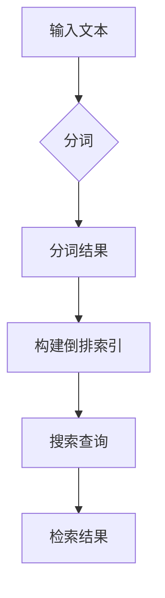

# Lucene分词原理与代码实例讲解

> 关键词：Lucene，分词，文本处理，搜索引擎，倒排索引，Jieba，中文分词

## 1. 背景介绍

随着互联网的快速发展，信息量的爆炸式增长，搜索引擎成为了人们获取信息的重要工具。而分词作为搜索引擎处理文本数据的第一步，其质量直接影响着搜索结果的准确性。Lucene是一个高性能、可扩展的全文搜索引擎库，它提供了强大的文本搜索和处理能力。本文将深入探讨Lucene分词的原理，并通过代码实例进行详细讲解。

## 2. 核心概念与联系

### 2.1 Lucene简介

Lucene是一个高性能的全文搜索库，由Apache Software Foundation维护。它提供了全文检索的核心功能，包括索引构建、搜索查询和结果排序等。Lucene的核心是倒排索引，它将文档中的词语与文档ID进行映射，从而实现快速检索。

### 2.2 分词的概念

分词是将连续的文本分割成有意义的词汇或短语的 process。在搜索引擎中，分词是文本处理的第一步，它将文本分割成关键词，以便建立倒排索引。

### 2.3 Mermaid 流程图



### 2.4 Lucene与分词的联系

Lucene本身不包含分词器，但它提供了丰富的API接口，可以集成不同的分词器。常用的中文分词器有Jieba、HanLP等。

## 3. 核心算法原理 & 具体操作步骤

### 3.1 算法原理概述

Lucene分词主要分为以下几个步骤：

1. 将文本输入到分词器中。
2. 分词器将文本分割成关键词。
3. 将关键词与文档ID进行映射，构建倒排索引。
4. 搜索查询时，通过倒排索引快速定位相关文档。

### 3.2 算法步骤详解

1. **分词**：将文本分割成关键词。
2. **索引构建**：将关键词与文档ID进行映射，构建倒排索引。
3. **搜索查询**：通过倒排索引查找匹配的关键词，返回相关文档。

### 3.3 算法优缺点

**优点**：

- **高性能**：Lucene提供了高效的文本索引和搜索功能。
- **可扩展性**：Lucene支持多种分词器，可以根据需求进行定制。
- **灵活性**：Lucene支持多种搜索查询语法，如布尔查询、短语查询等。

**缺点**：

- **分词器依赖**：Lucene本身不包含分词器，需要集成第三方分词器。
- **复杂性**：Lucene的API相对复杂，需要一定的学习成本。

### 3.4 算法应用领域

Lucene广泛应用于各种搜索引擎、信息检索系统、文本分析工具等。

## 4. 数学模型和公式 & 详细讲解 & 举例说明

### 4.1 数学模型构建

Lucene的倒排索引可以表示为：

$$
\text{倒排索引} = \{(w_1, d_1), (w_2, d_2), ..., (w_n, d_n)\}
$$

其中 $w_i$ 表示关键词，$d_i$ 表示包含关键词 $w_i$ 的文档ID。

### 4.2 公式推导过程

假设有N个文档，每个文档包含M个关键词，则倒排索引的大小为 $O(N \times M)$。

### 4.3 案例分析与讲解

以下是一个简单的Lucene分词和搜索的实例：

```java
// 创建索引
IndexWriter indexWriter = new IndexWriter(indexDirectory);
Document doc = new Document();
doc.add(new TextField("content", "The quick brown fox jumps over the lazy dog", Field.Store.YES));
indexWriter.addDocument(doc);
indexWriter.close();

// 搜索
IndexReader indexReader = DirectoryReader.open(indexDirectory);
IndexSearcher indexSearcher = new IndexSearcher(indexReader);
QueryParser queryParser = new QueryParser("content", new StandardAnalyzer());
Query query = queryParser.parse("quick brown");
TopDocs topDocs = indexSearcher.search(query, 10);
ScoreDoc[] hits = topDocs.scoreDocs;
for (ScoreDoc hit : hits) {
    Document hitDoc = indexSearcher.doc(hit.doc);
    System.out.println("Found document " + hit.doc + " with title \"" + hitDoc.get("content") + "\"");
}
indexReader.close();
```

## 5. 项目实践：代码实例和详细解释说明

### 5.1 开发环境搭建

1. 安装Java开发环境。
2. 添加Lucene依赖。

```xml
<dependency>
    <groupId>org.apache.lucene</groupId>
    <artifactId>lucene-core</artifactId>
    <version>8.11.1</version>
</dependency>
```

### 5.2 源代码详细实现

以下是一个简单的Lucene分词和搜索的Java代码实例：

```java
import org.apache.lucene.analysis.standard.StandardAnalyzer;
import org.apache.lucene.document.Document;
import org.apache.lucene.index.IndexWriter;
import org.apache.lucene.index.IndexWriterConfig;
import org.apache.lucene.search.IndexSearcher;
import org.apache.lucene.search.Query;
import org.apache.lucene.search.QueryParser;
import org.apache.lucene.search.TopDocs;
import org.apache.lucene.store.Directory;
import org.apache.lucene.store.RAMDirectory;

public class LuceneDemo {
    public static void main(String[] args) throws Exception {
        // 创建内存索引
        Directory indexDirectory = new RAMDirectory();
        IndexWriterConfig config = new IndexWriterConfig(new StandardAnalyzer());
        IndexWriter indexWriter = new IndexWriter(indexDirectory, config);

        // 添加文档
        Document doc = new Document();
        doc.add(new TextField("content", "The quick brown fox jumps over the lazy dog", Field.Store.YES));
        indexWriter.addDocument(doc);
        indexWriter.close();

        // 搜索
        DirectoryReader indexReader = DirectoryReader.open(indexDirectory);
        IndexSearcher indexSearcher = new IndexSearcher(indexReader);
        Query query = new QueryParser("content", new StandardAnalyzer()).parse("quick brown");
        TopDocs topDocs = indexSearcher.search(query, 10);
        for (ScoreDoc hit : topDocs.scoreDocs) {
            Document hitDoc = indexSearcher.doc(hit.doc);
            System.out.println("Found document " + hit.doc + " with title \"" + hitDoc.get("content") + "\"");
        }
        indexReader.close();
    }
}
```

### 5.3 代码解读与分析

- 创建一个RAMDirectory作为索引存储。
- 创建IndexWriter配置，指定分词器为StandardAnalyzer。
- 创建IndexWriter实例，向索引中添加文档。
- 创建DirectoryReader和IndexSearcher实例，用于搜索。
- 创建QueryParser实例，解析搜索查询。
- 执行搜索，打印出匹配的文档。

## 6. 实际应用场景

Lucene在各个领域都有广泛的应用，以下是一些常见的应用场景：

- **搜索引擎**：构建企业内部搜索引擎，用于检索文档、邮件等。
- **信息检索系统**：构建信息检索系统，用于检索网页、新闻等。
- **内容管理平台**：构建内容管理平台，用于存储和管理文档。
- **社交媒体分析**：分析社交媒体数据，提取关键词和情感。

## 7. 工具和资源推荐

### 7.1 学习资源推荐

- Lucene官方文档：https://lucene.apache.org/core/8_11_1/
- 《Lucene in Action》：https://www.manning.com/books/lucene-in-action-second-edition

### 7.2 开发工具推荐

- IntelliJ IDEA：https://www.jetbrains.com/idea/
- Eclipse：https://www.eclipse.org/

### 7.3 相关论文推荐

- "The Lucene Library"：https://lucene.apache.org/core/8_11_1/core/_index.html
- "Inverted Indexing for Full-Text Searches"：https://www.cs.tut.fi/~jkivinen/lucene.pdf

## 8. 总结：未来发展趋势与挑战

### 8.1 研究成果总结

本文深入讲解了Lucene分词的原理，并通过代码实例进行了详细讲解。Lucene是一个高性能、可扩展的全文搜索引擎库，它提供了强大的文本搜索和处理能力。

### 8.2 未来发展趋势

- **多语言支持**：Lucene将继续支持更多语言的分词器。
- **高性能优化**：Lucene将进一步提高搜索性能和索引构建速度。
- **易用性提升**：Lucene的API将更加简洁易用。

### 8.3 面临的挑战

- **分词精度**：如何提高分词精度，减少错分和漏分。
- **多语言支持**：如何支持更多语言的分词器。
- **性能优化**：如何进一步提高搜索性能和索引构建速度。

### 8.4 研究展望

Lucene将继续发展，为用户提供更好的文本搜索和处理能力。未来，Lucene可能会与其他人工智能技术结合，构建更加智能的搜索引擎。

## 9. 附录：常见问题与解答

**Q1：什么是Lucene？**

A：Lucene是一个高性能、可扩展的全文搜索引擎库，由Apache Software Foundation维护。

**Q2：什么是分词？**

A：分词是将连续的文本分割成有意义的词汇或短语的 process。

**Q3：Lucene如何工作？**

A：Lucene通过构建倒排索引来实现文本搜索。倒排索引将关键词与文档ID进行映射，从而实现快速检索。

**Q4：如何使用Lucene进行搜索？**

A：使用Lucene进行搜索需要创建索引、执行查询并解析结果。

**Q5：Lucene有哪些优点和缺点？**

A：Lucene的优点包括高性能、可扩展性和灵活性。其缺点包括分词器依赖和复杂性。

---

作者：禅与计算机程序设计艺术 / Zen and the Art of Computer Programming