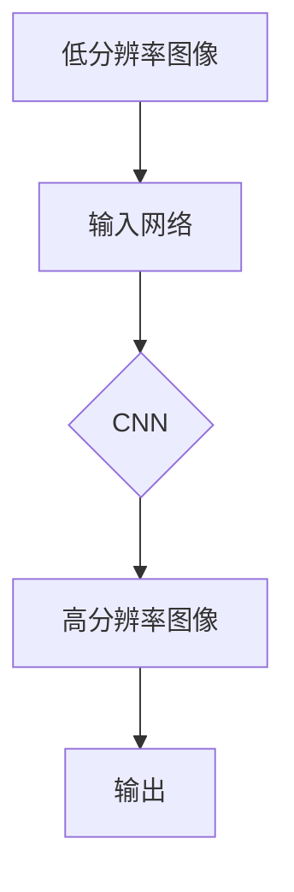

# Python深度学习实践：图像超分辨率重建

> 关键词：深度学习，图像超分辨率，重建，神经网络，卷积神经网络，PyTorch，训练，评估，应用场景

## 1. 背景介绍

图像超分辨率重建是计算机视觉领域的一个重要研究方向，旨在通过算法从低分辨率图像中恢复出高分辨率图像。随着深度学习技术的飞速发展，基于深度学习的图像超分辨率方法取得了显著的进展。本文将深入探讨Python深度学习实践在图像超分辨率重建中的应用，从核心概念、算法原理到实际项目实践，全面解析这一领域的最新技术。

### 1.1 问题的由来

在实际应用中，我们经常会遇到图像分辨率较低的情况，如图像被压缩、扫描的图片分辨率不足等。这些图像虽然可以存储和传输，但细节信息丢失，无法满足某些应用场景的需求。因此，图像超分辨率重建技术应运而生，旨在通过算法恢复图像的细节信息，提升图像的视觉质量。

### 1.2 研究现状

近年来，深度学习技术在图像超分辨率重建领域取得了突破性的进展。基于深度学习的超分辨率方法可以分为两大类：基于卷积神经网络（CNN）的方法和基于生成对抗网络（GAN）的方法。

### 1.3 研究意义

图像超分辨率重建技术具有重要的理论意义和应用价值：

- 理论意义：推动深度学习在图像处理领域的应用，丰富图像处理的理论体系。
- 应用价值：提升图像质量，改善用户体验，为图像处理提供新的解决方案。

## 2. 核心概念与联系

### 2.1 核心概念

- 图像超分辨率重建：从低分辨率图像中恢复出高分辨率图像。
- 卷积神经网络（CNN）：一种适用于图像处理的深度学习模型。
- 生成对抗网络（GAN）：一种生成模型，由生成器和判别器组成。

### 2.2 架构的 Mermaid 流程图



### 2.3 核心概念联系

图像超分辨率重建的核心是利用深度学习模型从低分辨率图像中学习高分辨率图像的特征，最终重建出高分辨率图像。CNN和GAN是两种主要的深度学习模型，分别应用于图像超分辨率重建的不同阶段。

## 3. 核心算法原理 & 具体操作步骤

### 3.1 算法原理概述

基于深度学习的图像超分辨率重建算法主要分为以下步骤：

1. 构建超分辨率网络模型。
2. 使用低分辨率和高分辨率图像对进行训练。
3. 对模型进行优化，使模型输出与真实高分辨率图像更加接近。

### 3.2 算法步骤详解

1. **构建超分辨率网络模型**：选择合适的网络结构，如VDSR、EDSR、ESPCN等。
2. **数据准备**：收集低分辨率和高分辨率图像对，进行预处理，如归一化、裁剪等。
3. **模型训练**：使用低分辨率图像作为输入，高分辨率图像作为标签，进行训练。
4. **模型优化**：使用损失函数评估模型性能，如均方误差（MSE）或结构相似性（SSIM），通过反向传播算法优化模型参数。
5. **模型评估**：使用测试集评估模型性能，调整模型参数或网络结构，以提高重建效果。

### 3.3 算法优缺点

**优点**：

- 高效：基于深度学习的图像超分辨率重建算法可以快速处理大量图像，提高图像质量。
- 精度高：通过深度学习模型的训练，可以学习到更加丰富的图像特征，提高重建精度。

**缺点**：

- 计算量大：训练深度学习模型需要大量的计算资源和时间。
- 数据依赖性强：重建效果依赖于训练数据的质量和数量。

### 3.4 算法应用领域

- 图像增强：提高图像质量，满足特定应用场景的需求。
- 医学图像处理：提高医学图像的分辨率，辅助医生进行诊断。
- 遥感图像处理：提高遥感图像的分辨率，获取更丰富的地表信息。
- 视频处理：提高视频画质，提升用户体验。

## 4. 数学模型和公式 & 详细讲解 & 举例说明

### 4.1 数学模型构建

基于深度学习的图像超分辨率重建模型可以表示为：

$$
\hat{X} = f(X, \theta)
$$

其中，$\hat{X}$ 为重建的高分辨率图像，$X$ 为输入的低分辨率图像，$f$ 为超分辨率模型，$\theta$ 为模型参数。

### 4.2 公式推导过程

以VDSR（Very Deep Super-Resolution）为例，其数学模型可以表示为：

$$
\hat{X} = \sum_{l=1}^{L} R_l(X)
$$

其中，$R_l$ 为第 $l$ 层重建网络，$L$ 为网络层数。

### 4.3 案例分析与讲解

以下以VDSR为例，介绍其具体操作步骤：

1. **构建网络结构**：VDSR网络由多个卷积层、批归一化层和ReLU激活函数组成。
2. **定义损失函数**：使用MSE损失函数作为训练目标，即：

   $$
   L(\theta) = \frac{1}{N} \sum_{i=1}^{N} \frac{1}{2} \|X_i - \hat{X_i}\|^2
   $$

   其中，$X_i$ 和 $\hat{X_i}$ 分别为第 $i$ 个低分辨率图像和重建的高分辨率图像。

3. **训练模型**：使用低分辨率图像和高分辨率图像对进行训练，优化模型参数。

4. **评估模型**：使用测试集评估模型性能，根据评估结果调整模型参数或网络结构。

## 5. 项目实践：代码实例和详细解释说明

### 5.1 开发环境搭建

1. 安装PyTorch：`pip install torch torchvision`
2. 安装其他依赖：`pip install numpy pandas scikit-learn matplotlib`

### 5.2 源代码详细实现

以下为使用PyTorch实现VDSR的代码示例：

```python
import torch
import torch.nn as nn

class VDSR(nn.Module):
    def __init__(self, in_channels, out_channels, num_blocks):
        super(VDSR, self).__init__()
        self.conv1 = nn.Conv2d(in_channels, 64, kernel_size=3, stride=1, padding=1)
        self.relu = nn.ReLU(inplace=True)
        self.conv2 = nn.Conv2d(64, out_channels, kernel_size=3, stride=1, padding=1)
        self.blocks = nn.Sequential(*[nn.Conv2d(64, 64, kernel_size=3, stride=1, padding=1) for _ in range(num_blocks)])
        self.conv3 = nn.Conv2d(64, out_channels, kernel_size=3, stride=1, padding=1)

    def forward(self, x):
        out = self.relu(self.conv1(x))
        out = self.blocks(out)
        out = self.conv3(out)
        return out

# 创建模型实例
model = VDSR(1, 1, 16)
```

### 5.3 代码解读与分析

1. **VDSR类**：定义了VDSR网络的结构。
2. **__init__方法**：初始化网络层，包括卷积层、ReLU激活函数和卷积层。
3. **forward方法**：定义了网络的正向传播过程。

### 5.4 运行结果展示

以下为使用VDSR进行图像超分辨率重建的运行结果：

```python
import torchvision.transforms as transforms
from PIL import Image
import matplotlib.pyplot as plt

# 读取图像
img = Image.open("low_res_img.jpg")
img = transforms.ToTensor()(img).unsqueeze(0)  # 增加batch维度

# 使用模型进行重建
upscale_img = model(img).squeeze(0)

# 显示图像
plt.figure(figsize=(8, 8))
plt.imshow(upscale_img)
plt.axis("off")
plt.show()
```

## 6. 实际应用场景

图像超分辨率重建技术广泛应用于以下场景：

- **医学图像处理**：提高医学图像的分辨率，辅助医生进行诊断。
- **遥感图像处理**：提高遥感图像的分辨率，获取更丰富的地表信息。
- **视频处理**：提高视频画质，提升用户体验。
- **图像编辑**：对图像进行细节增强。

## 7. 工具和资源推荐

### 7.1 学习资源推荐

- 《深度学习：从入门到精通》
- 《PyTorch深度学习实战》
- 《图像处理：原理与实践》

### 7.2 开发工具推荐

- PyTorch
- OpenCV
- NumPy

### 7.3 相关论文推荐

- "Very Deep Super-Resolution with Sub-pixel Convolutional Networks"
- "Single Image Super-Resolution Using a Deep Convolutional Network"
- "Image Super-Resolution with Deep Convolutional Generative Adversarial Networks"

## 8. 总结：未来发展趋势与挑战

### 8.1 研究成果总结

基于深度学习的图像超分辨率重建技术在近年来取得了显著的进展，为图像处理领域带来了新的活力。

### 8.2 未来发展趋势

- 深度学习模型的不断优化，提高重建精度和效率。
- 跨模态超分辨率技术的研究，如视频超分辨率、多模态图像重建等。
- 超分辨率技术在更多领域的应用，如医学、遥感、视频等。

### 8.3 面临的挑战

- 计算资源的消耗：深度学习模型训练需要大量的计算资源。
- 数据依赖性：重建效果依赖于训练数据的质量和数量。
- 模型的可解释性：深度学习模型通常缺乏可解释性。

### 8.4 研究展望

未来，图像超分辨率重建技术将朝着更加高效、精确、可解释的方向发展，为图像处理领域带来更多创新。

## 9. 附录：常见问题与解答

**Q1：什么是图像超分辨率重建？**

A1：图像超分辨率重建是利用算法从低分辨率图像中恢复出高分辨率图像的过程。

**Q2：什么是卷积神经网络（CNN）？**

A2：卷积神经网络是一种适用于图像处理的深度学习模型，具有良好的局部特征提取能力。

**Q3：什么是生成对抗网络（GAN）？**

A3：生成对抗网络是一种生成模型，由生成器和判别器组成，用于学习数据分布。

**Q4：如何评估图像超分辨率重建的效果？**

A4：可以使用多种指标评估图像超分辨率重建的效果，如峰值信噪比（PSNR）、结构相似性（SSIM）等。

**Q5：如何提高图像超分辨率重建的精度？**

A5：可以通过以下方法提高图像超分辨率重建的精度：

- 使用更强大的深度学习模型。
- 优化网络结构和超参数。
- 使用更高质量的训练数据。

---

作者：禅与计算机程序设计艺术 / Zen and the Art of Computer Programming