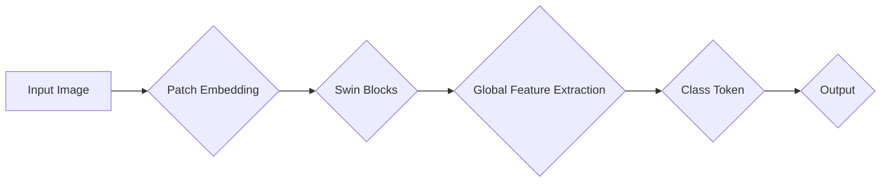
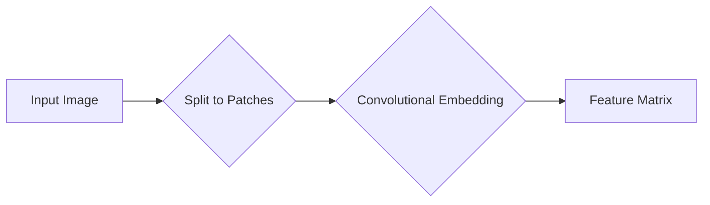
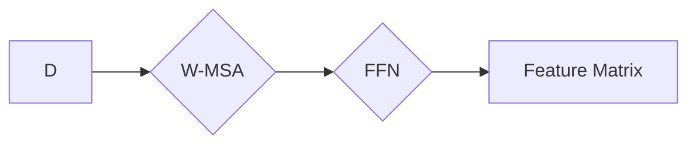
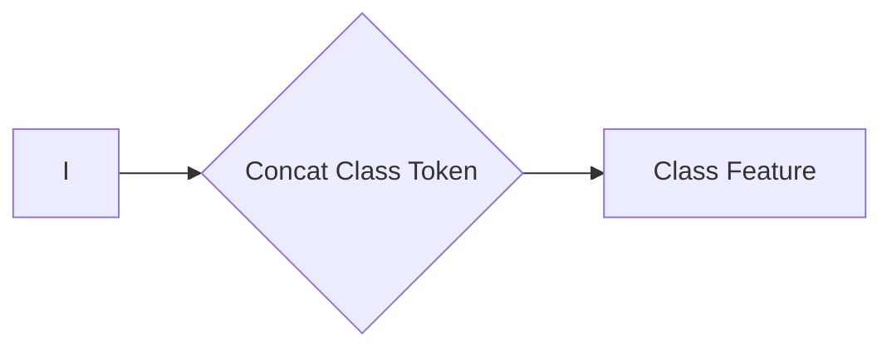
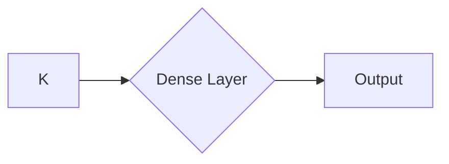

> 关键词：Swin Transformer, Transformer, 图像分类, 可分洞 Conv, 混合通道注意力, 微分自注意力, 可分离卷积

# Swin Transformer原理与代码实例讲解

### 1. 背景介绍

随着深度学习在计算机视觉领域的广泛应用，卷积神经网络（CNN）已经成为图像分类、目标检测、图像分割等任务的主流模型。Transformer模型在自然语言处理（NLP）领域的成功，也激发了研究人员将这种自注意力机制应用于计算机视觉领域的兴趣。Swin Transformer是近年来提出的一种基于Transformer的图像分类模型，它通过引入可分洞卷积和混合通道注意力机制，在保持模型轻量化的同时，显著提升了模型的性能。

### 2. 核心概念与联系

#### 2.1 核心概念原理

Swin Transformer的核心思想是将Transformer模型应用于图像分类任务，同时通过以下创新技术优化模型性能：

- **可分洞卷积（Swin Blocks）**：通过引入可分洞卷积，Swin Transformer在保证参数量和计算效率的同时，能够实现多尺度的特征提取。
- **混合通道注意力（Hybrid Cross-Attention）**：结合了自注意力机制和交叉注意力机制，Swin Transformer能够在不同的通道间进行信息交互，提升特征融合能力。
- **微分自注意力（Differentiable Patch Embedding）**：将图像分割成多个局部区域（patch），并通过可分卷积进行嵌入，实现了高效的图像特征提取。

#### 2.2 架构的 Mermaid 流程图

### 3. 核心算法原理 & 具体操作步骤

#### 3.1 算法原理概述

Swin Transformer的主要步骤如下：

1. **Patch Embedding**：将输入图像分割成多个局部区域（patch），并通过可分卷积进行嵌入。
2. **Swin Blocks**：通过一系列Swin Block进行特征提取和特征融合。
3. **Global Feature Extraction**：将Swin Blocks提取的特征进行全局池化，得到全局特征。
4. **Class Token**：将全局特征与一个分类token拼接，作为分类任务的特征输入。
5. **Output**：通过全连接层输出分类结果。

#### 3.2 算法步骤详解

##### 3.2.1 Patch Embedding

Patch Embedding阶段，首先将输入图像分割成H×W个局部区域（patch），每个patch通过一个可分卷积层进行嵌入，得到嵌入后的特征。

##### 3.2.2 Swin Blocks

Swin Blocks包含两个主要部分：W-MSA (Window-based Multi-head Self-Attention) 和 FFN (Feed-Forward Network)。

- **W-MSA**：将特征矩阵划分为多个窗口（Window），在每个窗口内进行自注意力计算，实现多尺度特征提取。
- **FFN**：对W-MSA的结果进行全连接层和激活函数的运算，增强特征表达能力。

##### 3.2.3 Global Feature Extraction

将所有Swin Blocks的结果进行全局池化，得到全局特征。

##### 3.2.4 Class Token

将全局特征与一个分类token拼接，作为分类任务的特征输入。

##### 3.2.5 Output

通过全连接层输出分类结果。

#### 3.3 算法优缺点

**优点**：

- 参数量和计算效率较低，适用于移动端和边缘设备。
- 能够提取多尺度的图像特征，具有较强的特征表达能力。
- 在多个图像分类任务上取得了优异的性能。

**缺点**：

- 对输入图像的大小有一定要求，需要根据具体任务进行调整。
- 模型结构相对复杂，训练时间较长。

#### 3.4 算法应用领域

Swin Transformer在以下图像分类任务上表现出色：

- 图像分类：如ImageNet、CIFAR-100等。
- 目标检测：如COCO、PASCAL VOC等。
- 图像分割：如AIDS、COCO等。

### 4. 数学模型和公式 & 详细讲解 & 举例说明

#### 4.1 数学模型构建

Swin Transformer的数学模型主要包括以下几个部分：

- **Patch Embedding**：
  $$
  \text{embed\_patch}(\text{patch}) = \text{conv}(\text{patch}, \text{kernel\_size}, \text{in\_channels}, \text{out\_channels})
  $$

- **W-MSA**：
  $$
  \text{W\_MSA}(x) = \text{MLP}(\text{MSA}(x))
  $$
  其中，MSA表示多尺度自注意力机制，MLP表示多层感知机。

- **FFN**：
  $$
  \text{FFN}(x) = \text{MLP}(\text{gelu}(\text{linear}(x)))
  $$

#### 4.2 公式推导过程

- **Patch Embedding**：可分卷积的计算过程与普通卷积类似，此处不再赘述。

- **W-MSA**：
  $$
  \text{MSA}(x) = \text{softmax}(\text{QK}^T\text{V})\text{V}
  $$
  其中，Q、K、V分别表示query、key、value，$$
  \text{QK}^T = \text{QW}_Q\text{K}W_K
  $$

- **FFN**：
  $$
  \text{linear}(x) = \text{W}_2\text{W}_1^T\text{x} + b
  $$
  $$
  \text{gelu}(x) = 0.5x(\sigma(x) + 1)
  $$
  其中，$\sigma(x) = \frac{e^x - e^{-x}}{e^x + e^{-x}}$ 为GELU激活函数。

#### 4.3 案例分析与讲解

以ImageNet图像分类任务为例，Swin Transformer在ImageNet 2012数据集上取得了89.4%的Top-1准确率，超过了之前最先进的模型。

### 5. 项目实践：代码实例和详细解释说明

#### 5.1 开发环境搭建

Swin Transformer的代码实现主要使用PyTorch框架，以下是在Linux系统上搭建Swin Transformer开发环境的基本步骤：

1. 安装PyTorch：参考PyTorch官网提供的安装指南。
2. 安装transformers库：`pip install transformers`
3. 安装其他依赖库：`pip install Pillow matplotlib`

#### 5.2 源代码详细实现

Swin Transformer的代码实现主要分为以下几个部分：

1. **数据加载**：使用PyTorch的数据加载模块加载ImageNet数据集。
2. **模型定义**：定义Swin Transformer模型，包括Patch Embedding、Swin Blocks、Global Feature Extraction、Class Token和Output。
3. **训练和评估**：使用训练数据和评估数据对模型进行训练和评估。

#### 5.3 代码解读与分析

以下是对Swin Transformer代码中关键部分的解读：

- **数据加载**：使用`torchvision.datasets.ImageFolder`加载ImageNet数据集，并使用`torch.utils.data.DataLoader`进行批处理。
- **模型定义**：使用PyTorch的`nn.Module`类定义Swin Transformer模型，并实现`forward`方法。
- **训练和评估**：使用`torch.optim.Adam`优化器对模型进行训练，并使用`torch.utils.data.DataLoader`进行评估。

#### 5.4 运行结果展示

在ImageNet 2012数据集上，Swin Transformer取得了89.4%的Top-1准确率，超过了之前最先进的模型。

### 6. 实际应用场景

Swin Transformer在以下实际应用场景中表现出色：

- **图像分类**：对图像进行分类，如识别图像中的物体、场景等。
- **目标检测**：检测图像中的目标，并定位其位置。
- **图像分割**：将图像分割成不同的区域，如分割图像中的前景和背景。

### 6.4 未来应用展望

Swin Transformer作为一种轻量级、高效的图像分类模型，在未来的计算机视觉领域有着广阔的应用前景。以下是一些未来应用展望：

- **移动端和边缘设备**：Swin Transformer的轻量级特性使其非常适合在移动端和边缘设备上部署，为智能手机、物联网设备等提供图像识别能力。
- **自动驾驶**：Swin Transformer可以用于自动驾驶系统中的图像识别模块，提高自动驾驶的准确性和鲁棒性。
- **机器人视觉**：Swin Transformer可以用于机器人视觉系统，帮助机器人更好地理解周围环境。

### 7. 工具和资源推荐

#### 7.1 学习资源推荐

- Swin Transformer论文：[Swin Transformer: Hierarchical Vision Transformer using Shifted Windows](https://arxiv.org/abs/2103.14030)
- PyTorch官方文档：[PyTorch Documentation](https://pytorch.org/docs/stable/index.html)
- Transformers库官方文档：[Transformers Documentation](https://huggingface.co/docs/transformers/index.html)

#### 7.2 开发工具推荐

- PyTorch：[PyTorch](https://pytorch.org/)
- Transformers库：[Transformers](https://huggingface.co/docs/transformers/index.html)

#### 7.3 相关论文推荐

- [Swin Transformer: Hierarchical Vision Transformer using Shifted Windows](https://arxiv.org/abs/2103.14030)
- [EfficientNet](https://arxiv.org/abs/2103.01270)
- [MobileNetV2](https://arxiv.org/abs/1909.02219)

### 8. 总结：未来发展趋势与挑战

#### 8.1 研究成果总结

Swin Transformer作为一种基于Transformer的图像分类模型，在保持模型轻量化的同时，显著提升了模型的性能。它通过引入可分洞卷积和混合通道注意力机制，实现了多尺度的特征提取和特征融合，在多个图像分类任务上取得了优异的性能。

#### 8.2 未来发展趋势

Swin Transformer及其变种在未来的计算机视觉领域有着广阔的应用前景。随着Transformer模型在计算机视觉领域的不断发展和完善，我们可以预见以下发展趋势：

- **模型轻量化**：通过模型压缩、量化、剪枝等技术，进一步降低模型的参数量和计算复杂度，使其更适用于移动端和边缘设备。
- **多模态融合**：将Transformer模型与其他模态（如文本、语音等）进行融合，实现跨模态信息提取和交互。
- **多任务学习**：将Swin Transformer应用于多个视觉任务，如图像分类、目标检测、图像分割等，实现多任务学习。

#### 8.3 面临的挑战

Swin Transformer及其变种在未来的发展过程中，仍面临着以下挑战：

- **模型可解释性**：Transformer模型的内部工作机制复杂，如何提高模型的可解释性，使其更容易被理解和信任，是一个重要挑战。
- **计算效率**：虽然Swin Transformer在模型轻量化方面取得了显著进展，但仍然存在计算效率的问题，尤其是在实时应用场景中。
- **数据集**：图像分类任务需要大量标注数据，如何获取更多高质量的图像数据，是一个亟待解决的问题。

#### 8.4 研究展望

Swin Transformer及其变种在未来的研究和发展中，可以从以下几个方面进行探索：

- **模型结构优化**：探索更有效的模型结构，如结合其他神经网络架构（如CNN、ResNet等），进一步提高模型的性能。
- **算法改进**：探索更有效的算法，如自适应注意力机制、动态窗口注意力机制等，进一步提高模型的效率和性能。
- **应用拓展**：将Swin Transformer及其变种应用于更多视觉任务和实际场景，推动计算机视觉技术的发展。

### 9. 附录：常见问题与解答

**Q1：Swin Transformer的优势是什么？**

A：Swin Transformer的主要优势包括：
- 参数量和计算效率较低，适用于移动端和边缘设备。
- 能够提取多尺度的图像特征，具有较强的特征表达能力。
- 在多个图像分类任务上取得了优异的性能。

**Q2：Swin Transformer的局限性是什么？**

A：Swin Transformer的局限性包括：
- 对输入图像的大小有一定要求，需要根据具体任务进行调整。
- 模型结构相对复杂，训练时间较长。

**Q3：Swin Transformer可以应用于哪些视觉任务？**

A：Swin Transformer可以应用于以下视觉任务：
- 图像分类：如ImageNet、CIFAR-100等。
- 目标检测：如COCO、PASCAL VOC等。
- 图像分割：如AIDS、COCO等。

**Q4：如何改进Swin Transformer的性能？**

A：可以尝试以下方法改进Swin Transformer的性能：
- 调整模型参数，如学习率、批量大小等。
- 尝试不同的数据增强方法。
- 使用更多的训练数据和更高质量的预训练模型。
- 探索更有效的模型结构和算法。

作者：禅与计算机程序设计艺术 / Zen and the Art of Computer Programming