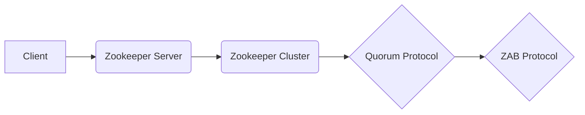

# Zookeeper原理与代码实例讲解

> 关键词：Zookeeper，分布式协调，一致性，集群，ZAB协议，Java API，实践指南

## 1. 背景介绍

Zookeeper 是一个开源的分布式应用程序协调服务，它为分布式应用提供一致性服务。Zookeeper 的设计目标是实现一个简单的原语集，用于构建分布式应用中的锁、队列、命名服务等功能。由于其简单易用、功能强大，Zookeeper 已成为分布式系统的关键技术之一。

### 1.1 问题的由来

随着互联网技术的发展，分布式系统变得越来越流行。在分布式系统中，协调多个节点之间的状态、同步数据以及处理故障等问题变得尤为重要。Zookeeper 提供了一种高效、可靠的解决方案，帮助开发人员解决这些问题。

### 1.2 研究现状

Zookeeper 最初由 Yahoo! 开发，并于 2010 年开源。它使用 ZAB 协议保证数据的一致性和容错性。Zookeeper 的高可用性和可伸缩性使其在分布式系统中得到了广泛的应用。

### 1.3 研究意义

Zookeeper 在分布式系统中的应用具有重要意义：

- 提供分布式锁、队列、发布/订阅等一致性服务。
- 降低分布式系统开发难度，提高开发效率。
- 提高系统可用性和容错性。

### 1.4 本文结构

本文将详细介绍 Zookeeper 的原理、架构、操作步骤以及代码实例。具体结构如下：

- 第二章：核心概念与联系
- 第三章：核心算法原理 & 具体操作步骤
- 第四章：数学模型和公式 & 详细讲解 & 举例说明
- 第五章：项目实践：代码实例和详细解释说明
- 第六章：实际应用场景
- 第七章：工具和资源推荐
- 第八章：总结：未来发展趋势与挑战
- 第九章：附录：常见问题与解答

## 2. 核心概念与联系

Zookeeper 的核心概念包括：

- 节点（Node）：Zookeeper 中的数据存储结构，类似于文件系统中的文件或目录。
- 会话（Session）：客户端与 Zookeeper 集群之间建立的一次连接。
- ZAB 协议：Zookeeper 保证数据一致性的协议。

Zookeeper 的架构图如下：



- Client：客户端向 Zookeeper 集群发起请求。
- Zookeeper Server：Zookeeper 集群中的单个节点。
- Zookeeper Cluster：Zookeeper 集群，由多个 Zookeeper Server 组成。
- Quorum Protocol：Zookeeper 集群的通信协议。
- ZAB Protocol：Zookeeper 保证数据一致性的协议。

## 3. 核心算法原理 & 具体操作步骤

### 3.1 算法原理概述

Zookeeper 使用 ZAB 协议保证数据的一致性。ZAB 协议是一种原子广播协议，它确保所有服务器上的数据状态一致。

### 3.2 算法步骤详解

ZAB 协议主要包括以下步骤：

1. **领导者选举**：当集群中某个节点崩溃时，其他节点进行选举产生新的领导者。
2. **数据同步**：领导者将修改操作广播给其他节点，其他节点接收并应用修改操作。
3. **状态同步**：所有节点将自己的状态同步到领导者。

### 3.3 算法优缺点

**优点**：

- 保证数据一致性。
- 高可用性和可伸缩性。
- 简单易用。

**缺点**：

- 性能瓶颈：领导者成为性能瓶颈。
- 需要额外的存储资源。

### 3.4 算法应用领域

Zookeeper 在以下领域有广泛应用：

- 分布式锁。
- 分布式队列。
- 分布式配置中心。
- 分布式协调。

## 4. 数学模型和公式 & 详细讲解 & 举例说明

### 4.1 数学模型构建

Zookeeper 的数据模型可以表示为：

$$
Zookeeper = (S, T, Z, O)
$$

其中：

- $S$：会话集合。
- $T$：事务日志。
- $Z$：数据节点集合。
- $O$：观察者集合。

### 4.2 公式推导过程

ZAB 协议中，事务日志的更新过程可以表示为：

$$
T = T' \circ (x_1, v_1) \circ (x_2, v_2) \circ ... \circ (x_n, v_n)
$$

其中：

- $T'$：事务日志的初始状态。
- $x_i$：第 $i$ 个事务的类型。
- $v_i$：第 $i$ 个事务的值。

### 4.3 案例分析与讲解

假设有如下事务：

1. 创建节点 /node1，值为 value1。
2. 更新节点 /node1 的值为 value2。

事务日志的更新过程可以表示为：

$$
T = T' \circ (create, /node1, value1) \circ (update, /node1, value2)
$$

## 5. 项目实践：代码实例和详细解释说明

### 5.1 开发环境搭建

以下是使用 Zookeeper 的 Java API 进行开发的基本步骤：

1. 添加 Zookeeper 依赖：
```xml
<dependency>
    <groupId>org.apache.zookeeper</groupId>
    <artifactId>zookeeper</artifactId>
    <version>3.5.8</version>
</dependency>
```

2. 编写 Zookeeper 客户端代码。

### 5.2 源代码详细实现

以下是一个简单的 Zookeeper 客户端示例：

```java
import org.apache.zookeeper.ZooKeeper;
import org.apache.zookeeper.Watcher;
import org.apache.zookeeper.WatchedEvent;
import org.apache.zookeeper.Watcher.Event.KeeperState;

import java.io.IOException;
import java.util.concurrent.CountDownLatch;

public class ZookeeperClient {

    private static final String ZOOKEEPER_SERVER = "localhost:2181";
    private static final CountDownLatch countDownLatch = new CountDownLatch(1);
    private ZooKeeper zk;

    public void connect(String connectString, int sessionTimeout) throws IOException, InterruptedException {
        zk = new ZooKeeper(connectString, sessionTimeout, new Watcher() {
            @Override
            public void process(WatchedEvent watchedEvent) {
                if (watchedEvent.getState() == KeeperState.Expired) {
                    disconnect();
                }
                countDownLatch.countDown();
            }
        });
        countDownLatch.await();
    }

    public void createNode(String path, String value) throws InterruptedException, KeeperException {
        String result = zk.create(path, value.getBytes(), ZooKeeperlywoodTransactionID, CreateMode.EPHEMERAL);
        System.out.println("Create Node: " + result);
    }

    public void disconnect() {
        if (zk != null) {
            zk.close();
        }
    }

    public static void main(String[] args) throws IOException, InterruptedException, KeeperException {
        ZookeeperClient client = new ZookeeperClient();
        client.connect(ZOOKEEPER_SERVER, 5000);
        client.createNode("/node1", "value1");
    }
}
```

### 5.3 代码解读与分析

- `ZooKeeper` 类：Zookeeper 客户端类，负责连接 Zookeeper 集群、创建节点、监听事件等操作。
- `connect` 方法：连接到 Zookeeper 集群，并设置事件监听器。
- `createNode` 方法：创建节点，并返回节点路径。
- `disconnect` 方法：断开与 Zookeeper 集群的连接。

### 5.4 运行结果展示

运行程序后，将在控制台输出以下信息：

```
Create Node: /node1
```

## 6. 实际应用场景

Zookeeper 在以下场景中有广泛应用：

- 分布式锁：使用 Zookeeper 实现分布式锁，保证多个进程或线程在分布式环境中对共享资源的访问互斥。
- 分布式队列：使用 Zookeeper 实现分布式队列，实现任务的分发和执行。
- 分布式配置中心：使用 Zookeeper 存储配置信息，实现配置信息的集中管理和动态更新。

## 7. 工具和资源推荐

### 7.1 学习资源推荐

- 《Zookeeper权威指南》
- Apache ZooKeeper 官方文档
- ZooKeeper 用户邮件列表

### 7.2 开发工具推荐

- ZooKeeper 客户端：Zookeeper 官方提供的客户端工具。
- ZooKeeper Server：Zookeeper 官方提供的服务器端软件。

### 7.3 相关论文推荐

- "The Apache ZooKeeper distributed coordination service"
- "ZooKeeper: wait-free coordination for Internet-scale systems"

## 8. 总结：未来发展趋势与挑战

### 8.1 研究成果总结

Zookeeper 是一个功能强大、可靠的分布式协调服务，在分布式系统中得到了广泛应用。Zookeeper 的出现降低了分布式系统开发难度，提高了系统可用性和容错性。

### 8.2 未来发展趋势

- Zookeeper 将继续优化性能和稳定性。
- ZooKeeper 将与其他分布式技术（如 Kubernetes、Kafka）进行集成。
- ZooKeeper 将支持更丰富的功能，如分布式缓存、分布式存储等。

### 8.3 面临的挑战

- ZooKeeper 的性能瓶颈：领导者成为性能瓶颈。
- ZooKeeper 的复杂度：Zookeeper 的配置和运维相对复杂。
- ZooKeeper 的安全性和可靠性：需要进一步提高 ZooKeeper 的安全性和可靠性。

### 8.4 研究展望

- 优化 ZooKeeper 的性能和稳定性。
- 降低 ZooKeeper 的配置和运维复杂度。
- 提高 ZooKeeper 的安全性和可靠性。
- 开发新的分布式协调服务，如基于区块链的分布式协调服务。

## 9. 附录：常见问题与解答

**Q1：Zookeeper 的主要作用是什么？**

A：Zookeeper 主要用于提供分布式协调服务，如分布式锁、队列、命名服务等功能。

**Q2：Zookeeper 的工作原理是什么？**

A：Zookeeper 使用 ZAB 协议保证数据的一致性和容错性。

**Q3：Zookeeper 的应用场景有哪些？**

A：Zookeeper 在分布式锁、队列、配置中心等领域有广泛应用。

**Q4：如何使用 Zookeeper 创建节点？**

A：使用 Zookeeper 的 `create` 方法创建节点。

**Q5：Zookeeper 的优点和缺点是什么？**

A：Zookeeper 的优点包括保证数据一致性、高可用性和可伸缩性，缺点包括性能瓶颈、复杂度较高、安全性和可靠性需要进一步提高。

---

作者：禅与计算机程序设计艺术 / Zen and the Art of Computer Programming