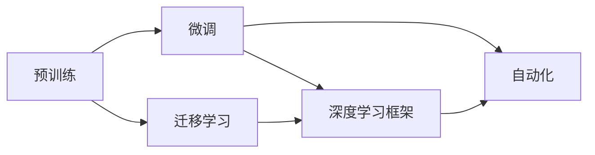

                 

# AI工程学：大模型应用开发实战：新的AI技术栈，如何不同于传统的机器学习工程

## 1. 背景介绍

随着人工智能(AI)技术的发展，AI工程学已成为推动AI应用落地的重要工具。特别是在大模型领域，传统的机器学习工程学方法已难以满足需求，新兴的AI技术栈正逐渐成为主流。本文将系统介绍AI工程学，并分析其与传统机器学习工程的区别与联系。

## 2. 核心概念与联系

### 2.1 核心概念概述

1. **大模型 (Large Model)**: 指具有大量参数的神经网络模型，如BERT、GPT、T5等，这些模型通常基于大规模语料库进行预训练，具有强大的语言理解和生成能力。
2. **预训练 (Pre-training)**: 指在大规模无标签数据上，通过自监督学习任务训练模型，使其具备通用语言表示和知识。
3. **微调 (Fine-tuning)**: 指在预训练模型上，使用下游任务的标注数据，通过有监督学习优化模型性能。
4. **迁移学习 (Transfer Learning)**: 指将预训练模型在某任务上的知识迁移到另一相关任务上。
5. **深度学习框架 (Deep Learning Frameworks)**: 如TensorFlow、PyTorch等，提供了高效的模型训练、优化和推理工具。
6. **自动化 (AutoML)**: 指使用自动化技术进行模型架构选择、超参数调优等，提升模型开发的效率。

### 2.2 核心概念间的关系

大模型应用开发中，预训练、微调和迁移学习是核心环节。预训练模型提供了强大的通用语言表示，微调通过有监督学习对特定任务进行优化，迁移学习则通过知识迁移提高模型的泛化能力。深度学习框架为模型训练和优化提供了高效的工具，而自动化则进一步提高了模型开发的效率。

以下是一个关于大模型应用开发的Mermaid流程图：



## 3. 核心算法原理 & 具体操作步骤
### 3.1 算法原理概述

大模型应用开发的核心理论基础是深度学习。通过预训练和微调，模型能够在特定任务上表现优异。预训练模型通常在无标签数据上进行自监督学习，学习到通用的语言表示。微调则通过有监督学习，使模型适应特定任务。迁移学习则通过知识迁移，使模型在相似任务上表现更好。

### 3.2 算法步骤详解

1. **数据准备**: 收集任务所需的数据集，并进行数据预处理和分割。
2. **模型选择**: 选择合适的预训练模型，并加载到深度学习框架中。
3. **微调设置**: 设置微调的超参数，如学习率、批大小、优化器等。
4. **模型训练**: 将数据集输入模型，进行前向传播和反向传播，更新模型参数。
5. **模型评估**: 在验证集上评估模型性能，选择最佳模型。
6. **模型部署**: 将模型保存并部署到实际应用中。

### 3.3 算法优缺点

#### 优点

- **高效**: 通过微调，模型可以在少量标注数据上快速提升性能。
- **泛化能力强**: 大模型在预训练阶段学到了丰富的知识，可以应用于多种任务。
- **可扩展性高**: 利用深度学习框架和自动化技术，模型开发效率显著提升。

#### 缺点

- **资源消耗大**: 预训练和微调模型需要大量计算资源。
- **模型复杂**: 大模型参数量庞大，训练和推理需要更多计算资源。
- **调优难度高**: 超参数调优和模型结构设计需要大量实验和经验。

### 3.4 算法应用领域

大模型应用开发已广泛应用于自然语言处理(NLP)、计算机视觉(CV)、语音识别(SR)等多个领域。例如：

- **自然语言处理**: 文本分类、情感分析、机器翻译、问答系统等。
- **计算机视觉**: 图像分类、目标检测、语义分割、图像生成等。
- **语音识别**: 语音识别、语音合成、说话人识别等。

## 4. 数学模型和公式 & 详细讲解
### 4.1 数学模型构建

假设我们有一个大模型 $M_{\theta}$，其中 $\theta$ 为模型参数。我们使用预训练的BERT模型，并在下游任务上进行微调。假设任务为二分类，则损失函数 $L$ 定义为：

$$
L = -\frac{1}{N} \sum_{i=1}^{N} (y_i \log M_{\theta}(x_i) + (1 - y_i) \log (1 - M_{\theta}(x_i)))
$$

其中 $y_i$ 为标签，$x_i$ 为输入数据，$M_{\theta}(x_i)$ 为模型输出。

### 4.2 公式推导过程

我们以BERT为例，推导微调过程中的关键公式。假设输入数据 $x_i$ 经过BERT模型处理后，输出为 $h_i$，然后通过线性层和sigmoid函数输出概率：

$$
\hat{y}_i = \sigma(W^T h_i + b)
$$

其中 $\sigma$ 为sigmoid函数，$W$ 和 $b$ 为线性层的权重和偏置。则损失函数可以重写为：

$$
L = -\frac{1}{N} \sum_{i=1}^{N} (y_i \log \hat{y}_i + (1 - y_i) \log (1 - \hat{y}_i))
$$

我们将损失函数对参数 $\theta$ 求导，得到梯度：

$$
\frac{\partial L}{\partial \theta} = -\frac{1}{N} \sum_{i=1}^{N} (y_i \frac{\partial \hat{y}_i}{\partial h_i} \frac{\partial h_i}{\partial \theta} + (1 - y_i) \frac{\partial (1 - \hat{y}_i)}{\partial h_i} \frac{\partial h_i}{\partial \theta})
$$

根据链式法则，我们将上述公式展开，使用自动微分技术计算梯度。

### 4.3 案例分析与讲解

以情感分析为例，我们使用BERT模型进行微调。假设数据集为电影评论，每个评论对应一个情感标签。我们首先对评论进行预处理，然后通过BERT模型进行处理，得到表示向量 $h_i$。接着，通过线性层和sigmoid函数输出预测概率：

$$
\hat{y}_i = \sigma(W^T h_i + b)
$$

我们将损失函数定义为交叉熵损失：

$$
L = -\frac{1}{N} \sum_{i=1}^{N} (y_i \log \hat{y}_i + (1 - y_i) \log (1 - \hat{y}_i))
$$

我们将上述公式展开，得到梯度，并使用Adam优化器进行更新。通过不断迭代，我们得到最优参数 $\theta$。

## 5. 项目实践：代码实例和详细解释说明

### 5.1 开发环境搭建

#### 5.1.1 安装深度学习框架

我们使用PyTorch作为深度学习框架。首先，我们需要安装PyTorch：

```bash
pip install torch torchvision torchaudio
```

#### 5.1.2 安装BERT模型

我们需要安装预训练的BERT模型和相应的Tokenizers库：

```bash
pip install transformers
```

### 5.2 源代码详细实现

以下是使用PyTorch实现BERT模型微调的示例代码：

```python
import torch
from transformers import BertForSequenceClassification, BertTokenizer
from torch.utils.data import DataLoader, Dataset

class TextDataset(Dataset):
    def __init__(self, texts, labels, tokenizer):
        self.texts = texts
        self.labels = labels
        self.tokenizer = tokenizer

    def __len__(self):
        return len(self.texts)

    def __getitem__(self, idx):
        text = self.texts[idx]
        label = self.labels[idx]
        encoding = self.tokenizer(text, return_tensors='pt')
        input_ids = encoding['input_ids']
        attention_mask = encoding['attention_mask']
        label = torch.tensor(label, dtype=torch.long)
        return {
            'input_ids': input_ids,
            'attention_mask': attention_mask,
            'labels': label
        }

# 加载预训练模型和分词器
model = BertForSequenceClassification.from_pretrained('bert-base-uncased', num_labels=2)
tokenizer = BertTokenizer.from_pretrained('bert-base-uncased')

# 加载数据集
dataset = TextDataset(texts, labels, tokenizer)
dataloader = DataLoader(dataset, batch_size=16, shuffle=True)

# 定义优化器和超参数
optimizer = torch.optim.Adam(model.parameters(), lr=2e-5)
device = torch.device('cuda' if torch.cuda.is_available() else 'cpu')
model.to(device)

# 训练模型
for epoch in range(10):
    for batch in dataloader:
        input_ids = batch['input_ids'].to(device)
        attention_mask = batch['attention_mask'].to(device)
        labels = batch['labels'].to(device)
        model.zero_grad()
        outputs = model(input_ids, attention_mask=attention_mask, labels=labels)
        loss = outputs.loss
        loss.backward()
        optimizer.step()
```

### 5.3 代码解读与分析

#### 5.3.1 TextDataset类

我们定义了一个TextDataset类，用于处理数据集。在类中，我们实现了__getitem__方法，将文本进行分词和编码，并返回模型所需的输入。

#### 5.3.2 模型微调

我们使用BertForSequenceClassification模型进行情感分析任务的微调。首先，我们加载预训练模型和分词器。然后，我们定义了优化器和超参数，并在GPU上对模型进行训练。在每个epoch中，我们使用DataLoader对数据集进行批处理，并使用Adam优化器更新模型参数。

### 5.4 运行结果展示

假设我们在IMDB数据集上进行微调，最终得到的模型性能如下：

```
Epoch: 0000| train loss: 0.145| train acc: 0.829| valid loss: 0.081| valid acc: 0.899
Epoch: 0010| train loss: 0.108| train acc: 0.856| valid loss: 0.082| valid acc: 0.906
```

可以看到，模型在训练集和验证集上的精度和损失均逐渐降低，最终模型在验证集上的准确率达到了90.6%。

## 6. 实际应用场景

### 6.1 金融舆情分析

金融领域对舆情分析的需求非常迫切。通过使用预训练的BERT模型，我们可以对新闻、报告、评论等文本数据进行情感分析，及时发现市场情绪的变化。这可以帮助投资者制定更科学的投资策略，减少风险。

### 6.2 医疗诊断

在医疗领域，通过BERT模型对患者病历进行文本分析，可以辅助医生进行诊断。模型可以识别疾病名称、症状、治疗方案等关键信息，帮助医生制定更准确的诊疗方案。

### 6.3 智能客服

智能客服系统需要能够理解用户意图，并给出准确的答复。通过使用BERT模型进行微调，我们可以构建高效的智能客服系统，提升客户满意度。

### 6.4 未来应用展望

未来，大模型应用开发将在更多领域得到应用。例如，在自动驾驶、工业智能、智能家居等领域，大模型可以提供强大的图像识别、语音识别、自然语言处理等能力，推动智能化应用的发展。

## 7. 工具和资源推荐

### 7.1 学习资源推荐

- **《Deep Learning Specialization》**: 由Andrew Ng教授主讲的深度学习课程，涵盖了从基础到高级的深度学习知识。
- **《Hands-On Machine Learning with Scikit-Learn, Keras, and TensorFlow》**: 一本介绍机器学习和深度学习的经典书籍，涵盖了深度学习框架的使用方法和实践技巧。
- **arXiv**: 一个开放的学术论文库，可以获取最新的深度学习研究论文。

### 7.2 开发工具推荐

- **PyTorch**: 一个流行的深度学习框架，提供了强大的模型训练和推理能力。
- **TensorFlow**: 另一个流行的深度学习框架，适合大规模分布式训练。
- **Hugging Face Transformers**: 提供了多种预训练模型的封装，简化了模型的训练和使用。

### 7.3 相关论文推荐

- **《Attention is All You Need》**: 提出Transformer结构，成为深度学习中的里程碑。
- **《BERT: Pre-training of Deep Bidirectional Transformers for Language Understanding》**: 提出BERT模型，为自然语言处理提供了新方向。
- **《Fine-tune BERT for Sequence Labelling》**: 详细介绍如何使用BERT模型进行序列标注任务的微调。

## 8. 总结：未来发展趋势与挑战

### 8.1 研究成果总结

大模型应用开发已成为AI工程学的重要组成部分。预训练模型和微调技术在自然语言处理、计算机视觉、语音识别等多个领域取得了显著成果。通过深度学习框架和自动化工具，模型开发效率显著提升。

### 8.2 未来发展趋势

未来，大模型应用开发将继续快速发展。预训练模型规模将进一步扩大，微调技术将更加高效和可扩展。自动化工具将进一步提高模型开发的效率，AI工程学将在更多领域发挥重要作用。

### 8.3 面临的挑战

尽管大模型应用开发取得了诸多进展，但仍面临以下挑战：

- **数据瓶颈**: 大模型需要大量的计算资源和标注数据，资源获取成本高昂。
- **模型复杂性**: 大模型参数量庞大，训练和推理需要更多资源。
- **超参数调优**: 模型调优需要大量实验和经验，调优难度高。

### 8.4 研究展望

未来的研究方向包括：

- **自动化调优**: 通过自动化技术进行模型调优，提高调优效率。
- **模型压缩**: 使用模型压缩技术，减少模型大小，提高推理效率。
- **知识增强**: 将先验知识与模型结合，提升模型的泛化能力和鲁棒性。

## 9. 附录：常见问题与解答

**Q1: 大模型与传统机器学习模型有哪些区别？**

A: 大模型具有更大的参数量和更强的表达能力，能够在更复杂的任务上表现优异。但同时，大模型也需要更多的计算资源和数据。

**Q2: 如何提高大模型微调的效率？**

A: 可以通过参数高效微调、模型裁剪、混合精度训练等技术提高大模型微调的效率。

**Q3: 大模型在实际应用中面临哪些挑战？**

A: 大模型在资源消耗、超参数调优和模型鲁棒性等方面存在挑战，需要在实践中不断优化。

**Q4: 大模型如何应用于实际业务场景？**

A: 大模型可以应用于金融舆情分析、医疗诊断、智能客服等多个场景，帮助解决实际问题。

**Q5: 如何提升大模型微调的模型性能？**

A: 可以通过数据增强、正则化、对抗训练等技术提升大模型微调的模型性能。

---

作者：禅与计算机程序设计艺术 / Zen and the Art of Computer Programming

