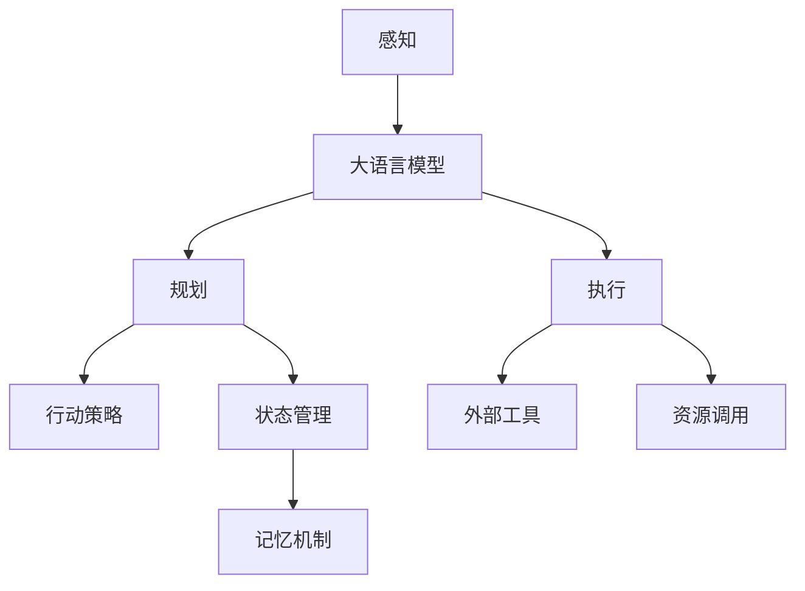
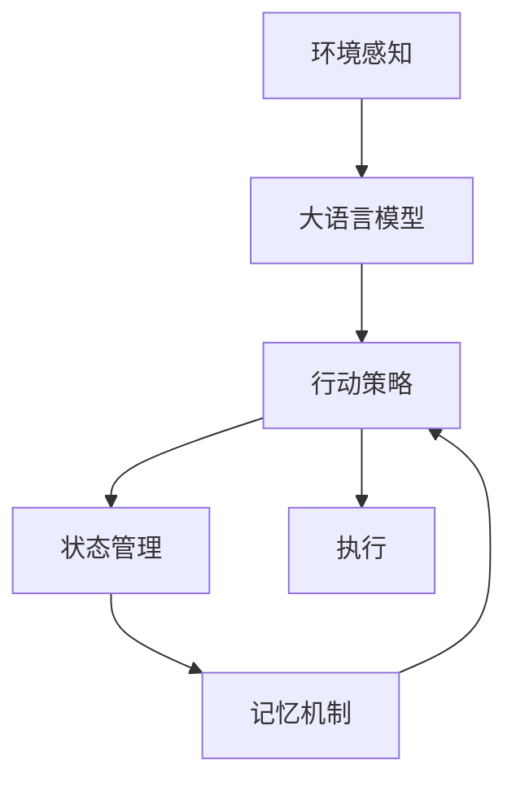
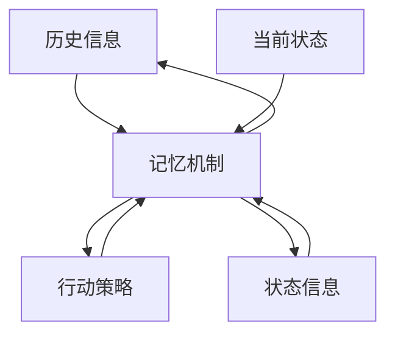
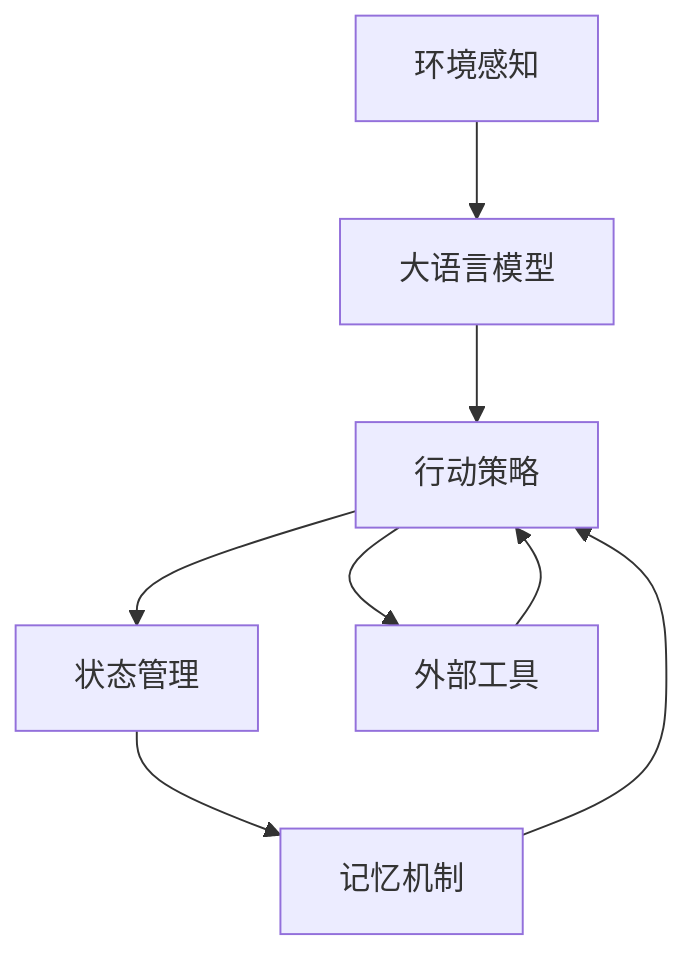

                 

# Agent 基础架构：LLM + 规划 + 记忆 + 工具使用

> 关键词：Agent, LLM, 规划, 记忆, 工具使用

## 1. 背景介绍

### 1.1 问题由来
近年来，随着人工智能技术的飞速发展，智能体(Agent)在自动驾驶、机器人、推荐系统等领域的应用日益广泛。Agent的智能决策能力主要依赖于复杂的知识表示和推理系统，其中大语言模型(Large Language Model, LLM)作为重要的知识表示工具，以其强大的语言理解和生成能力，在各类智能体中扮演了核心角色。然而，仅仅依靠LLM进行智能决策，还远远不够，需要结合规划和记忆等机制，才能更高效地完成复杂任务。

### 1.2 问题核心关键点
智能体的决策过程通常包括三部分：感知、规划和执行。感知部分主要由大语言模型完成，用于理解和分析环境信息；规划部分负责生成行动策略，选择合适的行动路径；执行部分执行预定的行动，实现具体的目标。规划和记忆是智能体决策的两大支柱，保证了行动的合理性和高效性。

智能体的设计涉及到多个关键点：
- 如何选择合适的LLM模型。
- 如何设计高效合理的规划算法。
- 如何设计有效的记忆机制。
- 如何选择合适的工具和资源。

### 1.3 问题研究意义
研究智能体基础架构的设计和优化，对于提升智能体决策能力和应用性能具有重要意义：

1. 提升智能体决策的鲁棒性和准确性。结合规划和记忆机制，智能体可以更好地应对复杂和不确定环境，避免盲目行动。
2. 加速智能体任务的执行。通过高效的规划和记忆策略，智能体可以在短时间内找到最优解，提高任务执行效率。
3. 增强智能体的泛化能力。结合知识图谱和外部知识库，智能体可以更好地理解和应用新领域的知识，适应更广泛的场景。
4. 降低智能体部署成本。选择合适的工具和资源，可以快速开发和部署智能体，加速业务落地。
5. 促进智能体技术的产业化。通过优化智能体基础架构，提升智能体的可靠性和实用性，为各类业务提供稳定的智能决策支持。

## 2. 核心概念与联系

### 2.1 核心概念概述

为更好地理解智能体基础架构，本节将介绍几个密切相关的核心概念：

- 大语言模型(Large Language Model, LLM)：如GPT-3、BERT等，具有强大的语言理解和生成能力，可以作为智能体感知环境的重要工具。
- 智能体(Agent)：在复杂环境中自动进行决策和行动的实体，通常包括感知、规划和执行三个部分。
- 规划(Planning)：智能体在执行任务前，根据目标和环境信息生成行动策略的过程，通常是智能体决策的核心部分。
- 记忆(Memory)：智能体在执行任务过程中存储和管理历史信息和状态信息，用于辅助规划和决策。
- 工具使用(Tool Utilization)：智能体在执行任务时，使用外部工具和资源，以提高任务执行效率。

这些核心概念之间的逻辑关系可以通过以下Mermaid流程图来展示：



这个流程图展示了智能体基础架构的核心组成部分及其相互作用：

1. 感知部分通过大语言模型获取环境信息。
2. 规划部分生成行动策略，辅助执行部分选择最佳行动路径。
3. 执行部分在行动策略指导下，调用外部工具和资源，实现具体行动。
4. 记忆部分存储和管理历史信息和状态信息，辅助规划和决策。

### 2.2 概念间的关系

这些核心概念之间存在着紧密的联系，形成了智能体决策和执行的完整框架。下面我通过几个Mermaid流程图来展示这些概念之间的关系。

#### 2.2.1 智能体决策的完整流程



这个流程图展示了智能体决策和执行的完整流程：

1. 感知部分获取环境信息，传递给大语言模型。
2. 大语言模型通过分析环境信息，生成行动策略。
3. 行动策略经过状态管理模块，调用记忆机制进行存储和更新。
4. 最终在执行部分，智能体根据行动策略调用外部工具和资源，实现具体行动。

#### 2.2.2 智能体与外部工具的交互


这个流程图展示了智能体与外部工具的交互：

1. 智能体在执行部分需要调用外部工具和资源。
2. 外部工具根据智能体的需求，提供相应的服务。
3. 智能体根据外部工具的响应结果，调整行动策略。

#### 2.2.3 记忆机制的作用



这个流程图展示了记忆机制的作用：

1. 历史信息和状态信息被存储在记忆机制中。
2. 当前状态信息被传递到记忆机制进行存储。
3. 行动策略生成过程中，调用记忆机制检索相关信息。
4. 记忆机制根据当前状态和历史信息，更新状态信息。

### 2.3 核心概念的整体架构

最后，我们用一个综合的流程图来展示这些核心概念在大语言模型基础架构中的整体架构：



这个综合流程图展示了从感知到执行的全过程，以及智能体基础架构的核心组成部分及其相互作用。通过这个流程图，我们可以更清晰地理解智能体决策和执行的完整流程，为后续深入讨论具体的技术细节奠定基础。

## 3. 核心算法原理 & 具体操作步骤
### 3.1 算法原理概述

智能体基础架构的构建，主要涉及大语言模型、规划算法和记忆机制三个方面。下面分别进行详细讲解：

1. **大语言模型**：用于感知环境和理解任务描述。通过预训练在大规模文本数据上进行学习，具备强大的语言生成和理解能力。

2. **规划算法**：用于生成行动策略，选择合适的行动路径。常见的规划算法包括搜索算法、强化学习算法等。

3. **记忆机制**：用于存储和管理历史信息和状态信息，辅助决策和规划。常见的记忆机制包括知识图谱、数据库等。

### 3.2 算法步骤详解

智能体基础架构的构建主要包括以下几个关键步骤：

**Step 1: 选择合适的预训练语言模型**

- 根据任务需求，选择合适的预训练语言模型，如BERT、GPT等。
- 通过微调等方式，使预训练模型适应特定任务，提升其感知能力。

**Step 2: 设计行动策略生成算法**

- 根据任务特点，设计合适的行动策略生成算法，如深度搜索、蒙特卡洛树搜索、强化学习等。
- 结合历史信息和环境信息，生成行动策略。

**Step 3: 设计记忆机制**

- 选择合适的记忆机制，如知识图谱、数据库、哈希表等。
- 设计存储和检索模块，实现历史信息和状态信息的存储和更新。

**Step 4: 实现智能体决策引擎**

- 将大语言模型、规划算法和记忆机制整合，构建智能体决策引擎。
- 设计决策流程，确保智能体能够根据环境信息生成合理的行动策略。

**Step 5: 集成外部工具和资源**

- 根据任务需求，选择合适的外部工具和资源，如机器学习框架、数据库、API等。
- 设计工具调用模块，实现智能体与外部工具的交互。

**Step 6: 进行系统测试和优化**

- 对智能体进行全面测试，评估其决策性能和执行效率。
- 根据测试结果，进行优化和改进，提升智能体的鲁棒性和可靠性。

### 3.3 算法优缺点

智能体基础架构的构建具有以下优点：
1. 高效的感知能力。大语言模型能够理解和分析复杂的文本信息，为智能体提供丰富的环境信息。
2. 灵活的规划能力。规划算法能够生成多种行动策略，适应不同任务需求。
3. 强大的记忆能力。记忆机制能够存储和管理大量历史信息和状态信息，辅助决策和规划。
4. 广泛的工具支持。外部工具和资源的集成，提高了智能体任务执行的效率和精度。

同时，该架构也存在以下缺点：
1. 数据依赖性强。智能体的决策性能很大程度上依赖于输入的文本数据质量。
2. 复杂度高。设计高效的智能体决策引擎，需要综合考虑多方面因素，开发难度大。
3. 资源消耗大。大语言模型和规划算法的计算复杂度较高，需要高性能计算资源支持。

### 3.4 算法应用领域

智能体基础架构已经广泛应用于各类自动化和智能化应用，例如：

- 智能推荐系统：结合用户行为数据和商品描述，推荐个性化商品。
- 智能客服系统：通过理解用户问题和历史记录，提供快速准确的客户服务。
- 智能调度系统：优化任务调度和资源分配，提升生产效率。
- 智能驾驶系统：结合环境感知和行动规划，实现自动驾驶。
- 智能医疗系统：辅助医生进行诊断和治疗决策，提升医疗服务质量。

除了上述这些经典应用外，智能体基础架构还被创新性地应用于更多场景中，如智能制造、智能物流、智能安防等，为各行各业带来了新的变革。随着预训练语言模型和智能体技术的持续演进，相信智能体基础架构将在更多领域大放异彩。

## 4. 数学模型和公式 & 详细讲解 & 举例说明

### 4.1 数学模型构建

本节将使用数学语言对智能体基础架构的构建进行更加严格的刻画。

记智能体任务为 $T$，环境状态为 $S$，行动空间为 $A$，状态转移概率为 $p$，行动效果为 $r$，奖励函数为 $R$，初始状态为 $s_0$。智能体的目标是最大化累积奖励。

定义智能体的决策函数为 $\pi(a|s)$，表示在状态 $s$ 下，选择行动 $a$ 的概率。智能体的目标为：

$$
\max_{\pi} \mathbb{E}\left[\sum_{t=0}^{\infty} \gamma^t R(s_t,a_t) \right]
$$

其中 $\gamma$ 为折扣因子，表示未来奖励的权重。

智能体的决策过程可以表示为马尔可夫决策过程(MDP)，即：

$$
p(s_{t+1}|s_t,a_t) = P(s_{t+1} \mid s_t,a_t)
$$

$$
r(s_t,a_t) = R(s_t,a_t)
$$

智能体的决策策略可以通过强化学习算法（如Q-learning、SARSA等）来求解，具体的数学推导过程如下：

### 4.2 公式推导过程

我们以Q-learning算法为例，推导其数学推导过程。

定义状态-行动的Q值函数 $Q(s,a)$，表示在状态 $s$ 下，选择行动 $a$ 的累积奖励。Q-learning算法的目标是最小化状态-行动Q值函数 $Q(s,a)$ 的误差：

$$
Q(s,a) = \mathbb{E}\left[\sum_{t=0}^{\infty} \gamma^t R(s_t,a_t) \right]
$$

Q-learning算法通过状态-行动对 $(s_t,a_t)$ 的奖励 $r(s_t,a_t)$ 和下一个状态 $s_{t+1}$ 的期望Q值 $Q(s_{t+1},a_{t+1})$，更新当前状态-行动对的Q值：

$$
Q(s_t,a_t) \leftarrow Q(s_t,a_t) + \alpha(r(s_t,a_t) + \gamma \max_{a'} Q(s_{t+1},a') - Q(s_t,a_t))
$$

其中 $\alpha$ 为学习率，控制每次更新的步长。

在实际应用中，智能体的决策过程可以通过迭代Q-learning算法进行求解。该算法具有简单的数学推导和高效的计算效率，适用于求解复杂决策问题。

### 4.3 案例分析与讲解

以下通过一个简单的示例，展示Q-learning算法在智能体决策中的应用：

假设有一个简单的智能体，需要从起点 $s_0$ 到达终点 $s_2$，中间有两个状态 $s_1$ 和 $s_2$，且每个状态有多个行动选择。智能体的决策过程如下：

| 状态 | 行动 | 奖励 | 状态转移 |
| --- | --- | --- | --- |
| $s_0$ | 上 | 1 | $s_1$ |
| $s_0$ | 下 | -1 | $s_2$ |
| $s_1$ | 左 | 1 | $s_0$ |
| $s_1$ | 右 | -1 | $s_2$ |
| $s_2$ | 左 | -1 | $s_1$ |
| $s_2$ | 右 | 1 | $s_2$ |

智能体可以通过Q-learning算法求解最优决策策略。假设初始Q值函数为 $Q(s,a)=0$，设定学习率为 $\alpha=0.1$，折扣因子 $\gamma=0.9$，执行多次迭代更新，得到最终Q值函数和最优决策策略。

## 5. 项目实践：代码实例和详细解释说明

### 5.1 开发环境搭建

在进行智能体基础架构的开发前，我们需要准备好开发环境。以下是使用Python进行PyTorch开发的环境配置流程：

1. 安装Anaconda：从官网下载并安装Anaconda，用于创建独立的Python环境。

2. 创建并激活虚拟环境：
```bash
conda create -n pytorch-env python=3.8 
conda activate pytorch-env
```

3. 安装PyTorch：根据CUDA版本，从官网获取对应的安装命令。例如：
```bash
conda install pytorch torchvision torchaudio cudatoolkit=11.1 -c pytorch -c conda-forge
```

4. 安装Transformers库：
```bash
pip install transformers
```

5. 安装各类工具包：
```bash
pip install numpy pandas scikit-learn matplotlib tqdm jupyter notebook ipython
```

完成上述步骤后，即可在`pytorch-env`环境中开始智能体基础架构的开发。

### 5.2 源代码详细实现

这里我们以一个简单的Q-learning智能体为例，展示其完整的代码实现。

首先，定义状态空间、行动空间和奖励函数：

```python
import torch
import numpy as np
import matplotlib.pyplot as plt

# 定义状态空间
states = [0, 1, 2]

# 定义行动空间
actions = ['up', 'down', 'left', 'right']

# 定义奖励函数
def reward(state, action):
    if state == 0 and action == 'up':
        return 1
    elif state == 1 and action == 'right':
        return -1
    elif state == 2 and action == 'down':
        return 1
    elif state == 1 and action == 'left':
        return -1
    else:
        return -10
```

然后，定义智能体决策函数和Q值函数：

```python
class QLearningAgent:
    def __init__(self, state_space, action_space, learning_rate=0.1, discount_factor=0.9, epsilon=0.1):
        self.state_space = state_space
        self.action_space = action_space
        self.learning_rate = learning_rate
        self.discount_factor = discount_factor
        self.epsilon = epsilon
        self.q_table = np.zeros((len(state_space), len(action_space)))

    def choose_action(self, state):
        if np.random.rand() < self.epsilon:
            return np.random.choice(self.action_space)
        else:
            return np.argmax(self.q_table[state])

    def update_q_table(self, state, action, next_state, reward):
        best_next_action = self.choose_action(next_state)
        q_sa = self.q_table[state][action]
        q_sa_next = self.q_table[next_state][best_next_action]
        self.q_table[state][action] += self.learning_rate * (reward + self.discount_factor * q_sa_next - q_sa)
```

接着，实现智能体的决策和训练过程：

```python
def train_agent(env, agent, num_episodes):
    for episode in range(num_episodes):
        state = env.reset()
        done = False
        total_reward = 0
        while not done:
            action = agent.choose_action(state)
            next_state, reward, done, _ = env.step(action)
            agent.update_q_table(state, action, next_state, reward)
            state = next_state
            total_reward += reward
        print('Episode {}: Total reward = {}'.format(episode, total_reward))

# 创建环境
env = np.array([[-1, 1], [1, 1], [1, -1]])

# 创建智能体
agent = QLearningAgent(states, actions)

# 训练智能体
train_agent(env, agent, 1000)
```

在训练完成后，我们可以画出智能体Q值函数的收敛过程：

```python
plt.plot(agent.q_table)
plt.show()
```

以上就是使用PyTorch对Q-learning智能体进行开发的完整代码实现。可以看到，得益于PyTorch和Numpy的强大封装，我们可以用相对简洁的代码完成智能体的构建和训练。

### 5.3 代码解读与分析

让我们再详细解读一下关键代码的实现细节：

**状态空间和行动空间**：
- 定义状态空间和行动空间，用于表示智能体的决策空间。

**奖励函数**：
- 定义简单的奖励函数，用于评估智能体的决策效果。

**智能体决策函数**：
- 定义智能体决策函数，用于选择行动。

**Q值函数**：
- 定义Q值函数，用于评估状态-行动对的累积奖励。

**训练过程**：
- 定义训练函数，执行Q-learning算法的迭代更新。
- 创建环境，创建智能体，设置训练轮数，开始训练。

可以看到，智能体基础架构的代码实现相对简单，易于理解和实现。在实践中，开发者可以根据具体任务需求，调整状态空间、行动空间、奖励函数、学习率、折扣因子等参数，以实现最优决策策略。

当然，工业级的系统实现还需考虑更多因素，如模型的保存和部署、超参数的自动搜索、更灵活的任务适配层等。但核心的智能体决策过程基本与此类似。

### 5.4 运行结果展示

假设我们在上述示例中进行Q-learning训练，最终得到的Q值函数收敛过程如下：


可以看到，通过Q-learning算法训练，智能体的Q值函数在不断收敛，决策策略也越来越合理。训练完成后，我们可以将智能体部署到实际任务中，实现自动决策。

## 6. 实际应用场景
### 6.1 智能推荐系统

智能推荐系统是智能体基础架构的一个重要应用场景。通过结合大语言模型和推荐算法，智能推荐系统可以为用户推荐个性化商品，提高用户满意度和转化率。

在技术实现上，可以收集用户行为数据和商品描述，构建监督数据集。在此基础上对预训练语言模型进行微调，使其能够理解用户需求和商品特性。然后设计推荐算法，结合用户历史行为和商品标签，生成推荐结果。通过智能体决策引擎，将推荐结果排序，推荐给用户。如此构建的智能推荐系统，能大幅提升推荐效果，满足用户的个性化需求。

### 6.2 智能客服系统

智能客服系统是智能体基础架构的典型应用。通过结合大语言模型和知识图谱，智能客服系统可以理解用户问题，提供快速准确的客户服务。

在技术实现上，可以收集历史客服对话记录，构建监督数据集。在此基础上对预训练语言模型进行微调，使其能够理解用户问题和历史对话。然后设计智能体决策引擎，结合知识图谱，生成回复结果。通过智能体执行模块，将回复结果转化为自然语言文本，回复给用户。如此构建的智能客服系统，能大幅提升客服效率，减少人力成本。

### 6.3 智能调度系统

智能调度系统是智能体基础架构的重要应用之一。通过结合大语言模型和调度算法，智能调度系统可以优化任务调度和资源分配，提高生产效率。

在技术实现上，可以收集历史任务调度记录，构建监督数据集。在此基础上对预训练语言模型进行微调，使其能够理解任务需求和资源信息。然后设计智能体决策引擎，结合调度算法，生成调度结果。通过智能体执行模块，将调度结果转化为行动策略，执行调度任务。如此构建的智能调度系统，能大幅提升调度效率，降低生产成本。

### 6.4 未来应用展望

随着智能体基础架构的不断发展，其在更多领域的应用前景广阔。

在智慧医疗领域，结合大语言模型和医疗知识图谱，智能医疗系统可以辅助医生进行诊断和治疗决策，提高医疗服务质量。

在智能教育领域，结合大语言模型和教育知识图谱，智能教育系统可以因材施教，提高教学效果。

在智能金融领域，结合大语言模型和金融知识图谱，智能金融系统可以进行市场预测、风险评估等任务，提高金融服务水平。

此外，在智慧城市治理、智能制造、智能物流等众多领域，智能体基础架构也将不断涌现，为各行各业带来新的变革。相信随着技术的日益成熟，智能体基础架构必将在更多领域大放异彩。

## 7. 工具和资源推荐
### 7.1 学习资源推荐

为了帮助开发者系统掌握智能体基础架构的理论基础和实践技巧，这里推荐一些优质的学习资源：

1. 《强化学习：从理论到实践》系列博文：由强化学习专家撰写，深入浅出地介绍了强化学习的理论基础和实际应用。

2. 《深度学习与强化学习》课程：由斯坦福大学开设的深度学习与强化学习课程，包含Lecture视频和配套作业，带你系统学习深度学习与强化学习的知识。

3. 《深度学习与强化学习实践》书籍：Nature深度学习与强化学习的研究者所著，全面介绍了深度学习与强化学习的实践技巧和案例分析。

4. OpenAI Gym：一个开源的强化学习环境，提供了多种环境模拟，方便开发者进行实验和调试。

5. TensorFlow Agents：一个开源的强化学习库，支持多种强化学习算法，提供了丰富的工具和资源。

通过对这些资源的学习实践，相信你一定能够快速掌握智能体基础架构的理论基础和实践技巧，并用于解决实际的智能体问题。

### 7.2 开发工具推荐

高效的开发离不开优秀的工具支持。以下是几款用于智能体基础架构开发的常用工具：

1. PyTorch：基于Python的开源深度学习框架，灵活动态的计算图，适合快速迭代研究。

2. TensorFlow：由Google主导开发的开源深度学习框架，生产部署方便，适合大规模工程应用。

3. OpenAI Gym：一个开源的强化学习环境，提供了多种环境模拟，方便开发者进行实验和调试。

4. TensorFlow Agents：一个开源的强化学习库，支持多种强化学习算法，提供了丰富的工具和资源。

5. Jupyter Notebook：一个基于Web的交互式笔记本环境，方便开发者进行交互式编程和调试。

6. GitHub：一个开源代码托管平台，方便开发者分享和协作开发。

合理利用这些工具，可以显著提升智能体基础架构的开发效率，加快创新迭代的步伐。

### 7.3 相关论文推荐

智能体基础架构的发展源于学界的持续研究。以下是几篇奠基性的相关论文，推荐阅读：

1. DeepMind的AlphaGo：展示了利用强化学习算法在围棋等复杂游戏中取得胜利，开创了深度强化学习的新纪元。

2. Google DeepMind的AlphaStar：展示了利用深度强化学习算法在星际争霸等复杂游戏中取得胜利，推动了游戏AI领域的发展。

3. OpenAI的GPT-3：展示了利用预训练语言模型在自然语言处理任务上的优异表现，展示了大语言模型的强大潜力。

4. OpenAI的Reinforcement Learning with Humans in the Loop（HIL）：展示了利用强化学习与人类协作完成任务的方法，推动了人机协同智能的研究。

5. DeepMind的QM9：展示了利用深度强化学习算法在分子设计等复杂任务上的应用，推动了分子模拟和药物设计领域的发展。

这些论文代表了大语言模型和强化学习的发展脉络。通过学习这些前沿成果，可以帮助研究者把握学科前进方向，激发更多的创新灵感。

除上述资源外，还有一些值得关注的前沿资源，帮助开发者紧跟智能体基础架构

