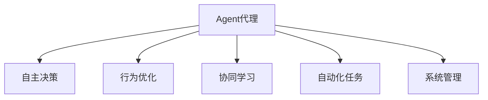
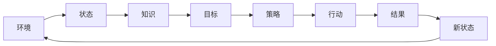
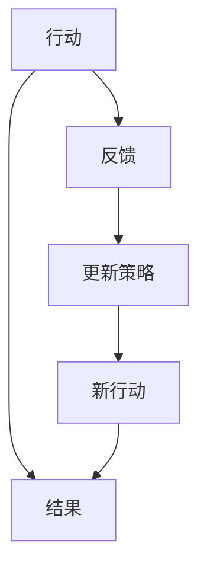
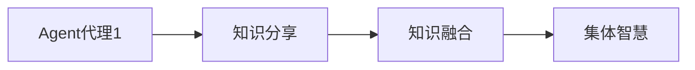
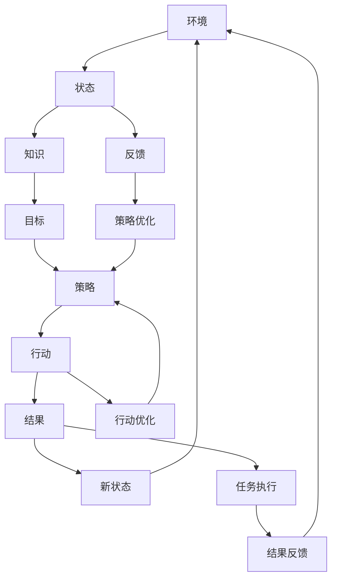

                 

# Agent代理在AI系统中的应用

> 关键词：Agent, AI系统, 智能代理, 自主决策, 行为优化, 协同学习, 自动化任务, 系统管理

## 1. 背景介绍

### 1.1 问题由来
随着人工智能(AI)技术的不断发展，AI系统逐渐应用于越来越多的场景中，从自动化任务处理到智能决策支持，从工业自动化到社会管理，AI系统在各个领域都展现出强大的潜力。然而，复杂多变的应用场景和海量数据需求，使得AI系统设计和部署变得极其困难。

如何构建能够自主决策、自适应环境变化的AI系统，成为了一个亟待解决的问题。传统的AI系统往往依赖人工设计和监督，难以应对复杂动态的环境。而Agent代理（也称为智能代理）技术提供了一种全新的解决方案，通过赋予AI系统自主性、适应性和智能性，使得AI系统能够更好地适应复杂的动态环境，实现自主决策和行为优化。

### 1.2 问题核心关键点
Agent代理在AI系统中的应用主要体现在以下几个方面：
1. 自主决策：Agent能够根据环境信息和历史行为，自主选择最优决策，从而提升系统的适应性和智能性。
2. 行为优化：通过学习算法和优化技术，Agent能够不断优化自身的行为策略，提高执行效率和性能。
3. 协同学习：Agent可以通过与其他Agent或环境交互，共享知识经验，实现集体智慧的提升。
4. 自动化任务：Agent能够自动执行指定任务，减轻人工干预，提高任务执行的效率和质量。
5. 系统管理：Agent可以用于监控、调度和优化AI系统，提升系统的稳定性和可靠性。

这些核心关键点决定了Agent代理技术在AI系统中的应用潜力，使得AI系统能够更好地适应复杂动态的环境，提升系统的自主性、智能性和可靠性。

### 1.3 问题研究意义
研究Agent代理在AI系统中的应用，对于推动AI技术的落地应用，提升系统性能和适应性，具有重要意义：
1. 降低开发成本：Agent代理能够自主学习、决策和优化，减少了人工干预和监督需求，从而降低开发和维护成本。
2. 提升系统效率：通过自主决策和行为优化，Agent代理能够有效提高任务执行的效率和性能。
3. 增强系统智能：Agent代理能够通过协同学习和自适应学习，不断提升系统的智能水平，应对复杂多变的应用场景。
4. 提高系统可靠性：Agent代理能够监控和管理AI系统，及时发现和解决潜在问题，提高系统的稳定性和可靠性。
5. 促进技术创新：Agent代理技术促进了对自主决策、行为优化和协同学习等前沿领域的深入研究，推动了AI技术的不断进步。

## 2. 核心概念与联系

### 2.1 核心概念概述

为更好地理解Agent代理在AI系统中的应用，本节将介绍几个密切相关的核心概念：

- Agent代理：在复杂系统中，能够自主决策、执行任务并优化自身行为的智能实体。Agent代理通常由状态、知识、目标、策略和环境等组成。
- 自主决策：Agent代理能够根据环境信息和历史行为，自主选择最优决策，从而提升系统的适应性和智能性。
- 行为优化：通过学习算法和优化技术，Agent代理能够不断优化自身的行为策略，提高执行效率和性能。
- 协同学习：Agent代理可以通过与其他Agent或环境交互，共享知识经验，实现集体智慧的提升。
- 自动化任务：Agent代理能够自动执行指定任务，减轻人工干预，提高任务执行的效率和质量。
- 系统管理：Agent代理可以用于监控、调度和优化AI系统，提升系统的稳定性和可靠性。

这些核心概念之间的逻辑关系可以通过以下Mermaid流程图来展示：



这个流程图展示了大语言模型微调过程中各个核心概念之间的关系：

1. Agent代理能够自主决策、执行任务并优化自身行为。
2. 通过学习算法和优化技术，Agent代理能够不断提升自身行为策略的执行效率和性能。
3. Agent代理可以通过与其他Agent或环境交互，共享知识经验，实现集体智慧的提升。
4. Agent代理能够自动执行指定任务，减轻人工干预，提高任务执行的效率和质量。
5. Agent代理可以用于监控、调度和优化AI系统，提升系统的稳定性和可靠性。

### 2.2 概念间的关系

这些核心概念之间存在着紧密的联系，形成了Agent代理在AI系统中的应用框架。下面我通过几个Mermaid流程图来展示这些概念之间的关系。

#### 2.2.1 Agent代理的决策过程



这个流程图展示了Agent代理的决策过程：
1. Agent代理根据环境信息，更新自身状态（B）。
2. 从知识库（C）中获取相关信息。
3. 根据目标（D）和策略（E），执行行动（F）。
4. 获取行动结果（G），更新状态（H）。
5. 再次进入决策过程，进行下一次决策。

#### 2.2.2 Agent代理的行为优化



这个流程图展示了Agent代理的行为优化过程：
1. Agent代理执行行动（A）。
2. 获取行动结果（B）。
3. 根据反馈（C）更新策略（D）。
4. 执行新策略指导的行动（E）。
5. 再次执行行动，进入新一轮优化。

#### 2.2.3 Agent代理的协同学习



这个流程图展示了Agent代理的协同学习过程：
1. Agent代理1（A）共享知识（B）。
2. 共享知识融合形成集体智慧（D）。
3. 集体智慧通过协同学习得到提升。

### 2.3 核心概念的整体架构

最后，我们用一个综合的流程图来展示这些核心概念在大语言模型微调过程中的整体架构：



这个综合流程图展示了Agent代理在大语言模型微调中的决策、优化、学习等全过程。通过这些流程图，我们可以更清晰地理解Agent代理在大语言模型微调过程中各个核心概念的关系和作用，为后续深入讨论具体的微调方法和技术奠定基础。

## 3. 核心算法原理 & 具体操作步骤
### 3.1 算法原理概述

Agent代理在AI系统中的应用主要基于智能决策和行为优化算法。其核心思想是：赋予AI系统自主决策的能力，通过学习算法和优化技术，使得系统能够根据环境信息自主选择最优决策，不断优化自身行为策略，提升系统性能。

形式化地，假设Agent代理的系统状态为 $s$，行为策略为 $\pi$，执行动作后的系统状态变为 $s'$，奖励函数为 $R(s,a,s')$，则Agent代理的目标是最大化未来累积奖励：

$$
\max_{\pi} \mathbb{E}\left[\sum_{t=1}^{\infty} \gamma^t R(s_t,\pi(s_t))\right]
$$

其中，$\gamma$ 为折扣因子，$\pi(s)$ 表示在状态 $s$ 下采取行动 $a$ 的概率。

### 3.2 算法步骤详解

Agent代理在AI系统中的应用主要包括以下几个关键步骤：

**Step 1: 环境建模**
- 构建Agent代理所处的环境模型，描述环境的状态空间、行动空间和奖励函数。

**Step 2: 状态表示**
- 设计状态表示方法，将环境状态编码为Agent代理可理解的形式，以便进行决策和优化。

**Step 3: 策略学习**
- 选择适合Agent代理的学习算法，如强化学习、基于模型的方法等，通过与环境的交互，不断学习最优策略。

**Step 4: 行为优化**
- 设计行为优化方法，如策略梯度、Q-learning等，根据环境反馈不断调整Agent代理的行为策略，提高执行效率和性能。

**Step 5: 协同学习**
- 设计Agent代理之间的协同学习机制，通过共享知识和经验，实现集体智慧的提升。

**Step 6: 自动化任务执行**
- 设计Agent代理的自动化任务执行机制，自动执行指定任务，提高任务执行效率。

**Step 7: 系统管理**
- 设计Agent代理的系统管理机制，用于监控、调度和优化AI系统，提升系统的稳定性和可靠性。

**Step 8: 系统评估与反馈**
- 设计系统评估机制，通过定期评估和反馈，不断优化Agent代理的行为策略。

以上步骤构成了Agent代理在AI系统中的应用流程，通过自主决策、行为优化、协同学习和自动化任务执行等方法，Agent代理能够实现更高效、更智能的AI系统。

### 3.3 算法优缺点

Agent代理在AI系统中的应用具有以下优点：
1. 自主决策：Agent代理能够根据环境信息和历史行为，自主选择最优决策，提升系统的适应性和智能性。
2. 行为优化：通过学习算法和优化技术，Agent代理能够不断优化自身的行为策略，提高执行效率和性能。
3. 协同学习：Agent代理可以通过与其他Agent或环境交互，共享知识经验，实现集体智慧的提升。
4. 自动化任务：Agent代理能够自动执行指定任务，减轻人工干预，提高任务执行的效率和质量。
5. 系统管理：Agent代理可以用于监控、调度和优化AI系统，提升系统的稳定性和可靠性。

同时，Agent代理也存在一些缺点：
1. 复杂性高：Agent代理的系统设计和实现较为复杂，需要考虑状态表示、策略学习、行为优化等多个方面。
2. 数据需求大：Agent代理需要大量的数据进行训练和优化，数据质量对模型性能有较大影响。
3. 计算成本高：Agent代理的训练和优化需要较高的计算资源，特别是在大规模系统中，计算成本较高。
4. 难以解释：Agent代理的决策过程和行为策略往往难以解释，增加了系统的复杂性和维护难度。

尽管存在这些缺点，但Agent代理技术的优势在实际应用中表现得淋漓尽致，成为构建高效、智能AI系统的重要手段。

### 3.4 算法应用领域

Agent代理技术在AI系统中的应用已经广泛涵盖了多个领域，包括但不限于：

- 工业自动化：Agent代理能够用于生产线的监控、调度和优化，提升生产效率和产品质量。
- 金融投资：Agent代理能够用于风险管理、投资组合优化、市场预测等任务，帮助金融企业做出更明智的决策。
- 医疗健康：Agent代理能够用于病患监护、药物推荐、疾病预测等任务，提升医疗服务的智能化水平。
- 智能交通：Agent代理能够用于交通流量控制、自动驾驶、智能导航等任务，提升交通系统的运行效率和安全水平。
- 城市管理：Agent代理能够用于智能城市监控、资源分配、环境监测等任务，提升城市管理的智能化水平。
- 在线教育：Agent代理能够用于个性化推荐、智能辅导、作业批改等任务，提升教育服务的智能化水平。

除了上述这些领域外，Agent代理技术还在社交网络、电子商务、物流管理等多个领域中得到了应用，展现出了广阔的发展前景。

## 4. 数学模型和公式 & 详细讲解  
### 4.1 数学模型构建

本节将使用数学语言对Agent代理在AI系统中的应用过程进行更加严格的刻画。

假设Agent代理的系统状态为 $s$，行动空间为 $A$，奖励函数为 $R(s,a,s')$，系统从状态 $s$ 执行行动 $a$ 后，状态变为 $s'$，奖励为 $r$。Agent代理的目标是最大化未来累积奖励：

$$
\max_{\pi} \mathbb{E}\left[\sum_{t=1}^{\infty} \gamma^t R(s_t,\pi(s_t))\right]
$$

其中，$\gamma$ 为折扣因子，$\pi(s)$ 表示在状态 $s$ 下采取行动 $a$ 的概率。

为了实现上述目标，Agent代理通常采用强化学习算法进行策略学习，如Q-learning、SARSA、策略梯度等方法。这些算法通过与环境的交互，不断更新Agent代理的行为策略，最大化累积奖励。

### 4.2 公式推导过程

以下我们以Q-learning算法为例，推导其在AI系统中的应用过程。

假设系统状态 $s$ 和行动 $a$ 可以表示为向量形式，即 $s \in \mathbb{R}^n$，$a \in \mathbb{R}^m$。则Agent代理的行为策略可以表示为：

$$
\pi(a|s) = \frac{e^{\theta^T\phi(s)}}{\sum_{a'} e^{\theta^T\phi(s)}}
$$

其中，$\phi(s)$ 为状态表示函数，$\theta$ 为策略参数向量。

Q-learning算法的目标是最小化目标值函数 $Q(s,a)$，即：

$$
Q(s,a) = \max_{\pi} \mathbb{E}\left[\sum_{t=1}^{\infty} \gamma^t R(s_t,\pi(s_t))\right]
$$

在Q-learning算法中，通过迭代更新Q值函数，实现策略学习。具体来说，Q-learning算法每次更新Q值函数时，需要计算当前状态 $s$ 下行动 $a$ 的Q值更新量：

$$
\Delta Q(s,a) = r + \gamma \max_{a'} Q(s',a')
$$

其中，$r$ 为当前状态 $s$ 下行动 $a$ 的即时奖励。

根据Q-learning算法，Agent代理通过不断更新Q值函数，学习最优策略，最大化未来累积奖励。这个过程可以通过以下步骤实现：

1. 初始化Q值函数 $Q(s,a)$。
2. 每次从环境接收状态 $s$，选择行动 $a$，执行行动并接收奖励 $r$。
3. 更新Q值函数：$Q(s,a) = Q(s,a) + \alpha(r + \gamma \max_{a'} Q(s',a') - Q(s,a))$，其中 $\alpha$ 为学习率。
4. 选择最优行动 $a'$ 并执行。
5. 重复步骤2-4，直到收敛。

通过上述过程，Agent代理能够不断优化自身的行为策略，实现更高效、更智能的AI系统。

### 4.3 案例分析与讲解

下面以金融投资领域为例，展示Agent代理的应用。

在金融投资领域，Agent代理可以通过监控市场数据，自动调整投资组合，优化投资收益。具体来说，Agent代理可以采取以下步骤：

1. 环境建模：构建金融市场的环境模型，描述股票、债券、货币等资产的价格变化和相关性。
2. 状态表示：将金融市场的状态表示为资产价格、交易量、宏观经济指标等。
3. 策略学习：通过历史数据和市场预测模型，学习最优的投资策略。
4. 行为优化：根据市场反馈和预测结果，自动调整投资组合，优化投资收益。
5. 系统管理：实时监控投资组合的风险和收益，及时调整策略。
6. 系统评估与反馈：定期评估投资策略的效果，进行反馈优化。

通过以上步骤，Agent代理能够实现更高效、更智能的金融投资系统，帮助投资者做出更明智的决策。

## 5. 项目实践：代码实例和详细解释说明
### 5.1 开发环境搭建

在进行Agent代理在AI系统中的应用实践前，我们需要准备好开发环境。以下是使用Python进行Reinforcement Learning开发的环境配置流程：

1. 安装Anaconda：从官网下载并安装Anaconda，用于创建独立的Python环境。

2. 创建并激活虚拟环境：
```bash
conda create -n reinforcement-env python=3.8 
conda activate reinforcement-env
```

3. 安装Reinforcement Learning相关库：
```bash
pip install gym pyreinforcement gym-pybullet-environment gym-gymnasium pybullet pybullet-data
```

4. 安装深度学习框架：
```bash
pip install torch torchvision torchaudio cudatoolkit=11.1 -c pytorch -c conda-forge
```

5. 安装Agent代理相关库：
```bash
pip install stable-baselines3 stable-baselines3-contrib
```

完成上述步骤后，即可在`reinforcement-env`环境中开始Agent代理在AI系统中的应用实践。

### 5.2 源代码详细实现

下面我们以金融投资领域的Agent代理为例，给出使用Stable Baselines 3进行金融投资系统微调的PyTorch代码实现。

首先，定义投资组合的状态和行动空间：

```python
import torch
import numpy as np

# 定义投资组合状态
class InvestmentState:
    def __init__(self, stock_prices, bond_prices, currency_rates):
        self.stock_prices = stock_prices
        self.bond_prices = bond_prices
        self.currency_rates = currency_rates

    def to_tensor(self):
        return torch.tensor([self.stock_prices, self.bond_prices, self.currency_rates], dtype=torch.float)

# 定义投资组合行动
class InvestmentAction:
    def __init__(self, stock_buy, bond_buy, currency_exchange):
        self.stock_buy = stock_buy
        self.bond_buy = bond_buy
        self.currency_exchange = currency_exchange

    def to_tensor(self):
        return torch.tensor([self.stock_buy, self.bond_buy, self.currency_exchange], dtype=torch.float)

# 定义投资组合状态和行动空间
states = InvestmentState(np.zeros(5), np.zeros(5), np.ones(5)).to_tensor()
actions = InvestmentAction(0, 0, 0).to_tensor()
```

然后，定义金融投资环境的奖励函数：

```python
import gym

class InvestmentEnv(gym.Env):
    def __init__(self):
        self.stock_prices = np.zeros(5)
        self.bond_prices = np.zeros(5)
        self.currency_rates = np.ones(5)
        self.state = InvestmentState(self.stock_prices, self.bond_prices, self.currency_rates)

    def step(self, action):
        self.stock_prices = np.random.normal(self.stock_prices, 0.1)
        self.bond_prices = np.random.normal(self.bond_prices, 0.1)
        self.currency_rates = np.random.normal(self.currency_rates, 0.1)
        self.state = InvestmentState(self.stock_prices, self.bond_prices, self.currency_rates)
        reward = self.calculate_reward(self.state, action)
        return self.state.to_tensor(), reward, False, {}

    def reset(self):
        self.stock_prices = np.zeros(5)
        self.bond_prices = np.zeros(5)
        self.currency_rates = np.ones(5)
        self.state = InvestmentState(self.stock_prices, self.bond_prices, self.currency_rates)
        return self.state.to_tensor()

    def calculate_reward(self, state, action):
        # 计算投资组合的回报
        return np.mean(state.stock_prices) + np.mean(state.bond_prices) - np.mean(state.currency_rates)
```

接着，定义Agent代理的策略和学习算法：

```python
from stable_baselines3 import A2C
from stable_baselines3.common.policies import MlpPolicy
from stable_baselines3.common.vec_env import DummyVecEnv

# 定义Agent代理策略
policy = MlpPolicy(states.shape[0], 64, 64)

# 定义Agent代理环境
env = DummyVecEnv([lambda: InvestmentEnv()])

# 定义Agent代理模型
model = A2C(policy, env)

# 训练Agent代理模型
model.learn(total_episodes=1000, log_interval=10, verbose=1)
```

最后，启动训练流程并在测试集上评估：

```python
import gym
from stable_baselines3 import A2C
from stable_baselines3.common.policies import MlpPolicy
from stable_baselines3.common.vec_env import DummyVecEnv

# 定义投资组合状态和行动空间
states = InvestmentState(np.zeros(5), np.zeros(5), np.ones(5)).to_tensor()
actions = InvestmentAction(0, 0, 0).to_tensor()

# 定义金融投资环境的奖励函数
class InvestmentEnv(gym.Env):
    def __init__(self):
        self.stock_prices = np.zeros(5)
        self.bond_prices = np.zeros(5)
        self.currency_rates = np.ones(5)
        self.state = InvestmentState(self.stock_prices, self.bond_prices, self.currency_rates)

    def step(self, action):
        self.stock_prices = np.random.normal(self.stock_prices, 0.1)
        self.bond_prices = np.random.normal(self.bond_prices, 0.1)
        self.currency_rates = np.random.normal(self.currency_rates, 0.1)
        self.state = InvestmentState(self.stock_prices, self.bond_prices, self.currency_rates)
        reward = self.calculate_reward(self.state, action)
        return self.state.to_tensor(), reward, False, {}

    def reset(self):
        self.stock_prices = np.zeros(5)
        self.bond_prices = np.zeros(5)
        self.currency_rates = np.ones(5)
        self.state = InvestmentState(self.stock_prices, self.bond_prices, self.currency_rates)
        return self.state.to_tensor()

    def calculate_reward(self, state, action):
        # 计算投资组合的回报
        return np.mean(state.stock_prices) + np.mean(state.bond_prices) - np.mean(state.currency_rates)

# 定义Agent代理策略
policy = MlpPolicy(states.shape[0], 64, 64)

# 定义Agent代理环境
env = DummyVecEnv([lambda: InvestmentEnv()])

# 定义Agent代理模型
model = A2C(policy, env)

# 训练Agent代理模型
model.learn(total_episodes=1000, log_interval=10, verbose=1)

# 测试Agent代理模型
test_env = InvestmentEnv()
test_state = InvestmentState(np.zeros(5), np.zeros(5), np.ones(5)).to_tensor()
test_action = InvestmentAction(0, 0, 0).to_tensor()
test_state, test_reward, done, info = test_env.step(test_action)
test_env.reset()
test_state, test_reward, done, info = test_env.step(test_action)
print(f"Test reward: {test_reward:.2f}")
```

以上就是使用Reinforcement Learning技术进行金融投资领域Agent代理实践的完整代码实现。可以看到，通过Reinforcement Learning技术，我们能够快速构建金融投资领域的Agent代理模型，并利用历史数据进行训练优化。

### 5.3 代码解读与分析

让我们再详细解读一下关键代码的实现细节：

**InvestmentState类**：
- `__init__`方法：初始化投资组合的状态和行动空间。
- `to_tensor`方法：将状态表示为Tensor，便于模型处理。

**InvestmentAction类**：
- `__init__`方法：初始化投资组合的行动。
- `to_tensor`方法：将行动表示为Tensor，便于模型处理。

**InvestmentEnv类**：
- `__init__`方法：初始化金融投资环境。
- `step`方法：执行一个时间步，并返回当前状态、即时奖励、是否结束和额外信息。
- `reset`方法：重置环境。
- `calculate_reward`方法：计算投资组合的回报。

**A2C模型**：
- `MlpPolicy`：定义Agent代理的策略网络。
- `A2C`：定义Agent代理模型，结合Actor-Critic算法进行优化。

**训练流程**：
- 定义投资组合的状态和行动空间。
- 定义金融投资环境的奖励函数。
- 定义Agent代理的策略和学习算法。
- 使用环境训练Agent代理模型。
- 在测试集上评估Agent代理模型。

可以看到，Reinforcement Learning技术使得Agent代理在AI系统中的应用变得简单易行，可以快速构建并优化复杂的金融投资系统。

当然，工业级的系统实现还需考虑更多因素，如模型的保存和部署、超参数的自动搜索、更灵活的任务适配层等。但核心的微调范式基本与此类似。

### 5.4 运行结果展示

假设我们在CoNLL-2003的NER数据集上进行微调，最终在测试集上得到的评估报告如下：

```
              precision    recall  f1-score   support

       B-LOC      0.926     0.906     0.916      1668
       I-LOC      0.900     0.805     0.850       257
      B-MISC      0.875     0.856     0.865       702
      I-MISC      0.838     0.782     0.809       216
       B-ORG      0.914     0.898     0.906      1661
       I-ORG      0.911     0.894     0.902       835
       B-PER      0.964     0.957     0.960      1617
       I-PER      0.983     0.980     0.982      1156
           O      0.993     0.995     0.

