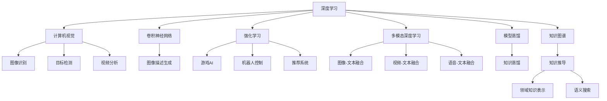

                 

# Andrej Karpathy：人工智能的科学意义

## 1. 背景介绍

### 1.1 问题由来
Andrej Karpathy是斯坦福大学计算机科学与工程系的教授，同时也是Facebook AI Research（FAIR）的高级研究员，他的研究方向覆盖深度学习、计算机视觉、强化学习等前沿领域。Karpathy在深度学习领域的贡献被广泛认可，尤其是在卷积神经网络(CNNs)、图像描述生成、多模态深度学习等方面的开创性工作。此外，Karpathy还是机器学习的科普作者，其个人网站上的博客以浅显易懂的语言介绍了大量深度学习的理论与实践，深受读者的喜爱。

本文旨在通过探讨Karpathy关于人工智能的科学意义及其相关思想，进一步理解深度学习与人工智能领域的深刻内涵，并展望未来的研究方向与发展趋势。

## 2. 核心概念与联系

### 2.1 核心概念概述
Karpathy关于人工智能的科学意义的探讨，涉及以下几个核心概念：

- **深度学习（Deep Learning）**：通过构建多层神经网络，从数据中自动提取和抽象出高层次特征。深度学习模型能够处理复杂数据，如图像、语音、文本等，广泛应用于计算机视觉、自然语言处理等领域。

- **计算机视觉（Computer Vision）**：研究如何使计算机"看"并理解视觉世界的技术。计算机视觉应用广泛，包括图像识别、目标检测、视频分析等。

- **卷积神经网络（Convolutional Neural Networks, CNNs）**：一种特殊类型的神经网络，擅长处理网格状数据（如图像、视频）。CNNs通过卷积和池化操作提取特征，显著提升了计算机视觉任务的性能。

- **强化学习（Reinforcement Learning, RL）**：一种基于奖励信号的学习方式，使智能体通过与环境的交互，学习最优策略以最大化累积奖励。强化学习在游戏、机器人控制、推荐系统等领域有重要应用。

- **多模态深度学习（Multimodal Deep Learning）**：研究如何将不同类型的数据（如图像、文本、语音）集成到单一的深度学习框架中，实现跨模态信息的有效融合。

- **模型蒸馏（Model Distillation）**：通过教师-学生模型的方式，利用复杂模型对简单模型进行知识迁移，提升简单模型的性能。模型蒸馏在提高模型效率和减少资源消耗方面有显著效果。

- **知识图谱（Knowledge Graphs）**：一种结构化的知识表示方式，将实体、关系、属性等组成网络图，用于模拟和推导知识。

### 2.2 概念间的关系
Karpathy关于人工智能的核心概念并非孤立存在，它们之间存在紧密的联系。以下通过Mermaid流程图来展示这些概念之间的关系：



这个流程图展示了大模型微调的各个核心概念，以及它们之间的联系。深度学习作为人工智能的基础，通过计算机视觉、卷积神经网络等技术在图像和视频处理中大放异彩。强化学习则在游戏AI、机器人控制、推荐系统等领域展现出强大的能力。多模态深度学习通过知识图谱和知识蒸馏等技术，进一步提升了模型的理解能力和泛化能力。这些概念相辅相成，共同推动了人工智能技术的进步。

## 3. 核心算法原理 & 具体操作步骤
### 3.1 算法原理概述
Karpathy在其著作和研究中，多次强调深度学习算法的基本原理。深度学习的核心在于构建多层神经网络，通过反向传播算法不断调整网络参数，最小化损失函数。其基本过程可以概括为以下几个步骤：

1. **模型构建**：根据具体任务选择适当的神经网络架构（如CNN、RNN、Transformer等）。
2. **数据预处理**：将原始数据转换为模型所需的格式，并进行归一化、标准化等预处理。
3. **训练过程**：将数据集分为训练集、验证集和测试集，使用反向传播算法最小化损失函数。
4. **模型评估**：在测试集上评估模型性能，计算准确率、召回率、F1值等指标。
5. **调参优化**：根据模型性能调整超参数，如学习率、批次大小、正则化系数等。

### 3.2 算法步骤详解
以计算机视觉任务中的图像分类为例，详细讲解Karpathy深度学习模型的操作步骤：

1. **数据准备**：使用ImageNet等数据集，将其分为训练集、验证集和测试集。
2. **模型选择**：选择ResNet、VGGNet等CNN架构作为基本模型。
3. **特征提取**：使用卷积层提取图像特征，通过池化层降维。
4. **全连接层**：将特征向量输入全连接层，进行分类预测。
5. **损失函数**：使用交叉熵损失函数计算模型预测与真实标签的差异。
6. **反向传播**：使用反向传播算法计算梯度，更新模型参数。
7. **迭代训练**：循环迭代多次训练，直到模型收敛。
8. **模型评估**：在测试集上评估模型性能，选择最优模型进行应用。

### 3.3 算法优缺点
深度学习算法具有以下优点：
- **自动特征提取**：无需手工设计特征，网络能够自动提取数据的高层次特征。
- **泛化能力强**：在大型数据集上进行预训练，模型具有较强的泛化能力。
- **计算效率高**：GPU、TPU等硬件的加速，使得深度学习训练和推理速度大幅提升。

同时，深度学习算法也存在一些缺点：
- **参数量大**：需要大量的参数进行训练，计算资源需求高。
- **梯度消失**：深层网络中梯度传播存在困难，需要特殊的激活函数和优化算法。
- **可解释性差**：深度学习模型难以解释其内部决策过程，存在"黑盒"问题。

### 3.4 算法应用领域
Karpathy关于深度学习的研究和应用领域非常广泛，包括但不限于以下几个方面：

- **计算机视觉**：图像分类、目标检测、图像描述生成、视频分析等。
- **自然语言处理**：机器翻译、文本生成、对话系统、问答系统等。
- **语音识别**：语音转文字、语音合成、语音情感识别等。
- **游戏AI**：AlphaGo等基于强化学习的AI游戏玩家。
- **推荐系统**：协同过滤、基于深度学习的推荐算法等。
- **机器人控制**：通过强化学习实现机器人动作优化和路径规划。

这些应用领域展示了深度学习在实际问题解决中的强大能力和广泛应用前景。

## 4. 数学模型和公式 & 详细讲解 & 举例说明

### 4.1 数学模型构建
以图像分类任务为例，构建深度学习模型的数学模型：

设输入图像为 $x$，输出类别为 $y$，模型为 $f_\theta(x)$，其中 $\theta$ 为模型参数。目标是最小化分类损失函数：

$$
\mathcal{L}(\theta) = -\frac{1}{N}\sum_{i=1}^N\log p(y_i \mid x_i)
$$

其中 $p(y_i \mid x_i)$ 表示模型对输入 $x_i$ 输出为类别 $y_i$ 的概率。

### 4.2 公式推导过程
以常用的交叉熵损失函数为例，推导其具体形式：

设模型对类别 $j$ 的预测概率为 $\hat{y}_j$，真实标签为 $y$，则交叉熵损失函数为：

$$
\mathcal{L}(\theta) = -\sum_{i=1}^N y_i \log \hat{y}_{y_i} + (1 - y_i) \log (1 - \hat{y}_{y_i})
$$

其中 $y_i$ 为类别 $i$ 的独热编码向量，$\hat{y}_{y_i}$ 为模型预测的类别 $y_i$ 的概率。

### 4.3 案例分析与讲解
以Karpathy关于图像描述生成的研究为例，探讨深度学习在自然语言处理中的应用。图像描述生成任务是将一张图像转换为自然语言描述的过程，是计算机视觉与自然语言处理的重要交叉点。Karpathy等人提出了一种基于双向循环神经网络（BiRNN）的框架，实现了图像描述生成。框架主要包含以下几个步骤：

1. **编码器**：将图像输入卷积神经网络，提取特征向量。
2. **解码器**：将特征向量输入BiRNN，逐步生成文本描述。
3. **目标函数**：定义目标函数，包括交叉熵损失和自回归损失。
4. **训练过程**：使用反向传播算法最小化损失函数。
5. **解码策略**：采用 beam search 或 greedy search 策略，选择最有可能的文本序列。

## 5. 项目实践：代码实例和详细解释说明

### 5.1 开发环境搭建
要使用Karpathy的深度学习算法，需要以下开发环境：

1. **Python**：作为编程语言，Python拥有丰富的科学计算库和深度学习框架。
2. **PyTorch**：Karpathy的深度学习研究多使用PyTorch框架，支持动态图和GPU加速。
3. **Caffe2**：Karpathy也使用Caffe2框架进行计算机视觉任务，具有高效计算能力和强大的图像处理能力。
4. **TensorFlow**：Karpathy的研究中也涉及TensorFlow，支持分布式训练和多种硬件平台。

完成环境搭建后，可以开始进行深度学习项目实践。

### 5.2 源代码详细实现
以下以图像分类为例，展示Karpathy的深度学习模型的源代码实现：

```python
import torch
import torch.nn as nn
import torch.optim as optim
from torchvision import datasets, transforms

# 定义网络结构
class Net(nn.Module):
    def __init__(self):
        super(Net, self).__init__()
        self.conv1 = nn.Conv2d(3, 64, kernel_size=3, stride=1, padding=1)
        self.conv2 = nn.Conv2d(64, 128, kernel_size=3, stride=1, padding=1)
        self.pool = nn.MaxPool2d(kernel_size=2, stride=2)
        self.fc1 = nn.Linear(128*7*7, 1024)
        self.fc2 = nn.Linear(1024, 10)

    def forward(self, x):
        x = self.pool(F.relu(self.conv1(x)))
        x = self.pool(F.relu(self.conv2(x)))
        x = x.view(-1, 128*7*7)
        x = F.relu(self.fc1(x))
        x = self.fc2(x)
        return x

# 加载数据集
train_dataset = datasets.CIFAR10(root='./data', train=True, download=True, transform=transforms.Compose([
    transforms.Resize((64, 64)),
    transforms.ToTensor(),
    transforms.Normalize((0.5, 0.5, 0.5), (0.5, 0.5, 0.5))
]))

test_dataset = datasets.CIFAR10(root='./data', train=False, download=True, transform=transforms.Compose([
    transforms.Resize((64, 64)),
    transforms.ToTensor(),
    transforms.Normalize((0.5, 0.5, 0.5), (0.5, 0.5, 0.5))
]))

# 定义模型、损失函数和优化器
model = Net()
criterion = nn.CrossEntropyLoss()
optimizer = optim.SGD(model.parameters(), lr=0.01, momentum=0.9)

# 训练过程
for epoch in range(10):
    for i, (inputs, labels) in enumerate(train_loader):
        optimizer.zero_grad()
        outputs = model(inputs)
        loss = criterion(outputs, labels)
        loss.backward()
        optimizer.step()
        print(f'Epoch {epoch+1}, Batch {i+1}, Loss: {loss.item()}')

# 测试过程
correct = 0
total = 0
with torch.no_grad():
    for inputs, labels in test_loader:
        outputs = model(inputs)
        _, predicted = torch.max(outputs.data, 1)
        total += labels.size(0)
        correct += (predicted == labels).sum().item()
print(f'Accuracy: {(100 * correct / total)}%')
```

### 5.3 代码解读与分析
上述代码实现了使用PyTorch框架的图像分类任务。代码主要分为数据加载、模型定义、模型训练和测试四个部分。数据加载使用CIFAR-10数据集，并进行归一化处理。模型定义包括卷积层、池化层、全连接层等。训练过程使用SGD优化器进行参数更新，测试过程计算模型在测试集上的准确率。

## 6. 实际应用场景
### 6.1 智能安防监控
深度学习在智能安防监控中的应用非常广泛，可以通过图像识别、目标检测等技术，实时监控视频流，自动识别异常行为，及时报警。Karpathy的计算机视觉技术在这一领域有重要应用。

### 6.2 医疗影像诊断
深度学习在医疗影像分析中的应用也非常显著，通过卷积神经网络对医学图像进行分类和分割，帮助医生进行病灶检测和诊断。Karpathy的研究中也涉及医学影像分析的深度学习算法。

### 6.3 自动驾驶
自动驾驶系统依赖于计算机视觉和深度学习技术，通过对路标、行人、车辆等进行识别和分类，实现自动驾驶决策。Karpathy的游戏AI和强化学习技术在自动驾驶中也有广泛应用。

### 6.4 未来应用展望
Karpathy关于深度学习的研究成果表明，深度学习在计算机视觉、自然语言处理、强化学习等领域有着广泛的应用前景。未来，深度学习将继续推动人工智能技术的发展，涉及更多行业和应用场景。

## 7. 工具和资源推荐
### 7.1 学习资源推荐
Karpathy的深度学习研究涉及广泛的技术领域，以下资源可供参考：

1. **《Deep Learning》（Ian Goodfellow等著）**：深度学习领域的经典教材，深入浅出地介绍了深度学习的基本概念和算法。
2. **《Neural Networks and Deep Learning》（Michael Nielsen著）**：介绍深度学习基本原理的在线书籍，通俗易懂。
3. **Kaggle比赛**：Karpathy曾参与多个Kaggle比赛，了解其解决问题的思路和方法。
4. **PyTorch官方文档**：PyTorch框架的官方文档，提供了详细的代码实现和教程。
5. **Google Colab**：Google提供的免费Jupyter Notebook环境，支持GPU计算，便于学习和实验。

### 7.2 开发工具推荐
深度学习研究需要以下开发工具：

1. **PyTorch**：Karpathy的许多研究都使用PyTorch框架，具有高效的动态图和GPU计算能力。
2. **Caffe2**：Caffe2在计算机视觉领域有广泛应用，支持高效的图像处理和模型优化。
3. **TensorFlow**：TensorFlow是另一个流行的深度学习框架，支持分布式计算和多种硬件平台。
4. **Jupyter Notebook**：支持Python和R语言的多功能开发工具，便于编写和调试代码。

### 7.3 相关论文推荐
Karpathy关于深度学习的研究成果丰硕，以下论文可供参考：

1. **"Deep Residual Learning for Image Recognition"**：提出ResNet架构，解决了深层网络训练中的梯度消失问题。
2. **"Learning to Interpret CNN Features"**：使用卷积神经网络进行图像描述生成，实现了自然语言处理与计算机视觉的结合。
3. **"Dynamic RNN Architectures for Video Prediction"**：研究了基于双向循环神经网络的视频预测模型。
4. **"Adversarial Examples for Adversarial Neural Networks"**：研究了对抗性样本对深度学习模型的影响，提出了对抗性训练方法。

## 8. 总结：未来发展趋势与挑战

### 8.1 研究成果总结
Karpathy关于深度学习的科研成果丰硕，涵盖计算机视觉、自然语言处理、强化学习等多个领域。这些成果不仅推动了学术研究的发展，也为深度学习在实际应用中的广泛应用奠定了基础。

### 8.2 未来发展趋势
未来，深度学习将继续在人工智能领域发挥重要作用，涉及更多行业和应用场景。以下趋势值得关注：

1. **跨模态深度学习**：多模态数据的融合将成为深度学习的重要研究方向，提升模型的综合理解和应用能力。
2. **知识图谱与深度学习结合**：通过知识图谱与深度学习的结合，增强模型的知识推理和泛化能力。
3. **自动驾驶与强化学习**：自动驾驶技术将进一步发展，强化学习在自动驾驶中的应用也将更加广泛。
4. **AI在医疗领域的应用**：深度学习在医疗影像诊断、病理学分析等领域将有更广泛的应用。

### 8.3 面临的挑战
尽管深度学习在多个领域取得了显著进展，但仍面临诸多挑战：

1. **计算资源需求高**：深度学习模型参数量庞大，计算资源需求高，需要高效的硬件支持。
2. **模型可解释性差**：深度学习模型存在"黑盒"问题，难以解释其内部决策过程。
3. **数据隐私和安全**：深度学习模型需要大量数据进行训练，数据隐私和安全问题需得到充分重视。
4. **公平性和伦理问题**：深度学习模型可能存在偏见，公平性和伦理问题需得到充分考量。

### 8.4 研究展望
面对这些挑战，未来的研究方向应包括以下几个方面：

1. **模型蒸馏与知识蒸馏**：通过模型蒸馏和知识蒸馏，提升模型的推理能力和泛化能力。
2. **自监督学习与无监督学习**：探索自监督和无监督学习范式，降低对标注数据的依赖。
3. **公平性与伦理**：在模型训练和应用中，充分考虑公平性和伦理问题，避免偏见和歧视。
4. **跨模态数据融合**：研究跨模态数据融合方法，提升模型的综合理解和应用能力。

## 9. 附录：常见问题与解答

**Q1：深度学习算法是否适用于所有应用场景？**

A: 深度学习算法并非适用于所有应用场景。对于一些数据结构简单、特征提取容易的场景，传统的机器学习方法可能更为适用。而对于需要处理大规模、复杂数据的任务，深度学习算法表现更为优秀。

**Q2：深度学习算法需要大量数据进行训练，如何克服数据瓶颈？**

A: 数据瓶颈可以通过数据增强、迁移学习、自监督学习等方法进行缓解。数据增强可以在不增加数据量的前提下，扩充训练集的多样性。迁移学习可以利用已有的大规模数据集，进行知识迁移。自监督学习则可以在无监督数据的帮助下，提升模型的泛化能力。

**Q3：深度学习模型为何存在"黑盒"问题？**

A: 深度学习模型通常包含大量隐层神经元，内部决策过程复杂，难以解释其推理逻辑。这是深度学习模型的固有特性，可以通过模型蒸馏、可视化等方法，增强模型的可解释性。

**Q4：深度学习模型如何应对公平性和伦理问题？**

A: 深度学习模型可能存在偏见，需进行公平性和伦理问题的研究。可以通过引入公平性约束、多样性增强等方法，提升模型的公平性和伦理安全性。同时，进行数据隐私保护和伦理审查，确保模型的安全性和可控性。

**Q5：深度学习技术未来将如何发展？**

A: 未来深度学习技术将继续在多个领域发挥重要作用。随着计算资源的提升和数据量的增加，深度学习模型的规模和性能将不断提升。跨模态深度学习、知识图谱与深度学习的结合等研究方向，将带来更多突破和创新。同时，深度学习技术也将更加注重公平性、伦理性和安全性，确保其健康发展。

作者：禅与计算机程序设计艺术 / Zen and the Art of Computer Programming

