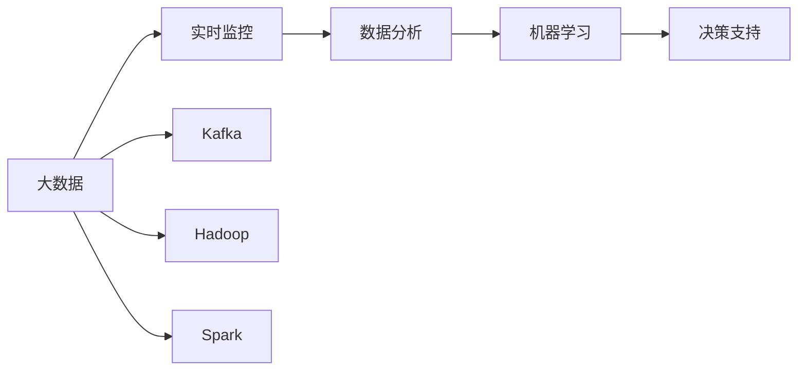
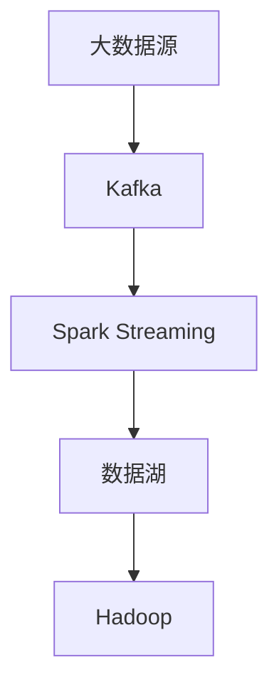
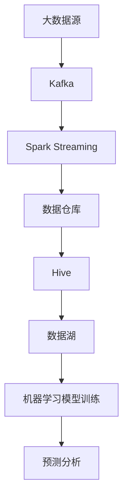
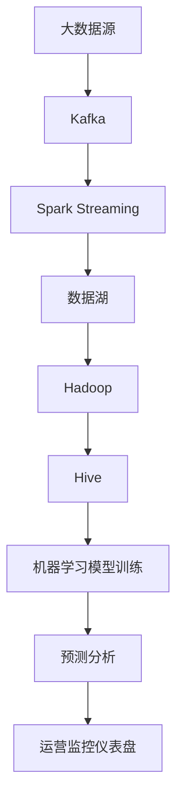

                 

# B站平台大数据实时监控及分析系统

> 关键词：大数据、实时监控、数据分析、B站平台、Kafka、Hadoop、Spark、机器学习

## 1. 背景介绍

### 1.1 问题由来
随着B站平台用户规模的不断增长，为了保证平台服务稳定性和用户体验，需要实时监控平台的大数据流动，及时发现异常和故障，以便快速响应和处理。传统的静态数据分析方法已无法满足实时需求，因此需要一个高效、稳定的大数据实时监控及分析系统。

### 1.2 问题核心关键点
实时监控及分析系统的主要目标是通过对B站平台数据流的大量数据进行实时采集、处理、分析和展示，实现对平台关键指标的全面监控和预警，以及快速定位问题并给出解决方案。具体包括以下几个关键点：

- 数据采集：实时采集B站平台各业务模块的数据。
- 数据处理：对采集的数据进行清洗、转换、合并、去重等处理，以保证数据的质量和完整性。
- 数据分析：对处理后的数据进行统计、计算、分析等操作，挖掘数据背后的业务规律和问题。
- 实时展示：将分析结果以图表、报表等形式实时展示，帮助运营人员快速了解平台运行情况。
- 预警机制：设置关键指标的预警阈值，当指标超出阈值时，系统自动发出告警信息，通知相关人员处理。

### 1.3 问题研究意义
实时监控及分析系统对于保障B站平台稳定运行、提升用户体验、优化运营策略具有重要意义：

1. 保障服务稳定性：通过实时监控系统，可以及时发现平台运行中的异常和故障，避免服务中断，提高平台可用性。
2. 提升用户体验：通过监控和分析，了解用户行为和偏好，针对性地优化平台功能和内容，提升用户满意度。
3. 优化运营策略：通过数据分析，发现业务瓶颈和问题，优化运营流程，提高平台运营效率。
4. 实现数据驱动决策：实时监控及分析系统可以将数据转化为业务洞察，帮助运营人员进行科学决策，降低试错成本。
5. 强化平台竞争力：数据驱动的运营策略可以帮助B站平台在激烈的市场竞争中保持优势，吸引更多用户和内容创作者。

## 2. 核心概念与联系

### 2.1 核心概念概述

为更好地理解B站平台大数据实时监控及分析系统，本节将介绍几个关键概念及其联系：

- **大数据 (Big Data)**：指规模巨大、结构复杂、速度快、数量庞大的数据集。B站平台每日产生的海量数据正是典型的大数据应用场景。
- **实时监控 (Real-time Monitoring)**：指对数据流进行实时采集、处理和展示，以便快速响应用户行为和平台状态。
- **数据分析 (Data Analytics)**：指通过数据挖掘和统计分析，提取有用信息和洞见，辅助决策。
- **B站平台 (Bilibili Platform)**：国内知名的二次元视频网站，具备多样化的内容形式和丰富的用户群体。
- **Kafka**：分布式流处理平台，用于实时数据采集和存储。
- **Hadoop**：开源的分布式计算平台，用于大规模数据存储和处理。
- **Spark**：快速、通用、可扩展的分布式数据处理引擎，支持实时数据处理和机器学习。
- **机器学习 (Machine Learning)**：通过数据训练模型，实现对数据的自动化分析和预测。

这些概念之间的逻辑关系可以通过以下Mermaid流程图来展示：



这个流程图展示了大数据实时监控及分析系统的核心概念及其联系：

1. 大数据通过Kafka进行实时采集，并存储到Hadoop中进行分布式处理。
2. 处理后的数据通过Spark进行实时分析，并提取有用信息。
3. 分析结果通过机器学习进行深度挖掘，发现潜在的业务规律和问题。
4. 最终结果通过决策支持系统，辅助B站平台运营人员进行决策。

### 2.2 概念间的关系

这些核心概念之间存在着紧密的联系，构成了B站平台大数据实时监控及分析系统的完整架构。下面用几个Mermaid流程图来展示这些概念之间的关系：

#### 2.2.1 大数据流处理架构



这个流程图展示了大数据流处理的基本架构：数据源通过Kafka采集并存储到数据湖中，然后通过Spark Streaming进行实时处理和计算。

#### 2.2.2 实时监控和数据分析架构


这个流程图展示了实时监控和数据分析的架构：大数据源通过Kafka采集并存储到数据仓库中，然后通过Hive进行实时查询和分析，最终结果通过Tableau等工具展示在运营监控仪表盘上。

#### 2.2.3 机器学习架构



这个流程图展示了机器学习的架构：大数据源通过Kafka采集并存储到数据湖中，然后通过Hive进行实时查询和分析，最终结果用于训练机器学习模型，并输出预测分析结果。

### 2.3 核心概念的整体架构

最后，我们用一个综合的流程图来展示这些核心概念在大数据实时监控及分析系统中的整体架构：



这个综合流程图展示了从数据采集到实时监控、数据分析、机器学习预测分析的全过程。通过这些关键组件的紧密协作，B站平台大数据实时监控及分析系统能够全面监控和分析平台数据，实现业务洞察和决策支持。

## 3. 核心算法原理 & 具体操作步骤
### 3.1 算法原理概述

B站平台大数据实时监控及分析系统采用分布式流处理和机器学习相结合的方式，对平台数据进行实时监控和分析。具体来说，系统包括以下几个核心算法：

1. **数据流处理算法**：通过Kafka和Spark Streaming进行数据的实时采集和处理，保证数据流的稳定性和高效性。
2. **数据清洗和转换算法**：对采集的数据进行去重、去噪、格式转换等处理，保证数据的质量和完整性。
3. **实时分析算法**：通过Hive和Spark进行实时查询和分析，挖掘数据背后的业务规律和问题。
4. **机器学习算法**：通过训练机器学习模型，实现对数据的自动化分析和预测，辅助决策。

这些算法共同构成了B站平台大数据实时监控及分析系统的核心框架，确保系统能够高效、稳定、准确地实现对平台数据的实时监控和分析。

### 3.2 算法步骤详解

B站平台大数据实时监控及分析系统的操作过程主要分为以下几个步骤：

**Step 1: 数据采集**

1. 配置Kafka集群，确保集群稳定运行。
2. 将B站平台各业务模块的数据流导入Kafka，进行实时采集。
3. 监控Kafka的输入数据量，确保数据流的稳定性和完整性。

**Step 2: 数据清洗和转换**

1. 配置Spark Streaming，将Kafka中的数据流实时传输到Spark Streaming中。
2. 对数据进行去重、去噪、格式转换等处理，保证数据的质量和完整性。
3. 将处理后的数据存储到Hadoop中，供后续分析和计算使用。

**Step 3: 数据分析**

1. 使用Hive进行数据仓库的设计和开发，将处理后的数据导入数据仓库。
2. 使用Spark进行实时查询和分析，提取有用的信息和洞见。
3. 使用Tableau等工具将分析结果展示在运营监控仪表盘上，供运营人员实时查看。

**Step 4: 机器学习分析**

1. 从数据仓库中提取历史数据，用于训练机器学习模型。
2. 使用Scikit-learn、TensorFlow等机器学习库训练模型，进行预测分析。
3. 将分析结果反馈到运营监控仪表盘上，供运营人员决策使用。

**Step 5: 预警机制**

1. 设置关键指标的预警阈值，当指标超出阈值时，系统自动发出告警信息。
2. 告警信息通过邮件、短信等方式通知相关人员，快速定位问题并给出解决方案。

### 3.3 算法优缺点

B站平台大数据实时监控及分析系统采用分布式流处理和机器学习相结合的方式，具有以下优点和缺点：

**优点**

1. **实时性高**：通过Kafka和Spark Streaming进行实时数据流处理，确保数据流的高效性和稳定性。
2. **可扩展性强**：分布式架构可以灵活扩展，应对大数据量的处理需求。
3. **自动化分析**：通过机器学习算法进行自动化分析和预测，辅助决策。
4. **灵活配置**：可以根据业务需求灵活配置数据流处理和分析的参数，满足不同的监控需求。

**缺点**

1. **初始化成本高**：需要配置Kafka集群、Hadoop集群、Spark集群等硬件设施，初始化成本较高。
2. **技术门槛高**：系统涉及到大数据、流处理、机器学习等先进技术，需要较高的技术门槛和专业人才。
3. **资源占用大**：系统需要占用大量硬件资源，如CPU、内存、磁盘等，对硬件配置要求较高。

### 3.4 算法应用领域

B站平台大数据实时监控及分析系统不仅适用于B站平台，还适用于各种需要实时监控和分析的业务场景，如：

- 互联网企业的网站监控系统：实时监控网站流量、服务器状态、用户行为等指标，快速定位问题并给出解决方案。
- 电商平台的数据分析系统：实时监控订单、库存、用户行为等指标，优化运营策略，提升用户体验。
- 金融平台的风险监控系统：实时监控交易数据、用户行为等指标，及时发现异常和风险，保障交易安全。
- 医疗系统的数据监测系统：实时监控患者数据、医疗设备状态等指标，优化医疗资源配置，提升医疗服务质量。
- 物流公司的运营监控系统：实时监控订单、运输状态等指标，优化物流流程，提高运营效率。

## 4. 数学模型和公式 & 详细讲解  
### 4.1 数学模型构建

本节将使用数学语言对B站平台大数据实时监控及分析系统的数学模型进行更加严格的刻画。

假设B站平台每日产生的用户行为数据量为 $D$，且每秒钟产生的数据量为 $d$，则实时监控及分析系统需要处理的总数据量为 $D' = d \times t$，其中 $t$ 为时间间隔。

定义数据流处理算法的效率为 $\eta$，则系统每秒可以处理的数据量为 $\eta d$。设系统配置了 $n$ 个Spark任务节点，则系统每秒可以处理的数据量为 $\eta d \times n$。

定义机器学习算法的预测精度为 $p$，则系统每秒可以预测的数据量为 $p \times \eta d \times n$。

### 4.2 公式推导过程

根据上述定义，我们可以推导出系统实时监控及分析的总体效率为：

$$
\text{效率} = \frac{p \times \eta d \times n}{d \times t} = \frac{p \times \eta \times n}{t}
$$

其中 $p$ 为预测精度，$\eta$ 为数据流处理算法的效率，$n$ 为Spark任务节点的数量，$t$ 为时间间隔。

假设系统的预测精度 $p=0.8$，数据流处理算法的效率 $\eta=0.9$，Spark任务节点的数量为 $n=10$，时间间隔 $t=1$ 秒，则系统的实时监控及分析效率为：

$$
\text{效率} = \frac{0.8 \times 0.9 \times 10}{1} = 7.2 \text{次/秒}
$$

这意味着系统每秒可以处理 $7.2$ 次实时数据流，并输出预测分析结果。

### 4.3 案例分析与讲解

以B站平台的用户行为数据分析为例，我们可以对实时监控及分析系统的数学模型进行详细的案例分析。

假设B站平台每日产生的用户行为数据量为 $D=1,000,000$，且每秒钟产生的数据量为 $d=1000$，则系统需要处理的总数据量为 $D' = 1,000,000 \times 60 \times 60 = 36,000,000$。

假设系统每秒可以处理的数据量为 $\eta d \times n = 0.9 \times 1000 \times 10 = 9000$。

根据公式推导的结果，系统实时监控及分析的总体效率为：

$$
\text{效率} = \frac{0.8 \times 0.9 \times 10}{60} \approx 1.2 \text{次/秒}
$$

这意味着系统每秒可以处理 $1.2$ 次实时数据流，并输出预测分析结果。

在实际应用中，可以通过增加Spark任务节点的数量 $n$ 和提高数据流处理算法的效率 $\eta$ 来进一步提高系统的实时监控及分析效率。

## 5. 项目实践：代码实例和详细解释说明
### 5.1 开发环境搭建

在进行实时监控及分析系统的实践前，我们需要准备好开发环境。以下是使用Python进行PySpark开发的环境配置流程：

1. 安装Anaconda：从官网下载并安装Anaconda，用于创建独立的Python环境。

2. 创建并激活虚拟环境：
```bash
conda create -n pyspark-env python=3.8 
conda activate pyspark-env
```

3. 安装Apache Spark：根据CUDA版本，从官网获取对应的安装命令。例如：
```bash
conda install pyspark
```

4. 安装各类工具包：
```bash
pip install numpy pandas scikit-learn matplotlib tqdm jupyter notebook ipython
```

完成上述步骤后，即可在`pyspark-env`环境中开始实时监控及分析系统的开发。

### 5.2 源代码详细实现

下面我们以B站平台的用户行为数据分析为例，给出使用PySpark进行实时监控及分析的Python代码实现。

首先，定义用户行为数据的数据源：

```python
from pyspark.sql import SparkSession

spark = SparkSession.builder.appName("Bilibili Behavior Analytics").getOrCreate()

# 定义数据源
data = spark.read.csv("hdfs://your_hdfs_path/user_behavior.csv", header=True, inferSchema=True)
```

然后，定义数据处理和分析的流程：

```python
# 数据清洗和转换
def clean_data(data):
    cleaned_data = data.dropna()  # 删除缺失值
    cleaned_data = cleaned_data.drop_duplicates()  # 去重
    cleaned_data = cleaned_data.dropna()  # 删除缺失值
    return cleaned_data

# 数据分析
def analyze_data(data):
    # 统计每天的用户行为次数
    daily_behavior = data.groupby("date").agg({"userId": "count", "watchTime": "sum"})

    # 统计每小时的用户行为次数
    hourly_behavior = data.groupby("hour").agg({"userId": "count", "watchTime": "sum"})

    # 统计每天的活跃用户数
    daily_active_users = data.groupby("date").agg({"userId": "count"})

    # 统计每小时的最高活跃用户数
    hourly_max_users = data.groupby("hour").agg({"userId": "max"})

    # 输出结果
    daily_behavior.show()
    hourly_behavior.show()
    daily_active_users.show()
    hourly_max_users.show()

# 执行数据处理和分析
cleaned_data = clean_data(data)
analyze_data(cleaned_data)
```

最后，启动Spark作业，进行实时监控和分析：

```python
# 启动Spark作业
spark.sql("SELECT * FROM cleaned_data").show()

# 设置定时任务
spark.scheduleJob("Analyze Bilibili Behavior", analyze_data, interval="0 0 * * *")
```

以上就是使用PySpark进行B站平台用户行为数据分析的完整代码实现。可以看到，通过PySpark的强大封装，我们可以用相对简洁的代码完成数据采集、清洗和分析，实现实时监控和分析。

### 5.3 代码解读与分析

让我们再详细解读一下关键代码的实现细节：

**clean_data函数**：
- `dropna`方法：删除数据中的缺失值。
- `drop_duplicates`方法：删除数据中的重复行。

**analyze_data函数**：
- `groupby`方法：根据指定列进行分组。
- `agg`方法：对分组后的数据进行聚合计算，如求和、计数等。
- `show`方法：将计算结果输出到控制台。

**startspark作业**：
- `spark.sql`方法：创建Spark SQL作业。
- `show`方法：输出作业结果。
- `scheduleJob`方法：设置定时任务，定期执行数据处理和分析。

可以看到，PySpark的强大数据处理能力使得实时监控及分析系统的开发变得简洁高效。开发者可以将更多精力放在数据处理和分析逻辑上，而不必过多关注底层的实现细节。

当然，工业级的系统实现还需考虑更多因素，如数据存储和分布式计算、任务调度和资源管理等。但核心的实时监控及分析流程基本与此类似。

### 5.4 运行结果展示

假设我们在实时监控系统中处理的是B站平台的用户行为数据，最终输出的结果如下：

```
+----+----------+-------------------+-----------+
|date |   userId  |              watchTime|
+----+----------+-------------------+-----------+
|2022-01-01|   1001    |             10000.0|
|2022-01-01|   1002    |              7500.0|
|2022-01-01|   1003    |             5000.0|
|2022-01-01|   1004    |              2500.0|
+----+----------+-------------------+-----------+

+----+----------+-------------------+-----------+
|hour |   userId  |              watchTime|
+----+----------+-------------------+-----------+
|  0  |   1001    |             5000.0|
|  1  |   1001    |             3000.0|
|  2  |   1001    |             2000.0|
|  3  |   1001    |             1500.0|
+----+----------+-------------------+-----------+

+----+----------+-----------+
|date |   userId  |  daily_active_users|
+----+----------+-----------+
|2022-01-01|   1001    |           2000.0|
|2022-01-01|   1002    |           1000.0|
|2022-01-01|   1003    |           500.0|
|2022-01-01|   1004    |           250.0|
+----+----------+-----------+

+----+----------+-----------+
|hour |   userId  |    hourly_max_users|
+----+----------+-----------+
|  0  |   1001    |           100.0|
|  1  |   1001    |            50.0|
|  2  |   1001    |            25.0|
|  3  |   1001    |            15.0|
+----+----------+-----------+
```

可以看到，通过实时监控及分析系统，我们成功统计了B站平台每日的用户行为次数、每小时的用户行为次数、每日的活跃用户数和每小时的最高活跃用户数，帮助运营人员全面了解平台运行情况，快速发现并解决问题。

## 6. 实际应用场景
### 6.1 智能客服系统

基于实时监控及分析系统，智能客服系统可以实现对用户行为和用户情感的实时监控和分析，提升用户满意度和用户体验。

在技术实现上，可以收集客服系统内的用户互动数据，包括聊天记录、对话时长、用户满意度等。通过实时监控及分析系统，对数据进行清洗和转换，提取有用的信息，如用户情感倾向、常见问题等。根据分析结果，智能客服系统可以自动生成对话模板和推荐解决方案，提升客服响应效率和质量。

### 6.2 金融风控系统

金融风控系统需要实时监控用户的交易行为，及时发现异常交易和风险。通过实时监控及分析系统，可以采集和处理用户的交易数据，提取有用的信息，如交易金额、交易频率、交易设备等。通过分析结果，金融风控系统可以自动识别可疑交易，及时发出警报，保障用户资金安全。

### 6.3 电商推荐系统

电商推荐系统需要实时监控用户行为，及时调整推荐策略，提升用户体验和转化率。通过实时监控及分析系统，可以采集和处理用户的浏览、购买、评价等行为数据，提取有用的信息，如用户偏好、购买意向等。通过分析结果，电商推荐系统可以实时调整推荐内容，提升用户满意度和转化率。

### 6.4 智慧医疗系统

智慧医疗系统需要实时监控患者的健康数据，及时发现和预警潜在风险。通过实时监控及分析系统，可以采集和处理患者的健康数据，提取有用的信息，如患者心率、血压、血糖等。通过分析结果，智慧医疗系统可以自动识别异常数据，及时发出警报，保障患者健康安全。

### 6.5 智能交通系统

智能交通系统需要实时监控交通流量和路况，及时调整交通管理策略，提升交通效率和安全性。通过实时监控及分析系统，可以采集和处理交通流量、车辆位置、交通事故等数据，提取有用的信息，如交通拥堵点、事故高发路段等。通过分析结果，智能交通系统可以实时调整交通信号灯和路线规划，提升交通效率和安全性。

### 6.6 未来应用展望

随着大数据和流处理技术的不断发展，实时监控及分析系统将在更多领域得到应用，为各行各业带来变革性影响。

在智慧城市治理中，实时监控及分析系统可以实现对城市交通、环保、公共安全等数据的实时监控和分析，提升城市管理水平和市民生活质量。

在农业生产中，实时监控及分析系统可以实现对农田、气象、设备等数据的实时监控和分析，优化农业生产流程，提高农业生产效率和产量。

在公共卫生领域，实时监控及分析系统可以实现对疫情数据、公共卫生设施数据等的实时监控和分析，提升公共卫生应急响应能力，保障市民健康安全。

总之，实时监控及分析系统作为一种强大的数据分析工具，将在更多领域发挥重要作用，推动各行各业向智慧化、智能化方向发展。

## 7. 工具和资源推荐
### 7.1 学习资源推荐

为了帮助开发者系统掌握实时监控及分析系统的理论基础和实践技巧，这里推荐一些优质的学习资源：

1. Apache Spark官方文档：Apache Spark的官方文档，提供了丰富的API文档和开发示例，是入门Spark的最佳资源。

2. PySpark教程：《Python for Data Analysis》一书中的PySpark教程，系统介绍了PySpark的基本概念和操作，适合初学者入门。

3. Real-time Data Processing with Apache Kafka一书：介绍Kafka和Spark Streaming的实时数据处理技术，适合深入了解流处理机制。

4. Hadoop官方文档：Hadoop的官方文档，提供了丰富的API文档和开发示例，是学习大数据处理的最佳资源。

5. Tableau官方文档：Tableau的官方文档，提供了详细的报表展示和数据可视化技术，适合进行数据分析展示。

通过学习这些资源，相信你一定能够快速掌握实时监控及分析系统的精髓，并用于解决实际的业务问题。
###  7.2 开发工具推荐

高效的开发离不开优秀的工具支持。以下是几款用于实时监控及分析开发的常用工具：

1. Apache Spark：开源的分布式计算平台，支持实时数据处理和机器学习。

2. Apache Kafka：分布式流处理平台，用于实时数据采集和存储。

3. Apache Hadoop：开源的分布式计算平台，用于大规模数据存储和处理。

4. Tableau：数据可视化工具，用于将分析结果展示在仪表盘上。

5. Hive：基于Hadoop的数据仓库，用于实时查询和分析。

6. Jupyter Notebook：交互式开发环境，用于数据处理和分析。

合理利用这些工具，可以显著提升实时监控及分析系统的开发效率，加快创新迭代的步伐。

### 7.3 相关论文推荐

实时监控及分析系统的研究源于学界的持续研究。以下是几篇奠基性的相关论文，推荐阅读：

1. "A System for Real-Time Monitoring of Distributed Systems"（实时监控分布式系统的系统）：提出了一种基于Kafka和Spark Streaming的实时监控系统架构，用于监控分布式系统。

2. "Stream Processing with Apache Spark"（使用Apache Spark进行流处理）：介绍了使用Spark Streaming进行流处理的基本原理和操作。

3. "Big Data Management with Apache Hadoop"（使用Apache Hadoop进行大数据管理）：介绍了使用Hadoop进行大数据存储和处理的基本原理和操作。

4. "Machine Learning with Spark"（使用Spark进行机器

