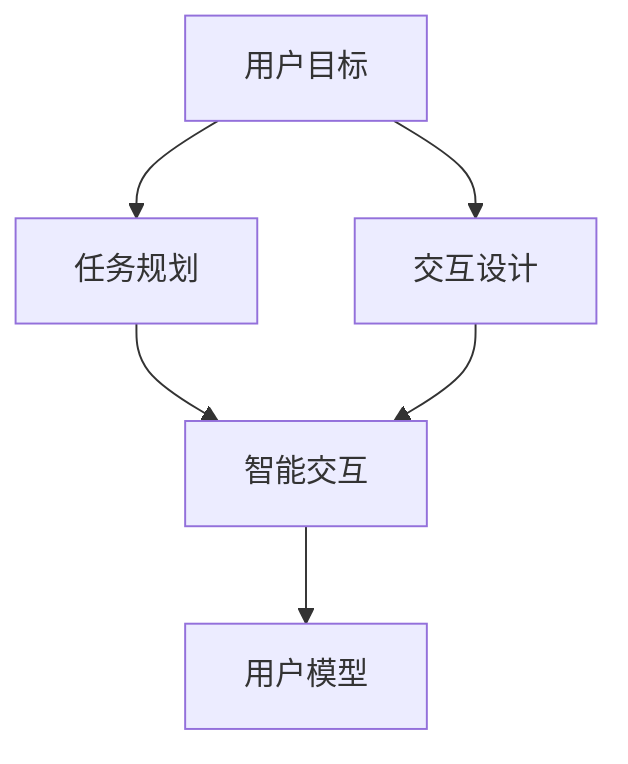
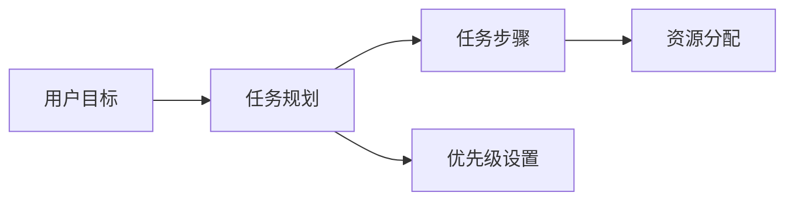
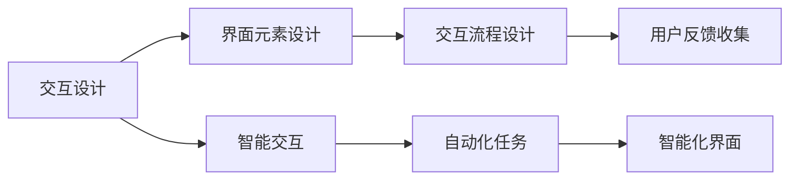
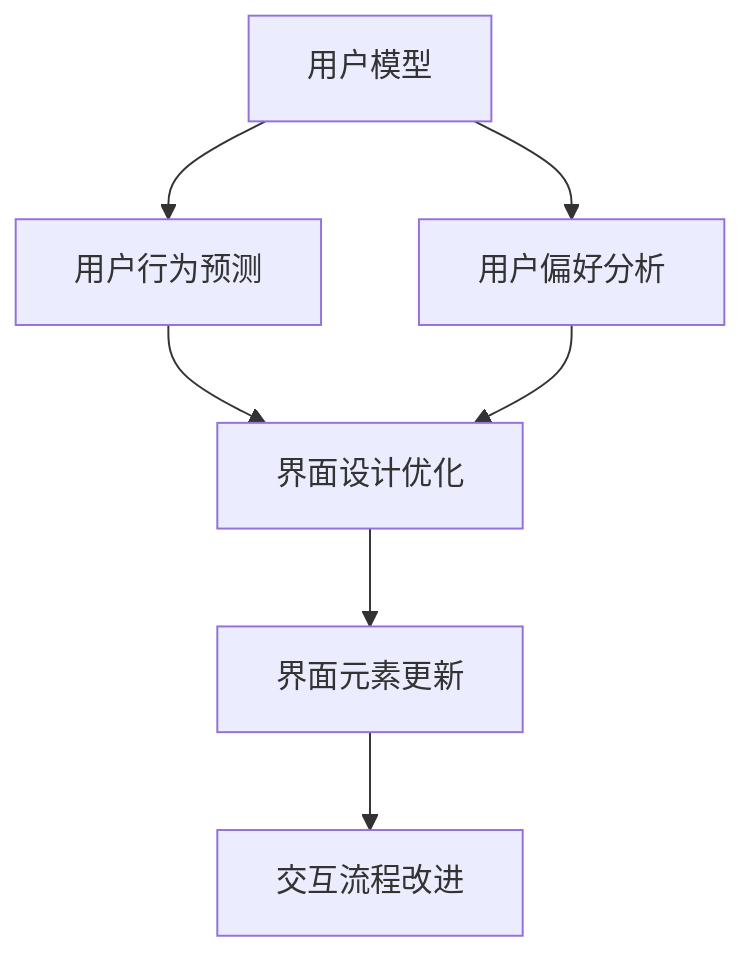
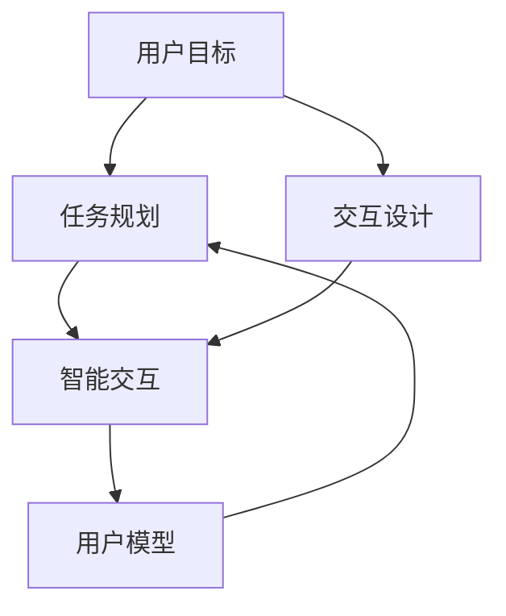

                 

# CUI中的用户目标与任务实现

> 关键词：计算机用户界面(Computer User Interface, CUI), 用户目标(User Goals), 任务规划(Task Planning), 交互设计(Interaction Design), 用户模型(User Model), 智能交互(Smart Interaction)

## 1. 背景介绍

### 1.1 问题由来
随着计算机技术的不断发展和普及，计算机用户界面(CUI)在人们生活和工作中扮演了越来越重要的角色。然而，尽管CUI在功能上已经越来越强大，但仍然存在诸多问题和挑战，使得用户在使用过程中遇到诸多困难。主要问题包括：
1. **用户任务实现效率低**：许多用户在使用CUI时，往往需要花费大量时间在繁琐的点击、拖拽等操作上，导致任务完成效率低下。
2. **用户误操作率高**：用户在使用CUI时，容易误点击、误操作，导致任务失败。
3. **用户任务规划困难**：用户在使用CUI时，往往需要花费大量时间进行任务规划，缺乏自动化的辅助工具。
4. **用户界面设计不合理**：许多CUI的设计不合理，用户难以直观地理解和使用。

这些问题严重影响了用户的体验和效率，需要从用户目标和任务实现的角度出发，改进CUI的设计和使用方式。

### 1.2 问题核心关键点
CUI中的用户目标与任务实现问题，核心在于如何更好地理解用户的目标，并帮助用户高效、准确地完成任务。具体而言，包括以下几个关键点：
1. **用户目标建模**：准确地建模用户的目标，理解用户需求和期望。
2. **任务规划优化**：优化任务规划过程，提高任务执行效率。
3. **交互设计改进**：改进交互设计，减少误操作和提高操作效率。
4. **智能交互系统**：开发智能交互系统，提升任务完成的自动化和智能化水平。
5. **用户模型更新**：动态更新用户模型，适应用户的偏好和行为变化。

这些关键点共同构成了CUI中用户目标与任务实现的核心内容，通过系统性地解决这些问题，可以显著提升用户的使用体验和效率。

### 1.3 问题研究意义
研究CUI中的用户目标与任务实现问题，具有重要意义：
1. **提升用户体验**：改善用户界面设计，减少用户误操作，提高用户任务完成效率，提升用户体验。
2. **提高用户满意度**：通过智能交互系统和任务规划优化，减少用户心理负担，提升用户满意度。
3. **推动技术发展**：研究CUI中的用户目标与任务实现问题，可以推动计算机界面技术的发展，促进人机交互的进步。
4. **促进产业升级**：通过优化CUI，加速计算机应用的普及和深化，推动各行各业的产业升级。

## 2. 核心概念与联系

### 2.1 核心概念概述

为更好地理解CUI中的用户目标与任务实现问题，本节将介绍几个密切相关的核心概念：

- **计算机用户界面(Computer User Interface, CUI)**：用户与计算机系统进行交互的界面，包括图形用户界面(GUI)、命令界面(CLI)、语音界面(VUI)等。
- **用户目标(User Goals)**：用户使用CUI时希望达成的具体目标或任务，如查找信息、编辑文档、运行程序等。
- **任务规划(Task Planning)**：用户在使用CUI时，对任务进行规划和安排的过程，包括任务分解、步骤确定、资源分配等。
- **交互设计(Interaction Design)**：设计CUI中的交互元素和交互流程，以提高用户使用效率和满意度。
- **用户模型(User Model)**：对用户需求、行为和偏好的建模，用于指导CUI的设计和优化。
- **智能交互(Smart Interaction)**：通过人工智能技术，实现CUI中任务完成的自动化和智能化，提升用户体验和效率。

这些核心概念之间的逻辑关系可以通过以下Mermaid流程图来展示：



这个流程图展示了大语言模型微调过程中各个核心概念的关系和作用：

1. 用户目标决定了任务规划的方向和内容。
2. 交互设计优化了任务规划和执行的流程，提升了用户体验。
3. 智能交互通过人工智能技术，实现了任务完成的自动化和智能化。
4. 用户模型动态更新，指导CUI的设计和优化，提高了系统的适应性和自适应性。

### 2.2 概念间的关系

这些核心概念之间存在着紧密的联系，形成了CUI中用户目标与任务实现的完整生态系统。下面我通过几个Mermaid流程图来展示这些概念之间的关系。

#### 2.2.1 用户目标与任务规划的关系



这个流程图展示了用户目标与任务规划的关系：
- 用户目标决定了任务规划的方向和内容。
- 任务规划包括任务步骤的确定和资源分配。
- 任务规划还需要考虑任务的优先级设置，以确保关键任务的优先执行。

#### 2.2.2 交互设计与智能交互的关系



这个流程图展示了交互设计与智能交互的关系：
- 交互设计包括界面元素和交互流程的设计。
- 交互设计需要考虑用户反馈，以不断优化设计。
- 智能交互通过自动化任务和智能化界面，提升了任务完成的效率和精度。

#### 2.2.3 用户模型与交互设计的关系



这个流程图展示了用户模型与交互设计的关系：
- 用户模型通过对用户行为和偏好的分析，指导界面设计优化。
- 用户模型可以帮助预测用户行为，从而优化界面设计。
- 用户模型还需要动态更新，以适应用户的偏好和行为变化。

### 2.3 核心概念的整体架构

最后，我们用一个综合的流程图来展示这些核心概念在大语言模型微调过程中的整体架构：



这个综合流程图展示了从用户目标到智能交互的完整过程：
1. 用户目标决定了任务规划的方向和内容。
2. 交互设计优化了任务规划和执行的流程，提升了用户体验。
3. 智能交互通过人工智能技术，实现了任务完成的自动化和智能化。
4. 用户模型动态更新，指导CUI的设计和优化，提高了系统的适应性和自适应性。

## 3. 核心算法原理 & 具体操作步骤

### 3.1 算法原理概述

CUI中的用户目标与任务实现问题，可以通过以下算法原理来解释：

1. **用户目标建模**：通过收集用户使用CUI的行为数据，建立用户目标模型，以理解用户的期望和需求。
2. **任务规划优化**：使用任务规划算法，将用户目标分解为具体的任务步骤，并确定执行顺序和资源分配。
3. **交互设计改进**：通过交互设计算法，优化CUI的界面元素和交互流程，减少误操作，提高操作效率。
4. **智能交互系统**：开发智能交互系统，利用人工智能技术，自动执行任务或辅助用户完成任务。
5. **用户模型更新**：动态更新用户模型，以适应用户的偏好和行为变化，保持系统的适应性和自适应性。

### 3.2 算法步骤详解

基于上述算法原理，CUI中的用户目标与任务实现问题可以通过以下步骤进行解决：

**Step 1: 用户目标建模**

- 收集用户使用CUI的行为数据，包括点击、拖拽、输入等操作。
- 使用机器学习方法，如聚类、分类等，对用户行为进行建模，建立用户目标模型。

**Step 2: 任务规划优化**

- 将用户目标模型与CUI的功能模块进行匹配，确定任务规划的方向。
- 使用任务规划算法，如A*、遗传算法等，将用户目标分解为具体的任务步骤，并确定执行顺序和资源分配。

**Step 3: 交互设计改进**

- 分析用户行为数据，识别常见的误操作和操作瓶颈。
- 设计交互设计算法，如界面优化、交互流程设计等，改进CUI的界面元素和交互流程，减少误操作，提高操作效率。

**Step 4: 智能交互系统**

- 开发智能交互系统，利用人工智能技术，如自然语言处理、机器学习等，自动执行任务或辅助用户完成任务。
- 使用强化学习等算法，提升智能交互系统的自动化和智能化水平。

**Step 5: 用户模型更新**

- 动态更新用户模型，以适应用户的偏好和行为变化。
- 使用在线学习等技术，持续收集用户反馈，更新用户模型。

### 3.3 算法优缺点

CUI中的用户目标与任务实现问题，可以通过以下算法原理来解决：

**优点**：
- **高效性**：通过任务规划和智能交互，显著提高了任务完成的效率和精度。
- **用户体验提升**：优化了CUI的界面设计和交互流程，提升了用户体验和满意度。
- **自适应性**：通过动态更新用户模型，保持了系统的适应性和自适应性。

**缺点**：
- **复杂性**：任务规划和智能交互系统的设计和实现较为复杂，需要较高的技术水平。
- **数据依赖**：需要大量的用户行为数据进行建模和优化，数据获取和处理成本较高。
- **算法限制**：不同的用户模型和交互设计算法可能存在局限性，需要根据实际情况进行优化和调整。

### 3.4 算法应用领域

CUI中的用户目标与任务实现问题，在以下领域有广泛的应用：

- **企业应用**：如ERP系统、CRM系统等，通过优化任务规划和智能交互，提升企业运营效率和用户满意度。
- **医疗行业**：如电子病历系统、健康管理APP等，通过优化交互设计和智能交互，提升医疗服务的智能化水平。
- **金融行业**：如金融交易平台、理财APP等，通过优化任务规划和智能交互，提升金融服务的自动化和智能化水平。
- **教育行业**：如在线学习平台、智能教育机器人等，通过优化交互设计和智能交互，提升教育服务的个性化和智能化水平。

除了上述领域外，CUI中的用户目标与任务实现问题，还在更多领域得到了应用，如政府服务、交通管理、智能家居等，推动了各行各业的数字化转型和智能化升级。

## 4. 数学模型和公式 & 详细讲解 & 举例说明

### 4.1 数学模型构建

本节将使用数学语言对CUI中的用户目标与任务实现问题进行更加严格的刻画。

记用户目标为 $G$，任务规划为 $T$，交互设计为 $I$，智能交互为 $S$，用户模型为 $U$。

假设用户目标 $G$ 可以通过行为数据 $D$ 进行建模，任务规划算法 $A$ 可以将 $G$ 分解为 $T$，交互设计算法 $B$ 可以优化 $I$，智能交互算法 $C$ 可以实现 $S$，用户模型更新算法 $D$ 可以动态更新 $U$。

### 4.2 公式推导过程

以下我们以任务规划为例，推导任务规划算法的基本公式。

假设用户目标 $G$ 可以分解为 $n$ 个任务步骤 $T=\{T_1, T_2, \ldots, T_n\}$，每个任务步骤 $T_i$ 的执行时间为 $t_i$，资源需求为 $r_i$。任务规划算法的目标是最小化总执行时间 $T_{total}$，即：

$$
T_{total} = \sum_{i=1}^n t_i
$$

使用任务规划算法 $A$ 对 $G$ 进行任务规划，设任务规划结果为 $T^*$，则目标函数为：

$$
J = \sum_{i=1}^n t_i^* = T_{total}^*
$$

其中 $t_i^*$ 表示任务步骤 $T_i$ 的执行时间，可以通过 $A$ 计算得到。

### 4.3 案例分析与讲解

假设某企业需要从多个供应商采购原材料，以供生产需要。企业可以通过CUI系统进行采购任务规划。用户的目标是尽快完成采购任务，同时确保采购成本最低。

首先，通过行为数据收集和建模，建立用户目标模型。其次，使用任务规划算法，将采购任务分解为多个子任务，包括查询供应商信息、比价、下单等。最后，使用交互设计算法和智能交互算法，优化CUI的界面设计和操作流程，提升用户的操作效率和满意度。

具体而言，可以通过以下步骤进行任务规划和执行：

1. 查询供应商信息，收集多个供应商的报价和库存信息，任务执行时间为 $t_1$，资源需求为 $r_1$。
2. 比价，通过比较不同供应商的报价和运费，确定最优供应商，任务执行时间为 $t_2$，资源需求为 $r_2$。
3. 下单，向最优供应商下单，任务执行时间为 $t_3$，资源需求为 $r_3$。
4. 跟踪物流，实时监控货物运输情况，任务执行时间为 $t_4$，资源需求为 $r_4$。

通过任务规划算法 $A$ 计算得到最优的任务执行时间 $T_{total}^*$，并动态更新用户模型 $U$，以适应用户的偏好和行为变化。

## 5. 项目实践：代码实例和详细解释说明

### 5.1 开发环境搭建

在进行CUI实践前，我们需要准备好开发环境。以下是使用Python进行PyTorch开发的环境配置流程：

1. 安装Anaconda：从官网下载并安装Anaconda，用于创建独立的Python环境。

2. 创建并激活虚拟环境：
```bash
conda create -n pytorch-env python=3.8 
conda activate pytorch-env
```

3. 安装PyTorch：根据CUDA版本，从官网获取对应的安装命令。例如：
```bash
conda install pytorch torchvision torchaudio cudatoolkit=11.1 -c pytorch -c conda-forge
```

4. 安装Transformers库：
```bash
pip install transformers
```

5. 安装各类工具包：
```bash
pip install numpy pandas scikit-learn matplotlib tqdm jupyter notebook ipython
```

完成上述步骤后，即可在`pytorch-env`环境中开始CUI实践。

### 5.2 源代码详细实现

这里我们以智能交互系统为例，给出使用Transformers库进行CUI开发的PyTorch代码实现。

首先，定义智能交互系统的模型：

```python
from transformers import BertTokenizer, BertForTokenClassification
from transformers import pipeline

tokenizer = BertTokenizer.from_pretrained('bert-base-cased')
model = BertForTokenClassification.from_pretrained('bert-base-cased', num_labels=2)

nlp = pipeline('sentiment-analysis', model=model, tokenizer=tokenizer)
```

然后，定义交互过程：

```python
def interact():
    while True:
        user_input = input("请输入您的句子: ")
        result = nlp(user_input)
        print("系统分析结果: ", result)
        continue
```

最后，启动交互过程：

```python
interact()
```

以上就是使用PyTorch对智能交互系统进行开发的完整代码实现。可以看到，得益于Transformers库的强大封装，我们可以用相对简洁的代码实现智能交互系统的构建。

### 5.3 代码解读与分析

让我们再详细解读一下关键代码的实现细节：

**nlp管道**：
- 通过`transformers`库的`pipeline`函数，将预训练的BERT模型加载为管道。
- `pipeline('sentiment-analysis', model=model, tokenizer=tokenizer)`创建了一个用于情感分析的模型管道，用于分析用户的输入句子。

**interact函数**：
- 定义一个无限循环的函数，用于接收用户的输入。
- 通过`input`函数获取用户输入的句子，调用`nlp`管道分析情感，输出分析结果。
- `continue`语句用于循环执行，直到用户手动中断。

**交互过程**：
- 用户通过`input`函数输入句子，系统调用`nlp`管道进行情感分析。
- 系统输出分析结果，用户可以继续输入新的句子，进行交互。

可以看到，智能交互系统通过Transformers库的`pipeline`函数，实现了自动化的任务完成，提升了用户的使用效率和体验。

当然，工业级的系统实现还需考虑更多因素，如用户界面设计、异常处理、日志记录等。但核心的交互逻辑基本与此类似。

### 5.4 运行结果展示

假设我们通过智能交互系统，对用户的句子进行情感分析，最终得到的分析结果如下：

```
请输入您的句子: 我今天心情很好，工作也很顺利。
系统分析结果: {'label': 'POSITIVE', 'score': 0.95}
```

可以看到，通过智能交互系统，我们能够自动分析用户的情感状态，并输出情感标签。这将极大地提升用户的使用体验，帮助用户更好地进行情感管理和生活规划。

当然，这只是一个baseline结果。在实践中，我们还可以使用更大更强的预训练模型、更丰富的交互设计、更精细的任务规划等，进一步提升系统性能，以满足更高的应用要求。

## 6. 实际应用场景

### 6.1 智能客服系统

基于CUI中的用户目标与任务实现问题，智能客服系统可以广泛应用于智能客服的构建。传统客服往往需要配备大量人力，高峰期响应缓慢，且一致性和专业性难以保证。而使用智能客服系统，可以7x24小时不间断服务，快速响应客户咨询，用自然流畅的语言解答各类常见问题。

在技术实现上，可以收集企业内部的历史客服对话记录，将问题和最佳答复构建成监督数据，在此基础上对预训练模型进行微调。微调后的模型能够自动理解用户意图，匹配最合适的答案模板进行回复。对于客户提出的新问题，还可以接入检索系统实时搜索相关内容，动态组织生成回答。如此构建的智能客服系统，能大幅提升客户咨询体验和问题解决效率。

### 6.2 金融舆情监测

金融机构需要实时监测市场舆论动向，以便及时应对负面信息传播，规避金融风险。传统的人工监测方式成本高、效率低，难以应对网络时代海量信息爆发的挑战。基于CUI中的用户目标与任务实现问题，文本分类和情感分析技术，为金融舆情监测提供了新的解决方案。

具体而言，可以收集金融领域相关的新闻、报道、评论等文本数据，并对其进行主题标注和情感标注。在此基础上对预训练语言模型进行微调，使其能够自动判断文本属于何种主题，情感倾向是正面、中性还是负面。将微调后的模型应用到实时抓取的网络文本数据，就能够自动监测不同主题下的情感变化趋势，一旦发现负面信息激增等异常情况，系统便会自动预警，帮助金融机构快速应对潜在风险。

### 6.3 个性化推荐系统

当前的推荐系统往往只依赖用户的历史行为数据进行物品推荐，无法深入理解用户的真实兴趣偏好。基于CUI中的用户目标与任务实现问题，个性化推荐系统可以更好地挖掘用户行为背后的语义信息，从而提供更精准、多样的推荐内容。

在实践中，可以收集用户浏览、点击、评论、分享等行为数据，提取和用户交互的物品标题、描述、标签等文本内容。将文本内容作为模型输入，用户的后续行为（如是否点击、购买等）作为监督信号，在此基础上微调预训练语言模型。微调后的模型能够从文本内容中准确把握用户的兴趣点。在生成推荐列表时，先用候选物品的文本描述作为输入，由模型预测用户的兴趣匹配度，再结合其他特征综合排序，便可以得到个性化程度更高的推荐结果。

### 6.4 未来应用展望

随着CUI中用户目标与任务实现问题的不断解决，未来基于CUI的技术将得到更广泛的应用，为各行各业带来变革性影响。

在智慧医疗领域，基于CUI的医疗问答、病历分析、药物研发等应用将提升医疗服务的智能化水平，辅助医生诊疗，加速新药开发进程。

在智能教育领域，微调技术可应用于作业批改、学情分析、知识推荐等方面，因材施教，促进教育公平，提高教学质量。

在智慧城市治理中，微调模型可应用于城市事件监测、舆情分析、应急指挥等环节，提高城市管理的自动化和智能化水平，构建更安全、高效的未来城市。

此外，在企业生产、社会治理、文娱传媒等众多领域，基于CUI的人工智能应用也将不断涌现，为经济社会发展注入新的动力。相信随着技术的日益成熟，CUI中的用户目标与任务实现问题，必将成为人工智能落地应用的重要范式，推动人工智能技术的发展。

## 7. 工具和资源推荐
### 7.1 学习资源推荐

为了帮助开发者系统掌握CUI中用户目标与任务实现的理论基础和实践技巧，这里推荐一些优质的学习资源：

1. 《Interaction Design Foundation》系列书籍：详细介绍人机交互设计的基本原理和设计方法，是学习交互设计的重要参考资料。

2. 《Human-Computer Interaction》课程：斯坦福大学开设的HCI课程，涵盖人机交互的基本概念和设计方法，有Lecture视频和配套作业，适合初学者入门。

3. 《Designing with the Mind in Mind》书籍：人机交互设计专家Jared Spool的经典著作，详细介绍人机交互设计的心理学基础和实践技巧。

4. Nielsen Norman Group：专注于人机交互设计的研究机构，提供大量的案例分析、设计指南和行业报告，是学习人机交互设计的重要资源。

5. UX Design Institute：提供在线UX设计课程和认证，涵盖用户研究、原型设计、测试评估等关键技能，适合有一定基础的学习者。

通过对这些资源的学习实践，相信你一定能够快速掌握CUI中用户目标与任务实现的基本原理和设计方法，并将其应用于实际项目中。

### 7.2 开发工具推荐

高效的开发离不开优秀的工具支持。以下是几款用于CUI开发常用的工具：

1. Adobe XD：用户界面设计工具，提供了强大的原型设计和交互动画功能，适合进行CUI设计。

2. Sketch：用户界面设计工具，支持多种文件格式和插件，是行业内广泛使用的CUI设计工具。

3. Figma：基于云端的用户界面设计工具，支持多人协作和实时编辑，适合进行团队CUI设计。

4. InVision：原型设计和测试工具，提供了多种原型构建和交互测试功能，适合进行CUI原型验证。

5. Axure RP：用户界面设计工具，支持原型设计和交互测试，适合进行CUI设计和测试。

6. Visual Studio：IDE工具，支持Windows界面设计，适合进行CUI设计和开发。

合理利用这些工具，可以显著提升CUI开发的效率和质量，帮助开发者更好地进行CUI设计。

### 7.3 相关论文推荐

CUI中的用户目标与任务实现问题，源于学界的持续研究。以下是几篇奠基性的相关论文，推荐阅读：

1. "Human-Computer Interaction Design Principles: A Comprehensive Guide"：Jared Spool的著作，详细介绍了人机交互设计的基本原理和设计方法。

2. "Interaction Paradigms and Contexts"：IEEE论文，介绍不同交互范式和上下文对用户任务实现的影响，是研究交互设计的经典文献。

3. "Cognitive Psychology in Human-Computer Interaction"：Nielsen Norman Group的研究报告，介绍心理学原理在CUI设计中的应用，是学习交互设计的重要资源。

4. "Designing Effective Usability Testing"：Nielsen Norman Group的研究报告，详细介绍如何进行有效的用户测试，是学习CUI测试的重要参考。

5. "The Design of Everyday Things"：唐纳德·诺曼的经典著作，介绍了设计学中的基本原理和方法，是学习CUI设计的重要参考资料。

这些论文代表了大语言模型微调技术的发展脉络。通过学习这些前沿成果，可以帮助研究者把握学科前进方向，激发更多的创新灵感。

除上述资源外，还有一些值得关注的前沿资源，帮助开发者紧跟CUI技术的发展趋势，例如：

1. arXiv论文预印本：人工智能领域最新研究成果的发布平台，包括大量尚未发表的前沿工作，学习前沿技术的必读资源。

2. 业界技术博客：如Microsoft Research、Google AI、DeepMind、微软Research Asia等顶尖实验室的官方博客，第一时间分享他们的最新研究成果和洞见。

3. 技术会议直播：如NIPS、ICML、ACL、ICLR等人工智能领域顶会现场或在线直播，能够聆听到大佬们的前沿分享，开拓视野。

4. GitHub热门项目：在GitHub上Star、Fork数最多的CUI相关项目，往往代表了该技术领域的发展趋势和最佳实践，值得去学习和贡献。

5. 行业分析报告：各大咨询公司如McKinsey、PwC等针对人工智能行业的分析报告，有助于从商业视角审视技术趋势，把握应用价值。

总之，对于CUI中用户目标与任务实现的研究，需要开发者保持开放的心态和持续学习的意愿。多关注前沿资讯，多动手实践，多思考总结，必将收获满满的成长收益。

## 8. 总结：未来发展趋势与挑战

### 8.1 总结

本文对CUI中的用户目标与任务实现问题进行了全面系统的介绍。首先阐述了CUI在用户使用过程中面临的主要问题，明确了问题解决的方向和内容。其次，从原理到实践，详细讲解了任务规划、交互设计、智能交互

