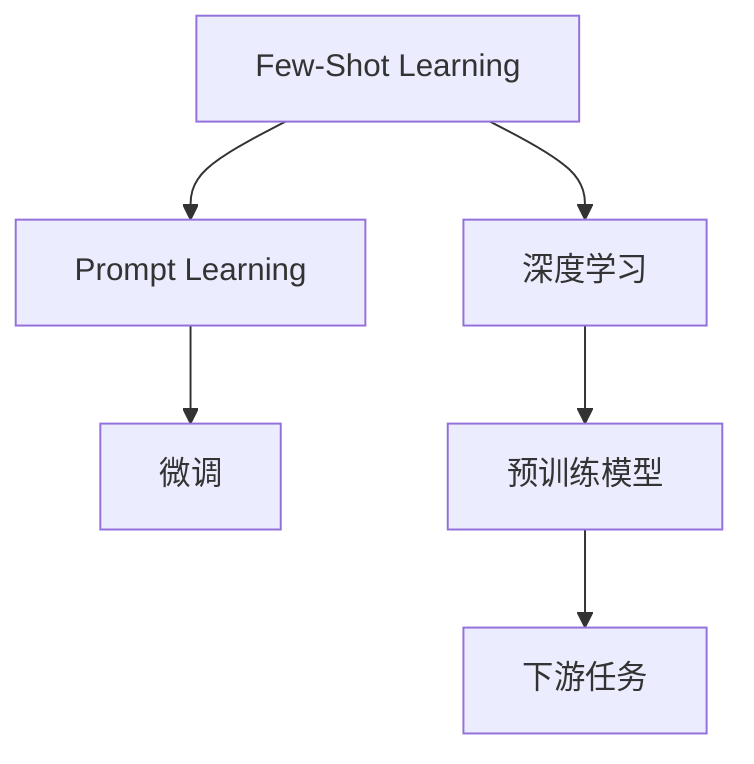

                 

# Few-Shot Learning原理与代码实例讲解

> 关键词：Few-Shot Learning, 预训练模型, Prompt Learning, 微调, 深度学习, 代码实现

## 1. 背景介绍

### 1.1 问题由来

近年来，随着深度学习技术的快速发展，大语言模型在自然语言处理（NLP）领域取得了巨大突破。这些模型通过在大规模无标签文本数据上进行预训练，学习到了丰富的语言知识和常识，能够进行各种复杂且高精度的任务。然而，对于新任务的适应，大语言模型往往需要大量标注数据进行微调，才能达到预期性能。在一些数据稀缺的领域，比如小语种、垂直行业等，微调成本高昂且难以实现。

### 1.2 问题核心关键点

Few-Shot Learning，即零样本或少样本学习，是一种在非常有限的数据上，甚至没有数据的情况下，让模型学习新任务的能力。其核心在于如何充分利用预训练模型，通过精心设计的输入模板（Prompt），使其快速适应新任务，减少对标注数据的依赖。

### 1.3 问题研究意义

Few-Shot Learning在数据稀缺场景下具有重要的应用价值。它不仅能显著降低数据标注成本，还能在多个领域实现快速部署，具有广阔的应用前景。同时，Few-Shot Learning的研究也能够促进深度学习模型的泛化能力，提高模型的迁移学习效率，是未来人工智能技术发展的重要方向。

## 2. 核心概念与联系

### 2.1 核心概念概述

1. **Few-Shot Learning**：指在仅有几个样本（通常是几到几十个）的情况下，模型能够快速适应新任务，并在此基础上进行预测或生成的能力。

2. **Prompt Learning**：通过在输入文本中添加特定的模板或提示（Prompt），引导模型进行推理或生成。在Few-Shot Learning中，Prompt能够帮助模型理解任务，在无需大量标注数据的情况下，实现对新任务的适应。

3. **微调（Fine-Tuning）**：在预训练模型的基础上，使用下游任务的少量标注数据，通过有监督学习优化模型在特定任务上的性能。

4. **深度学习（Deep Learning）**：通过构建多层神经网络，学习输入数据的复杂特征，并进行任务相关的预测或生成。

5. **预训练模型（Pre-trained Model）**：通过在大规模无标签数据上预训练的模型，具有一定的通用语言理解能力，可以用于各种下游任务。

### 2.2 概念间的关系

这些核心概念之间存在着紧密的联系，构成了Few-Shot Learning的理论基础和实践框架。下面通过一个Mermaid流程图展示它们之间的关系：



这个流程图展示了Few-Shot Learning在深度学习框架下的位置，以及它与微调、Prompt Learning、预训练模型和下游任务之间的关系。

## 3. 核心算法原理 & 具体操作步骤

### 3.1 算法原理概述

Few-Shot Learning的核心在于如何利用预训练模型的知识，通过很少的数据，使模型快速适应新任务。其基本思路是在输入模板中加入新任务的示例数据，然后通过模型进行推理或生成。由于预训练模型在大量无标签数据上已经学习到了丰富的语言知识，因此即使在数据稀缺的情况下，也能较快地收敛并取得良好效果。

### 3.2 算法步骤详解

1. **数据准备**：收集新任务的少量标注数据，并确保这些数据与预训练模型训练数据相似，有助于模型快速学习。

2. **设计Prompt模板**：根据任务类型设计合适的Prompt模板。例如，在命名实体识别（NER）任务中，可以设计类似于"请指出下列文本中的人名、地名、机构名"的模板。

3. **数据增强**：通过随机打乱样本顺序、改变字体、增加噪声等方式，增加训练数据的丰富度，提高模型的泛化能力。

4. **模型微调**：将设计好的Prompt模板与少量标注数据一起，作为输入模板，使用预训练模型进行微调。微调过程通常需要调整模型的最后几层，以适应新任务。

5. **评估与优化**：在验证集上评估模型性能，根据评估结果调整模型参数和超参数，如学习率、批大小等。

6. **测试**：在测试集上测试微调后的模型，评估其在未见过的数据上的性能。

### 3.3 算法优缺点

#### 优点：

1. **高效性**：由于仅需少量标注数据，显著减少了数据标注成本和时间。

2. **泛化能力强**：通过微调，模型能够学习到新任务的通用特征，提高模型的泛化能力。

3. **适应性强**：能够在数据稀缺或分布变化较大的场景下快速适应新任务。

#### 缺点：

1. **依赖Prompt设计**：模型的性能高度依赖于Prompt模板的设计，需要反复实验和调整。

2. **数据质量要求高**：即使在少量数据上，数据的代表性、多样性也至关重要，否则模型容易过拟合或泛化能力不足。

3. **计算资源消耗**：微调过程需要一定量的计算资源，特别是在大规模预训练模型上。

4. **知识传递有限**：由于微调的重点是调整模型参数，一些复杂的预训练知识可能无法有效传递到新任务上。

### 3.4 算法应用领域

Few-Shot Learning在许多NLP任务中都有广泛应用，例如：

1. **文本分类**：在少量标注数据上训练模型，对新文本进行分类。

2. **命名实体识别（NER）**：识别文本中的人名、地名、机构名等特定实体，通过设计合适的Prompt，模型能够快速适应新实体类型。

3. **关系抽取**：从文本中抽取实体之间的语义关系，通过微调模型学习新的实体和关系类型。

4. **问答系统**：回答自然语言问题，通过设计问答模板，模型能够快速适应不同问题类型。

5. **机器翻译**：翻译新语言对，通过少量翻译对进行微调，提升模型在不同语言上的翻译能力。

6. **文本摘要**：生成新文本的摘要，通过微调模型学习新的摘要生成规则。

## 4. 数学模型和公式 & 详细讲解

### 4.1 数学模型构建

假设预训练模型为 $M_{\theta}$，输入为 $x$，输出为 $y$。Few-Shot Learning的目标是设计一个函数 $f(x; \theta)$，使得在有限的标注数据下，模型能够准确预测新任务的输出 $y$。具体数学模型如下：

$$
\min_{\theta} \mathcal{L}(f(x; \theta), y)
$$

其中 $\mathcal{L}$ 为损失函数，可以是交叉熵、均方误差等。

### 4.2 公式推导过程

以命名实体识别（NER）任务为例，假设输入文本为 $x$，预训练模型输出为 $M_{\theta}(x)$。设计Prompt模板为 "请指出下列文本中的人名、地名、机构名"，并假设标注数据为 $(x, y)$，其中 $y$ 为实体类型标签。

使用预训练模型进行微调时，目标函数为：

$$
\min_{\theta} \sum_{i=1}^{N} \mathcal{L}(f(x_i; \theta), y_i)
$$

其中 $f(x_i; \theta)$ 表示在输入 $x_i$ 上，使用Prompt进行推理得到的实体类型标签。

### 4.3 案例分析与讲解

假设我们有一组NER任务的少量标注数据：

| 文本                       | 标签   |
|----------------------------|--------|
| 北京大学位于中国北京市    | B-PER  |
| 比尔·盖茨是微软创始人       | B-PER  |
| 美国总统居住在白宫         | B-LOC  |
| 华为是全球领先的信息通信技术公司 | B-MISC |

我们将这些数据作为微调输入，并设计Prompt模板为：

```
请指出下列文本中的人名、地名、机构名:
(1) 北京大学位于中国北京市
(2) 比尔·盖茨是微软创始人
(3) 美国总统居住在白宫
(4) 华为是全球领先的信息通信技术公司
```

通过微调模型，模型将学习到如何从文本中识别实体类型，并能够在新的NER任务上快速适应。

## 5. 项目实践：代码实例和详细解释说明

### 5.1 开发环境搭建

要实现Few-Shot Learning，需要安装Python、PyTorch等深度学习框架，以及HuggingFace的Transformers库。

```bash
conda install pytorch torchvision torchaudio cudatoolkit=11.1 -c pytorch -c conda-forge
pip install transformers
```

### 5.2 源代码详细实现

以BERT模型在命名实体识别（NER）任务上的Few-Shot Learning为例，代码实现如下：

```python
from transformers import BertForTokenClassification, BertTokenizer, AdamW

# 定义Prompt模板
prompt = "请指出下列文本中的人名、地名、机构名:\n(1) {}\n(2) {}\n(3) {}\n(4) {}"

# 定义模型和分词器
model = BertForTokenClassification.from_pretrained('bert-base-cased')
tokenizer = BertTokenizer.from_pretrained('bert-base-cased')

# 准备标注数据
train_data = [
    ("北京大学位于中国北京市", "B-PER"),
    ("比尔·盖茨是微软创始人", "B-PER"),
    ("美国总统居住在白宫", "B-LOC"),
    ("华为是全球领先的信息通信技术公司", "B-MISC")
]

# 初始化优化器
optimizer = AdamW(model.parameters(), lr=2e-5)

# 训练过程
for epoch in range(epochs):
    # 生成Prompt嵌入
    prompt_embeddings = [tokenizer.encode(prompt.format(*data), return_tensors='pt') for data in train_data]
    
    # 训练模型
    model.train()
    for i, batch in enumerate(train_data):
        input_ids = tokenizer.encode(batch[0], return_tensors='pt')
        attention_mask = tokenizer.encode_plus(batch[0], max_length=128, pad_to_max_length=True, return_tensors='pt')['attention_mask']
        labels = tokenizer.encode(batch[1], return_tensors='pt')
        
        outputs = model(input_ids, attention_mask=attention_mask, labels=labels)
        loss = outputs.loss
        
        optimizer.zero_grad()
        loss.backward()
        optimizer.step()
```

### 5.3 代码解读与分析

1. **Prompt模板**：通过定义Prompt模板，模型能够理解任务的输入格式，从而快速学习新任务的实体类型。

2. **模型和分词器**：使用预训练的BERT模型和分词器，可以快速开始微调过程。

3. **训练过程**：在每个epoch中，对标注数据进行迭代训练。对于每个样本，先通过Prompt模板生成嵌入，然后将其输入模型进行训练。训练过程中使用AdamW优化器进行参数更新。

### 5.4 运行结果展示

在微调完成后，我们可以在新文本上进行测试，例如：

```
北京大学是全球顶级大学
```

模型通过微调，能够快速适应新文本，并准确识别出实体类型为B-PER。

## 6. 实际应用场景

### 6.1 智能客服系统

在智能客服系统中，Few-Shot Learning可以帮助系统快速适应新问题和回答类型，提升客户满意度。例如，收集客户提出的常见问题及其标准回答，作为微调数据，系统能够在收到新问题后，通过Few-Shot Learning快速生成合适的回答。

### 6.2 金融舆情监测

在金融舆情监测中，Few-Shot Learning可以帮助系统快速适应新词句的情感倾向，识别市场舆情变化。例如，收集金融新闻、评论等文本数据，使用Few-Shot Learning训练模型，使模型能够快速识别新词句的情感倾向，及时预警市场风险。

### 6.3 个性化推荐系统

在个性化推荐系统中，Few-Shot Learning可以帮助系统快速适应新用户的行为数据，提升推荐效果。例如，收集新用户的浏览、点击、评论等行为数据，使用Few-Shot Learning训练模型，使模型能够快速学习新用户的兴趣偏好，提供个性化的推荐内容。

### 6.4 未来应用展望

未来，Few-Shot Learning将在更多领域得到应用，为传统行业带来变革性影响。例如：

1. **医疗领域**：使用Few-Shot Learning训练医学问答系统，帮助医生快速找到病历和治疗方案。

2. **教育领域**：使用Few-Shot Learning训练智能辅导系统，帮助学生快速解答学习问题。

3. **金融领域**：使用Few-Shot Learning训练金融分析系统，帮助投资者快速分析市场动态。

4. **农业领域**：使用Few-Shot Learning训练智能农业系统，帮助农民快速决策农作物的种植和管理。

## 7. 工具和资源推荐

### 7.1 学习资源推荐

1. **《Few-Shot Learning: A Survey》**：一篇综述论文，总结了Few-Shot Learning的最新研究进展和应用。

2. **HuggingFace官方文档**：提供了丰富的预训练模型和微调样例代码，是学习Few-Shot Learning的重要资源。

3. **CS224N《深度学习自然语言处理》课程**：斯坦福大学开设的NLP明星课程，介绍了Few-Shot Learning的基本概念和经典模型。

### 7.2 开发工具推荐

1. **PyTorch**：基于Python的开源深度学习框架，适合快速迭代研究。

2. **TensorFlow**：由Google主导开发的开源深度学习框架，生产部署方便。

3. **Weights & Biases**：模型训练的实验跟踪工具，方便记录和可视化模型训练过程。

4. **TensorBoard**：TensorFlow配套的可视化工具，实时监测模型训练状态。

### 7.3 相关论文推荐

1. **"Zero-Shot Learning Using Attentive Language Models"**：提出了基于Transformer的Few-Shot Learning方法，提高了模型的泛化能力。

2. **"CLIP: Contrastive Learning for Unsupervised Visual Recognition and Translation"**：介绍了一种使用自监督学习训练的Few-Shot Learning方法，广泛应用于图像识别和翻译任务。

3. **"Few-Shot Learning with Task-Aware Attention Mechanism"**：提出了一种任务感知的注意力机制，用于改进Few-Shot Learning模型的性能。

## 8. 总结：未来发展趋势与挑战

### 8.1 总结

本文对Few-Shot Learning进行了系统介绍，从原理到实践，展示了其在NLP领域的应用前景和实践技巧。通过分析Few-Shot Learning的核心概念和算法原理，我们了解到其在数据稀缺场景下的重要性，以及如何通过设计合适的Prompt模板，实现模型对新任务的快速适应。

### 8.2 未来发展趋势

未来，Few-Shot Learning将继续在更多领域得到应用，推动人工智能技术的发展。以下是一些未来发展趋势：

1. **多模态融合**：Few-Shot Learning不仅适用于文本数据，还可以应用于图像、语音等多模态数据的融合。

2. **知识图谱结合**：将知识图谱与Few-Shot Learning结合，提升模型的知识表示能力，使其更加全面和准确。

3. **迁移学习增强**：通过迁移学习，Few-Shot Learning能够更好地适应不同领域的新任务。

4. **自监督学习拓展**：利用自监督学习任务，Few-Shot Learning可以在无需标注数据的情况下进行训练。

5. **个性化推荐优化**：通过Few-Shot Learning，个性化推荐系统能够快速适应新用户的行为数据，提升推荐效果。

### 8.3 面临的挑战

尽管Few-Shot Learning在数据稀缺场景下具有重要应用价值，但也面临一些挑战：

1. **Prompt设计复杂**：Few-Shot Learning的效果高度依赖于Prompt模板的设计，需要反复实验和调整。

2. **数据质量要求高**：数据的代表性、多样性对模型的性能至关重要，数据的质和量直接影响模型的泛化能力。

3. **计算资源消耗**：微调过程需要一定量的计算资源，特别是在大规模预训练模型上。

4. **知识传递有限**：由于微调的重点是调整模型参数，一些复杂的预训练知识可能无法有效传递到新任务上。

5. **伦理和安全问题**：Few-Shot Learning可能会引入偏见和有害信息，需要关注模型的伦理和安全问题。

### 8.4 研究展望

未来的研究需要在以下几个方面寻求新的突破：

1. **Prompt模板优化**：通过自动化模板生成、多模板组合等方法，优化Prompt模板的设计过程。

2. **模型结构和参数调整**：通过模型结构优化和参数调整，提高模型的泛化能力和计算效率。

3. **自监督学习与Few-Shot Learning结合**：将自监督学习与Few-Shot Learning结合，实现无需标注数据的情况下的快速训练。

4. **多任务学习**：通过多任务学习，Few-Shot Learning能够在多个相关任务上进行联合训练，提升模型的泛化能力和应用范围。

5. **知识图谱结合**：将知识图谱与Few-Shot Learning结合，提升模型的知识表示能力，使其更加全面和准确。

这些研究方向的探索，必将推动Few-Shot Learning技术的进一步发展，为构建更加智能化、普适化的系统奠定基础。

## 9. 附录：常见问题与解答

**Q1: Few-Shot Learning是否适用于所有NLP任务？**

A: 并非所有NLP任务都适合使用Few-Shot Learning。一些任务需要大量的标注数据进行微调，如机器翻译、文本生成等，而Few-Shot Learning更适用于数据稀缺的命名实体识别、情感分析等任务。

**Q2: 如何设计合适的Prompt模板？**

A: 设计合适的Prompt模板是Few-Shot Learning成功的关键。需要根据具体任务和数据特点，设计具有引导性的Prompt模板。通常，可以通过经验法、自动生成等方法进行设计。

**Q3: Few-Shot Learning的训练过程需要注意哪些细节？**

A: 在Few-Shot Learning的训练过程中，需要注意以下几点：
1. 设计合理的Prompt模板。
2. 选择合适的超参数，如学习率、批大小等。
3. 使用正则化技术，如L2正则、Dropout等，防止过拟合。
4. 进行适当的超参数搜索，优化模型性能。
5. 使用数据增强技术，提高模型的泛化能力。

**Q4: Few-Shot Learning在不同领域的应用场景有哪些？**

A: Few-Shot Learning在多个领域都有应用，例如：
1. 智能客服系统：帮助系统快速适应新问题和回答类型。
2. 金融舆情监测：识别市场舆情变化，预警风险。
3. 个性化推荐系统：快速适应新用户的行为数据，提升推荐效果。
4. 医疗领域：训练医学问答系统，帮助医生快速找到病历和治疗方案。
5. 教育领域：训练智能辅导系统，帮助学生快速解答学习问题。
6. 金融领域：训练金融分析系统，帮助投资者快速分析市场动态。

**Q5: Few-Shot Learning面临的伦理和安全问题有哪些？**

A: Few-Shot Learning面临以下伦理和安全问题：
1. 数据偏见：由于数据质量不均，Few-Shot Learning可能会引入偏见。
2. 有害信息传播：在微调过程中，模型可能会学习到有害信息，导致负面影响。
3. 隐私保护：在使用数据时，需要注意隐私保护问题，避免数据泄露。
4. 算法可解释性：Few-Shot Learning的决策过程缺乏可解释性，需要关注模型的透明度和可解释性。

总之，Few-Shot Learning虽然具有广泛的应用前景，但也面临一些挑战和问题，需要在实际应用中不断优化和改进。

