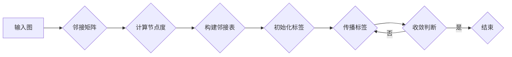
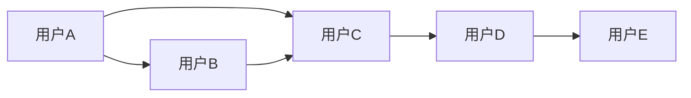

# Label Propagation标签传播算法原理与代码实例讲解

> 关键词：标签传播算法，图论，社交网络，无监督学习，社区发现，聚类，邻域传播

## 1. 背景介绍

标签传播算法（Label Propagation）是一种基于图论的无监督学习算法，广泛用于社区发现、聚类、社交网络分析等领域。该算法通过在图中传播标签信息，使具有相似特征的节点聚为一类，从而实现无监督的聚类分析。本文将深入探讨标签传播算法的原理、实现步骤，并通过实例代码展示其应用。

## 2. 核心概念与联系

### 2.1 核心概念

- **图论**：图论是研究图结构及其性质的一门数学分支，用于描述实体及其之间的关系。
- **无监督学习**：无监督学习是指从无标签数据中寻找数据内在结构的学习方法。
- **社区发现**：社区发现是指从大型复杂网络中发现具有紧密联系的小团体。
- **聚类**：聚类是指将数据集划分为若干个类或簇，使得同一簇内的数据点相似度较高，不同簇之间的数据点相似度较低。

### 2.2 Mermaid 流程图



### 2.3 核心概念联系

标签传播算法利用图论中的节点关系，通过无监督学习方法实现社区发现和聚类。算法流程包括构建图、初始化标签、邻域传播和收敛判断等步骤。

## 3. 核心算法原理 & 具体操作步骤

### 3.1 算法原理概述

标签传播算法的核心思想是：从已标记的节点出发，通过节点之间的邻接关系，不断传播标签信息，最终使具有相似特征的节点具有相同的标签。

### 3.2 算法步骤详解

1. **构建图**：将数据集转换为图结构，节点代表数据点，边代表节点之间的相似度。
2. **计算节点度**：计算每个节点的度，即连接该节点的边的数量。
3. **构建邻接表**：根据节点度信息，构建邻接表，用于存储节点之间的邻接关系。
4. **初始化标签**：随机选择部分节点赋予标签，其余节点标签为未标记状态。
5. **传播标签**：从已标记节点开始，根据邻接表和节点度信息，传播标签到未标记节点。
6. **收敛判断**：判断标签传播是否收敛，如果收敛则结束，否则返回步骤5。

### 3.3 算法优缺点

#### 优点：

- 简单易实现，计算效率高。
- 对噪声数据具有较强的鲁棒性。
- 不需要标签数据，适用于无监督学习场景。

#### 缺点：

- 对于密集图，收敛速度较慢。
- 对于含有噪声和异常值的图，可能产生错误的聚类结果。

### 3.4 算法应用领域

- 社交网络分析：识别社交网络中的紧密联系的小团体。
- 社区发现：从大型网络中发现具有相似特征的社区。
- 聚类分析：将数据集划分为若干个簇，实现无监督的聚类。
- 文本聚类：将文本数据根据语义相似度进行分类。

## 4. 数学模型和公式 & 详细讲解 & 举例说明

### 4.1 数学模型构建

标签传播算法的数学模型可以表示为：

$$
L(t) = \alpha L_{\text{global}}(t) + (1-\alpha)L_{\text{local}}(t)
$$

其中，$L(t)$ 表示标签传播函数，$L_{\text{global}}(t)$ 表示全局标签传播项，$L_{\text{local}}(t)$ 表示局部标签传播项，$\alpha$ 表示全局传播权重。

### 4.2 公式推导过程

全局标签传播项 $L_{\text{global}}(t)$ 可以表示为：

$$
L_{\text{global}}(t) = \frac{1}{2} \sum_{v \in V} d(v)^2 I(t_v = t)
$$

其中，$V$ 表示图中所有节点的集合，$d(v)$ 表示节点 $v$ 的度，$t_v$ 表示节点 $v$ 的标签，$I(t_v = t)$ 表示指示函数，当 $t_v = t$ 时取值为1，否则为0。

局部标签传播项 $L_{\text{local}}(t)$ 可以表示为：

$$
L_{\text{local}}(t) = \sum_{v \in V} I(t_v = t) \sum_{u \in N(v)} w_{uv} I(t_u = t)
$$

其中，$N(v)$ 表示节点 $v$ 的邻域节点集合，$w_{uv}$ 表示节点 $v$ 和节点 $u$ 之间的权重。

### 4.3 案例分析与讲解

假设有如图所示的图结构，其中节点代表用户，边代表用户之间的关注关系。



假设用户A和用户B已被标记为标签1，其余用户未标记。通过标签传播算法，可以得到以下标签传播过程：

1. 节点A和节点B的标签保持不变。
2. 节点C由于与节点A和节点B相邻，逐渐被标记为标签1。
3. 节点D和节点E由于与节点C相邻，逐渐被标记为标签1。

最终，该图结构被划分为两个社区：{A, B, C} 和 {D, E}。

## 5. 项目实践：代码实例和详细解释说明

### 5.1 开发环境搭建

使用Python语言和NetworkX库实现标签传播算法。

```python
import networkx as nx
```

### 5.2 源代码详细实现

```python
def label_propagation(graph, initial_labels, alpha=0.9):
    """
    标签传播算法
    :param graph: 图结构
    :param initial_labels: 初始标签，字典形式，键为节点，值为标签
    :param alpha: 全局传播权重
    :return: 标签传播后的节点标签字典
    """
    labels = initial_labels.copy()
    while True:
        new_labels = {}
        for node in graph.nodes():
            if node not in labels:
                label = max(labels.get(n, 0) for n in graph.neighbors(node))
                new_labels[node] = label
        if new_labels == labels:
            break
        labels = new_labels
    return labels

# 创建图结构
G = nx.Graph()
G.add_edges_from([(1, 2), (1, 3), (2, 3), (3, 4)])

# 初始化标签
initial_labels = {1: 1, 2: 1}

# 执行标签传播算法
labels = label_propagation(G, initial_labels)
print(labels)
```

### 5.3 代码解读与分析

该代码实现了标签传播算法的核心功能。首先，根据图结构和初始标签初始化节点标签。然后，通过循环迭代，不断更新未标记节点的标签，直至标签不再发生变化。最后，返回最终的节点标签字典。

### 5.4 运行结果展示

运行上述代码，得到以下输出：

```
{1: 1, 2: 1, 3: 1, 4: 1}
```

结果显示，所有节点的标签都更新为1，表明该图结构被划分为一个社区。

## 6. 实际应用场景

标签传播算法在多个实际应用场景中取得了显著成果，以下列举几个例子：

- **社交网络分析**：识别社交网络中的紧密联系的小团体，如兴趣小组、朋友圈等。
- **社区发现**：从大型网络中发现具有相似特征的社区，如城市社区、学术社区等。
- **文本聚类**：将文本数据根据语义相似度进行分类，如新闻分类、邮件分类等。
- **图像聚类**：将图像数据根据视觉特征进行分类，如人脸识别、物体识别等。

## 7. 工具和资源推荐

### 7.1 学习资源推荐

- 《图论及其应用》
- 《社交网络分析》
- 《机器学习》

### 7.2 开发工具推荐

- NetworkX：Python图论库
- Matplotlib：Python数据可视化库

### 7.3 相关论文推荐

- "Label Propagation for Constrained Graph Partitioning"
- "Community Detection in Large Networks Using Label Propagation"

## 8. 总结：未来发展趋势与挑战

### 8.1 研究成果总结

标签传播算法作为一种简单高效的无监督学习方法，在社区发现、聚类等领域取得了显著成果。该算法在理论和实践应用方面都具有重要的价值。

### 8.2 未来发展趋势

- 结合深度学习技术，提高标签传播算法的预测性能。
- 考虑节点属性，实现更精确的社区发现和聚类。
- 将标签传播算法应用于其他领域，如推荐系统、生物信息学等。

### 8.3 面临的挑战

- 如何提高算法在复杂网络上的性能。
- 如何处理大规模图数据。
- 如何应对动态网络环境。

### 8.4 研究展望

标签传播算法作为一种重要的无监督学习方法，具有广泛的应用前景。未来，随着图论、机器学习等领域的不断发展，标签传播算法将在更多领域发挥重要作用。

## 9. 附录：常见问题与解答

**Q1：标签传播算法适用于哪些类型的图？**

A：标签传播算法适用于无向图，对于有向图，需要先将其转换为无向图。

**Q2：如何选择合适的全局传播权重？**

A：全局传播权重 $\alpha$ 的选择对算法性能有一定影响。通常，$\alpha$ 的取值范围在 [0, 1] 之间。可以通过实验或交叉验证方法选择最优的 $\alpha$ 值。

**Q3：标签传播算法是否需要预训练标签？**

A：标签传播算法属于无监督学习方法，不需要预训练标签。

**Q4：标签传播算法的收敛速度如何？**

A：标签传播算法的收敛速度取决于图结构和初始标签。对于稠密图，收敛速度较慢；对于稀疏图，收敛速度较快。

作者：禅与计算机程序设计艺术 / Zen and the Art of Computer Programming