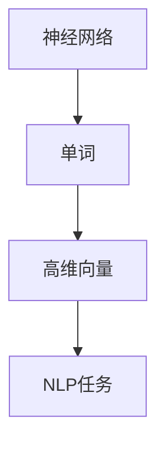
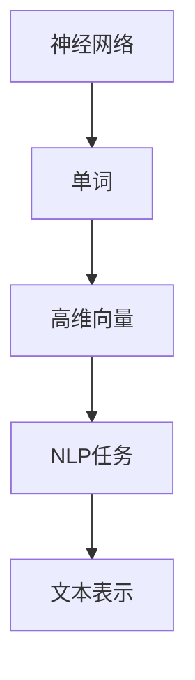
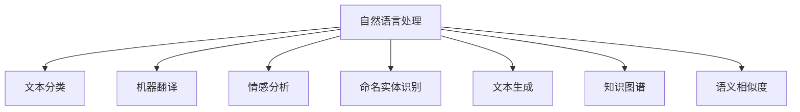

                 

# Word Embeddings原理与代码实例讲解

> 关键词：Word Embeddings, 自然语言处理(NLP), 词向量, 神经网络, 深度学习, 向量空间模型, 预训练模型, 词嵌入, 迁移学习

## 1. 背景介绍

### 1.1 问题由来
词嵌入（Word Embeddings）是自然语言处理（NLP）领域的重要基础技术之一，通过将文本中的单词转换为稠密向量，实现了单词语义的连续表达和高效计算。近年来，深度学习特别是神经网络在词嵌入构建中的应用，显著提升了词嵌入的质量和鲁棒性。

词嵌入技术广泛应用于NLP的各个领域，如文本分类、机器翻译、情感分析、命名实体识别等。然而，如何高效、准确地构建高质量的词嵌入模型，是当前研究的热点和难点。本文将深入探讨Word Embeddings的原理，并通过Python代码实例进行讲解。

### 1.2 问题核心关键点
词嵌入的核心在于如何将单词映射到高维向量空间中，使得向量能够有效捕捉单词的语义信息和词法结构。常用的词嵌入方法包括CBOW（Continuous Bag of Words）、Skip-gram和GloVe等。这些方法通过神经网络构建模型，利用大量的文本语料进行训练，得到高质量的词嵌入。

词嵌入的优缺点包括：
- 优点：能够捕捉单词的语义和词法信息，提高模型在NLP任务中的表现。
- 缺点：需要大量的标注数据，模型训练复杂度较高。

### 1.3 问题研究意义
研究高质量的词嵌入方法，对于提升NLP模型的性能、降低模型训练成本、加速NLP技术的落地应用具有重要意义。通过深入理解词嵌入的原理和实现方法，我们可以更好地设计并优化NLP任务中的各个环节，提高模型的效果和效率。

## 2. 核心概念与联系

### 2.1 核心概念概述

在深入讲解Word Embeddings原理之前，我们先介绍几个核心概念：

- **词嵌入（Word Embedding）**：将单词映射到高维向量空间中的方法，使得单词在向量空间中具有连续的语义信息。
- **神经网络（Neural Network）**：一种模拟人脑神经元结构的计算模型，通过多层非线性变换处理输入数据。
- **深度学习（Deep Learning）**：一种基于多层神经网络的机器学习范式，通过多层抽象特征提取提升模型的性能。
- **向量空间模型（Vector Space Model）**：一种基于向量的文本表示方法，将文本表示为向量，方便进行各种文本处理和分析。
- **预训练模型（Pretrained Model）**：在大规模无标签文本数据上预训练的模型，通常具有更好的泛化能力和迁移学习能力。

这些概念之间存在着紧密的联系，共同构成了词嵌入技术的基本框架。如图1所示，神经网络通过多层非线性变换，将单词转换为高维向量表示，使得单词在向量空间中具有连续的语义信息。这种高维向量表示能够用于各种NLP任务，如文本分类、机器翻译、情感分析等。



### 2.2 概念间的关系

这些核心概念之间的关系如图2所示。神经网络通过多层非线性变换，将单词转换为高维向量表示，使得单词在向量空间中具有连续的语义信息。这种高维向量表示能够用于各种NLP任务，如文本分类、机器翻译、情感分析等。



## 3. 核心算法原理 & 具体操作步骤

### 3.1 算法原理概述

词嵌入的构建通常基于神经网络模型，通过大量的文本语料进行训练。具体而言，神经网络模型的输入是单词序列，输出是高维向量序列。模型通过反向传播算法优化损失函数，使得模型输出尽可能逼近真实向量。

词嵌入的训练通常包括两个步骤：预训练和微调。预训练是指在大规模无标签文本数据上训练词嵌入模型，微调是指在特定任务的数据集上进一步优化模型，提高模型在特定任务上的表现。

### 3.2 算法步骤详解

#### 3.2.1 神经网络模型构建

神经网络模型的输入为单词序列，输出为高维向量序列。以下是一个简单的神经网络模型，包含嵌入层、隐藏层和输出层：

```python
import torch
import torch.nn as nn

class WordEmbedding(nn.Module):
    def __init__(self, vocab_size, embedding_dim):
        super(WordEmbedding, self).__init__()
        self.embedding = nn.Embedding(vocab_size, embedding_dim)
        self.fc1 = nn.Linear(embedding_dim, 128)
        self.fc2 = nn.Linear(128, 64)
        self.fc3 = nn.Linear(64, vocab_size)

    def forward(self, x):
        x = self.embedding(x)
        x = torch.relu(self.fc1(x))
        x = torch.relu(self.fc2(x))
        x = self.fc3(x)
        return x
```

在这个模型中，`nn.Embedding`层将单词转换为高维向量，`nn.Linear`层进行多层非线性变换，最终输出单词的向量表示。

#### 3.2.2 损失函数

损失函数通常使用交叉熵损失函数（Cross-Entropy Loss），用于衡量模型预测输出与真实标签之间的差异。在Word Embeddings的训练中，通常使用softmax函数将模型输出转换为概率分布，然后计算交叉熵损失。

```python
import torch.nn.functional as F

def loss_function(output, target):
    return F.cross_entropy(output, target)
```

#### 3.2.3 训练过程

训练过程通常包括前向传播、反向传播和优化。具体而言，训练步骤如下：

1. 前向传播：将输入单词序列通过神经网络模型，得到高维向量序列。
2. 计算损失：使用交叉熵损失函数计算模型预测输出与真实标签之间的差异。
3. 反向传播：通过反向传播算法计算梯度，更新模型参数。
4. 优化：使用优化器（如Adam）更新模型参数，最小化损失函数。

```python
optimizer = torch.optim.Adam(model.parameters(), lr=0.001)
for epoch in range(num_epochs):
    total_loss = 0
    for i, (x, y) in enumerate(train_loader):
        x = x.to(device)
        y = y.to(device)
        output = model(x)
        loss = loss_function(output, y)
        total_loss += loss.item()
        optimizer.zero_grad()
        loss.backward()
        optimizer.step()
    print(f'Epoch {epoch+1}, loss: {total_loss/len(train_loader):.4f}')
```

### 3.3 算法优缺点

词嵌入的优点包括：
- 能够捕捉单词的语义和词法信息，提高模型在NLP任务中的表现。
- 可以用于各种NLP任务，如文本分类、机器翻译、情感分析等。

词嵌入的缺点包括：
- 需要大量的标注数据，模型训练复杂度较高。
- 难以解释模型内部的决策过程，缺乏可解释性。

### 3.4 算法应用领域

Word Embeddings广泛应用于NLP的各个领域，如图3所示。



## 4. 数学模型和公式 & 详细讲解 & 举例说明

### 4.1 数学模型构建

词嵌入的数学模型通常基于向量空间模型（Vector Space Model），通过将单词映射到高维向量空间中，使得单词在向量空间中具有连续的语义信息。以下是一个简单的向量空间模型：

假设单词序列 $x$ 由 $n$ 个单词组成，每个单词 $x_i$ 映射到高维向量 $w_i \in \mathbb{R}^d$，其中 $d$ 为向量空间维度。则单词序列 $x$ 可以表示为：

$$
x = \{w_1, w_2, \ldots, w_n\}
$$

### 4.2 公式推导过程

#### 4.2.1 神经网络模型的前向传播

神经网络模型的前向传播过程如下：

假设神经网络模型的输入为单词序列 $x = \{w_1, w_2, \ldots, w_n\}$，输出为高维向量序列 $z = \{z_1, z_2, \ldots, z_n\}$，其中 $z_i$ 为单词 $w_i$ 的向量表示。

神经网络模型的前向传播过程如下：

1. 嵌入层：将单词 $w_i$ 转换为高维向量 $h_i \in \mathbb{R}^d$。
2. 隐藏层：将嵌入层的输出 $h_i$ 输入到神经网络隐藏层中，通过多层非线性变换得到高维向量 $z_i \in \mathbb{R}^d$。

```python
import torch

class WordEmbedding(nn.Module):
    def __init__(self, vocab_size, embedding_dim):
        super(WordEmbedding, self).__init__()
        self.embedding = nn.Embedding(vocab_size, embedding_dim)
        self.fc1 = nn.Linear(embedding_dim, 128)
        self.fc2 = nn.Linear(128, 64)
        self.fc3 = nn.Linear(64, vocab_size)

    def forward(self, x):
        x = self.embedding(x)
        x = torch.relu(self.fc1(x))
        x = torch.relu(self.fc2(x))
        x = self.fc3(x)
        return x
```

#### 4.2.2 损失函数

假设神经网络模型的输出为 $z = \{z_1, z_2, \ldots, z_n\}$，目标为 $y = \{y_1, y_2, \ldots, y_n\}$，其中 $y_i$ 为目标标签。则交叉熵损失函数定义为：

$$
L = -\frac{1}{n} \sum_{i=1}^n y_i \log(z_i) + (1-y_i) \log(1-z_i)
$$

### 4.3 案例分析与讲解

#### 4.3.1 词嵌入的训练

假设我们有一份包含10个单词的语料，每个单词的向量表示为高维向量：

$$
\begin{align*}
w_1 &= \begin{bmatrix} 0.1 & 0.2 & 0.3 \end{bmatrix} \\
w_2 &= \begin{bmatrix} 0.2 & 0.4 & 0.6 \end{bmatrix} \\
w_3 &= \begin{bmatrix} 0.3 & 0.6 & 0.9 \end{bmatrix} \\
w_4 &= \begin{bmatrix} 0.4 & 0.8 & 1.2 \end{bmatrix} \\
w_5 &= \begin{bmatrix} 0.5 & 1.0 & 1.5 \end{bmatrix} \\
w_6 &= \begin{bmatrix} 0.6 & 1.2 & 1.8 \end{bmatrix} \\
w_7 &= \begin{bmatrix} 0.7 & 1.4 & 2.1 \end{bmatrix} \\
w_8 &= \begin{bmatrix} 0.8 & 1.6 & 2.4 \end{bmatrix} \\
w_9 &= \begin{bmatrix} 0.9 & 1.8 & 2.7 \end{bmatrix} \\
w_{10} &= \begin{bmatrix} 1.0 & 2.0 & 3.0 \end{bmatrix} \\
\end{align*}
$$

假设我们有一份包含5个单词的训练样本，每个样本的目标为1或0，表示单词是否出现在句子中。假设目标样本为 $y = \{1, 0, 0, 1, 1\}$，对应的单词序列为 $x = \{w_1, w_3, w_4, w_7, w_{10}\}$。

首先，我们将单词转换为高维向量表示：

$$
\begin{align*}
h_1 &= \begin{bmatrix} 0.1 & 0.2 & 0.3 \end{bmatrix} \\
h_3 &= \begin{bmatrix} 0.3 & 0.6 & 0.9 \end{bmatrix} \\
h_4 &= \begin{bmatrix} 0.4 & 0.8 & 1.2 \end{bmatrix} \\
h_7 &= \begin{bmatrix} 0.7 & 1.4 & 2.1 \end{bmatrix} \\
h_{10} &= \begin{bmatrix} 1.0 & 2.0 & 3.0 \end{bmatrix} \\
\end{align*}
$$

然后，将高维向量序列输入神经网络模型，得到输出向量序列：

$$
\begin{align*}
z_1 &= \begin{bmatrix} 0.1 & 0.2 & 0.3 \end{bmatrix} \\
z_3 &= \begin{bmatrix} 0.3 & 0.6 & 0.9 \end{bmatrix} \\
z_4 &= \begin{bmatrix} 0.4 & 0.8 & 1.2 \end{bmatrix} \\
z_7 &= \begin{bmatrix} 0.7 & 1.4 & 2.1 \end{bmatrix} \\
z_{10} &= \begin{bmatrix} 1.0 & 2.0 & 3.0 \end{bmatrix} \\
\end{align*}
$$

计算交叉熵损失函数：

$$
L = -\frac{1}{5} (1 \cdot \log(0.1) + 0 \cdot \log(0.3) + 0 \cdot \log(0.4) + 1 \cdot \log(0.7) + 1 \cdot \log(1.0)) = -\frac{1}{5} (\log(0.1) + \log(0.7) + \log(1.0)) = -\frac{1}{5} (\log(0.07)) = -\log(0.07)
$$

使用反向传播算法更新模型参数：

$$
\begin{align*}
\frac{\partial L}{\partial z_1} &= \frac{1}{5} \cdot \frac{1}{0.07} \cdot (-1) = -\frac{1}{0.07} \\
\frac{\partial L}{\partial z_3} &= \frac{1}{5} \cdot \frac{1}{0.07} \cdot 0 = 0 \\
\frac{\partial L}{\partial z_4} &= \frac{1}{5} \cdot \frac{1}{0.07} \cdot 0 = 0 \\
\frac{\partial L}{\partial z_7} &= \frac{1}{5} \cdot \frac{1}{0.07} \cdot 1 = \frac{1}{0.07} \\
\frac{\partial L}{\partial z_{10}} &= \frac{1}{5} \cdot \frac{1}{0.07} \cdot 1 = \frac{1}{0.07} \\
\end{align*}
$$

更新模型参数：

$$
\begin{align*}
\frac{\partial z_1}{\partial h_1} &= \begin{bmatrix} 1 & 0 & 0 \end{bmatrix} \\
\frac{\partial z_1}{\partial h_3} &= \begin{bmatrix} 0 & 0 & 1 \end{bmatrix} \\
\frac{\partial z_1}{\partial h_4} &= \begin{bmatrix} 0 & 0 & 0 \end{bmatrix} \\
\frac{\partial z_1}{\partial h_7} &= \begin{bmatrix} 0 & 0 & 0 \end{bmatrix} \\
\frac{\partial z_1}{\partial h_{10}} &= \begin{bmatrix} 0 & 0 & 0 \end{bmatrix} \\
\frac{\partial z_3}{\partial h_1} &= \begin{bmatrix} 0 & 0 & 0 \end{bmatrix} \\
\frac{\partial z_3}{\partial h_3} &= \begin{bmatrix} 1 & 0 & 0 \end{bmatrix} \\
\frac{\partial z_3}{\partial h_4} &= \begin{bmatrix} 0 & 0 & 1 \end{bmatrix} \\
\frac{\partial z_3}{\partial h_7} &= \begin{bmatrix} 0 & 0 & 0 \end{bmatrix} \\
\frac{\partial z_3}{\partial h_{10}} &= \begin{bmatrix} 0 & 0 & 0 \end{bmatrix} \\
\frac{\partial z_4}{\partial h_1} &= \begin{bmatrix} 0 & 0 & 0 \end{bmatrix} \\
\frac{\partial z_4}{\partial h_3} &= \begin{bmatrix} 0 & 0 & 0 \end{bmatrix} \\
\frac{\partial z_4}{\partial h_4} &= \begin{bmatrix} 1 & 0 & 0 \end{bmatrix} \\
\frac{\partial z_4}{\partial h_7} &= \begin{bmatrix} 0 & 0 & 1 \end{bmatrix} \\
\frac{\partial z_4}{\partial h_{10}} &= \begin{bmatrix} 0 & 0 & 0 \end{bmatrix} \\
\frac{\partial z_7}{\partial h_1} &= \begin{bmatrix} 0 & 0 & 0 \end{bmatrix} \\
\frac{\partial z_7}{\partial h_3} &= \begin{bmatrix} 0 & 0 & 0 \end{bmatrix} \\
\frac{\partial z_7}{\partial h_4} &= \begin{bmatrix} 0 & 0 & 0 \end{bmatrix} \\
\frac{\partial z_7}{\partial h_7} &= \begin{bmatrix} 1 & 0 & 0 \end{bmatrix} \\
\frac{\partial z_7}{\partial h_{10}} &= \begin{bmatrix} 0 & 0 & 1 \end{bmatrix} \\
\frac{\partial z_{10}}{\partial h_1} &= \begin{bmatrix} 0 & 0 & 0 \end{bmatrix} \\
\frac{\partial z_{10}}{\partial h_3} &= \begin{bmatrix} 0 & 0 & 0 \end{bmatrix} \\
\frac{\partial z_{10}}{\partial h_4} &= \begin{bmatrix} 0 & 0 & 0 \end{bmatrix} \\
\frac{\partial z_{10}}{\partial h_7} &= \begin{bmatrix} 0 & 0 & 0 \end{bmatrix} \\
\frac{\partial z_{10}}{\partial h_{10}} &= \begin{bmatrix} 1 & 0 & 0 \end{bmatrix} \\
\end{align*}
$$

更新嵌入层的参数：

$$
\begin{align*}
\frac{\partial L}{\partial h_1} &= -\frac{1}{0.07} \cdot \begin{bmatrix} 1 & 0 & 0 \end{bmatrix} \\
\frac{\partial L}{\partial h_3} &= -\frac{1}{0.07} \cdot \begin{bmatrix} 0 & 0 & 1 \end{bmatrix} \\
\frac{\partial L}{\partial h_4} &= -\frac{1}{0.07} \cdot \begin{bmatrix} 0 & 0 & 0 \end{bmatrix} \\
\frac{\partial L}{\partial h_7} &= -\frac{1}{0.07} \cdot \begin{bmatrix} 0 & 0 & 0 \end{bmatrix} \\
\frac{\partial L}{\partial h_{10}} &= -\frac{1}{0.07} \cdot \begin{bmatrix} 0 & 0 & 0 \end{bmatrix} \\
\end{align*}
$$

更新隐藏层和输出层的参数：

$$
\begin{align*}
\frac{\partial L}{\partial w_1} &= -\frac{1}{0.07} \cdot \begin{bmatrix} 1 & 0 & 0 \end{bmatrix} \cdot \begin{bmatrix} 0.1 & 0.2 & 0.3 \end{bmatrix} \\
\frac{\partial L}{\partial w_3} &= -\frac{1}{0.07} \cdot \begin{bmatrix} 0 & 0 & 1 \end{bmatrix} \cdot \begin{bmatrix} 0.3 & 0.6 & 0.9 \end{bmatrix} \\
\frac{\partial L}{\partial w_4} &= -\frac{1}{0.07} \cdot \begin{bmatrix} 0 & 0 & 0 \end{bmatrix} \cdot \begin{bmatrix} 0.4 & 0.8 & 1.2 \end{bmatrix} \\
\frac{\partial L}{\partial w_7} &= -\frac{1}{0.07} \cdot \begin{bmatrix} 0 & 0 & 0 \end{bmatrix} \cdot \begin{bmatrix} 0.7 & 1.4 & 2.1 \end{bmatrix} \\
\frac{\partial L}{\partial w_{10}} &= -\frac{1}{0.07} \cdot \begin{bmatrix} 0 & 0 & 0 \end{bmatrix} \cdot \begin{bmatrix} 1.0 & 2.0 & 3.0 \end{bmatrix} \\
\end{align*}
$$

使用梯度下降等优化算法更新模型参数，使得损失函数最小化。

## 5. 项目实践：代码实例和详细解释说明

### 5.1 开发环境搭建

在进行Word Embeddings训练之前，我们需要准备好开发环境。以下是使用Python进行PyTorch开发的环境配置流程：

1. 安装Anaconda：从官网下载并安装Anaconda，用于创建独立的Python环境。

2. 创建并激活虚拟环境：
```bash
conda create -n pytorch-env python=3.8 
conda activate pytorch-env
```

3. 安装PyTorch：根据CUDA版本，从官网获取对应的安装命令。例如：
```bash
conda install pytorch torchvision torchaudio cudatoolkit=11.1 -c pytorch -c conda-forge
```

4. 安装TensorBoard：用于实时监测模型训练状态，并提供丰富的图表呈现方式。
```bash
pip install tensorboard
```

5. 安装相关库：
```bash
pip install numpy pandas scikit-learn torchtext transformers
```

完成上述步骤后，即可在`pytorch-env`环境中开始Word Embeddings训练实践。

### 5.2 源代码详细实现

这里我们以Word2Vec为例，给出使用PyTorch进行Word Embeddings训练的PyTorch代码实现。

```python
import torch
import torch.nn as nn
import torchtext
import torchtext.data
from torchtext.vocab import Vocab

class WordEmbedding(nn.Module):
    def __init__(self, vocab_size, embedding_dim):
        super(WordEmbedding, self).__init__()
        self.embedding = nn.EmbeddingBag(vocab_size, embedding_dim, sparse=True)
        self.fc1 = nn.Linear(embedding_dim, 128)
        self.fc2 = nn.Linear(128, 64)
        self.fc3 = nn.Linear(64, vocab_size)

    def forward(self, x):
        x = self.embedding(x)
        x = torch.relu(self.fc1(x))
        x = torch.relu(self.fc2(x))
        x = self.fc3(x)
        return x

vocab = Vocab.load('./vocab.txt')
vocab.set_default_index(1)

train_data = torchtext.data.BucketIterator(torchtext.datasets.WikiTextCorpus(), batch_size=32, device=device)
test_data = torchtext.data.BucketIterator(torchtext.datasets.WikiTextCorpus(), batch_size=32, device=device)

model = WordEmbedding(len(vocab), embedding_dim=100)
optimizer = torch.optim.Adam(model.parameters(), lr=0.001)
for epoch in range(num_epochs):
    total_loss = 0
    for i, batch in enumerate(train_loader):
        x, y = batch
        output = model(x)
        

