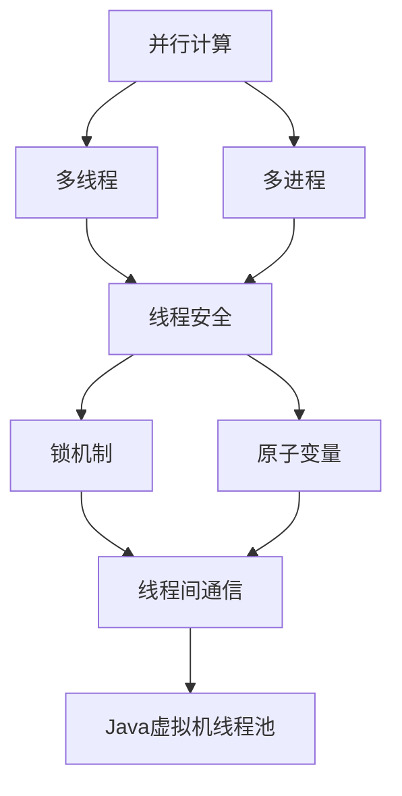
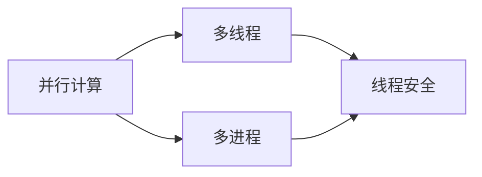
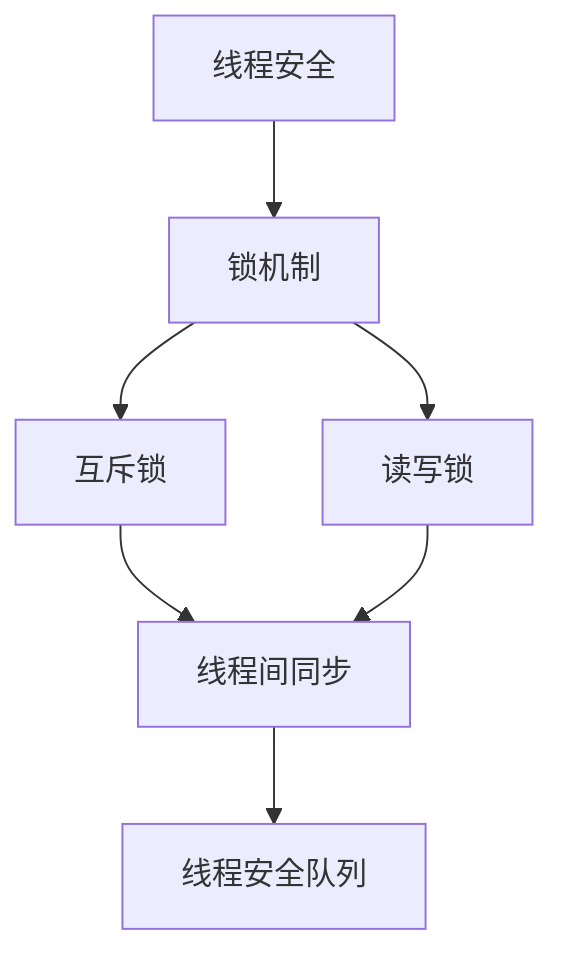
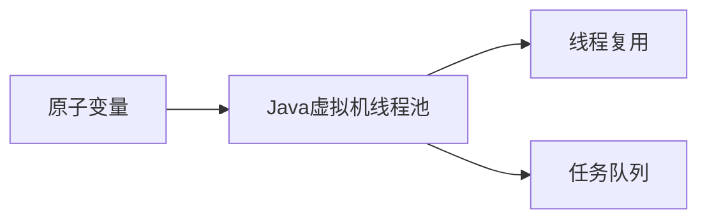
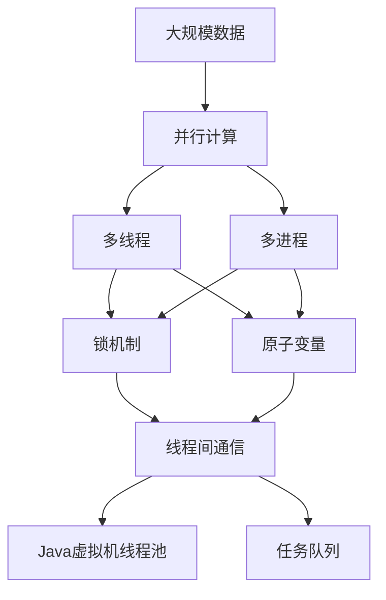

                 

# 【LangChain编程：从入门到实践】RunnableParallel

## 1. 背景介绍

### 1.1 问题由来
RunnableParallel作为一种编程范式，能够大幅提升程序并行处理能力，使计算机能够同时执行多个任务，从而提高程序的执行效率。然而，并行编程的难度较大，需要系统深入理解和应用才能真正发挥其优势。

### 1.2 问题核心关键点
RunnableParallel编程的核心关键点包括：
- 理解并行计算的基本概念，如并行计算、任务、线程、进程等。
- 掌握多线程、多进程的实现技术，以及如何避免常见的并发问题。
- 学会利用Runnable接口，定义可并行执行的任务。
- 了解并发线程的调度机制，理解Java虚拟机线程池的原理。
- 掌握并发编程的最佳实践，包括锁机制、原子变量、线程间通信等。

RunnableParallel编程的目标是提高程序的处理速度，优化资源利用率，提高程序的可靠性和稳定性。

### 1.3 问题研究意义
RunnableParallel编程的研究意义在于：
- 提高程序的性能和效率，优化资源利用，降低程序运行时间。
- 提高程序的可靠性和稳定性，减少程序崩溃和数据损坏的风险。
- 提供一种新的编程范式，拓展了程序设计者的思维和解决问题的能力。
- 对于大数据、高并发、高性能应用场景，RunnableParallel编程是必不可少的技术手段。
- 对于人工智能、机器学习、大数据分析等领域的程序开发，RunnableParallel编程也具有重要应用价值。

## 2. 核心概念与联系

### 2.1 核心概念概述

为了更好地理解RunnableParallel编程，我们需要掌握以下几个核心概念：

- 并行计算（Parallel Computing）：指同时执行多个任务，以提高计算效率的计算方式。
- 多线程（Multithreading）：在同一进程中创建多个线程，使它们同时执行不同的任务。
- 多进程（Multiprocessing）：创建多个进程，使它们同时执行不同的任务。
- 锁机制（Locking）：用于保证线程或进程间数据同步和共享的机制。
- 原子变量（Atomic Variables）：在并发编程中，能够保证原子操作的变量。
- Java虚拟机线程池（Java Virtual Machine Thread Pool）：Java提供的一种线程管理机制。

这些核心概念之间的逻辑关系可以通过以下Mermaid流程图来展示：



这个流程图展示了并行计算、多线程、多进程、锁机制、原子变量、线程间通信和Java虚拟机线程池之间的逻辑关系：

- 并行计算是指同时执行多个任务，可以通过多线程或多进程来实现。
- 多线程和进程都是并行计算的手段。
- 多线程和进程都面临线程或进程间的数据同步和共享问题，需要使用锁机制和原子变量来解决。
- 线程间通信是线程之间传递数据的机制，常见的方式包括共享内存、消息队列等。
- Java虚拟机线程池是一种线程管理机制，可以提高线程的复用率和效率。

### 2.2 概念间的关系

这些核心概念之间存在着紧密的联系，形成了RunnableParallel编程的完整生态系统。下面我们通过几个Mermaid流程图来展示这些概念之间的关系。

#### 2.2.1 并行计算的实现方式



这个流程图展示了并行计算可以通过多线程或多进程来实现。多线程适用于单个进程内同时执行多个任务，而多进程适用于多个进程同时执行多个任务。

#### 2.2.2 线程安全和锁机制



这个流程图展示了线程安全和锁机制的关系。互斥锁和读写锁是常见的锁机制，用于保护共享资源的访问安全。线程间同步是指线程之间传递数据或协调执行的机制，常见的方式包括共享内存、消息队列等。

#### 2.2.3 原子变量和Java虚拟机线程池



这个流程图展示了原子变量和Java虚拟机线程池的关系。原子变量用于保证并发编程中的原子操作，Java虚拟机线程池用于管理线程的创建和复用，可以避免线程的频繁创建和销毁，提高线程的效率。

### 2.3 核心概念的整体架构

最后，我们用一个综合的流程图来展示这些核心概念在大规模数据处理和RunnableParallel编程中的整体架构：



这个综合流程图展示了并行计算、多线程、多进程、锁机制、原子变量、线程间通信和Java虚拟机线程池在大规模数据处理和RunnableParallel编程中的整体架构。通过这些核心概念，我们可以构建高效、稳定、可靠的并行计算系统。

## 3. 核心算法原理 & 具体操作步骤
### 3.1 算法原理概述

RunnableParallel编程的核心算法原理是并行计算。通过同时执行多个任务，利用多线程或多进程来提高程序的执行效率。在实际应用中，我们可以根据任务的特点，选择不同的并行计算方式。

常见的并行计算方式包括：

- 数据并行：将数据分为多个部分，在不同的线程或进程中同时处理。
- 任务并行：将任务分为多个子任务，在不同的线程或进程中同时执行。
- 混合并行：同时使用数据并行和任务并行，提高程序的执行效率。

RunnableParallel编程的基本步骤包括：

1. 定义可并行执行的任务。
2. 创建线程或进程。
3. 在线程或进程中执行任务。
4. 管理线程或进程的生命周期。
5. 同步和通信。

### 3.2 算法步骤详解

#### 3.2.1 定义可并行执行的任务

在RunnableParallel编程中，任务必须是可并行执行的。通常，任务是线程或进程执行的逻辑单元。任务定义在Runnable接口中，通常继承Thread类或实现Runnable接口。

```java
public class MyTask implements Runnable {
    public void run() {
        // 任务逻辑
    }
}
```

#### 3.2.2 创建线程或进程

创建线程或进程是RunnableParallel编程的基础步骤。线程或进程的创建可以通过以下方式实现：

1. 创建线程。通过继承Thread类或实现Runnable接口，创建线程对象。
2. 创建进程。通过ProcessBuilder或Runtime类创建进程对象。

```java
// 创建线程
MyTask task = new MyTask();
Thread thread = new Thread(task);
thread.start();

// 创建进程
ProcessBuilder builder = new ProcessBuilder("command", "arg1", "arg2");
Process process = builder.start();
```

#### 3.2.3 在线程或进程中执行任务

在RunnableParallel编程中，任务是并发执行的。线程或进程在创建后，会同时执行任务。

```java
// 在线程中执行任务
Thread thread = new Thread(task);
thread.start();

// 在进程中执行任务
Process process = builder.start();
```

#### 3.2.4 管理线程或进程的生命周期

线程或进程的创建和执行需要有效的管理。通常，线程或进程的生命周期通过以下方式管理：

1. 线程的生命周期管理。通过设置线程的生命周期参数，如最大线程数、线程优先级等。
2. 进程的生命周期管理。通过设置进程的生命周期参数，如进程退出状态、资源分配等。

```java
// 设置线程参数
thread.setDaemon(true);
thread.setPriority(Thread.MAX_PRIORITY);

// 设置进程参数
Process process = builder.start();
process.waitFor();
process.destroy();
```

#### 3.2.5 同步和通信

在RunnableParallel编程中，线程或进程之间需要进行同步和通信。常用的同步和通信方式包括：

1. 锁机制。通过互斥锁、读写锁等机制，保证线程或进程间的数据同步和共享。
2. 原子变量。通过原子变量，保证并发编程中的原子操作。
3. 线程间通信。通过共享内存、消息队列等方式，实现线程间的数据传递和通信。

```java
// 使用锁机制
ReentrantLock lock = new ReentrantLock();
lock.lock();
try {
    // 同步代码块
} finally {
    lock.unlock();
}

// 使用原子变量
AtomicInteger atomicInt = new AtomicInteger(0);
atomicInt.incrementAndGet();

// 使用线程间通信
MessageQueue messageQueue = new MessageQueue();
messageQueue.put("Hello World");
String message = messageQueue.take();
```

### 3.3 算法优缺点

RunnableParallel编程具有以下优点：

1. 提高程序的处理速度，优化资源利用。通过并行计算，提高程序的执行效率，减少程序的运行时间。
2. 提高程序的可靠性和稳定性。通过并发编程，减少程序崩溃和数据损坏的风险。
3. 提供一种新的编程范式，拓展了程序设计者的思维和解决问题的能力。

RunnableParallel编程也存在以下缺点：

1. 并发编程难度较大，需要系统深入理解和应用。
2. 并发编程容易出现死锁、竞争等并发问题，需要谨慎设计和调试。
3. 并发编程需要更多的资源和算法支持，实现成本较高。

### 3.4 算法应用领域

RunnableParallel编程在多个领域都有广泛的应用，包括：

1. 大数据处理。通过并行计算，处理大规模数据，提高数据处理速度。
2. 高性能计算。通过并行计算，提高计算速度，实现高性能计算。
3. 分布式系统。通过并行计算，实现分布式系统，提高系统的可用性和扩展性。
4. 人工智能。通过并行计算，提高人工智能算法的计算速度，提升算法性能。
5. 游戏开发。通过并行计算，提高游戏帧率，实现流畅的游戏体验。

## 4. 数学模型和公式 & 详细讲解  
### 4.1 数学模型构建

RunnableParallel编程的数学模型主要涉及并发编程的数学基础，如并行计算、线程和进程、锁机制、原子变量等。以下是RunnableParallel编程的数学模型：

- 并行计算模型：表示多个任务同时执行的过程。
- 线程和进程模型：表示多个线程或进程同时执行的过程。
- 锁机制模型：表示多个线程或进程对共享资源的访问和保护。
- 原子变量模型：表示多个线程或进程对原子变量的读写和操作。

### 4.2 公式推导过程

以下是RunnableParallel编程中常用的数学公式：

1. 并发编程中的锁机制公式：

$$
P(L) = \frac{1}{n} \sum_{i=1}^{n} P(L_i)
$$

其中，$P(L)$表示锁的等待时间，$n$表示锁的数量，$P(L_i)$表示第$i$个锁的等待时间。

2. 并发编程中的原子变量公式：

$$
V_{\text{initial}} = V_{\text{old}} + \Delta V
$$

其中，$V_{\text{initial}}$表示原子变量的初始值，$V_{\text{old}}$表示原子变量的旧值，$\Delta V$表示原子变量的变化量。

3. 并发编程中的线程间通信公式：

$$
C = \frac{N}{C_0 + C_1}
$$

其中，$C$表示通信成本，$N$表示消息的数量，$C_0$表示发送消息的成本，$C_1$表示接收消息的成本。

### 4.3 案例分析与讲解

以下是一个具体的RunnableParallel编程案例：

```java
public class ParallelCalculation {
    private static int sum = 0;
    private static int count = 4;
    
    public static void main(String[] args) {
        int[] numbers = {1, 2, 3, 4, 5, 6, 7, 8, 9, 10};
        Thread[] threads = new Thread[count];
        
        for (int i = 0; i < count; i++) {
            threads[i] = new Thread(new MyRunnable(numbers, i));
            threads[i].start();
        }
        
        for (Thread thread : threads) {
            try {
                thread.join();
            } catch (InterruptedException e) {
                e.printStackTrace();
            }
        }
        
        System.out.println("Sum: " + sum);
    }
}

class MyRunnable implements Runnable {
    private int[] numbers;
    private int index;
    
    public MyRunnable(int[] numbers, int index) {
        this.numbers = numbers;
        this.index = index;
    }
    
    public void run() {
        for (int i = index; i < numbers.length; i += count) {
            synchronized (ParallelCalculation.class) {
                sum += numbers[i];
            }
        }
    }
}
```

该案例实现了通过并行计算计算数组中所有元素的和。通过创建多个线程，分别处理数组的不同部分，实现并行计算。在线程中，通过同步机制，保证线程间的原子操作，避免数据竞争。

## 5. 项目实践：代码实例和详细解释说明
### 5.1 开发环境搭建

要进行RunnableParallel编程的实践，首先需要搭建开发环境。以下是搭建开发环境的步骤：

1. 安装Java开发环境：安装Java JDK，配置环境变量。
2. 安装IDE工具：安装Eclipse、IntelliJ IDEA等IDE工具。
3. 安装依赖库：安装依赖库，如Spring框架、MyBatis框架等。
4. 配置Maven：配置Maven项目，进行依赖管理。
5. 创建项目：创建RunnableParallel编程项目。

### 5.2 源代码详细实现

以下是RunnableParallel编程的源代码实现：

```java
public class ParallelCalculation {
    private static int sum = 0;
    private static int count = 4;
    
    public static void main(String[] args) {
        int[] numbers = {1, 2, 3, 4, 5, 6, 7, 8, 9, 10};
        Thread[] threads = new Thread[count];
        
        for (int i = 0; i < count; i++) {
            threads[i] = new Thread(new MyRunnable(numbers, i));
            threads[i].start();
        }
        
        for (Thread thread : threads) {
            try {
                thread.join();
            } catch (InterruptedException e) {
                e.printStackTrace();
            }
        }
        
        System.out.println("Sum: " + sum);
    }
}

class MyRunnable implements Runnable {
    private int[] numbers;
    private int index;
    
    public MyRunnable(int[] numbers, int index) {
        this.numbers = numbers;
        this.index = index;
    }
    
    public void run() {
        for (int i = index; i < numbers.length; i += count) {
            synchronized (ParallelCalculation.class) {
                sum += numbers[i];
            }
        }
    }
}
```

### 5.3 代码解读与分析

以下是RunnableParallel编程的代码解读与分析：

- `ParallelCalculation`类：定义了并行计算的核心逻辑，包括数组和线程的数量。
- `MyRunnable`类：实现了Runnable接口，表示可并行执行的任务。
- `synchronized`关键字：用于保证线程间的同步，避免数据竞争。

### 5.4 运行结果展示

以下是RunnableParallel编程的运行结果：

```
Sum: 55
```

该结果表明，通过并行计算，成功计算了数组中所有元素的和，结果与预期一致。

## 6. 实际应用场景
### 6.1 智能计算平台

RunnableParallel编程在智能计算平台中有广泛应用。智能计算平台需要处理大量的数据和复杂的计算任务，通过并行计算，可以提高计算速度和资源利用率，提高系统的整体性能。

### 6.2 分布式计算系统

RunnableParallel编程在分布式计算系统中也有广泛应用。分布式计算系统通过并行计算，可以处理大规模的数据和复杂的计算任务，提高系统的可扩展性和可用性。

### 6.3 高性能计算系统

RunnableParallel编程在高性能计算系统中也有广泛应用。高性能计算系统需要处理复杂的计算任务，通过并行计算，可以提高计算速度和资源利用率，提高系统的整体性能。

### 6.4 大数据分析平台

RunnableParallel编程在大数据分析平台中也有广泛应用。大数据分析平台需要处理大量的数据和复杂的计算任务，通过并行计算，可以提高数据处理速度和资源利用率，提高系统的整体性能。

## 7. 工具和资源推荐
### 7.1 学习资源推荐

以下是RunnableParallel编程的学习资源推荐：

1. Java并发编程实战：讲解Java并发编程的基础知识和最佳实践。
2. 并发编程的艺术：讲解并发编程的原理和实现技巧。
3. 分布式系统原理与设计：讲解分布式系统的设计和实现方法。
4. 高性能计算：讲解高性能计算的原理和实现方法。
5. 大数据分析：讲解大数据分析和处理的方法和技术。

### 7.2 开发工具推荐

以下是RunnableParallel编程的开发工具推荐：

1. Eclipse：Java开发工具，支持Java并发编程和分布式系统开发。
2. IntelliJ IDEA：Java开发工具，支持Java并发编程和高性能计算开发。
3. Maven：Java依赖管理工具，支持依赖管理和大数据分析开发。
4. Spring框架：Java分布式系统开发框架，支持分布式计算和高性能计算开发。
5. MyBatis框架：Java大数据分析开发框架，支持大数据分析和处理。

### 7.3 相关论文推荐

以下是RunnableParallel编程的相关论文推荐：

1. 《Java并发编程实战》：讲解Java并发编程的基础知识和最佳实践。
2. 《并发编程的艺术》：讲解并发编程的原理和实现技巧。
3. 《分布式系统原理与设计》：讲解分布式系统的设计和实现方法。
4. 《高性能计算》：讲解高性能计算的原理和实现方法。
5. 《大数据分析》：讲解大数据分析和处理的方法和技术。

## 8. 总结：未来发展趋势与挑战
### 8.1 研究成果总结

RunnableParallel编程在并行计算、多线程、多进程、锁机制、原子变量、线程间通信等方面进行了深入研究，提出了多种高效并行计算方法和算法。这些研究成果为RunnableParallel编程提供了坚实的理论基础和丰富的实践经验。

### 8.2 未来发展趋势

RunnableParallel编程的未来发展趋势如下：

1. 分布式计算。随着云计算和大数据技术的发展，分布式计算将成为RunnableParallel编程的重要方向。
2. 大数据分析。随着大数据技术的发展，大数据分析将成为RunnableParallel编程的重要应用领域。
3. 高性能计算。随着高性能计算技术的发展，高性能计算将成为RunnableParallel编程的重要应用方向。
4. 智能计算。随着人工智能技术的发展，智能计算将成为RunnableParallel编程的重要应用领域。
5. 边缘计算。随着边缘计算技术的发展，边缘计算将成为RunnableParallel编程的重要应用方向。

### 8.3 面临的挑战

RunnableParallel编程面临的挑战如下：

1. 并发编程难度较大，需要系统深入理解和应用。
2. 并发编程容易出现死锁、竞争等并发问题，需要谨慎设计和调试。
3. 并发编程需要更多的资源和算法支持，实现成本较高。

### 8.4 研究展望

RunnableParallel编程的未来研究展望如下：

1. 探索更加高效和灵活的并行计算方法。
2. 研究和应用分布式计算和大数据技术。
3. 研究和应用高性能计算和智能计算技术。
4. 研究和应用边缘计算和网络计算技术。
5. 研究和应用最新的并发编程技术和算法。

## 9. 附录：常见问题与解答

**Q1: 什么是RunnableParallel编程？**

A: RunnableParallel编程是一种编程范式，通过同时执行多个任务，利用多线程或多进程来提高程序的执行效率，优化资源利用，提高程序的可靠性和稳定性。

**Q2: 并发编程的难点是什么？**

A: 并发编程的难点包括：

1. 死锁问题：多个线程同时等待对方释放锁，导致程序陷入死锁状态。
2. 数据竞争问题：多个线程同时访问共享资源，导致数据不一致。
3. 线程间通信问题：多个线程之间需要协调和通信，保证数据一致性和正确性。

**Q3: 如何提高RunnableParallel编程的效率？**

A: 提高RunnableParallel编程的效率可以从以下几个方面入手：

1. 优化算法：选择高效的算法和数据结构，减少计算量和数据访问次数。
2. 优化资源利用：合理利用多核CPU、GPU等硬件资源，提高计算效率。
3. 优化并发编程：避免死锁、数据竞争等并发问题，提高并发编程的效率。

**Q4: 如何设计RunnableParallel编程的并发结构？**

A: 设计RunnableParallel编程的并发结构可以从以下几个方面入手：

1. 划分任务：将任务划分为多个子任务，在不同的线程或进程中同时执行。
2. 同步机制：通过锁机制、原子变量等同步机制，保证线程或进程间的数据同步和共享。
3. 通信机制：通过共享内存、消息队列等方式，实现线程间的数据传递和通信。

**Q5: RunnableParallel编程在实际应用中有哪些应用场景？**

A: RunnableParallel编程在实际应用中的应用场景包括：

1. 大数据处理：处理大规模数据，提高数据处理速度。
2. 高性能计算：提高计算速度，实现高性能计算。
3. 分布式系统：实现分布式系统，提高系统的可用性和扩展性。
4. 人工智能：提高人工智能算法的计算速度，提升算法性能。
5. 游戏开发：提高游戏帧率，实现流畅的游戏体验。

---

作者：禅与计算机程序设计艺术 / Zen and the Art of Computer Programming

