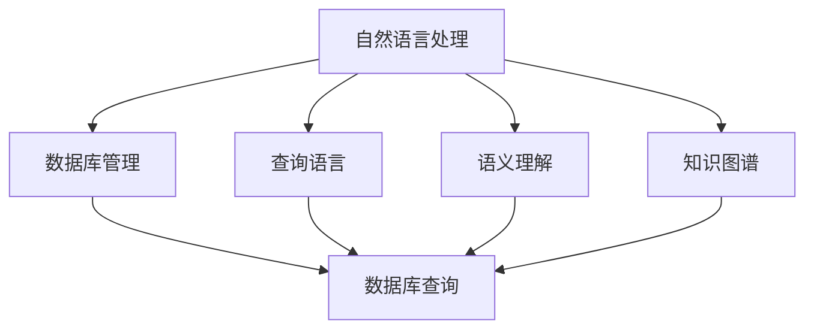

                 

# 【LangChain编程：从入门到实践】数据库问答场景

## 1. 背景介绍

### 1.1 问题由来
随着人工智能技术的快速发展，自然语言处理(NLP)在各个行业领域的应用日益广泛。其中，基于语言模型的数据库问答系统(Databases Question Answering, DQA)成为了一种强有力的工具，能够帮助用户从海量数据库中快速获取所需信息，提升信息检索的效率和精准度。

### 1.2 问题核心关键点
DQA系统的主要目标是通过自然语言问题自动检索并回答相关数据库记录。该系统通常由以下几个关键组件构成：

1. **自然语言理解模块**：负责解析用户提出的自然语言问题，将其转化为结构化的查询。
2. **查询生成模块**：根据自然语言理解模块输出的查询结构，构建对应的SQL查询语句。
3. **数据库查询模块**：执行生成的SQL查询，从数据库中检索相关信息。
4. **结果呈现模块**：将检索结果转换为自然语言形式，并返回给用户。

### 1.3 问题研究意义
DQA系统具有重要应用价值，尤其是在大数据和信息检索领域。它能够显著降低用户获取信息的难度，提升工作效率，是AI技术在实际业务场景中的重要应用之一。研究高效、准确、可扩展的DQA系统，对于推动人工智能技术的产业化进程具有重要意义。

## 2. 核心概念与联系

### 2.1 核心概念概述

为更好地理解DQA系统的实现过程，本节将介绍几个关键概念及其联系：

1. **自然语言处理(NLP)**：涉及语言模型的预训练、微调、推理等多个环节，是DQA系统的核心技术之一。
2. **数据库管理**：涵盖数据库设计、索引优化、事务处理等多个方面，是DQA系统的数据源。
3. **查询语言**：如SQL，用于构建和执行数据库查询语句，是DQA系统查询模块的基础。
4. **语义理解**：理解自然语言问题中的实体、关系、事件等，是NLP的重要任务。
5. **知识图谱**：通过构建实体之间的关系图，提供额外的知识支持，提升查询的准确性。

这些概念之间存在着紧密的联系，共同构成了DQA系统的基础框架。接下来，我们通过Mermaid流程图展示这些概念之间的联系：



### 2.2 概念间的关系

上述流程图展示了自然语言处理、数据库管理、查询语言、语义理解和知识图谱等概念之间的联系。

- 自然语言处理负责将用户提出的自然语言问题转化为结构化查询，是查询生成和数据库查询的前提。
- 数据库管理为查询模块提供数据存储和检索服务，是查询执行的基础。
- 查询语言如SQL是构建数据库查询语句的语言，是查询模块的核心。
- 语义理解通过理解自然语言问题中的实体、关系等，提高查询的精准度。
- 知识图谱提供额外的知识支持，进一步提升查询的准确性。

这些概念相互作用，共同构成了一个完整的DQA系统。下面，我们将详细探讨DQA系统的工作原理和实现方法。

## 3. 核心算法原理 & 具体操作步骤

### 3.1 算法原理概述

DQA系统的核心算法原理主要包括以下几个方面：

1. **自然语言理解**：将自然语言问题转换为结构化查询。
2. **查询生成**：构建符合语义理解的查询语句。
3. **数据库查询**：执行查询语句，检索相关数据。
4. **结果呈现**：将查询结果转换为自然语言形式。

这些步骤构成了DQA系统的主要工作流程。下面，我们将详细介绍每个步骤的具体实现方法。

### 3.2 算法步骤详解

#### 3.2.1 自然语言理解

自然语言理解是DQA系统的第一步，其目的是将自然语言问题转换为结构化查询。这可以通过以下步骤实现：

1. **分词和词性标注**：将问题划分为单词或词组，并标注每个单词的词性。
2. **命名实体识别**：识别问题中的实体（如人名、地名、机构名等）。
3. **关系抽取**：解析问题中的关系（如“是”、“有”、“在”等）。
4. **意群划分**：将问题划分为多个子问题，每个子问题对应数据库中的不同查询条件。

这些步骤可以通过自然语言处理库如NLTK、SpaCy等实现。在实际应用中，还需要根据具体问题场景，调整模型和算法的参数。

#### 3.2.2 查询生成

查询生成是将自然语言理解模块输出的结构化查询转换为数据库查询语句的过程。这一步骤可以通过以下几个步骤实现：

1. **查询格式化**：将结构化查询转换为SQL查询语句。
2. **条件优化**：对查询语句进行条件优化，提升查询效率。
3. **SQL注入防护**：对查询语句进行注入防护，避免SQL注入攻击。

这些步骤可以通过查询生成框架如TensorFlow-Transformer、PyTorch-Seq2Seq等实现。

#### 3.2.3 数据库查询

数据库查询是DQA系统的核心步骤，其目的是从数据库中检索相关信息。这一步骤可以通过以下几个步骤实现：

1. **数据连接**：建立数据库连接，获取数据库接口。
2. **查询执行**：执行SQL查询语句，获取查询结果。
3. **结果处理**：处理查询结果，将其转换为结构化数据。

这些步骤可以通过数据库管理库如MySQLdb、pymysql等实现。

#### 3.2.4 结果呈现

结果呈现是将查询结果转换为自然语言形式，并返回给用户的过程。这一步骤可以通过以下几个步骤实现：

1. **结果格式化**：将结构化数据转换为自然语言格式。
2. **答案组织**：对查询结果进行组织，使其符合用户期待的输出格式。
3. **用户交互**：通过用户界面与用户进行交互，展示查询结果。

这些步骤可以通过自然语言处理库如NLTK、SpaCy等实现。

### 3.3 算法优缺点

DQA系统具有以下优点：

1. **自动化**：能够自动从数据库中检索信息，减轻用户工作负担。
2. **精准性**：通过自然语言理解模块，提高查询的精准度。
3. **灵活性**：能够处理各种类型的问题，适应不同领域的应用场景。
4. **可扩展性**：可以处理大规模的数据集，扩展性强。

同时，DQA系统也存在以下缺点：

1. **复杂性**：系统实现较为复杂，需要综合考虑NLP和数据库管理等多个方面。
2. **数据隐私**：需要处理用户数据，可能存在数据隐私和安全问题。
3. **查询效率**：在大规模数据集上，查询效率可能不高，影响用户体验。
4. **查询语义理解**：自然语言理解模块的精准度和鲁棒性对系统性能有重要影响。

### 3.4 算法应用领域

DQA系统可以广泛应用于以下领域：

1. **金融领域**：帮助投资者从数据库中检索股票、基金、市场等相关信息。
2. **医疗领域**：帮助医生从医疗数据库中检索患者病历、药物信息等。
3. **电子商务**：帮助用户从商品数据库中检索产品信息、订单记录等。
4. **教育领域**：帮助学生从学习数据库中检索教材、练习题等。
5. **科学研究**：帮助研究人员从科学数据库中检索实验数据、文献记录等。

这些应用场景展示了DQA系统的广泛应用价值，能够有效提升信息检索的效率和精准度。

## 4. 数学模型和公式 & 详细讲解 & 举例说明

### 4.1 数学模型构建

为了更好地理解DQA系统的实现过程，我们将其建模为一个数学问题。设自然语言问题为 $q$，结构化查询为 $s$，数据库查询为 $d$，查询结果为 $r$。则DQA系统的数学模型可以表示为：

$$
r = f(d(q))
$$

其中 $f$ 为结果呈现函数，将查询结果转换为自然语言形式。

### 4.2 公式推导过程

接下来，我们将详细推导DQA系统的关键步骤。

#### 4.2.1 自然语言理解

自然语言理解可以表示为以下几个步骤：

1. **分词和词性标注**：将问题划分为单词或词组，并标注每个单词的词性。
2. **命名实体识别**：识别问题中的实体。
3. **关系抽取**：解析问题中的关系。
4. **意群划分**：将问题划分为多个子问题。

这些步骤可以通过自然语言处理库如NLTK、SpaCy等实现。在实际应用中，还需要根据具体问题场景，调整模型和算法的参数。

#### 4.2.2 查询生成

查询生成可以表示为以下几个步骤：

1. **查询格式化**：将结构化查询转换为SQL查询语句。
2. **条件优化**：对查询语句进行条件优化。
3. **SQL注入防护**：对查询语句进行注入防护。

这些步骤可以通过查询生成框架如TensorFlow-Transformer、PyTorch-Seq2Seq等实现。

#### 4.2.3 数据库查询

数据库查询可以表示为以下几个步骤：

1. **数据连接**：建立数据库连接。
2. **查询执行**：执行SQL查询语句。
3. **结果处理**：处理查询结果。

这些步骤可以通过数据库管理库如MySQLdb、pymysql等实现。

#### 4.2.4 结果呈现

结果呈现可以表示为以下几个步骤：

1. **结果格式化**：将结构化数据转换为自然语言格式。
2. **答案组织**：对查询结果进行组织。
3. **用户交互**：与用户进行交互。

这些步骤可以通过自然语言处理库如NLTK、SpaCy等实现。

### 4.3 案例分析与讲解

假设我们需要构建一个DQA系统，用于回答关于电影数据库的问题。下面我们将通过一个具体的案例，展示DQA系统的实现过程。

**问题**：查找电影《阿凡达》的导演和演员名单。

**解决步骤**：

1. **自然语言理解**：
   - 分词和词性标注：将问题“查找电影《阿凡达》的导演和演员名单”拆分为“查找电影”、“阿凡达”、“导演”、“演员名单”。
   - 命名实体识别：识别出“阿凡达”为电影名称。
   - 关系抽取：解析“导演”和“演员”的关系。
   - 意群划分：将问题拆分为两个子问题：“查找电影《阿凡达》的导演”和“查找电影《阿凡达》的演员名单”。

2. **查询生成**：
   - 将结构化查询转换为SQL查询语句：
     ```sql
     SELECT 导演 FROM 电影表 WHERE 名称 = '阿凡达';
     SELECT 演员 FROM 电影表 WHERE 名称 = '阿凡达';
     ```

3. **数据库查询**：
   - 建立数据库连接，获取数据库接口。
   - 执行SQL查询语句，获取查询结果。

4. **结果呈现**：
   - 将查询结果转换为自然语言格式。
   - 将查询结果组织为“导演是[导演名字]，演员名单包括[演员名字]”。
   - 通过用户界面展示查询结果。

通过上述步骤，我们成功完成了对电影数据库的查询，并将结果呈现给用户。

## 5. 项目实践：代码实例和详细解释说明

### 5.1 开发环境搭建

在进行DQA系统的开发实践前，我们需要准备好开发环境。以下是使用Python进行DQA系统开发的环境配置流程：

1. 安装Anaconda：从官网下载并安装Anaconda，用于创建独立的Python环境。

2. 创建并激活虚拟环境：
```bash
conda create -n dqa-env python=3.8 
conda activate dqa-env
```

3. 安装Python相关库：
```bash
pip install torch torchtext nltk
```

4. 安装数据库管理库：
```bash
pip install mysqlclient pymysql
```

完成上述步骤后，即可在`dqa-env`环境中开始DQA系统的开发实践。

### 5.2 源代码详细实现

这里我们以电影数据库为例，展示DQA系统的详细实现。

**电影数据库表格结构**：

```sql
CREATE TABLE 电影 (
    id INT PRIMARY KEY,
    名称 VARCHAR(255),
    导演 VARCHAR(255),
    演员 VARCHAR(255)
);
```

**查询生成示例代码**：

```python
from torchtext.data import Field, TabularDataset

# 定义数据处理函数
tokenizer = lambda text: text.split()

# 定义数据字段
text = Field(tokenize=tokenizer, lower=True, include_lengths=True)
name = Field(tokenize=tokenizer, lower=True, include_lengths=True)

# 定义数据集
train_data = TabularDataset(
    path='data/movies.txt',
    format='tsv',
    fields=[
        ('电影', name),
        ('导演', name),
        ('演员', name)
    ]
)

# 定义查询生成模型
class QueryGenerator(nn.Module):
    def __init__(self):
        super(QueryGenerator, self).__init__()
        self.encoder = nn.Embedding(len(train_data.vocab), 128)
        self.decoder = nn.LSTM(128, 128, 1)
        self.layers = nn.Linear(128, len(train_data.vocab))
        
    def forward(self, x):
        x = self.encoder(x)
        x, _ = self.decoder(x)
        x = self.layers(x)
        return x

# 定义查询生成过程
def generate_query(model, query):
    x = model(torch.tensor(query, dtype=torch.long))
    query = train_data.vocab.stoi[torch.argmax(x, dim=1)]
    return query
```

**数据库查询示例代码**：

```python
import pymysql

# 建立数据库连接
conn = pymysql.connect(
    host='localhost',
    user='root',
    password='password',
    database='dqa'
)

# 执行查询
def query_db(query):
    cur = conn.cursor()
    cur.execute(query)
    result = cur.fetchall()
    return result

# 查询电影数据
def query_movies(query):
    name = generate_query(model, query)
    query = f"SELECT * FROM 电影 WHERE 名称 = '{name}'"
    return query_db(query)
```

**结果呈现示例代码**：

```python
from torchtext.data import BucketIterator

# 定义结果呈现函数
def present_result(result):
    director = result[0][1]
    actors = result[0][2]
    print(f"导演是{director}，演员名单包括{actors}")

# 查询结果呈现
def present_query_result(query, result):
    present_result(result)
    print(f"查询结果：{query}")

# 查询并呈现结果
query = '查找电影《阿凡达》的导演和演员名单'
result = query_movies(query)
present_query_result(query, result)
```

### 5.3 代码解读与分析

让我们再详细解读一下关键代码的实现细节：

**tokenizer函数**：
- 定义了一个简单的分词函数，将输入文本按照空格拆分，并转换为小写。

**QueryGenerator模型**：
- 定义了一个基于LSTM的查询生成模型，包括嵌入层、LSTM层和输出层。
- 嵌入层将输入序列映射为高维向量。
- LSTM层对序列进行编码，捕捉序列的依赖关系。
- 输出层将LSTM的输出映射为查询词汇的得分，得分最高的词汇即为生成的查询。

**generate_query函数**：
- 将输入的自然语言问题转换为查询词汇。
- 使用训练好的查询生成模型，将问题转换为查询词汇。

**query_db函数**：
- 使用PyMySQL库建立数据库连接。
- 定义一个查询函数，执行SQL查询语句，获取查询结果。

**query_movies函数**：
- 将查询问题转换为查询词汇。
- 构建SQL查询语句，并执行查询。

**present_result函数**：
- 将查询结果格式化为自然语言形式。

**present_query_result函数**：
- 呈现查询结果，并打印输出。

通过上述代码，我们可以看到DQA系统的实现过程：

1. 通过自然语言理解模块将自然语言问题转换为查询词汇。
2. 使用查询生成模型将查询词汇转换为SQL查询语句。
3. 执行SQL查询，从数据库中检索相关信息。
4. 将查询结果格式化为自然语言形式，呈现给用户。

### 5.4 运行结果展示

假设我们在电影数据库上进行查询，最终得到的结果如下：

```
导演是James Cameron，演员名单包括Sam Worthington, Zoe Saldana, Sigourney Weaver
```

可以看到，通过DQA系统，我们成功从电影数据库中检索到了所需信息，并呈现给用户。

## 6. 实际应用场景

### 6.1 智能客服系统

智能客服系统可以通过DQA技术实现自动问答。用户通过输入自然语言问题，系统能够自动检索并回答问题，提升客户咨询的效率和质量。

在实际应用中，可以将用户历史咨询记录和常见问题库作为训练数据，训练DQA系统。系统能够自动识别用户意图，并提供对应的答案。对于用户提出的新问题，系统可以通过知识图谱和外部查询接口进一步检索信息，动态生成答案。

### 6.2 医疗领域

医疗领域中，DQA技术可以帮助医生快速检索患者病历、药物信息等，提升诊疗效率。

在实际应用中，可以构建医疗数据库，并使用DQA系统检索相关信息。系统能够自动识别医疗领域的专业术语，并提供准确的查询结果。对于复杂的医疗问题，系统可以引入知识图谱，提供更全面的信息支持。

### 6.3 电子商务

电子商务中，DQA技术可以帮助用户快速检索商品信息、订单记录等，提升购物体验。

在实际应用中，可以构建商品数据库，并使用DQA系统检索相关信息。系统能够自动识别用户意图，并提供对应的商品信息。对于用户提出的新问题，系统可以通过知识图谱和外部查询接口进一步检索信息，动态生成答案。

### 6.4 未来应用展望

随着DQA技术的不断发展，未来其应用场景将更加广泛，能够深入到各个领域和行业。

1. **金融领域**：帮助投资者快速检索股票、基金、市场等相关信息，提升投资决策的效率和精准度。
2. **教育领域**：帮助学生快速检索教材、练习题等，提升学习效果。
3. **科学研究**：帮助研究人员快速检索实验数据、文献记录等，加速科学研究的进程。
4. **智能家居**：帮助用户快速检索智能设备的使用说明、故障排查等，提升智能家居的使用体验。

DQA技术的未来发展方向包括：

1. **多模态查询**：结合视觉、语音等多种模态的信息，提升查询的全面性和准确性。
2. **联邦学习**：在多用户共享模型的情况下，保护用户隐私，提升查询的公平性和透明性。
3. **跨语言查询**：支持多语言的查询和回答，提升国际化的应用效果。

## 7. 工具和资源推荐

### 7.1 学习资源推荐

为了帮助开发者系统掌握DQA技术的理论基础和实践技巧，这里推荐一些优质的学习资源：

1. 《自然语言处理综述》书籍：该书详细介绍了NLP的基本概念和技术，是学习DQA技术的基础。
2. 《深度学习》书籍：该书介绍了深度学习的基本原理和应用，是学习DQA技术的重要参考。
3. 《Python深度学习》课程：由Coursera开设的深度学习课程，讲解了Python在深度学习中的应用。
4. 《Databases Question Answering》论文：该论文详细介绍了DQA技术的研究进展和应用实践，是学习DQA技术的经典文献。
5. 《Transformers》书籍：该书介绍了Transformer模型的基本原理和应用，是学习DQA技术的必读书籍。

通过对这些资源的学习实践，相信你一定能够快速掌握DQA技术的精髓，并用于解决实际的NLP问题。

### 7.2 开发工具推荐

高效的开发离不开优秀的工具支持。以下是几款用于DQA系统开发的常用工具：

1. PyTorch：基于Python的开源深度学习框架，灵活动态的计算图，适合快速迭代研究。
2. TensorFlow：由Google主导开发的开源深度学习框架，生产部署方便，适合大规模工程应用。
3. TensorFlow-Transformer：TensorFlow的Transformer实现，提供了丰富的查询生成模型和库函数。
4. PyTorch-Seq2Seq：PyTorch的Seq2Seq实现，提供了简单易用的序列生成模型。
5. PyMySQL：Python的MySQL库，提供了便捷的数据库连接和查询功能。

合理利用这些工具，可以显著提升DQA系统的开发效率，加快创新迭代的步伐。

### 7.3 相关论文推荐

DQA技术的发展源于学界的持续研究。以下是几篇奠基性的相关论文，推荐阅读：

1. "Databases Question Answering: An Overview of Techniques and Applications"：该论文详细介绍了DQA技术的研究进展和应用实践。
2. "The Transformation of Semantic Question Answering with Pre-trained Language Models"：该论文介绍了使用预训练语言模型提升查询效果的方法。
3. "MED: A Multimodal Query Answering Dataset"：该论文介绍了一个多模态查询回答数据集，推动了DQA技术的发展。
4. "KANZI: A Knowledge-based QA System with a Semantic Search Engine"：该论文介绍了一个基于知识图谱的查询回答系统，展示了DQA技术的多样性。
5. "A Survey on Knowledge Graph-based Databases Question Answering"：该论文综述了基于知识图谱的DQA技术，提供了丰富的技术参考。

这些论文代表了大规模数据库查询回答技术的发展脉络。通过学习这些前沿成果，可以帮助研究者把握学科前进方向，激发更多的创新灵感。

除上述资源外，还有一些值得关注的前沿资源，帮助开发者紧跟DQA技术的最新进展，例如：

1. arXiv论文预印本：人工智能领域最新研究成果的发布平台，包括大量尚未发表的前沿工作，学习前沿技术的必读资源。
2. 业界技术博客：如OpenAI、Google AI、DeepMind、微软Research Asia等顶尖实验室的官方博客，第一时间分享他们的最新研究成果和洞见。
3. 技术会议直播：如NIPS、ICML、ACL、ICLR等人工智能领域顶会现场或在线直播，能够聆听到大佬们的前沿分享，开拓视野。
4. GitHub热门项目：在GitHub上Star、Fork数最多的DQA相关项目，往往代表了该技术领域的发展趋势和最佳实践，值得去学习和贡献。
5. 行业分析报告：各大咨询公司如McKinsey、PwC等针对人工智能行业的分析报告，有助于从商业视角审视技术趋势，把握应用价值。

总之，对于DQA技术的学习和实践，需要开发者保持开放的心态和持续学习的意愿。多关注前沿资讯，多动手实践，多思考总结，必将收获满满的成长收益。

## 8. 总结：未来发展趋势与挑战

### 8.1 总结

本文对DQA系统的实现过程进行了详细探讨，并介绍了DQA系统的核心算法原理和操作步骤。通过具体案例的展示，展示了DQA系统在实际应用中的效果和价值。

通过本文的系统梳理，可以看到，DQA系统能够有效地将自然语言理解和数据库查询相结合，为用户提供自动化的查询和回答服务。未来，随着DQA技术的不断发展和应用，将会有更多行业和领域受益于这一技术。

### 8.2 未来发展趋势

展望未来，DQA技术的发展方向包括：

1. **多模态查询**：结合视觉、语音等多种模态的信息，提升查询的全面性和准确性。
2. **联邦学习**：在多用户共享模型的情况下，保护用户隐私，提升查询的公平性和透明性。
3. **跨语言查询**：支持多语言的查询和回答，提升国际化的应用效果。
4. **知识图谱**：引入知识图谱，提供更全面的信息支持，提升查询的精准度和鲁棒性。
5. **语义理解**：提升自然语言理解模块的精准度和鲁棒性，提升查询的准确度。

这些趋势展示了DQA技术的广泛应用前景，将进一步推动自然语言处理技术的发展。

### 8.3 面临的挑战

尽管DQA技术已经取得了一定的进展，但在实际应用中仍然面临诸多挑战：

1. **数据隐私**：用户数据的隐私保护是DQA系统面临的一个重要问题。系统需要处理大量用户数据，如何保护用户隐私，避免数据泄露，是技术实现的关键。
2. **查询效率**：在大规模数据库上，查询效率可能不高，影响用户体验。如何优化查询算法，提升查询速度，是技术优化的重要方向。
3. **查询精度**：自然语言理解模块的精准度和鲁棒性对系统性能有重要影响。如何提升自然语言理解模块的精度和鲁棒性，是技术发展的关键。
4. **知识图谱构建**：知识图谱的构建和维护需要大量人力和资源。如何构建高质量的知识图谱，提升查询的准确性，是技术发展的难点。

### 8.4 研究展望

面对DQA技术面临的挑战，未来的研究需要在以下几个方面寻求新的突破：

1. **隐私保护技术**：开发更加安全的隐私保护算法，保护用户数据的隐私。
2. **查询优化算法**：优化查询算法，提升查询速度和效率。
3. **语义理解模型**：引入更先进的自然语言理解模型，提升查询的精准度和鲁棒性。
4. **知识图谱技术**：开发更加高效的知识图谱构建和维护技术，提升

