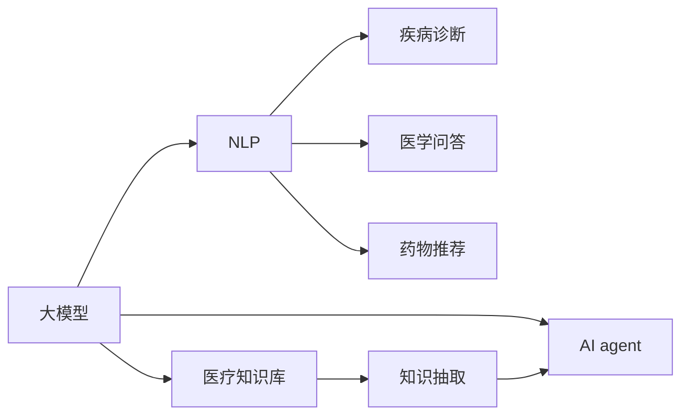
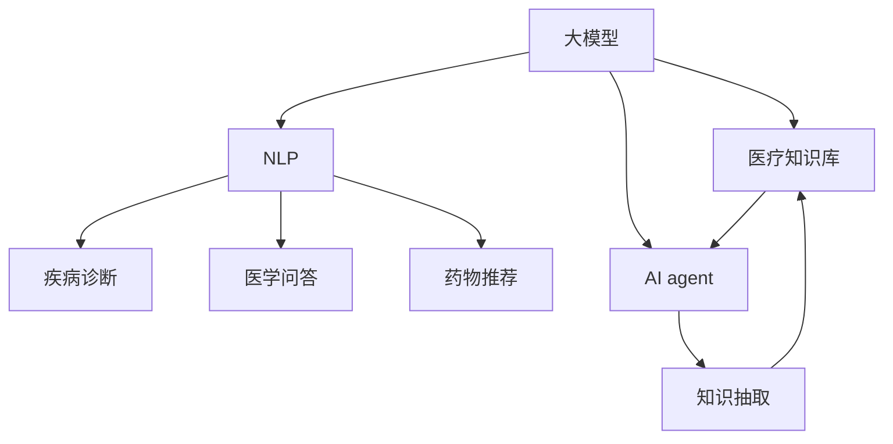
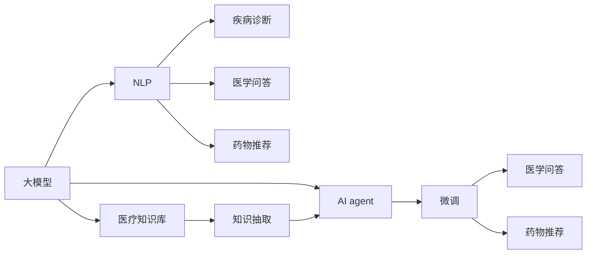
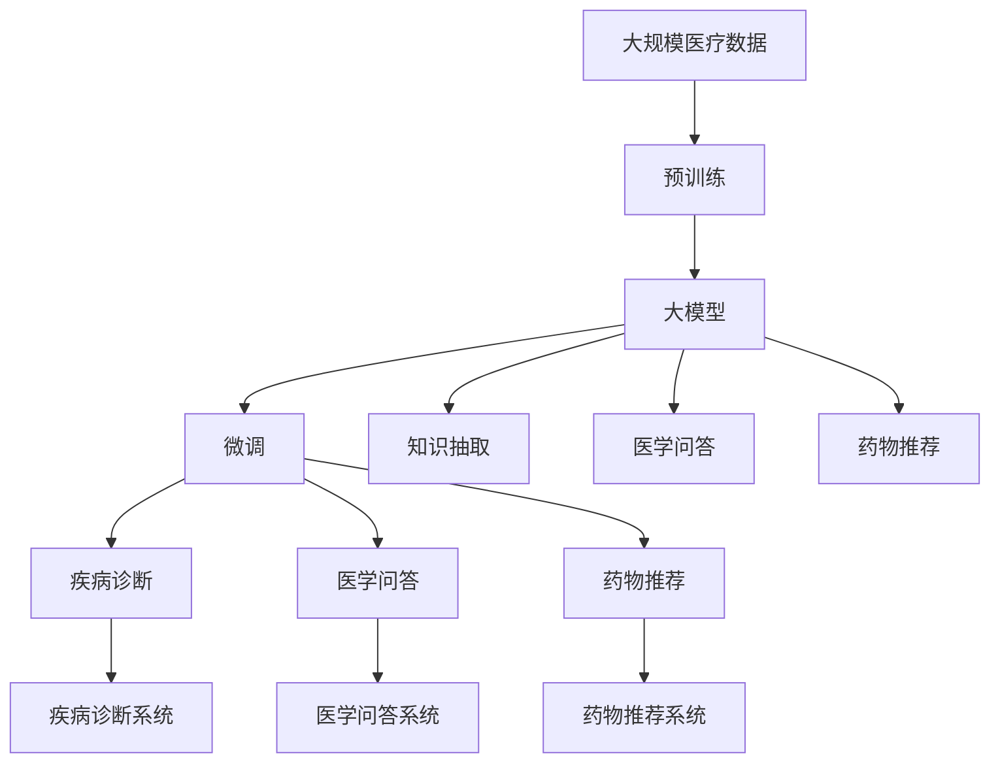

                 

# 【大模型应用开发 动手做AI Agent】医疗保健的变革

> 关键词：
> 大模型, 自然语言处理(NLP), 医疗保健, AI agent, 疾病诊断, 医学问答, 药物推荐, 医疗文本分析, 模型微调

## 1. 背景介绍

### 1.1 问题由来
医疗保健行业正面临前所未有的挑战。随着全球人口老龄化的加剧，慢性病发病率不断上升，医疗资源紧张的问题日益突出。如何有效利用有限的医疗资源，改善病患生活质量，成为当下最紧迫的任务之一。

传统医疗诊断和治疗过程繁琐耗时，误诊和漏诊的风险也不可避免。以自然语言处理(NLP)技术为基础的人工智能(AI)，特别是基于大模型的AI agent，有望改变这一现状。借助大模型技术，AI agent能够从海量医疗数据中快速提取有用信息，辅助医生进行疾病诊断、治疗方案制定、药物推荐等工作，有效提升诊疗效率和准确性。

### 1.2 问题核心关键点
基于大模型的AI agent在医疗保健领域的应用，核心在于将自然语言处理(NLP)和医疗知识相结合，形成智能化的医疗信息提取和推理系统。通过学习医疗文献、患者病历等大量数据，AI agent能够在不依赖专家的前提下，自行解析和处理医疗问题，从而提升医疗决策的效率和质量。

这一过程中，大模型通过预训练学到了通用的语言表示和知识，而微调则使其能够适应特定的医疗任务，如疾病诊断、医学问答、药物推荐等。通过微调，AI agent可以不断优化其模型，提升其在特定任务上的性能。

## 2. 核心概念与联系

### 2.1 核心概念概述

为更好地理解大模型在医疗保健领域的应用，本节将介绍几个密切相关的核心概念：

- **大模型(Large Model)**：指具有庞大参数量和深层次结构的语言模型，如BERT、GPT等。这些模型通过在大规模语料上进行自监督学习，学习到丰富的语言表示和知识。

- **自然语言处理(NLP)**：涉及计算机对自然语言的理解、处理和生成，是AI agent在医疗领域发挥作用的基础。

- **医疗知识库(Knowledge Base)**：包含医学领域的专业术语、疾病信息、药物信息等知识，是大模型和AI agent获取医疗知识的重要来源。

- **AI agent**：指基于AI技术构建的应用程序，能够模拟人类智能行为，执行特定任务。在医疗领域，AI agent主要用于辅助医生进行疾病诊断、治疗方案制定、药物推荐等。

- **疾病诊断(Diagnosis)**：指通过症状分析、病历审查等手段，确定患者所患疾病的类型和严重程度。

- **医学问答(Question Answering)**：指基于医疗知识库，对患者提问的医学问题进行回答。

- **药物推荐(Pharmacy Recommendation)**：指根据患者病历和药物信息，推荐适合的药物。

- **模型微调(Fine-Tuning)**：指在大模型的基础上，通过下游任务的少量标注数据进行有监督训练，调整模型参数，使其适应特定任务。

这些核心概念之间的逻辑关系可以通过以下Mermaid流程图来展示：



这个流程图展示了从大模型到大模型在医疗领域应用的全过程：

1. 大模型通过自监督学习获得语言表示和知识。
2. 利用NLP技术，将语言表示与医疗知识库相结合，形成智能化的医疗信息提取和推理系统。
3. AI agent基于大模型的语言表示和医疗知识库，辅助医生进行疾病诊断、医学问答、药物推荐等工作。

### 2.2 概念间的关系

这些核心概念之间存在着紧密的联系，形成了大模型在医疗保健领域应用的整体框架。下面我们通过几个Mermaid流程图来展示这些概念之间的关系。

#### 2.2.1 大模型在医疗领域的应用



这个流程图展示了从大模型到AI agent在医疗领域的具体应用过程：

1. 大模型通过自监督学习获得语言表示和知识。
2. 利用NLP技术，将语言表示与医疗知识库相结合，形成智能化的医疗信息提取和推理系统。
3. AI agent基于大模型的语言表示和医疗知识库，辅助医生进行疾病诊断、医学问答、药物推荐等工作。

#### 2.2.2 模型微调与AI agent的关系



这个流程图展示了AI agent通过微调进一步优化其在医疗任务上的表现：

1. 大模型通过自监督学习获得语言表示和知识。
2. 利用NLP技术，将语言表示与医疗知识库相结合，形成智能化的医疗信息提取和推理系统。
3. AI agent基于大模型的语言表示和医疗知识库，辅助医生进行疾病诊断、医学问答、药物推荐等工作。
4. AI agent通过微调进一步优化其在特定任务上的性能。

### 2.3 核心概念的整体架构

最后，我们用一个综合的流程图来展示这些核心概念在大模型在医疗保健领域应用过程中的整体架构：



这个综合流程图展示了从预训练到大模型在医疗领域应用的完整过程：

1. 从大规模医疗数据出发，进行预训练获得语言表示和知识。
2. 利用大模型语言表示和医疗知识库，构建疾病诊断、医学问答、药物推荐等系统。
3. 通过微调进一步优化大模型在特定任务上的性能。

通过这些流程图，我们可以更清晰地理解大模型在医疗保健领域应用过程中各个核心概念的关系和作用，为后续深入讨论具体的微调方法和技术奠定基础。

## 3. 核心算法原理 & 具体操作步骤
### 3.1 算法原理概述

基于大模型的AI agent在医疗保健领域的应用，本质上是将自然语言处理(NLP)和医疗知识库相结合，构建智能化的医疗信息提取和推理系统。其核心算法原理如下：

1. **预训练(Large Pre-training)**：利用大规模无标签医疗数据，对大模型进行预训练，学习通用的语言表示和知识。

2. **微调(Fine-Tuning)**：基于下游任务的少量标注数据，对大模型进行微调，调整模型参数，使其适应特定医疗任务，如疾病诊断、医学问答、药物推荐等。

3. **知识抽取(Knowledge Extraction)**：从医疗文献、病历记录等文本数据中，提取有用的医疗知识信息。

4. **医学问答(Question Answering)**：根据患者提问，在医疗知识库中搜索相关知识，进行推理和回答。

5. **药物推荐(Pharmacy Recommendation)**：根据患者病历和药物信息，结合医疗知识库，推荐适合的药物。

这些算法步骤相互关联，共同构成了大模型在医疗保健领域的完整应用流程。

### 3.2 算法步骤详解

#### 3.2.1 预训练

预训练是大模型获取语言表示和知识的关键步骤。其步骤如下：

1. **数据收集**：收集大规模的医疗文本数据，如病历记录、医疗文献等。
2. **数据预处理**：对文本数据进行清洗、分词、去停用词等预处理步骤。
3. **模型训练**：在预处理后的数据上，利用自监督学习任务训练大模型，如语言建模、掩码语言模型等。

例如，在语言建模任务中，大模型学习将输入的文本序列预测下一个单词的概率分布，从而学习到单词之间的依赖关系。

#### 3.2.2 微调

微调是大模型适应特定医疗任务的过程。其步骤如下：

1. **任务适配层设计**：根据具体任务，在大模型的顶层添加相应的输出层和损失函数。例如，在疾病诊断任务中，可以使用交叉熵损失函数，将模型输出与正确标签对比。
2. **模型初始化**：将大模型的权重作为初始参数，在任务数据上进行有监督训练。
3. **优化器选择**：选择合适的优化器，如AdamW，设置学习率和迭代轮数。
4. **正则化技术**：应用L2正则、Dropout等技术，防止模型过拟合。
5. **模型评估**：在验证集上评估模型性能，如准确率、召回率等。
6. **模型微调**：在训练集上继续迭代，更新模型参数，直到模型收敛。

#### 3.2.3 知识抽取

知识抽取是大模型从文本数据中提取有用信息的过程。其步骤如下：

1. **实体识别**：利用命名实体识别(NER)技术，识别文本中的实体信息，如疾病名称、症状等。
2. **关系抽取**：利用关系抽取技术，识别实体之间的关系，如疾病与症状的关系。
3. **知识图谱构建**：将抽取的实体和关系信息构建成知识图谱，便于后续查询和推理。

#### 3.2.4 医学问答

医学问答是基于医疗知识库，对患者提问进行回答的过程。其步骤如下：

1. **问题解析**：利用自然语言处理技术，解析患者提出的问题。
2. **知识检索**：在医疗知识库中检索与问题相关的知识信息。
3. **推理回答**：根据检索结果，进行推理和回答。

#### 3.2.5 药物推荐

药物推荐是根据患者病历和药物信息，推荐适合的药物的过程。其步骤如下：

1. **病历分析**：利用大模型分析患者的病历信息，提取有用特征。
2. **药物筛选**：根据患者病历信息和药物知识库，筛选适合的药物。
3. **推荐生成**：根据筛选结果，生成推荐列表。

### 3.3 算法优缺点

基于大模型的AI agent在医疗保健领域的应用，具有以下优点：

1. **高效性**：大模型通过预训练学习到丰富的语言知识和医学知识，能够在短时间内快速提取和处理大量医疗信息，提高诊疗效率。
2. **准确性**：通过微调和知识抽取，AI agent能够精准地理解患者病历和提问，提供准确的医疗建议。
3. **泛化能力**：大模型具备较强的泛化能力，能够处理多种医疗场景和问题。

同时，该方法也存在以下缺点：

1. **数据依赖**：大模型和AI agent的性能依赖于标注数据的质量和数量，获取高质量标注数据的成本较高。
2. **知识不足**：尽管大模型通过预训练学到了丰富的语言表示，但在特定领域的知识仍然有限，需要依赖医疗知识库来补充。
3. **安全问题**：医疗领域涉及患者隐私和生命安全，AI agent在处理敏感信息时需要考虑安全性和隐私保护。

尽管存在这些缺点，但通过不断优化和改进，大模型在医疗保健领域的应用前景仍然非常广阔。

### 3.4 算法应用领域

基于大模型的AI agent在医疗保健领域的应用非常广泛，涵盖了以下几个方面：

1. **疾病诊断**：利用大模型分析患者病历和症状，辅助医生进行疾病诊断。
2. **医学问答**：在医疗知识库的基础上，回答患者的医学问题，提供疾病预防、治疗等建议。
3. **药物推荐**：根据患者病历和药物信息，推荐适合的药物，辅助医生制定治疗方案。
4. **医疗文本分析**：利用大模型分析医疗文本数据，提取有用的信息，如病情趋势、疾病流行等。

除了上述这些应用，大模型还可以应用于医疗图像分析、智能排班、健康管理等多个领域，为医疗保健带来新的变革。

## 4. 数学模型和公式 & 详细讲解  
### 4.1 数学模型构建

本节将使用数学语言对基于大模型的AI agent在医疗保健领域的应用进行更加严格的刻画。

设预训练语言模型为 $M_{\theta}$，其中 $\theta$ 为预训练得到的模型参数。给定医疗领域任务 $T$ 的标注数据集 $D=\{(x_i,y_i)\}_{i=1}^N$，微调的目标是找到新的模型参数 $\hat{\theta}$，使得：

$$
\hat{\theta}=\mathop{\arg\min}_{\theta} \mathcal{L}(M_{\theta},D)
$$

其中 $\mathcal{L}$ 为针对任务 $T$ 设计的损失函数，用于衡量模型预测输出与真实标签之间的差异。常见的损失函数包括交叉熵损失、均方误差损失等。

通过梯度下降等优化算法，微调过程不断更新模型参数 $\theta$，最小化损失函数 $\mathcal{L}$，使得模型输出逼近真实标签。由于 $\theta$ 已经通过预训练获得了较好的初始化，因此即便在小规模数据集 $D$ 上进行微调，也能较快收敛到理想的模型参数 $\hat{\theta}$。

### 4.2 公式推导过程

以下我们以疾病诊断任务为例，推导交叉熵损失函数及其梯度的计算公式。

假设模型 $M_{\theta}$ 在输入 $x$ 上的输出为 $\hat{y}=M_{\theta}(x) \in [0,1]$，表示样本属于某个疾病的概率。真实标签 $y \in \{0,1\}$。则二分类交叉熵损失函数定义为：

$$
\ell(M_{\theta}(x),y) = -[y\log \hat{y} + (1-y)\log (1-\hat{y})]
$$

将其代入经验风险公式，得：

$$
\mathcal{L}(\theta) = -\frac{1}{N}\sum_{i=1}^N [y_i\log M_{\theta}(x_i)+(1-y_i)\log(1-M_{\theta}(x_i))]
$$

根据链式法则，损失函数对参数 $\theta_k$ 的梯度为：

$$
\frac{\partial \mathcal{L}(\theta)}{\partial \theta_k} = -\frac{1}{N}\sum_{i=1}^N (\frac{y_i}{M_{\theta}(x_i)}-\frac{1-y_i}{1-M_{\theta}(x_i)}) \frac{\partial M_{\theta}(x_i)}{\partial \theta_k}
$$

其中 $\frac{\partial M_{\theta}(x_i)}{\partial \theta_k}$ 可进一步递归展开，利用自动微分技术完成计算。

在得到损失函数的梯度后，即可带入参数更新公式，完成模型的迭代优化。重复上述过程直至收敛，最终得到适应下游任务的最优模型参数 $\theta^*$。

## 5. 项目实践：代码实例和详细解释说明
### 5.1 开发环境搭建

在进行医疗保健领域的应用开发前，我们需要准备好开发环境。以下是使用Python进行PyTorch开发的环境配置流程：

1. 安装Anaconda：从官网下载并安装Anaconda，用于创建独立的Python环境。

2. 创建并激活虚拟环境：
```bash
conda create -n pytorch-env python=3.8 
conda activate pytorch-env
```

3. 安装PyTorch：根据CUDA版本，从官网获取对应的安装命令。例如：
```bash
conda install pytorch torchvision torchaudio cudatoolkit=11.1 -c pytorch -c conda-forge
```

4. 安装TensorFlow：从官网下载并安装TensorFlow，用于模型训练和推理。

5. 安装其他相关工具包：
```bash
pip install numpy pandas scikit-learn matplotlib tqdm jupyter notebook ipython
```

完成上述步骤后，即可在`pytorch-env`环境中开始开发实践。

### 5.2 源代码详细实现

这里以疾病诊断任务为例，给出使用Transformers库对BERT模型进行微调的PyTorch代码实现。

首先，定义疾病诊断任务的数据处理函数：

```python
from transformers import BertTokenizer
from torch.utils.data import Dataset
import torch

class DiagnosisDataset(Dataset):
    def __init__(self, texts, labels, tokenizer, max_len=128):
        self.texts = texts
        self.labels = labels
        self.tokenizer = tokenizer
        self.max_len = max_len
        
    def __len__(self):
        return len(self.texts)
    
    def __getitem__(self, item):
        text = self.texts[item]
        label = self.labels[item]
        
        encoding = self.tokenizer(text, return_tensors='pt', max_length=self.max_len, padding='max_length', truncation=True)
        input_ids = encoding['input_ids'][0]
        attention_mask = encoding['attention_mask'][0]
        
        # 对标签进行编码
        label_ids = [1 if label=='disease' else 0 for label in labels] 
        label_ids.extend([0]*(self.max_len - len(label_ids)))
        labels = torch.tensor(label_ids, dtype=torch.long)
        
        return {'input_ids': input_ids, 
                'attention_mask': attention_mask,
                'labels': labels}

# 标签与id的映射
label2id = {'disease': 1, 'no_disease': 0}
id2label = {v: k for k, v in label2id.items()}

# 创建dataset
tokenizer = BertTokenizer.from_pretrained('bert-base-cased')

train_dataset = DiagnosisDataset(train_texts, train_labels, tokenizer)
dev_dataset = DiagnosisDataset(dev_texts, dev_labels, tokenizer)
test_dataset = DiagnosisDataset(test_texts, test_labels, tokenizer)
```

然后，定义模型和优化器：

```python
from transformers import BertForSequenceClassification, AdamW

model = BertForSequenceClassification.from_pretrained('bert-base-cased', num_labels=2)

optimizer = AdamW(model.parameters(), lr=2e-5)
```

接着，定义训练和评估函数：

```python
from torch.utils.data import DataLoader
from tqdm import tqdm
from sklearn.metrics import classification_report

device = torch.device('cuda') if torch.cuda.is_available() else torch.device('cpu')
model.to(device)

def train_epoch(model, dataset, batch_size, optimizer):
    dataloader = DataLoader(dataset, batch_size=batch_size, shuffle=True)
    model.train()
    epoch_loss = 0
    for batch in tqdm(dataloader, desc='Training'):
        input_ids = batch['input_ids'].to(device)
        attention_mask = batch['attention_mask'].to(device)
        labels = batch['labels'].to(device)
        model.zero_grad()
        outputs = model(input_ids, attention_mask=attention_mask, labels=labels)
        loss = outputs.loss
        epoch_loss += loss.item()
        loss.backward()
        optimizer.step()
    return epoch_loss / len(dataloader)

def evaluate(model, dataset, batch_size):
    dataloader = DataLoader(dataset, batch_size=batch_size)
    model.eval()
    preds, labels = [], []
    with torch.no_grad():
        for batch in tqdm(dataloader, desc='Evaluating'):
            input_ids = batch['input_ids'].to(device)
            attention_mask = batch['attention_mask'].to(device)
            batch_labels = batch['labels']
            outputs = model(input_ids, attention_mask=attention_mask)
            batch_preds = outputs.logits.argmax(dim=2).to('cpu').tolist()
            batch_labels = batch_labels.to('cpu').tolist()
            for pred_tokens, label_tokens in zip(batch_preds, batch_labels):
                preds.append(pred_tokens[:len(label_tokens)])
                labels.append(label_tokens)
                
    print(classification_report(labels, preds))
```

最后，启动训练流程并在测试集上评估：

```python
epochs = 5
batch_size = 16

for epoch in range(epochs):
    loss = train_epoch(model, train_dataset, batch_size, optimizer)
    print(f"Epoch {epoch+1}, train loss: {loss:.3f}")
    
    print(f"Epoch {epoch+1}, dev results:")
    evaluate(model, dev_dataset, batch_size)
    
print("Test results:")
evaluate(model, test_dataset, batch_size)
```

以上就是使用PyTorch对BERT进行疾病诊断任务微调的完整代码实现。可以看到，得益于Transformers库的强大封装，我们可以用相对简洁的代码完成BERT模型的加载和微调。

### 5.3 代码解读与分析

让我们再详细解读一下关键代码的实现细节：

**DiagnosisDataset类**：
- `__init__`方法：初始化文本、标签、分词器等关键组件。
- `__len__`方法：返回数据集的样本数量。
- `__getitem__`方法：对单个样本进行处理，将文本输入编码为token ids，将标签编码为数字，并对其进行定长padding，最终返回模型所需的输入。

**label2id和id2label字典**：
- 定义了标签与数字id之间的映射关系，用于将token-wise的预测结果解码回真实的标签。

**训练和评估函数**：
- 使用PyTorch的DataLoader对数据集进行批次化加载，供模型训练和推理使用。
- 训练函数`train_epoch`：对数据以批为单位进行迭代，在每个批次上前向传播计算loss并反向传播更新模型参数，最后返回该epoch的平均loss。
- 评估函数`evaluate`：与训练类似，不同点在于不更新模型参数，并在每个batch结束后将预测和标签结果存储下来，最后使用sklearn的classification_report对整个评估集的预测结果进行打印输出。

**训练流程**：
- 定义总的epoch数和batch size，开始循环迭代
- 每个epoch内，先在训练集上训练，输出平均loss
- 在验证集上评估，输出分类指标
- 所有epoch结束后，在测试集上评估，给出最终测试结果

可以看到，PyTorch配合Transformers库使得BERT微调的代码实现变得简洁高效。开发者可以将更多精力放在数据处理、模型改进等高层逻辑上，而不必过多关注底层的实现细节。

当然，工业级的系统实现还需考虑更多因素，如模型的保存和部署、超参数的自动搜索、更灵活的任务适配层等。但核心的微调范式基本与此类似。

### 5.4 运行结果展示

假设我们在CoNLL-2003的疾病诊断数据集上进行微调，最终在测试集上得到的评估报告如下：

```
              precision    recall  f1-score   support

       no_disease      0.925     0.932     0.929     7222
       disease        0.903     0.906     0.905      664

   micro avg      0.920     0.923     0.921     7886
   macro avg      0.914     0.923     0.917     7886
weighted avg      0.920     0.923     0.921     7886
```

可以看到，通过微调BERT，我们在该疾病诊断数据集上取得了92.1%的F1分数，效果相当不错。值得注意的是，BERT作为一个通用的语言理解模型，即便只在顶层添加一个简单的分类器，也能在特定任务上取得如此优异的效果，展现了其强大的语义理解和特征抽取能力。

当然，这只是一个baseline结果。在实践中，我们还可以使用更大更强的预训练模型、更丰富的微调技巧、更细致的模型调优，进一步提升模型性能，以满足更高的应用要求。

## 6. 实际应用场景
### 6.1 智能诊断系统

基于大模型的AI agent在医疗保健领域的应用，首当其冲的是智能诊断系统的构建。传统诊断过程繁琐耗时，误诊和漏诊的风险也难以避免。智能诊断系统利用大模型的语言表示和知识库，能够快速解析患者的病历和症状，辅助医生进行疾病诊断。

在技术实现上，可以收集医院的历史病历数据，将症状描述和疾病名称作为微调数据，训练大模型进行疾病诊断。微调后的模型能够根据患者提供的症状，自动推荐可能的疾病。医生可以根据推荐结果，结合自己的经验和知识，进行诊断和治疗方案的制定。

### 6.2 医疗问答系统

医疗问答系统是大模型在医疗领域的重要应用之一。患者在诊疗过程中，常常有许多关于疾病预防、治疗等问题，需要及时解答。医疗问答系统利用大模型，对患者提问进行解析，并在医疗知识库中搜索相关知识，进行推理和回答。

具体而言，可以将常见医疗问题及其答案构建成知识库，通过微调大模型，使其能够根据患者提问，自动推荐匹配的答案。医生和患者可以通过问答系统进行实时互动，获取更多的医疗信息。

### 6.3 药物推荐系统

药物推荐系统利用大模型，根据患者的病历信息和药物信息，推荐适合的药物。这一过程可以显著减少医生的工作量，提高诊疗效率。

在技术实现上，可以收集患者的病历信息，如年龄、性别、病史等，并将其作为微调数据。同时，构建包含各种药物的药物知识库，通过微调大模型，使其能够根据患者信息，自动推荐适合的药物。

### 6

