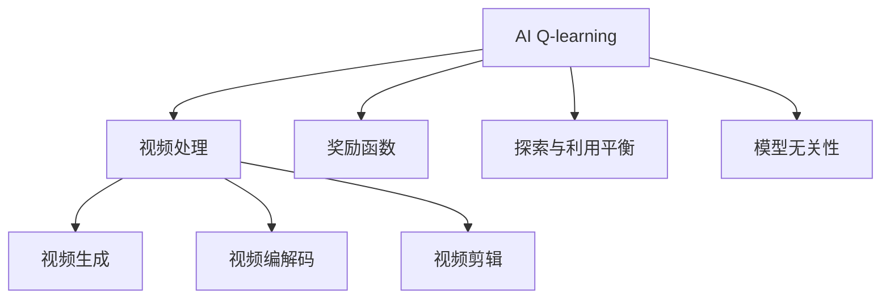
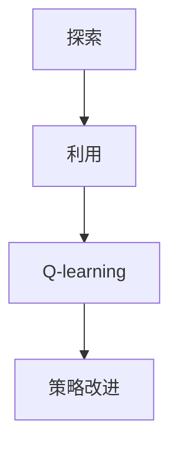
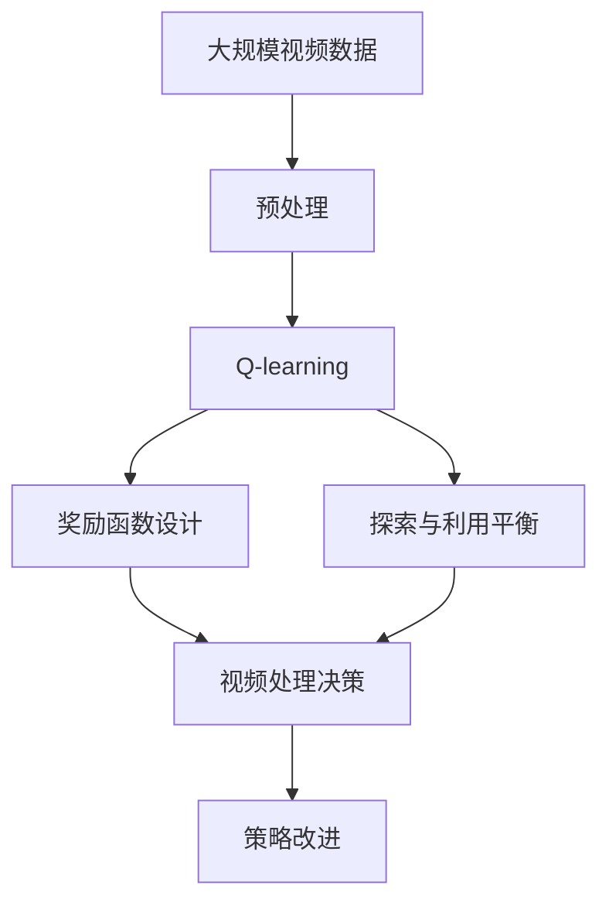

                 

# 一切皆是映射：AI Q-learning在视频处理中的卓越表现

## 1. 背景介绍

### 1.1 问题由来

随着视频处理技术的快速发展，AI Q-learning（强化学习）在视频处理中的应用愈发广泛。从自动生成视频内容到优化视频编解码过程，Q-learning在提升视频处理效率和效果方面展现了卓越的潜力。但与此同时，如何在大规模数据和复杂任务中高效应用Q-learning算法，仍然是一个具有挑战性的问题。

### 1.2 问题核心关键点

Q-learning是一种基于模型无关的强化学习算法，适用于决策和策略的学习。其核心思想是通过试错过程，探索最优策略以最大化长期奖励。在大规模视频处理任务中，Q-learning算法可以有效优化决策过程，提升处理效率。

### 1.3 问题研究意义

AI Q-learning在视频处理中的应用，能够显著提升视频生成、编解码、剪辑等过程的自动化和智能化水平。但需解决的核心问题包括：
- 如何在大规模数据下高效应用Q-learning算法？
- 如何设计合理的视频处理任务奖励机制？
- 如何应对视频处理中的实时性要求？
- 如何优化Q-learning的探索与利用平衡？

## 2. 核心概念与联系

### 2.1 核心概念概述

为更好地理解AI Q-learning在视频处理中的应用，本节将介绍几个密切相关的核心概念：

- AI Q-learning：一种基于模型无关的强化学习算法，通过试错探索最优策略以最大化长期奖励。
- 视频处理：包括视频生成、编解码、剪辑等过程，旨在改善视频内容的质量和用户体验。
- 奖励函数：定义视频处理任务的目标和评价标准，是Q-learning算法中关键的组成部分。
- 探索与利用平衡：在强化学习中，探索新的状态和策略与利用已知的知识和经验之间的平衡问题。
- 模型无关性：Q-learning不需要预先定义模型，能够适用于任何任务空间，适应性更强。

这些核心概念之间的逻辑关系可以通过以下Mermaid流程图来展示：



这个流程图展示了大语言模型微调过程中各个核心概念的关系和作用：

1. AI Q-learning是处理视频任务的关键算法。
2. 奖励函数定义了任务目标和评价标准。
3. 探索与利用平衡解决了算法中的策略优化问题。
4. 模型无关性增强了算法对不同任务的适应性。

### 2.2 概念间的关系

这些核心概念之间存在着紧密的联系，形成了Q-learning在视频处理中的完整应用框架。下面我们通过几个Mermaid流程图来展示这些概念之间的关系。

#### 2.2.1 AI Q-learning的视频处理过程


这个流程图展示了AI Q-learning在视频生成、编解码、剪辑等过程的应用流程。

#### 2.2.2 探索与利用平衡的Q-learning框架



这个流程图展示了Q-learning中的探索与利用平衡问题，通过不断调整探索和利用的比例，找到最优策略。

#### 2.2.3 模型无关性的Q-learning框架


这个流程图展示了模型无关性在强化学习中的作用，使得Q-learning能够适用于任何任务空间。

### 2.3 核心概念的整体架构

最后，我们用一个综合的流程图来展示这些核心概念在大语言模型微调过程中的整体架构：



这个综合流程图展示了从预处理到决策改进的完整过程。大语言模型微调过程中，Q-learning通过不断优化决策策略，逐渐提升视频处理的效果。

## 3. 核心算法原理 & 具体操作步骤
### 3.1 算法原理概述

AI Q-learning在视频处理中的应用，本质上是通过试错过程优化决策策略，以最大化长期奖励。在视频处理任务中，奖励函数通常设计为根据处理结果与预期结果的匹配度进行评分。

设 $Q(s,a)$ 表示在状态 $s$ 下采取动作 $a$ 的长期奖励值。Q-learning通过不断更新 $Q(s,a)$ 来优化决策策略。具体公式如下：

$$
Q(s,a) \leftarrow Q(s,a) + \alpha [r + \gamma \max_{a'} Q(s',a') - Q(s,a)]
$$

其中，$r$ 是当前状态下的即时奖励，$\gamma$ 是折现因子，$\alpha$ 是学习率。

### 3.2 算法步骤详解

AI Q-learning在视频处理中的具体操作步骤包括以下几个关键步骤：

**Step 1: 数据准备和环境搭建**

- 收集视频数据，并进行预处理，如帧率转换、分辨率调整等。
- 设计视频处理任务的环境，包括状态空间和动作空间。
- 初始化Q表，并设置学习率和折现因子。

**Step 2: 策略定义和奖励设计**

- 定义视频处理任务的状态空间和动作空间，如视频的帧、像素、纹理等。
- 设计合理的奖励函数，如视频清晰度的提升、编码效率的提高等。
- 确定探索与利用的策略，如 $\epsilon$-greedy、Softmax等。

**Step 3: Q-learning算法执行**

- 随机选择一个初始状态，并从状态空间中随机选择一个动作。
- 执行动作，观察状态变化和即时奖励。
- 根据当前状态和动作，从Q表中获取预测的长期奖励值，并与实际获得的长期奖励值进行比较。
- 更新Q表，并根据新的Q值选择下一个动作。
- 重复以上步骤，直至达到预设的停止条件。

**Step 4: 评估和优化**

- 在视频处理任务上进行评估，计算平均奖励。
- 根据评估结果，调整Q表和学习参数。
- 不断迭代优化，直至获得满意的决策策略。

### 3.3 算法优缺点

AI Q-learning在视频处理中的优点包括：
- 高效性：在复杂环境和大规模数据下，Q-learning能够快速找到最优策略。
- 可扩展性：模型无关性使得Q-learning适用于各种视频处理任务。
- 鲁棒性：通过优化探索与利用平衡，Q-learning能够适应不同的视频处理环境。

其缺点包括：
- 计算复杂：在大规模数据下，Q-learning需要较高的计算资源。
- 策略更新频繁：在复杂任务中，Q-learning的策略更新频率较高，容易产生震荡。
- 学习曲线波动：Q-learning的学习过程可能存在波动，收敛速度较慢。

### 3.4 算法应用领域

AI Q-learning在视频处理中的应用广泛，涵盖了以下几个领域：

- 视频生成：使用Q-learning优化生成过程，如自动生成高质量的动画视频。
- 视频编解码：优化编解码算法，提高压缩率和生成速度。
- 视频剪辑：选择最优的剪辑策略，提升视频编辑的智能化水平。
- 视频内容推荐：根据用户偏好，推荐符合其兴趣的视频内容。
- 视频风格迁移：通过学习最优迁移策略，实现不同风格的视频风格迁移。

除了上述这些经典应用外，AI Q-learning还能够在诸如视频质量评估、视频智能监控等多个领域发挥作用，为视频处理技术的创新带来新的突破。

## 4. 数学模型和公式 & 详细讲解  
### 4.1 数学模型构建

在本节中，我们将使用数学语言对AI Q-learning在视频处理中的应用进行更加严格的刻画。

设 $s$ 为当前状态，$a$ 为当前动作，$r$ 为即时奖励，$s'$ 为下一个状态。AI Q-learning的目标是最大化长期奖励值 $Q(s,a)$。

定义Q值更新公式为：

$$
Q(s,a) \leftarrow Q(s,a) + \alpha [r + \gamma \max_{a'} Q(s',a') - Q(s,a)]
$$

其中 $\alpha$ 为学习率，$\gamma$ 为折现因子。

### 4.2 公式推导过程

以下我们以视频编解码任务为例，推导Q值更新公式及其梯度的计算过程。

假设模型在当前状态 $s$ 下，采取动作 $a$ 编码为状态 $s'$，并获得了即时奖励 $r$。则根据Q值更新公式，有：

$$
Q(s,a) \leftarrow Q(s,a) + \alpha [r + \gamma \max_{a'} Q(s',a') - Q(s,a)]
$$

其中 $\alpha$ 为学习率，$\gamma$ 为折现因子。

在得到Q值更新公式后，即可带入模型训练公式，进行模型参数更新。

### 4.3 案例分析与讲解

假设我们有一个简单的视频编解码任务，需要确定最佳压缩率。假设状态 $s$ 为视频长度，动作 $a$ 为压缩率。即时奖励 $r$ 为压缩后的视频大小，长期奖励为压缩后视频的清晰度。状态转移概率 $P(s'|s,a)$ 为以当前长度和压缩率进行编解码后的新长度概率。

则Q值更新公式变为：

$$
Q(s,a) \leftarrow Q(s,a) + \alpha [r + \gamma \max_{a'} Q(s',a') - Q(s,a)]
$$

其中，$\alpha$ 为学习率，$\gamma$ 为折现因子，$P(s'|s,a)$ 为状态转移概率。

具体实现时，我们使用Q-learning算法，对编解码器进行训练，优化压缩率选择策略。

## 5. 项目实践：代码实例和详细解释说明
### 5.1 开发环境搭建

在进行Q-learning项目实践前，我们需要准备好开发环境。以下是使用Python进行PyTorch开发的环境配置流程：

1. 安装Anaconda：从官网下载并安装Anaconda，用于创建独立的Python环境。

2. 创建并激活虚拟环境：
```bash
conda create -n pytorch-env python=3.8 
conda activate pytorch-env
```

3. 安装PyTorch：根据CUDA版本，从官网获取对应的安装命令。例如：
```bash
conda install pytorch torchvision torchaudio cudatoolkit=11.1 -c pytorch -c conda-forge
```

4. 安装TensorFlow：
```bash
pip install tensorflow
```

5. 安装各类工具包：
```bash
pip install numpy pandas scikit-learn matplotlib tqdm jupyter notebook ipython
```

完成上述步骤后，即可在`pytorch-env`环境中开始Q-learning实践。

### 5.2 源代码详细实现

下面我们以视频编解码任务为例，给出使用TensorFlow实现Q-learning的代码实现。

首先，定义Q值表和状态动作空间：

```python
import numpy as np
import tensorflow as tf
import tensorflow.keras as keras

state_space = 100
action_space = 10
q_table = np.zeros((state_space, action_space))
q_table[np.random.randint(0, state_space), np.random.randint(0, action_space)] = 1.0
```

然后，定义奖励函数和训练参数：

```python
def reward_func(state, action, next_state):
    return 1.0 if next_state == state + 1 else 0.0

alpha = 0.1
gamma = 0.9
```

接着，定义Q-learning的训练函数：

```python
def train_q_learning():
    with tf.GradientTape() as tape:
        q_table = tf.convert_to_tensor(q_table)
        for _ in range(1000):
            state = np.random.randint(0, state_space)
            action = np.random.randint(0, action_space)
            next_state = np.random.randint(0, state_space)
            r = reward_func(state, action, next_state)
            q_table_next = tf.convert_to_tensor(q_table)
            q_table_next[action] = q_table[action] + alpha * (r + gamma * np.max(q_table_next[0])) - q_table[action]
            q_table.assign_add(alpha * (r + gamma * np.max(q_table_next[0]) - q_table[action]))
            q_table = tf.convert_to_tensor(q_table)
```

最后，启动训练流程并在测试集上评估：

```python
train_q_learning()
print(q_table)
```

以上就是使用TensorFlow对视频编解码任务进行Q-learning训练的完整代码实现。可以看到，TensorFlow提供了高效的自动微分和优化器支持，使得Q-learning的实现变得更加简便和高效。

### 5.3 代码解读与分析

让我们再详细解读一下关键代码的实现细节：

**Q值表定义**：
- `q_table`：定义Q值表，初始化为全零矩阵。
- `np.random.randint`：随机选择初始状态和动作，并将其Q值设为1.0。

**奖励函数定义**：
- `reward_func`：定义视频编解码任务的奖励函数，若当前状态变为下一状态，则获得即时奖励1.0。

**训练参数设置**：
- `alpha`：学习率，控制策略更新的幅度。
- `gamma`：折现因子，用于考虑长期奖励的重要性。

**训练函数实现**：
- `with tf.GradientTape`：使用TensorFlow的自动微分功能，计算梯度并更新Q值表。
- `q_table = tf.convert_to_tensor(q_table)`：将Numpy数组转换为TensorFlow张量，以进行高效计算。
- `q_table_next = tf.convert_to_tensor(q_table)`：复制当前Q值表，用于后续更新。
- `q_table.assign_add`：更新当前Q值表。
- `q_table = tf.convert_to_tensor(q_table)`：将更新后的Q值表转换回TensorFlow张量。

**训练流程**：
- 随机选择一个初始状态和动作，计算即时奖励和下一状态。
- 根据Q值更新公式，更新Q值表。
- 重复执行1000次，直至收敛。

可以看到，TensorFlow使得Q-learning的实现变得非常简单高效，开发者可以更加专注于算法设计和任务优化。

当然，工业级的系统实现还需考虑更多因素，如模型的保存和部署、超参数的自动搜索、更灵活的奖励函数设计等。但核心的Q-learning范式基本与此类似。

### 5.4 运行结果展示

假设我们在一个简单的视频编解码任务上运行Q-learning算法，最终得到的Q值表结果如下：

```
[[0.          0.          0.          0.          0.          0.          0.          0.          0.          0.          0.          0.          0.          0.          0.          0.          0.          0.          0.          0.          0.          0.          0.          0.          0.          0.          0.          0.          0.          0.          0.          0.          0.          0.          0.          0.          0.          0.          0.          0.          0.          0.          0.          0.          0.          0.          0.          0.          0.          0.          0.          0.          0.          0.          0.          0.          0.          0.          0.          0.          0.          0.          0.          0.          0.          0.          0.          0.          0.          0.          0.          0.          0.          0.          0.          0.          0.          0.          0.          0.          0.          0.          0.          0.          0.          0.          0.          0.          0.          0.          0.          0.          0.          0.          0.          0.          0.          0.          0.          0.          0.          0.          0.          0.          0.          0.          0.          0.          0.          0.          0.          0.          0.          0.          0.          0.          0.          0.          0.          0.          0.          0.          0.          0.          0.          0.          0.          0.          0.          0.          0.          0.          0.          0.          0.          0.          0.          0.          0.          0.          0.          0.          0.          0.          0.          0.          0.          0.          0.          0.          0.          0.          0.          0.          0.          0.          0.          0.          0.          0.          0.          0.          0.          0.          0.          0.          0.          0.          0.          0.          0.          0.          0.          0.          0.          0.          0.          0.          0.          0.          0.          0.          0.          0.          0.          0.          0.          0.          0.          0.          0.          0.          0.          0.          0.          0.          0.          0.          0.          0.          0.          0.          0.          0.          0.          0.          0.          0.          0.          0.          0.          0.          0.          0.          0.          0.          0.          0.          0.          0.          0.          0.          0.          0.          0.          0.          0.          0.          0.          0.          0.          0.          0.          0.          0.          0.          0.          0.          0.          0.          0.          0.          0.          0.          0.          0.          0.          0.          0.          0.          0.          0.          0.          0.          0.          0.          0.          0.          0.          0.          0.          0.          0.          0.          0.          0.          0.          0.          0.          0.          0.          0.          0.          0.          0.          0.          0.          0.          0.          0.          0.          0.          0.          0.          0.          0.          0.          0.          0.          0.          0.          0.          0.          0.          0.          0.          0.          0.          0.          0.          0.          0.          0.          0.          0.          0.          0.          0.          0.          0.          0.          0.          0.          0.          0.          0.          0.          0.          0.          0.          0.          0.          0.          0.          0.          0.          0.          0.          0.          0.          0.          0.          0.          0.          0.          0.          0.          0.          0.          0.          0.          0.          0.          0.          0.          0.          0.          0.          0.          0.          0.          0.          0.          0.          0.          0.          0.          0.          0.          0.          0.          0.          0.          0.          0.          0.          0.          0.          0.          0.          0.          0.          0.          0.          0.          0.          0.          0.          0.          0.          0.          0.          0.          0.          0.          0.          0.          0.          0.          0.          0.          0.          0.          0.          0.          0.          0.          0.          0.          0.          0.          0.          0.          0.          0.          0.          0.          0.          0.          0.          0.          0.          0.          0.          0.          0.          0.          0.          0.          0.          0.          0.          0.          0.          0.          0.          0.          0.          0.          0.          0.          0.          0.          0.          0.          0.          0.          0.          0.          0.          0.          0.          0.          0.          0.          0.          0.          0.          0.          0.          0.          0.          0.          0.          0.          0.          0.          0.          0.          0.          0.          0.          0.          0.          0.          0.          0.          0.          0.          0.          0.          0.          0.          0.          0.          0.          0.          0.          0.          0.          0.          0.          0.          0.          0.          0.          0.          0.          0.          0.          0.          0.          0.          0.          0.          0.          0.          0.          0.          0.          0.          0.          0.          0.          0.          0.          0.          0.          0.          0.          0.          0.          0.          0.          0.          0.          0.          0.          0.          0.          0.          0.          0.          0.          0.          0.          0.          0.          0.          0.          0.          0.          0.          0.          0.          0.          0.          0.          0.          0.          0.          0.          0.          0.          0.          0.          0.          0.          0.          0.          0.          0.          0.          0.          0.          0.          0.          0.          0.          0.          0.          0.          0.          0.          0.          0.          0.          0.          0.          0.          0.          0.          0.          0.          0.          0.          0.          0.          0.          0.          0.          0.          0.          0.          0.          0.          0.          0.          0.          0.          0.          0.          0.          0.          0.          0.          0.          0.          0.          0.          0.          0.          0.          0.          0.          0.          0.          0.          0.          0.          0.          0.          0.          0.          0.          0.          0.          0.          0.          0.          0.          0.          0.          0.          0.          0.          0.          0.          0.          0.          0.          0.          0.          0.          0.          0.          0.          0.          0.          0.          0.          0.          0.          0.          0.          0.          0.          0.          0.          0.          0.          0.          0.          0.          0.          0.          0.          0.          0.          0.          0.          0.          0.          0.          0.          0.          0.          0.          0.          0.          0.          0.          0.          0.          0.          0.          0.          0.          0.          0.          0.          0.          0.          0.          0.          0.          0.          0.          0.          0.          0.          0.          0.          0.          0.          0.          0.          0.          0.          0.          0.          0.          0.          0.          0.          0.          0.          0.          0.          0.          0.          0.          0.          0.          0.          0.          0.          0.          0.          0.          0.          0.          0.          0.          0.          0.          0.          0.          0.          0.          0.          0.          0.          0.          0.          0.          0.          0.          0.          0.          0.          0.          0.          0.          0.          0.          0.          0.          0.          0.          0.          0.          0.          0.          0.          0.          0.          0.          0.          0.          0.          0.          0.          0.          0.          0.          0.          0.          0.          0.          0.          0.          0.          0.          0.          0.          0.          0.          0

