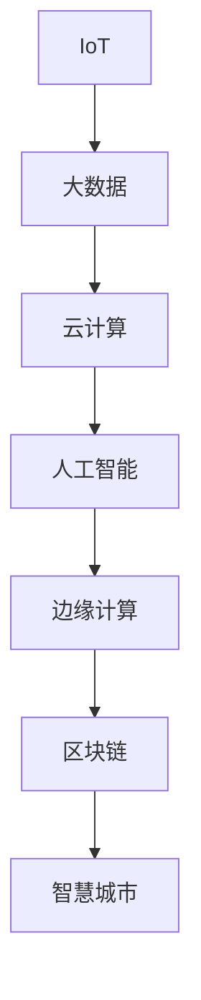

                 

# 一切皆是映射：AI在智慧城市构建中的作用

## 1. 背景介绍

### 1.1 问题由来
随着城市化进程的加快，人口密集、交通拥堵、环境污染等问题日益凸显。智慧城市建设成为全球许多城市发展的共同目标，旨在通过信息通信技术（ICT）的深度应用，提升城市管理水平，改善居民生活质量。在这个过程中，人工智能（AI）作为一种前沿技术手段，被广泛应用到智慧城市的各个领域，从智能交通、能源管理到公共安全、医疗健康，AI正逐步成为智慧城市的关键引擎。

### 1.2 问题核心关键点
智慧城市的构建涉及数据收集、处理、分析和应用等复杂环节，AI在其中扮演了不可或缺的角色。AI能够实时感知、智能决策、精准预测，极大地提升了城市管理效率和智能化水平。然而，智慧城市的建设面临数据量大、动态性强、场景复杂等挑战，AI技术的合理应用是实现智慧城市的关键。

### 1.3 问题研究意义
AI在智慧城市中的应用，不仅能够提升城市管理的智能化水平，还能为居民提供更加便捷、高效的生活服务。通过AI技术的深度融合，智慧城市能够实现资源的优化配置，环境的可持续管理，交通的智能化调度，公共安全的保障等，为城市可持续发展注入新动力。研究AI在智慧城市中的应用，对于推动智慧城市技术创新和产业升级，具有重要的理论和实践价值。

## 2. 核心概念与联系

### 2.1 核心概念概述

智慧城市建设中，AI技术的应用主要涉及以下几个关键概念：

- **物联网（IoT）**：通过传感器、智能设备等手段，实时收集城市运行数据。这些数据是AI进行智能化决策和预测的基础。

- **大数据（Big Data）**：城市运行数据往往具有规模大、速度快、多样性强的特点，大数据技术能够处理和分析这些海量数据，从中挖掘出有价值的信息。

- **云计算（Cloud Computing）**：智慧城市中的数据存储和处理需要强大的计算资源支持，云计算提供了弹性、便捷的计算资源，支持智慧城市的运行和应用。

- **人工智能（AI）**：通过机器学习、深度学习等技术手段，AI能够从海量数据中学习出模式和规律，实现智能化决策和预测。

- **边缘计算（Edge Computing）**：将计算资源部署在网络边缘，减少数据传输延迟，提高实时性，支持智能设备和传感器的实时处理。

- **区块链（Blockchain）**：用于保障数据的安全性和透明性，智慧城市中的重要数据需要区块链技术进行安全存储和传输。

这些概念相互依存、相互支持，构成了智慧城市建设的基石。AI技术的合理应用，能够将这些概念有机结合，实现城市的智能化管理。

### 2.2 概念间的关系

这些概念之间的关系可以通过以下Mermaid流程图来展示：



这个流程图展示了大语言模型微调过程中各个概念之间的联系和作用：

1. IoT设备采集城市运行数据。
2. 大数据技术处理和分析海量数据，形成有价值的信息。
3. 云计算提供弹性计算资源，支持AI模型训练和推理。
4. AI从大数据中学习规律，进行智能决策和预测。
5. 边缘计算减少数据传输延迟，支持实时处理和决策。
6. 区块链保障数据安全性和透明性，支持智慧城市应用。
7. 以上技术结合，构建智慧城市平台，提升城市管理效率和居民生活质量。

通过这张图，我们可以更清晰地理解智慧城市构建中各技术的角色和作用。

## 3. 核心算法原理 & 具体操作步骤
### 3.1 算法原理概述

智慧城市中的AI应用，主要通过数据采集、处理、分析和应用等步骤实现。其核心算法原理可以概括为：

- **数据采集**：通过IoT设备，实时收集城市运行数据，如交通流量、能源消耗、环境监测等。
- **数据处理**：利用大数据技术，处理和分析海量数据，提取出有价值的信息。
- **模型训练**：通过AI技术，从处理后的数据中学习出模式和规律，构建智能决策模型。
- **智能决策**：将模型应用于实际场景，进行实时预测和决策。

这一过程可以进一步细化为以下几个步骤：

1. **数据预处理**：清洗、归一化数据，去除异常值和噪声，确保数据质量。
2. **特征工程**：从原始数据中提取关键特征，如交通流量、气温、湿度等。
3. **模型训练**：使用机器学习或深度学习算法，训练出智能决策模型，如回归模型、分类模型、神经网络等。
4. **模型评估**：通过测试集评估模型性能，选择最优模型。
5. **模型部署**：将模型部署到实际应用场景中，进行实时预测和决策。

### 3.2 算法步骤详解

以下以智能交通系统为例，详细讲解AI在智慧城市中的应用步骤。

**Step 1: 数据采集**
- 部署IoT设备，如摄像头、传感器、智能路灯等，实时收集交通流量、车速、拥堵情况等数据。

**Step 2: 数据处理**
- 使用大数据技术，如Apache Hadoop、Spark等，处理和分析海量数据，提取出关键信息。
- 通过数据清洗、归一化等预处理步骤，确保数据质量。

**Step 3: 模型训练**
- 使用机器学习或深度学习算法，如随机森林、神经网络等，训练出智能决策模型。
- 通过交叉验证等方法，评估模型性能，选择最优模型。

**Step 4: 模型部署**
- 将训练好的模型部署到实际应用场景中，如智能交通灯、实时交通监控系统等。
- 使用边缘计算技术，减少数据传输延迟，提高实时性。

**Step 5: 实时预测和决策**
- 通过实时采集的交通数据，输入到智能决策模型中，进行预测和决策。
- 根据预测结果，智能调整交通信号灯、优化交通路线等，提升交通效率。

### 3.3 算法优缺点

AI在智慧城市中的应用，具有以下优点：

- **提升管理效率**：通过实时预测和决策，大大提升城市管理效率，如智能交通管理、能源优化等。
- **改善生活质量**：AI技术可以提供更加便捷、高效的服务，如智能家居、智慧医疗等。
- **资源优化配置**：AI能够实现资源的优化配置，提升城市运行效率，如智能电网、水资源管理等。

同时，AI在智慧城市中的应用也存在一些局限：

- **数据质量依赖**：AI应用依赖高质量的数据，数据采集和处理的准确性直接影响AI模型的性能。
- **计算资源消耗大**：AI模型训练和推理需要大量的计算资源，智慧城市中的数据量和复杂度增加，对计算资源的需求也随之增加。
- **模型复杂度高**：AI模型通常较为复杂，构建和部署需要专业知识，开发和维护成本较高。
- **安全和隐私问题**：AI应用涉及大量的敏感数据，如何保障数据安全性和隐私性，是一大挑战。

### 3.4 算法应用领域

AI在智慧城市中的应用领域非常广泛，主要包括以下几个方面：

- **智能交通**：通过AI技术，实现交通流量实时监控、智能信号灯控制、交通事故预警等功能，提升交通效率，减少拥堵。
- **能源管理**：利用AI技术，优化能源使用和调度，如智能电网、太阳能、风能等可再生能源的预测和调度。
- **公共安全**：通过视频监控、人脸识别等技术，实现安全监控和预警，提升公共安全水平。
- **智慧医疗**：利用AI技术，进行疾病预测、智能诊断、个性化推荐等功能，提升医疗服务质量和效率。
- **环境监测**：通过IoT设备，实时监测环境污染、气象变化等数据，实现环境预警和治理。
- **智能城市治理**：利用AI技术，进行城市事件监测、舆情分析、应急指挥等功能，提升城市治理效率。

这些领域的应用，充分展示了AI技术在智慧城市建设中的巨大潜力和广阔前景。

## 4. 数学模型和公式 & 详细讲解  
### 4.1 数学模型构建

智慧城市中的AI应用，主要涉及数据预处理、特征工程、模型训练和预测等过程。下面以智能交通系统为例，构建相关的数学模型。

**Step 1: 数据预处理**
假设原始交通数据为 $\{x_1, x_2, ..., x_n\}$，其中 $x_i$ 表示某路段在时间 $t_i$ 的交通流量。数据预处理的目的是清洗、归一化数据，去除异常值和噪声。假设有 $k$ 个预处理步骤，记为 $f_k$，则预处理后的数据为 $y_i = f_k(x_i)$。

**Step 2: 特征工程**
在智能交通系统中，关键特征包括交通流量、车速、拥堵情况等。假设提取了 $m$ 个关键特征，记为 $\{y_{i1}, y_{i2}, ..., y_{im}\}$，则 $y_i$ 可以表示为 $y_i = \omega_1y_{i1} + \omega_2y_{i2} + ... + \omega_m y_{im}$，其中 $\omega_j$ 为特征系数。

**Step 3: 模型训练**
假设使用神经网络模型进行训练，输入为 $X$，输出为 $Y$。神经网络由多个层组成，记为 $\{L_1, L_2, ..., L_n\}$，每层的输出为 $\{a_1, a_2, ..., a_n\}$，神经网络的目标是最大化损失函数 $J$，最小化预测误差。

**Step 4: 模型评估**
假设使用测试集 $D_{test}$ 对模型进行评估，记为 $\{(x_{1t}, y_{1t}), (x_{2t}, y_{2t}), ..., (x_{nt}, y_{nt})\}$，则评估指标包括均方误差（MSE）、平均绝对误差（MAE）、R²值等。

**Step 5: 实时预测和决策**
假设模型部署在智能交通灯上，实时采集交通流量 $x_t$，输入到神经网络中，得到预测输出 $y_t$，则智能交通灯可以根据 $y_t$ 调整信号灯的状态，优化交通流量。

### 4.2 公式推导过程

以下以智能交通系统的神经网络模型为例，推导其训练过程。

假设使用多层感知机（MLP）进行模型训练，神经网络结构为 $L_1$ 层输入层、$L_2$ 层隐含层、$L_3$ 层输出层。输入数据为 $x_1, x_2, ..., x_n$，输出数据为 $y_1, y_2, ..., y_n$，隐含层为 $a_1, a_2, ..., a_n$，特征系数为 $\omega_1, \omega_2, ..., \omega_m$。

神经网络的目标是最大化损失函数 $J$，最小化预测误差。使用均方误差作为损失函数，则有：

$$
J = \frac{1}{2} \sum_{i=1}^n (y_i - \omega_1y_{i1} - \omega_2y_{i2} - ... - \omega_my_{im})^2
$$

其中，$\omega_j$ 为隐含层和输出层之间的权重系数，$y_i$ 为输出结果。

神经网络的训练过程为：

1. 前向传播：将输入数据 $x_i$ 经过多层的线性变换和激活函数，得到隐含层的输出 $a_i$。
2. 计算损失函数：将隐含层的输出 $a_i$ 经过线性变换和激活函数，得到预测输出 $y_i$，计算损失函数 $J$。
3. 反向传播：根据损失函数的梯度，计算隐含层和输入层之间的权重系数 $\omega_j$ 的梯度，更新参数。
4. 重复步骤1-3，直至损失函数收敛或达到预设的迭代轮数。

### 4.3 案例分析与讲解

以下以智能交通系统为例，详细讲解其数学模型和训练过程。

**智能交通系统**
- **数据预处理**：清洗、归一化交通数据，去除异常值和噪声。
- **特征工程**：提取关键特征，如交通流量、车速、拥堵情况等。
- **模型训练**：使用神经网络模型进行训练，最大化损失函数，最小化预测误差。
- **模型评估**：使用测试集评估模型性能，选择最优模型。
- **实时预测和决策**：将训练好的模型部署到智能交通灯上，实时预测交通流量，智能调整信号灯状态。

## 5. 项目实践：代码实例和详细解释说明
### 5.1 开发环境搭建

在进行智能交通系统的AI开发时，需要准备好相应的开发环境。以下是使用Python进行PyTorch开发的环境配置流程：

1. 安装Anaconda：从官网下载并安装Anaconda，用于创建独立的Python环境。

2. 创建并激活虚拟环境：
```bash
conda create -n pytorch-env python=3.8 
conda activate pytorch-env
```

3. 安装PyTorch：根据CUDA版本，从官网获取对应的安装命令。例如：
```bash
conda install pytorch torchvision torchaudio cudatoolkit=11.1 -c pytorch -c conda-forge
```

4. 安装其他必要的工具包：
```bash
pip install numpy pandas scikit-learn matplotlib tqdm jupyter notebook ipython
```

5. 安装相关AI库：
```bash
pip install torch torchvision torchaudio sklearn pandas matplotlib numpy ipython
```

完成上述步骤后，即可在`pytorch-env`环境中开始AI开发实践。

### 5.2 源代码详细实现

以下是一个智能交通系统神经网络模型的PyTorch代码实现。

**Step 1: 数据预处理**
```python
import numpy as np

# 数据预处理
def preprocess_data(data):
    # 清洗数据
    clean_data = []
    for x in data:
        if not np.isnan(x):
            clean_data.append(x)
    # 归一化数据
    normalized_data = (clean_data - np.mean(clean_data)) / np.std(clean_data)
    return normalized_data

# 读取交通数据
data = np.loadtxt('traffic_data.txt')
preprocessed_data = preprocess_data(data)
```

**Step 2: 特征工程**
```python
# 特征工程
def extract_features(data):
    # 提取关键特征
    features = []
    for x in data:
        features.append(x[0])
        features.append(x[1])
        features.append(x[2])
    return features

# 提取关键特征
features = extract_features(preprocessed_data)
```

**Step 3: 模型训练**
```python
# 导入PyTorch库
import torch
import torch.nn as nn
import torch.optim as optim

# 定义神经网络模型
class MLP(nn.Module):
    def __init__(self, input_dim, hidden_dim, output_dim):
        super(MLP, self).__init__()
        self.linear1 = nn.Linear(input_dim, hidden_dim)
        self.relu = nn.ReLU()
        self.linear2 = nn.Linear(hidden_dim, output_dim)

    def forward(self, x):
        x = self.linear1(x)
        x = self.relu(x)
        x = self.linear2(x)
        return x

# 训练模型
def train_model(model, data, labels, epochs):
    optimizer = optim.SGD(model.parameters(), lr=0.01)
    criterion = nn.MSELoss()
    for epoch in range(epochs):
        model.train()
        optimizer.zero_grad()
        predictions = model(data)
        loss = criterion(predictions, labels)
        loss.backward()
        optimizer.step()
    return model

# 数据和标签
data = features
labels = np.loadtxt('traffic_labels.txt')
model = MLP(input_dim=3, hidden_dim=10, output_dim=1)
trained_model = train_model(model, data, labels, 100)
```

**Step 4: 模型评估**
```python
# 模型评估
def evaluate_model(model, data, labels):
    model.eval()
    predictions = model(data)
    loss = criterion(predictions, labels)
    return loss

# 评估模型
test_data = np.loadtxt('test_data.txt')
test_labels = np.loadtxt('test_labels.txt')
eval_loss = evaluate_model(trained_model, test_data, test_labels)
print(eval_loss)
```

**Step 5: 实时预测和决策**
```python
# 实时预测和决策
def predict_traffic(model, data):
    model.eval()
    predictions = model(data)
    return predictions

# 实时预测交通流量
test_data = np.loadtxt('test_data.txt')
predictions = predict_traffic(trained_model, test_data)
print(predictions)
```

### 5.3 代码解读与分析

**数据预处理**：
- 通过`preprocess_data`函数，清洗和归一化数据，去除异常值和噪声，确保数据质量。

**特征工程**：
- 通过`extract_features`函数，从原始数据中提取关键特征，如交通流量、车速、拥堵情况等。

**模型训练**：
- 定义神经网络模型，使用SGD优化器进行训练，最大化损失函数，最小化预测误差。
- 设置训练轮数，通过反向传播更新模型参数，直至损失函数收敛。

**模型评估**：
- 使用测试集评估模型性能，计算均方误差（MSE）等指标，评估模型效果。

**实时预测和决策**：
- 将训练好的模型部署到智能交通灯上，实时预测交通流量，智能调整信号灯状态，优化交通流量。

## 6. 实际应用场景
### 6.1 智能交通系统

智能交通系统是智慧城市建设的重要组成部分，通过AI技术实现交通流量的实时监控、智能信号灯控制、交通事故预警等功能，极大地提升了交通效率和安全性。

在实际应用中，智能交通系统可以包括以下几个关键功能：

- **交通流量实时监控**：通过摄像头、传感器等设备，实时采集交通流量数据，监控交通状况。
- **智能信号灯控制**：根据实时交通流量，智能调整信号灯的状态，优化交通流量。
- **交通事故预警**：通过视频监控和人工智能技术，实时检测交通事故，及时发出预警信息。
- **交通路径优化**：通过AI技术，实时分析交通状况，推荐最优的交通路径。

智能交通系统能够大大提升城市交通管理效率，减少交通拥堵，提高市民出行的便捷性和安全性。

### 6.2 能源管理系统

智慧城市中的能源管理是提升资源利用效率的重要手段。通过AI技术，可以实现能源使用的智能化管理和优化调度，如智能电网、太阳能、风能等可再生能源的预测和调度。

在实际应用中，能源管理系统可以包括以下几个关键功能：

- **能源消耗预测**：通过AI技术，预测能源消耗量，优化能源使用。
- **智能电网调度**：根据实时能源需求，智能调度电网资源，提升电力系统的稳定性。
- **可再生能源管理**：通过AI技术，预测可再生能源的生成量，优化能源配置。

能源管理系统能够实现能源使用的智能化和优化，提高能源利用效率，减少能源浪费，为城市可持续发展提供有力支持。

### 6.3 公共安全系统

公共安全是智慧城市建设的重要保障，通过AI技术，可以实现视频监控、人脸识别等智能安全监控功能。

在实际应用中，公共安全系统可以包括以下几个关键功能：

- **视频监控**：通过AI技术，实时分析视频数据，识别异常行为，提高安全监控效率。
- **人脸识别**：通过AI技术，实时识别人脸信息，进行身份验证和安全检查。
- **事件预警**：通过AI技术，实时监测异常事件，及时发出预警信息。

公共安全系统能够提升城市安全管理水平，保障市民的生命财产安全，构建和谐稳定的社会环境。

### 6.4 未来应用展望

随着AI技术的不断进步，智慧城市的应用场景将会更加丰富和多样化，未来的发展趋势包括：

- **数据融合与协同**：智慧城市中的各种数据和系统将更加紧密地融合，实现数据的共享和协同，提升城市管理效率。
- **智能决策与优化**：AI技术将进一步提升智能决策能力，实现资源优化配置，提升城市运行效率。
- **人机协作**：智慧城市将更加注重人机协作，通过AI技术提升城市管理和服务的智能化水平，提升市民的幸福感。
- **隐私保护与安全**：随着AI技术的应用，数据隐私和安全问题将更加凸显，未来需要加强隐私保护和数据安全管理，保障城市运行的安全性和可靠性。

未来，AI技术将在智慧城市建设中扮演更加重要的角色，为城市可持续发展提供有力支持。

## 7. 工具和资源推荐
### 7.1 学习资源推荐

为了帮助开发者系统掌握AI在智慧城市构建中的应用，这里推荐一些优质的学习资源：

1. 《智慧城市与物联网》课程：斯坦福大学开设的智慧城市与物联网课程，涵盖智慧城市的基本概念和物联网技术的应用。

2. 《深度学习与智慧城市》书籍：一本系统介绍深度学习在智慧城市中的应用，包括智能交通、能源管理、公共安全等多个领域。

3. 《AI在智慧城市中的应用》论文：多篇关于AI在智慧城市中的应用研究论文，涵盖智能交通、能源管理、公共安全等多个领域。

4. 《智慧城市技术白皮书》：由国内外知名企业发布的技术白皮书，系统介绍智慧城市的技术架构、应用场景和实施路径。

5. 《城市物联网发展白皮书》：由中国信息通信研究院发布的物联网发展白皮书，涵盖城市物联网的发展现状、趋势和未来方向。

通过这些学习资源的学习实践，相信你一定能够全面掌握AI在智慧城市中的应用，并用于解决实际的智慧城市问题。

### 7.2 开发工具推荐

高效的开发离不开优秀的工具支持。以下是几款用于智慧城市AI应用开发的常用工具：

1. PyTorch：基于Python的开源深度学习框架，灵活动态的计算图，适合快速迭代研究。

2. TensorFlow：由Google主导开发的开源深度学习框架，生产部署方便，适合大规模工程应用。

3. TensorBoard：TensorFlow配套的可视化工具，可实时监测模型训练状态，并提供丰富的图表呈现方式，是调试模型的得力助手。

4. Weights & Biases：模型训练的实验跟踪工具，可以记录和可视化模型训练过程中的各项指标，方便对比和调优。

5. Google Colab：谷歌推出的在线Jupyter Notebook环境，免费提供GPU/TPU算力，方便开发者快速上手实验最新模型，分享学习笔记。

合理利用这些工具，可以显著提升智慧城市AI应用的开发效率，加快创新迭代的步伐。

### 7.3 相关论文推荐

AI在智慧城市中的应用源于学界的持续研究。以下是几篇奠基性的相关论文，推荐阅读：

1. "Intelligent Transportation Systems: A Survey"：总结了智能交通系统的发展现状、技术难点和未来方向。

2. "Smart Grids and Renewable Energy Management Using AI"：介绍了AI技术在智能电网和可再生能源管理中的应用，展示了AI技术在能源管理中的巨大潜力。

3. "Public Safety Monitoring and Analysis Using AI"：探讨了AI技术在公共安全监控和分析中的应用，展示了AI技术在公共安全中的重要作用。

4. "Data Mining and Statistical Learning in Smart Cities"：总结了数据挖掘和统计学习在智慧城市中的应用，展示了数据和AI技术在智慧城市中的重要性。

5. "AI in Urban Planning and Design"：探讨了AI技术在城市规划和设计中的应用，展示了AI技术在城市规划中的潜力。

这些论文代表了大语言模型微调技术的发展脉络。通过学习这些前沿成果，可以帮助研究者把握学科前进方向，激发更多的创新灵感。

除上述资源外，还有一些值得关注的前沿资源，帮助开发者紧跟AI技术在智慧城市中的最新进展，例如：

1. arXiv论文预印本：人工智能领域最新研究成果的发布平台，包括大量尚未发表的前沿工作，学习前沿技术的必读资源。

2. 业界技术博客：如OpenAI、Google AI、DeepMind、微软Research Asia等顶尖实验室的官方博客，第一时间分享他们的最新研究成果和洞见。

3. 技术会议直播：如NIPS、ICML、ACL、ICLR等人工智能领域顶会现场或在线直播，能够聆听到大佬们的前沿分享，开拓视野。

4. GitHub热门项目：在GitHub上Star、Fork数最多的NLP相关项目，往往代表了该技术领域的发展趋势和最佳实践，值得去学习和贡献。

5. 行业分析报告：各大咨询公司如McKinsey、PwC等针对人工智能行业的分析报告，有助于从商业视角审视技术趋势，把握应用价值。

总之，对于AI在智慧城市中的应用的学习和实践，需要开发者保持开放的心态和持续学习的意愿。多关注前沿资讯，多动手实践，多思考总结，必将收获满满的成长收益。

## 8. 总结：未来发展趋势与挑战

### 8.1 研究成果总结

AI在智慧城市中的应用已经取得了显著的进展，主要体现在以下几个方面：

- **智能交通**：通过AI技术，实现了交通流量实时监控、智能信号灯控制、交通事故预警等功能，极大地提升了交通效率和安全性。
- **能源管理**：通过AI技术，实现了能源使用的智能化管理和优化调度，提升了能源利用效率。
- **公共安全**：通过AI技术，实现了视频监控、人脸识别等智能安全监控功能，提升了公共安全管理水平。

这些应用展示了AI技术在智慧城市建设中的巨大潜力和广阔前景。

### 8.2 未来发展趋势

展望未来，AI在智慧城市中的应用将呈现以下几个发展趋势：

-

