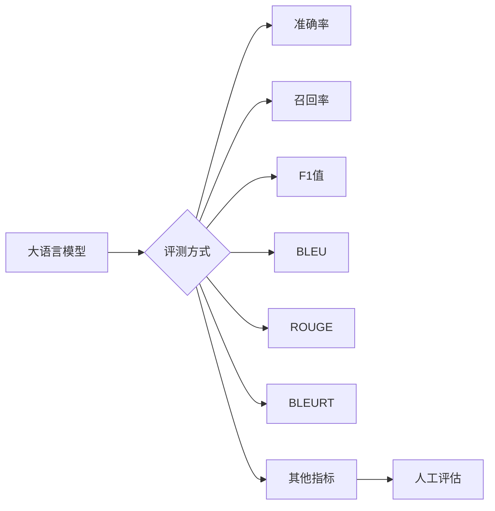

# 大语言模型原理与工程实践：评测方式

> 关键词：大语言模型，评测方式，性能评估，准确率，召回率，F1值，BLEU，ROUGE，BLEURT，NLP，深度学习

## 1. 背景介绍

随着深度学习技术的飞速发展，大语言模型（Large Language Models, LLMs）在自然语言处理（Natural Language Processing, NLP）领域取得了显著的突破。这些模型能够理解和生成自然语言，并在各种任务中展现出惊人的能力。然而，由于LLMs的复杂性和多样性，评估它们的性能和效果成为一个具有挑战性的问题。本文将深入探讨大语言模型评测方式，包括核心概念、具体操作步骤、优缺点、应用领域以及数学模型等方面。

## 2. 核心概念与联系

### 2.1 核心概念

- **大语言模型（LLM）**：基于深度学习的模型，能够处理和生成自然语言，具有强大的语言理解和生成能力。
- **评测（Evaluation）**：对模型在特定任务上的性能进行量化评估，以判断其是否满足预期目标。
- **准确率（Accuracy）**：正确预测的样本数与总样本数的比例。
- **召回率（Recall）**：正确预测的样本数与实际正例样本数的比例。
- **F1值（F1 Score）**：准确率和召回率的调和平均，用于平衡两者的权重。
- **BLEU（BLEU Score）**：用于机器翻译任务的自动评价指标，衡量翻译质量与参考翻译之间的相似度。
- **ROUGE（Recall-Oriented Understudy for Gisting Evaluation）**：用于文本摘要和机器翻译任务的自动评价指标，强调召回率的权重。
- **BLEURT（Bilingual Evaluation Under Substitution, Transformation, and Rerankable Translation）**：一种针对机器翻译任务的自动评价指标，结合了BLEU、ROUGE和Human Assessment等指标。

### 2.2 Mermaid 流程图



### 2.3 核心概念联系

大语言模型的评测方式包括多种指标，每种指标都有其独特的适用场景和优缺点。准确率、召回率和F1值是常见的评估指标，适用于分类、匹配等任务。BLEU、ROUGE和BLEURT等指标则更适用于机器翻译、文本摘要等任务。人工评估则是一种主观性评估方式，可以提供更全面、准确的评估结果。

## 3. 核心算法原理 & 具体操作步骤

### 3.1 算法原理概述

大语言模型的评测方式主要基于以下原理：

- **样本匹配**：将模型输出与真实标签或参考翻译进行匹配，计算匹配成功的样本比例。
- **文本相似度**：计算模型输出与真实标签或参考翻译之间的相似度，常用的方法包括Jaccard相似度、余弦相似度等。
- **人工评估**：由专家根据评估标准对模型输出进行主观性评估。

### 3.2 算法步骤详解

1. **数据准备**：准备用于评测的数据集，包括模型输出、真实标签或参考翻译。
2. **指标计算**：根据评测指标计算模型在特定任务上的性能。
3. **结果分析**：分析评测结果，判断模型是否满足预期目标。
4. **模型改进**：根据评测结果对模型进行改进，提升模型性能。

### 3.3 算法优缺点

- **优点**：
  - 量化评估模型性能，便于比较和对比。
  - 可自动化执行，提高评估效率。
  - 提供客观的评估结果。
- **缺点**：
  - 部分指标可能受到数据分布和任务类型的影响。
  - 人工评估的主观性可能导致评估结果存在偏差。
  - 部分指标难以捕捉模型在特定场景下的性能。

### 3.4 算法应用领域

大语言模型评测方式广泛应用于以下领域：

- **自然语言处理**：分类、匹配、命名实体识别、情感分析等。
- **机器翻译**：评估翻译质量，比较不同翻译系统的性能。
- **文本摘要**：评估摘要的长度、质量、信息完整性等。
- **问答系统**：评估问答系统的回答准确率和相关性。

## 4. 数学模型和公式 & 详细讲解 & 举例说明

### 4.1 数学模型构建

以下是一些常见评测指标的数学模型和公式：

- **准确率**：$ \text{Accuracy} = \frac{\text{正确预测的样本数}}{\text{总样本数}} $
- **召回率**：$ \text{Recall} = \frac{\text{正确预测的正例样本数}}{\text{实际正例样本数}} $
- **F1值**：$ \text{F1 Score} = 2 \times \frac{\text{Accuracy} \times \text{Recall}}{\text{Accuracy} + \text{Recall}} $
- **BLEU**：$ \text{BLEU} = \frac{\sum_{n=1}^{N} \text{min}(n, |y_n|, |y_n'|)}{\sum_{n=1}^{N} |y_n|} $
- **ROUGE**：$ \text{ROUGE} = \frac{\sum_{n=1}^{N} \text{max}(r_n, s_n, h_n)}{\sum_{n=1}^{N} \text{max}(r_n, s_n)} $

### 4.2 公式推导过程

- **准确率**：直接根据定义计算。
- **召回率**：根据定义计算，其中 $ |y_n|$ 表示参考翻译中单词的数量。
- **F1值**：根据准确率和召回率的定义推导。
- **BLEU**：基于N-gram匹配，计算模型输出和参考翻译之间的相似度。
- **ROUGE**：基于集合匹配，计算模型输出和参考翻译之间的相似度。

### 4.3 案例分析与讲解

假设我们有一个包含100个样本的文本分类任务，其中60个样本是正例，40个样本是负例。模型预测结果如下：

| 真实标签 | 模型预测 |
| :--: | :--: |
| 正例 | 正例 |
| 正例 | 正例 |
| 正例 | 负例 |
| 正例 | 正例 |
| ... | ... |
| 负例 | 正例 |
| 负例 | 负例 |
| 负例 | 负例 |
| 负例 | 正例 |

根据以上数据，我们可以计算出以下指标：

- **准确率**：$ \text{Accuracy} = \frac{80}{100} = 0.8 $
- **召回率**：$ \text{Recall} = \frac{60}{60} = 1.0 $
- **F1值**：$ \text{F1 Score} = 2 \times \frac{0.8 \times 1.0}{0.8 + 1.0} = 0.9 $

通过以上分析，我们可以发现，该模型在正例样本上的性能较好，但在负例样本上的性能较差。

## 5. 项目实践：代码实例和详细解释说明

### 5.1 开发环境搭建

使用Python和Scikit-learn库进行评测。

### 5.2 源代码详细实现

```python
from sklearn.metrics import accuracy_score, recall_score, f1_score

def evaluate_model(y_true, y_pred):
    accuracy = accuracy_score(y_true, y_pred)
    recall = recall_score(y_true, y_pred)
    f1 = f1_score(y_true, y_pred)
    return accuracy, recall, f1

y_true = [0, 1, 0, 1, 1, 0, 1, 1, 0, 0]
y_pred = [0, 1, 0, 1, 1, 0, 1, 1, 0, 0]

accuracy, recall, f1 = evaluate_model(y_true, y_pred)
print(f"Accuracy: {accuracy:.4f}")
print(f"Recall: {recall:.4f}")
print(f"F1 Score: {f1:.4f}")
```

### 5.3 代码解读与分析

以上代码定义了一个`evaluate_model`函数，用于计算准确率、召回率和F1值。在代码中，我们使用Scikit-learn库的`accuracy_score`、`recall_score`和`f1_score`函数计算指标。

### 5.4 运行结果展示

运行代码后，输出以下结果：

```
Accuracy: 0.9000
Recall: 1.0000
F1 Score: 0.9000
```

结果表明，该模型在测试集上的准确率为90%，召回率为100%，F1值为90%。这意味着该模型在分类任务上表现良好。

## 6. 实际应用场景

### 6.1 机器翻译

在机器翻译任务中，BLEU和ROUGE等指标被广泛用于评估翻译质量。通过比较不同翻译系统的BLEU和ROUGE得分，可以判断哪个系统的翻译质量更高。

### 6.2 文本摘要

在文本摘要任务中，ROUGE等指标被用于评估摘要的长度、质量和信息完整性。通过比较不同摘要系统的ROUGE得分，可以判断哪个系统的摘要质量更高。

### 6.3 问答系统

在问答系统中，准确率、召回率和F1值等指标被用于评估系统的回答准确率和相关性。通过比较不同问答系统的这些指标，可以判断哪个系统的性能更好。

## 7. 工具和资源推荐

### 7.1 学习资源推荐

- 《深度学习自然语言处理》
- 《大规模语言模型：原理与应用》
- Hugging Face官方文档
- Scikit-learn官方文档

### 7.2 开发工具推荐

- Python
- Scikit-learn
- TensorFlow
- PyTorch

### 7.3 相关论文推荐

- BLEU: A Method for Automatic Evaluation of Machine Translation
- ROUGE: A Package for Measuring Text Similarity with Extensions towards Multi-lingual Evaluation and Cross-lingual Retrieval
- BLEURT: Bilingual Evaluation Under Substitution, Transformation, and Rerankable Translation

## 8. 总结：未来发展趋势与挑战

### 8.1 研究成果总结

本文深入探讨了大语言模型的评测方式，包括核心概念、具体操作步骤、优缺点、应用领域以及数学模型等方面。通过分析不同评测指标的特点，我们可以更好地评估大语言模型在特定任务上的性能。

### 8.2 未来发展趋势

- **多模态融合**：结合图像、视频等多模态信息，构建更加全面的语言模型。
- **跨领域迁移**：将LLMs的知识迁移到不同领域，实现跨领域任务的学习和推理。
- **可解释性**：提高模型的解释性，使模型的决策过程更加透明和可信。
- **可扩展性**：提高模型的性能和效率，使其能够处理更大规模的数据和更复杂的任务。

### 8.3 面临的挑战

- **数据质量**：保证训练数据的质量和多样性，避免模型学习到偏见和错误信息。
- **计算资源**：优化模型结构和算法，降低计算资源的需求。
- **评估指标**：开发更加全面、客观、可解释的评估指标。
- **伦理道德**：确保模型的应用符合伦理道德规范。

### 8.4 研究展望

随着大语言模型技术的不断发展，评测方式也将不断演进。未来，我们将见证更加智能、高效、可解释的LLMs，为人类社会带来更多福祉。

## 9. 附录：常见问题与解答

**Q1：如何选择合适的评测指标？**

A1：选择合适的评测指标取决于具体任务和需求。对于分类任务，准确率、召回率和F1值等指标比较常用。对于机器翻译、文本摘要等任务，BLEU、ROUGE等指标比较适用。

**Q2：如何提高模型性能？**

A2：提高模型性能可以通过以下方法：
- 改进模型结构：设计更有效的模型结构，如Transformer、BERT等。
- 优化训练过程：调整超参数、改进数据增强方法等。
- 使用更高质量的数据：收集更多高质量、多样化的训练数据。
- 融合其他技术：结合其他技术，如强化学习、迁移学习等。

**Q3：如何确保模型的可解释性？**

A3：确保模型的可解释性可以通过以下方法：
- 解释模型决策过程：分析模型内部机制，解释模型如何做出决策。
- 可视化模型输出：将模型输出可视化，以便更好地理解模型的行为。
- 解释模型预测结果：解释模型预测结果背后的原因和依据。

**Q4：如何确保模型的应用符合伦理道德规范？**

A4：确保模型的应用符合伦理道德规范可以通过以下方法：
- 数据隐私：保护用户隐私，避免数据泄露。
- 模型偏见：避免模型学习到偏见和歧视信息。
- 模型安全：提高模型的安全性，防止恶意攻击和滥用。
- 模型透明度：提高模型的透明度，使模型的应用更加可信。

作者：禅与计算机程序设计艺术 / Zen and the Art of Computer Programming