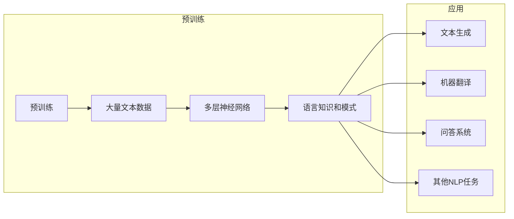

> 大语言模型, 预训练, 微调, 自然语言处理, Transformer, 生成式AI, 鲁棒性, 可解释性, 伦理

# 大语言模型原理基础与前沿 未来发展方向

## 1. 背景介绍

随着深度学习技术的飞速发展，大语言模型（Large Language Models，LLMs）如BERT、GPT等在自然语言处理（Natural Language Processing，NLP）领域取得了显著的成就。这些模型通过在大量文本数据上进行预训练，学习到了丰富的语言知识和模式，从而在文本生成、机器翻译、问答系统等领域表现出惊人的能力。本文将深入探讨大语言模型的原理、前沿技术及其未来发展方向。

## 2. 核心概念与联系

### 2.1 大语言模型

大语言模型是一种通过在大量文本语料上进行预训练，学习语言结构和语义的深度学习模型。它们通常由多层神经网络组成，能够处理和生成自然语言。

#### Mermaid 流程图



### 2.2 预训练

预训练是指在大规模无标签文本语料上进行模型训练的过程。预训练模型通常学习到通用语言知识，为下游任务提供强大的特征提取能力。

### 2.3 微调

微调是在预训练模型的基础上，针对特定任务进行进一步训练的过程。通过在少量标注数据上进行微调，模型可以学习到特定任务的特定知识。

## 3. 核心算法原理 & 具体操作步骤

### 3.1 算法原理概述

大语言模型的算法原理主要基于神经网络和深度学习技术。模型通过学习大量文本数据，自动学习语言的语法、语义和上下文信息。

### 3.2 算法步骤详解

1. **数据收集**：收集大量文本数据，包括通用文本、特定领域文本等。
2. **预处理**：对收集到的文本数据进行清洗、分词、去噪等预处理操作。
3. **模型选择**：选择合适的预训练模型，如BERT、GPT等。
4. **预训练**：在预处理后的文本数据上对模型进行预训练，学习通用语言知识。
5. **微调**：在特定任务的标注数据上对模型进行微调，学习特定任务的特定知识。
6. **评估**：在测试集上评估模型性能，调整模型参数和超参数。

### 3.3 算法优缺点

**优点**：

- 学习到丰富的语言知识和模式。
- 可用于多种NLP任务。
- 预训练模型可以复用于多个任务，节省训练时间。

**缺点**：

- 训练数据量庞大，计算资源需求高。
- 模型可解释性差。
- 预训练过程中可能学习到有害信息。

### 3.4 算法应用领域

- 文本生成：如机器翻译、摘要生成、文本摘要等。
- 问答系统：如自动问答、机器翻译问答等。
- 文本分类：如情感分析、主题分类等。
- 机器翻译：如机器翻译、跨语言摘要等。

## 4. 数学模型和公式 & 详细讲解 & 举例说明

### 4.1 数学模型构建

大语言模型通常基于深度神经网络构建，包括多层感知器（MLP）、循环神经网络（RNN）和Transformer等。

#### 数学公式

$$
y = f(x; \theta)
$$

其中，$y$ 是模型的输出，$x$ 是输入数据，$\theta$ 是模型参数。

### 4.2 公式推导过程

以Transformer为例，其核心思想是自注意力机制（Self-Attention）和位置编码（Positional Encoding）。

#### 自注意力机制

$$
Q = W_Q \cdot X
$$

$$
K = W_K \cdot X
$$

$$
V = W_V \cdot X
$$

$$
\text{Attention}(Q, K, V) = \frac{e^{QK^T} / \sqrt{d_k}}{S}
$$

其中，$Q$、$K$ 和 $V$ 分别是查询、键和值向量，$S$ 是softmax函数，$W_Q$、$W_K$ 和 $W_V$ 是可学习的权重矩阵。

#### 位置编码

$$
P = P_{(0)} + P_{(1)} + \cdots + P_{(n-1)}
$$

其中，$P_{(i)}$ 是第 $i$ 个位置的位置编码向量。

### 4.3 案例分析与讲解

以BERT模型为例，其预训练任务包括：

- **掩码语言模型（Masked Language Model，MLM）**：随机掩码输入文本中的部分词，模型需要预测这些掩码词。
- **下一句预测（Next Sentence Prediction，NSP）**：给定一对句子，模型需要预测这两个句子是否为连续的。

## 5. 项目实践：代码实例和详细解释说明

### 5.1 开发环境搭建

1. 安装Python环境。
2. 安装TensorFlow或PyTorch等深度学习框架。
3. 安装Hugging Face的Transformers库。

### 5.2 源代码详细实现

以下是一个简单的BERT模型训练代码示例：

```python
from transformers import BertTokenizer, BertForMaskedLM
from transformers import AdamW, get_linear_schedule_with_warmup

tokenizer = BertTokenizer.from_pretrained('bert-base-uncased')
model = BertForMaskedLM.from_pretrained('bert-base-uncased')

train_inputs = tokenizer("[CLS] " + text, return_tensors="pt")
labels = tokenizer("[CLS] " + text, return_tensors="pt")["input_ids"]

optimizer = AdamW(model.parameters(), lr=5e-5, correct_bias=False)
scheduler = get_linear_schedule_with_warmup(optimizer, num_warmup_steps=0, num_training_steps=len(train_dataloader) * epochs)

model.train()
for epoch in range(epochs):
    for batch in train_dataloader:
        inputs = batch["input_ids"]
        labels = batch["labels"]
        
        outputs = model(inputs, labels=labels)
        loss = outputs.loss
        
        loss.backward()
        optimizer.step()
        scheduler.step()
        optimizer.zero_grad()
```

### 5.3 代码解读与分析

1. 加载预训练的BERT模型和分词器。
2. 将输入文本转换为模型所需的格式。
3. 定义优化器和学习率调度器。
4. 训练模型，包括前向传播、反向传播和参数更新。

### 5.4 运行结果展示

训练完成后，可以在测试集上评估模型性能，如准确率、召回率等。

## 6. 实际应用场景

大语言模型在以下场景中具有广泛应用：

- **文本生成**：如机器翻译、摘要生成、文本摘要等。
- **问答系统**：如自动问答、机器翻译问答等。
- **文本分类**：如情感分析、主题分类等。
- **机器翻译**：如机器翻译、跨语言摘要等。

## 7. 工具和资源推荐

### 7.1 学习资源推荐

- 《Deep Learning for Natural Language Processing》
- 《Transformers: State-of-the-art Models for NLP》
- Hugging Face官方文档

### 7.2 开发工具推荐

- TensorFlow
- PyTorch
- Hugging Face Transformers库

### 7.3 相关论文推荐

- BERT: Pre-training of Deep Bidirectional Transformers for Language Understanding
- Generative Pre-trained Transformers

## 8. 总结：未来发展趋势与挑战

### 8.1 研究成果总结

大语言模型在NLP领域取得了显著的成果，但仍然面临许多挑战。

### 8.2 未来发展趋势

- 模型规模将继续扩大。
- 微调技术将更加高效。
- 多模态融合将成为趋势。
- 可解释性和鲁棒性将得到提高。

### 8.3 面临的挑战

- 数据隐私和安全。
- 模型可解释性和鲁棒性。
- 避免模型偏见和歧视。

### 8.4 研究展望

大语言模型将继续在NLP领域发挥重要作用，并推动人工智能技术在更多领域的应用。

## 9. 附录：常见问题与解答

**Q1：大语言模型如何工作？**

A：大语言模型通过在大量文本数据上进行预训练，学习语言结构和语义，从而能够生成、理解和处理自然语言。

**Q2：大语言模型有哪些应用场景？**

A：大语言模型可以应用于文本生成、机器翻译、问答系统、文本分类、机器翻译等领域。

**Q3：大语言模型有哪些挑战？**

A：大语言模型面临数据隐私和安全、模型可解释性和鲁棒性、避免模型偏见和歧视等挑战。

**Q4：大语言模型的未来发展趋势是什么？**

A：大语言模型的未来发展趋势包括模型规模扩大、微调技术高效化、多模态融合、可解释性和鲁棒性提高等。

作者：禅与计算机程序设计艺术 / Zen and the Art of Computer Programming