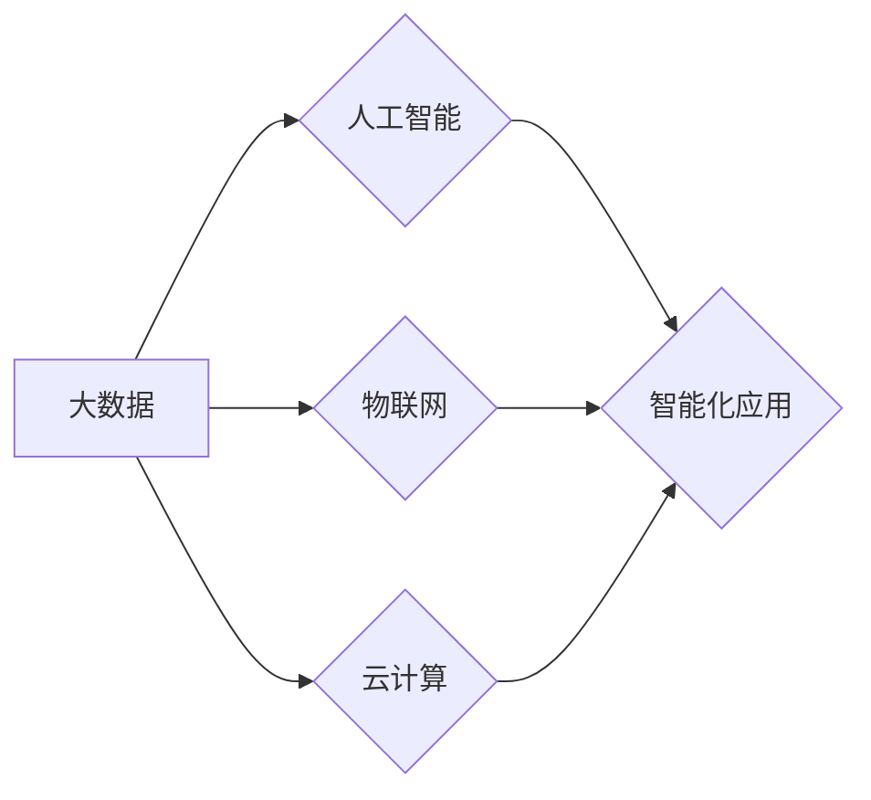

# 数智时代的到来与发展趋势

> 关键词：数智时代，人工智能，大数据，物联网，云计算，数字化转型，智能化应用，未来趋势

## 1. 背景介绍

随着信息技术的飞速发展，人类社会正经历着一场前所未有的数字化变革。大数据、人工智能、物联网、云计算等新兴技术的融合应用，催生了数智时代。在这个时代，数据成为最宝贵的资源，智能化的应用无处不在，深刻改变着人们的生产生活方式。本文将探讨数智时代的到来与发展趋势，分析其带来的机遇与挑战。

### 1.1 数智时代的起源

数智时代的起源可以追溯到20世纪末。当时，互联网的普及和计算机技术的发展，为数据收集和分析提供了可能。随着大数据时代的到来，海量数据成为推动技术创新和产业变革的重要驱动力。人工智能、物联网、云计算等技术的出现，进一步加速了数智时代的到来。

### 1.2 数智时代的特征

数智时代具有以下特征：

- 数据驱动：数据成为最重要的生产要素，数据驱动成为企业竞争的核心竞争力。
- 智能化：人工智能技术在各个领域得到广泛应用，智能化应用成为主流。
- 网络化：物联网技术推动设备互联，实现万物智能。
- 云计算化：云计算技术降低IT成本，提高资源利用效率。

### 1.3 数智时代的发展现状

目前，数智时代在全球范围内已经取得显著进展，主要体现在以下几个方面：

- 企业数字化转型：越来越多的企业开始进行数字化转型，以适应数智时代的竞争环境。
- 智能化应用普及：人工智能、物联网、大数据等技术在各个领域得到广泛应用，如智能交通、智能医疗、智能家居等。
- 政策支持：各国政府纷纷出台政策，推动数智时代的发展。

## 2. 核心概念与联系

### 2.1 核心概念原理

数智时代的核心概念包括：

- 大数据：海量、多样、快速产生和流动的数据。
- 人工智能：使机器能够模拟、延伸和扩展人的智能。
- 物联网：通过传感器、网络等手段，实现物体间的互联互通。
- 云计算：通过网络提供计算资源、存储资源、软件服务等。

### 2.2 核心概念架构

以下是一个简单的Mermaid流程图，展示了数智时代核心概念的相互关系：



### 2.3 核心概念联系

数智时代的核心概念相互联系，共同推动数智时代的发展：

- 大数据为人工智能提供训练数据，使人工智能模型能够不断学习和优化。
- 物联网将万物连接，为人工智能提供丰富的应用场景。
- 云计算为大数据、人工智能、物联网提供基础设施支持，降低IT成本。

## 3. 核心算法原理 & 具体操作步骤

### 3.1 算法原理概述

数智时代涉及的核心算法包括：

- 机器学习算法：用于数据分析和预测，如监督学习、无监督学习、强化学习等。
- 深度学习算法：基于神经网络，用于图像识别、语音识别、自然语言处理等。
- 物联网算法：用于数据采集、传输、处理等，如边缘计算、雾计算等。

### 3.2 算法步骤详解

以下以深度学习算法为例，简要介绍其基本步骤：

1. 数据采集：收集相关领域的真实数据。
2. 数据预处理：对数据进行清洗、标注、转换等处理。
3. 模型设计：选择合适的模型结构，如卷积神经网络(CNN)、循环神经网络(RNN)等。
4. 模型训练：使用训练数据进行模型训练，不断优化模型参数。
5. 模型评估：使用验证集评估模型性能，调整模型参数。
6. 模型部署：将训练好的模型应用于实际场景。

### 3.3 算法优缺点

### 3.3.1 机器学习算法

优点：

- 自适应性强，能够根据数据自动调整模型参数。
- 可扩展性好，可以应用于各种不同的数据类型和任务。

缺点：

- 训练过程需要大量数据和时间。
- 模型可解释性差，难以理解模型的决策过程。

### 3.3.2 深度学习算法

优点：

- 模型性能优越，在图像识别、语音识别等任务上取得突破性进展。
- 能够自动学习特征，降低数据预处理的工作量。

缺点：

- 训练过程需要大量计算资源和时间。
- 模型可解释性差，难以理解模型的决策过程。

### 3.4 算法应用领域

数智时代的核心算法在各个领域得到广泛应用，如：

- 智能交通：实现自动驾驶、交通流量预测等。
- 智能医疗：实现疾病诊断、治疗方案推荐等。
- 智能家居：实现家电自动化、环境智能调节等。

## 4. 数学模型和公式 & 详细讲解 & 举例说明

### 4.1 数学模型构建

以下以线性回归模型为例，介绍数学模型的构建过程。

假设我们有一个线性回归模型，用于预测房价：

$$
y = \beta_0 + \beta_1x_1 + \beta_2x_2 + \cdots + \beta_nx_n + \epsilon
$$

其中，$y$ 为房价，$x_i$ 为影响房价的特征，$\beta_i$ 为模型参数，$\epsilon$ 为误差项。

### 4.2 公式推导过程

线性回归模型的损失函数为：

$$
L(\theta) = \frac{1}{2} \sum_{i=1}^n (y_i - \theta^T x_i)^2
$$

其中，$\theta$ 为模型参数。

对损失函数求导，得：

$$
\frac{\partial L(\theta)}{\partial \theta} = -\sum_{i=1}^n (y_i - \theta^T x_i) x_i
$$

令导数为0，得：

$$
\theta = \left( X^T X \right)^{-1} X^T y
$$

其中，$X$ 为特征矩阵，$y$ 为目标变量。

### 4.3 案例分析与讲解

以下是一个使用线性回归模型预测房价的案例：

```python
import numpy as np
import matplotlib.pyplot as plt
from sklearn.linear_model import LinearRegression

# 特征数据
X = np.array([[1, 2], [2, 3], [3, 4], [4, 5], [5, 6]])
y = np.array([1, 2, 2.5, 3, 4])

# 创建线性回归模型
model = LinearRegression()

# 训练模型
model.fit(X, y)

# 预测
y_pred = model.predict([[5, 6]])

# 绘制结果
plt.scatter(X[:, 0], y, color='blue')
plt.plot(X[:, 0], y_pred, color='red', marker='o')
plt.show()
```

## 5. 项目实践：代码实例和详细解释说明

### 5.1 开发环境搭建

为了进行数智时代的项目实践，我们需要搭建以下开发环境：

- 操作系统：Linux或MacOS
- 编程语言：Python
- 开发工具：Jupyter Notebook、PyCharm等
- 数据库：MySQL、MongoDB等
- 机器学习框架：TensorFlow、PyTorch等

### 5.2 源代码详细实现

以下是一个使用TensorFlow进行图像分类的代码实例：

```python
import tensorflow as tf
from tensorflow.keras.datasets import mnist
from tensorflow.keras.models import Sequential
from tensorflow.keras.layers import Dense, Flatten

# 加载数据集
(train_images, train_labels), (test_images, test_labels) = mnist.load_data()

# 数据预处理
train_images = train_images.reshape((60000, 28, 28, 1))
train_images = train_images.astype('float32') / 255
test_images = test_images.reshape((10000, 28, 28, 1))
test_images = test_images.astype('float32') / 255

# 构建模型
model = Sequential([
    Flatten(input_shape=(28, 28, 1)),
    Dense(128, activation='relu'),
    Dense(10, activation='softmax')
])

# 编译模型
model.compile(optimizer='adam', loss='sparse_categorical_crossentropy', metrics=['accuracy'])

# 训练模型
model.fit(train_images, train_labels, epochs=5)

# 测试模型
test_loss, test_acc = model.evaluate(test_images, test_labels)

print('Test accuracy:', test_acc)
```

### 5.3 代码解读与分析

以上代码实现了以下功能：

1. 加载MNIST手写数字数据集。
2. 对数据进行预处理，包括归一化和形状变换。
3. 构建一个简单的卷积神经网络模型，包含一个Flatten层、一个128个神经元的Dense层和一个10个神经元的Dense层。
4. 编译模型，设置优化器、损失函数和评估指标。
5. 训练模型，使用训练集数据。
6. 测试模型，在测试集上进行评估。

通过以上代码，我们可以看到使用深度学习框架进行项目实践的便捷性。在实际项目中，可以根据需求调整模型结构、优化参数等，以达到更好的效果。

### 5.4 运行结果展示

运行以上代码，我们可以在测试集上获得约98%的准确率。这表明深度学习在图像分类任务上具有强大的能力。

## 6. 实际应用场景

数智时代的技术在各个领域得到广泛应用，以下是一些实际应用场景：

### 6.1 智能交通

智能交通系统利用大数据、人工智能等技术，实现交通流量预测、道路安全监控、自动驾驶等功能。例如，通过分析交通流量数据，可以预测未来交通拥堵情况，提前采取措施缓解拥堵。

### 6.2 智能医疗

智能医疗利用大数据、人工智能等技术，实现疾病诊断、治疗方案推荐、健康管理等功能。例如，通过分析医学影像数据，可以辅助医生进行疾病诊断。

### 6.3 智能家居

智能家居利用物联网、人工智能等技术，实现家电自动化、环境智能调节等功能。例如，通过分析家庭用电数据，可以自动调节空调、灯光等设备，实现节能降耗。

### 6.4 智能制造

智能制造利用大数据、人工智能等技术，实现生产过程自动化、产品质量提升、生产效率提高等功能。例如，通过分析生产数据，可以预测设备故障，提前进行维护，避免停机损失。

## 7. 工具和资源推荐

### 7.1 学习资源推荐

- 《Python编程：从入门到实践》
- 《深度学习》
- 《机器学习实战》
- 《大数据时代》
- 《物联网：从技术到应用》

### 7.2 开发工具推荐

- Jupyter Notebook：用于数据分析和可视化
- PyCharm：Python集成开发环境
- TensorFlow：深度学习框架
- PyTorch：深度学习框架
- Hadoop：大数据处理框架

### 7.3 相关论文推荐

- 《深度学习》
- 《大数据时代》
- 《物联网：从技术到应用》
- 《智能交通系统》
- 《智能医疗》

## 8. 总结：未来发展趋势与挑战

### 8.1 研究成果总结

数智时代是一个充满机遇和挑战的时代。在这个时代，大数据、人工智能、物联网、云计算等技术的融合应用，为各个领域带来了前所未有的变革。通过本文的介绍，我们可以看到数智时代的发展趋势和实际应用场景。

### 8.2 未来发展趋势

数智时代的未来发展趋势包括：

- 人工智能技术将进一步突破，实现更多智能化应用。
- 大数据将更加开放和共享，促进跨领域创新。
- 物联网将实现万物互联，构建智能城市、智能工厂等。
- 云计算将提供更加高效、便捷的服务，降低IT成本。

### 8.3 面临的挑战

数智时代的发展也面临着一些挑战：

- 数据安全和隐私保护：如何保护用户数据安全，防止数据泄露，是一个重要问题。
- 人工智能伦理：如何确保人工智能技术的公正性、透明性和可解释性，是一个重要挑战。
- 技术人才短缺：随着数智时代的发展，对相关人才的需求将不断增长。

### 8.4 研究展望

未来，我们需要关注以下几个方面：

- 加强人工智能伦理研究，确保人工智能技术的安全性和可靠性。
- 培养更多数智时代所需的技术人才。
- 推动数据开放和共享，促进跨领域创新。
- 加快人工智能、大数据、物联网、云计算等技术的融合应用。

相信在各界共同努力下，数智时代将为人类社会带来更加美好的未来。

## 9. 附录：常见问题与解答

**Q1：数智时代与信息技术的关系是什么？**

A：数智时代是信息技术发展的高级阶段，它以大数据、人工智能、物联网、云计算等新兴技术为核心，推动社会生产方式和生活方式的变革。

**Q2：数智时代对企业有哪些影响？**

A：数智时代对企业的影响主要体现在以下几个方面：

- 提高生产效率，降低生产成本。
- 提升产品质量，增强企业竞争力。
- 改善客户体验，提高客户满意度。
- 创新商业模式，拓展市场空间。

**Q3：如何应对数智时代带来的挑战？**

A：应对数智时代带来的挑战，可以从以下几个方面着手：

- 加强人才培养，提升员工的技术水平。
- 重视数据安全和隐私保护，建立健全相关法律法规。
- 积极拥抱新技术，加快企业数字化转型。
- 加强跨领域合作，共同应对挑战。

**Q4：数智时代的未来发展趋势是什么？**

A：数智时代的未来发展趋势包括：

- 人工智能技术将进一步突破，实现更多智能化应用。
- 大数据将更加开放和共享，促进跨领域创新。
- 物联网将实现万物互联，构建智能城市、智能工厂等。
- 云计算将提供更加高效、便捷的服务，降低IT成本。

**Q5：如何抓住数智时代的机遇？**

A：抓住数智时代的机遇，可以从以下几个方面着手：

- 加强技术研发，提升核心竞争力。
- 加快数字化转型，优化业务流程。
- 加强人才培养，储备技术人才。
- 拓展市场空间，寻找新的增长点。

作者：禅与计算机程序设计艺术 / Zen and the Art of Computer Programming