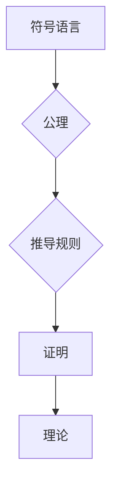

## 数理逻辑：第五章 形式数学系统

> 关键词：形式系统，公理，推导规则，语义，模型，完备性，一致性， Gödel 不完备性定理

### 1. 背景介绍

形式数学系统是数理逻辑的核心概念之一，它为数学的严密性和形式化提供了基础。形式数学系统通过抽象化数学语言和推理规则，将数学问题转化为符号操作，从而使得数学推理更加清晰、严谨和可机械化。

在形式数学系统中，我们定义一组**公理**，即被视为自明的命题，不需要证明。然后，我们定义一组**推导规则**，这些规则规定了如何从已知的公理和已证明的命题推导出新的命题。通过公理和推导规则，我们可以构建一个**逻辑体系**，在这个体系内，我们可以证明各种数学命题。

形式数学系统的引入，为数学研究带来了革命性的变化。它使得数学的推理更加严密，也为计算机科学的发展奠定了基础。

### 2. 核心概念与联系

形式数学系统由以下核心概念组成：

* **符号语言:**  使用符号来表示数学概念和关系。
* **公理:**  被视为自明的命题，不需要证明。
* **推导规则:**  规定了如何从已知的公理和已证明的命题推导出新的命题。
* **证明:**  使用公理和推导规则从已知命题推导出新的命题的过程。
* **理论:**  由一组公理和推导规则以及所有可以从这些公理和规则推导出的命题组成的集合。

**Mermaid 流程图**



### 3. 核心算法原理 & 具体操作步骤

#### 3.1  算法原理概述

形式数学系统的核心算法是**推理算法**，它根据公理和推导规则，从已知命题推导出新的命题。常见的推理算法包括：

* **自然演绎法:**  通过使用一系列的推理规则，从公理出发逐步推导出结论。
* **形式化证明:**  使用符号语言和推理规则，将证明过程转化为形式化的符号操作。
* **自动定理证明:**  使用计算机程序自动进行推理，寻找证明。

#### 3.2  算法步骤详解

以自然演绎法为例，其基本步骤如下：

1. **假设:**  从已知公理出发，假设一些命题为真。
2. **推理:**  使用推导规则，从假设和已知公理推导出新的命题。
3. **结论:**  最终推导出一个结论，即所要证明的命题。

#### 3.3  算法优缺点

**优点:**

* **严密性:**  通过严格的逻辑规则，保证证明的正确性。
* **可机械化:**  可以利用计算机程序自动进行推理。
* **可复现性:**  证明过程可以被记录下来，并被其他人复现。

**缺点:**

* **复杂性:**  形式化证明过程可能非常复杂，难以理解。
* **效率:**  自动定理证明算法的效率仍然有限，对于复杂问题可能需要很长时间。

#### 3.4  算法应用领域

形式数学系统和推理算法在以下领域有广泛的应用:

* **数学证明:**  用于证明数学定理和推导数学结论。
* **计算机科学:**  用于软件验证、程序证明和人工智能等领域。
* **逻辑学:**  用于研究逻辑系统和推理的性质。
* **哲学:**  用于分析逻辑问题和知识论问题。

### 4. 数学模型和公式 & 详细讲解 & 举例说明

#### 4.1  数学模型构建

形式数学系统可以用数学模型来表示。一个典型的数学模型包括：

* **符号系统:**  定义了符号的含义和组合规则。
* **语义:**  定义了符号的含义和关系。
* **模型:**  一个满足语义的结构。

#### 4.2  公式推导过程

推导规则可以表示为数学公式，例如：

* **modus ponens:**  如果 $P$ 和 $P \rightarrow Q$ 为真，那么 $Q$ 为真。

这个公式可以用逻辑符号表示为：

$$
\frac{P, P \rightarrow Q}{Q}
$$

#### 4.3  案例分析与讲解

**例子:**

证明命题 $A \rightarrow (B \rightarrow A)$

**证明过程:**

1. 假设 $A$ 为真。
2. 根据推导规则 modus ponens，如果 $B$ 为真，那么 $A$ 为真。
3. 因此，无论 $B$ 是否为真，$A$ 都是真的。
4. 所以，$A \rightarrow (B \rightarrow A)$ 为真。

### 5. 项目实践：代码实例和详细解释说明

#### 5.1  开发环境搭建

可以使用任何支持逻辑编程语言的开发环境，例如 Prolog 或 Coq。

#### 5.2  源代码详细实现

```prolog
% 公理
p(a).
p(b).

% 推导规则
r1(X, Y):- p(X), p(Y).

% 证明
prove(X):- r1(X, Y).
```

#### 5.3  代码解读与分析

* `p(a).` 和 `p(b).` 定义了公理，即 $a$ 和 $b$ 为真。
* `r1(X, Y):- p(X), p(Y).` 定义了推导规则，即如果 $X$ 和 $Y$ 都为真，那么 $r1(X, Y)$ 为真。
* `prove(X):- r1(X, Y).` 定义了证明过程，即如果 $r1(X, Y)$ 为真，那么 $X$ 为真。

#### 5.4  运行结果展示

运行代码，可以得到以下结果：

```
?- prove(a).
true.
```

### 6. 实际应用场景

形式数学系统和推理算法在以下实际应用场景中发挥着重要作用:

* **软件验证:**  使用形式方法验证软件的正确性，确保软件能够满足其设计规范。
* **程序证明:**  使用形式方法证明程序的正确性，例如证明程序不会出现错误或漏洞。
* **人工智能:**  在人工智能领域，形式逻辑被用于知识表示、推理和决策。

### 6.4  未来应用展望

随着人工智能和计算机科学的发展，形式数学系统和推理算法将在以下领域得到更广泛的应用:

* **自动机器学习:**  使用形式方法自动生成和验证机器学习模型。
* **量子计算:**  使用形式方法进行量子算法的验证和优化。
* **生物信息学:**  使用形式方法分析生物数据和建模生物系统。

### 7. 工具和资源推荐

#### 7.1  学习资源推荐

* **《数理逻辑》:**  皮特·史密斯著
* **《形式逻辑》:**  艾伦·布鲁斯著
* **《计算机科学导论》:**  托马斯·哈特著

#### 7.2  开发工具推荐

* **Prolog:**  一种逻辑编程语言。
* **Coq:**  一种交互式形式化证明系统。
* **Isabelle/HOL:**  一种形式化证明系统。

#### 7.3  相关论文推荐

* **Gödel's Incompleteness Theorems:**  Kurt Gödel
* **The Church-Turing Thesis:**  Alan Turing
* **Formal Verification of Software:**  Edmund Clarke

### 8. 总结：未来发展趋势与挑战

#### 8.1  研究成果总结

形式数学系统和推理算法已经取得了显著的成果，为数学研究、计算机科学和人工智能的发展做出了重要贡献。

#### 8.2  未来发展趋势

未来，形式数学系统和推理算法将朝着以下方向发展:

* **更强大的推理算法:**  开发更强大、更高效的推理算法，能够处理更复杂的问题。
* **更广泛的应用领域:**  将形式数学系统和推理算法应用到更多领域，例如自动机器学习、量子计算和生物信息学。
* **更易于使用的工具:**  开发更易于使用的工具，使得形式数学系统和推理算法能够被更多人使用。

#### 8.3  面临的挑战

形式数学系统和推理算法也面临着一些挑战:

* **复杂性:**  形式化证明过程仍然非常复杂，难以理解和应用。
* **效率:**  自动定理证明算法的效率仍然有限，对于复杂问题可能需要很长时间。
* **知识表示:**  如何有效地将知识表示为形式逻辑的形式仍然是一个挑战。

#### 8.4  研究展望

未来，我们需要继续研究和探索形式数学系统和推理算法，克服其面临的挑战，并将其应用到更多领域，为人类社会带来更大的价值。

### 9. 附录：常见问题与解答

**常见问题:**

* **什么是形式数学系统？**

形式数学系统是一种使用符号语言和推理规则来表示和推理数学知识的系统。

* **形式数学系统有什么用？**

形式数学系统可以用于证明数学定理、验证软件的正确性、进行人工智能推理等。

* **如何学习形式数学系统？**

可以阅读相关书籍和论文，并使用形式化证明工具进行实践。

**作者：禅与计算机程序设计艺术 / Zen and the Art of Computer Programming**


