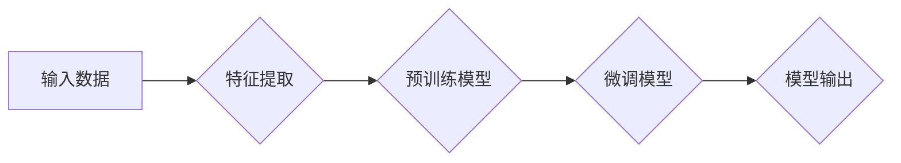

# 未来大型模型应用的四个关键方向

> 关键词：大型模型，应用方向，人工智能，深度学习，自然语言处理，计算机视觉，知识图谱

## 1. 背景介绍

随着深度学习技术的飞速发展，大型模型在各个领域取得了显著的成果。从自然语言处理到计算机视觉，从语音识别到推荐系统，大型模型展现出了强大的学习和推理能力。然而，大型模型的应用并非一帆风顺，面临着诸多挑战。本文将探讨未来大型模型应用的四个关键方向，以期为相关研究和实践提供一些启示。

## 2. 核心概念与联系

### 2.1 大型模型

大型模型是指具有海量参数和复杂结构的深度学习模型。它们通常在大型数据集上进行预训练，以学习丰富的特征表示和知识。大型模型的应用涵盖了自然语言处理、计算机视觉、语音识别等多个领域。

### 2.2 Mermaid 流程图

以下是一个简化的 Mermaid 流程图，展示了大型模型的基本原理和架构：



### 2.3 核心概念联系

- **输入数据**：大型模型应用的基础，包括文本、图像、语音等多种数据类型。
- **特征提取**：从输入数据中提取关键特征，为模型学习提供数据支撑。
- **预训练模型**：在大量无标签数据上进行训练，学习通用的特征表示和知识。
- **微调模型**：在特定领域数据上进行训练，进一步提升模型在特定任务上的性能。
- **模型输出**：模型根据输入数据生成的预测结果或推理结论。

## 3. 核心算法原理 & 具体操作步骤

### 3.1 算法原理概述

大型模型的应用主要基于以下原理：

1. **深度学习**：通过多层神经网络学习数据的层次化特征表示。
2. **大数据**：利用海量数据训练模型，提升模型的学习能力和泛化能力。
3. **优化算法**：使用高效的优化算法，如Adam、SGD等，加速模型训练。

### 3.2 算法步骤详解

1. **数据预处理**：对输入数据进行清洗、去噪、标准化等预处理操作。
2. **模型选择**：根据任务需求选择合适的预训练模型。
3. **特征提取**：使用预训练模型提取输入数据的特征表示。
4. **微调**：在特定领域数据上对预训练模型进行微调，进一步提升模型性能。
5. **模型评估**：使用测试数据评估模型性能，调整超参数和模型结构。
6. **模型部署**：将训练好的模型部署到实际应用场景中。

### 3.3 算法优缺点

#### 优点：

- **强大的学习能力**：大型模型在预训练阶段积累了丰富的知识，能够处理复杂任务。
- **泛化能力强**：通过在大量数据上训练，大型模型能够泛化到未见过的数据。
- **高效性**：深度学习框架和硬件加速技术使得模型训练和推理效率得到提升。

#### 缺点：

- **数据依赖性**：大型模型需要海量数据进行预训练和微调。
- **计算资源消耗**：模型训练和推理需要大量的计算资源。
- **可解释性差**：深度学习模型的可解释性较差，难以理解模型的决策过程。

### 3.4 算法应用领域

大型模型在以下领域得到了广泛应用：

- **自然语言处理**：文本分类、情感分析、机器翻译、问答系统等。
- **计算机视觉**：图像分类、目标检测、图像分割、视频分析等。
- **语音识别**：语音识别、语音合成、语音翻译等。
- **推荐系统**：个性化推荐、商品推荐、新闻推荐等。

## 4. 数学模型和公式 & 详细讲解 & 举例说明

### 4.1 数学模型构建

以下是一个简化的神经网络模型，用于说明大型模型的数学原理：

$$
h = f(W \cdot x + b)
$$

其中，$h$ 表示神经网络输出的特征表示，$W$ 表示权重矩阵，$x$ 表示输入数据，$b$ 表示偏置项，$f$ 表示激活函数。

### 4.2 公式推导过程

以卷积神经网络(CNN)为例，推导其损失函数的梯度：

$$
\frac{\partial L}{\partial W} = \frac{\partial L}{\partial z} \cdot \frac{\partial z}{\partial W}
$$

其中，$L$ 表示损失函数，$z$ 表示激活函数的输出。

### 4.3 案例分析与讲解

以BERT模型为例，分析其数学模型和公式：

- **输入层**：将文本输入转换为词向量表示。
- **Transformer编码器**：使用多头自注意力机制和前馈神经网络，提取文本特征表示。
- **输出层**：使用线性层和softmax函数，将特征表示转换为概率分布。

BERT模型的损失函数通常使用交叉熵损失函数：

$$
L = -\sum_{i=1}^N [y_i \log \hat{y}_i]
$$

其中，$y_i$ 表示真实标签，$\hat{y}_i$ 表示预测概率。

## 5. 项目实践：代码实例和详细解释说明

### 5.1 开发环境搭建

以下是使用PyTorch搭建开发环境的示例：

```bash
pip install torch torchvision
```

### 5.2 源代码详细实现

以下是一个简单的CNN模型实现：

```python
import torch
import torch.nn as nn

class SimpleCNN(nn.Module):
    def __init__(self):
        super(SimpleCNN, self).__init__()
        self.conv1 = nn.Conv2d(1, 16, kernel_size=3, stride=1, padding=1)
        self.relu = nn.ReLU()
        self.pool = nn.MaxPool2d(kernel_size=2, stride=2)
        self.fc1 = nn.Linear(16 * 6 * 6, 32)
        self.fc2 = nn.Linear(32, 10)

    def forward(self, x):
        x = self.relu(self.conv1(x))
        x = self.pool(x)
        x = x.view(x.size(0), -1)
        x = self.relu(self.fc1(x))
        x = self.fc2(x)
        return x
```

### 5.3 代码解读与分析

- `SimpleCNN` 类定义了一个简单的卷积神经网络模型。
- `__init__` 方法中初始化了卷积层、ReLU激活函数、最大池化层、全连接层等网络层。
- `forward` 方法实现了数据的前向传播过程。

### 5.4 运行结果展示

以下是一个简单的训练和评估流程：

```python
# 加载数据
train_loader = torch.utils.data.DataLoader(train_dataset, batch_size=32, shuffle=True)
test_loader = torch.utils.data.DataLoader(test_dataset, batch_size=32, shuffle=False)

# 初始化模型、损失函数和优化器
model = SimpleCNN()
criterion = nn.CrossEntropyLoss()
optimizer = torch.optim.Adam(model.parameters(), lr=0.001)

# 训练模型
for epoch in range(10):
    for data, target in train_loader:
        optimizer.zero_grad()
        output = model(data)
        loss = criterion(output, target)
        loss.backward()
        optimizer.step()

    # 评估模型
    model.eval()
    with torch.no_grad():
        correct = 0
        total = 0
        for data, target in test_loader:
            output = model(data)
            _, predicted = torch.max(output.data, 1)
            total += target.size(0)
            correct += (predicted == target).sum().item()

    print(f'Epoch {epoch+1}, Accuracy: {100 * correct / total}%')
```

## 6. 实际应用场景

### 6.1 自然语言处理

大型模型在自然语言处理领域取得了显著的成果，如BERT、GPT等。以下是一些实际应用场景：

- **文本分类**：对新闻、评论等进行分类，如情感分析、主题分类等。
- **机器翻译**：将一种语言翻译成另一种语言，如机器翻译、跨语言问答等。
- **文本生成**：根据给定文本生成新的文本，如自动摘要、对话系统等。

### 6.2 计算机视觉

大型模型在计算机视觉领域也取得了突破性进展，如ResNet、YOLO等。以下是一些实际应用场景：

- **图像分类**：对图像进行分类，如图像识别、物体检测等。
- **图像分割**：将图像分割成不同的区域，如语义分割、实例分割等。
- **视频分析**：对视频进行分析，如动作识别、目标跟踪等。

### 6.3 语音识别

大型模型在语音识别领域也取得了显著成果，如WaveNet、Transformers等。以下是一些实际应用场景：

- **语音识别**：将语音转换为文本，如语音助手、语音输入法等。
- **语音合成**：将文本转换为语音，如语音助手、语音播报等。
- **语音翻译**：将一种语言的语音翻译成另一种语言的语音，如语音翻译、跨语言对话等。

## 7. 工具和资源推荐

### 7.1 学习资源推荐

- **书籍**：
  - 《深度学习》
  - 《统计学习方法》
  - 《自然语言处理综合教程》
- **在线课程**：
  - Coursera的深度学习课程
  - Udacity的深度学习工程师纳米学位
  - fast.ai的深度学习课程

### 7.2 开发工具推荐

- **编程语言**：Python
- **深度学习框架**：PyTorch、TensorFlow、Keras
- **数据分析库**：NumPy、Pandas、Scikit-learn
- **可视化工具**：Matplotlib、Seaborn、TensorBoard

### 7.3 相关论文推荐

- **自然语言处理**：
  - "Attention is All You Need"
  - "BERT: Pre-training of Deep Bidirectional Transformers for Language Understanding"
  - "Generative Language Models: A Survey"
- **计算机视觉**：
  - "Deep Learning with Python"
  - "Deep Learning in Computer Vision"
  - "A Survey of Deep Learning in Medical Image Analysis"

## 8. 总结：未来发展趋势与挑战

### 8.1 研究成果总结

本文探讨了未来大型模型应用的四个关键方向，包括：

1. **深度学习**：深度学习是大型模型应用的基础，将继续推动模型性能的提升。
2. **大数据**：海量数据是大型模型预训练的关键，数据质量的提升将进一步提升模型性能。
3. **优化算法**：高效的优化算法将加速模型训练和推理，降低计算资源消耗。
4. **跨学科融合**：将大型模型与其他学科知识相结合，将推动人工智能向更广阔的领域发展。

### 8.2 未来发展趋势

未来大型模型应用将呈现以下发展趋势：

1. **模型规模不断扩大**：随着计算资源的提升，模型规模将进一步扩大，以学习更丰富的特征表示和知识。
2. **多模态融合**：大型模型将融合文本、图像、语音等多种模态数据，实现更全面的感知和理解。
3. **可解释性提升**：研究者将致力于提高模型的可解释性，使模型的决策过程更加透明。
4. **安全性和可靠性增强**：大型模型的应用将更加注重安全性和可靠性，以降低风险和负面影响。

### 8.3 面临的挑战

未来大型模型应用将面临以下挑战：

1. **数据隐私和安全**：如何保护用户隐私和确保数据安全是一个重要的挑战。
2. **模型偏见和歧视**：大型模型可能会学习到数据中的偏见和歧视，需要采取措施消除这些偏见。
3. **计算资源消耗**：大型模型的训练和推理需要大量的计算资源，需要寻找更高效的解决方案。
4. **模型可解释性**：如何提高模型的可解释性，使模型更加透明和可靠。

### 8.4 研究展望

未来大型模型应用的研究将主要集中在以下几个方面：

1. **隐私保护**：研究隐私保护技术，如差分隐私、联邦学习等，以保护用户隐私。
2. **可解释性**：研究可解释人工智能技术，如注意力机制、可视化技术等，提高模型的可解释性。
3. **鲁棒性**：研究鲁棒性技术，提高模型在面对对抗攻击和噪声数据时的鲁棒性。
4. **跨学科融合**：将大型模型与其他学科知识相结合，推动人工智能向更广阔的领域发展。

## 9. 附录：常见问题与解答

**Q1：什么是大型模型？**

A：大型模型是指具有海量参数和复杂结构的深度学习模型。它们通常在大量数据上进行预训练，以学习丰富的特征表示和知识。

**Q2：大型模型有哪些优点？**

A：大型模型具有以下优点：
- 强大的学习能力
- 泛化能力强
- 高效性

**Q3：大型模型有哪些缺点？**

A：大型模型具有以下缺点：
- 数据依赖性
- 计算资源消耗
- 可解释性差

**Q4：大型模型应用有哪些实际场景？**

A：大型模型应用涵盖了自然语言处理、计算机视觉、语音识别等多个领域，如文本分类、机器翻译、图像识别等。

**Q5：未来大型模型应用将面临哪些挑战？**

A：未来大型模型应用将面临以下挑战：
- 数据隐私和安全
- 模型偏见和歧视
- 计算资源消耗
- 模型可解释性

作者：禅与计算机程序设计艺术 / Zen and the Art of Computer Programming