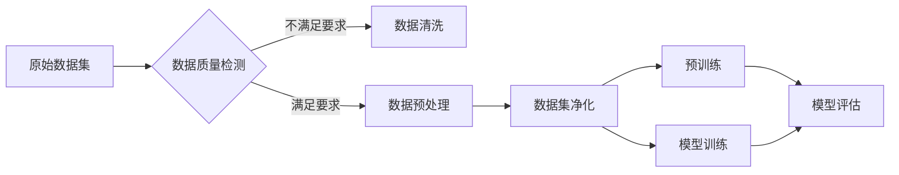

# 大语言模型原理与工程实践：数据集净化

> 关键词：数据集净化，大语言模型，NLP，文本清洗，数据预处理，数据质量，预训练，模型训练

## 1. 背景介绍

随着自然语言处理（NLP）技术的飞速发展，大语言模型（Large Language Models, LLMs）如BERT、GPT-3等在各个领域展现出惊人的能力。这些模型通过在海量文本数据上预训练，学习到了丰富的语言知识和上下文理解能力。然而，模型性能的提升不仅依赖于模型本身的架构和参数，更依赖于输入数据的质量。在LLMs的训练和部署过程中，数据集净化成为了一个关键且不可忽视的环节。

### 1.1 数据集净化的重要性

数据集净化，即对输入数据进行清洗和预处理，确保数据的准确性和一致性，对于模型训练和预测结果的可靠性至关重要。以下是数据集净化的几个关键作用：

- **提高模型性能**：高质量的输入数据能够帮助模型学习到更准确的特征和模式，从而提升模型的性能。
- **减少噪声干扰**：数据集中的噪声和异常值会干扰模型学习，通过净化数据可以降低这种干扰。
- **避免模型偏差**：数据集中的偏差会传递到模型中，导致模型在特定群体或领域上的不公平表现，净化数据有助于减少这种偏差。
- **提升泛化能力**：高质量的训练数据能够帮助模型更好地泛化到未见过的数据上，提高模型的鲁棒性。

### 1.2 数据集净化的挑战

尽管数据集净化的重要性不言而喻，但在实际操作中仍面临着诸多挑战：

- **数据规模庞大**：LLMs通常需要海量数据进行训练，数据清洗和预处理的工作量巨大。
- **数据多样性**：自然语言数据具有极高的多样性，需要开发灵活的清洗策略。
- **手动标注成本高**：一些清洗操作可能需要人工标注，成本高昂且费时。
- **自动清洗工具有限**：尽管有一些自动清洗工具，但它们可能无法处理复杂的数据问题。

## 2. 核心概念与联系

### 2.1 核心概念

- **数据集净化**：指对数据集进行清洗和预处理的过程，包括去除噪声、异常值、重复数据等。
- **数据清洗**：指识别和去除数据集中的错误、不一致性和不必要的部分。
- **数据预处理**：指对数据进行标准化、格式化、转换等操作，以便于模型处理。
- **数据质量**：指数据满足特定任务需求的程度，包括准确性、完整性、一致性、可靠性等。
- **预训练**：指在大规模无标签数据上训练模型，使其学习到通用语言知识。
- **模型训练**：指在标注数据上训练模型，使其学习到特定任务的知识。

### 2.2 Mermaid 流程图

以下是一个Mermaid流程图，展示了数据集净化的流程：



### 2.3 关联性

数据集净化是数据集处理的重要组成部分，它直接影响着后续的预训练和模型训练过程。高质量的净化数据能够为模型提供更好的学习基础，从而提升模型的性能。

## 3. 核心算法原理 & 具体操作步骤

### 3.1 算法原理概述

数据集净化通常包括以下几个步骤：

1. **数据质量检测**：评估数据集的质量，包括准确性、完整性、一致性等。
2. **数据清洗**：去除数据集中的错误、不一致性和不必要的部分。
3. **数据预处理**：对数据进行标准化、格式化、转换等操作。
4. **数据集净化**：结合清洗和预处理，生成高质量的数据集。

### 3.2 算法步骤详解

#### 3.2.1 数据质量检测

数据质量检测可以通过以下方法进行：

- **统计指标**：计算数据集的基本统计指标，如平均值、中位数、标准差等。
- **数据可视化**：使用图表和可视化工具展示数据分布和异常值。
- **数据一致性检查**：检查数据集中的重复数据、缺失值等问题。

#### 3.2.2 数据清洗

数据清洗可以采用以下方法：

- **去除重复数据**：识别并删除数据集中的重复记录。
- **去除异常值**：识别并删除或修正数据集中的异常值。
- **去除噪声**：去除数据中的无关或错误信息。

#### 3.2.3 数据预处理

数据预处理可以采用以下方法：

- **标准化**：将数据转换为相同的尺度，如归一化或标准化。
- **格式化**：将数据格式化为统一的格式，如日期格式化、时间格式化等。
- **转换**：将数据转换为适合模型处理的格式，如文本分词、词性标注等。

#### 3.2.4 数据集净化

数据集净化是数据清洗和预处理的综合应用，通过上述步骤生成高质量的数据集。

### 3.3 算法优缺点

#### 3.3.1 优点

- 提高数据质量，为模型训练提供更好的数据基础。
- 降低噪声和异常值对模型学习的影响。
- 提升模型性能和泛化能力。

#### 3.3.2 缺点

- 数据清洗和预处理工作量巨大，成本高昂。
- 需要人工参与，费时费力。
- 难以完全自动化，需要针对特定问题进行定制化处理。

### 3.4 算法应用领域

数据集净化技术广泛应用于NLP、机器学习、数据科学等领域，以下是一些具体的应用场景：

- **文本分类**：清洗和预处理文本数据，提高分类模型的准确性。
- **命名实体识别**：清洗和预处理文本数据，提高命名实体识别的准确性。
- **情感分析**：清洗和预处理文本数据，提高情感分析的准确性。
- **机器翻译**：清洗和预处理文本数据，提高机器翻译的质量。

## 4. 数学模型和公式 & 详细讲解 & 举例说明

### 4.1 数学模型构建

在数据集净化过程中，可能会涉及到一些数学模型，例如：

- **文本分类**：使用SVM、Logistic Regression等分类模型进行文本分类。
- **异常值检测**：使用Z-Score、IQR等方法检测异常值。

### 4.2 公式推导过程

以下是一个简单的文本分类模型的公式推导过程：

假设我们有以下文本分类问题：

- 输入：文本向量 $\mathbf{x}$ 和对应的标签 $y$。
- 目标：根据输入文本预测其对应的标签。

使用Logistic Regression模型进行文本分类的公式为：

$$
\hat{y} = \sigma(\mathbf{w}^T \mathbf{x} + b)
$$

其中 $\sigma$ 为Sigmoid函数，$\mathbf{w}$ 为模型参数，$b$ 为偏置项。

### 4.3 案例分析与讲解

以下是一个使用Python进行文本分类的案例：

```python
import pandas as pd
from sklearn.feature_extraction.text import CountVectorizer
from sklearn.linear_model import LogisticRegression

# 加载数据集
data = pd.read_csv('data.csv')
texts = data['text']
labels = data['label']

# 文本向量化
vectorizer = CountVectorizer()
X = vectorizer.fit_transform(texts)

# 训练模型
model = LogisticRegression()
model.fit(X, labels)

# 预测
text = "This is a good product"
X = vectorizer.transform([text])
prediction = model.predict(X)
print(f"Predicted label: {prediction[0]}")
```

在上面的代码中，我们首先使用CountVectorizer将文本数据转换为向量，然后使用Logistic Regression模型进行训练。最后，我们使用训练好的模型对新的文本进行预测。

## 5. 项目实践：代码实例和详细解释说明

### 5.1 开发环境搭建

为了进行数据集净化实践，我们需要以下开发环境：

- Python 3.x
- NumPy
- Pandas
- Scikit-learn

### 5.2 源代码详细实现

以下是一个简单的数据集净化代码示例：

```python
import pandas as pd

# 加载数据集
data = pd.read_csv('data.csv')

# 去除重复数据
data = data.drop_duplicates()

# 去除缺失值
data = data.dropna()

# 格式化日期
data['date'] = pd.to_datetime(data['date'])

# 转换类别数据
data['category'] = data['category'].astype('category')

# 输出清洗后的数据集
print(data.head())
```

在上面的代码中，我们首先加载数据集，然后去除重复数据、缺失值，接着格式化日期，最后转换类别数据。最后，我们输出清洗后的数据集。

### 5.3 代码解读与分析

在上面的代码中，我们使用Pandas库对数据进行操作。首先，我们加载数据集，然后使用`drop_duplicates()`方法去除重复数据，使用`dropna()`方法去除缺失值，使用`to_datetime()`方法格式化日期，使用`astype()`方法转换类别数据。

### 5.4 运行结果展示

运行上述代码后，我们将得到一个清洗后的数据集，其中包含了去除重复数据、缺失值，并格式化后的数据。

## 6. 实际应用场景

### 6.1 文本分类

在文本分类任务中，数据集净化可以显著提高模型的准确率。以下是一些常见的文本分类任务：

- 情感分析：对文本进行情感分类，如正面、负面、中立。
- 主题分类：将文本分类到预定义的主题类别中。
- 意图识别：识别文本的意图，如查询、命令、回复等。

### 6.2 命名实体识别

在命名实体识别任务中，数据集净化可以减少噪声和异常值对模型学习的影响。以下是一些常见的命名实体识别任务：

- 人名识别：识别文本中的人名。
- 地点识别：识别文本中的地点名称。
- 机构识别：识别文本中的机构名称。

### 6.3 机器翻译

在机器翻译任务中，数据集净化可以提升翻译质量。以下是一些常见的机器翻译任务：

- 将一种语言翻译成另一种语言。
- 将文本翻译成摘要。

## 7. 工具和资源推荐

### 7.1 学习资源推荐

- 《数据科学入门》
- 《Python数据分析》
- 《Scikit-learn中文文档》

### 7.2 开发工具推荐

- Jupyter Notebook
- PyCharm
- Visual Studio Code

### 7.3 相关论文推荐

- "Data Cleaning: A Practitioner's Guide"
- "Data Preprocessing for Machine Learning"
- "Data Quality Assessment in Big Data Environments"

## 8. 总结：未来发展趋势与挑战

### 8.1 研究成果总结

数据集净化是NLP和机器学习领域的重要环节，对于模型性能的提升至关重要。通过数据清洗、预处理和净化，可以减少噪声和异常值对模型学习的影响，提高模型的准确率和泛化能力。

### 8.2 未来发展趋势

- **自动化数据清洗**：开发更加自动化和智能化的数据清洗工具，降低人工干预。
- **数据增强**：利用数据增强技术扩充数据集，提高模型的泛化能力。
- **半监督/无监督数据清洗**：利用半监督或无监督学习方法进行数据清洗，降低标注成本。

### 8.3 面临的挑战

- **数据质量评估**：如何准确评估数据质量，是一个挑战。
- **数据清洗自动化**：如何实现数据清洗的自动化，是一个挑战。
- **数据隐私保护**：在数据清洗过程中如何保护数据隐私，是一个挑战。

### 8.4 研究展望

数据集净化技术将继续在NLP和机器学习领域发挥重要作用。未来，随着技术的发展，数据集净化将更加自动化、智能化，并与其他人工智能技术相结合，推动人工智能技术的进步。

## 9. 附录：常见问题与解答

**Q1：数据集净化需要哪些工具和库？**

A1：常用的数据清洗和预处理工具和库包括Pandas、NumPy、Scikit-learn、NLTK等。

**Q2：如何评估数据质量？**

A2：可以通过统计指标、数据可视化、数据一致性检查等方法评估数据质量。

**Q3：如何进行数据清洗？**

A3：数据清洗可以通过去除重复数据、缺失值、异常值、噪声等方法进行。

**Q4：数据预处理有哪些方法？**

A4：数据预处理包括标准化、格式化、转换等方法。

**Q5：数据集净化对模型性能有什么影响？**

A5：数据集净化可以提高模型的准确率和泛化能力。

作者：禅与计算机程序设计艺术 / Zen and the Art of Computer Programming