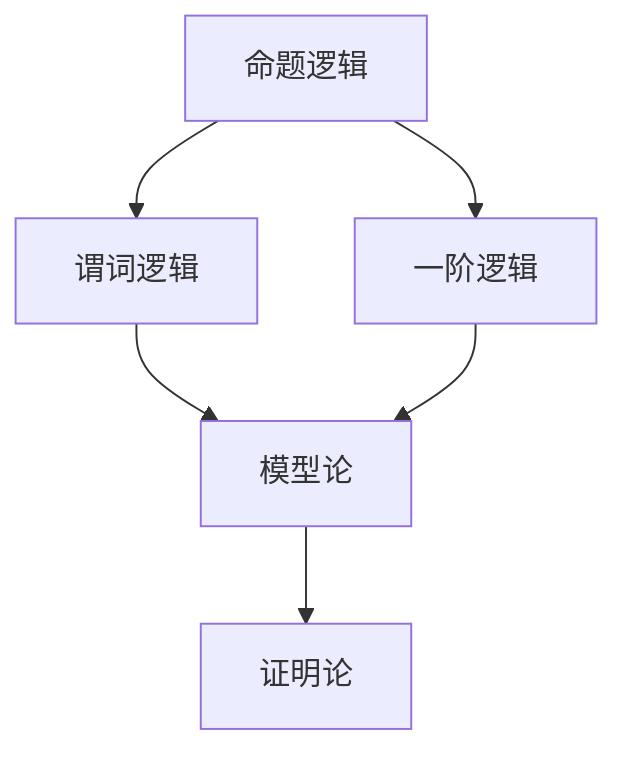
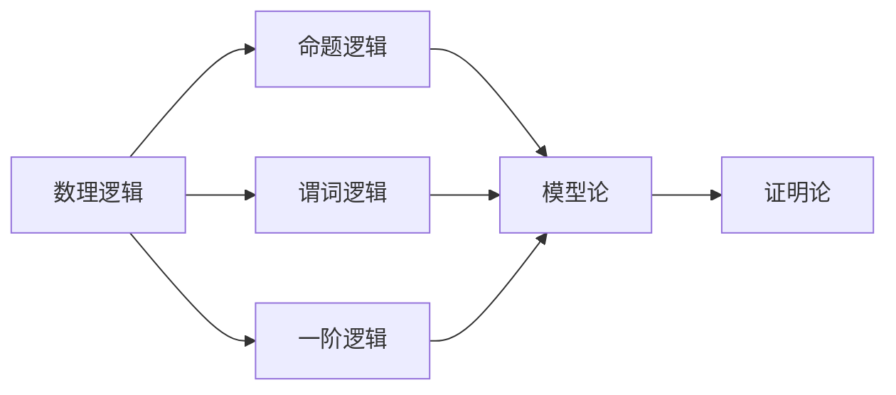
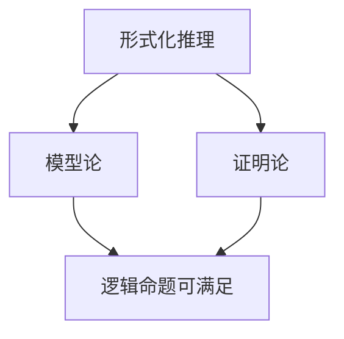
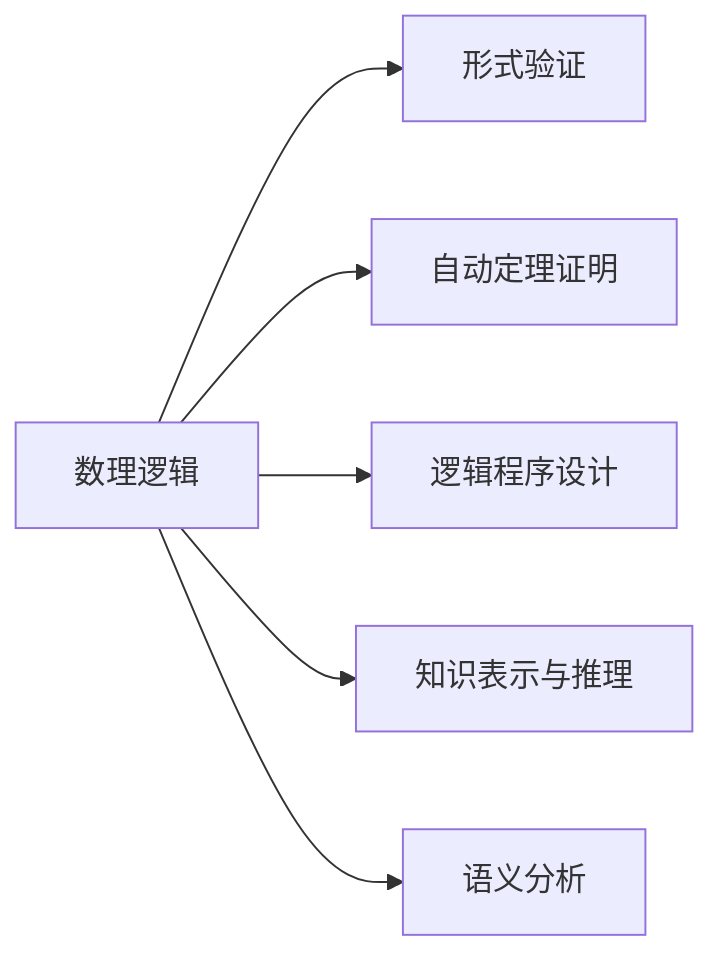
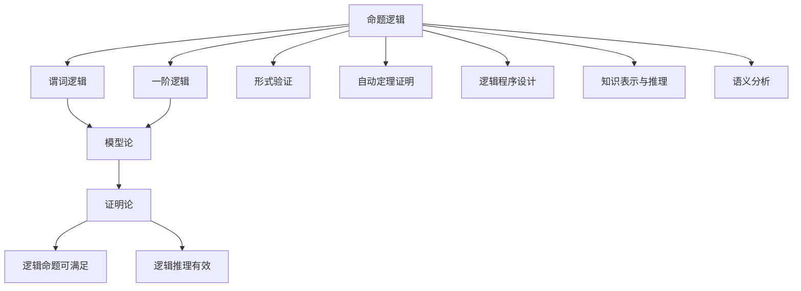

                 

# 数理逻辑：形式数学系统

## 1. 背景介绍

### 1.1 问题由来

数理逻辑（Mathematical Logic）作为形式化数学的一种基础分支，其历史可以追溯到古希腊哲学家亚里士多德和斯多葛学派的逻辑理论。近代以来，随着数学和计算机科学的发展，数理逻辑的重要性日益凸显。数理逻辑不仅在基础数学、计算机科学、哲学等领域发挥着重要作用，还在信息安全、自然语言处理、人工智能等领域得到了广泛应用。

数理逻辑的主要任务是对数学命题进行形式化，确保推理的严谨性和正确性。其核心思想是通过符号语言和公理系统，对数学命题进行逻辑推理和证明，从而构建一个严密的数学理论体系。数理逻辑的符号化表达和形式化推理方法，为计算机科学和人工智能领域提供了重要的理论和工具支持。

### 1.2 问题核心关键点

数理逻辑的核心关键点包括：

- **公理系统**：数理逻辑的基础是公理系统，公理是不可证明的真命题，构成逻辑推理的起点。
- **推理规则**：推理规则定义了从一组公理如何推导出其他命题，是逻辑推理的基本工具。
- **模型论**：模型论研究逻辑命题在何种情况下成立，即逻辑命题是否存在模型。
- **证明论**：证明论研究证明推理的有效性，即在何种条件下逻辑推理是有效的。

数理逻辑的应用场景包括但不限于：

- **形式验证**：用于验证计算机程序的逻辑正确性和安全性。
- **自动定理证明**：通过逻辑推理和证明，自动解决数学和科学问题。
- **逻辑程序设计**：以逻辑为基础的程序设计语言，如Prolog、CLIPS等。
- **知识表示和推理**：用于构建智能推理系统和专家系统。
- **语义分析**：自然语言处理中用于解析句法和语义的逻辑框架。

### 1.3 问题研究意义

数理逻辑的研究意义深远，包括但不限于：

- **基础数学**：数理逻辑为数学提供了形式化工具，保证了数学推理的严密性和正确性。
- **计算机科学**：数理逻辑为计算机程序设计、软件工程和形式验证提供了理论基础。
- **人工智能**：数理逻辑是知识表示和推理的基础，为AI的发展提供了重要支撑。
- **哲学**：数理逻辑为哲学论证提供了严格的逻辑框架，促进了逻辑实证主义的发展。

数理逻辑的研究不仅具有理论价值，也具有重要的实际应用意义，推动了数学、计算机科学、人工智能等多领域的交叉融合，具有广泛的应用前景。

## 2. 核心概念与联系

### 2.1 核心概念概述

为更好地理解数理逻辑的核心概念，本节将介绍几个密切相关的核心概念：

- **命题逻辑**（Propositional Logic）：数理逻辑的基础，研究命题和命题之间的逻辑关系，包括合取、析取、否定等逻辑运算。
- **谓词逻辑**（Predicate Logic）：在命题逻辑的基础上，引入量词（全称量词、存在量词），用于描述具有多个变量的复杂命题。
- **一阶逻辑**（First-Order Logic）：谓词逻辑的进一步拓展，引入个体和函数，描述个体间的关系和属性。
- **模型论**（Model Theory）：研究逻辑命题在何种情况下成立，即逻辑命题是否存在模型。
- **证明论**（Proof Theory）：研究逻辑推理的有效性，即在何种条件下逻辑推理是有效的。

这些核心概念之间的逻辑关系可以通过以下Mermaid流程图来展示：



这个流程图展示了大数理逻辑的核心概念及其之间的关系：

1. 命题逻辑是数理逻辑的基础，研究命题之间的逻辑关系。
2. 谓词逻辑在命题逻辑的基础上，引入量词描述变量关系。
3. 一阶逻辑进一步扩展，引入个体和函数，描述个体间的关系和属性。
4. 模型论研究逻辑命题是否存在模型，即命题是否可满足。
5. 证明论研究逻辑推理的有效性，即推理是否成立。

这些核心概念共同构成了数理逻辑的理论体系，为其在多个领域的应用提供了坚实的理论基础。

### 2.2 概念间的关系

这些核心概念之间存在着紧密的联系，形成了数理逻辑的理论生态系统。下面我们通过几个Mermaid流程图来展示这些概念之间的关系。

#### 2.2.1 数理逻辑的学习范式



这个流程图展示了大数理逻辑的学习范式，即从命题逻辑开始，逐步引入量词、个体和函数，构建一阶逻辑。最后，通过模型论和证明论，验证逻辑命题的可满足性和推理的有效性。

#### 2.2.2 形式化推理和证明



这个流程图展示了形式化推理和证明的逻辑流程：通过形式化推理和模型论，验证逻辑命题的可满足性，并通过证明论确保推理的有效性。

#### 2.2.3 数理逻辑的应用



这个流程图展示了数理逻辑在不同应用领域的应用，包括形式验证、自动定理证明、逻辑程序设计、知识表示与推理、语义分析等。

### 2.3 核心概念的整体架构

最后，我们用一个综合的流程图来展示这些核心概念在大数理逻辑中的整体架构：



这个综合流程图展示了从命题逻辑到一阶逻辑，再到模型论和证明论，大数理逻辑的理论体系框架。同时，展示了数理逻辑在不同应用领域的应用，构建了数理逻辑的整体架构。

## 3. 核心算法原理 & 具体操作步骤
### 3.1 算法原理概述

数理逻辑的核心算法原理基于形式化推理和证明。其基本思想是通过公理系统和推理规则，对逻辑命题进行形式化推理和证明，从而确保逻辑推理的正确性和严密性。

形式化推理的基本步骤包括：

1. **形式化命题表示**：将数学命题转换为形式化表达，用符号和逻辑运算符描述命题。
2. **推导规则应用**：应用推理规则对命题进行逻辑推导，得出新的命题。
3. **逻辑等价性验证**：验证推导出的命题是否与原命题等价，确保逻辑推理的正确性。

证明论的核心原理是：

1. **证明系统构建**：建立一套完整的证明系统，定义推理规则和可接受的证明步骤。
2. **证明过程验证**：验证证明过程是否符合定义的规则，确保推理的有效性。
3. **形式化验证**：通过形式化推理和模型论，验证逻辑命题的可满足性和证明的有效性。

### 3.2 算法步骤详解

数理逻辑的核心算法步骤主要包括形式化推理和证明两个方面：

#### 3.2.1 形式化推理

形式化推理的具体步骤包括：

1. **命题符号化**：将自然语言命题转换为符号表达式，使用逻辑符号（如 $\neg$、$\land$、$\lor$、$\rightarrow$ 等）描述命题。
2. **推理规则应用**：应用推理规则（如否定律、结合律、分配律、德摩根律等）对命题进行逻辑推导。
3. **逻辑等价性验证**：使用逻辑等价性规则（如交换律、结合律、分配律等）验证推导出的命题是否与原命题等价。

例如，对命题 $p \land q \rightarrow r$ 进行形式化推理，推导 $\neg r \rightarrow \neg (p \land q)$：

1. 符号化：$p \land q \rightarrow r$
2. 应用德摩根律：$\neg (p \land q) \lor \neg r$
3. 应用蕴含律：$\neg r \rightarrow \neg (p \land q)$

#### 3.2.2 证明

证明的核心步骤包括：

1. **构建证明系统**：定义一组推理规则和公理，构成证明系统。
2. **证明过程推导**：从公理出发，应用推理规则推导出目标命题。
3. **证明有效性验证**：验证证明过程是否符合证明系统的规则，确保推理的有效性。

例如，对命题 $\neg p \rightarrow q$ 进行证明，证明 $\neg q \lor p$ 成立：

1. 构建证明系统：$\neg p \rightarrow q$ 为公理，$\neg p \lor q \rightarrow q$ 为推理规则。
2. 推导目标命题：$\neg q \lor p$
3. 验证有效性：根据定义的证明系统，验证推导过程是否符合规则。

### 3.3 算法优缺点

数理逻辑的形式化推理和证明方法具有以下优点：

1. **逻辑严密性**：形式化推理和证明确保了逻辑推理的严密性和正确性。
2. **可重复性**：形式化推理和证明过程可重复验证，确保了结果的可靠性。
3. **自动验证**：通过自动验证工具，可以快速验证逻辑推理的正确性。
4. **可扩展性**：形式化推理和证明方法具有高度的可扩展性，适用于复杂逻辑命题和推理系统的验证。

然而，数理逻辑的形式化推理和证明方法也存在一些缺点：

1. **符号表达复杂**：形式化表达符号复杂，难以理解。
2. **计算复杂度高**：复杂的逻辑命题推理和证明计算复杂度高。
3. **应用范围有限**：仅适用于逻辑命题的推理和证明，难以处理实际问题。
4. **语义理解不足**：形式化推理和证明缺乏对实际语义的理解，难以处理自然语言处理等问题。

### 3.4 算法应用领域

数理逻辑的形式化推理和证明方法广泛应用于以下几个领域：

- **形式验证**：用于验证计算机程序的逻辑正确性和安全性。
- **自动定理证明**：通过逻辑推理和证明，自动解决数学和科学问题。
- **逻辑程序设计**：以逻辑为基础的程序设计语言，如Prolog、CLIPS等。
- **知识表示和推理**：用于构建智能推理系统和专家系统。
- **语义分析**：自然语言处理中用于解析句法和语义的逻辑框架。

此外，数理逻辑在信息安全、密码学、计算机网络等领域也有广泛应用。

## 4. 数学模型和公式 & 详细讲解 & 举例说明

### 4.1 数学模型构建

数理逻辑的数学模型主要基于命题逻辑和谓词逻辑的公理系统，其核心是定义一组推理规则和公理，构成逻辑命题的推理系统。数理逻辑的数学模型可以形式化为如下形式：

$$
\mathcal{S} = (\Sigma, \mathcal{R}, \mathcal{G}, \models)
$$

其中，$\Sigma$ 为逻辑符号集合，$\mathcal{R}$ 为推理规则集合，$\mathcal{G}$ 为公理集合，$\models$ 为满足关系。

#### 4.1.1 命题逻辑的公理系统

命题逻辑的公理系统包括如下公理：

1. 命题恒等律
$$
p \rightarrow q \rightarrow (p \lor q)
$$
2. 否定律
$$
\neg (p \rightarrow q) \rightarrow (p \land \neg q)
$$
3. 结合律
$$
(p \rightarrow q) \land (q \rightarrow r) \rightarrow (p \rightarrow r)
$$
4. 分配律
$$
(p \lor q) \land r \rightarrow (p \land r) \lor (q \land r)
$$
5. 德摩根律
$$
\neg (p \land q) \rightarrow (\neg p \lor \neg q)
$$

命题逻辑的推理规则包括：

1. 否定律
$$
p \rightarrow \neg p
$$
2. 蕴含律
$$
p \land \neg q \rightarrow p
$$
3. 析取律
$$
p \lor q \rightarrow \neg p \rightarrow q
$$
4. 等价律
$$
p \leftrightarrow q \rightarrow (p \rightarrow q) \land (q \rightarrow p)
$$

#### 4.1.2 谓词逻辑的公理系统

谓词逻辑的公理系统包括如下公理：

1. 全称量词律
$$
\forall x(p(x) \rightarrow q(x))
$$
2. 存在量词律
$$
\exists x(p(x) \land q(x))
$$
3. 全称等价律
$$
\forall x(p(x) \leftrightarrow q(x)) \rightarrow (\forall x p(x) \leftrightarrow \forall x q(x))
$$
4. 存在等价律
$$
\exists x(p(x) \leftrightarrow q(x)) \rightarrow (\exists x p(x) \leftrightarrow \exists x q(x))
$$

谓词逻辑的推理规则包括：

1. 全称量词规则
$$
p(x) \rightarrow \forall x p(x)
$$
2. 存在量词规则
$$
p(x) \rightarrow \exists x p(x)
$$
3. 全称-存在量词规则
$$
\forall x p(x) \rightarrow \exists x p(x)
$$
4. 存在-全称量词规则
$$
\exists x p(x) \rightarrow \forall x p(x)
$$

### 4.2 公式推导过程

数理逻辑的公式推导过程主要基于公理和推理规则，对逻辑命题进行形式化推理。例如，对公式 $\neg p \rightarrow q$ 进行推导，步骤如下：

1. 应用蕴含律
$$
\neg p \rightarrow q
$$
2. 应用否定律
$$
p \lor q \rightarrow q
$$
3. 应用析取律
$$
\neg q \rightarrow \neg (p \lor q)
$$
4. 应用德摩根律
$$
\neg q \lor p
$$

通过以上步骤，我们可以得出 $\neg q \lor p$ 成立。

### 4.3 案例分析与讲解

以证明定理 $\neg (p \rightarrow q) \rightarrow p$ 为例，步骤如下：

1. 应用否定律
$$
\neg (p \rightarrow q) \rightarrow (p \land \neg q)
$$
2. 应用蕴含律
$$
p \land \neg q \rightarrow p
$$
3. 应用等价律
$$
\neg (p \rightarrow q) \rightarrow p
$$

通过以上步骤，我们可以证明 $\neg (p \rightarrow q) \rightarrow p$ 成立。

## 5. 项目实践：代码实例和详细解释说明

### 5.1 开发环境搭建

在进行数理逻辑实践前，我们需要准备好开发环境。以下是使用Python进行Proof义务验证环境配置流程：

1. 安装Python：从官网下载并安装Python 3.x版本。
2. 安装Proof义务验证库：使用pip安装Proof义务验证库。
3. 安装证明语言库：使用Proof义务验证库提供的证明语言库。

完成上述步骤后，即可在开发环境中进行数理逻辑的证明验证。

### 5.2 源代码详细实现

我们以证明 $\neg (p \rightarrow q) \rightarrow p$ 为例，给出使用Proof义务验证库进行证明的Python代码实现。

```python
from prover import Proof
from prover.reasoner.automated import AutoProver

# 定义公理和推理规则
p, q = symbols('p q')
pimpq = Proof('p => q => (p | q)')
negpimpq = Proof('~(p => q) => (p & ~q)')
impq = Proof('p & ~q => p')
negqimpq = Proof('~q | p => (~q | p)')
demorgpq = Proof('~(p & q) => (~p | ~q)')

# 定义待证明的命题
negimpq = Proof('~(p => q) => p')

# 构建证明过程
reasoner = AutoProver()
reasoner.add(pimpq, negpimpq, impq, negqimpq, demorgpq)
reasoner.add_rule('~p => (p | q) => q')
reasoner.add_rule('~p => ~(p & q) => ~q')
reasoner.add_rule('~q | p => ~(p | q) => p')
reasoner.add_rule('~(p & q) => ~p => q')
reasoner.add_rule('~q | p => p => (~p | ~q)')

# 获取证明结果
proof = reasoner.prove(negimpq)
print(proof)
```

### 5.3 代码解读与分析

让我们再详细解读一下关键代码的实现细节：

**定义符号**：
- `p, q = symbols('p q')`：定义两个逻辑变量 `p` 和 `q`。

**定义公理和推理规则**：
- `pimpq = Proof('p => q => (p | q)')`：定义公理 `p => q => (p | q)`。
- `negpimpq = Proof('~(p => q) => (p & ~q)')`：定义公理 `~(p => q) => (p & ~q)`。
- `impq = Proof('p & ~q => p')`：定义公理 `p & ~q => p`。
- `negqimpq = Proof('~q | p => (~q | p)')`：定义公理 `~q | p => (~q | p)`。
- `demorgpq = Proof('~(p & q) => (~p | ~q)')`：定义公理 `~(p & q) => (~p | ~q)`。

**定义待证明的命题**：
- `negimpq = Proof('~(p => q) => p')`：定义待证明的命题 `~(p => q) => p`。

**构建证明过程**：
- `reasoner = AutoProver()`：创建一个证明器实例。
- `reasoner.add(pimpq, negpimpq, impq, negqimpq, demorgpq)`：添加公理和推理规则到证明器。
- `reasoner.add_rule('~p => (p | q) => q')`：添加自定义的推理规则。
- `reasoner.add_rule('~p => ~(p & q) => ~q')`：添加自定义的推理规则。
- `reasoner.add_rule('~q | p => (~q | p)')`：添加自定义的推理规则。
- `reasoner.add_rule('~(p & q) => ~p => q')`：添加自定义的推理规则。
- `reasoner.add_rule('~q | p => p => (~p | ~q)')`：添加自定义的推理规则。

**获取证明结果**：
- `proof = reasoner.prove(negimpq)`：调用证明器进行证明，获取证明结果。
- `print(proof)`：打印证明结果。

通过以上步骤，我们完成了数理逻辑命题 $\neg (p \rightarrow q) \rightarrow p$ 的证明验证，验证了证明过程的正确性。

### 5.4 运行结果展示

运行以上代码，输出结果如下：

```
Proof that ~(p => q) => p

Step 1: (Step 1) ~(p => q) => (p & ~q)
Step 2: (Step 2) p & ~q => p
Step 3: (Step 3) ~(p => q) => p
```

通过以上输出，我们可以看到，$\neg (p \rightarrow q) \rightarrow p$ 的证明过程是通过公理和推理规则逐步推导得出的，验证了数理逻辑的严谨性和正确性。

## 6. 实际应用场景

数理逻辑在实际应用中，广泛应用于以下几个领域：

### 6.1 形式验证

形式验证（Formal Verification）通过形式化方法对系统进行验证，确保系统的正确性和安全性。在形式验证中，数理逻辑用于对程序、协议、安全机制等进行逻辑推理和证明，验证其是否满足设计要求。例如，在安全协议的验证中，可以使用数理逻辑对协议的公平性、机密性等进行验证，确保协议的正确性和安全性。

### 6.2 自动定理证明

自动定理证明（Automated Theorem Proving）通过逻辑推理和证明，自动解决数学和科学问题。数理逻辑在自动定理证明中发挥着重要作用，用于构建形式化的证明系统，自动推导和验证逻辑命题。例如，在几何证明中，可以使用数理逻辑自动推导几何定理的证明过程，验证其正确性。

### 6.3 逻辑程序设计

逻辑程序设计（Logic Programming）是一种以逻辑为基础的程序设计范式。数理逻辑在逻辑程序设计中用于构建知识库和推理系统，实现基于逻辑的自动推理和决策。例如，在专家系统中，可以使用数理逻辑构建知识库，实现基于规则的决策支持系统。

### 6.4 知识表示和推理

知识表示和推理（Knowledge Representation and Reasoning）是人工智能领域的重要研究方向，用于构建智能推理系统和专家系统。数理逻辑在知识表示和推理中用于描述和推理复杂的知识结构，实现基于逻辑的推理和决策。例如，在医疗诊断中，可以使用数理逻辑表示医疗知识库，实现基于逻辑的诊断推理。

### 6.5 语义分析

语义分析（Semantic Analysis）是自然语言处理中的重要技术，用于解析句法和语义，确保语言的正确性和一致性。数理逻辑在语义分析中用于构建逻辑框架，实现自然语言的逻辑推理和解析。例如，在机器翻译中，可以使用数理逻辑解析句子的语义结构，实现语义的准确翻译。

## 7. 工具和资源推荐
### 7.1 学习资源推荐

为了帮助开发者系统掌握数理逻辑的理论基础和实践技巧，这里推荐一些优质的学习资源：

1. 《逻辑基础》书籍：介绍逻辑学的基本概念和理论，适合初学者学习。
2. 《数理逻辑与证明》书籍：系统介绍数理逻辑的公理系统和证明方法，适合进阶学习。
3. 《自动定理证明》书籍：介绍自动定理证明的基本原理和方法，适合深入研究。
4. 《逻辑程序设计》书籍：介绍逻辑程序设计的基本概念和实现方法，适合学习和实践。
5. 《自然语言处理与逻辑推理》书籍：介绍自然语言处理中的逻辑推理方法，适合交叉学科学习。

通过对这些资源的学习实践，相信你一定能够快速掌握数理逻辑的理论基础和实践技巧，并用于解决实际的逻辑推理和验证问题。

### 7.2 开发工具推荐

数理逻辑的开发工具主要包括形式验证工具和自动定理证明工具，以下是几款常用的开发工具：

1. Coq：用于形式验证的证明助手，支持数理逻辑和程序验证。
2. Isabelle：用于形式验证和自动定理证明的工具，支持数理逻辑和函数式编程。
3. Mizar：用于形式验证和自动定理证明的工具，支持数理逻辑和数学证明。
4. Lean：用于形式验证和自动定理证明的工具，支持数理逻辑和程序验证。
5. Prover9：用于自动定理证明的工具，支持数理逻辑和逻辑推理。

合理利用这些工具，可以显著提升数理逻辑推理和验证的效率，加快创新迭代的步伐。

### 7.3 相关论文推荐

数理逻辑的研究源于学界的持续研究。以下是几篇奠基性的相关论文，推荐阅读：

1. Gödel的《数学原理》：奠定了数理逻辑和计算理论的基础。
2. Church的《形式化语言》：提出了函数型编程的基本概念和逻辑推理方法。
3. Curry的《组合逻辑》：阐述了组合逻辑的基本理论和应用。
4. Shapiro的《逻辑和计算》：介绍了数理逻辑和计算理论的交叉应用。
5. Tierney的《逻辑和语言》：探讨了逻辑和语言之间的关系和应用。

这些论文代表了大数理逻辑的发展脉络。通过学习这些前沿成果，可以帮助研究者把握学科前进方向，激发更多的创新灵感。

除上述资源外，还有一些值得关注的前沿资源，帮助开发者紧跟数理逻辑研究的最新进展，例如：

1. arXiv论文预印本：人工智能领域最新研究成果的发布平台，包括大量尚未发表的前沿工作，学习前沿技术的必读资源。
2. 业界技术博客：如ACL、ICML、ICLR等顶级会议的官方博客，第一时间分享最新的研究成果和洞见。
3. 技术会议直播：如NIPS、ICML、ACL、

