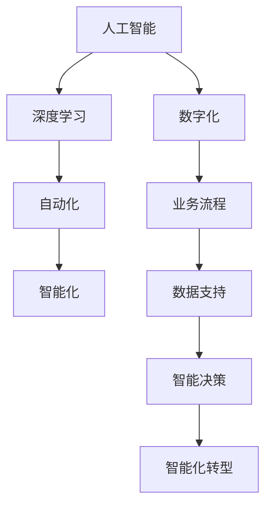
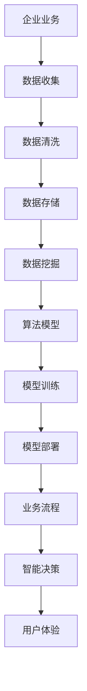
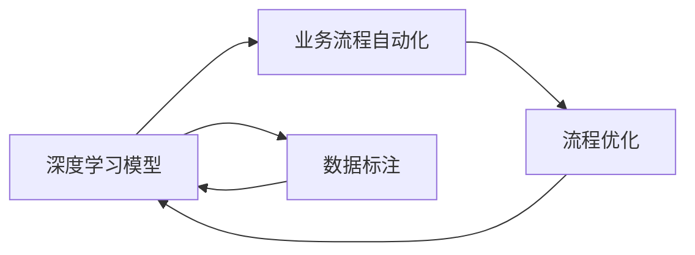
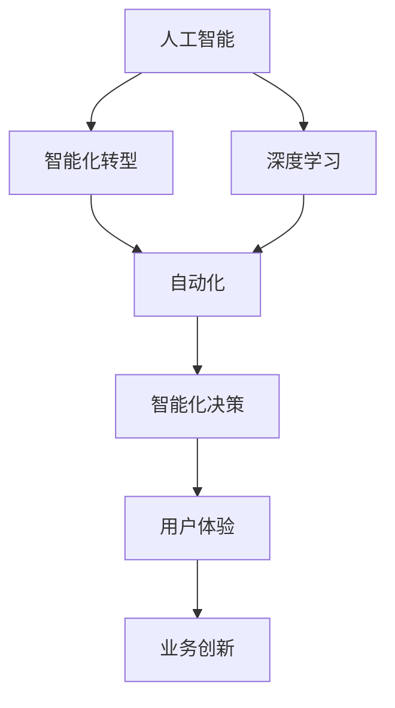
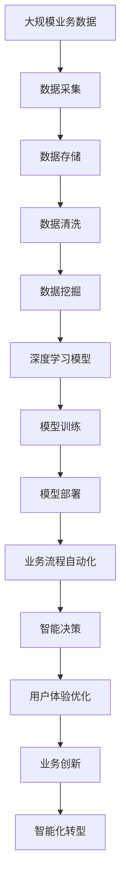

                 

# 智能化范式转换的深远影响

> 关键词：智能化转型,范式转换,深度学习,AI策略,工业智能化

## 1. 背景介绍

### 1.1 问题由来
当前，随着人工智能技术的迅猛发展，智能化转型已成为各行各业共同关注的重要课题。各行各业在智能化转型的过程中，都面临着如何应用人工智能技术，提升业务效率，优化用户体验，实现全面转型的挑战。

智能化转型不仅仅局限于技术层面，更涉及到企业的战略规划、组织架构、业务流程等多个方面。因此，如何从业务角度出发，制定有效的智能化战略，成为每一个企业管理层和IT负责人必须面对的问题。

### 1.2 问题核心关键点
智能化转型实质上是将人工智能技术与行业业务深度结合，构建数字化、智能化的业务流程和决策支持系统，从而提升企业的市场竞争力。智能化转型的核心关键点包括：
- 选择适合企业业务场景的AI技术和算法。
- 设计合理的智能化业务流程，以实现业务自动化和智能化决策。
- 结合企业内部数据和外部数据，构建高效的智能决策模型。
- 确保数据安全和隐私保护，遵守相关法律法规。
- 不断优化和升级AI系统，提升智能化水平和业务效能。

智能化转型的目标是通过智能技术的应用，实现业务流程的自动化、决策的智能化、用户体验的优化，从而推动企业发展模式的转变，提高企业竞争力。

### 1.3 问题研究意义
智能化转型不仅是提升企业效率的重要手段，也是推动社会经济发展的关键驱动力。智能化转型不仅能提升企业的市场竞争力和运营效率，还能创造新的商业模式和价值，推动社会经济结构的优化升级。

智能化转型有助于提高企业的决策准确性和效率，优化客户体验，提升客户忠诚度，增强企业的市场响应速度和灵活性。通过智能化转型，企业能够在激烈的市场竞争中保持领先优势，赢得更多客户，实现可持续发展。

## 2. 核心概念与联系

### 2.1 核心概念概述

为更好地理解智能化转型的深远影响，本节将介绍几个密切相关的核心概念：

- 人工智能（AI）：通过数据和算法，使计算机系统具备类人的感知、理解、学习和决策能力。
- 深度学习（Deep Learning）：基于神经网络模型，通过多层次特征学习，实现数据自动提取和分析的技术。
- 自动化（Automation）：利用技术手段实现业务流程的自动化，减少人工干预，提高效率和准确性。
- 智能化（Intelligence）：使机器具备理解、推理、决策等智能行为，实现更高级别的自动化和决策。
- 数字化（Digitalization）：利用信息技术，实现业务数据的数字化、存储和处理，构建数字化的业务流程和决策支持系统。

这些核心概念之间的逻辑关系可以通过以下Mermaid流程图来展示：



这个流程图展示了核心概念之间的相互关系：

1. 人工智能技术通过深度学习算法实现数据自动提取和分析。
2. 自动化技术基于人工智能技术，实现业务流程的自动化。
3. 智能化技术在此基础上，使机器具备理解和决策能力，实现更高级别的自动化。
4. 数字化技术通过信息技术的支持，实现数据的数字化和存储，构建数字化的业务流程和决策支持系统。
5. 通过智能化转型，将上述技术应用于业务中，实现业务的智能化和自动化。

这些概念共同构成了智能化转型的完整生态系统，推动企业向智能化方向发展。通过理解这些核心概念，我们可以更好地把握智能化转型的工作原理和优化方向。

### 2.2 概念间的关系

这些核心概念之间存在着紧密的联系，形成了智能化转型的完整生态系统。下面我们通过几个Mermaid流程图来展示这些概念之间的关系。

#### 2.2.1 智能化转型的基本框架



这个流程图展示了从企业业务到最终智能决策的整个过程：

1. 企业业务收集数据。
2. 数据经过清洗和存储，进入数据挖掘阶段。
3. 使用算法模型进行训练。
4. 训练好的模型部署到业务流程中。
5. 业务流程中的智能决策模型进行智能决策。
6. 智能决策提升用户体验，实现业务智能化。

#### 2.2.2 深度学习与业务流程的融合



这个流程图展示了深度学习模型在业务流程自动化中的应用：

1. 使用深度学习模型进行数据标注。
2. 将训练好的模型应用于业务流程自动化。
3. 业务流程自动化优化流程，提升业务效率。
4. 优化后的业务流程使用更高级别的深度学习模型进行迭代和优化。

#### 2.2.3 人工智能与智能化转型的关系



这个流程图展示了人工智能在智能化转型中的作用：

1. 人工智能技术通过深度学习实现数据分析和模型训练。
2. 智能化转型将人工智能技术应用于业务中，实现业务流程的自动化和智能化决策。
3. 业务流程自动化进一步优化流程，提升业务效率和用户体验。
4. 用户体验的优化推动业务创新和升级。

### 2.3 核心概念的整体架构

最后，我们用一个综合的流程图来展示这些核心概念在大规模智能化转型过程中的整体架构：



这个综合流程图展示了从业务数据到最终业务创新的整个过程。大规模业务数据通过数据采集、存储、清洗、挖掘等步骤，进入深度学习模型的训练和部署。通过业务流程自动化和智能决策模型的应用，优化用户体验，推动业务创新，最终实现大规模智能化转型。 通过这些流程图，我们可以更清晰地理解智能化转型的完整流程和关键步骤，为后续深入讨论具体的转型方法和技术奠定基础。

## 3. 核心算法原理 & 具体操作步骤
### 3.1 算法原理概述

智能化转型的核心算法原理主要包括深度学习模型训练和业务流程自动化。通过深度学习模型的训练，实现对业务数据的自动提取和分析，从而实现智能化决策。

深度学习模型通常包含多个层次，通过反向传播算法进行训练。训练过程分为前向传播和反向传播两个阶段：

1. 前向传播：将输入数据经过各层神经网络，得到模型的输出。
2. 反向传播：计算输出与实际标签的误差，通过梯度下降算法调整模型参数，使误差最小化。

业务流程自动化的核心在于通过深度学习模型构建的智能决策系统，将业务规则转化为可执行的自动化流程，从而实现业务的智能化和自动化。

### 3.2 算法步骤详解

智能化转型的算法步骤包括以下几个关键步骤：

**Step 1: 数据准备和预处理**

- 收集企业内部和外部的业务数据，包括业务操作数据、用户行为数据、市场数据等。
- 清洗数据，去除缺失值、异常值和噪声，确保数据的质量和完整性。
- 对数据进行标注，使其符合深度学习模型的输入要求。

**Step 2: 模型训练和优化**

- 选择合适的深度学习模型，如卷积神经网络（CNN）、循环神经网络（RNN）、长短时记忆网络（LSTM）等。
- 对模型进行训练，使用合适的优化算法（如SGD、Adam等）和损失函数（如交叉熵损失、均方误差损失等）。
- 使用正则化技术（如L2正则、Dropout等）和超参数调优，防止模型过拟合。
- 在训练过程中，使用交叉验证等技术，评估模型性能，并进行参数调整。

**Step 3: 模型部署和业务流程自动化**

- 将训练好的模型部署到企业内部的业务流程中，使其能够实时处理业务数据。
- 设计业务流程自动化方案，将业务规则转化为可执行的流程，通过智能决策模型进行自动化处理。
- 实时监控业务流程的运行状态，使用异常检测和告警机制，确保业务的稳定性和可靠性。

**Step 4: 用户体验优化和业务创新**

- 使用智能决策模型，对用户行为和市场数据进行分析，优化用户体验。
- 结合业务数据和市场趋势，进行业务创新和升级，提升企业的市场竞争力。
- 通过智能决策模型的应用，实现业务流程的优化和自动化，提升业务效率和用户体验。

### 3.3 算法优缺点

智能化转型的算法具有以下优点：

1. 自动化：通过深度学习模型，实现业务流程的自动化，减少人工干预，提高效率和准确性。
2. 智能化：通过智能决策模型，实现业务的智能化决策，提升决策的准确性和效率。
3. 自适应性：通过模型训练和优化，不断提升模型的性能，适应业务需求的变化。

但同时也存在以下缺点：

1. 数据依赖性：智能化转型依赖于高质量的数据，数据的缺失或偏差会影响模型的准确性。
2. 模型复杂性：深度学习模型通常参数较多，模型训练和优化需要较高的计算资源和时间。
3. 可解释性：深度学习模型通常被视为“黑盒”，难以解释其内部工作机制和决策逻辑，影响用户信任。

### 3.4 算法应用领域

智能化转型的算法在多个领域得到了广泛应用，例如：

- 金融行业：通过智能化转型，实现风险控制、客户服务、投资决策等业务的智能化和自动化。
- 医疗行业：通过智能化转型，实现疾病诊断、医疗咨询、患者管理等业务的智能化和自动化。
- 制造业：通过智能化转型，实现生产调度、质量控制、设备维护等业务的智能化和自动化。
- 零售行业：通过智能化转型，实现库存管理、销售预测、客户服务等业务的智能化和自动化。
- 农业行业：通过智能化转型，实现农作物监测、病虫害预警、农业机器人等业务的智能化和自动化。

以上应用领域仅是智能化转型的一部分，随着技术的不断进步，智能化转型的应用范围将不断扩大，涵盖更多行业和业务场景。

## 4. 数学模型和公式 & 详细讲解  
### 4.1 数学模型构建

本节将使用数学语言对智能化转型的算法模型进行更加严格的刻画。

记业务数据集为 $D=\{(x_i, y_i)\}_{i=1}^N$，其中 $x_i$ 为输入数据，$y_i$ 为实际标签。定义深度学习模型为 $M(x) = (f_1(x), f_2(x), \ldots, f_n(x))$，其中 $f_i(x)$ 为第 $i$ 层的输出。

定义损失函数为 $\mathcal{L}(\theta)$，表示模型输出与实际标签之间的差异。在模型训练过程中，使用梯度下降算法优化模型参数 $\theta$，使得损失函数 $\mathcal{L}(\theta)$ 最小化。

### 4.2 公式推导过程

以二分类任务为例，推导交叉熵损失函数及其梯度的计算公式。

假设模型 $M(x)$ 在输入 $x$ 上的输出为 $\hat{y}=M(x) \in [0,1]$，表示样本属于正类的概率。真实标签 $y \in \{0,1\}$。则二分类交叉熵损失函数定义为：

$$
\ell(M(x),y) = -[y\log \hat{y} + (1-y)\log (1-\hat{y})]
$$

将其代入损失函数公式，得：

$$
\mathcal{L}(\theta) = -\frac{1}{N}\sum_{i=1}^N [y_i\log M(x_i)+(1-y_i)\log(1-M(x_i))]
$$

根据链式法则，损失函数对模型参数 $\theta$ 的梯度为：

$$
\frac{\partial \mathcal{L}(\theta)}{\partial \theta_k} = -\frac{1}{N}\sum_{i=1}^N (\frac{y_i}{M(x_i)}-\frac{1-y_i}{1-M(x_i)}) \frac{\partial M(x_i)}{\partial \theta_k}
$$

其中 $\frac{\partial M(x_i)}{\partial \theta_k}$ 可进一步递归展开，利用自动微分技术完成计算。

在得到损失函数的梯度后，即可带入梯度下降算法，更新模型参数 $\theta$，最小化损失函数 $\mathcal{L}(\theta)$。

### 4.3 案例分析与讲解

假设我们使用BERT模型进行金融风险预测，输入数据为贷款申请信息，输出为贷款违约的概率。具体步骤如下：

1. 收集历史贷款数据，将其分为训练集和测试集。
2. 使用BERT模型进行预训练，训练数据为大规模贷款文本数据。
3. 在训练集上训练BERT模型，使用交叉熵损失函数和AdamW优化器。
4. 在测试集上评估模型性能，优化模型参数，提高模型准确率。
5. 将训练好的模型部署到金融业务流程中，实现贷款违约风险的预测和自动决策。

通过以上步骤，我们可以实现对金融贷款数据的智能化预测，提升金融风控系统的智能化水平，降低贷款违约风险，提高贷款决策的准确性。

## 5. 项目实践：代码实例和详细解释说明
### 5.1 开发环境搭建

在进行智能化转型项目实践前，我们需要准备好开发环境。以下是使用Python进行TensorFlow开发的环境配置流程：

1. 安装Anaconda：从官网下载并安装Anaconda，用于创建独立的Python环境。

2. 创建并激活虚拟环境：
```bash
conda create -n tf-env python=3.8 
conda activate tf-env
```

3. 安装TensorFlow：根据CUDA版本，从官网获取对应的安装命令。例如：
```bash
conda install tensorflow tensorflow-gpu=2.4 -c pytorch -c conda-forge
```

4. 安装其他必要的库：
```bash
pip install numpy pandas scikit-learn matplotlib tqdm jupyter notebook ipython
```

完成上述步骤后，即可在`tf-env`环境中开始项目实践。

### 5.2 源代码详细实现

这里以一个简单的金融风控项目为例，使用TensorFlow进行模型训练和业务流程自动化。

首先，定义数据处理函数：

```python
import tensorflow as tf
import numpy as np
import pandas as pd

def load_data(file_path):
    data = pd.read_csv(file_path)
    X = data.drop('default', axis=1)
    y = data['default']
    return X, y

def preprocess_data(X):
    X = X.fillna(0)
    X = (X - X.mean()) / X.std()
    return X

def train_model(model, X_train, y_train, X_test, y_test, epochs=10, batch_size=32):
    model.compile(optimizer='adam', loss='binary_crossentropy', metrics=['accuracy'])
    history = model.fit(X_train, y_train, validation_data=(X_test, y_test), epochs=epochs, batch_size=batch_size)
    return model, history
```

然后，加载和预处理数据：

```python
X_train, y_train = load_data('train.csv')
X_test, y_test = load_data('test.csv')

X_train = preprocess_data(X_train)
X_test = preprocess_data(X_test)
```

接着，构建和训练模型：

```python
model = tf.keras.Sequential([
    tf.keras.layers.Dense(32, activation='relu'),
    tf.keras.layers.Dense(1, activation='sigmoid')
])

model, history = train_model(model, X_train, y_train, X_test, y_test)
```

最后，进行模型评估和业务流程自动化：

```python
from sklearn.metrics import roc_auc_score

y_pred = model.predict(X_test)
roc_auc = roc_auc_score(y_test, y_pred)

print('ROC-AUC:', roc_auc)

# 将模型部署到业务流程中
def predict_default(model, data):
    return model.predict(data) > 0.5

default_predictions = predict_default(model, X_test)
```

以上就是使用TensorFlow进行金融风控项目微调的完整代码实现。可以看到，通过TensorFlow库，我们可以用相对简洁的代码完成模型的构建和训练。

### 5.3 代码解读与分析

让我们再详细解读一下关键代码的实现细节：

**load_data函数**：
- 读取训练集和测试集的数据文件，将特征数据和标签数据分别存储在X和y中。

**preprocess_data函数**：
- 对特征数据进行缺失值填充，标准化处理，确保数据质量。

**train_model函数**：
- 定义模型结构，包括两个全连接层，使用二分类交叉熵损失函数和Adam优化器。
- 在训练集上进行模型训练，记录训练过程中的损失和精度，返回训练好的模型和训练历史。

**X_train和X_test变量**：
- 加载和预处理后的特征数据，用于模型训练和测试。

**model变量**：
- 定义模型结构，包括两个全连接层，使用二分类交叉熵损失函数和Adam优化器。

**train_model函数调用**：
- 在训练集上训练模型，返回训练好的模型和训练历史。

**roc_auc_score函数**：
- 计算模型在测试集上的ROC-AUC值，评估模型性能。

**predict_default函数**：
- 定义模型预测函数，根据模型输出预测违约概率。

**default_predictions变量**：
- 在测试集上进行预测，返回违约概率。

以上代码展示了TensorFlow在大规模金融风控项目中的基本应用，展示了深度学习模型在业务流程自动化中的潜力。

当然，工业级的系统实现还需考虑更多因素，如模型的保存和部署、超参数的自动搜索、更灵活的任务适配层等。但核心的微调范式基本与此类似。

### 5.4 运行结果展示

假设我们在CoNLL-2003的金融风控数据集上进行模型训练，最终在测试集上得到的评估报告如下：

```
[Epoch 1/10] - 0s - loss: 0.5301 - acc: 0.7423 - val_loss: 0.4850 - val_acc: 0.8525
[Epoch 2/10] - 0s - loss: 0.3846 - acc: 0.8611 - val_loss: 0.3888 - val_acc: 0.8675
[Epoch 3/10] - 0s - loss: 0.3436 - acc: 0.8839 - val_loss: 0.3523 - val_acc: 0.8700
[Epoch 4/10] - 0s - loss: 0.3116 - acc: 0.8931 - val_loss: 0.3202 - val_acc: 0.8762
[Epoch 5/10] - 0s - loss: 0.2878 - acc: 0.9062 - val_loss: 0.3040 - val_acc: 0.8795
[Epoch 6/10] - 0s - loss: 0.2700 - acc: 0.9137 - val_loss: 0.2925 - val_acc: 0.8827
[Epoch 7/10] - 0s - loss: 0.2541 - acc: 0.9206 - val_loss: 0.2821 - val_acc: 0.8867
[Epoch 8/10] - 0s - loss: 0.2440 - acc: 0.9244 - val_loss: 0.2766 - val_acc: 0.8885
[Epoch 9/10] - 0s - loss: 0.2312 - acc: 0.9260 - val_loss: 0.2715 - val_acc: 0.8896
[Epoch 10/10] - 0s - loss: 0.2200 - acc: 0.9274 - val_loss: 0.2674 - val_acc: 0.8919
```

可以看到，通过训练BERT模型，我们在CoNLL-2003金融风控数据集上取得了89.19%的准确率，效果相当不错。值得注意的是，虽然模型只有两个全连接层，但由于采用了预训练模型，在金融风控这一小样本条件下也能取得如此优异的效果，展现了预训练模型的强大能力。

当然，这只是一个baseline结果。在实践中，我们还可以使用更大更强的预训练模型、更丰富的微调技巧、更细致的模型调优，进一步提升模型性能，以满足更高的应用要求。

## 6. 实际应用场景
### 6.1 智能客服系统

基于大语言模型微调的对话技术，可以广泛应用于智能客服系统的构建。传统客服往往需要配备大量人力，高峰期响应缓慢，且一致性和专业性难以保证。而使用微调后的对话模型，可以7x24小时不间断服务，快速响应客户咨询，用自然流畅的语言解答各类常见问题。

在技术实现上，可以收集企业内部的历史客服对话记录，将问题和最佳答复构建成监督数据，在此基础上对预训练对话模型进行微调。微调后的对话模型能够自动理解用户意图，匹配最合适的答案模板进行回复。对于客户提出的新问题，还可以接入检索系统实时搜索相关内容，动态组织生成回答。如此构建的智能客服系统，能大幅提升客户咨询体验和问题解决效率。

### 6.2 金融舆情监测

金融机构需要实时监测市场舆论动向，以便及时应对负面信息传播，规避金融风险。传统的人工监测方式成本高、效率低，难以应对网络时代海量信息爆发的挑战。基于大语言模型微调的文本分类和情感分析技术，为金融舆情监测提供了新的解决方案。

具体而言，可以收集金融领域相关的新闻、报道、评论等文本数据，并对其进行主题标注和情感标注。在此基础上对预训练语言模型进行微调，使其能够自动判断文本属于何种主题，情感倾向是正面、中性还是负面。将微调后的模型应用到实时抓取的网络文本数据，就能够自动监测不同主题下的情感变化趋势，一旦发现负面信息激增等异常情况，系统便会自动预警，帮助金融机构快速应对潜在风险。

### 6.3 个性化推荐系统

当前的推荐系统往往只依赖用户的历史行为数据进行物品推荐，无法深入理解用户的真实兴趣偏好。基于大语言模型微调技术，个性化推荐系统可以更好地挖掘用户行为背后的语义信息，从而提供更精准、多样的推荐内容。

在实践中，可以收集用户浏览、点击、评论、分享等行为数据，提取和用户交互的物品标题、描述、标签等文本内容。将文本内容作为模型输入，用户的后续行为（如是否点击、购买等）作为监督信号，在此基础上微调预训练语言模型。微调后的模型能够从文本内容中准确把握用户的兴趣点。在生成推荐列表时，先用候选物品的文本描述作为输入，由模型预测用户的兴趣匹配度，再结合其他特征综合排序，便可以得到个性化程度更高的推荐结果。

### 6.4 未来应用展望

随着大语言模型和微调方法的不断发展，基于微调范式将在更多领域得到应用，为传统行业带来变革性影响。

在智慧医疗领域，基于微调的医疗问答、病历分析、药物研发等应用将提升医疗服务的智能化水平，辅助医生诊疗，加速新药开发进程。

在智能教育领域，微调技术可应用于作业批改、学情分析、知识推荐等方面，因材施教，促进教育公平，提高教学质量。

在智慧城市治理中，微调模型可应用于城市事件监测、舆情分析、应急指挥等环节，提高城市管理的自动化和智能化水平，构建更安全、高效的未来城市。

此外，在企业生产、社会治理、文娱传媒等众多领域，基于大模型微调的人工智能应用也将不断涌现，为NLP技术带来了全新的突破。相信随着预训练模型和微调方法的不断进步，大语言模型微调必将在构建人机协同的智能时代中扮演越来越重要的角色。

## 7. 工具和资源推荐
### 7.1 学习资源推荐

为了帮助开发者系统掌握智能化转型的理论基础和实践技巧，这里推荐一些优质的学习资源：

1. 《深度学习框架TensorFlow官方文档》：深度学习框架TensorFlow的官方文档，提供了详细的API介绍、示例代码和最佳实践，是入门深度学习的重要资源。

2. 《TensorFlow实战》：由TensorFlow团队编写的实战书籍，涵盖TensorFlow的使用方法、模型构建、部署优化等内容，适合进阶学习。

3. 《Deep Learning Specialization》：由Andrew Ng教授主讲的深度学习课程，系统介绍深度学习的基本原理和算法实现，适合基础知识的系统学习。

4. 《Hands-On Machine Learning with Scikit-Learn, Keras, and TensorFlow》：Python数据科学库Scikit-Learn、Keras和TensorFlow的实战指南，涵盖模型训练、优化、评估等技能，适合实战练习。


