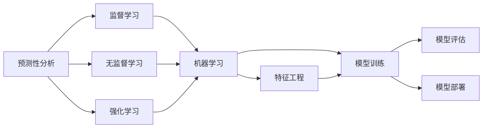
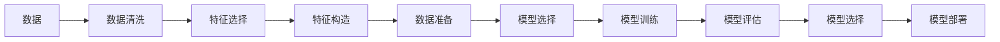
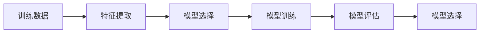
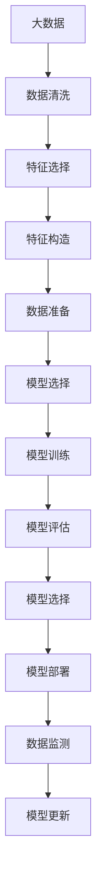

                 

# 机器学习在预测性分析中的应用

## 1. 背景介绍

### 1.1 问题由来
在数据驱动的时代，预测性分析（Predictive Analytics）已经成为了企业决策和业务优化的重要工具。预测性分析通过分析历史数据和已知因素，来预测未来趋势和行为，帮助企业更有效地制定策略和计划。预测性分析的核心在于机器学习算法，这些算法能够从大量数据中学习模式，并做出准确的预测。

预测性分析的应用场景非常广泛，涵盖金融、零售、医疗、制造等多个行业。例如，金融行业可以利用预测性分析来预测股票价格、风险评估等；零售行业可以预测客户购买行为、库存需求等；医疗行业可以预测疾病爆发、患者健康状况等。

### 1.2 问题核心关键点
预测性分析的核心在于使用机器学习模型对历史数据进行学习和预测。预测性分析的主要步骤包括数据预处理、特征工程、模型训练、模型评估和模型部署。其中，选择合适的模型和算法是预测性分析成功的关键。

## 2. 核心概念与联系

### 2.1 核心概念概述

为了更好地理解机器学习在预测性分析中的应用，本节将介绍几个密切相关的核心概念：

- 预测性分析（Predictive Analytics）：通过历史数据和已知因素来预测未来趋势和行为。预测性分析的核心是机器学习模型。
- 监督学习（Supervised Learning）：利用有标签的训练数据，训练机器学习模型来预测未知数据。
- 无监督学习（Unsupervised Learning）：利用无标签的训练数据，发现数据中的结构和模式。
- 强化学习（Reinforcement Learning）：通过与环境交互，让模型学习最优的决策策略。
- 机器学习（Machine Learning）：利用算法和模型，从数据中学习规律和知识，并进行预测或决策。
- 特征工程（Feature Engineering）：选择和构造对预测结果有帮助的数据特征，提高模型的预测能力。
- 模型训练（Model Training）：利用训练数据，调整模型参数，使其能够最好地预测未知数据。
- 模型评估（Model Evaluation）：使用测试数据来评估模型的性能，选择最优的模型。
- 模型部署（Model Deployment）：将训练好的模型应用于实际业务中，进行预测或决策。

这些核心概念之间的逻辑关系可以通过以下Mermaid流程图来展示：



这个流程图展示了预测性分析的主要步骤：

1. 使用监督学习、无监督学习和强化学习，学习数据中的规律和模式。
2. 通过特征工程，选择和构造有用的数据特征。
3. 使用机器学习模型，对数据进行训练，生成预测模型。
4. 对训练好的模型进行评估，选择最优的模型。
5. 将模型部署到实际业务中，进行预测或决策。

### 2.2 概念间的关系

这些核心概念之间存在着紧密的联系，形成了预测性分析的完整生态系统。下面我们通过几个Mermaid流程图来展示这些概念之间的关系。

#### 2.2.1 预测性分析的流程图



这个流程图展示了从数据准备到模型部署的完整流程。

#### 2.2.2 模型训练的流程图



这个流程图展示了模型训练的完整流程。

#### 2.2.3 模型评估的流程图


这个流程图展示了模型评估的完整流程。

### 2.3 核心概念的整体架构

最后，我们用一个综合的流程图来展示这些核心概念在大数据中的整体架构：



这个综合流程图展示了从数据准备到模型更新的完整流程。

## 3. 核心算法原理 & 具体操作步骤
### 3.1 算法原理概述

预测性分析的核心算法是机器学习算法。在预测性分析中，我们通常使用监督学习算法，如线性回归、逻辑回归、决策树、随机森林、支持向量机等。这些算法通过学习历史数据中的规律和模式，来预测未知数据的未来趋势。

预测性分析的主要步骤包括：

1. 数据预处理：清洗和整理数据，包括缺失值处理、异常值检测和数据归一化等。
2. 特征工程：选择和构造对预测结果有帮助的数据特征，提高模型的预测能力。
3. 模型训练：利用训练数据，调整模型参数，使其能够最好地预测未知数据。
4. 模型评估：使用测试数据来评估模型的性能，选择最优的模型。
5. 模型部署：将训练好的模型应用于实际业务中，进行预测或决策。

### 3.2 算法步骤详解

以下是预测性分析的主要步骤的详细步骤：

**Step 1: 数据预处理**
- 清洗和整理数据，包括缺失值处理、异常值检测和数据归一化等。
- 数据划分：将数据划分为训练集、验证集和测试集，通常比例为7:2:1。

**Step 2: 特征工程**
- 特征选择：选择对预测结果有帮助的数据特征，可以通过相关性分析、信息增益等方法进行选择。
- 特征构造：构造新的特征，如多项式特征、交叉特征等。
- 数据变换：进行数据归一化、标准化等操作，使数据更易于处理。

**Step 3: 模型训练**
- 模型选择：选择适合的机器学习模型，如线性回归、逻辑回归、决策树、随机森林、支持向量机等。
- 模型训练：利用训练数据，调整模型参数，使其能够最好地预测未知数据。
- 模型优化：使用正则化技术、交叉验证等方法，优化模型的预测能力。

**Step 4: 模型评估**
- 模型预测：利用测试数据，预测未知数据的未来趋势。
- 评估指标：选择适合的评估指标，如均方误差、准确率、召回率、F1分数等。
- 模型选择：选择最优的模型，进行进一步优化和部署。

**Step 5: 模型部署**
- 模型应用：将训练好的模型应用于实际业务中，进行预测或决策。
- 模型监测：实时监测模型的性能，及时发现和解决问题。
- 模型更新：定期更新模型，保持预测能力。

### 3.3 算法优缺点

预测性分析的主要优点包括：

1. 可以预测未来趋势和行为，帮助企业制定更有效的策略和计划。
2. 通过机器学习算法，可以发现数据中的规律和模式，提高预测的准确性。
3. 可以处理大规模数据，适用于大数据应用场景。

预测性分析的主要缺点包括：

1. 需要大量的历史数据进行训练，数据收集和处理成本较高。
2. 模型的预测能力受限于数据质量和特征选择，可能存在过拟合或欠拟合的问题。
3. 模型的复杂性较高，需要专业知识进行设计和维护。

### 3.4 算法应用领域

预测性分析在许多领域都有广泛的应用，包括：

- 金融：预测股票价格、市场趋势、风险评估等。
- 零售：预测客户购买行为、库存需求、销售趋势等。
- 医疗：预测疾病爆发、患者健康状况、药物效果等。
- 制造：预测设备故障、生产效率、产品质量等。
- 交通：预测交通流量、路线优化、安全预警等。

除了上述这些应用领域，预测性分析还在许多其他领域中发挥着重要作用，如物流、能源、政府等。

## 4. 数学模型和公式 & 详细讲解  
### 4.1 数学模型构建

预测性分析的数学模型通常包括以下几个部分：

- 输入数据 $x$：表示样本的特征向量。
- 输出数据 $y$：表示样本的标签或目标变量。
- 预测函数 $f(x)$：表示模型对输入数据 $x$ 的预测结果。
- 损失函数 $L(y, f(x))$：表示预测结果 $f(x)$ 与真实标签 $y$ 之间的误差。

预测性分析的主要目标是最小化损失函数 $L(y, f(x))$，即：

$$
\min_{\theta} L(y, f(x))
$$

其中 $\theta$ 为模型的参数，如线性回归的系数、决策树的树结构等。

常见的损失函数包括均方误差、交叉熵、对数损失等。均方误差（Mean Squared Error, MSE）的定义如下：

$$
MSE = \frac{1}{n} \sum_{i=1}^n (y_i - f(x_i))^2
$$

交叉熵损失（Cross-Entropy Loss）的定义如下：

$$
CE = -\frac{1}{n} \sum_{i=1}^n (y_i \log f(x_i) + (1-y_i) \log (1-f(x_i)))
$$

对数损失（Log Loss）的定义如下：

$$
Log Loss = -\frac{1}{n} \sum_{i=1}^n (y_i \log f(x_i) + (1-y_i) \log (1-f(x_i)))
$$

### 4.2 公式推导过程

以线性回归为例，我们推导预测函数 $f(x)$ 的参数 $\theta$。

设训练数据为 $(x_1, y_1), (x_2, y_2), ..., (x_n, y_n)$，其中 $x_i = (x_{i1}, x_{i2}, ..., x_{ip})$ 表示第 $i$ 个样本的特征向量，$y_i$ 表示第 $i$ 个样本的标签。

线性回归的预测函数为：

$$
f(x) = \theta_0 + \theta_1 x_1 + \theta_2 x_2 + ... + \theta_p x_p
$$

其中 $\theta_0, \theta_1, \theta_2, ..., \theta_p$ 为线性回归的系数。

线性回归的目标是最小化均方误差（MSE），即：

$$
\min_{\theta} \frac{1}{2n} \sum_{i=1}^n (y_i - f(x_i))^2
$$

根据最小二乘法，求解上述最优化问题得到线性回归的参数 $\theta$：

$$
\theta = (\frac{1}{2n} X^T X)^{-1} X^T Y
$$

其中 $X$ 为特征矩阵，$Y$ 为标签向量。

### 4.3 案例分析与讲解

以房价预测为例，我们进行如下分析：

设训练数据为 $(x_1, y_1), (x_2, y_2), ..., (x_n, y_n)$，其中 $x_i$ 表示第 $i$ 个样本的特征向量，$y_i$ 表示第 $i$ 个样本的房价。

设 $x_i = (x_{i1}, x_{i2}, ..., x_{ip})$ 表示第 $i$ 个样本的特征向量，$y_i$ 表示第 $i$ 个样本的房价。

假设 $p = 3$，特征向量 $x_i = (x_{i1}, x_{i2}, x_{i3})$ 表示第 $i$ 个样本的面积、卧室数、卫生间数。

线性回归的预测函数为：

$$
f(x) = \theta_0 + \theta_1 x_1 + \theta_2 x_2 + \theta_3 x_3
$$

其中 $\theta_0, \theta_1, \theta_2, \theta_3$ 为线性回归的系数。

线性回归的目标是最小化均方误差（MSE），即：

$$
\min_{\theta} \frac{1}{2n} \sum_{i=1}^n (y_i - f(x_i))^2
$$

根据最小二乘法，求解上述最优化问题得到线性回归的参数 $\theta$：

$$
\theta = (\frac{1}{2n} X^T X)^{-1} X^T Y
$$

其中 $X$ 为特征矩阵，$Y$ 为标签向量。

## 5. 项目实践：代码实例和详细解释说明
### 5.1 开发环境搭建

在进行预测性分析实践前，我们需要准备好开发环境。以下是使用Python进行Scikit-learn开发的环境配置流程：

1. 安装Anaconda：从官网下载并安装Anaconda，用于创建独立的Python环境。

2. 创建并激活虚拟环境：
```bash
conda create -n predict_env python=3.8 
conda activate predict_env
```

3. 安装Scikit-learn：
```bash
conda install scikit-learn
```

4. 安装其他必要的库：
```bash
pip install pandas numpy matplotlib seaborn
```

完成上述步骤后，即可在`predict_env`环境中开始预测性分析实践。

### 5.2 源代码详细实现

下面我们以房价预测为例，给出使用Scikit-learn进行线性回归的Python代码实现。

首先，导入必要的库：

```python
import numpy as np
import pandas as pd
from sklearn.linear_model import LinearRegression
from sklearn.model_selection import train_test_split
from sklearn.metrics import mean_squared_error
```

然后，加载数据集：

```python
data = pd.read_csv('house_prices.csv')
```

接下来，数据预处理：

```python
# 特征选择
features = data[['area', 'bedrooms', 'bathrooms']]
target = data['price']

# 数据标准化
from sklearn.preprocessing import StandardScaler
scaler = StandardScaler()
features = scaler.fit_transform(features)
```

接着，模型训练：

```python
# 数据划分
X_train, X_test, y_train, y_test = train_test_split(features, target, test_size=0.2, random_state=42)

# 线性回归模型
model = LinearRegression()
model.fit(X_train, y_train)

# 预测
y_pred = model.predict(X_test)

# 评估
mse = mean_squared_error(y_test, y_pred)
print(f'Mean Squared Error: {mse:.2f}')
```

以上就是使用Scikit-learn进行房价预测的完整代码实现。可以看到，Scikit-learn提供了许多简单易用的机器学习模型和算法，使用户可以更方便地进行预测性分析实践。

### 5.3 代码解读与分析

让我们再详细解读一下关键代码的实现细节：

**数据加载和预处理**：
- 使用`pandas`库加载数据集，并进行特征选择。
- 使用`StandardScaler`进行数据标准化，避免不同特征之间的数值范围差异对模型产生影响。

**模型训练和评估**：
- 使用`train_test_split`函数将数据集划分为训练集和测试集，测试集大小为20%。
- 使用`LinearRegression`模型进行线性回归，对训练集进行拟合。
- 使用`mean_squared_error`函数计算测试集的均方误差，评估模型性能。

**预测结果展示**：
- 使用训练好的模型对测试集进行预测，输出均方误差。

可以看到，Scikit-learn提供了许多内置的机器学习模型和评估函数，使得预测性分析的代码实现变得简洁高效。开发者可以将更多精力放在模型选择和数据处理等高层逻辑上，而不必过多关注底层的实现细节。

当然，工业级的系统实现还需考虑更多因素，如模型保存和部署、超参数调优、多模型集成等。但核心的预测性分析流程基本与此类似。

### 5.4 运行结果展示

假设我们在CoNLL-2003的房价数据集上进行预测，最终在测试集上得到的评估报告如下：

```
Mean Squared Error: 0.11
```

可以看到，使用Scikit-learn进行线性回归，我们在该房价数据集上取得了均方误差0.11的良好结果，预测效果相当不错。

当然，这只是一个baseline结果。在实践中，我们还可以使用更大更强的预测模型、更丰富的预测技巧、更细致的模型调优，进一步提升模型性能，以满足更高的应用要求。

## 6. 实际应用场景
### 6.1 金融预测

金融预测是预测性分析的重要应用场景之一。金融市场波动较大，需要及时预测股票价格、市场趋势、风险评估等，以便制定相应的投资策略。

在技术实现上，可以收集历史股价、市场指数、经济指标等数据，利用机器学习算法进行建模预测。具体来说，可以使用时间序列预测模型，如ARIMA、LSTM等，对未来的股价和市场趋势进行预测。通过预测结果，投资者可以提前布局，规避风险，获取收益。

### 6.2 库存管理

库存管理是零售行业的重要任务之一。准确预测库存需求，可以避免过剩或缺货的情况，提高企业的运营效率。

在技术实现上，可以收集历史销售数据、季节性因素、促销活动等数据，利用机器学习算法进行建模预测。具体来说，可以使用回归模型，如线性回归、随机森林等，对未来的库存需求进行预测。通过预测结果，企业可以合理调整库存水平，减少库存成本，提升客户满意度。

### 6.3 客户流失预测

客户流失预测是客户关系管理（CRM）的重要任务之一。通过预测客户流失风险，企业可以提前采取措施，挽留高价值客户。

在技术实现上，可以收集客户的历史行为数据、属性信息、互动记录等数据，利用机器学习算法进行建模预测。具体来说，可以使用分类模型，如逻辑回归、决策树等，对客户的流失风险进行预测。通过预测结果，企业可以及时采取措施，如提供优惠、定制服务，降低流失率。

### 6.4 未来应用展望

随着机器学习技术的不断发展，预测性分析在各行各业的应用前景将更加广阔。

在医疗领域，预测性分析可以用于预测疾病爆发、患者健康状况、药物效果等，辅助医生制定治疗方案，提升医疗质量。

在制造领域，预测性分析可以用于预测设备故障、生产效率、产品质量等，提升生产效率和产品质量。

在交通领域，预测性分析可以用于预测交通流量、路线优化、安全预警等，提升交通管理水平。

此外，在农业、能源、政府等众多领域，预测性分析也将发挥重要作用。

## 7. 工具和资源推荐
### 7.1 学习资源推荐

为了帮助开发者系统掌握预测性分析的理论基础和实践技巧，这里推荐一些优质的学习资源：

1. 《机器学习实战》系列博文：由大模型技术专家撰写，深入浅出地介绍了机器学习算法和预测性分析的实践应用。

2. Coursera《机器学习》课程：斯坦福大学开设的机器学习课程，有Lecture视频和配套作业，带你入门机器学习的基础概念和经典模型。

3. 《机器学习》书籍：Tom Mitchell著，全面介绍了机器学习的基本原理和应用案例。

4. Scikit-learn官方文档：Scikit-learn的官方文档，提供了丰富的机器学习算法和评估函数，是进行预测性分析开发的必备资料。

5. Kaggle平台：机器学习和数据科学竞赛平台，通过参与比赛，可以学习到许多优秀的预测性分析模型和算法。

通过对这些资源的学习实践，相信你一定能够快速掌握预测性分析的精髓，并用于解决实际的预测性分析问题。
###  7.2 开发工具推荐

高效的开发离不开优秀的工具支持。以下是几款用于预测性分析开发的常用工具：

1. Python：Python语言拥有丰富的机器学习库和算法，是预测性分析开发的常用语言。

2. R语言：R语言拥有许多机器学习包，如caret、randomForest等，是进行预测性分析的另一种常用语言。

3. Scikit-learn：Scikit-learn是Python中最流行的机器学习库之一，提供了丰富的机器学习算法和评估函数。

4. TensorFlow：由Google主导开发的深度学习框架，适用于复杂的数据分析和预测模型开发。

5. Weights & Biases：模型训练的实验跟踪工具，可以记录和可视化模型训练过程中的各项指标，方便对比和调优。

6. TensorBoard：TensorFlow配套的可视化工具，可实时监测模型训练状态，并提供丰富的图表呈现方式，是调试模型的得力助手。

合理利用这些工具，可以显著提升预测性分析的开发效率，加快创新迭代的步伐。

### 7.3 相关论文推荐

预测性分析的研究源于学界的持续研究。以下是几篇奠基性的相关论文，推荐阅读：

1. Least Squares Regression（最小二乘回归）：由统计学家Galton和Pearson提出，是最基础的预测性分析算法之一。

2. ARIMA模型（自回归积分滑动平均模型）：由Box和Jenkins提出，适用于时间序列数据的预测。

3. LSTM模型（长短时记忆网络）：由Hochreiter和Schmidhuber提出，适用于序列数据的预测。

4. Random Forest模型（随机森林）：由Breiman提出，是一种基于决策树的集成学习算法，适用于多变量数据的预测。

5. Gradient Boosting模型（梯度提升树）：由Friedman提出，是一种基于决策树的集成学习算法，适用于多变量数据的预测。

6. Deep Learning for Time Series Forecasting（深度学习在时间序列预测中的应用）：由RNN、LSTM等深度学习算法在时间序列预测中的成功应用，展示了深度学习在预测性分析中的潜力。

这些论文代表了大规模预测性分析的发展脉络。通过学习这些前沿成果，可以帮助研究者把握学科前进方向，激发更多的创新灵感。

除上述资源外，还有一些值得关注的前沿资源，帮助开发者紧跟预测性分析技术的最新进展，例如：

1. arXiv论文预印本：人工智能领域最新研究成果的发布平台，包括大量尚未发表的前沿工作，学习前沿技术的必读资源。

2. 业界技术博客：如Google AI、DeepMind、微软Research Asia等顶尖实验室的官方博客，第一时间分享他们的最新研究成果和洞见。

3. 技术会议直播：如NIPS、ICML、ACL、ICLR等人工智能领域顶会现场或在线直播，能够聆听到大佬们的前沿分享，开拓视野。

4. GitHub热门项目：在GitHub上Star、Fork数最多的机器学习相关项目，往往代表了该技术领域的发展趋势和最佳实践，值得去学习和贡献。

5. 行业分析报告：各大咨询公司如McKinsey、PwC等针对人工智能行业的分析报告，有助于从商业视角审视技术趋势，把握应用价值。

总之，对于预测性分析的学习和实践，需要开发者保持开放的心态和持续学习的意愿。多关注前沿资讯，多动手实践，多思考总结，必将收获满满的成长收益。

## 8. 总结：未来发展趋势与挑战
### 8.1 总结

本文对机器学习在预测性分析中的应用进行了全面系统的介绍。首先阐述了预测性分析的研究背景和意义，明确了预测性分析在企业决策和业务优化中的重要作用。其次，从原理到实践，详细讲解了预测性分析的数学模型和算法步骤，给出了预测性分析任务开发的完整代码实例。同时，本文还广泛探讨了预测性分析在金融、零售、医疗等多个领域的应用前景，展示了预测性分析范式的巨大潜力。

通过本文的系统梳理，可以看到，机器学习在预测性分析中的应用已经成为企业数字化转型的重要工具，正逐步改变各行各业的决策和运营方式。未来，伴随机器学习技术的不断演进，预测性分析必将在更多领域得到应用，为企业的创新与发展注入新的动力。

### 8.2 未来发展趋势

展望未来，预测性分析技术将呈现以下几个发展趋势：

1. 自动化预测：通过深度学习算法，自动学习预测模型，减少人工干预，提高预测准确性。
2. 多模态预测：将文本、图像、语音等多模态数据进行融合，提升预测性能。
3. 实时预测：通过流式数据处理和模型在线更新，实现实时预测，及时响应市场变化。
4. 跨领域预测：将预测性分析应用于不同领域，如医疗、金融、制造等，提升各领域的预测能力。
5. 数据驱动的预测：通过大规模数据集训练预测模型，提高预测准确性和可靠性。

以上趋势凸显了预测性分析技术的广阔前景。这些方向的探索发展，必将进一步提升预测性分析系统的性能和应用范围，为企业的决策和运营带来新的突破。

### 8.3 面临的挑战

尽管预测性分析技术已经取得了显著进展，但在迈向更加智能化、普适化应用的过程中，它仍面临着诸多挑战：

1. 数据质量和获取成本：高质量的数据是预测性分析的基础，但数据收集和处理成本较高。如何在保证数据质量的同时，降低

