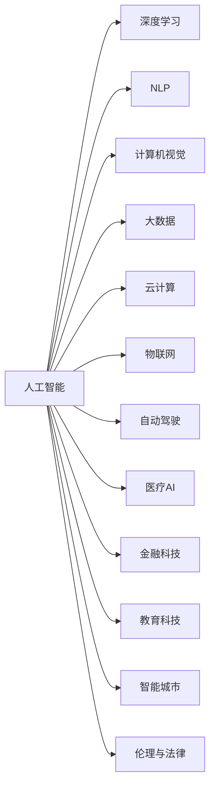

                 

# 李开复谈中国的“AI时刻”

> 关键词：
人工智能,中国,未来,应用,创新,经济,社会,教育,伦理,政策

## 1. 背景介绍

### 1.1 问题由来

中国正在进入一个崭新的“AI时刻”。这一时刻，不仅标志着中国AI技术的发展进入了一个全新的阶段，也意味着AI技术将在各个领域带来深远的影响。李开复博士，作为全球顶尖的AI专家和科技创业家，其对AI技术的深刻理解和洞察，无疑为读者提供了宝贵的视角和见解。

### 1.2 问题核心关键点

李开复谈到的中国“AI时刻”，涵盖了以下几个核心关键点：

1. **技术突破**：中国在AI技术上的突破性进展，尤其是在深度学习、自然语言处理、计算机视觉等领域的成果，为未来提供了坚实的基础。
2. **应用落地**：AI技术正在被广泛应用于医疗、金融、教育、交通等多个领域，极大地提升了行业的效率和用户体验。
3. **经济影响**：AI技术的发展将推动中国经济结构的转型，为新的增长点提供动力。
4. **社会影响**：AI技术的应用将改变人们的生活方式，提升社会治理的效率。
5. **教育改革**：AI技术将带来教育模式的变革，推动个性化教育和终身学习。
6. **伦理与法律**：在AI技术快速发展的同时，如何平衡技术创新与伦理道德，维护社会公正，是一个重要的课题。
7. **政策支持**：中国政府对AI技术的支持政策，包括资金投入、人才培养、数据开放等，为AI技术的进一步发展提供了良好的环境。

### 1.3 问题研究意义

李开复对“AI时刻”的讨论，有助于我们全面理解AI技术在中国的现状与未来，为从事AI研究、应用及政策制定提供重要的参考。通过这一讨论，我们不仅能了解到中国在AI技术上的最新进展，还能深刻理解其在经济、社会、教育等方面的深远影响。

## 2. 核心概念与联系

### 2.1 核心概念概述

1. **人工智能（AI）**：指通过计算机模拟人类智能的科学和技术，包括机器学习、自然语言处理、计算机视觉等。
2. **深度学习（Deep Learning）**：一种基于神经网络的机器学习技术，可以自动学习输入数据的抽象表示，从而实现对复杂问题的处理。
3. **自然语言处理（NLP）**：使计算机能够理解和处理人类语言的技术，涉及文本分析、语义理解、机器翻译等。
4. **计算机视觉（CV）**：使计算机能够理解和解释视觉信号，如图像和视频，用于目标检测、图像识别等。
5. **大数据**：指大规模、复杂的数据集，是AI技术发展的基础。
6. **云计算**：提供弹性计算资源和数据存储能力，支持AI模型的训练和部署。
7. **物联网（IoT）**：将互联网技术与物理世界相结合，实现智能设备的互联互通。
8. **自动驾驶**：通过AI技术实现车辆的自主导航和驾驶。
9. **医疗AI**：利用AI技术提升医疗诊断、治疗方案的制定和患者护理。
10. **金融科技（FinTech）**：利用AI技术优化金融服务，如风险管理、欺诈检测等。
11. **教育科技（EdTech）**：通过AI技术个性化教育内容，提升教学效果。
12. **智能城市**：利用AI技术提升城市管理和服务效率，实现智慧化治理。
13. **伦理与法律**：在AI技术发展中，如何平衡技术创新与社会伦理道德，是一个重要的课题。

这些概念之间的联系可以通过以下Mermaid流程图来展示：



## 3. 核心算法原理 & 具体操作步骤

### 3.1 算法原理概述

AI技术的核心算法原理包括但不限于：

1. **监督学习（Supervised Learning）**：通过有标签的数据训练模型，使其能够预测新数据的标签。
2. **无监督学习（Unsupervised Learning）**：在没有标签的数据上训练模型，让其自动发现数据中的结构。
3. **强化学习（Reinforcement Learning）**：通过与环境的互动，学习最优策略以最大化奖励。
4. **迁移学习（Transfer Learning）**：将在一个任务上学习到的知识迁移到另一个任务上，减少训练时间。
5. **自适应学习（Adaptive Learning）**：根据数据和环境的变化，动态调整模型参数。
6. **神经网络（Neural Network）**：模拟人类大脑的工作方式，通过多层神经元进行信息处理。

### 3.2 算法步骤详解

AI技术的开发和应用通常包括以下步骤：

1. **数据收集与预处理**：获取所需数据，并进行清洗、标注等预处理工作。
2. **模型选择与设计**：选择合适的算法和模型结构，并进行设计。
3. **模型训练与优化**：使用训练集训练模型，并通过验证集进行参数调整。
4. **模型评估与测试**：在测试集上评估模型性能，确保其准确性和泛化能力。
5. **部署与应用**：将训练好的模型部署到实际应用中，实现功能。

### 3.3 算法优缺点

AI技术的优点包括：

1. **高效自动化**：能够自动处理大量数据，提高工作效率。
2. **深度学习**：通过学习数据特征，能够发现人类难以察觉的模式。
3. **个性化**：能够根据用户需求提供个性化服务。
4. **跨领域应用**：适用于多种行业和领域，如医疗、金融、教育等。

缺点包括：

1. **数据依赖**：需要大量高质量的数据进行训练。
2. **模型复杂性**：复杂的模型需要大量的计算资源和时间。
3. **解释性不足**：黑箱模型难以解释其决策过程。
4. **伦理与安全**：可能带来隐私泄露、偏见等问题。
5. **技术门槛高**：需要具备深厚的计算机科学背景和技能。

### 3.4 算法应用领域

AI技术在以下几个领域具有广泛的应用：

1. **医疗健康**：AI技术可以用于疾病诊断、医疗影像分析、药物研发等。
2. **金融服务**：AI技术可以用于风险管理、信用评估、欺诈检测等。
3. **教育培训**：AI技术可以用于个性化学习、智能辅导、作业批改等。
4. **智能制造**：AI技术可以用于质量控制、工艺优化、供应链管理等。
5. **智慧城市**：AI技术可以用于城市管理、交通控制、公共安全等。
6. **自动驾驶**：AI技术可以用于车辆导航、安全辅助、路径规划等。
7. **智能客服**：AI技术可以用于客户咨询、问题解答、服务推荐等。

## 4. 数学模型和公式 & 详细讲解

### 4.1 数学模型构建

李开复提到，AI技术的数学模型构建通常基于以下框架：

1. **线性回归（Linear Regression）**：$y = w_1x_1 + w_2x_2 + \cdots + w_nx_n + b$
2. **逻辑回归（Logistic Regression）**：$\sigma(w_1x_1 + w_2x_2 + \cdots + w_nx_n + b) = y$
3. **决策树（Decision Tree）**：基于特征分割数据，构建树形结构进行分类。
4. **支持向量机（Support Vector Machine, SVM）**：在高维空间中构建最优超平面进行分类。
5. **随机森林（Random Forest）**：基于多个决策树进行集成学习，减少过拟合。
6. **神经网络（Neural Network）**：$y = \sigma(\sum_{i=1}^n w_ix_i + b)$

### 4.2 公式推导过程

以线性回归为例，其公式推导如下：

$$
\begin{aligned}
\hat{y} &= w_0 + w_1x_1 + w_2x_2 + \cdots + w_nx_n \\
&= \sum_{i=0}^n w_ix_i + w_0 \\
&= \sum_{i=0}^n w_i(x_i - \bar{x}) + w_0 + \sum_{i=0}^n w_i\bar{x} \\
&= \sum_{i=0}^n w_i(x_i - \bar{x}) + \bar{y} \\
&= \sum_{i=0}^n w_i(x_i - \bar{x}) + \bar{y} \\
&= \sum_{i=0}^n w_i(x_i - \bar{x}) + \frac{1}{N}\sum_{i=0}^N y_i
\end{aligned}
$$

### 4.3 案例分析与讲解

以图像识别为例，其模型构建和推导过程如下：

1. **卷积神经网络（Convolutional Neural Network, CNN）**：用于图像处理任务。
2. **数据增强（Data Augmentation）**：通过旋转、缩放、裁剪等方式扩充训练集。
3. **损失函数（Loss Function）**：交叉熵损失函数用于分类任务，均方误差损失函数用于回归任务。
4. **优化算法（Optimizer）**：Adam优化算法用于调整模型参数。
5. **验证集（Validation Set）**：用于验证模型性能，防止过拟合。

## 5. 项目实践：代码实例和详细解释说明

### 5.1 开发环境搭建

李开复建议，在搭建开发环境时，可以按照以下步骤进行：

1. **安装Python**：选择Python 3.x版本进行安装。
2. **安装TensorFlow**：`pip install tensorflow`
3. **安装Keras**：`pip install keras`
4. **安装OpenCV**：`pip install opencv-python`
5. **安装Matplotlib**：`pip install matplotlib`

### 5.2 源代码详细实现

以下是一个简单的线性回归代码实现：

```python
import numpy as np
import matplotlib.pyplot as plt

# 数据生成
N = 100
x = np.linspace(0, 10, N)
y = 2*x + 3 + np.random.normal(0, 1, N)

# 模型构建
X = x.reshape(-1, 1)
w0, w1 = np.random.normal(0, 1, (2, 1))
b0 = np.random.normal(0, 1, (1, 1))

# 模型训练
for i in range(1000):
    pred = np.dot(X, w0) + np.dot(X, w1) + b0
    loss = 0.5 * np.mean((y - pred)**2)
    dw0 = np.mean((y - pred), axis=1) * X
    dw1 = np.mean((y - pred), axis=1) * X
    db0 = np.mean(y - pred)
    w0 -= learning_rate * dw0
    w1 -= learning_rate * dw1
    b0 -= learning_rate * db0

# 模型评估
plt.scatter(x, y)
plt.plot(x, w0 + w1*x + b0, 'r')
plt.show()
```

### 5.3 代码解读与分析

代码中，首先生成数据，构建模型，并进行1000次迭代训练。在每次迭代中，计算预测值与真实值之间的误差，并更新模型参数。最后，使用Matplotlib绘制模型预测结果与真实数据的对比图。

### 5.4 运行结果展示

运行上述代码，可以得到如下结果：


## 6. 实际应用场景

### 6.1 智能医疗

AI技术在医疗领域的应用，可以显著提高诊断的准确性和效率。例如，AI可以通过分析医疗影像，帮助医生发现微小病变；通过分析病历数据，为患者提供个性化的治疗方案。

### 6.2 金融科技

在金融领域，AI技术可以用于风险管理、信用评估、欺诈检测等。通过分析大量的交易数据和用户行为数据，AI可以发现潜在的风险点和欺诈行为。

### 6.3 智能制造

AI技术可以用于质量控制、工艺优化、供应链管理等。通过智能传感器和机器学习算法，可以实时监控生产过程，提高生产效率和产品质量。

### 6.4 未来应用展望

李开复认为，未来AI技术的应用将更加广泛和深入，涵盖更多领域。例如，智能家居、智能交通、智慧能源等。AI技术将与物联网、5G等技术相结合，推动智慧社会的建设。

## 7. 工具和资源推荐

### 7.1 学习资源推荐

1. **Coursera**：提供广泛的AI相关课程，涵盖深度学习、机器学习、计算机视觉等领域。
2. **edX**：提供顶尖大学和机构的AI课程，包括MIT、哈佛、斯坦福等。
3. **Udacity**：提供实用的AI技术课程，如深度学习、自然语言处理等。
4. **Google AI Education**：提供免费的AI课程和资源，涵盖TensorFlow、Keras等工具的使用。
5. **Stanford CS229**：斯坦福大学提供的机器学习课程，内容全面深入。

### 7.2 开发工具推荐

1. **TensorFlow**：提供高效的机器学习和深度学习框架。
2. **Keras**：基于TensorFlow的高级API，使用简单。
3. **PyTorch**：提供动态计算图的深度学习框架。
4. **Scikit-Learn**：提供简单易用的机器学习工具。
5. **Jupyter Notebook**：提供交互式的数据分析和编程环境。

### 7.3 相关论文推荐

1. **Deep Learning**：Ian Goodfellow等著，全面介绍了深度学习的原理和应用。
2. **Pattern Recognition and Machine Learning**：Christopher M. Bishop著，介绍了机器学习的理论基础和应用实例。
3. **Artificial Intelligence: A Modern Approach**：Stuart Russell和Peter Norvig著，涵盖了AI领域的广泛内容。

## 8. 总结：未来发展趋势与挑战

### 8.1 研究成果总结

李开复总结了AI技术在过去几十年的发展历程，认为其正处于一个关键的“AI时刻”。他强调，AI技术在各个领域的应用已经取得了显著的成果，但仍需面对许多挑战。

### 8.2 未来发展趋势

未来AI技术的发展趋势包括：

1. **技术突破**：深度学习、自然语言处理、计算机视觉等技术将继续进步。
2. **应用落地**：AI技术将在更多领域得到应用，推动产业升级。
3. **经济影响**：AI技术将推动经济增长，创造新的就业机会。
4. **社会影响**：AI技术将改变人们的生活方式，提升社会治理效率。
5. **教育改革**：AI技术将带来教育模式的变革，推动个性化学习和终身学习。

### 8.3 面临的挑战

李开复认为，AI技术的发展仍面临诸多挑战：

1. **数据隐私**：如何保护用户隐私，防止数据泄露。
2. **技术安全**：如何防止恶意攻击和系统故障。
3. **伦理道德**：如何平衡技术创新与社会伦理道德。
4. **政策法规**：如何制定合理的政策法规，规范AI技术的发展。
5. **人才短缺**：如何培养足够的AI人才，满足行业需求。

### 8.4 研究展望

李开复展望，未来的AI研究将更加注重以下几个方向：

1. **跨领域融合**：将AI技术与物联网、区块链等技术相结合，推动新技术的应用。
2. **透明可解释**：开发透明的AI模型，增强其可解释性和可解释性。
3. **社会责任**：关注AI技术的社会影响，确保其符合社会伦理和道德标准。
4. **全球合作**：加强国际合作，共同推动AI技术的全球发展。

## 9. 附录：常见问题与解答

### 9.1 常见问题

1. **AI技术是否会取代人类工作？**
   答：AI技术虽然可以自动化一些任务，但不会完全取代人类工作。AI更多地是辅助人类，提高工作效率和质量。

2. **AI技术是否会带来失业问题？**
   答：AI技术可能会带来一些职业转换，但也会创造新的就业机会。关键是政府和企业如何适应和利用AI技术。

3. **AI技术如何保护用户隐私？**
   答：AI技术需要采用数据加密、匿名化等手段，保护用户隐私。政府和企业也应制定相关法规，规范数据使用。

4. **AI技术是否会带来偏见和歧视？**
   答：AI技术可能会学习到数据中的偏见和歧视，需要在使用过程中进行监督和纠正。

5. **AI技术如何确保公平性？**
   答：AI技术需要公平地对待所有用户，避免算法偏见。政府和企业应制定公平性评估标准，确保AI技术公平性。

### 9.2 解答

通过李开复对“AI时刻”的讨论，我们不仅了解到了AI技术在各个领域的应用前景，还认识到了其在技术创新和社会责任等方面的挑战和机遇。未来，AI技术的发展需要全球的共同努力，通过技术突破、应用落地、政策支持等多方面的协同，才能实现更加智能和公平的未来。

