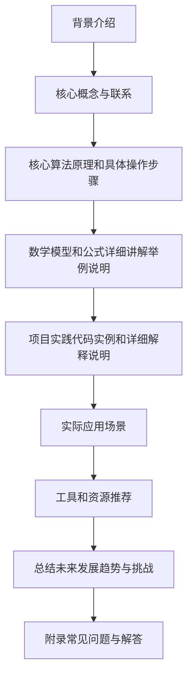
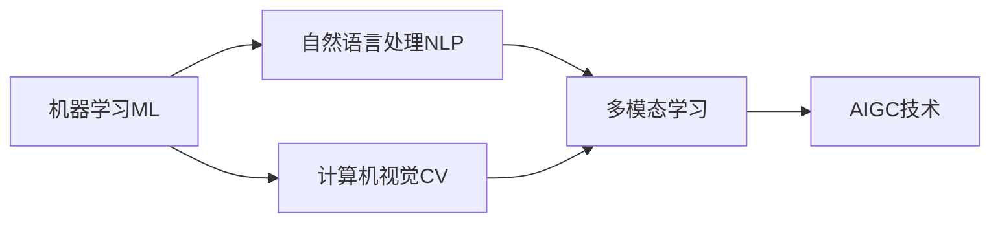

以下是根据给定要求撰写的技术博客文章正文内容：

# AIGC从入门到实战：AIGC 相关资源推荐

## 1. 背景介绍

### 1.1 问题的由来

在过去几年中，人工智能生成内容(AIGC)技术取得了长足进步,成为科技领域的一股重要力量。AIGC可以自动生成各种形式的内容,包括文本、图像、视频、音频等,极大地提高了内容创作的效率和质量。然而,对于初学者和普通用户来说,AIGC技术仍然存在一定的门槛和挑战,需要掌握相关的理论知识和实践技能。

### 1.2 研究现状

目前,AIGC技术主要涵盖了以下几个领域:

1. **自然语言处理(NLP)**: 用于生成文本内容,如新闻报道、小说、诗歌等。
2. **计算机视觉(CV)**: 用于生成图像和视频内容,如插画、动画、虚拟现实等。
3. **语音合成**: 用于生成音频内容,如语音助手、有声读物等。
4. **多模态融合**: 将上述多种技术融合,实现跨模态的内容生成,如将文本转换为图像或视频等。

各大科技公司和研究机构都在积极投入AIGC技术的研发,推出了多种创新产品和解决方案。但同时,AIGC技术也面临着一些挑战,如版权问题、内容质量控制、算法偏差等,需要进一步完善和优化。

### 1.3 研究意义

AIGC技术的发展对于提高内容创作效率、降低创作成本、促进创意创新等方面具有重要意义。通过系统地学习和掌握AIGC相关的理论知识和实践技能,可以更好地利用这一前沿技术,提升个人和企业的竞争力。同时,深入研究AIGC技术的原理和应用,也有助于推动该领域的持续创新和发展。

### 1.4 本文结构

本文将全面介绍AIGC技术的入门和实战知识,包括核心概念、算法原理、数学模型、实践案例、应用场景、工具资源等,旨在为读者提供一个系统的学习路径。文章结构如下:

## 2. 核心概念与联系

AIGC技术涉及多个领域的核心概念,包括:

1. **机器学习(ML)**: AIGC的基础是机器学习算法,如深度学习、强化学习等,用于从大量数据中提取特征和规律,构建内容生成模型。
2. **自然语言处理(NLP)**: 用于理解和生成自然语言文本,包括文本预处理、词向量表示、语言模型、序列到序列模型等。
3. **计算机视觉(CV)**: 用于理解和生成图像、视频等视觉内容,包括图像分类、目标检测、图像分割、生成对抗网络等。
4. **多模态学习**: 融合多种模态数据(如文本、图像、视频等),实现跨模态的内容理解和生成。

这些核心概念相互关联、相互依赖,共同构建了AIGC技术的理论基础和技术框架。例如,NLP和CV技术可以结合起来生成图文描述;多模态学习可以融合NLP、CV等多种能力,实现更加智能和复杂的内容生成任务。

## 3. 核心算法原理 & 具体操作步骤

### 3.1 算法原理概述

AIGC技术主要基于以下几种核心算法:

1. **序列到序列模型(Seq2Seq)**: 用于生成文本内容,如机器翻译、文本摘要、对话系统等。常用的Seq2Seq模型包括RNN、LSTM、Transformer等。
2. **生成对抗网络(GAN)**: 用于生成图像、视频等视觉内容。GAN由生成器和判别器两部分组成,通过对抗训练实现内容生成。
3. **变分自编码器(VAE)**: 也用于生成图像等视觉内容,是一种基于概率模型的生成式模型。
4. **多任务学习(MTL)**: 在单一模型中同时学习多个相关任务,提高模型的泛化能力和效率。
5. **元学习(Meta Learning)**: 通过学习任务之间的共性,快速适应新任务,提高模型的可迁移性。

这些算法各有特点,可根据具体的应用场景和需求进行选择和组合使用。

### 3.2 算法步骤详解

以Transformer为例,介绍Seq2Seq模型的具体操作步骤:

1. **数据预处理**: 对输入数据(如文本)进行标记化、填充、构建词典等预处理。
2. **词嵌入**: 将词条映射为词向量表示,作为Transformer的输入。
3. **位置编码**: 为序列中的每个词添加位置信息。
4. **多头注意力机制**: 捕捉输入序列中不同位置词与词之间的关系。
5. **前馈神经网络**: 对注意力输出进行非线性变换,提取更高层次的特征。
6. **残差连接和层归一化**: 避免梯度消失和梯度爆炸问题。
7. **掩码机制**: 确保模型只关注当前位置之前的输出。
8. **Beam Search解码**: 生成最优输出序列。

该算法步骤可通过PyTorch、TensorFlow等深度学习框架实现。

### 3.3 算法优缺点

Transformer等Seq2Seq模型的优点包括:

1. 并行计算,训练速度快
2. 长距离依赖建模能力强
3. 可扩展性好,易于加入新的组件

缺点包括:

1. 对长序列的处理能力有限
2. 需要大量数据和计算资源
3. 生成的内容质量仍有提升空间

### 3.4 算法应用领域

Seq2Seq模型在以下领域有广泛应用:

- 机器翻译
- 文本摘要
- 对话系统
- 代码生成
- 自动问答等

## 4. 数学模型和公式 & 详细讲解 & 举例说明

### 4.1 数学模型构建

AIGC技术中常用的数学模型包括:

1. **N-gram语言模型**: 用于捕捉文本中词与词之间的统计规律。
2. **神经网络模型**: 如RNN、LSTM、Transformer等,用于从数据中自动提取特征。
3. **生成模型**: 如高斯混合模型(GMM)、隐马尔可夫模型(HMM)等,用于对数据进行概率建模和采样。
4. **贝叶斯模型**: 如朴素贝叶斯、贝叶斯网络等,用于对不确定数据进行推理。

以N-gram语言模型为例,其基本思想是:给定历史词序列$w_1, w_2, ..., w_{n-1}$,计算下一个词$w_n$的条件概率:

$$P(w_n|w_1, w_2, ..., w_{n-1}) = \frac{C(w_1, w_2, ..., w_n)}{C(w_1, w_2, ..., w_{n-1})}$$

其中$C(...)$表示词序列的计数。由于计算复杂度太高,通常使用马尔可夫假设,只考虑有限的历史窗口:

$$P(w_n|w_1, ..., w_{n-1}) \approx P(w_n|w_{n-N+1}, ..., w_{n-1})$$

这就是N-gram模型,N通常取2(双gram)或3(三gram)。

### 4.2 公式推导过程

以LSTM(Long Short-Term Memory)为例,介绍其核心公式的推导过程。

LSTM是一种特殊的RNN(循环神经网络),旨在解决长期依赖问题。它包含一个记忆细胞状态$c_t$,通过遗忘门$f_t$、输入门$i_t$和输出门$o_t$控制信息的流动:

$$\begin{aligned}
f_t &= \sigma(W_f\cdot[h_{t-1}, x_t] + b_f) \
i_t &= \sigma(W_i\cdot[h_{t-1}, x_t] + b_i) \
\tilde{C}_t &= \tanh(W_C\cdot[h_{t-1}, x_t] + b_C) \
C_t &= f_t \odot C_{t-1} + i_t \odot \tilde{C}_t \
o_t &= \sigma(W_o\cdot[h_{t-1}, x_t] + b_o) \
h_t &= o_t \odot \tanh(C_t)
\end{aligned}$$

其中:
- $\sigma$是sigmoid激活函数
- $\odot$是元素wise乘积
- $f_t$、$i_t$、$o_t$分别是遗忘门、输入门、输出门的激活值
- $\tilde{C}_t$是当前时刻的候选记忆细胞状态
- $C_t$是当前时刻的记忆细胞状态,由上一时刻的记忆细胞状态和当前输入调节
- $h_t$是LSTM的输出,由记忆细胞状态和输出门调节

通过门控机制,LSTM可以很好地捕捉长期依赖信息,并避免梯度消失或爆炸问题。

### 4.3 案例分析与讲解

假设有一个任务是根据一个人的个人信息(如姓名、年龄、职业等)自动生成这个人的个人简历。我们可以使用Seq2Seq模型(如Transformer)来完成这个任务。

首先,我们需要构建训练数据集,包括一些人的个人信息(作为输入)和对应的个人简历(作为输出)。然后,将这些数据输入Transformer模型进行训练。

在训练过程中,Transformer会学习到输入个人信息和输出简历之间的映射关系。具体来说,编码器会将输入的个人信息序列编码为一系列向量表示,解码器则根据这些向量表示生成对应的简历文本。

在推理阶段,我们可以输入一个新的个人信息,Transformer会自动生成对应的个人简历。生成的简历质量取决于模型的训练质量和数据集的覆盖程度。

此外,我们还可以引入一些先验知识(如简历的典型结构和语言风格),通过模型微调或数据增强的方式,进一步提高生成质量。

### 4.4 常见问题解答

**Q: 为什么需要门控机制?**

A: 门控机制(如LSTM中的遗忘门、输入门、输出门)可以有效控制信息的流动,决定保留、遗忘或更新哪些信息。这有助于LSTM捕捉长期依赖关系,避免梯度消失或爆炸问题。

**Q: 为什么需要残差连接和层归一化?**

A: 残差连接可以让梯度直接传递,避免梯度消失;层归一化则可以加快模型收敛,提高训练稳定性。这两种技术在深度神经网络中被广泛应用。

**Q: 生成对抗网络(GAN)是如何工作的?**

A: GAN由生成器和判别器组成。生成器从噪声中生成假样本,判别器则判断样本是真是假。两者通过对抗训练,生成器逐步学习生成更逼真的样本,判别器也变得更加强大。最终,生成器可以生成无法被判别器区分的样本。

**Q: 如何评估生成内容的质量?**

A: 常用的评估指标包括:
- 对于文本,可以使用BLEU、ROUGE等指标,评估生成文本与参考文本的相似度。
- 对于图像,可以使用FID(Frechet Inception Distance)、IS(Inception Score)等指标,评估生成图像的质量和多样性。
- 人工评估也是必要的,可以邀请