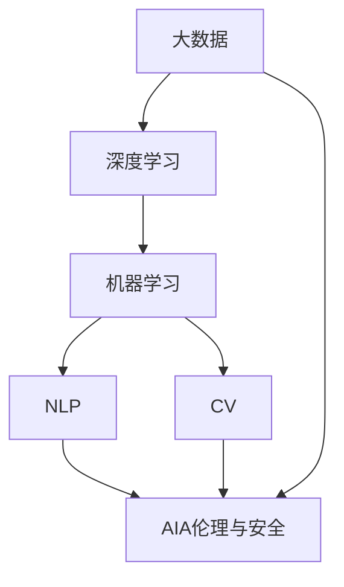

                 

# 李开复：AI 2.0 时代的未来展望

> 关键词：人工智能，AI 2.0，未来发展趋势，机器学习，深度学习，大数据，跨领域应用，伦理，安全性，创新，行业变革

## 1. 背景介绍

### 1.1 问题由来
随着人工智能技术的飞速发展，我们即将进入AI 2.0时代，即人工智能与各个行业深度融合的阶段。AI 2.0不再仅仅是高端科研机构的专利，而是开始渗透到各行各业，改变着人类的生产生活方式。如何在这个新时代下，更好地理解和应用人工智能，成为当前社会关注的焦点。

### 1.2 问题核心关键点
AI 2.0的核心在于将人工智能技术应用到实际场景中，实现行业智能化。与传统的AI 1.0时代相比，AI 2.0更加强调数据的获取和处理，以及模型在实际环境中的泛化能力。因此，AI 2.0时代的关键点包括：

- 数据量的增长：AI 2.0需要海量的数据来训练和优化模型。
- 模型复杂度的提升：深度学习和大数据技术的应用，使得模型的复杂度不断增加。
- 跨领域应用的普及：AI 2.0技术的应用范围不断扩大，从自然语言处理、计算机视觉到医疗、金融等各个领域。
- 伦理和安全性：随着AI技术的广泛应用，伦理和安全性问题也日益突出。
- 行业的变革：AI 2.0技术正在推动各行业的数字化转型，带来颠覆性的变革。

### 1.3 问题研究意义
研究AI 2.0时代的未来展望，有助于更好地理解人工智能技术的发展趋势，明确其在各个行业的应用方向，为未来的研究和应用提供指导。AI 2.0时代的大数据、深度学习和跨领域应用，将推动经济社会的全面数字化转型，带来巨大的经济效益和社会价值。

## 2. 核心概念与联系

### 2.1 核心概念概述

在AI 2.0时代，涉及到的核心概念包括：

- **大数据**：是指规模巨大、多样、实时产生的数据，是AI 2.0的基础。
- **深度学习**：是一种模拟人脑神经网络结构的机器学习方法，通过多层非线性变换，实现对数据的复杂建模。
- **机器学习**：是一种使机器通过数据分析和经验优化，提升性能的技术。
- **自然语言处理(NLP)**：是指使计算机能够理解、处理和生成人类语言的技术。
- **计算机视觉(CV)**：是指使计算机能够通过图像和视频，理解和解释现实世界的技术。
- **AI伦理与安全**：是指在AI应用过程中，如何确保技术的道德性和安全性，避免负面影响。

这些核心概念之间存在紧密的联系，共同构成了AI 2.0时代的知识体系。大数据为深度学习提供了数据支撑，深度学习提升了机器学习的效率和效果，机器学习应用到各个领域，推动了NLP和CV等技术的发展，而NLP和CV等技术的进步又促进了AI伦理与安全的研究。

### 2.2 概念间的关系

这些核心概念之间的关系可以用以下Mermaid流程图来展示：



这个流程图展示了大数据、深度学习、机器学习、NLP、CV和AI伦理与安全之间的联系。大数据为深度学习提供了数据支撑，深度学习提升了机器学习的效率和效果，机器学习应用到NLP和CV等技术中，而NLP和CV等技术的发展，反过来又促进了AI伦理与安全的研究。

## 3. 核心算法原理 & 具体操作步骤

### 3.1 算法原理概述

AI 2.0时代的主要算法原理包括深度学习、强化学习、迁移学习等。其中，深度学习是最为核心的技术，通过多层神经网络结构，实现对复杂数据的高效建模和分析。

深度学习算法的基本流程包括数据预处理、模型训练、参数优化和模型评估等步骤。具体来说，深度学习模型通常包含多个隐层，每个隐层通过非线性变换，将输入数据映射到更高维度的特征空间，从而实现对复杂数据的建模。

### 3.2 算法步骤详解

深度学习的具体步骤包括：

1. **数据预处理**：将原始数据转换为模型所需的格式，包括数据清洗、归一化、分割等步骤。
2. **模型构建**：选择合适的深度学习模型结构，如卷积神经网络(CNN)、循环神经网络(RNN)、长短时记忆网络(LSTM)等，并设定模型参数。
3. **模型训练**：通过反向传播算法，计算模型参数的梯度，并使用优化算法(如Adam、SGD等)更新模型参数，最小化损失函数。
4. **模型评估**：在测试集上评估模型性能，如准确率、精确率、召回率等指标。
5. **模型调优**：根据评估结果，调整模型参数，进一步提升模型性能。

### 3.3 算法优缺点

深度学习的优点包括：

- 高效建模：能够处理大规模、复杂的数据，实现对复杂问题的建模。
- 特征提取：自动学习数据的高级特征，减少了手工设计特征的复杂性。
- 鲁棒性强：通过多层非线性变换，提高了模型的泛化能力。

深度学习的缺点包括：

- 计算资源需求高：需要大量的计算资源进行训练和推理。
- 过拟合风险高：模型复杂度增加，容易发生过拟合。
- 可解释性差：深度学习模型通常被视为"黑盒"，难以解释其内部工作机制。

### 3.4 算法应用领域

深度学习技术在AI 2.0时代广泛应用于以下领域：

- **自然语言处理(NLP)**：包括机器翻译、文本分类、情感分析、问答系统等任务。
- **计算机视觉(CV)**：包括图像分类、目标检测、人脸识别、图像生成等任务。
- **语音识别和生成**：包括语音识别、语音合成、语音情感分析等任务。
- **医疗健康**：包括医学影像分析、疾病预测、智能诊断等任务。
- **金融风控**：包括信用评估、欺诈检测、风险预警等任务。

## 4. 数学模型和公式 & 详细讲解 & 举例说明

### 4.1 数学模型构建

深度学习模型的基本数学模型为神经网络结构。以卷积神经网络(CNN)为例，其数学模型包括卷积层、池化层、全连接层等。

以卷积神经网络为例，其基本数学模型包括：

- **卷积层**：对输入数据进行卷积操作，提取局部特征。
- **池化层**：对卷积层的输出进行下采样，减少特征数量，提高计算效率。
- **全连接层**：将池化层的输出展开成一维向量，进行分类或回归等任务。

### 4.2 公式推导过程

以卷积神经网络的卷积层为例，其公式推导过程如下：

设输入数据为 $X$，卷积核为 $K$，卷积操作后的输出为 $Y$，则卷积操作的公式为：

$$
Y_{i,j} = \sum_{m=0}^{H-1} \sum_{n=0}^{W-1} K_{m,n} \cdot X_{i+m,j+n}
$$

其中 $H$ 和 $W$ 分别为卷积核的高和宽，$i$ 和 $j$ 分别为输出数据的行和列。

### 4.3 案例分析与讲解

以图像分类任务为例，我们可以使用卷积神经网络来实现。首先，将图像数据转换为二维张量形式，输入到卷积层中进行卷积操作，得到一系列特征图。然后，通过池化层进行下采样，减少特征数量。最后，将池化层的输出展开成一维向量，输入到全连接层进行分类。

## 5. 项目实践：代码实例和详细解释说明

### 5.1 开发环境搭建

要实现卷积神经网络的图像分类任务，首先需要搭建开发环境。以下是一个基本的搭建流程：

1. **安装Python**：确保开发机上有Python 3.x环境。
2. **安装TensorFlow**：使用pip安装TensorFlow 2.x版本。
3. **安装Keras**：使用pip安装Keras，这是一个基于TensorFlow的高层次神经网络API。
4. **安装NumPy和Matplotlib**：这些库用于数据处理和可视化。

### 5.2 源代码详细实现

以下是一个使用Keras实现卷积神经网络的图像分类任务的示例代码：

```python
import keras
from keras.datasets import cifar10
from keras.models import Sequential
from keras.layers import Conv2D, MaxPooling2D, Flatten, Dense

# 加载CIFAR-10数据集
(x_train, y_train), (x_test, y_test) = cifar10.load_data()

# 数据预处理
x_train = x_train / 255.0
x_test = x_test / 255.0

# 定义模型
model = Sequential()
model.add(Conv2D(32, (3, 3), activation='relu', input_shape=(32, 32, 3)))
model.add(MaxPooling2D((2, 2)))
model.add(Conv2D(64, (3, 3), activation='relu'))
model.add(MaxPooling2D((2, 2)))
model.add(Conv2D(64, (3, 3), activation='relu'))
model.add(Flatten())
model.add(Dense(64, activation='relu'))
model.add(Dense(10, activation='softmax'))

# 编译模型
model.compile(optimizer='adam', loss='categorical_crossentropy', metrics=['accuracy'])

# 训练模型
model.fit(x_train, y_train, epochs=10, batch_size=64, validation_data=(x_test, y_test))

# 评估模型
score = model.evaluate(x_test, y_test, verbose=0)
print('Test loss:', score[0])
print('Test accuracy:', score[1])
```

### 5.3 代码解读与分析

以上代码实现了使用Keras实现卷积神经网络的图像分类任务。具体步骤如下：

1. **数据加载**：使用CIFAR-10数据集加载图像和标签数据。
2. **数据预处理**：将图像数据归一化到[0, 1]范围内，并进行预处理。
3. **模型定义**：定义卷积神经网络模型结构，包括卷积层、池化层、全连接层等。
4. **模型编译**：使用adam优化器和交叉熵损失函数编译模型。
5. **模型训练**：使用训练集数据进行模型训练，指定训练轮数和批大小。
6. **模型评估**：使用测试集数据评估模型性能。

## 6. 实际应用场景

### 6.1 智能医疗

AI 2.0技术在医疗领域的应用前景广阔。通过深度学习和大数据技术，可以实现医学影像分析、疾病预测、智能诊断等任务。例如，使用卷积神经网络对医学影像进行分类和分割，可以辅助医生进行诊断和治疗。

### 6.2 金融风控

AI 2.0技术在金融领域可以用于信用评估、欺诈检测、风险预警等任务。例如，使用深度学习模型对历史交易数据进行建模，预测未来交易行为，识别异常交易，从而降低金融风险。

### 6.3 智能制造

AI 2.0技术在制造业中的应用，可以用于设备状态监测、质量检测、智能维护等任务。例如，使用卷积神经网络对生产设备图像进行分类和识别，检测设备异常，提前进行维护。

### 6.4 未来应用展望

未来，AI 2.0技术将在更多领域得到应用，带来颠覆性的变革。以下是一些可能的未来应用：

- **自动驾驶**：AI 2.0技术可以用于自动驾驶汽车，通过计算机视觉和传感器数据，实现对道路环境的感知和决策。
- **智能家居**：AI 2.0技术可以用于智能家居系统，通过自然语言处理和计算机视觉，实现智能控制和交互。
- **智慧城市**：AI 2.0技术可以用于智慧城市建设，通过物联网和数据分析，实现城市管理的智能化和高效化。
- **个性化推荐**：AI 2.0技术可以用于个性化推荐系统，通过深度学习和大数据分析，实现对用户行为的精准预测和推荐。

## 7. 工具和资源推荐

### 7.1 学习资源推荐

- **《深度学习》（Ian Goodfellow等著）**：深度学习领域的经典教材，涵盖了深度学习的基础理论和应用实践。
- **《机器学习实战》（Peter Harrington著）**：机器学习实践指南，介绍了机器学习的基本概念和实现方法。
- **《Python数据科学手册》（Jake VanderPlas著）**：数据科学领域的实用指南，介绍了Python数据科学库的使用。
- **Coursera深度学习课程**：由深度学习领域的专家开设，涵盖深度学习的基础知识和应用实践。
- **Kaggle数据科学竞赛平台**：提供大量的数据科学竞赛和案例，可以用于实践和提升。

### 7.2 开发工具推荐

- **TensorFlow**：由Google开发的深度学习框架，支持分布式计算和大规模数据处理。
- **Keras**：基于TensorFlow的高层次神经网络API，使用简单，易于上手。
- **PyTorch**：由Facebook开发的深度学习框架，支持动态计算图和高效的模型训练。
- **Jupyter Notebook**：用于数据科学和机器学习的交互式开发环境。
- **Google Colab**：Google提供的免费在线Jupyter Notebook环境，支持GPU计算和云存储。

### 7.3 相关论文推荐

- **ImageNet Large Scale Visual Recognition Challenge（ILSVRC）**：每年一度的图像分类竞赛，展示了最新的深度学习技术进展。
- **Deep Learning（Goodfellow等著）**：深度学习领域的经典教材，涵盖了深度学习的基本理论和实践方法。
- **Neural Networks and Deep Learning（Goodfellow等著）**：深度学习领域的经典教材，涵盖了深度学习的基本理论和实践方法。
- **Attention Is All You Need**（Vaswani等著）：Transformer模型的原论文，展示了自注意力机制在自然语言处理中的应用。

## 8. 总结：未来发展趋势与挑战

### 8.1 研究成果总结

AI 2.0时代，深度学习和跨领域应用取得了巨大的进步，推动了各行业的数字化转型。未来的研究方向包括：

- **模型压缩与优化**：通过模型压缩和优化，提高深度学习模型的计算效率和可解释性。
- **数据隐私与安全**：在AI应用过程中，如何保护用户隐私和数据安全，是一个重要的研究方向。
- **跨领域知识融合**：如何通过深度学习技术，实现跨领域知识的融合与协同，是未来研究的重要方向。
- **智能系统的人机交互**：如何构建更加自然、流畅的人机交互系统，是未来研究的重要方向。

### 8.2 未来发展趋势

未来，AI 2.0技术将在各个领域得到更广泛的应用，带来颠覆性的变革。以下是一些可能的未来发展趋势：

- **智能系统普及化**：AI 2.0技术将在更多领域得到应用，如智能医疗、智能制造、智能家居等。
- **跨领域知识融合**：AI 2.0技术将实现跨领域知识的融合与协同，如跨领域知识图谱、跨领域数据共享等。
- **模型压缩与优化**：AI 2.0技术将实现模型压缩与优化，提高计算效率和可解释性。
- **数据隐私与安全**：AI 2.0技术将实现数据隐私与安全的保护，如联邦学习、差分隐私等技术。

### 8.3 面临的挑战

尽管AI 2.0技术取得了巨大的进展，但在未来的应用过程中，仍面临诸多挑战：

- **数据隐私与安全**：如何在AI应用过程中保护用户隐私和数据安全，是一个重要的挑战。
- **模型公平性与透明性**：如何确保AI模型的公平性与透明性，避免模型偏见和歧视，是一个重要的挑战。
- **模型鲁棒性与泛化性**：如何在AI应用过程中，确保模型的鲁棒性与泛化性，避免模型过拟合和泛化能力不足，是一个重要的挑战。
- **模型可解释性与可控性**：如何提高AI模型的可解释性和可控性，避免"黑盒"模型，是一个重要的挑战。

### 8.4 研究展望

未来，AI 2.0技术将在各领域得到更广泛的应用，带来颠覆性的变革。以下是一些可能的未来研究方向：

- **模型公平性与透明性**：通过研究AI模型的公平性与透明性，确保模型不带有偏见和歧视。
- **模型鲁棒性与泛化性**：通过研究AI模型的鲁棒性与泛化性，确保模型具有较高的泛化能力和鲁棒性。
- **模型可解释性与可控性**：通过研究AI模型的可解释性和可控性，提高模型的透明度和可控性。
- **跨领域知识融合**：通过研究跨领域知识的融合与协同，实现跨领域知识的共享与应用。

总之，AI 2.0技术将在未来推动各行业的数字化转型，带来巨大的经济效益和社会价值。通过不断的研究和创新，我们将能够构建更加智能、高效、安全、可靠的人工智能系统，为人类社会的未来发展提供强大的支持。

## 9. 附录：常见问题与解答

### Q1: AI 2.0技术在医疗领域有哪些应用？

A: AI 2.0技术在医疗领域可以用于医学影像分析、疾病预测、智能诊断等任务。例如，使用卷积神经网络对医学影像进行分类和分割，可以辅助医生进行诊断和治疗。

### Q2: 深度学习在图像分类任务中的优缺点有哪些？

A: 深度学习的优点包括高效建模、特征提取、鲁棒性强等。缺点包括计算资源需求高、过拟合风险高、可解释性差等。

### Q3: AI 2.0技术在金融领域有哪些应用？

A: AI 2.0技术在金融领域可以用于信用评估、欺诈检测、风险预警等任务。例如，使用深度学习模型对历史交易数据进行建模，预测未来交易行为，识别异常交易，从而降低金融风险。

### Q4: AI 2.0技术在智能制造中的应用有哪些？

A: AI 2.0技术在制造业中的应用，可以用于设备状态监测、质量检测、智能维护等任务。例如，使用卷积神经网络对生产设备图像进行分类和识别，检测设备异常，提前进行维护。

### Q5: AI 2.0技术的未来发展趋势有哪些？

A: AI 2.0技术的未来发展趋势包括智能系统普及化、跨领域知识融合、模型压缩与优化、数据隐私与安全等。这些趋势将推动AI 2.0技术在更多领域得到应用，带来颠覆性的变革。

---

作者：禅与计算机程序设计艺术 / Zen and the Art of Computer Programming

